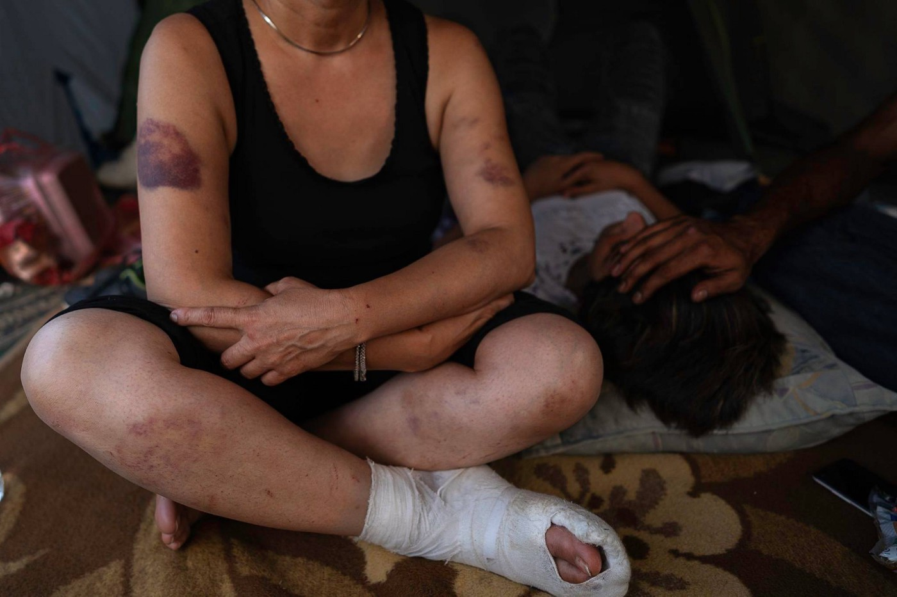

### AYS SPECIAL from Bosnia: Violent push\-backs of women travelling from Croatia and Slovenia

_Many women who have escaped from countries with widespread violence cannot move legally throughout Europe due to tight border controls\. For this reason, some of them have become trapped in Bosnian makeshift camps with a lack of adequate shelter, sanitation and safety\. This is a story about their journey\._

Photo by Enzo Tomasiello

_“I was begging them, please, I am a lone woman, just with my son\. I came here for the future of my son\. Please, don’t beat me\. Please, I need your country to help me\!”,_ said to me Eram, a 47\-year old single mother from Iran, while showing me her bruised body and telling me about her experience of brutal police push\-backs from Croatia to Bosnia\.

Eram \( _her name is changed for the purpose of this article_ \), like other hundreds of women, travelled either through Turkey or Greece to the Bosnian\-Croatian border, with the hope to travel further into Europe and find safety there for them and their families\. Although these women have escaped from countries with widespread violence, such as Syria, Afghanistan, and Iran, they cannot legally move forward due to the tight EU border controls\. For this reason, they get trapped in Bosnian makeshift camps with a lack of adequate shelter, sanitation and safety\. With the aim of asylum in Europe they regularly leave these camp settlements and walk through the mountains and forests for days and weeks while trying to fulfil this\. When they are detected by the border patrols, they do not find support there\. Instead, most experience a denial of the asylum procedures by Croatian and Slovenian border patrols, who further use physical attacks, sexual harassment, verbal threats, robbery, damage of private belongings and illegally deport the women back to Bosnia\.

These violent attacks have been happening in front of the eyes of their children, husbands, siblings and friends, who can do nothing more than silently watch the humiliation of the women they love due to the lack of power they have against the police forces\.

During the last two months, I have been volunteering with the organisation [No Name Kitchen](https://www.facebook.com/NoNameKitchenBelgrade/) in Velika Kladuša, a town located next to the Bosnian\-Croatian border, where I am in touch daily with the victims of border police violence\. Our organisation has observed the rapid increase of brutal treatments of women who have tried to exercise their right to claim asylum in the EU\.

**During the last two weeks, we have detected 17 cases of female violent push\-backs from the Slovenian and Croatian** borders back to Bosnia, and almost half of these cases involved minors\.

Eram, one of the women denied access to the asylum procedure and violently treated by the Croatian border patrols, further told me:

_“I just wanted to go to Slovenia, but the Croatian police caught me on the way\. The police took all my money, 500 euros, and put inside of their pockets\. They took all our mobiles, they took my son’s laptop, they slapped me on my mouth and everywhere\. I could smell alcohol from them\. When they were deporting us back to Bosnia, they acted like animals\. They were hitting us and laughing at our backs\. They had both metal sticks and electric sticks\. One police man hit me that I fall on the ground, and after he was hitting me by a baton, and after every hit he was laughing: “Ha, ha, ha, ha\!”\. After, they slapped me into my mouth\. They also hit my son, they slapped him into his face\. … I had to leave Iran because I left my husband who was beating me\. If I come back my husband kills me\. The government in my country is a big problem\. But they would never beat a woman\. I thought here is Europe, democracy, and human rights\. But here police beats women and no help”_ \(Eram\) \.

Besides brutal physical attacks, border patrols often use sexual harassment and Islamophobia as a tool of deterrence while deporting the women back from the EU borders\.

Marva, a 42 year old woman from Afghanistan, walked with her children and another family for ten days from Bosnia to Slovenia with only limited water and food in 35 degree temperatures\. When they reached Slovenia the whole group was caught by the police, to whom they expressed their wish to apply for asylum in Slovenia\.

Photo by Pablo Herrerías Valls

But the only response they received from the police was: _“Tomorrow deport, you can’t stay here\. Here is not Afghanistan\!”_ \. Then, the Slovenian police stripped them all naked, including the women and children, and frisked their bodies, touching the women’s intimate body parts:

_“I said to the police that I was a Muslim and refused to take off my clothes\. But they said, “No problem” and took off all my clothes\. They forced me to take all my clothes off, and kept repeating to me: “Pička matrina, pička materina \[mother fucker\]”\. The children were crying so much\. After, the police told me and other women maybe five times or six times to take off our scarfs, but I did not want to\. My son was scared and told me: “Mum, please, remove your scarf because otherwise maybe they hit you\.” I was crying\. And the police removed the scarf from my head and threw it on the ground\. It was very difficult for me\. The policeman told me: “This is the last time that you wore your scarf\. Here is not Afghanistan, here is Slovenia, here is no Islam\!””_ \(Marva\) \.

_“For police, there is no difference if woman or man\. They treat us the same, like we are animals\. But us women, we are more sexually harassed\.” \(Marva’s 15 year old daughter\) \._

After that, the whole family was handed over to the Croatian police who stole their phones and money and deported them back to Bosnia\.

Similarly, to Marva, Fatima and her 15\-year old daughter from Iran, told me that they were also stripped naked when they were caught by the Croatian police, who touched their breasts and genitals while frisking their bodies\. Those women who refused the body frisk were physically attacked by the police officers and made to take off their clothes\. Fatima and her daughter were further threatened and physically attacked during their deportation back to Bosnia:

_“They \[police\] drove us by a van to the mountains, where was nothing, just steep hills surrounded by trees and thorny plants \[showing scratches around her legs and feet\] \. They told us to get off the car\. I was walking out of the car in front of my husband\. I could hear that the police started beating him with batons, but I did not see it as I was with my back towards him, walking in front\. My small daughter was walking as the last one and she saw her father being beaten\. When my daughter saw her father being beaten, she said to the police: “Please, stop beating my father and beat me instead of him\.” And the police started beating my daughter \[pointing at her daughter’s swollen eye and crying\] \. In this mountain way, the police said to me: “Go straight go back\!”\. But I told him, “Where back? Where? I don’t know where,” as there was just a steep hill full of trees and thorny plants\. The police took a gun and put it into my head and shouted: “Go, go, go\!”\. and I was so scared, I thought he was going to kill me \[crying\]”_ \(Fatima\) \.

These stories demonstrate that the women who are primarily loving mothers, wives, friends and individual human beings with their dreams of a better future in Europe are treated by the border authorities only as strangers and criminals due to their colour of face and lack of legal documents\.

Based on these discriminative and ideologist assumptions, these women are daily stripped of their basic human rights within the oppressive regimes of the EU border and asylum systems\. **The brutal treatment of women, who are the most vulnerable and in need of protection together with their children in transit, signify the failure of the EU borders and are against international asylum law and human rights\.**

Based on the so called _non\-refoulement_ principle, EU states are obliged to access the case of asylum seekers regardless of whether they are granted the status of a refugee and thereby international protection, and not to return her or him to a state where he or she faces a threat to life or liberty \(UNHCR, 1967\) \. Furthermore, according to the EU Directive on Asylum Procedures \(2005/85/EC\) those recognised as ‘irregular’ migrants are entitled to information about asylum, translation assistance, the ability to present their case to a competent authority, notification of the outcome, and the right to appeal a negative decision \(Vaughan\-Williams, 2015\) \. These were all ignored by the Croatian and Slovenian border police\.

As the stories here show, the violent ‘defence’ border mechanisms do not discourage displaced women from attempting to exercise their right to find asylum in the EU\. These mechanisms only make their journey more hazardous and their lives, already scored with countless episodes of violence, that much more painful\. The result of the gender\-oriented violent deportations is not only return to the hazardous living conditions in the makeshift camps in Bosnia, but mainly tears, pain, injuries, bruises, psychological distress, and in some cases neurosis\.

**_REFERENCES_**

_UNHCR \(1967\) [Convention and Protocol Relating to the Status of Refugees](http://www.unhcr.org/protect/PROTECTION/3b66c2aa10.pdf) \. \[Online\] \._

_Vaughan\-Williams, N\. \(2015\) Europe’s Border Crisis, Oxford: Oxford University Press\._

**_\(By Karolina Augustova, No Name Kitchen, Velika Kladuša\)_**

> **We strive to echo correct news from the ground through collaboration and fairness\.** 

> **Every effort has been made to credit organizations and individuals with regard to the supply of information, video, and photo material \(in cases where the source wanted to be accredited\) \. Please notify us regarding corrections\.** 

> **If there’s anything you want to share or comment, contact us through Facebook or write to: areyousyrious@gmail\.com** 

_Converted [Medium Post](https://medium.com/are-you-syrious/ays-special-from-bosnia-violent-push-backs-of-women-from-croatia-and-slovenia-aa4c8b5c9e6d) by [ZMediumToMarkdown](https://github.com/ZhgChgLi/ZMediumToMarkdown)._
