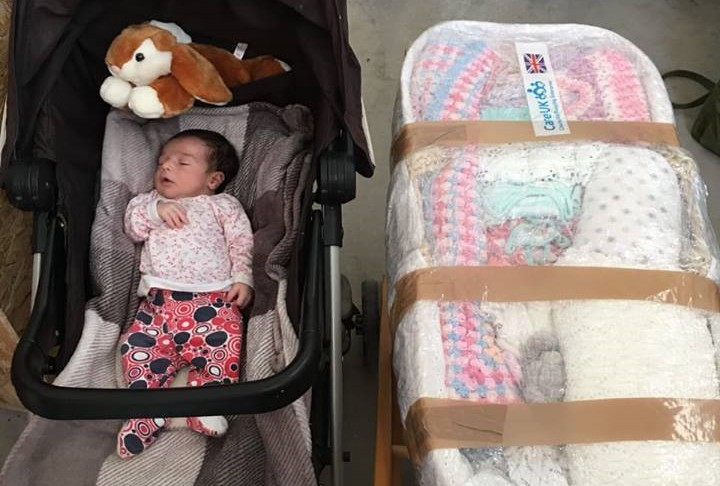
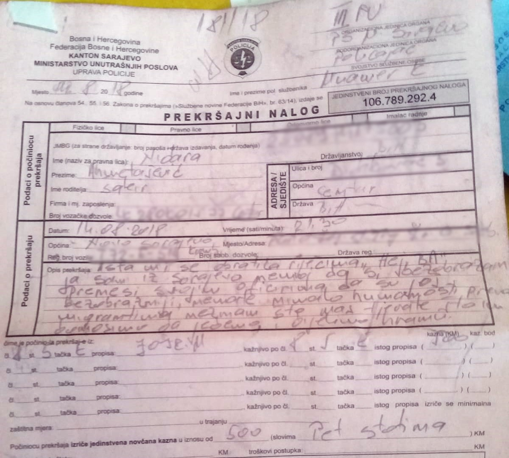
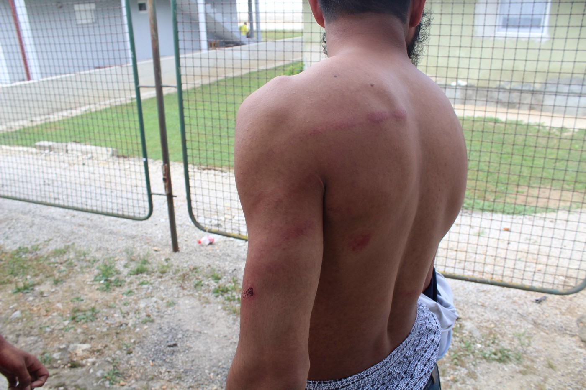
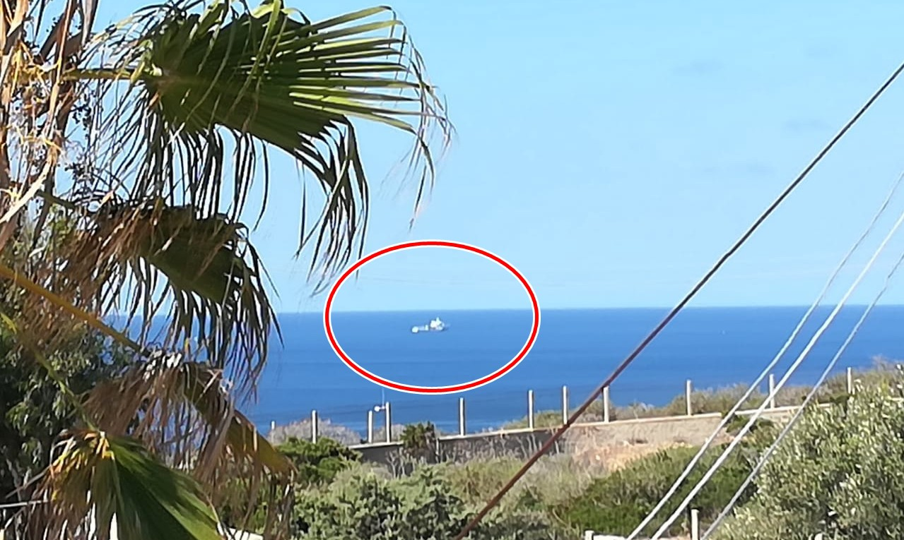
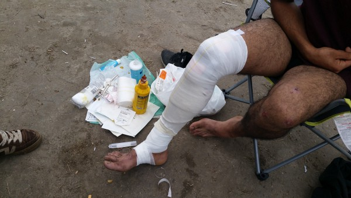
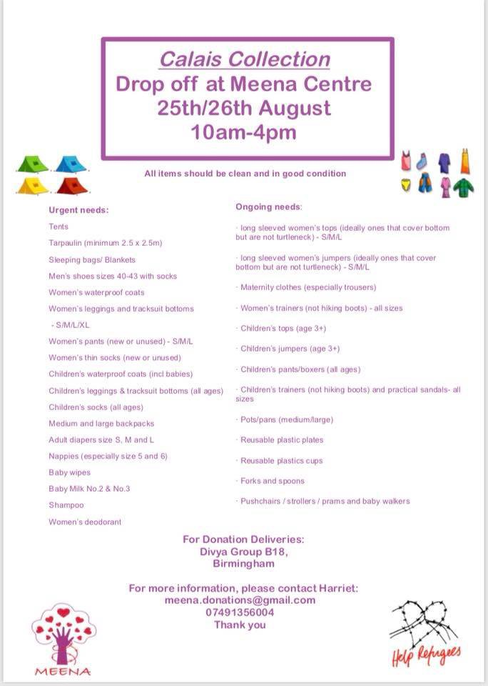

### AYS Weekend Digest: 18\-19/08/18: AYS volunteers bullied by police in Sarajevo

_More than 10,000 refugees stuck on Lesvos / Teachers and educational materials needed in Athens / Germany reaches an agreement with Greece to start returning refugees / Refugee paths grow more dangerous as people try to avoid pushbacks from Croatia / Hungarian authorities deny food to people in transit zones / Diciotti ship stranded with 177 people aboard off Italian coast / Families kept locked up illegally in Caricole detention center in Belgium / A medical volunteer describes conditions in Calais / And more news…_

](assets/b0097f0438b8/1*pmDF-b-ZeLGIJVcm395Ukg.jpeg)

Photo credit: [Mohammad Alaa Aljaleel](https://www.facebook.com/profile.php?id=100009229294674&hc_location=group_dialog)
### FEATURE: A call for solidarity on World Humanitarian Day

Today is World Humanitarian Day, a day dedicated to recognizing humanitarian personnel and those who have lost their lives working for humanitarian causes\. **Yet, today more than ever, humanitarian support of refugees is being criminalized across Europe** \. Policies are being written by people with small minds and even smaller hearts\. Boats are prevented from assisting drowning refugees in the Mediterranean, human rights defenders are threatened and even detained in the Balkans, Hungary, and France, and others are facing trial in Malta and Italy for saving human lives\. Above all, the people who suffer from these policies are not volunteers, who, despite police action, still have the benefit of their citizenship\. The true victims of these policies are the refugees, whose voices are silenced, whose rights are ignored, who are beaten and abused as they try to find a better life\.

While we are still waiting for the court decision in the case against an AYS volunteer who provided legal and timely support to a family of 14 in the middle of a cold and snowy night in Croatia in March of 2018, our volunteers in Bosnia are struggling to keep their food distribution going amid repeated threats and warnings by the local police\. In this dark time, we’d like to encourage everyone to remain strong and brave and stand up against militarization and intimidation, against the tools of fear and hatred\. Take an hour or two to learn your rights and the rights of those who are still fighting for a life of dignity, and trying to claim asylum in the EU\. Try to support them in claiming their legal rights by sharing verified information about the legal framework of the country they’re in at the moment\. Stay safe and stay proud and let’s hope we’ll have more to celebrate for next year’s World Humanitarian Day\.

Solidarity always\!
### TURKEY
#### TCG stops a boat of refugees trying to reach Chios

Turkish Naval Forces have stopped another boat of refugees trying to reach European soil, according to a new video posted by Aegean Boat Report\.

### GREECE
#### ISLANDS
#### New arrivals

On Saturday, 53 people in one boat arrived on the northern coast of Lesvos, while three boats brought 143 people to the island’s southern coast\. One boat with 53 people arrived on Chios on Saturday\.

On Sunday, one boat with 15 people landed on Samos, and one boat carrying 17 people arrived on the southern coast of Lesvos\. Two boats landed on Lesvos late Sunday night, but the number of people they were carrying has not yet been reported\.
#### More than 10,000 refugees stuck on Lesvos after increase of new arrivals: donations needed as volunteers prepare for autumn

More than 600 people, including many women and children, have arrived on Lesvos this week\. More than 10,000 people are now stuck on the island and volunteers have already started preparing for autumn colds\.

Our friends from The Hope Project write:

> With winter approaching and the situation on the islands worse than ever, we need your help to enable us to continue\. Thank you to everyone at [CARE UK Charity](https://www.facebook.com/careukcharity/?fref=mentions&hc_location=group&__xts__%5B0%5D=68.ARCLvSRz3NO6GjEoocWrtDy_JswHwFuNE1LPp3-pjEIzZvp4qGFUAzlixopgwW345G_PKFL2652VyumM-OKdqy3o_y3HcJluX9xrMcrhZy6okSa3z3YvSQGPN1bOXINQoJCDg7CbmVE-&__tn__=KH-R) and all the groups and volunteers who worked so hard to send us a vital container of aid\. 

A much needed container of aid made a difference on Lesvos\. \(Photo credit: Kempsons/The Hope Project\)

The Hope Project’s current needs include soap, shampoo, cream, toothbrushes, toothpaste, razors, shower gel, towels, socks, gloves and hats, underwear \(only new please\), bras, shoes and flip flops for all, clothes for all \(especially small men’s\), jackets and coats, diapers, baby wipes, female hygiene towels \(no tampons\), strollers, baby beds/baby boxes/bassinets, blankets/sleeping bags, and children’s toys and tents\. If you can contribute, please [get in touch with them](https://www.facebook.com/HopeProjectKempsons/?hc_ref=ARR4xAc2V39u0bnrpCDGMrsu6SFPLy6GATMR4YNLE6D178ueeqnHPDDsfhIX8Op-RWY&fref=nf&hc_location=group&__tn__=kCH-R) or consider donating to their [fundraiser](https://mydonate.bt.com/fundraisers/thehopeproject) \.
#### Donations needed on Lesvos

NGO Refugee Rescue supported 335 new arrivals to Lesvos last week, including one three day old baby, and their supplies are also running low\.

Refugee Rescue writes:

> By some margin, the last week has been our busiest this year\. In the last six days Refugee Rescue has helped 335 people take a few more steps in their journey fleeing war and persecution\. And the work doesn’t look like slowing down\. If we are to weather another week like this, we urgently need to restock our supplies, from emergency blankets and bottled water, to fuel and boat maintenance\. 

Please consider donating by following the link [here](http://www.refugeerescue.co.uk/donate/) \.

 \)](assets/b0097f0438b8/1*XnN7-aUEhtqzKO8YroVEnA.jpeg)

The life jacket graveyard on Lesvos grows bigger every day\. \(Photo credit: Maria Klenner/ [Mare Liberum](https://www.facebook.com/MareLiberumOfficial/?fref=mentions) \)

Write [Mare Liberum](https://www.facebook.com/MareLiberumOfficial/?fref=mentions) volunteers on the above photograph of the life jacket graveyard:

> In the north of Lesvos, the life jacket graveyard gives evidence of the thousands of fates who were and are still looking for a safe and dignified future in Europe and the many among them who lost their lives on their dangerous way across the Aegean\. 

#### MAINLAND
#### Teachers and educational materials needed in Athens

Athens\-based community center and education space Zaatar is looking for material donations, especially pens, pencils, and notebooks\. If you can contribute to their valuable cause, please email contact@zaatarngo\.org

At the same time, Project Elea is looking for teachers to join their education programme working in Eleonas refugee camp in Athens\. No TEFL or equivalent is required, just enthusiasm and a shared passion for empowering the residents through language\. According to their Facebook page, many of their students have gone on to take formal examinations, enabling them to access employment opportunities and build connections beyond the camp\. New volunteers will be fully supported and guided by their team from the beginning, and provided with all teaching resources and materials\.

If you believe in making a change through education, email them at education@projectelea\.org\.

The form you need to fill out to apply for your AMKA \(Greek social security number\) has been [posted online](https://www.facebook.com/groups/infopointfornortherngreecevolunteers/permalink/707596069586689/?__xts__[0]=68.ARDSzXNiTNHYOeZhjkyBRGfZqjg0zkl6SfJ2wGXqTI24wT1Suu7vFqUSGkll6UbB6TggVpcdmmZJglad5bCpblVx6RCqwIZcRfKBWcQ9MIF5J4lqshdbrbDR-8ej9YgMwfdtDFn5dqkB&__tn__=-R) for anyone who needs it\.

A guide to applying for cash card assistance for persons with asylum or subsidiary protection in Greece has been posted in Arabic\. Access it [here](https://www.facebook.com/groups/478293189015540/permalink/1016786638499523/?__xts__[0]=68.ARDd1OTUKIygDwmcpcPFumlszJ6CIEJhkz8OLglpjEuL3y_RGSIWTdNrsG-qFdENJ72KcTzRxUFIaeua7Dh2pygqzvuKt7IWUlFnEJh59VGX5sA1hG68tCGAl9lcr31wcd3REEK_RZOy&__tn__=-R) \.

Despite a drop in people trying to cross the Greek\-Albanian border in the past year, the [border](http://www.ekathimerini.com/231760/article/ekathimerini/news/greek-albanian-border-region-closely-monitored) has become more militarized and monitored in recent weeks\.

 \)](assets/b0097f0438b8/1*xBXWUEe7N6QkwpsTRuKong.jpeg)

“Syrian child in Greek refugee camp\. Swatting at flies, she laid there exhausted from the high heat until she fell asleep from the exhaust… This is the life out here\. There is no escape from it\.” \(Photo credit: [Erika Rudash](https://www.facebook.com/photo.php?fbid=1897414630342263&set=a.1869165846500475&type=3&theater) \)
### BOSNIA & HERZEGOVINA
#### AYS volunteers bullied by police officers in Sarajevo

Our volunteers in Sarajevo are facing difficulties in their mission of providing nutritious meals to people who are arriving or residing in Bosnia’s capital\. This is especially the case around the train station, where our volunteers are repeatedly asked for identification every single day\. A few days ago, a police officer approached our coordinator, a Sarajevo resident, asking for her ID again as the police officer \(or his colleagues\) had done every night for several weeks already\. He told her that volunteers shouldn’t be giving out food to the refugees, despite the fact they had no food with them at that time\. Our coordinator asked him why are they not allowed to bring food to the people\. Instead of being given an answer, she was fined 500 marks \(or around 275 EUR\) for alleged violation of public order and peace\.

Police officer claims our coordinator told him “to stop being rude and tell his superiors they’re inhumane in their way of treating the refugees,” while in reality she just asked why it’s not ok to distribute food\. \(Photo credit: AYS\)

The description of the alleged misdemeanor presented in the warrant can only be described as the police officer’s creative interpretation of events, as many of the things she allegedly said were not not in fact said during the incident\. It should also be noted that several long\-term international volunteers, including our own staff members, were banned from food distribution in Sarajevo until they update their registration papers\. It’s obvious that police pressure will intensify in order to prevent volunteers from providing basic necessities such as food or water to refugees in Sarajevo\.
### CROATIA
#### Refugee paths grow more dangerous as they try to avoid pushbacks

In testimony given to our partners at No Name Kitchen, one man describes being pushed back from Croatia today:

> They said give me mobile, but they did not give it to me back\. The police did not speak to us otherwise\. They also stole our power banks, and money, 2200 euro from one, 50 euro from another, and from other 100 euro\. After, they took us in this big car to the border and deport\. 

All the men were caught in Croatia and repeatedly attacked with batons, including three minors, while they were trying to walk back across the border\. As a consequence of this, seven of them had severe injuries mainly on their backs and legs\.

People are robbed, beaten and pushed back from Croatia every day\. \(Photo credit: No Name Kitchen\)

It must be noted that many people are entering Croatia on foot, trying to cross Croatian territory from Bosnia to Slovenia, which is in the Schengen Area\. As people are trying to avoid pushbacks or any encounter with violent Croatian police, they’re taking increasingly dangerous routes through inaccessible mountain terrain\. As the death toll grows, people should be advised against walking through mountainous areas, because any wrong step could be fatal for them or their loved ones\. Additionally, there are wild animals including bears, boars, and lynx in Gorski Kotar area\. Unfortunately, there are not many safe alternatives: Croatia is refusing to become a transit country once again, and the only way to stay in the country legally is to register at the police station upon your arrival\. Police officers should respect everyone’s asylum claim, but in reality people are often pushed back from police stations, back to Bosnia, Montenegro, or Serbia\.

If you’d like to learn more about Croatian legislation or how to protect yourselves or your friends, we recommend contacting the [Croatian Law Center](http://www.unhcr.org/partners/ngodirectory/48fdebdc2/croatian-law-center-hrvatski-pravni-centar.html) , the implementing partner of UNHCR dedicated to monitoring access to international protection in Croatia\. If anyone happens to reach Zagreb and needs legal support, reaching their offices during their work hours should do the trick\.
### ITALY
#### Diciotti ship stranded with 177 people aboard

The Italian Coast Guard ship [Diciotti](https://twitter.com/medhope_fcei/status/1030767848145207296?s=21) is still stranded at sea, now for the third consecutive day\. There are 177 people aboard\. Italian authorities continue to refuse to allow them to disembark\.

Diciotti ship not allowed to disembark\. \(Photo credit: Mediterranean Hope\. Edited by AYS\)

The ship [\#DICIOTTI](https://www.facebook.com/hashtag/diciotti?source=feed_text&hc_location=ufi) , its crew, and the 177 people still on board continue to wait for indications on the POS in a roadstead in front of the coasts of the island\.
### MALTA
#### Three rescue ships remain impounded

Three rescue ships remain impounded on the island of Malta, including the Sea\-Watch 3 and the MV Lifeline\. The Sea\-Watch 3 continues to be impounded despite the fact that the Dutch inspectors requested to investigate the ship by Malta confirmed that it had all the necessary registration\.

Rescue NGOs are now fearing that the rescue ship Aquarius may be detained if it lands on the island\. Sea\-Watch and other NGO’s are calling on Malta to stop their criminalization of rescue groups and to release the impounded ships so they can continue saving lives\.

A Maltese ship rescued 74 people on Sunday\. They were disembarked on the island\.

■■■■■■■■■■■■■■ 
> **[MISSION LIFELINE](https://twitter.com/SEENOTRETTUNG) @ Twitter Says:** 

> > Arrived at the disembarkation. Ambulances, detention service buses and medical personnel are on the scene, funneling people along the jetty while AFM photographers look on, no doubt ready to celebrate this as Malta’s compassionate humanitarian compass. https://t.co/Stl4xxvQ8C 

> **Tweeted at [2018-08-18 22:30:37](https://twitter.com/seenotrettung/status/1030945085498818570).** 

■■■■■■■■■■■■■■ 

■■■■■■■■■■■■■■ 
> **[MISSION LIFELINE](https://twitter.com/SEENOTRETTUNG) @ Twitter Says:** 

> > Now we are at Marsa detention center where the rescued persons have already been transported and unceremoniously been dropped off by the authorities, to no fanfare in the dead of the night. https://t.co/SB5gU39sBQ 

> **Tweeted at [2018-08-18 22:46:16](https://twitter.com/seenotrettung/status/1030949027251204096).** 

■■■■■■■■■■■■■■ 

### GERMANY
#### Government admits illegal deportations of asylum seekers

The German government [admitted](https://www.dw.com/en/germany-admits-to-5-illegal-deportations/a-45115691) this Saturday that, so far in 2018, it has illegally deported five people while their individual asylum cases were still ongoing\. German authorities claim they are seeking re\-admission to the country for all five people\. Whether or not these people will actually be able to return to Germany is another matter\.
### FRANCE
#### A medical volunteer describes conditions in Calais

A medical volunteer in Calais provided an [update](https://jelleincalais.wordpress.com/2018/08/17/day-10-kittens-dust-and-a-basket-of-scars/) on conditions there this weekend\. Many people are suffering from bed bugs because of the unhygienic conditions they are forced to live in and the lack of washing facilities in the area\. Sometimes they scratch their skin until it bleeds\. A few people in the area have contracted trench foot because they were wearing wet shoes at night\.

It’s hard to let the wounds heal in unsanitary conditions of the makeshift camp\. \(Photo credit: Jelle in Calais\)
### BELGIUM
#### Families kept locked up illegally in Caricole detention center

Activists in Belgium have released a report on the conditions in the Caricole detention center, where people are often detained before deportation\. According to the testimony of people who have been detained in the center, families and children are often kept locked up for longer than is legal in Belgium\. Click [here](http://www.gettingthevoiceout.org/children-at-the-closed-center-caricole-again-and-again/) for the full report\.
### UK

On August 27th, volunteers will be collecting tents and sleeping bags for refugees after the Leeds festival\. Click [here](https://www.facebook.com/events/683230525362017/) for more information\.

### EU
#### Germany and Greece make refugee return agreement

Germany reached an agreement with Greece to return refugees who are in Germany but initially applied for asylum in Greece\. While some have claimed that this deal will not affect many refugees \(only 150 refugees have reached Germany so far this year who are documented applying for asylum in Greece\) under the agreement, other outlets are claiming that as many as [2,000 people](http://www.keeptalkinggreece.com/2018/08/17/greece-germany-migrants-returns-agreement/) may be deported\. What is clear is that this deal may provide a dangerous model for future agreements\. These deals are increasing the acceptance of funding external “third countries” with seriously questionable human rights records to keep refugees and migrants detained\. EU funding of “third countries” to prevent refugees from ever reaching its borders has increasingly become the policy of choice\. While it has not yet been publicly stated, it is plausible that such a funding scheme exists behind these negotiations\.

It is not stated in the deal what Germany is giving Greece in return for this agreement\. However, in a similar agreement with Spain, Germany promised to help curb the number of people reaching the country by increasing funding and cooperation with Morocco\. Germany is currently working on a similar refugee agreement with Italy\.

The “Day Orange” protests that are being held in solidarity with refugees and against the criminalization of rescue continue this week\. On August 25th there will be demonstrations across Europe\. Click [here](https://www.facebook.com/events/520077071771277/permalink/523787848066866/) to find one near you and learn more\.

**We strive to echo correct news from the ground through collaboration and fairness\.**

**Every effort has been made to credit organizations and individuals with regard to the supply of information, video, and photo material \(in cases where the source wanted to be accredited\) \. Please notify us regarding corrections\.**

**If there’s anything you want to share or comment, contact us through Facebook or write to: areyousyrious@gmail\.com**

_Converted [Medium Post](https://medium.com/are-you-syrious/ays-weekend-digest-18-19-08-18-ays-volunteers-bullied-by-police-in-sarajevo-b0097f0438b8) by [ZMediumToMarkdown](https://github.com/ZhgChgLi/ZMediumToMarkdown)._
