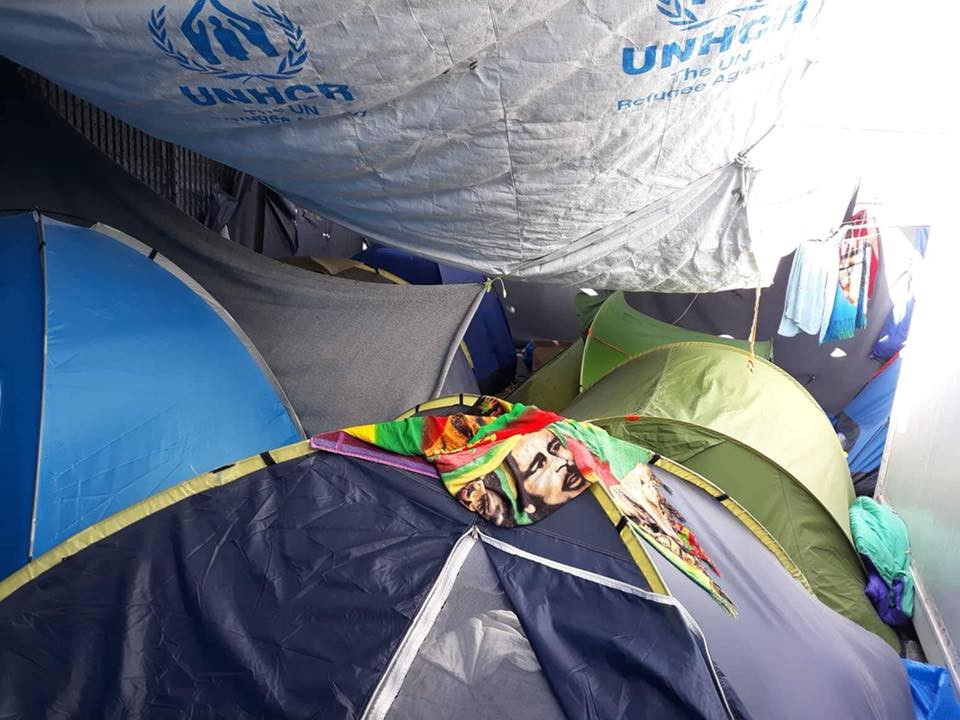
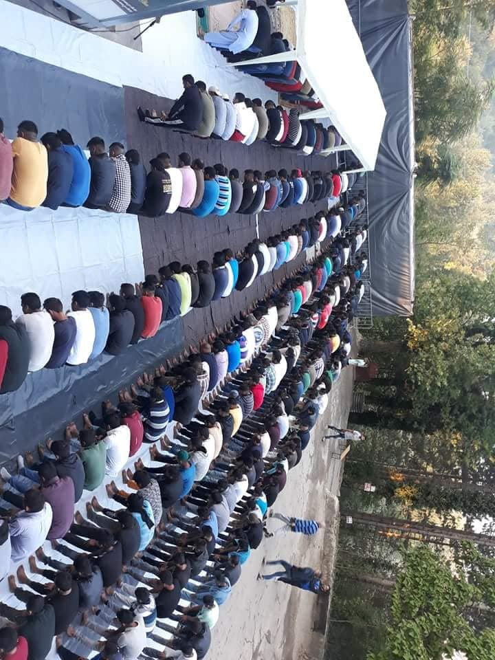
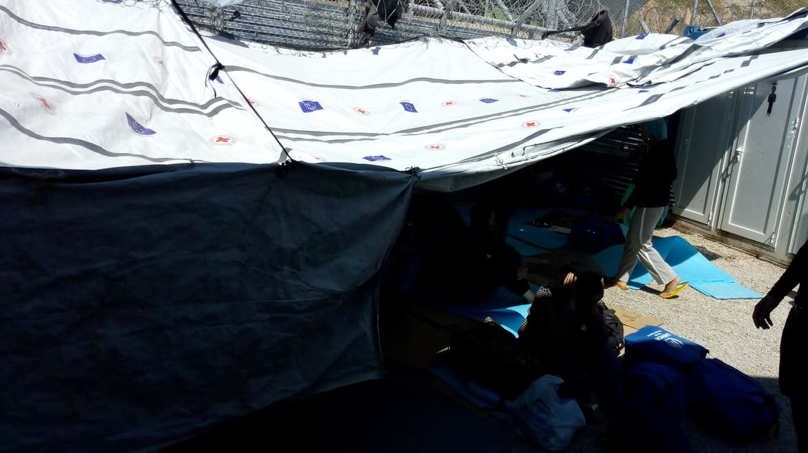
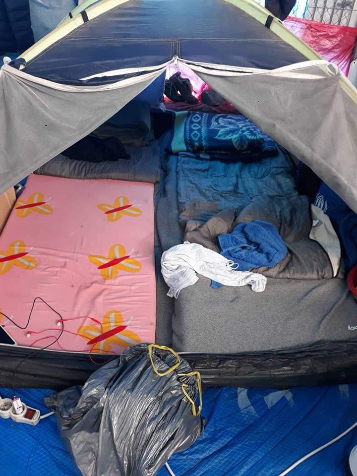
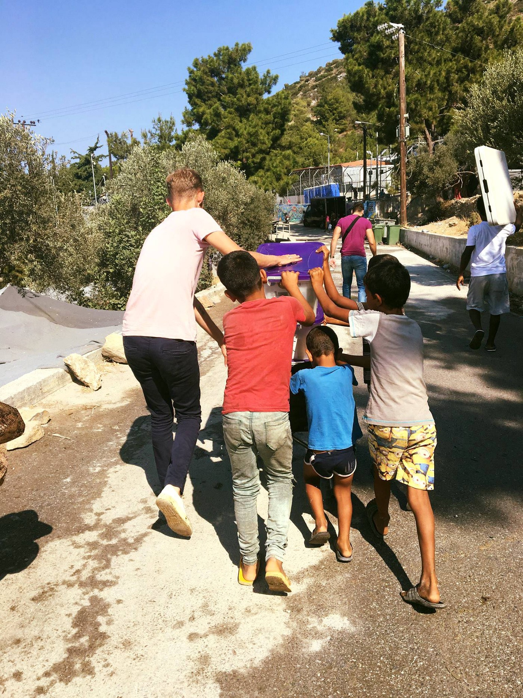
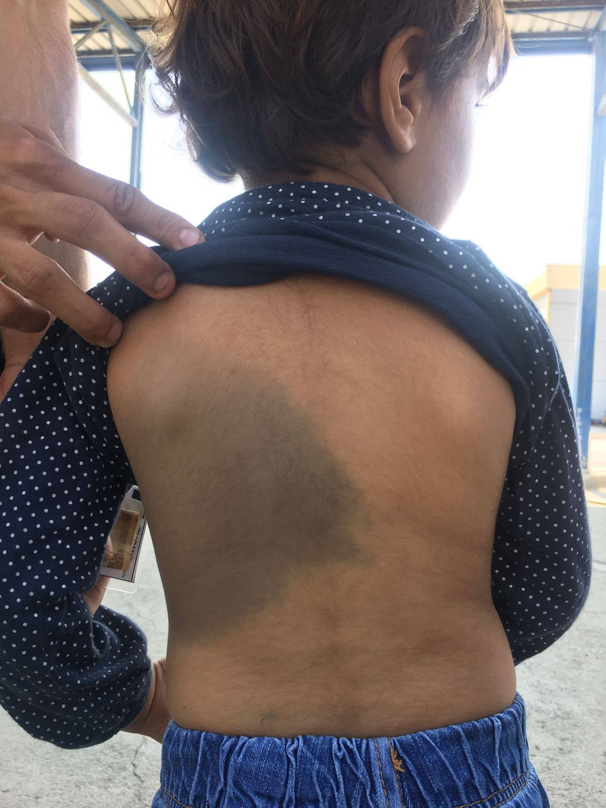

### AYS DAILY DIGEST 21/8/2018: No asylum in Bosnia\!

_Since 2008, not even one person was granted asylum in Bosnia // Legal experts: Italy is likely violating article 5 of the European convention on human rights // Moria is now at more than 300 percent capacity // European Commission is aware of the violence committed by the Croatian border police // Help is needed in Greece, Bosnia, Italy, France…_

Imagine living like this day in and day out\. Photo by Ruhi Loren, Vial, Chios\.
### Feature: The best people of us all

The situation in Bosnia for all the people on the move, asylum seekers, is not getting any better\. Until today, the government and responsible INGOs have not found a way to provide accommodations for all the people who entered the country since February this year, who number over 11,000 thus far\. At the moment, thousands are sleeping rough in Sarajevo, Velika Kladuša, Bihać, and many other areas around the country\.

[According to](http://balkans.aljazeera.net/vijesti/mektic-nije-odobren-nijedan-azil-migrantima-u-bih) the state Ministry of Security, which is responsible for asylum seekers, not even one asylum case has been processed in Bosnia, though more than 800 people have applied\. The number could be much higher, but the current system is also preventing people from applying for asylum in teh first place\.

Since 2008, [over 1,200 people](http://dijaspora.mhrr.gov.ba/wp-content/uploads/2018/05/MIGRACIONI-PROFIL_2017_-BOS.pdf) applied for asylum in Bosnia, including refugees from Syria, but nobody has received asylum\. Only 9 people have received refugee status, and 85 subsidiary protection\.

However, despite irresponsible government, people in Bosnia are still open and welcoming\. Šuhret Fazlić, Mayor of Bihać, the city with the greatest number of asylum seekers, [spoke for the Radio Free Europe](https://www.slobodnaevropa.org/a/intervju-suhret-fazlic/29440755.html) saying that if the local people and relatively smaller number of international volunteers did not get involved, those who arrived in the city would die of hunger\.

Photo by Red Cross Bihać

On Eid, which was celebrated on Tuesday, the city of Bihać and the local Islamic Community organized a celebration and prayer for people staying in Đački dom, an improvised camp where about 900 people are living\. The imam who led the prayer said that people who are traveling in this way are the [best people of all](https://www.klix.ba/vijesti/bih/nekoliko-stotina-migranata-klanjalo-bajram-namaz-u-bihacu/180821022) \.
#### Sea

While the number of people who arrived in Italy decreased, the number of lost lives increased\. Between January and July 2018, the death rate was 1 for every 17 people who attempted the crossing, up from 1 in 43 during the same period of 2017\.
#### Italy

So far this year, 19,210 people have arrived in Italy via sea\. In August alone, 700 people were registered\.

This number is much lower than last year over the same period of time \(over 90,000 arrivals\), and it is partially due to the harsh policy of the current government in Italy\. The latest news is that Italy’s transport minister has suggested the group of people stranded in the Sicilian port of Catania will learn their fate on Wednesday\.

The minister wants other EU countries to take some of the ship’s passengers\. “We don’t trust them\. The redistributions of asylum seekers who had been saved in July has not taken place yet,” he told the media\.

Until now, Rome refused to allow them to enter Italy\. So far, no other member state has publicly offered to take people from this boat\.

 \.](assets/636b865f0ae/1*MBkZ8tK1IFaUHuFq79dd7g.jpeg)

Photo by [Alarm Phone](https://www.facebook.com/1525906057683632/posts/2200963383511226/) \.

Legal experts say Italy is likely violating article 5 of the European convention on human rights because it has detained some migrants who want to claim asylum for more than forty\-eight hours\.

The boat has already been docked at port for seven days\.

In the meantime, a group of activists have organized a sit\-in protest inside Catania harbour demanding the immediate disembarkation of the 177 people\.
#### Greece

According to the Aegean Boat Report, on Tuesday four boats arrived on the Greek islands: one to Lesvos, one to Samos, and two to Kos; 120 people altogether\.

RefuComm reports from Moria, saying that the recent spate of new arrivals has pushed an already overcrowded camp to the breaking point\.

People from the camp are sending SOS messages and photographs of the appalling conditions inside\.

“There are too many people, there is nowhere to put them, the new arrivals section is so crowded that you can’t even walk between the people\. Some very vulnerable people are in here without medication for over a month\.”

“The people inside New Arrivals appear to be especially vulnerable, there is little medical care, the food is bad and we only just about have enough water\.”

“There are fights in the camp every day now, especially because of the terrible conditions but also because EASO, where thousands of people are interviewed by asylum officers, cannot deal with the number of people who need help\. The EASO queues are long and they keep shutting the ‘office’ down\. There was a period where they shut it down for a straight ten days so people aren’t getting registered, appointments are being cancelled\. We are treated by the EASO staff like animals when we complain, they look over our heads and ignore us or tell us to go away\.”

The refugee camp at Moria is now at more than 300 percent capacity, and outbreaks of violence, often triggered in the food distribution line, are happening daily\.

In Vial Camp on Chios, the situation is not much better\.

The independent volunteer [Ruhi Loren reports](https://www.facebook.com/ruhi.akhtar.7/posts/2256249361058626?__xts__%5B0%5D=68.ARDfKVz4bgiRimvs0Sq_h9USTh1muyO9aeHd30f_HWlqX5rrMPNU3-sd7CZkb-67a1IrVCu5MZL1bdZuXThUdPhJ_J07Xfqjnp_Xik3WrVd6KQcMoZ2c1JC_9-opm6fqamO0Hiwbq6i9&__tn__=-Rž) that in some areas the tents are so packed together that people can hardly walk through\.

Welcome to Europe published [an update on fingerprints and Dublin returns](https://www.facebook.com/w2eu.gr/posts/1114360562062149?__xts__%5B0%5D=68.ARABzNd2KoIW3RPVxSoMxu-cwWAgEPnIFkOGnvt53amXw8N0rXxz4eLMJcoWdQTQuiGJR8tsTuOQ4mJuLqd-wvyHzQIx0qmM3t-jwp-h2egR4InyHRho4lV--Bq1l1eVS8AL36w20pV7&__tn__=-R) to Greece\.

_HELP IS NEEDED_

By Samos volunteers

[Samos Volunteer](https://www.facebook.com/samosvolunteers/posts/1064373680407458?__xts__[0]=68.ARAV9rLD3z4YQR8VyKo3Fn8CabcKAoIe73E3qE_v8dFQx_EBcUhGlPOLU6MXPaRLrI1migWeUhicsvZ-1GvbxcVvo4IWiQXJN3hKJieWfpnDuzzv9WbhqIbk8hOnlO2RbA3oElAXA-Zb&__tn__=-R) are looking for “hard\-working, kind\-hearted, flexible and stress\-proof individuals out there to come to join our team from the beginning of September on\. “

If you can commit to working with SV for a minimum of 4 weeks, fill in the application at [www\.samosvolunteers\.org](http://www.samosvolunteers.org) \.

[Attika Human Support](https://www.facebook.com/AttikaHumanSupport/posts/682230868799238?__xts__%5B0%5D=68.ARCDyW4l2XhIFjJkCn9bGxpyXixbprY7YvuD4kRWRTiIynpvd39Ey8RHMFkIhHrmVhmQE--sl_EMIIQTPXKXbBmNNt4t8vqkPr2ZWVFVQWyKsRcHvbBJCw97a3bj3oFqECrT_3ze27L8&__tn__=-R) needs men’s items like shoes, underwear, t\-shirt, trousers\.
#### Serbia

According to the latest available data, 3,875 newly registered asylum seekers were counted in Serbia on 19 August \(compared to 3,610 two weeks ago\) \. Out of this number, some 240 are camping close to borders with Croatia or Hungary, and up to 100 in Loznica, close to the border with Bosnia and Herzegovina\.

Most of the people who are arriving now to Serbia are coming from the direction of Macedonia and Bulgaria\.

Only 14 asylum seekers were admitted from Serbia to Hungary last week\.

The UNHCR continues to count push backs from neighbouring countries\. Last week, 230 from Croatia \(up from 124 two weeks ago\), followed by 33 from BiH \(down from 88\), 20 from Romania \(down from 28\) and 6 from Hungary \(down from 26\) \. More than 65% of reports alleged denial of access to asylum procedures by authorities of these neighbouring countries\.
#### Croatia

After AYS filed a complaint to the European Commission against Croatia, due to the violence against asylum seekers, a response came from Henrik Nielsen the Head of Unit at the Directorate\-general on Migration and Home Affairs\.

_“Let me assure you that the Commission is in contact with Croatian authorities concerning the implementation of the Common European Asylum System, including concerning allegations of third\-country nationals being denied the possibility to apply for international protection in Croatia, sometimes involving police violence or other forms of abuse\. Specific such allegations should be subject to credible investigations by the Croatian authorities according to national law\.”_

This answer is very weak and does not show that the EC will do anough to condemn the violence\. Still, we will wait and see\.

Meanwhile, violence continues\. According to the latest report by No Name Kitchen, even children are the victims now\.

A 3\-year\-old girl shows a bruise across half of her back after a police officer pushed her, causing her to fall down\. Photo by NNK\.
#### Germany

The number of employed migrants from the eight countries with the biggest numbers of asylum seekers surged by more than 100,000 to 306,574 in May compared with the same month in the previous year, data from the Labor Office showed, [agencies are reporting](https://www.reuters.com/article/us-germany-employment-refugees/more-refugees-find-jobs-in-germany-integration-going-pretty-well-idUSKCN1L60Y9) \. Among those, roughly three out of four had a labour contract in which the company and the employee were paying full contributions to social insurance schemes, the data showed\.
#### France

[Locker room for migrants](https://www.facebook.com/groups/177642579245883/permalink/700461183630684/?__xts__%5B0%5D=68.ARAlqrIl5uUfStsUhKNUReJK0UeA5N0fSManMSTig9t_Df8oYosLI-v2i4etLgHaE8O0Svbrg326MkavqXXXWr8wVJej7CJ06zv_TYRpIr-hQj75KLPcEu6VBlSVDTREM2xbuPD4AKVP&__tn__=-R) , Paris, needs volunteers for Wednesdays to sort and receive donations from 15 am to 18 pm and Saturdays and Sundays for clothing distribution and to receive donations from 9 to 14 H\.

Also, they need donations of shampoos, shower gels, toothpaste, toothbrushes, deodorant, razors, shaving cream, body cream, dexeryl, tissues, and diapers and milk for children\.

[FAST](https://www.facebook.com/groups/FASTCalais/permalink/2183665298579975/?__xts__%5B0%5D=68.ARAsOUY5oB-cngB1Mn7QuUdlZE2Vu5kMP0yLMUKtVNOdwAvmDFXEtNt8x5168RJbT5Mq7WZjua_RWYCAZPXCkRB74Akc0yFOCd46dASOaJG5ZNPAdYQAd5vZEFmIqm6DiTAqgM2LFwP0&__tn__=-R) \(First Aid Support Team\) in Calais also needs volunteers\. They need: 
\- Doctors
\- Drivers
\- Nurses
\- Paramedics
\- First aiders
\- Students with first aid experience

**We strive to echo correct news from the ground through collaboration and fairness\.**

**Every effort has been made to credit organizations and individuals with regard to the supply of information, video, and photo material \(in cases where the source wanted to be accredited\) \. Please notify us regarding corrections\.**

**If there’s anything you want to share or comment, contact us through Facebook or write to: areyousyrious@gmail\.com**

_Converted [Medium Post](https://medium.com/are-you-syrious/ays-daily-digest-21-8-2018-no-asylum-in-bosnia-636b865f0ae) by [ZMediumToMarkdown](https://github.com/ZhgChgLi/ZMediumToMarkdown)._
