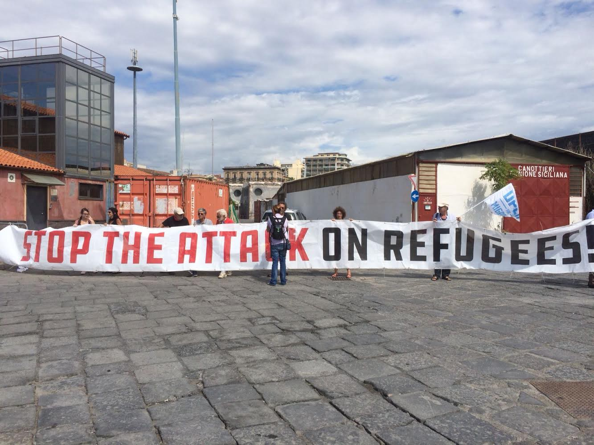

### AYS DAILY DIGEST 22/08/2018: FRONTEX celebrates as people suffer

_Frontex heralds better border control as reducing migration to a “manageable” level while giving a tacit nod of approval to sadistic policies // Deals between Greece and Germany // MSF confirms violence against refugees in Bosnia by Croatian Police pushbacks // Salvini risks charges of kidnapping for latest ship stunt // Supplies needed in France // More…_

Photo Credit: Watch the Med, Alarm Phone
### FEATURE

In a report released on 7 August, FRONTEX adulated at the decrease of “migration flow” from the end of 2015 until now\. The publication cites the closure of the route in 2016 as being a key component in the decrease of migration, as well as crediting enhanced security measures at EU borders with Serbia, translating to primarily Romania, Hungary, and Croatia\.

“At the southern common borders between the region and EU Member States the former Yugoslav Republic of Macedonia, Bulgaria, Greece and Serbia maintained their efforts both on their own \(internal re\-deployments\) and with international support in the framework of either EC\-funded interventions [\[2\]](https://frontex.europa.eu/publications/wb-ara-2018-eW3T1c) \(in the former Yugoslav Republic of Macedonia and Serbia\) or Frontex\-coordinated joint operations [\[3\]](https://frontex.europa.eu/publications/wb-ara-2018-eW3T1c) \(in Bulgaria and Greece\) \.

In the north of the region, Hungary strengthened border controls by re\-enforcing police presence, erecting technical obstacles while also redefining working procedures\. Romania also implemented an array of measures aimed at deterring migration from Serbia, among which it increased its detection capabilities through redeployments of staff and equipment from other border police units or other national law enforcement structures\. Croatia also continued to devote resources to maintaining enhanced controls at its common border with Serbia\.”

It seems preposterous to see the widespread denial of violent pushbacks from Croatia and other condemnations from EU bodies of Hungary’s ever\-more sadistic anti\-migration policies, which now include denying food to individuals who have had their asylum claims rejected and who remain in transit zones between Hungary and Serbia\.

Human Rights Watch recently published a report on the absolute inhumanity of this policy, stating:

“‘The government has stooped to a new inhumane low by refusing food to people in their custody, apparently revelling in breaching human\-rights law, including its obligations as a European Union member,’ said [Lydia Gall](https://www.hrw.org/about/people/lydia-gall) , Eastern [EU](https://www.hrw.org/europe/central-asia/european-union) and Balkans researcher at Human Rights Watch\. ‘This disregard for people’s wellbeing smacks of a cynical move to force people to give up their asylum claims and leave Hungary\.’

Two Afghan families and a pair of Syrian brothers are among those who were denied food after their asylum applications were rejected under a new admissibility procedure\. While a breastfeeding woman and children in the Afghan families were provided with food, they were prohibited from sharing it with other family members, the families’ legal representatives told Human Rights Watch\.”

Hungary coolly responded that it is not required them to take care of those who have been denied asylum, however their actions can be broadly considered in violation of human rights, especially when taken in the context of the criminalization of any support of refugees or migrants by citizens or NGOs\. Hungary’s “Stop Soros” law not only implemented a high tax on funding raised by NGOs dedicated to assisting vulnerable refugees and migrants, but also included the right for Hungarian authorities to deport those who have had their asylum claims rejected, even if they have filed an appeal\.

Although FRONTEX and other official bodies would distance themselves from responsibility for these egregious crimes, their support for “police presence” and “technical obstacles” and unwillingness to perhaps threaten a withdrawal of FRONTEX support form countries engaging in systematic violation of human rights indicates at best, a deeply irresponsible attitude of neglect\.

Furthermore, in February of 2018, both Albania and Serbia acknowledged that they would be receiving additional funding from FRONTEX in order to stop irregular migration flows\.

For all of the official hand\-wringing and finger\-wagging when evidence of these crimes becomes undeniable, it’s clear that there is no room for compromise unless the person made to suffer are those trying to seek better lives\. We cannot view each individual story of violence in isolation from one another as it is clear that there is a broader systematic approach to the abuse and oppression of people on the move\.

Sources\. [Human Rights Watch](https://www.hrw.org/news/2018/08/22/hungary-asylum-seekers-denied-food) \. [FRONTEX\.](https://frontex.europa.eu/publications/wb-ara-2018-eW3T1c) [Balkan Insight](http://www.balkaninsight.com/en/article/countries-of-the-region-to-work-jointly-on-migrant-crisis-06-07-2018) \.

■■■■■■■■■■■■■■ 
> **[MSF Sea](https://twitter.com/MSF_Sea) @ Twitter Says:** 

> > For #refugees and #migrants, mobile phones can be a lifeline. Our patients in #Bosnia routinely report that their phones are destroyed by #Croatia border authorities when pushing them back. https://t.co/7BedcYEbW5 

> **Tweeted at [2018-08-22 08:33:40](https://twitter.com/msf_sea/status/1032184011513364480).** 

■■■■■■■■■■■■■■ 

### GREECE

According to the [Aegean Boat Report](https://web.facebook.com/AegeanBoatReport/posts/434135603776216?__xts__%5B0%5D=68.ARDtUqsbh-OggaJKEbkIUVNrfrmI4_kkJF3xe0hpmzD0AKvMOCCS9dplyAHCbFjOsYCAEBh8NvybM5P6RDDcVjbUP07KrdSfjKci1rs0O_ssGGLdY6gXTk_rcrM6ZLD0-Ut2GwU&__tn__=H-R) , 62 people landed on Lesvos yesterday\.

In a chilling development, a new agreement means that anyone caught at the border of Germany and Austria, who has proof of having already applied in Greece, can be returned to Greece within 48 hours\. The other half of the agreement involved Germany’s promise to process family reunification claims from Greece with all expediency\. However, it shows how low we continue to stoop when simply completing the stated responsibility \(processing applications in due time\) becomes a bargaining chip\. More info at [Mobile Info Team](https://web.facebook.com/mobileinfoteam/photos/a.1800063030222418/2262140294014687/?type=3) \.
### MALTA

The Maltese government continues to hold search and rescue ships much to the chagrin of their crew\. The following is a letter from a doctor who is held in limbo currently\.

“Imagine, a house is burning in your neighborhood\. People are waving from the windows, crying for help in fear of death\. Now imagine, you have a fire engine, completely equipped, fueled up and with experienced firefighters on board\. Just as you want to go, someone comes along and says, eeerrr, I think there’s something wrong with your license plate\. The authority said it’s OK, but I’m still not sure, so you can’t go\. And if there’s no fire brigade, people will be more careful anyway so we won’t have fires anymore in the future\. You can also not go and watch, because that only leads to trouble\. Crazy idea? Well, this is exactly, what’s I’m experiencing at the moment here in Malta\. The ships Sea\-Watch 3, Lifeline and Seefuchs lie here in the port and are not allowed to do what is deeply human\. To help people in utter distress, save lives and alleviate the most fundamental hardship\. They are hindered with far\-fetched accusations, ignoring international and national law\.

“For 5 weeks, Sea\-Watch 3 has been in port\. In this period, nearly 300 people died\. And these are only the ones that we know about\. Those, who were found at sea or were drifting on some nameless beaches in Libya or Tunisia\. The others are not even a number\. Nameless, traceless, eradicated from conscience and memory, swallowed by the Mediterranean\. It is unbearable to enjoy the beauty of century\-old Valetta and know that in the very same moment, not far from here, tragedies may happen\. Tragedies, that are caused by those who keep us from doing our work\. Instead, the firefighter is defamed as an arsonist\. Those, who do this are twisting facts in a cynical way\. Don’t let them fool you\. Ask your politicians, why migration over the Mediterranean Sea has been ignored for more than 20 years\. Do they stop arms export? Do they fight for fair trade with poor countries? Or do they carry on like before, on the corpses of tens of thousands of people\. I feel sick\.”

Original post [here](https://web.facebook.com/seawatchprojekt/photos/a.1579563625595046/2105681706316566/?type=3&ifg=1) \.

The Maltese navy rescued 100 people and recovered two bodies, making search and rescue missions wonder when their ships will be seized\.

■■■■■■■■■■■■■■ 
> **[Andrea Iacomini](https://twitter.com/Andrea_Iacomini) @ Twitter Says:** 

> > Sono in 28. Sono stati elusi i loro diritti tra cui il divieto di respingimento essere accolti in strutture idonee avere un tutore presentare domanda di protezione internazionale di essere ricongiunti ad eventuali parenti regolarmente soggiornanti in altri stati europei #Diciotti https://t.co/tWqbgpfKyH 

> **Tweeted at [2018-08-22 14:03:09](https://twitter.com/andrea_iacomini/status/1032266929908707328).** 

■■■■■■■■■■■■■■ 

_People praying aboard the Diciotti\._
### ITALY

Italy is paying a price, both figuratively and literally, for interior Minister Salvini’s repeated refusal to allow search\-and\-rescue ships with refugees onboard from coming to port in Italy\.

The EU Observer highlights that Italy spent at least 200,000€ on escorting the Aquarius to Valencia Spain in an infamous altercation in June wherein Italy refused to allow the Aquarius to port\.

> “An analysis of data obtained through a Freedom of Information request revealed the size of the bill racked up by the Italian coast guard, which was called in to provide assistance in the politically charged operation\. 

> It also indicated that around 90 percent of the budget for the journey was provided by European Commission grants for emergency rescue services\.” 

Read the full article [here](https://euobserver.com/migration/142641) \.

Regarding an ongoing Salvini stunt where 177 people were trapped on the Diciotti ship for seven days, many of them minors\. Various outlets report that twenty\-seven minors and two women were allowed to disembark, and that they are in terrible condition after their ordeal\.

■■■■■■■■■■■■■■ 
> **[Bluto](https://twitter.com/blutarski_bluto) @ Twitter Says:** 

> > È finito pochi minuti fa lo sbarco dei 29 minorenni dalla #Diciotti.

Mi sono passati davanti uno a uno, dei bambini praticamente; stanchi, distrutti, devastati.
Una cosa atroce.
Così come atroce è vedere chi su quella nave ci è rimasto. 

Una grande rabbia.
Per oggi basta.
Off. https://t.co/JAk1mqBYqH 

> **Tweeted at [2018-08-22 21:20:32](https://twitter.com/blutarski_bluto/status/1032377000760029184).** 

■■■■■■■■■■■■■■ 

Translation: “It ended a few minutes ago—the landing of the 29 minors from [\#Diciotti](https://web.facebook.com/hashtag/diciotti?source=feed_text&hc_location=ufi) \.

I walked past one by one, children practically; Tired, destroyed, devastated\.
An atrocious thing\.
Also how atrocious it is to see who on that ship has left us\.

A great rage\.
That’s enough for today\.
Off\.”

Magistrates are onboard and the people are being considered as having been unlawfully detained\. As such, it is possible that the looming plan to arrest those remaining onboard as well as the previous forcible detention may yield kidnapping charges\.

■■■■■■■■■■■■■■ 
> **[Izza Leghtas](https://twitter.com/IzzaLeghtas) @ Twitter Says:** 

> > Prosecutor of Aggrigento, Sicily, considering opening an investigation into kidnapping &amp; illegal arrest of 177 people stuck on @[guardiacostiera](https://twitter.com/guardiacostiera)'s #Diciotti boat. For days the Italian government has refused to allow them to disembark
[repubblica.it/cronaca/2018/0…](http://www.repubblica.it/cronaca/2018/08/22/news/diciotti_appello_sbarco_minori-204651159/) 

> **Tweeted at [2018-08-22 18:04:18](https://twitter.com/izzaleghtas/status/1032327617716862977).** 

■■■■■■■■■■■■■■ 

Additionally [Dimitris Avramopolous announced](https://twitter.com/Avramopoulos/status/1032209365053460480) the awarding of 9 million€ to Italy to support health programs for people on the move in Italy\.
### SPAIN

SAR Mamasto transferred to [\#Málaga](https://web.facebook.com/hashtag/málaga?hc_location=ufi) 143 people from three rescued boats in the Alboran Sea\. 
Marina Spica has rescued 56 people from four boats which had shipwrecked, and moved them [\#Motril](https://web.facebook.com/hashtag/motril?hc_location=ufi) \. The other three occupants, evacuated \(hypothermia\) to [\#Melilla](https://web.facebook.com/hashtag/melilla?hc_location=ufi) by Helimer 207\.

■■■■■■■■■■■■■■ 
> **[InfoMigrants](https://twitter.com/InfoMigrants) @ Twitter Says:** 

> > In southern #Spain, #migrants and #asylumseekers are often pressured into signing repatriation agreements "without an interpreter or an attorney, both of which are legally mandated," a refugee aid organization claims. 

[infomi.gr/12Jp.T](http://infomi.gr/12Jp.T) https://t.co/ltX6qYAKaL 

> **Tweeted at [2018-08-22 10:41:37](https://twitter.com/infomigrants/status/1032216214276395008).** 

■■■■■■■■■■■■■■ 

### FRANCE

Solidarity Migrants Wilson provided an update — they ran a distribution of hygiene products which lasted thirty minutes, and resulted in 600 people getting much\-needed supplies\. However, volunteers’ morale is flagging as the needs are simply so on\-going and intense that they cannot keep up\. Additionally, rats and mice tend to attack and destroy the supplies given out to people in the night, resulting in items being damaged beyond repair\. If you can assist them in their ongoing support project, please go [here](https://web.facebook.com/permalink.php?story_fbid=975988542601918&id=598228360377940&hc_location=ufi) \.

Dunkirk Refugee Women’s Centre is looking for a long\-term volunteer\!

> RWC is seeking a WOMEN’S SUPPORT WORKER to join our team in northern France, starting in early October 2018\. 

> We are looking for an adaptable individual with experience in working with displaced women, particularly in the charity sector, to commit to a minimum of ten months on the ground with us\. 

> DEADLINE: MONDAY, 17 SEPTEMBER 2018 

> If you are interested please read the full details and requirements in the link below and apply\. 

Please go [here](https://web.facebook.com/refugeewomenscentre/posts/500046317087670?__xts__%5B0%5D=68.ARCk2gnU245tlPyInryxC_c81DLnZZ3hfl6MbdFxbtnI6MDaHppOh4q8ejRyPumNYX_kSGt8oq8FbqOsBn7hn7LM41eXXiQUf1HxvNXx1bTBbIAt1Oum9wnzhaAtKa5M19ofNxQ&__tn__=H-R) for more information and to apply\.
### SWEDEN

Municipalities are treating unaccompanied minors differently when school is about to start after the summer vacation\. For instance, in Gothenburg, asylum\-seeking youths can start school regardless of a still\-pending decision\. This means that they can go to high school during the process of getting asylum\. In Malmö and Stockholm, minors are not allowed to start school before the decision is made\. This could mean that the students will fall behind the rest of the class if they do receive a positive decision later during the autumn\. The municipalities therefore engage in different interpretations of the school act, which among other things regulates who has the right to go to school\. Sadly this is yet another example of bureaucracy sabotaging people’s ability to return to some kind of normalcy, while holding those victims themselves accountable for it\. The full story is available in Swedish [here](https://sverigesradio.se/sida/artikel.aspx?programid=83&artikel=7024463) \.

**We strive to echo correct news from the ground through collaboration and fairness\.**

**Every effort has been made to credit organizations and individuals with regard to the supply of information, video, and photo material \(in cases where the source wanted to be accredited\) \. Please notify us regarding corrections\.**

**If there’s anything you want to share or comment, contact us through Facebook or write to: areyousyrious@gmail\.com**

_Converted [Medium Post](https://medium.com/are-you-syrious/ays-daily-digest-23-08-2018-frontex-celebrates-as-people-suffer-2db7e3d40d03) by [ZMediumToMarkdown](https://github.com/ZhgChgLi/ZMediumToMarkdown)._
