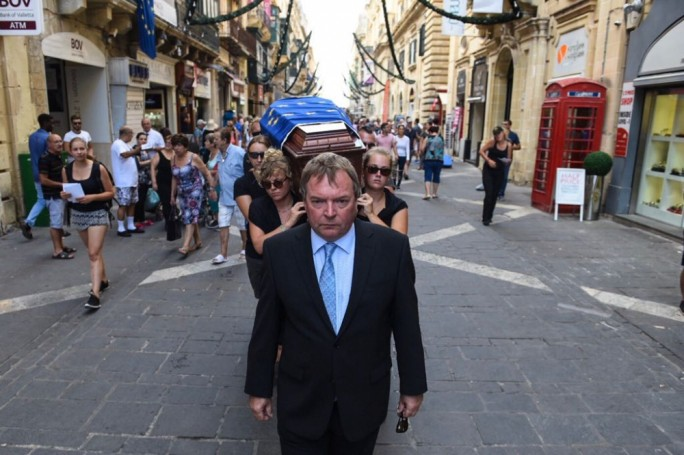

### AYS Daily Digest 23/08/18: Protesting “the death of human rights” in Malta

_Effects of the literal darkness of Libyan detention centers / [Diciotti](https://www.facebook.com/globalproject.info/posts/1972706452767982?__xts__[0]=68.ARC3R1-MC58XnTVLUdLmQ2WzDvUflmUwWYlEGFguLnF8LLKVLnAqXLPHva2IunYqZ1eoLhR4jO9o3Q9w7Z0NsY-_3H6DaVx3Rf9EDx7XKIKM0zOoZj9MPX6lyARRAyRIjNDTjGA&__tn__=-R) ship blocked in Italy for third day / Women in danger on Lesvos / Flash mobs in Switzerland / Approximately 700 people in Dunkirk need shelter / And more news…_
### FEATURE

In protesting the “death of human rights in Malta” [crew members of MV Lifeline and Sea\-Watch 3](https://www.maltatoday.com.mt/news/national/88995/symbolic_funeral_in_valletta_accompanies_lifeline_captain_to_court#.W39gF-hKg2x) carried a coffin from Castille Square to the court building in Valletta on Thursday\. The coffin was draped in a EU flag\. Their Captain Claus\-Peter Reisch has charges against him for improper ship registration\. It is registered as a pleasure craft in the Netherlands and therefore, the claim is made, it cannot serve on a rescue mission\.

](assets/b24fbe05c5bc/1*-n3T86_nPXwFBDqiIygVhw.jpeg)

Photos by [James Bianchi/MaltaToday](https://www.maltatoday.com.mt/news/national/88995/symbolic_funeral_in_valletta_accompanies_lifeline_captain_to_court#.W39mcuhKg2x)

[Reisch](https://twitter.com/ClausReisch/status/1032583737362526214) has claimed that the prosecutor and Dutch authorities are deliberately delaying court proceedings in order to keep the ships in Malta\. [The judge](http://www.dnn.de/Dresden/Lokales/Mit-Sarg-Deutsche-Seenotretter-protestieren-auf-Malta-mit-dabei-Mission-Lifeline) has also expressed regret over the proceedings\. [No results](http://www.dnn.de/Dresden/Lokales/Mit-Sarg-Deutsche-Seenotretter-protestieren-auf-Malta-mit-dabei-Mission-Lifeline) came on Thursday and the next court trial is confirmed for the 11th of September\.

In regards to Reisch’s trial, We Are a Welcoming Europe needs signatures to end criminalizing aid to refugees and sea rescue\. Find their campaign [here\.](http://www.weareawelcomingeurope.eu/)
### SYRIA

While continuing their safety awareness campaigns, the White Helmets are able to bring some joy to Syrian children during the holy holiday of Eid\. Human rights organizations have warned that the mental health of Syrian children has plummeted in the recent years of the ongoing civil war\. They cannot continue being a forgotten generation\.

](assets/b24fbe05c5bc/1*Q4sNBCG2qJEFfCDMQjsLNQ.jpeg)

Photos by [Syrian Civil Defense — The White Helmets](https://www.facebook.com/SyriaCivilDef/posts/2169107956746934?__xts__[0]=68.ARCRSkonQsL4C9HqLwBpt7uFo_LxdNyAmqy_x-Pq-PvwJp38EXgbs6wn48OvljCom7ZKdbCfCsGMjybGQKnZLz0CBfus3dCCFDngHwNWlpT6yLc5ljQtGGGd3Q0D8Tg1MqHZRuA&__tn__=-R)
### **LIBYA**

[The 25 people](https://twitter.com/OthmanBelbeisi/status/1032556178486779904) returned by the Libyan Coast Guard \(LCG\) on Wednesday were immediately detained, reports IOM\. Among the 25 were a mother and her child\.

More testimonies are coming out about the darkness of Libyan detention centers\. [A 17 year old](https://www.facebook.com/permalink.php?story_fbid=920989104756830&id=252231521632595&hc_location=ufi) states he did not see any light for seven months\. [An MSF psychologist](https://twitter.com/msf_sea/status/1032666002495078401?s=21) reports that one of the children who disembarked from the Diciotti ship in Catania is having sight problems after living in darkness for a whole year\.

The EU is funding the LCG to literally keep people in the dark\.
### **SEA**

In the Alboran Sea, 56 people were rescued on Thursday from a half sunken boat\. They were moved to Motril by the rescue ship S/Spica\. Yet still, three people with hypothermia had to be rescued by the helicopter Helimer 207, [Salvamento Maritimo confirms\.](https://twitter.com/salvamentogob/status/1032542518397820928)

](assets/b24fbe05c5bc/1*GJAheOmSL27YbJaRMwV8vw.jpeg)

Photos by [Salvamento Maritimo](https://twitter.com/salvamentogob/status/1032542518397820928)
### ITALY

[The ship Diciotti](https://www.facebook.com/globalproject.info/posts/1972706452767982?__xts__[0]=68.ARC3R1-MC58XnTVLUdLmQ2WzDvUflmUwWYlEGFguLnF8LLKVLnAqXLPHva2IunYqZ1eoLhR4jO9o3Q9w7Z0NsY-_3H6DaVx3Rf9EDx7XKIKM0zOoZj9MPX6lyARRAyRIjNDTjGA&__tn__=-R) has been blocked from disembarking in the port of Catania for three days now\. 29 unaccompanied minors were brought to shore in the night, but 148 people remain on the ship for their [eighth day on board\.](https://twitter.com/seawatchcrew/status/1032714430205894656?s=21)

While they have been removed from a state of quarantine, [cranes](https://twitter.com/scandura/status/1032546739360858112) still have to lift food on board as the ship no longer has enough provisions\. It has been confirmed that there are women and children on board and the majority of people have scabies\. Spain and France have stepped forward to assist in relocation, but the Italian authorities are still refusing to budge\.

[Anti\-racist protests](https://www.facebook.com/globalproject.info/posts/1973203966051564?__xts__[0]=68.ARBX6Ge9HfZujSc0AY5BKpL6QVkBmp777OcQGsoo17OqZyPfkPCtwQhtme5wR9Y9qjd5KQmOzoaS1sUU72XQSgrh7P5gHWmMNckCa2JSoC_rV8Q8sn71BCPtLMl3c9v4x5IJQQU&__tn__=-R) started at 7pm on Thursday, demanding the release of the 148 people being held hostage by the government\. The police blocked the protesters with shields and shoving, preventing their access to the port\. Protesters called on Prime Minister Salvini to end his stalemate against human rights\.

 ; right photo by [Melting Pot Europa](https://www.facebook.com/meltingpoteuropa/photos/pcb.2047206885311028/2047205108644539/?type=3&theater)](assets/b24fbe05c5bc/1*xZdpyp9izcfHHqkoQfKQ9Q.jpeg)

Left photo by [Global Project Info](https://www.facebook.com/globalproject.info/photos/pcb.1973203966051564/1973203749384919/?type=3&theater) ; right photo by [Melting Pot Europa](https://www.facebook.com/meltingpoteuropa/photos/pcb.2047206885311028/2047205108644539/?type=3&theater)
#### Volunteers needed in Rome

Support Convoy is in need of volunteers to help them with their mobile shower systems and drinking water operations in Rome\. Find out more [here](https://www.facebook.com/support.convoy/posts/2287563611471957?__xts__[0]=68.ARDWfIHDD6_J4b26A9kKkHSN2HWXSmq8J_cHU4XVdRfBAhVoXSwT-_RJYqyecEILGnCm09Nyuvahtw7_nrn10SFUGpLEcFgDSHwoPREHqaKl73JyqE_EJbuAEmHszWstRY3Xs3A&__tn__=-R) \.
### GREECE
#### ISLANDS
#### New arrivals

Five boats landed on the islands Wednesday night/Thursday morning according to [Aegean Boat Report](https://www.facebook.com/AegeanBoatReport/posts/435111407011969?__xts__[0]=68.ARC6BLDlgz_kx8lt8iZu8BqhjAhu3RZJeEgMrOz6np8NUJFqcdIGWHYn0DncQxp-THROO-TIwYdZmaSyEVeoagWqyzB3-ljuT5Zz31oABMXLo8aSzIBzR2GJxIHefP_RrdJLt9s&__tn__=-R) \.

Three boats near Lesvos: the first with 44 people, the second with 46 people, and the third with 45 people\. No breakdowns available\.

Two boats near Samos: the first with 23 people \(11 children, six women, and six men\) and the second with 30 people and no breakdown\.
#### Upcoming report highlights danger facing women

[Refugee Rights Europe](https://www.facebook.com/RefugeeRightsEurope/photos/a.1502441746729332/1886390875001082/?type=3&theater) will soon release a report on the conditions of Lesvos from June 2018\. They highlight that the danger facing women is particularly of concern with their respondents:

> “93% ‘do not feel very safe’ or ‘never feel safe’ on Lesvos\.” 

> “92\.6% had experienced health problems while being in Lesvos, but only 30% had received medical care\.” 

> “The lack of sexual and reproductive health care available to women on the island was striking, with a number of respondents reporting that they had received little to no medical care during pregnancy, while some reporting losing their baby as a result\.” 

#### Experienced teachers, social workers, and psychologists needed

Boat Refugee Foundation\(BRF\) is in need of experienced teachers, social workers and psychologists to join their Lesvos Psychosocial Support \(PSS\) Team from September 4th to October 6th\. Find out more [here\.](https://www.facebook.com/groups/informationpointforlesvosvolunteers/permalink/954858748054906/?__xts__[0]=68.ARA5lfpuROP92QwxYGxv1SgVQ2vhHvQb7MWZW0vjBUxgIw5EIkb_wTtuE6610OJphzwD3UxzJlwFpG3xWDs2aFctf8KRnw6CtXlMjq3o5ugsgkXCEiybyyM8K_E7I7qbWtAjxkk&__tn__=-R)
#### MAINLAND
#### Our House hosting evening Friday

Our House is planning a party for the homeless in Athens Friday in Omonia at 8pm\. They will also be passing out clothing to those in need\. Come and join or send a donation to help provide food [here\.](https://www.facebook.com/groups/446386565554391/permalink/924446014415108/?__xts__[0]=68.ARCcK2X0Mp2svfsItGANyx9WDdW_OkKNpW5lYFnxkdW2KmPyciTvG1pAJmgtA-zEXppJ_HzEe5ZCyMJfnsyt332XpyrgOp1vPu6PJrCVMjtdsCRZTCfspqqEQhgCLZK4xE8uFDI&__tn__=-R)

[Reports from Thessaloniki](https://www.facebook.com/erika.rudash/posts/1905535526196840?__xts__[0]=68.ARB_vn67TD8Y5SfsRYpzmj5MY4PM_-AuHjvf6MhdkolDzKmGzTGMKiHw8LKYOfjs-83ZvKjlRGjjTfEjpolFPrTadStrE6w8czpVwNyWmN5lsJC61SDkbwfEP0hGAHAI4dxXQ0k&__tn__=-R) indicate that there is barely any medical care being given to refugees\. Serious cases are mistreated, and milder cases aren’t looked after at all, leading to infections\. For one camp with 1000 people, one doctor comes every four days for a mere two hours\. Even if you do wait in line, sometimes you cannot see him in time and have to wait another four days for another chance\.

A volunteer adds:

> “From infected wounds, fever, diarrhoea and vomiting, to serious heart conditions, eye problems, bullet wounds, disabilities and mental ilnesses\- there is no help\.” 

A volunteer doctor named “medic James” has been trying to see and treat these overwhelmed camps\. He is in need of more medical supplies as he is now running low\. Found out how you can help [here](https://www.facebook.com/erika.rudash/posts/1905535526196840?__xts__[0]=68.ARB_vn67TD8Y5SfsRYpzmj5MY4PM_-AuHjvf6MhdkolDzKmGzTGMKiHw8LKYOfjs-83ZvKjlRGjjTfEjpolFPrTadStrE6w8czpVwNyWmN5lsJC61SDkbwfEP0hGAHAI4dxXQ0k&__tn__=-R) \.
#### Farsi\-English interpreter needed in Thessaloniki

The Mobile Info Team is looking for a part time Farsi\-English interpreter in Thessaloniki\. A small stipend is available\. Found out more [here](https://www.facebook.com/groups/infopointfornortherngreecevolunteers/permalink/714991855513777/?__xts__[0]=68.ARAXL8hTAGv9OUH4QXw4B9nVOwcKrzHJHgI8t0pP7ohYAD6G2NnA9mno8bYYFnqcBI_hloak-WAWG7C5UUc6Wi1HKObLcCZ13-gDTCmafT6jz-hEboXeEJoOdpGAjZxSGXY2QFs&__tn__=-R) \.
#### Greek Forum for Refugees job list

Greek Forum for Refugees has a new job advertisement list out with 134 new positions\. Check it out [here](https://www.facebook.com/Greekforumofrefugees/posts/2075132869188175?__xts__[0]=68.ARClqBO9dlU3KWo9EB-FzranEFn_uPJOijI0p_nNuaUR99AWtu1i8v76-GgUK1EytZXWfwFYnJI-H4lBvPZ2K7ZJP3NAyAA939WIlPTzVwK9IGs-0NoSbntZEDqDv1y07E58L_k&__tn__=-R) \.
#### Volunteers needed across Greece

Dråpen i Havet is looking for volunteers in all of their locations in Greece\. Find out more [here](https://www.facebook.com/groups/763313107147281/permalink/1549733495171901/?__xts__[0]=68.ARDXXpywArgBF128dZLht3Q9lvOOTTuKPq9TNO5ew25GAr04cLSRqeOUK3xq7LSfH4lkFeecuRqWGxeMVJXqDUg6pc4trc3qq_frnDRhlEPyJZIWxCChGIOhgczJH04ZjmBZYXQ&__tn__=-R) \.
### **SWITZERLAND**

Flash mobs occurred in the cities of Biel, Basel, Zurich, and Bern to protest the drowning of refugees and calling for safe passage\. You can find the video, from the airport, of people laying motionless on the ground wearing life jackets [here](https://www.facebook.com/swisscross.help/videos/266989353913624/) \. They were continuing the protests of a similar nature that had previously occurred in Germany\.
### **FRANCE**
#### Donations needed in Dunkirk

[Help Refugees](https://www.facebook.com/HelpRefugeesUK/posts/695020704191939?__xts__[0]=68.ARCnQ5lM3Q6zEbdI7nY4H5NvPgnAANNj1ZDrRiGbBR378aPMJVrwi7vpLpPeeL9PCRUI3-BxViRtTJ8KQsdNUvnFtW4StY5Gduj8YHmCGCCRE3lfFiG26IuKYFm5i4DT9wFeA5c&__tn__=-R) is asking for donations in a desperate update from Dunkirk\. 700 people, mostly women and children, are living in the “jungle camp” and forced to sleep outside\. It will only be a matter of time before the weather gets colder again\. Find out how you can help [here\.](https://www.facebook.com/HelpRefugeesUK/posts/695020704191939?__xts__[0]=68.ARCnQ5lM3Q6zEbdI7nY4H5NvPgnAANNj1ZDrRiGbBR378aPMJVrwi7vpLpPeeL9PCRUI3-BxViRtTJ8KQsdNUvnFtW4StY5Gduj8YHmCGCCRE3lfFiG26IuKYFm5i4DT9wFeA5c&__tn__=-R)
### **GENERAL**

Refugee Rights Europe reminded us during International Day for the Remembrance of the Slave Trade and its Abolition that refugees all around the world are living in contemporary slavery\. There is an alarming rise of women and girls \(and at a smaller rate boys\) being sex trafficked across the Mediterranean\. We cannot forget that continuing the EU’s policy of externalization and funding the Libyan Coast Guard increases slavery in our world\. You can find Refugee Rights Europe’s open letter to the EU Commissioner for Humanitarian Aid & Crisis Management [here](https://www.facebook.com/RefugeeRightsEurope/photos/a.1502441746729332/1887214604918709/?type=3&theater&ifg=1) \.

**We strive to echo correct news from the ground through collaboration and fairness\.**

**Every effort has been made to credit organizations and individuals with regard to the supply of information, video, and photo material \(in cases where the source wanted to be accredited\) \. Please notify us regarding corrections\.**

**If there’s anything you want to share or comment, contact us through Facebook or write to: areyousyrious@gmail\.com**

_Converted [Medium Post](https://medium.com/are-you-syrious/ays-daily-digest-23-08-18-protesting-the-death-of-human-rights-in-malta-b24fbe05c5bc) by [ZMediumToMarkdown](https://github.com/ZhgChgLi/ZMediumToMarkdown)._
