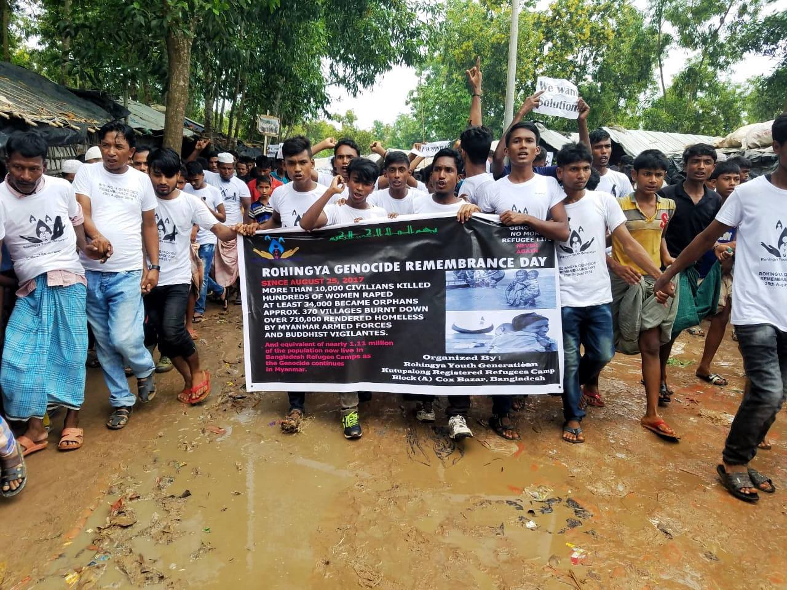
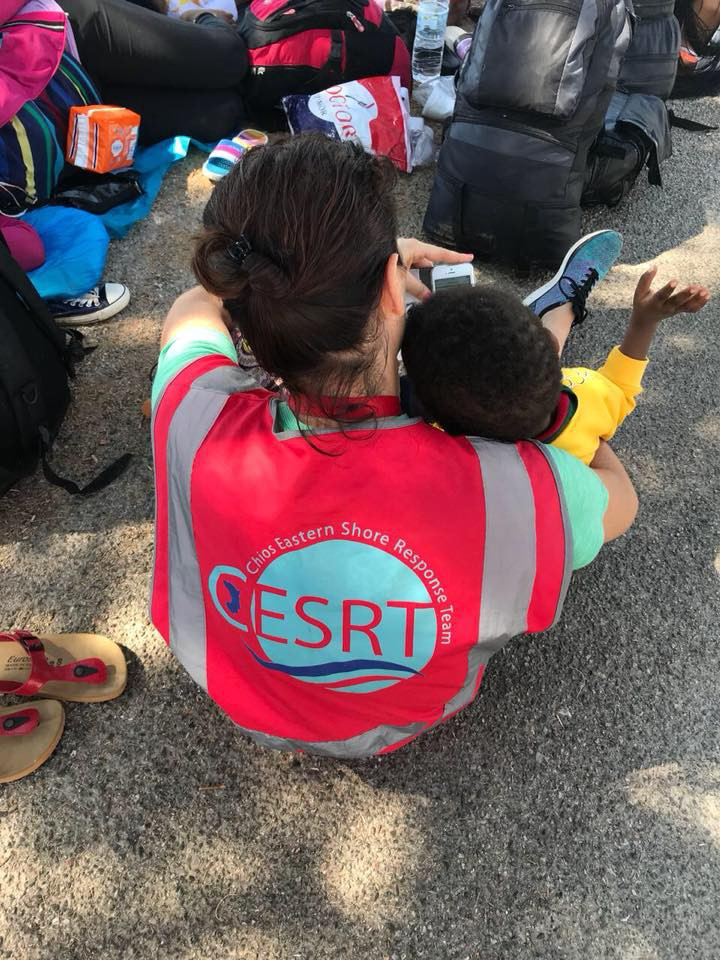
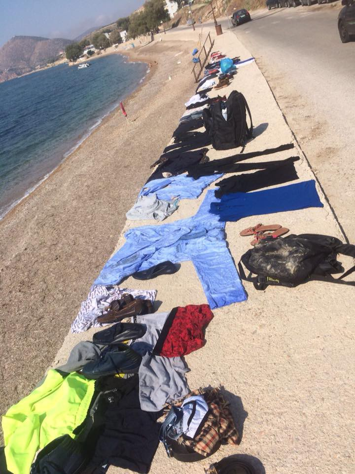
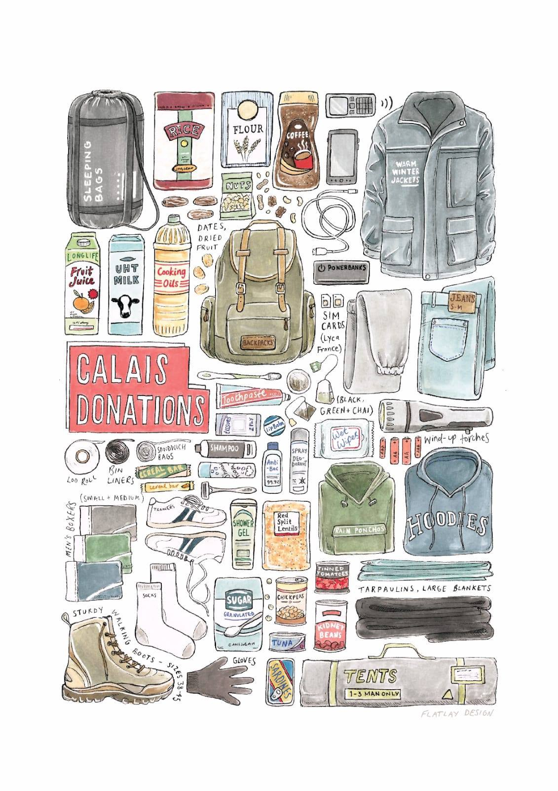
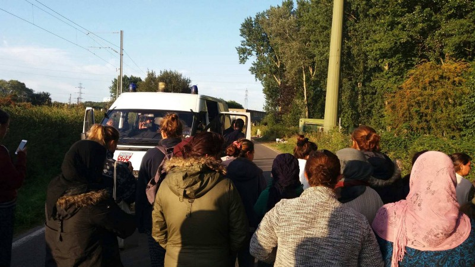
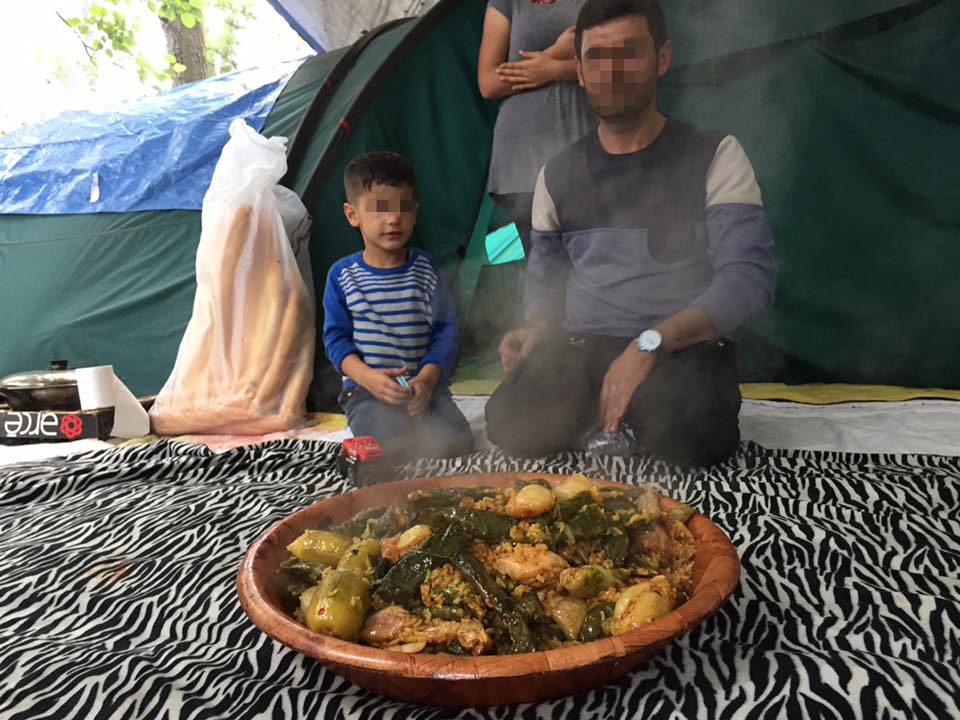

### AYS Weekend Digest 25–26/08/2018: 177 people from the ship Diciotti finally free

Victory and Investigation against Italy’s Matteo Salvini // Salvamento Maritimo Rescues 174 people // Over 10,000 Rohingya Refugees march in Bangladesh // More reports about the violence at the EU border …

](assets/eee700615bc3/1*9gANCCnZe8vmMWm1REqgUw.jpeg)

Source: [MEDU — Medici per i Diritti Umani](https://www.facebook.com/MEDUonlus/)
#### Feature

**Finally, after five long days waiting in the harbor and 10 at sea, the ship Diciotti was disembarked in Catania, Italy\.** It took lot of negotiation, and included massive protests against the inhumane and illegal actions of the Italian government\. The first ones to disembark were 12 adults with health problems, including tuberculosis, pneumonia, scabies and urinary infections\.

](assets/eee700615bc3/1*hMLkk03QHqilTBjmCRJ1lA.jpeg)

Photo by [Watch the Med Alarmphone](https://www.facebook.com/watchthemed.alarmphone/photos/pcb.2206586966282201/2206582426282655/?type=3&theater)

Italian media are reporting that most of the people who were on the ship could apply for political asylum\. [Daniela de Robert](https://www.internazionale.it/bloc-notes/annalisa-camilli/2018/08/24/diciotti-guardia-costiera-migranti) , a journalist and human rights activist who was on the boat, reported that most of them are coming from Eritrea, Syria, Bangladesh, Egypt and Somalia\.

The disembarkation of 138 people started on Saturday after Interior Minister Matteo Salvini finally give his authorization\. The Diciotti rescued 177 on August 16 and docked in Catania on August 20\. On August 22, permission was issued for 27 minors to disembark\. Salvini prevented the rest of those onboard leaving the ship until other EU states agreed to take some of the people\.

The Attorney General’s Office of the city of Agrigento got involved and announced the investigation against Salvini for kidnapping, unlawful arrest and abuse of authority\.

After the investigation was opened, [_La Stampa_](http://www.lastampa.it/2018/08/26/italia/migranti-la-procura-indaga-matteo-salvini-mi-vengano-a-prendere-li-aspetto-un-ciclone-si-abbatte-sul-governo-QoPCf3Vg9ZTw7czwAhpQ5H/premium.html) reported that Italy had appeared to be in violation of the European Convention on Human Rights, which states that any asylum seeker detained for more than 48 hours should be released and given the opportunity to apply for refugee status\.

At the moment, it is not clear which countries will host those from the boat\. It has been confirmed that Albania, a non EU member, will take 12 of them\.

Important pressure during this drama, that lasted for days, came from people who decided to not stay quiet\. Thousands went out on the streets and demanded that their voices were heard\. At some point protesters clashed with the police, and one policeman and one protestor were injured\.

[Watch The Med — Alarmphone](https://www.facebook.com/watchthemed.alarmphone/?hc_ref=ARRTXP_09NWJ_sbWpZK29I3eLLSPAeAlxOJtw-Ap6bepi5Vwl2rC7fNq4O8R_xJp62s&fref=nf&hc_location=group&__xts__%5B0%5D=68.ARAh4cRYgjGghG9OTUoi8TdqMyZ1AK24ehq-TXtisbsuqClkLe79kVXkxRTilJQ-j6jxeM9_ir0Ebk-SeE3ofAQquSeJbuvC-vy3qmbnlK9l77DPNFvm6wgFBO232o-O4cY97uOfylMJ891OWC4h_8bJfB1BM1alTfIkjadYX280n3KVuFc40A&__tn__=kCH-R) followed the entire situation and have expressed their concerns for the situation in Europe where right\-wing politicians are able to dominate the agenda\.

_“Once again, we have a situation where people fleeing war\-torn and poverty\-stricken countries, many of whom have suffered tremendously during their time in Libya, finally escaped via the sea and onto an Italian coastguard vessel\. When they believed the worst was behind them, they were taken hostage and continued to suffer, not knowing what would happen to them, with the Italian government even threatening to return them into torture camps in Libya\. Now, they are used in political games, some to be “distributed” to different countries, seemingly unable to claim asylum in Italy which is their right\.”_

While the people were trapped on the boat, a number of organisations signed an open letter to the Italian Government about this situation\. These included Caritas, A Buon Diritto, ACLI, ActionAid, Amnesty International Italia, ARCI, ASGI, Casa dei Diritti Sociali, Centro Astalli, CIR, Comunità di S\.Egidio, CNCA, Emergency, Médecins du Monde Missione Italia, Mediterranean Hope \(FCEI\), MEDU, Save The Children Italia, Senza Confine and Oxfam Italia del Tavolo Asilo Nazionale\. More importantly people went on the streets and came to the harbour to protest what is happening and to show their support, proving one more time how necessary it is to raise our voices against injustice and human rights violations\.

We cannot quietly watch fascism come back\. We have to act and resist\.
#### **NIGER**

**The [_New York Times_](https://www.nytimes.com/2018/08/25/world/africa/niger-migration-crisis.html) writes about how Niger has drastically reduced the number of people moving north through Libya over the past two years\.** Over that period of time, the government receiving large payments from the EU for stopping people doing so\. It notes that more African migrants have now been fleeing Libya to return to their homelands\. This article suggests the strategy has lead to smugglers taking greater risks and more dangerous journeys across the Sahara in an effort to not get caught, often abandoning people in the desert if they know the military is present\. It has also lead to economic decline in those parts of Niger that flourished from the passage of the people on the move\.
#### BANGLADESH

[**More than 10,000 Rohingya Refugees march in Bangladesh**](https://www.facebook.com/groups/1652972374920129/) **to raise awareness of the genocide commited against them by Myanmar’s army\.** Since August 2017 over 720,000 Rohingya escaped Myanmar into neighbouring Bangladesh\.

> Discriminated and persecuted for decades by the authorities and army of Myanmar, the Rohingya in Bangladesh are not remaining silent\. They protest today to mark the **Rohingya Genocide Remembrance Day\.** 

To learn more about the plight of the Rohingya please [follow this link](https://1976km.com/aysspecial-report) \.

Source: Rajman Ali/1976KM
#### MOROCCO

](assets/eee700615bc3/1*1pBHCU-WSR7Z7So35kWauA.jpeg)

Photo by [Association Marocaine des Droits Humains — Section Nador](https://www.facebook.com/AmdhNador/?hc_ref=ARQ20CmXNXjElijGXNsy_0PC-RMb-2Uv5zG3GrsS_PBw7qT21zPKXuR0P4TKvSKx0fM&fref=nf&hc_location=group&__xts__%5B0%5D=68.ARCbPKaCOnAkCX6d9Avg3wzgK8jzrpNC4fBC4wlyXpeKnbsvSc7nBPDuPK-DnezsMK40kUEXM8cQjzJmcS1Cx3C5mn7_CxtSInNE08Q35ZueoXosjJSAhYFwNLN4dtEN-dnyGBcH-q5DLVYdUoYWCCZ37wicSAbNB1Eld6Tnfbu3Sf7OkYIMLQ&__tn__=kCH-R)

**Police continue with the attacks against people in Tangier\.** On Saturday and Sunday a wave of massive arrests started and over 500 people were taken to the police stations\.

[Association Marocaine des Droits Humains — Section Nador](https://www.facebook.com/AmdhNador/?hc_ref=ARQ20CmXNXjElijGXNsy_0PC-RMb-2Uv5zG3GrsS_PBw7qT21zPKXuR0P4TKvSKx0fM&fref=nf&hc_location=group&__xts__%5B0%5D=68.ARCbPKaCOnAkCX6d9Avg3wzgK8jzrpNC4fBC4wlyXpeKnbsvSc7nBPDuPK-DnezsMK40kUEXM8cQjzJmcS1Cx3C5mn7_CxtSInNE08Q35ZueoXosjJSAhYFwNLN4dtEN-dnyGBcH-q5DLVYdUoYWCCZ37wicSAbNB1Eld6Tnfbu3Sf7OkYIMLQ&__tn__=kCH-R) reports on people being seriously injured during the police attacks\.

In the meantime, as [_ABC_](https://www.abc.es/espana/abci-sanchez-quiere-expulsar-siempre-pueda-inmigrantes-ilegales-marruecos-201808260315_noticia.html) reports, the Prime Minister of Spain wants to return to Morocco all those who enter Spain through the border fences of Ceuta and Melilla\. The government acts in accordance with the agreement on readmission from 1992, that gives a legal framework to support deportations\.
#### SEA

**A movement is sweeping across Europe against the criminalisation of maritime rescue [European Protests: Build Bridges not Walls](https://www.facebook.com/events/2068276653244309/) \.**

At the current moment, almost all ships chartered by private rescue organizations have been moored in European ports\. The Seebruecke movement is calling for European Protests from 25 August to 2 September\.

\#BUILDBRIDGESNOTWALLS

_‘The situation in the Mediterranean remains unbearable: people are drowning on their way to Europe and there’s barely anyone left to rescue them\. European politicians such as Seehofer, Salvini, and Kurz are systematically blocking private rescues at sea and are consciously accepting the deaths of many people\. According to the International Organization for Migration \(IOM\), more than 1,500 people have drowned since the beginning of 2018\. We will no longer tolerate this\!’_

To find out more please [follow this link\.](https://seebruecke.org/european-protests-build-bridges-not-walls/)

Protests are already taking place all over Europe\.

**Protests across Germany \#seebruecke \#bridgesnotwalls**

■■■■■■■■■■■■■■ 
> **[Störungsmelder](https://twitter.com/stoerungsblog) @ Twitter Says:** 

> > 1600 Bei @[_Seebruecke_](https://twitter.com/_Seebruecke_)-Demo in #Dresden laufen 1000-1500 für Seenotrettung &amp; protestieren gegen die #Identitäre-Veranstaltung. Bei den Völkischen ist nach Ausschreitungen gegen Journalisten die Teilnehmerzahl rückläufig.
#dd2508 https://t.co/Gciumybeq2 

> **Tweeted at [2018-08-25 14:07:54](https://twitter.com/stoerungsblog/status/1033355288978616320).** 

■■■■■■■■■■■■■■ 

■■■■■■■■■■■■■■ 
> **[Claus-Peter Reisch](https://twitter.com/ClausReisch) @ Twitter Says:** 

> > So sieht eines der Boote aus, auf denen jeweils bis zu 160 Menschen gepfercht werden. Wenn die Grenzen nicht so undurchlässig wären, könnten die Schlepper kein solches Geschäft machen. Deshalb: #bridgesnotwalls!
#muc2508 #Seebruecke https://t.co/Ur9aASE4OS 

> **Tweeted at [2018-08-25 13:20:09](https://twitter.com/clausreisch/status/1033343271014203392).** 

■■■■■■■■■■■■■■ 

Five survivors rescued by SOS Mediteraranee return to Tunisia with no better alternative\. The rescue team transferred them in the early hours of Saturday morning onto a Tunisian Naval Vessel off the coast of Bizzette\. The Aquarius has since returned to the rescue zone\.

■■■■■■■■■■■■■■ 
> **[SOS MEDITERRANEE](https://twitter.com/SOSMedIntl) @ Twitter Says:** 

> > UPDATE After several days of negotiations with different agencies and authorities, our teams discussed the situation with the 5 survivors rescued on 17 Aug so that they could make an informed decision. They decided to go back to #Tunisia because of the lack of other options 1/2 https://t.co/xGxskDAP1Z 

> **Tweeted at [2018-08-25 11:52:57](https://twitter.com/sosmedintl/status/1033321327371931648).** 

■■■■■■■■■■■■■■ 

Salvamento Maritimo Rescues 174 people\.

■■■■■■■■■■■■■■ 
> **[SALVAMENTO MARÍTIMO](https://twitter.com/salvamentogob) @ Twitter Says:** 

> > Balance total pateras hoy 19:40h. Rescatadas 174 #personas de 6 #pateras +2 pateras toy + 2 kayaks por @[guardiacivil](https://twitter.com/guardiacivil)  @[Armada_esp](https://twitter.com/Armada_esp) y @[salvamentogob](https://twitter.com/salvamentogob) En fotos, las 2 pateras rescatadas hoy por la tripulación salvamar Gadir. 
GRACIAS! a todos los que han ayudado a salvar sus vidas. https://t.co/MJdPZbTGh2 

> **Tweeted at [2018-08-25 17:41:25](https://twitter.com/salvamentogob/status/1033409023557754880).** 

■■■■■■■■■■■■■■ 

[Aegean Boat Report](https://www.facebook.com/AegeanBoatReport/?hc_ref=ARRpAcgbf58QBT-eoRS6ts_LpkOAcyaSuTU2tsjvwFWWFjL_ELNdIWBeI2ZJnJmDATU&fref=nf&hc_location=group&__xts__%5B0%5D=68.ARDFbkkukoSKB1UfCR5UC0vk5epyiVvfIA5XIWf9uOZ_8wamn1rMvT_udkdFXp3NgSVKF-HiVTBuPdVaS-7Aa8HXL7TKexP5ubKUBkzelS2ue0w8YwYZm5h1ALpAr1QVq4LYXu7kr0ghCbw1oKLEd5iPbd-ImLKa6f2U2PYC_-bGLREDqWp0cQ&__tn__=kCH-R) reports that in the early hours of Sunday, the Turkish Coast Guard stopped three boats in Mersinli Bay, east of Cesme, carrying 139 people\. Their destination was Chios\.

#### GREECE

**Seven boats arrived on the Greek Islands this Saturday\.** Three boats arrived on Chios, the first carrying 71 people, the second carrying 47 people and the third carrying 12 people\. Two boats arrived on Samos, the first boat carrying 46 people and the second boat carrying 31 people\. Another two boats arrived on Lesvos, the first carrying 24 people and the second carying 47 people\.

For a full breakdown of arrivals please [follow this link\.](https://www.facebook.com/AegeanBoatReport/posts/437211166801993?__tn__=K-R)

Source: Emma Vagabond Roberts

Activists in Greece are recording more and more attack against refugees\.

**Tips on how to find a job in Greece**

Refugee Info Bus shares some useful recommendations for finding a job in Greece\. _‘There are a lot of job opportunities with organizations, especially for people who can speak English or Greek, plus languages like Persian or Pashto, Arabic, French or Kurdish\. There are also many organisations that will help you write your resume’_

There is also work available on farms, hotels and factories\. If you [follow this link](https://www.facebook.com/Employability-Service-by-SolidarityNow-583793971990063/) you will be directed to a page where available jobs are posted\.

[Lifting Hands International](https://www.facebook.com/groups/infopointfornortherngreecevolunteers/permalink/717813751898254/?__xts__%5B0%5D=68.ARCw3fCnuhW_Yc20W58-JmGK2oc0ihOH6f3KWMezdJKFl62jwsmUwV2HqrbBg9F1plJ8FZYrMnjanAVAOjMJxpLu9XH5vUbkID1dyNOyqb6A77bpV2oKoCN3DHpD_Ctp5CTOACw&__tn__=-R) is looking for volunteers to work with them in October and beyond\. The group provides a huge range of classes and activities for Yazidi refugees in Serres, Northern Greece\.

[Hope Cafe](https://www.facebook.com/soulfoodforrefugees/?hc_ref=ARTGxYN6JHXhKVZdyiZO15iyKXXlt8uh05Ezp1VfPG6VG08xSh93OGI1MNSB74PHpr4&hc_location=group&__xts__%5B0%5D=68.ARDoFPtW6NF7a_2nqsrU6arSQWZYIBc5WKoBYgfhVyNYE8IMhh69TWqm_NTxp1MdyfvXNSf0cT6BtOWCW_XSuOsC7VpHVZ1vv2kwbiRl3EYGizv_FLkgwh73PeDjg089X-qmJOJCRsj-3GjiXeiwfqh-z_FRzpXqrOIVa9pQ0HKFnMMZvPa6eQ&__tn__=kCH-R) stock is at an all time low these days and they need help to buy:
Pajamas for Mums €5 new
Pushchairs €49
Baby toiletries €12

They also need baby items, such as baby shampoo, Talcum powder, breast pads, sanitary towels, baby milk and wipes\.
#### GERMANY

A Fascist attack on one asylum seeker occured in Chemnitz on Saturday\. It was just another attack in a series this year\.
#### FRANCE

[Help Refugees](https://www.facebook.com/HelpRefugeesUK/?hc_ref=ARRwNDu17tl8kcvU99Vz6iILj-PAq-KXhXgwdb5fnzm8bvoYaj5FvBB0OGHUbTIuDM8&fref=nf&hc_location=group&__xts__%5B0%5D=68.ARC7aTcg9sVFEEAO_1PU0bYp_jifNpWY-kNoVtT0sHrVd10ph3rr0Y4XwnoA3pIkRCgT9Bomlfc0jlhjxNi3hl6C8-mYWozgX68JDilyHHE9vfbNNEHXomNLIqCZJJHKc0aBMTI9RKvooZghSd0-gFFSUx9W3aD_bDe3OrdLL-HUEPsW5ofxxQ&__tn__=kCH-R) published a call for donations for Calais and Dunkirk\. [Find out](https://helprefugees.org/donate-goods/) what’s needed and what you can do to help get these items\.

On Friday 24 August, the women in Grande\-Synthe organised and staged a protest against the third scheduled eviction in one week\.

The Women’s Centre joined the women in protesting for the provision of suitable and adequate accommodation, to be allocated in a dignified and respectful manner, which does not involve the destruction of people’s belongings\.

_“While this will not be the end of evictions, the protest provided a platform for the camps voices to be heard, all instigated by our super women\. We are inspired and in total admiration of their strength and determination, who despite being faced with constant hostility, united in their grace and stood up for their collective\.”_

[The Mobile Refugee Support](http://www.mobilerefugeesupport.org) reports about the people in the Dunkirk area\.

_“One evening this week after work, our team were invited to eat with a family we have gotten particularly close to over these last months\. We sat under a tarpaulin canopy attached to trees, on a ground sheet covered in blankets, and were served an incredible dinner of Kurdish dolma and biriani\. After, we drank tea and talked while the younger children climbed and clambered over our volunteers as though they were family\. With almost nothing to offer these people will share what little they do have so eagerly\.”_

THIS WEEK IN AYS DIGESTS:

In a report released on August 7th, FRONTEX celebrated the decrease of “migration flow” from the end of 2015 until now\. The publication cites the closure of the route in 2016 as being a key component in the decrease of migration, as well as crediting enhanced security measures at EU borders with Serbia, translating to primarily Romania, Hungary, and Croatia\. [\(Read more in the digest from August 22nd\)](ays-daily-digest-23-08-2018-frontex-celebrates-as-people-suffer-2db7e3d40d03)

[According to](http://balkans.aljazeera.net/vijesti/mektic-nije-odobren-nijedan-azil-migrantima-u-bih) Bosnia’s Ministry of Security, which is responsible for asylum seekers, not even one asylum case has been processed in the country, though more than 800 people have applied\. The number could be much higher, but the current system is also preventing people from applying for asylum in the first place\. \( [Read more in the digest from August 21st](ays-daily-digest-21-8-2018-no-asylum-in-bosnia-636b865f0ae) \)

In protesting the “death of human rights in Malta” [crew members of MV Lifeline and Sea\-Watch 3](https://www.maltatoday.com.mt/news/national/88995/symbolic_funeral_in_valletta_accompanies_lifeline_captain_to_court#.W39gF-hKg2x) carried a coffin from Castille Square to the court building in Valletta on Thursday\. The coffin was draped in an EU flag\. Their Captain Claus\-Peter Reisch has charges against him for improper ship registration\. It is registered as a pleasure craft in the Netherlands and therefore, the claim is made, it cannot serve on a rescue mission\. [\(Read more in the digest from August 23rd\)](ays-daily-digest-23-08-18-protesting-the-death-of-human-rights-in-malta-b24fbe05c5bc)

**We strive to echo correct news from the ground through collaboration and fairness\.**

**Every effort has been made to credit organizations and individuals with regard to the supply of information, video, and photo material \(in cases where the source wanted to be accredited\) \. Please notify us regarding corrections\.**

**If there’s anything you want to share or comment, contact us through Facebook or write to: areyousyrious@gmail\.com**

_Converted [Medium Post](https://medium.com/are-you-syrious/ays-weekend-digest-25-26-08-2018-177-people-from-the-ship-diciotti-finally-free-eee700615bc3) by [ZMediumToMarkdown](https://github.com/ZhgChgLi/ZMediumToMarkdown)._
