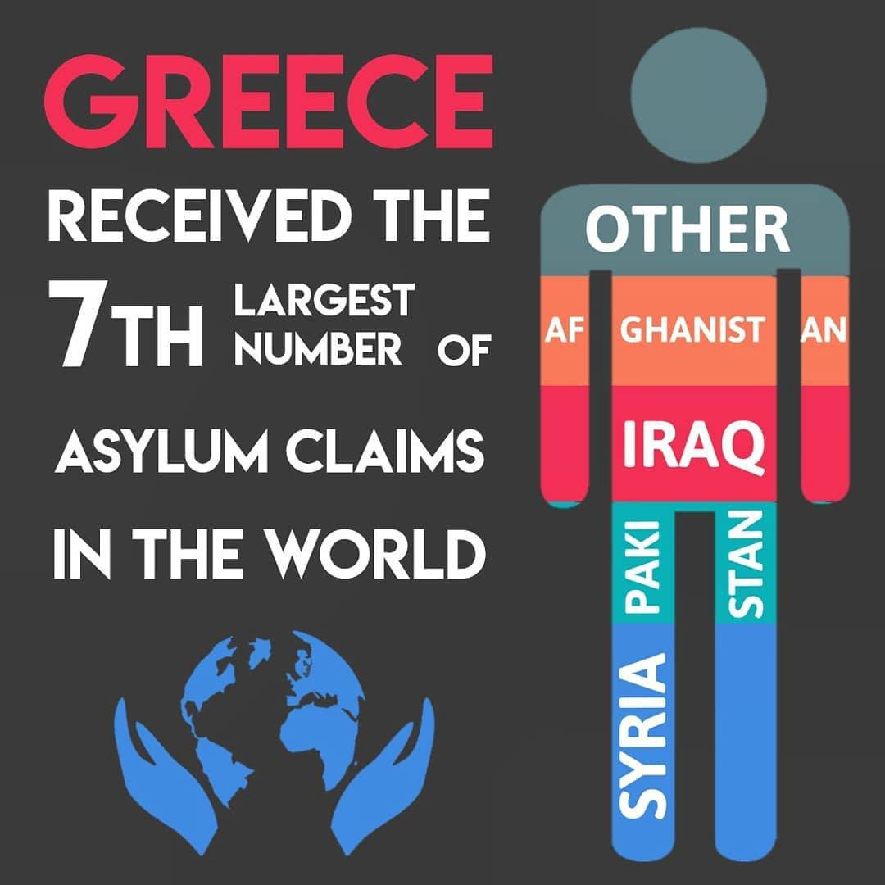
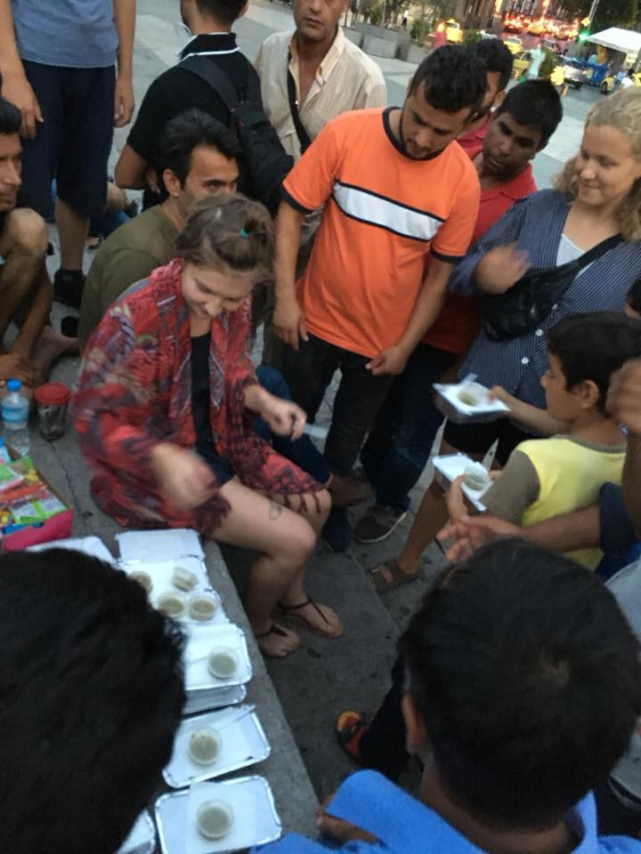
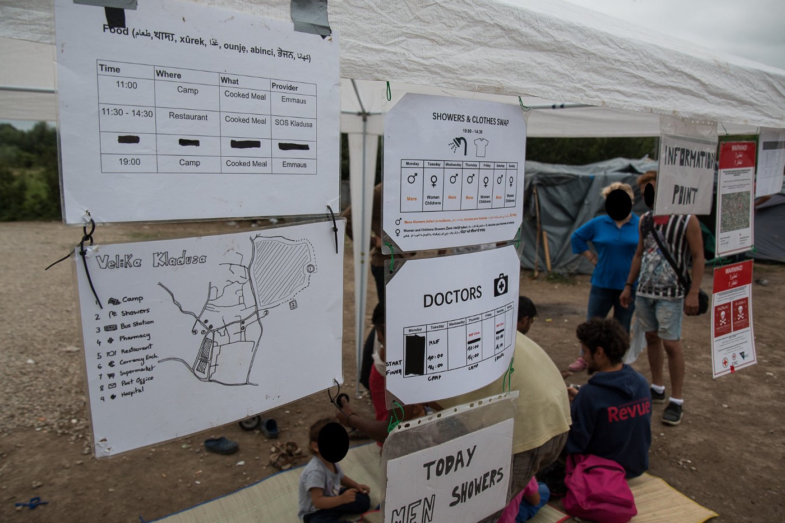
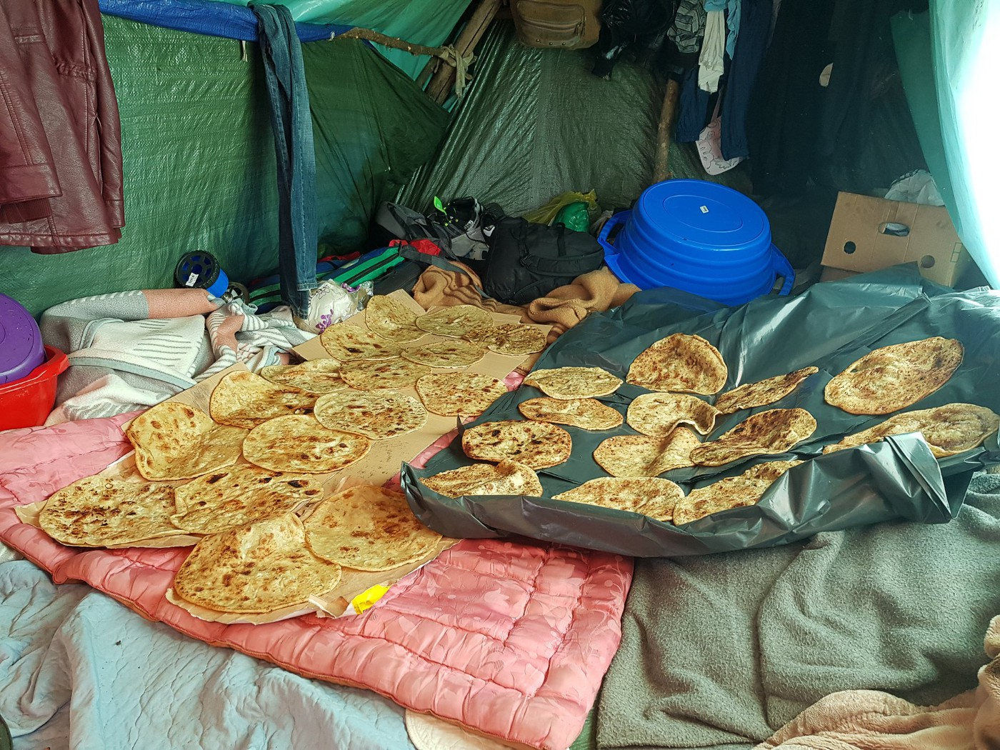
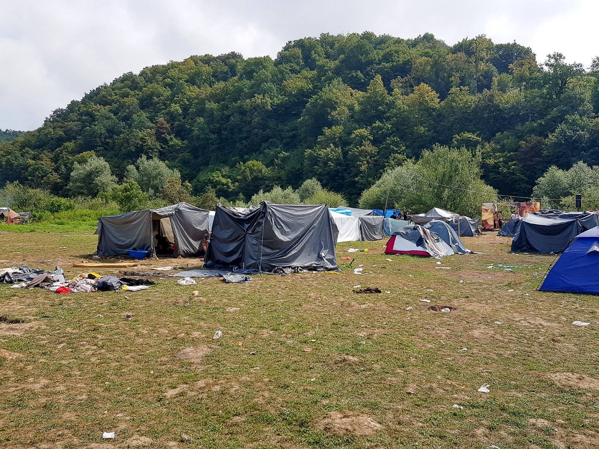
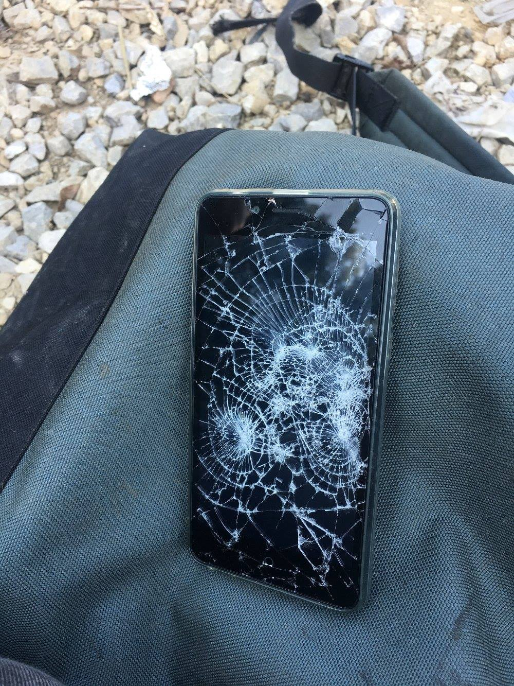
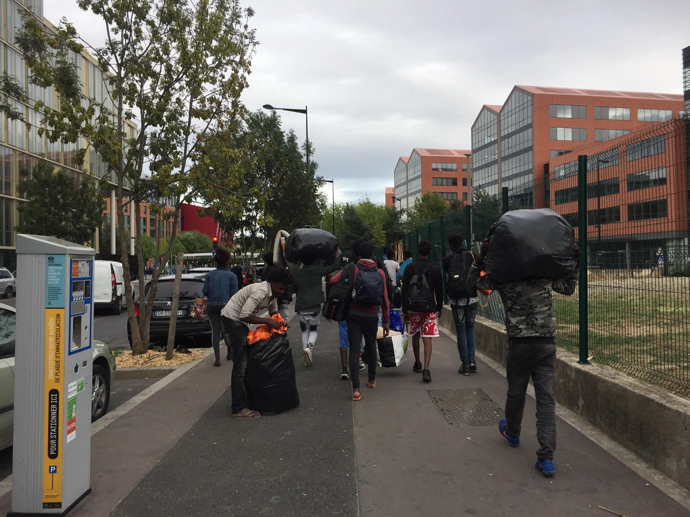

### AYS DAILY DIGEST 27/8/2018: Fascists in Chemnitz confronted by strong antifascist groups

_Fascists in Germany are mobilizing against people on the move and antifascists // Call from solidarity from Chemnitz // People from Diciotti, show severe signs of trauma // 45 children on 5 boats that arrived in Greece on Monday // Violence at the EU border continues // The Sweden Democrats announced o they want to stop accepting quota refugees_

#### Feature

**Antifascist [counter actions](https://c2708.noblogs.org/) are taking place in Chemnitz, Germany after a series of brutal attacks committed over the weekend by the far right supporters in this city\.** The attacks are organised by the supporters of the far\-right Alternative for Germany party \(AfD\), which received nearly a quarter of the vote last year at the elections, and of PEGIDA, a German nationalist anti\-Islam and anti\-immigration group\.

The media are reporting how the far\-right protesters have been “hunting down” foreigners in street mobs\.

Activists from the Research Collective Dresden filmed the video recording the statements by some of the neo\-nazi protesters who are saying: “for every dead German a dead foreigner”, “like the races, the ticks, that’s not\!”, “foreigners out”, “German, social and national”\. They have also chanted “Luegenpresse,” a Nazi\-era term which translates to “lying press”\. Police reported Hitler salutes were seen among the right\-wing crowd\.

On Monday evening, neo\-nazis were confronted by the antifascists and asylum seekers\. Several people were injured as pyrotechnics and objects were thrown from both sides\. Finally, the police used water cannon, and enforcement had to be called from Leipzig and Dresden\.

The left\-wing demonstrators were chanting “National Socialism out of people’s heads” and “There is no right to Nazi propaganda\.”

[Chemnitz German Citizens fighting back against Muslim attacks & several arrested & injured](http://www.youtube.com/watch?v=atatN8nELKE)

As an excuse to go out on the streets and initiated their hunt, fascist used an incident that happened this weekend during the Chemnitz City Festival when, allegedly, one men was stabbed during an altercation that involved 10 people\. Police reported that several people were stabbed and seriously injured, while two — one from Syria and one from Iraq \- were taken into custody\.

[Antifascist media](https://www.facebook.com/beyondeurope/posts/1825129884232204?__xts__%5B0%5D=68.ARAMX5_0jSpJJkvYyy-DfALtyfZbnr_t2ro9e-vxxHCYltmTSLprMxfyZVPkgCI68-WcUDEGIzI8rJwmvXEwk9qknTeeNfn87fASKVjDjYfy4HO7Eh8Zd7-lKXj9VT6jdhMxG2x4wa0V7KEl2o1pBT_25x7C9A_zO9H9ylRKcFx8lfWBOeRECPb5fg&__tn__=-R) are reporting that far\-right supporters have launched a major mobilization nationwide, especially among neo\-nazis and hooligans\. “The situation is serious and we need all the support to prevent a pogrom\-alike situation,” Beyond Europe warns\.
#### Turkey

Over the last week, **Turkish coast guard prevented 608 people to leave this country** and go to the EU, the Turkish interior ministry [reports](http://www.ansamed.info/.../migrants-608-apprehended-at..) \.

According to the [official sources](http://www.hurriyetdailynews.com/amp/over-610-000-syrians-enrolled-in-turkish-education-system-during-2017-2018-school-year-136172?__twitter_impression=true) , some 610,278 Syrian children were enrolled in Turkey during the 2017–2018 school year\. There are currently 973,200 Syrian school\-aged refugee children in this country\.
#### Cyprus

**The International Protection Administrative Court \(IPAC\) has been set up with the task to examine appeals against asylum claim rejections, in order to speed up the process\.**

The IPAC will be competent for examining appeals relating to provisions of the Refugee Law, including appeals against negative decisions on asylum applications, Dublin transfer decisions or decisions reducing or withdrawing reception conditions\.

Currently, appeals against asylum decisions take approximately two years to be decided\.
#### Italy

**People who were stranded on the boat Diciotti, show severe signs of trauma\.** Many claim having being sold after a previous crossing attempt by Libyan Coast Guards to militias in Tripoli which abused them, according to workers from Terre des Hommes \(TDH\) and Doctors Without Borders \(MSF\) \.

Both teams met with minors, 25 of them, who were on the boat\.

The day after they disembarked, the media are focusing on the criminal investigation against minister Salvini\. Sicilian prosecutor Luigi Patronaggio charged him with kidnap, illegal arrest and abuse of office after accusing him of confining more than 100 migrants to the coastguard rescue ship for ten days\.

Germany Die Welt reports those on board the ship were only allowed to disembark after Deputy PM Di Maio called Salvini, warning him of pressure coming from his party base, and not because of all the call for humanity and respect of the law\.

After Italy accepted the offer from Albania to take some of the people who disembarked from the boat Diciotti, the Association for Legal Studies on Immigration reminded that it is not the EU member state, and not under the common European Asylum System\. They claim that a transfer in this country can only happen if refugees agree\.
#### Greece

[**Aegean Boat Report**](https://www.facebook.com/AegeanBoatReport/posts/438073676715742?__xts__%5B0%5D=68.ARBX_SLrmn-Zda7GoErSOA2tojAMMmFbgcVJqfI7rZ5VUXfgSPRtaELDhQTnR_InqxiRKH7vYJYSE5KiOy8Vu_1dhNo2W9KYU9ZGeS9OlltqYsD3yNDODwnEUdzaK9rCYQRyQaQ&__tn__=-R) **recorded 158 new arrivals on five boats on Monday\.** At least 45 passengers on these boats were children\. Among them, two unaccompanied 14\-year\-old boys from Afghanistan who were traveling in a small canoe from Turkey\. When found, they were in shock, wet and cold\.

By the Open Cultural Center\.

[The Greek Asylum Center](http://asylo.gov.gr/en/?page_id=110) reports that from 10 years ago, the number of asylum applications in Greece has increased by a 200 per cent\. Most asylum seekers come from Syria, Pakistan, Iraq and Afghanistan\. [The Mobile Info Team](https://www.facebook.com/mobileinfoteam/?hc_ref=ARQIh-QPFW-Jd28nE1E6ONzru8B-jev9eXVzwnpQNTRbxw-B8UsflU5rrljQmr8Aiv8&fref=nf) looked into the statistics from GAS on how likely it is for certain nationalities to get asylum in Greece\.

Syrians — 99,6 percent
Yemen 94,8 percent
Palestinians 96,1 percent

The possibility to get status is also good for the people from Iraq and Afghanistan, with 7 out of 10 positive applications\. The lowest recognition rate is for people from Pakistan, only about 2,4 per cent\.

Photo by One House

Activists and volunteers from Our House are still doing their best to help all those in need, especially people who are forced to stay in the streets, being homeless Greeks or people on the move\. They bring food, but also come to show solidarity, talk to the people, play music, give a hear\-cuts… This Wednesday they will have a guitar teacher\.

To continue their work, they need [help](http://www.paypal.me/Helphumaninneed) \.
#### Bosnia

**Over 300 people are staying in a makeshift camp in Velika Kladuša for over two months, now\.** Much more are in other places around the town, being squats, tents or living with the locals\.

A couple of weeks ago, authorities and IOM moved most of the families from this place where basic living conditions exist to the hotel Sedra, near Bihać, which is turned into the camp\.

Photo by SOS Team Kladuša

Volunteers in Kladuša are doing their best to make living conditions for those in Kladuša at least a bit less harsh\. SOS team Kladuša started to winterize the operation: Info team daily provides local and general information\. The building team is continuously fixing and building tents, workshop equip\. No Name Kitchen provides showers and NFI\. They all need help to continue helping\.

Croatia 
**Meantime, border violence continues\. [NNK team](https://www.facebook.com/NoNameKitchenBelgrade/posts/585068641891424?__xts__%5B0%5D=68.ARC0sOGEeT8-IadFzNLnbCoZoR1WcGDEezDp7HIKmbrS1A10nF7eig4MDZF-kTOxpIhTpTaehvaO-xqPGckkeRFBqV15nbjl9REi_BsjrdclTZDH7t9Hdi3Wtf8AEmBVonEISf3dFdXyBwcY1vOgSMdA7JCVxiMVC1Nw-83Zrh6iSwcFNnXIShitDPg&__tn__=-R) recorded a case of a minor and a handicapped person who was beaten up\.**

Photo NNK

_“I told the police not to beat my brother because he was 16 years old\. But they did not understand and were beating him too\. They started hitting my little brother who is 16 years old, without asking for anything\. And after, they opened the cables in their sticks and hit my little brother\. The kept saying to me: “Pička materina, fuck, fuck you, pičko materina\!” They also took my orthopaedic leg and after they crashed it with their boots\. This was the second time they \[Croatian police\] broke my orthopaedic leg\.”_
#### Austria

**Die Presse reports Austrian Defence Minister Mario Kunasek wants to use a meeting with EU counterparts this week to put forward plans for military assistance deployments at the EU’s external borders and in third countries\.** The plans would reportedly see soldiers from the Member States deployed to support Frontex, whose staff will be expanded to 10,000 by 2020\.
#### France

**Police in France continues hunting down people on the move,** as [volunteers are reporting](https://www.facebook.com/permalink.php?story_fbid=980373425496763&id=598228360377940&__xts__%5B0%5D=68.ARD_8ieaSmpCWg1BYt8simqwp__PBHX16Sb-HKZp9QVFJt0k1BQAoyOHELJolXxjYRRcO8HKKikHV6op9bvkJXzB2NibF-ZHOErW_z7cxUrE0a2WSQ5ly3t6LC_OjKBScD2EnhiijKe5HBEwR3hdRyh55mcQGTAIBfUG9xEYz0hsp8ktJmdGOgzTHA&__tn__=-R) \.

_“Tonight I arrived with some products to distribute for the exiles around 16 at the gate of Aubervilliers\. I was accompanied by two friends, Omar and Amine\. They brought me behind the device where a hundred people were asleep knowing they probably needed razors, toothbrushes and bags\. At the end of our small distribution several dozens, police officers \(about 40\) arrived to evacuate the place\. I was told that a cleaning team was coming, and they had to leave with all their business \(mattresses, tents, blankets, sleeping bags, backpacks, etc\) \. Except the police came in without any solution\. We were left alone \(we and other volunteers who were on site by chance\) with a hundred people — men alone, families with pregnant babies and women without accommodation solution\.”_

The volunteer from the VZWG Gent4Humanity Dorine Deceur who is in Dunkirk [speaks volumes](https://www.facebook.com/.../a.16259.../2109048249412990/) of what daily life is like in among the trees, tents and rough open ground where refugees are living on borrowed time until yet another eviction and journey to an unknown reception centre somewhere else in France\.
#### Sweden

**The Sweden Democrats announced on Monday that they want to stop accepting quota refugees from the UN\.** According to Paula Bieler, migration policy spokesperson, the situation in the country is not orderly regarding the reception conditions\. In 2018, Sweden agreed to take in 5000 extra vulnerable individuals through UN’s scheme\. This is an increase from last year when the government accepted 3400 people\. The reason for the increased number is the closed borders and in other ways stricter asylum politics, which has caused the overall drop in asylum applications in Sweden\. This agreement was made between the government and other main parties, as a compromise following 2015 and “the big refugee wave”\.

Up until now, the Sweden Democrats have been for accepting some quota refuges every year\. But in their new manifesto, which will be made public later this week, they have changed their minds\. Instead, they want to see a “repatriation billiard” \(1 billion SEK is approximately 1 million euro\) \. The money previously used for the UN refugees who enter the country will instead be disbursed for returning people\. But as a principle SD still stands behind the idea of a quota system, the migration policy spokesperson Paula Bieler said\.

During 2017 the number of quota refugees accepted [dropped significantly](https://www.migrationsverket.se/.../Sveriges..) worldwide since the US made fewer places available\. US, Australia, and Canada are among those who take in the highest number every year\. With its 5000 places, Sweden now is the country to resettle the third biggest number after Canada and the US\. When the US decreased its number of available places Canada decided to increase their, from 25 000 in 2017 up to 27 000 in 2018\. Since 2014, the need for resettlement has increased by 72 per cent, according to UNHCR\.

**We strive to echo correct news from the ground through collaboration and fairness\.**

**Every effort has been made to credit organizations and individuals with regard to the supply of information, video, and photo material \(in cases where the source wanted to be accredited\) \. Please notify us regarding corrections\.**

**If there’s anything you want to share or comment, contact us through Facebook or write to: areyousyrious@gmail\.com**

_Converted [Medium Post](https://medium.com/are-you-syrious/ays-daily-digest-27-8-2018-fascist-in-chemnitz-confronted-by-strong-antifascist-groups-73c73e38f26c) by [ZMediumToMarkdown](https://github.com/ZhgChgLi/ZMediumToMarkdown)._
