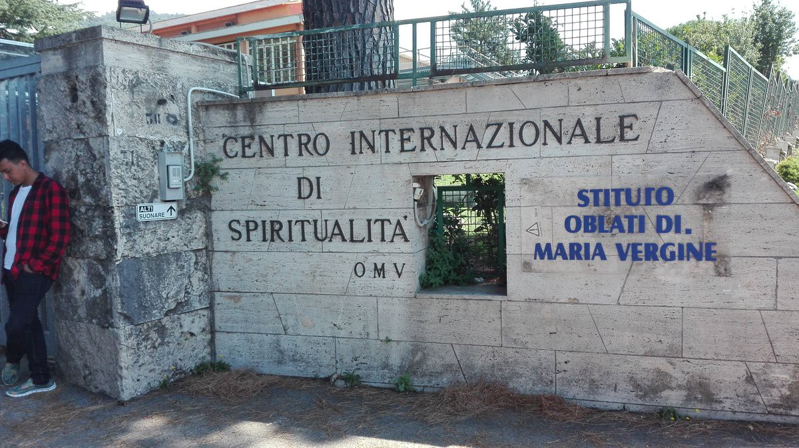
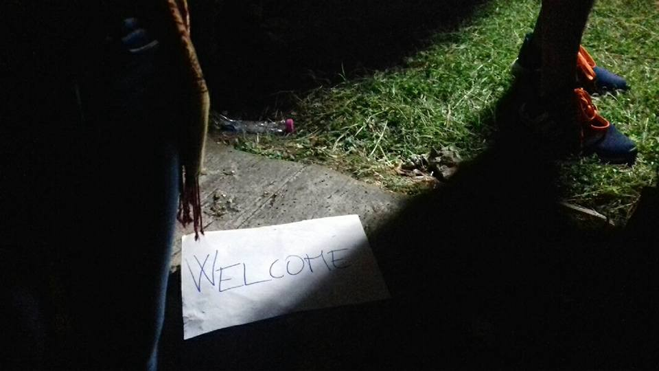
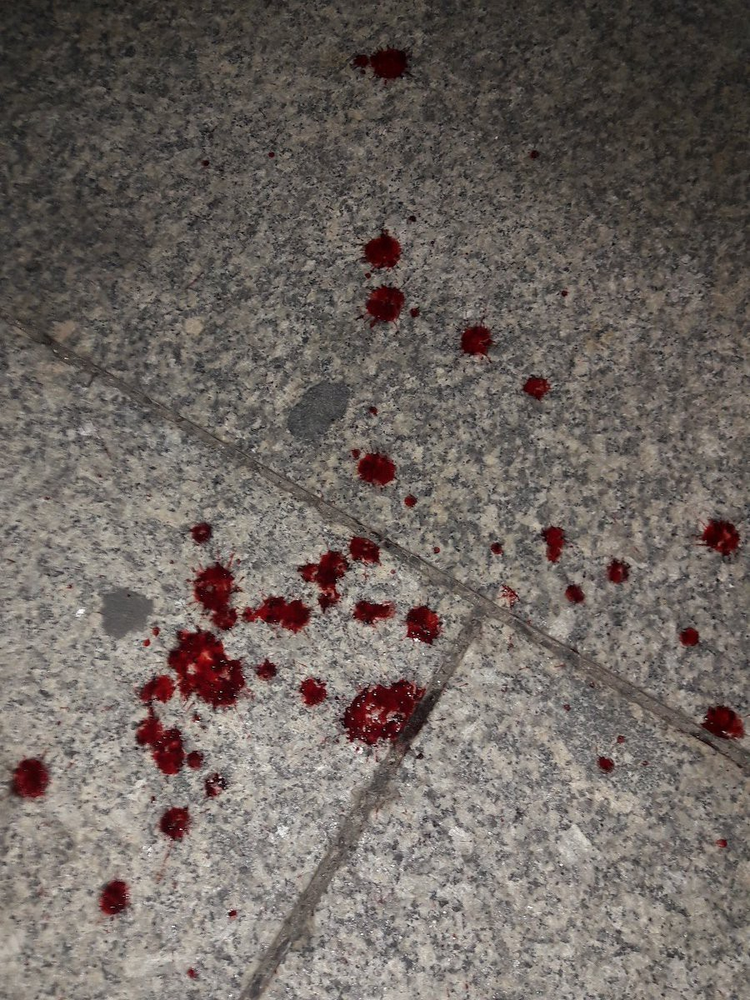

### AYS Daily Digest 28/08/18: 30 volunteers in Greece accused of conspiring in human trafficking criminal network

_Over 500 people arrived on the coast of Andalusia this weekend / new arrivals number in Greece and Italy / bloody fascist protest in Germany / restrictive laws for asylum seekers in Austria, Hungary, and Denmark / and more…_
### Feature

[3 members](http://www.dailystar.com.lb/News/World/2018/Aug-28/461484-greek-activists-held-for-illegally-aiding-migrants.ashx) of the emergency Response Center International \(ERCI\) NGO were arrested on Tuesday as part of a larger 30 member group accused of trafficking refugees\. On Thursday morning, the Greek police [issued a press release](https://www.protagon.gr/themata/focus/i-istoria-tis-sara-katigoreitai-gia-diakinisi-to-koritsi-pou-eswse-18-metanastes-44341678316) stating the volunteers were acting in “an organized criminal network that was systematically involved in facilitating the illegal entry of aliens into Greek territory\.”

It is very important to note that ERCI has not made any comments or statements at this time\.

The [3 volunteers](http://www.dailystar.com.lb/News/World/2018/Aug-28/461484-greek-activists-held-for-illegally-aiding-migrants.ashx) are being detained on Lesvos\. The identities of all 30 people are still unknown, but the Greek authorities have attested that 6 are Greek and 24 are non\-nationals\.

[Of the accusations](http://www.dailystar.com.lb/News/World/2018/Aug-28/461484-greek-activists-held-for-illegally-aiding-migrants.ashx) , they are being accused of actively assisting the illegal entry of migrants into Greek territory by keeping close contact with them on social media from the end of 2015 onwards\. [The police](http://www.dailystar.com.lb/News/World/2018/Aug-28/461484-greek-activists-held-for-illegally-aiding-migrants.ashx) have also claimed that they were monitoring migrant flows and keeping crucial information from the Greek authorities\. [The](http://www.efsyn.gr/arthro/se-rolo-diakiniti-30-meli-tis-mko-erci-sti-lesvo) y are accusing the NGO of making a profit off of migrants\.

[One of the volunteers arrested](https://www.independent.co.uk/news/people/yusra-mardini-rio-2016-olympics-womens-swimming-the-syrian-refugee-competing-in-the-olympics-who-a7173546.html) was Sarah Mardini, who made headlines in August 2015 for saving 20 people when she and her sister swam for 3 hours pulling an inflatable boat to shore\. She now attends [Bard College](https://www.protagon.gr/themata/focus/i-istoria-tis-sara-katigoreitai-gia-diakinisi-to-koritsi-pou-eswse-18-metanastes-44341678316) in Berlin, and has many alibis to attest to her taking exams and attending events in Germany during the timeline when she has been accused of trafficking on Lesvos\.

](assets/5c0f19998b03/1*_mCOkEzpvXd14lKVpYpQfA.jpeg)

Sarah in Lesvos in 2016 Photo By [Protagon](https://www.protagon.gr/themata/focus/i-istoria-tis-sara-katigoreitai-gia-diakinisi-to-koritsi-pou-eswse-18-metanastes-44341678316)

In a downward spiral happening across Europe, Greece seems to be taking more drastic efforts to criminalize NGOs and humanitarian aid to refugees\. AYS will continue to report on this developing story once ERCI comes forward with a statement\.
### Sea

[In a statement](https://sosmediterranee.com/press/statement-the-aquarius-in-marseille-for-a-technical-port-call/) from SOS Mediterranee, on Monday the Aquarius arrived in Marseille for a technical port call and will sail under a new Panamanian flag\. The formal registration is still being completed at port, which SOS Mediterranee fully supports\. They are planning for the Aquarius to be equipped and ready to leave by the end of next week to continue saving lives\.

](assets/5c0f19998b03/1*6jAfsT2YisuSdE0v7IRbYA.png)

Photo By AFP, contributed by [Alarmphone](https://www.facebook.com/watchthemed.alarmphone/photos/a.1526182797655958/2207768552830709/?type=3&theater&ifg=1)

There are no NGO search and rescue missions currently in the deadliest waters off the coast of Libya is the Aquarius is not currently operating in the Central Mediterranean, reports [Alarmphone](https://www.facebook.com/watchthemed.alarmphone/photos/a.1526182797655958/2207768552830709/?type=3&theater&ifg=1) \. Not only will this result in more deaths, but there will be no one to report on the human rights violations committed by the Libyan Coast Guard as well as their EU counterparts\.

[Salvamento Maritimo](https://twitter.com/salvamentogob/status/1034464791753052160) reports that the rescue mission Marina Gadir saved 44 persons on Thursday and are being moved to the port of Barbate\.

In the latest figures from [IOM](https://twitter.com/UNmigration/status/1034340059821092864) , 67,122 people arrived to Europe so far in 2018, while 1,549 remain missing or dead\.
### **Spain**

[Over 500 people](http://www.ansamed.info/ansamed/it/notizie/rubriche/cronaca/2018/08/28/migranti-spagna-tendopoli-esercito-per-emergenza-sbarchi_af0e0d17-c82f-4571-bdfd-4219dac9d997.html?idPhoto=1) arrived on the coast of Andalusia this weekend in 18 boats\. The Spanish government has set up 17 temporary large army tents as camps to accommodate the increased flow, with 80 military units from the Emergencies Military Unit \(UME\) \. Of the 500 people, around 50% were of Sub\-Saharan African and 18 were minors\.

](assets/5c0f19998b03/1*zVxi5CR-1AydKcwDFCjfCw.jpeg)

Photo By [Ansa Med](http://www.ansamed.info/ansamed/it/notizie/rubriche/cronaca/2018/08/28/migranti-spagna-tendopoli-esercito-per-emergenza-sbarchi_af0e0d17-c82f-4571-bdfd-4219dac9d997.html?idPhoto=1)
### **Greece**

[According to UNHCR](https://data2.unhcr.org/en/documents/details/65345) , from August 20–26, 1,022 people arrived on the islands, a slight decrease from the previous week’s 1,099 people\. Nearly 17,000 people are trapped on the Greek islands now, where 25% are from Syria, 23% are from Iraq, and 18% are from Afghanistan\. 22% of the population are women and 29% are children\.

New Arrivals to Islands:

→More than 100 refugees arrived on Rhodes recently and Oasis Rhodes is providing first aid and clothes\.

→On Thursday morning 44 people arrived on Samos according to [Aegean Boat Report\.](https://www.facebook.com/AegeanBoatReport/photos/a.285312485325196/438592883330488/?type=3&theater)

→Also on Thursday [Refugee Rescue’s Search and Rescue vessel ‘Mo Chara’](https://www.facebook.com/RefugeeRescueUK/photos/a.1209475672453214/1859428417457933/?type=3&theater) picked up 72 people total \(51 in the first transfer and 21 in the second\) and successfully brought them to Lesvos\.

[A huge storm hit Chios](https://twitter.com/jacob_warn/status/1034496275205500931) on Thursday, causing severe damage to tents in the camp\. Summer is not letting up for people living in horrible conditions on the islands\.
### **Italy**

[In UNHCR’s latest data](https://data2.unhcr.org/en/documents/details/65340) , 19,590 people have arrived to Italy from Jan 1 to Aug 26 2018\. The daily average of new arrivals to Italy in august has been 42 and the number of arrivals in the last week as been 316\.

 reporting on the preparation of the reception of 100 people from the Diciotti](assets/5c0f19998b03/1*WsI4ycA2JQtwJ7tffOyz8w.jpeg)

Photos By [Caritas Italiana](https://twitter.com/CaritasItaliana/status/1034403035856945152) reporting on the preparation of the reception of 100 people from the Diciotti

[Melting Pot Europa](https://www.facebook.com/meltingpoteuropa/posts/2054276641270719?__xts__[0]=68.ARAVwiRx39LzC5aeIwye0QcJ5S_2KlM6YF1epHav1tAicuTy9QYmuzzsaHZhQHewusK4YYotffn7OZaCyFD7ca8MIiLgbleMlI3hjKkuiKAQm3oIdrmu0cmxQWm85W_RkWqzdm0&__tn__=-R) is confirming that the first of the Somali and Eritrian people who were trapped on the Diciotti ship have arrived at the centre for accoglielri, in rocca di papa in Rome\. Fascist protesters were outside of the facility, law enforcement keeping them at bay\. Rocca di papa is still wait for the second bus to arrive from Sicily\.

](assets/5c0f19998b03/1*DIZQk2z_JP9XwpXkAiTJNg.jpeg)

Opposite messages received at once\. Photo By [Melting Pot Europa](https://www.facebook.com/meltingpoteuropa/posts/2054276641270719?__xts__[0]=68.ARAVwiRx39LzC5aeIwye0QcJ5S_2KlM6YF1epHav1tAicuTy9QYmuzzsaHZhQHewusK4YYotffn7OZaCyFD7ca8MIiLgbleMlI3hjKkuiKAQm3oIdrmu0cmxQWm85W_RkWqzdm0&__tn__=-R)
### Albania

In a turn of events, [the Albanian Minister for Europe and Foreign Affairs Ditmir Bushati](https://emerging-europe.com/news/albanian-minister-explains-decision-to-welcome-eritrean-refugees/) has come forward to say they will accept 20 of the Eritrean refugees from the Diciotti ship for Italy\. The reason given was the generosity Italians gave twenty years ago when they accepted many Albanian refugees\. [Yet Italian jurists](https://twitter.com/InfoMigrants/status/1034470411621171201) were quick to confirm that since Albania is not an EU member country and therefore not apart of the EU asylum system, the Eritreans cannot be forced to move there\.
### **Hungary**

[With new tax liability and legal situations](https://www.ceu.edu/article/2018-08-28/ceu-suspends-education-programs-registered-refugees-and-asylum-seekers) changing in Hungary because of Prime Minister Orban’s extreme right wing stance on refugees, Central European University has been forced to stop their education programs for registered refugees and asylum seekers\. They have been very proud of the work they’ve been able to do for refugees in Hungary and hope to continue their work in the future\.
### **Austria**

[Austria](https://www.dw.com/en/austria-to-ban-asylum-seekers-from-taking-up-apprenticeships/a-45249042) will start to ban asylum seekers who have not yet received asylum from apprenticeships\. The draft resolution on Monday has the potential to affect some 8,600 asylum seekers in the country under 25 as well as the 1,300 already enrolled in the apprenticeship scheme\. the 1,000 asylum seekers already enrolled in an apprenticeship won’t be affected, according to the Economy Minister Margarete Schramböck \(ÖVP\) \.
### **Germany**

[On Monday in Chemnitz](https://www.bbc.co.uk/news/amp/world-europe-45330168) , nearly 6,000 people participated in a far\-right demonstration and police now have 10 cases against individuals for using the illegal Hitler salute\. It is illegal to use any Nazi sign in Germany and the consequence is either jail time or fine\. The protests started after a German man died in an altercation with two foreign men on Sunday\.

[The police](https://www.facebook.com/beyondeurope/posts/1826281687450357?__xts__[0]=68.ARCBI5xJxstax3xmPmm6Diug_UDi_9PLwghCiAmnKvA3JImoLgz5LVMunaZmJUcP6qM5q9_lK_kJBYlsWfUfDcY9QnjUL9279qChrI9PAJKZV-8VLfvTQR1SIOKqOaZMCi-mrPg&__tn__=-R) were not expecting such a huge crowd in response, since only a few cops were on the ground\. The crowd also started tracking down migrants in the streets while journalists had to stop reporting for safety\. Many injuries were reported but nothing severe\.

 this first is from after a man was attacked by fascists](assets/5c0f19998b03/1*n4Q0dq5PgdaOei6vj_9EDA.jpeg)

Photos By [Enough is Enough](https://enoughisenough14.org/2018/08/28/two-nights-of-fascist-terror-in-chemnitz-germany/) this first is from after a man was attacked by fascists
### **Switzerland**

A vigil will be held August 30th from 7 to 10 p\.m\. in Kirchgasse, Olten for all the lives lost at Sea in the Mediterranean\. If you believe this is not “our Europe” then come join and find out more information [here](https://www.facebook.com/events/2043350199310322/) \.
### **France**

[Solidarité migrants Wilson](https://www.facebook.com/Solidarit%C3%A9-migrants-Wilson-598228360377940/?__xts__%5B0%5D=68.ARACgSoYTBE0Vu3FNNxRVnM3S-tGTVGp0VrGEvXok9oMXYcRtiF2HFbB5yk6zJ8c1TiNPdOHNIPJWPCMgYikMF6sWgniLM3AqIg2EnwxlVJdtXpVgzhp6uMax5JSscu-dXJaVZqeB1ZOImSKLsDHsZ0xPSHuOjxwu8mUxQRH5G1dfDRfAOHujg&__tn__=k%2AF&tn-str=k%2AF&hc_location=group_dialog) reports that the hunting of and racism towards migrants and refugees in Paris is only continuing\.

> “In August: individuals and associations banned from distributing food, even if people are hungry\. Minors abandoned and prevented even from resting\. Whole streets blocked by the police near the chapel door, where only white people can pass, and where “good blacks” must show white paw to go home\.” 

[La cuisine des migrants](https://www.facebook.com/CuisineDesMigrants/?hc_ref=ARS5-IeQFPQCZE9hI1njVBRsyU1pnvMXF1CJaVFCKjGy6YmdfEpBPChOv0pMTfuy1O4&fref=nf&__xts__%5B0%5D=68.ARANNhvHAZSGO1R-I6wdtNaWFqtM9JQz5JZLQTBJ5XZu4owZ8Xwbvo9NNe8VQKcHu6Y5_nP3qSuEzLuyh9pkEEsXJKQfJnO00e3wonU4SYPhIDyfSVu-IHdYgR-iZRscZfePocs&__tn__=kC-R) had to cancel their daily distribution of food in Paris today because there was no one to help out\. Please find out more about their efforts [here](https://www.facebook.com/pg/CuisineDesMigrants/posts/?ref=page_internal) and what you can do to assist\.
### Denmark

[Refugees](https://politiken.dk/indland/article6676743.ece) who have been granted temporary protection \(mainly Syrian and Eritreans\) will be offered 1000 Kronos \(133 euros\) a month for signing an agreement that they won’t apply for family reunification with their kids or closest family to Denmark\. The Social Democrats are supporting this new proposal and is working with the right winged government\. The real socialist parties in Denmark and the radical left are against this and are calling it inhuman symbolic politics\.

**We strive to echo correct news from the ground through collaboration and fairness\.**

**Every effort has been made to credit organizations and individuals with regard to the supply of information, video, and photo material \(in cases where the source wanted to be accredited\) \. Please notify us regarding corrections\.**

**If there’s anything you want to share or comment, contact us through Facebook or write to: areyousyrious@gmail\.com**

_Converted [Medium Post](https://medium.com/are-you-syrious/ays-daily-digest-28-08-18-30-volunteers-in-greece-accused-of-conspiring-in-human-trafficking-5c0f19998b03) by [ZMediumToMarkdown](https://github.com/ZhgChgLi/ZMediumToMarkdown)._
