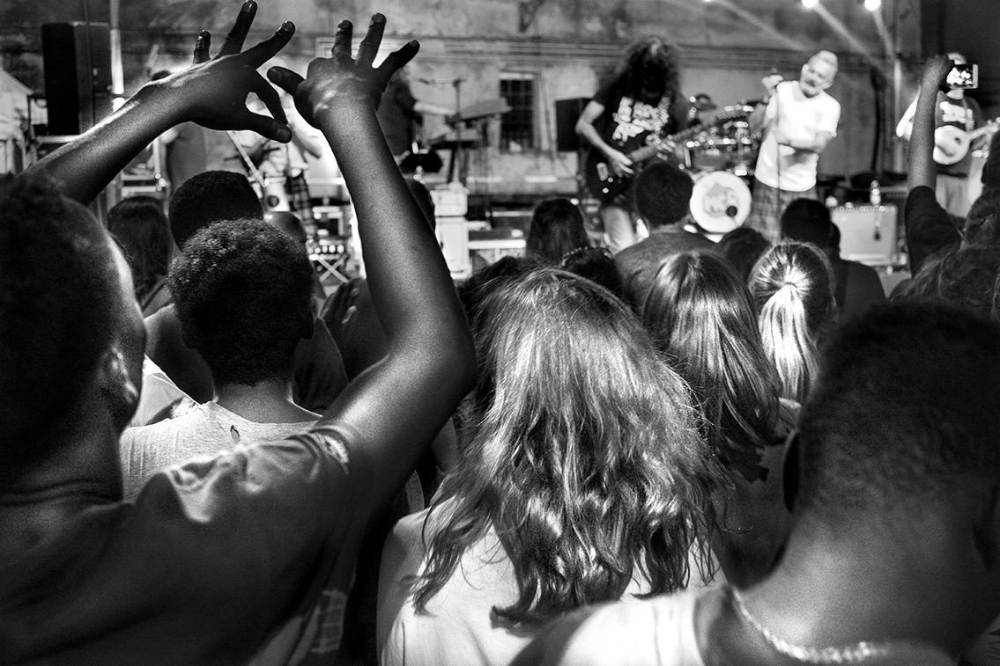
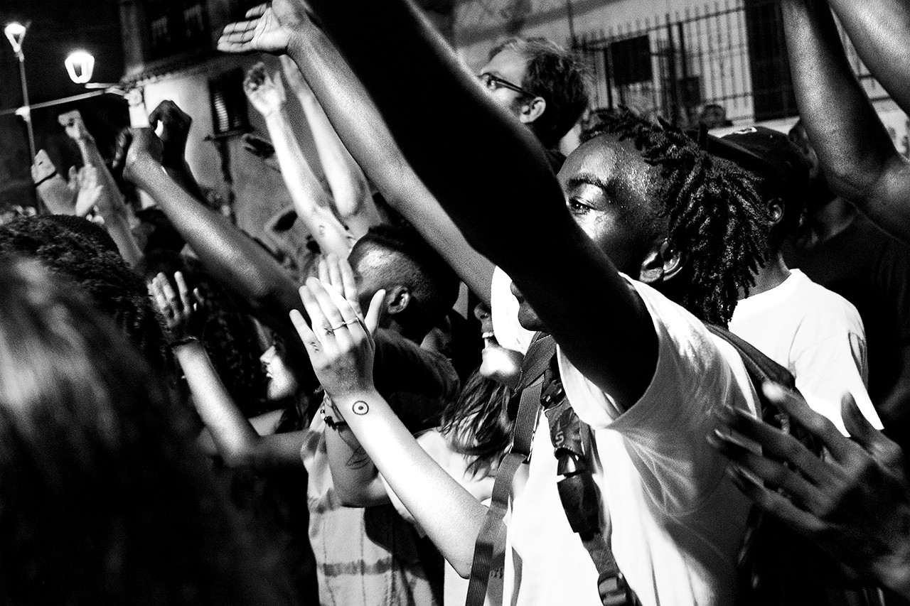
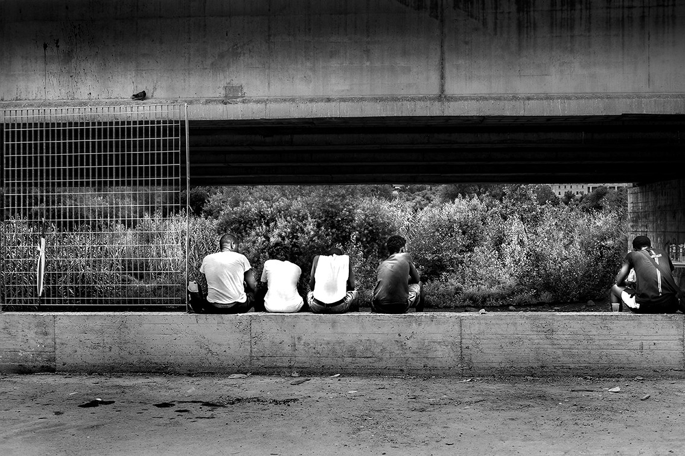
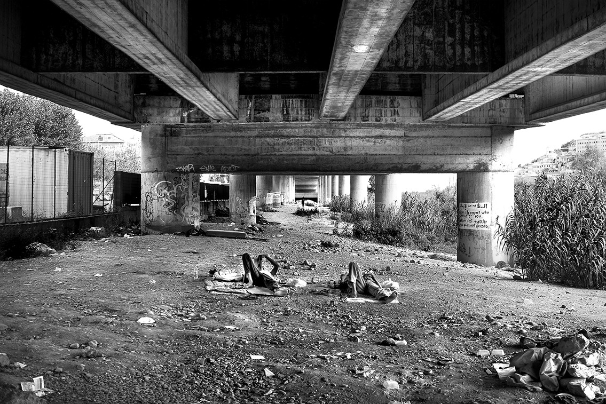
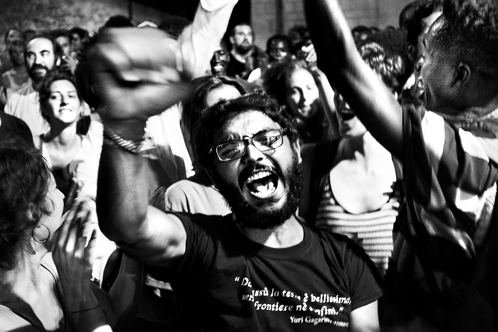
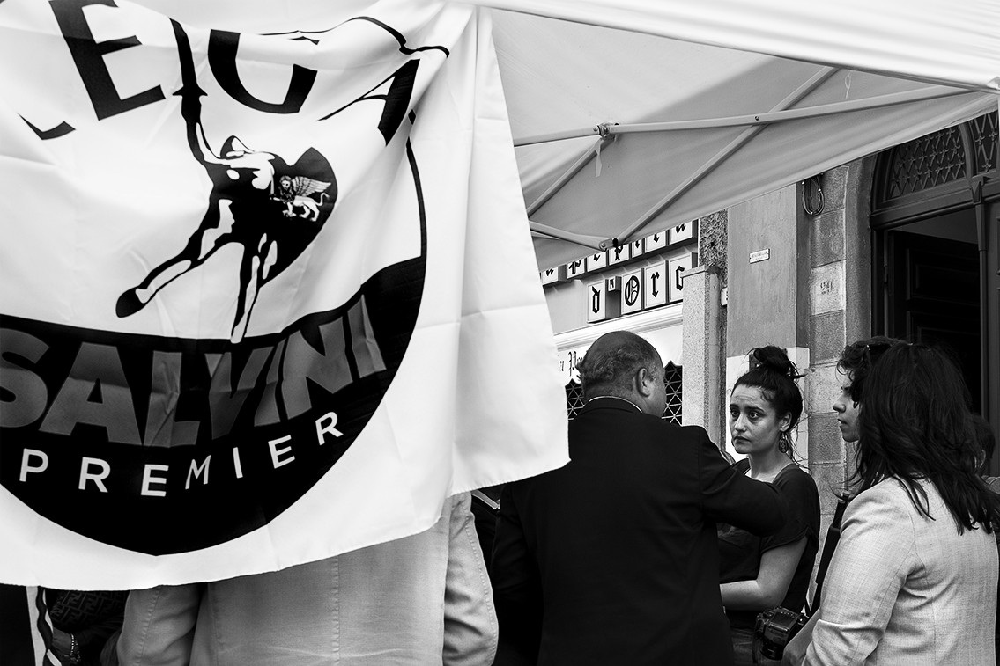

### AYS SPECIAL: **A midsummer night in Ventimiglia\.**

_An atypical update from the border inside of the European Union_

_Ventimiglia, August 2018, Modena City Ramblers on stage_

Half summer in Ventimiglia\. The thick and warm air is broken by a sound coming from a square in the old town\.

An Italian band is playing on the stage, and in front of them, a large group of people singing, jumping and dancing\. There are people of any kind, any age, any color\.

I see hands of any color up in the air\.

_Ventimiglia, August 2018, Joy_

There are places were this is perfectly normal, so I don’t notice it at first, but then I turn my back to the stage and I look at the faces\.

Those faces I don’t take pictures of, out of respect, in order not to leave in the life of these kids any testimony, that at a certain point of their life, they have been deprived of any dignity\. Those faces always dark, sad and worried\.

Those faces in this moment reflect the joy of being able to do a very normal thing, for kids of their age: stay out at night when it’s summer, singing, dancing, having fun\. So I get my camera out and start taking pictures\. Because their joy is beautiful and contagious, because this situation, in Ventimiglia, it’s all but normal\.

_Ventimiglia, August 2018, Isolation and new walls_

Having them at the show was not easy, as we made the request to the Red Cross Camp at the last minute \(they usually have to be back at the camp by 22:00, if they wish to stay out longer, someone has to make a special request and take responsibility\); it was a difficult procedure and a tough mediation to succeed in\. But as we had an agreement with the band to have a little intervention on the stage, it was important for us, and for them, to be there\.

So there they were, with a spirit between a school trip and an “escape to victory,” we arrived in the crowded square with about 30 asylum seekers\. And they were observed\. Not as a problem, not as an invasion, but just as boys\. Young humans who have fun just like anybody\.

It was a special moment\. As special as it was to see one volunteer of the [Progetto 20K](https://www.facebook.com/progetto20k/) take the stage and get loud and long applauses from locals, and right after him, the usually hostile Ventimiglia’s Mayor, taking the microphone and speaking words of tolerance\.

Wait\.

What happened? Locals applauding a volunteer? Were are the ladies and gents with the Lega Nord’s pin on their jacket? Where were the blaming gazes that every activist and volunteer in Ventimiglia knows so well?

Obviously, they are not the same people, so where have they been all this time? They clearly are not racists, but still, they never moved or acted towards refugees or migrants, we have never seen them, and there must be a reason\.

_Ventimiglia, August 2018, Under the Bridge_

There are many upsetting news I could write about Ventimiglia, as since the day the informal camp was dismantled, the dehumanization is almost complete\. New walls have been built and the “migrant presence” is almost invisible in the city, as a consequence of the port’s closure operated by the new government since June, secondly, as migrants don’t have the camp anymore, they all went to the Red Cross Camp, which is as usual half full with men, women and children\. There are less arrivals, and women have different routes we don’t really know about\.

But I don’t want to talk about this now, here, I’d like to focus on something else\.

At the moment Ventimiglia is calm\. The feeling of quietness before the storm, and as anti\-migrants measures taken were effective, the town looks quite normal, a sunny riviera with tourists having ice creams by the sea\. But if we try to stop and change the perspective, this calm might be useful and an input to chance and build something positive\. Taking a step back, if we think how, since the border controls reintroduction in 2015, this place has suffered an invasion, not only from migrants, but from all the actors who arrived consequently\. A minor pressure in this sense, could open a way for those who remain to create bridges\.

The feeling, in Ventimiglia as well as in the rest of the country, is that there are two opposite sides facing each others in a fight\. But this is not completely real, there is a third part, in fact, formed by those who went to the show, applauded, but did not act or speak\. There’s a large part of the population who isn’t actually racists or intolerant, they feel threatened, but they haven’t picked a side yet\. For sure, they never had the chance to get to know “the others,” and without contact it is impossible to understand the other, it is inevitable to refuse and fear it\.

A new born European non profit organisation, [More in Common](https://www.moreincommon.com) published studies of public attitudes in several European countries, including Italy\. The report points out how, although Italians feel threatened by immigration, the majority actually feels sentiments of empathy and solidarity toward strangers, as 72% sustains the right of seeking asylum in a foreign country, including Italy\. There is much more support for Human rights movements than for nationalist groups, only 11%, in fact, declares a strong bond to these last groups, wile 37% chooses human rights support\. Overall, the results tell us that the country is deeply divided, there are, in fact, seven attitudinal segments \(in France and Germany there are five\) of which only the 24% belongs to closed and nationalist groups, opposed to a 28% of open and cosmopolitan groups\. The remaining 48% is composed by groups which are more or less tolerant towards migrants, more or less welcoming, more or less worried about security and the economical situation of the country and the impact that migration could have on these matters\. But they are not racist, fascist or intolerant\. All of them refuse and fear extremisms\.

As we know, numbers and statistics are not flawless, but to support such data, some groups of scouts who came to see the border during these weeks, got more or less the same idea, and they spent few days among the population of Ventimiglia, asking questions about migrants and volunteers\. For sure it wasn’t a proper analysis with method, but the picture which came out, is surprisingly consistent with the numbers\.

_Ventimiglia, August 2018, Out loud\._

People are badly informed, they don’t have any contact with refugees and migrants, and most of the time, neither with volunteers and organizations\. But almost none actually expressed a real sentiment of hate toward migrants; most of them, recognize that the problem are not people, but the institutions\.

So we should probably concentrate our attention on this 48%, as they can change their mind if stimulated in the right way, and maybe even take an active position\.

The same group of scouts, all in the age between 16 and 18, were composed in the same way\. We had the chance and the pleasure to had a chat at the end of their stay, and it was really interesting to observe how some of them, convinced of the ideas which made them vote Lega Nord, admitted to leave with doubts, and to be interested in knowing more about the real situation\.

Others, more sensitive from the start, understood better the importance of action, and were pushed to start something concrete in their territory once back\. The contact with the real situation, which is quite different from media coverage, with volunteers, and the answers we gave to their questions, generated doubts, curiosity, pushed them to open their eyes\.

_Ventimiglia, August 2018, Talking about the change_

This is predictable and quite basic, but we don’t see it happening very often, as life runs fast nowadays, and more on the cold, digital path than between humans and real contact\.

More in common’s report points that out that Italians who have direct contact with migrants or refugees are more likely to do something to help\. Those who personally know a refugee are twice likely to donate, have some time if they have the chance to become a volunteer or participate to a demo in favour of migrants than those who don’t have this direct contact, and so on\. Also contact with volunteers, or having a volunteer in one’s network — even social network — helps creating a positive cascading of information and sharing\.

Of course I do not envision this to be the only solution, but as we saw messages of intolerance and racism being spread all along this summer, walls being built, bridges collapsing, and ships full of desperate and exhausted people being take hostage by a criminal intent, these small victories should also have our attention, to raise our spirits, and, through their observation, to understand how to replicate them, multiplying the changes to build new bridges\.

**_\(Photos and story by Emanuela Zampa\)_**

**We strive to echo correct news from the ground through collaboration and fairness\.**

**Every effort has been made to credit organizations and individuals with regard to the supply of information, video, and photo material \(in cases where the source wanted to be accredited\) \. Please notify us regarding corrections\.**

**If there’s anything you want to share or comment, contact us through Facebook or write to: areyousyrious@gmail\.com**

_Converted [Medium Post](https://medium.com/are-you-syrious/ays-special-a-midsummer-night-in-ventimiglia-d5b618d694ba) by [ZMediumToMarkdown](https://github.com/ZhgChgLi/ZMediumToMarkdown)._
