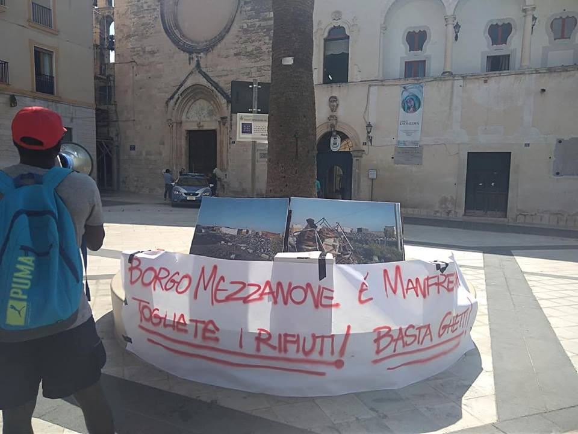

### AYS Daily Digest 31/08/18: Immigration detention in Libya a “Human Rights Crisis”

_Clashes in Tripoli put the lives of refugees in grave danger//ERCI response to police accusations//Donations needed for Lesvos//Aftermath of Chemnitz riots//_

](assets/b402f1a8acd/1*wN2EsEKpgYMKYuBmt9Zi9A.png)

Photo: [**Maydayterraneo — Proyecto AitaMari**](https://www.facebook.com/MAYDAYTERRANEO/)
#### Feature

[MSF](https://www.msf.org/conflict-tripoli-puts-lives-danger-demonstrating-libya-not-place-safety) reports that clashes in Tripoli put the lives of refugees in grave danger, as many remain trapped and arbitrarily held in closed detention centres throughout the city:

> “Some of these people were trapped for more than 48 hours in an area affected by heavy shelling without any access to food\. Others who were released had no choice but to flee to nearby neighbourhoods where they were at risk of being caught in the crossfire”\. 

The [Global Detention Project](https://www.globaldetentionproject.org/immigration-detention-in-libya-a-human-rights-crisis) describes immigration detention in Libya as a “Human Rights Crisis”:

> “There are frequent shortages of water and food; over\-crowding is endemic; detainees can experience physical mistreatment and torture; forced labour and slavery are rife; and there is a stark absence of oversight and regulation”\. 

Italy and the EU however continue to broker deals with various Libyan
forces and to support the Libyan coastguard in its efforts to bring refugees back to Libya\.
#### Greece

](assets/b402f1a8acd/0*DNbU471eY9kXlZuW)

Photo by [DocMobile — Medical Help e\.V\.](https://www.facebook.com/docmobile.org/?tn-str=k%2AF)
### ERCI response to police accusations

As noted in [last week’s digest](ays-daily-digest-28-08-18-30-volunteers-in-greece-accused-of-conspiring-in-human-trafficking-5c0f19998b03) , the Greek police has accused a group of 30 people, including volunteers, of being an “an organized criminal network that was systematically involved in facilitating the illegal entry of aliens into Greek territory”\. However, the lawyer of two of them, ERCI volunteers Sara Mardini and Sean Binder, have already denied the charges and said that on many of the dates when they are supposed to have committed offences they were not even in Greece\. ERCI has also released a statement:

> Many ill\-informed articles and media reports are contradicted by the financial data that our organization has made available to the Greek authorities\. It is important to highlight that this financial data has been verified by an internationally respected and accredited auditing firm\. Additionally, the investigation of the Greek authorities is still ongoing, and we are certain that many of the unfounded claims, accusations and charges will be quashed, allowing the truth to prevail and justice to be served\. 

The [Bard College Berlin](https://www.facebook.com/bardcollegeberlin/?tn-str=k%2AF&hc_location=group_dialog) has also released a statement on Sara Mardini, who is a scholarship recipient of the university:

> “We are in close contact with Sara’s legal counsel and these charges seem more about halting the operations of the NGO in question than about any actions of Sara or her fellow volunteer,” _said Dr\. Florian Becker, Managing Director of Bard College Berlin\._ “A long period of imprisonment in Greece awaiting a potential trial would be devastating for Sara and her life plans\. We will leave no stone unturned to get Sara released from prison, so that she can spend this time in Berlin and continue her studies, which she has earned with so much difficulty\.” 

### Moria, the worst refugee camp on earth

Fighting is continuing inside Moria, according to a video published by [Pikpa](https://www.facebook.com/pikpalesvos/?hc_ref=ART_HgOGeLuJnyFzQUDeursZ_Bn8rR7zZUpw6ceuDYocKdQcXO-Zv5lhytvnMIJnH0Q&fref=nf&__xts__%5B0%5D=68.ARDMMDLqe8IyGPSllTgPSLrQSQVxiN5iYJ3NoUjAVldiTs59DdSzwNQxXompF0he2OD6Ug1-nt-5lPSza4vW5icKrMlYTbQ-dA4xvNebjOv6D2cCnVOfY9V7vUX3Mp9ZSqh_0y77Qsq8NxCrZOMy8FWOOIc8jqu5q0PSwYOxMr6E4s-JNIWU&__tn__=kC-R) , with overpopulation reaching breaking point — around 8,000 people now live in a camp meant for 2,000\. Meanwhile the BBC says that children as young as ten are attempting suicide in the camp, with MSF saying it is the worst camp on earth\. [Refugee Rights Europe](http://refugeerights.org.uk/wp-content/uploads/2018/08/RRE_AnIslandInDespair.pdf) highlights that violence against refugees is commonplace, while living conditions in general continue to deteriorate\. For example, 92% of women say they have experienced health issues since arriving on Lesvos, while 78% of minors say they never feel safe in the camp\.

### Donations needed for Lesvos

[Attika Human Support](https://www.facebook.com/AttikaHumanSupport) needs donations with winter approaching, including sleeping bags, blankets, food, baby care and clothing\. The full and detailled list can be found [here](https://www.facebook.com/Refugee4Refugees/photos/a.317155631961452/758259421184402/?type=3) \. The Attika warehouse distributes donations to other organisations on Lesvos\. You can also support the warehouse financially directly [here](https://www.attikahumansupport.org/donate) \.
### Hunger strike in Rhodes

Mohamed, 27 years old, has started a hunger strike in the Rhodes Prison as he fears being deported back to Iraq where his life is in danger\. The Refugee Solidarity Group Rhodes calls for solidarity with Mohammed in his struggle to regain his freedom\.
#### Bulgaria
### Length of immigration detention increases

[Balkan Insight](http://www.balkaninsight.com/en/article/report-blurred-boundaries-between-reception-and-detention-of-asylum-seekers-in-bulgaria-08-20-2018) picks up a report by the Foundation for Access to Rights, noting that while the number of people crossing the Bulgarian border has dropped significantly from 31,281 in 2015 to 2,989 in 2017, the length of immigration detention has increased from an average of 15 to 20 days in 2016 to 52 to 59 days last year\. Interviews with detainees show terrrible living conditions, including bed bugs, lack of access to toilets at night and no special provisions for minors and infants\.
#### Italy
### People abandoned in Trento

In Trento, 50 migrants affected by scabies were left abandoned under a bridge, completely on their own, with no support\. Blankets, shoes and even documents were thrown in the garbage by municipality operators\. They were mainly from Pakistan and all of them were “eligible” for adequate reception, according to [Il Dolomiti](http://www.ildolomiti.it/societa/2018/cinquanta-migranti-con-la-scabbia-abbandonati-sotto-a-un-ponte-sono-soprattutto) \.
### Food donations needed in Rome

[Baobab Experience](https://www.facebook.com/BaobabExperience/?hc_ref=ARShOFpZLQqBh-vE10bnkG7mXjF8QjtAFpYqlU8aGsDp9WnPu7cGKGAQWzv3A0f7qFY&fref=nf) is looking to widen the network of shops and market stalls who would be up for giving them their surplus food in order for Baobab to sustain the three meals a day they offer to those living in Piazzale Maslax\. Please get in touch if you have an idea of how to support them\. You can also support them financially [here](https://baobabexperience.org/supporta/) \. Baobab experience has been supporting refugees in Rome since 2015\.
### Protest for better living conditions

According to [Comitato Lavoratori delle Campagne](https://www.facebook.com/comitatolavoratoridellecampagne/?hc_ref=ARQZURFrs7Hdt71i9FHD-YN_n6hjidTB3mxDGD0zCK1IVBOKdFtkchw0Vzb3hi8V-yE&fref=nf) , residents of the makeshift camp of Borgo Mezzanone demonstrated this morning in front of the municipality offices in order to demand the collection of garbage and access to housing, water and electricity\. For a long time they have been waiting to understand what their future will be like and tomorrow morning a meeting is finally scheduled with the relevant authorities\.
#### Germany
### Chemnitz aftermath

[_FAZ_](http://www.faz.net/aktuell/politik/inland/integrationsministerin-koepping-chemnitz-kann-ueberall-passieren-15766159.html) reports that Saxony’s Integration Minister Petra Köpping has admitted that the state’s politicians have made mistakes in their handling of right\-wing extremism in recent years\. Köpping dismissed the idea that the demonstrations were a regional problem, however, adding that as extremists from across the country had travelled to Chemnitz to join the protests over the last week these scenes could have happened anywhere in Germany\.

A [series](https://www.thetimes.co.uk/edition/world/gas-chambers-never-existed-say-afd-group-at-concentration-camp-f0kt5rjfk) of [articles](https://www.thetimes.co.uk/edition/world/germany-s-inexorable-drift-to-the-right-after-angela-merkel-s-migration-mistake-vkqhtdt0l) in the [_Times_](https://www.thetimes.co.uk/edition/world/fear-and-loathing-in-neo-nazi-chemnitz-cvzmw52fx) examine the events in and surrounding the recent violence in Chemnitz\. It says the atmosphere has become so hostile since the death of Daniel Hillig last Saturday that many migrants in the city now fear going to the shops\. The paper says Chemnitz is “unhappy and divided”, and its small immigrant population is “cowed and scared”\. Saxony Prime Minister Kretschmer appeared unprepared for the hostile reaction that greeted his address to a group of locals in Chemnitz on Thursday, as the paper describes the city as “a symbol of the relentless rise of the hard right in Germany” and predicts it is likely to remain a flashpoint\.

On Monday, a [concert](https://www.facebook.com/events/331690927577698/) will take place in Chemnitz to show solidarity with those attacked by neonazis last Sunday and Monday and to show their disgust to those instrumentalising a murder to express their racism\. A nationwide “United against Racism” protest will also take place in [Hamburg](https://www.facebook.com/events/2006637416077800/) on September 29, with buses coming from more than 20 cities\.

### Measures restricting “church asylum” contradict case law

The ECRE newsletter says the German Federal Office for Migration and Refugees has introduced new rules of procedure which restrict “church asylum”, the temporary sanctuary offered by religious institutions to people facing deportation to protect them from undue hardship, mostly due to Dublin transfers\.

The maximum period for the implementation of a Dublin transfer can be extended from 6 to 18 months on the ground that the applicant has “absconded”\. Under the BAMF rules, which took effect on 1 August 2018, such an extension can be ordered when church asylum is not notified on the day it is provided and when church asylum is only provided after a negative decision from the BAMF\.

In a majority of cases however, courts have ruled that a person receiving church asylum whose whereabouts are reported to the BAMF cannot be considered as “absconding” from the Dublin procedure\.
#### UK
### Refugees at Home needs support

The ECRE newsletter reports on a recent study by the Institute for Public Policy Research \(IPPR\) showing that the budget for English teaching dropped by almost two\- thirds between 2009 and 2017, while funding for integration efforts aimed at local authorities with high levels of migration, dropped by almost a third\. The IPPR warned that “too many migrants struggle to find their feet quickly, becoming locked into low\-paid employment or working at well below their skills level”\. [Refugees at Home](https://www.facebook.com/refugeesathome/) meanwhile still needs to find rooms for destitute refugees and asylum seekers who need accommodation\. In particular a room is urgently needed for a man dying from liver cancer but who has been discharged from the hospital despite his condition\. Other needs can be found directly on their [website](http://refugeesathome.org/) \.

**We strive to echo correct news from the ground through collaboration and fairness\.**

**Every effort has been made to credit organizations and individuals with regard to the supply of information, video, and photo material \(in cases where the source wanted to be accredited\) \. Please notify us regarding corrections\.**

**If there’s anything you want to share or comment, contact us through Facebook or write to: areyousyrious@gmail\.com**

_Converted [Medium Post](https://medium.com/are-you-syrious/ays-daily-digest-31-08-18-immigration-detention-in-libya-a-human-rights-crisis-b402f1a8acd) by [ZMediumToMarkdown](https://github.com/ZhgChgLi/ZMediumToMarkdown)._
