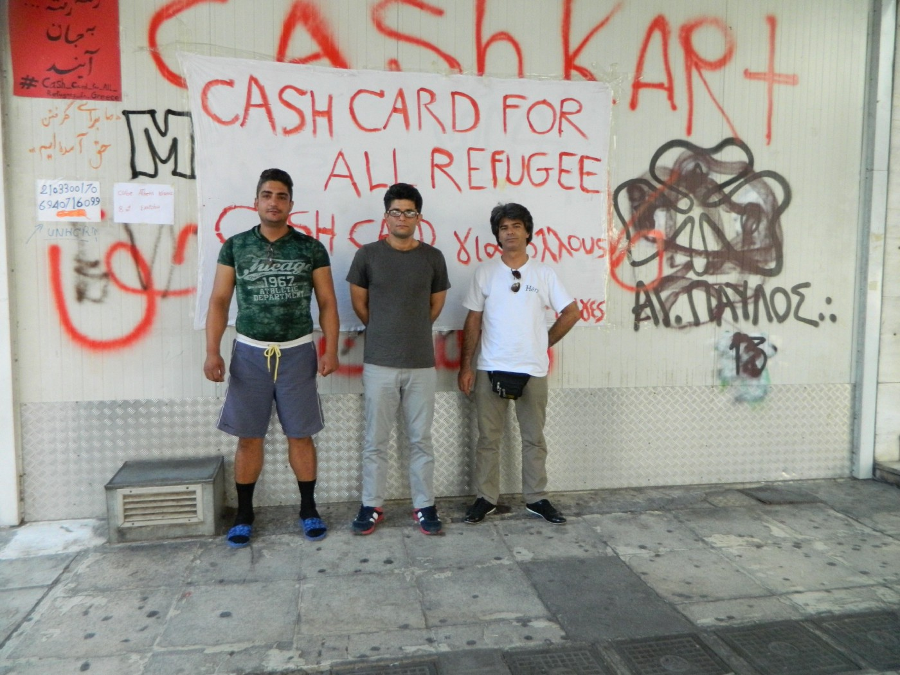
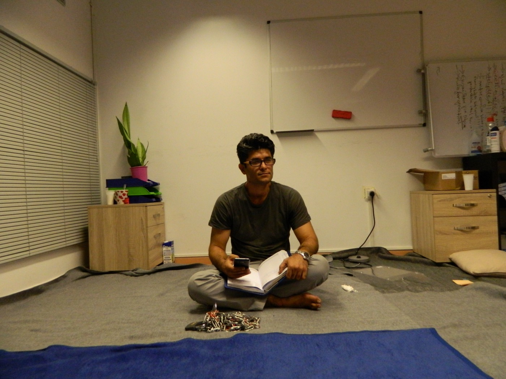
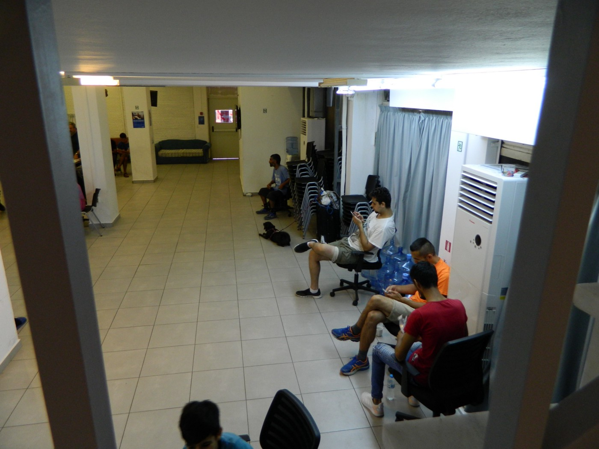
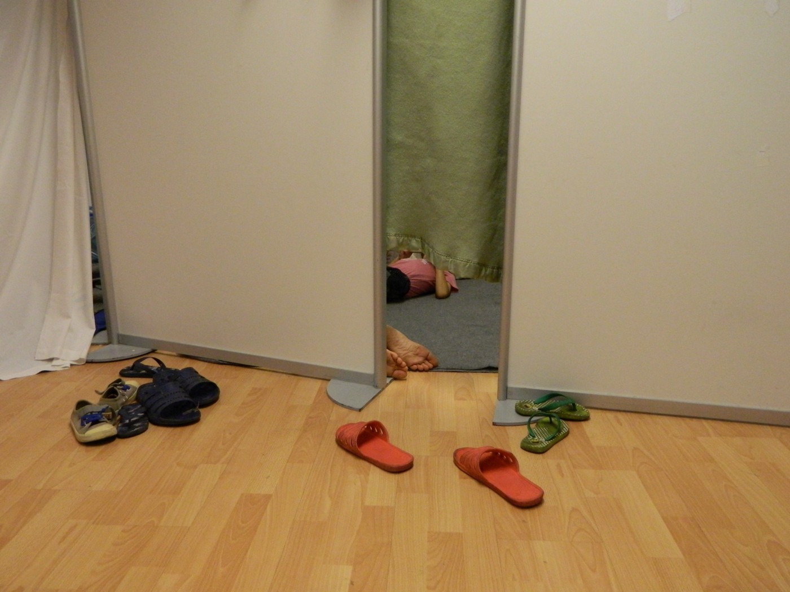
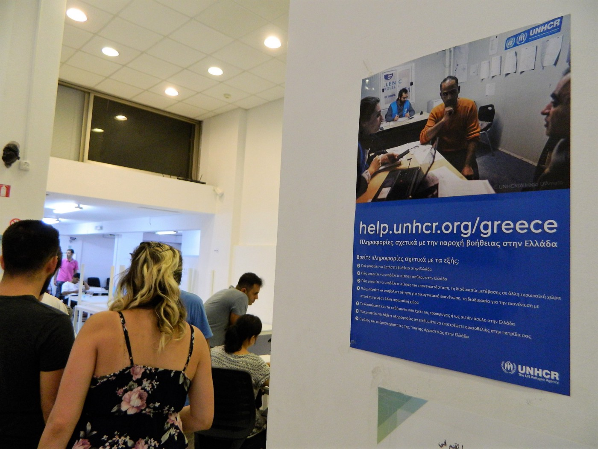

### AYS SPECIAL from Athens: “We were forced to go illegally\.”

_Tired of waiting, a group of refugees occupied the offices of CRS on July 27th demanding cash cards worth 150 euros, the only source of income for many in Greece_

“ _Refugees became a hashtag and meaning of a profit for many NGO’s in Greece_ ,” a 37\-year\-old Saeid Sharifi explains to AYS when we meet him and other 50 refugees in occupied offices of the Catholic Relief Services \(CRS\), in Athens\.

Saeid Sharifi

Tired of waiting, on 27th of July a group of refugees decided to occupy the offices of CRS close to the square Vathis in center of Athens\. “ _Every month they were promising to us the bank cards\. Nothing changed\. Every month was the same\. We were waiting and waiting, and then one day we reach our limits,_ ” Saeid who was one of the initiators of the spontaneous occupation back in July, tells us\.

Apart from being without financial assistance, group of refugees coming from Iran, Iraq, Afghanistan, Pakistan etc\. live also without accommodation and any support for food\. Devastated and disappointed they explained to us they find no other way but to act as they did\. “ _We were forced to go illegally_ ,” they reveal\.

After they occupied the CRS offices the families with all together 12 children found shelter in a common struggle for refugee rights\. “ _Here there are people that just want to continue their journey and only few of them that would actually like to stay in Greece\. I am one of them,_ ” explains Saeid, who at the beginning of the occupation locked his leg for doors in order that police could not separate or remove them\.

The representative of the CRS came immediately after the occupation\. According to refugees, staff showed understanding for their position, but suggested them to leave the premises\. Since refugees did not follow the staff’s orders police soon visited them\. “ _Me and some other guys were detained four times all together and taken to Omonia police station\. Police told us to leave, otherwise we will be beaten and taken to prison,_ “ men told us\. But none of these threats were ever realized\. Refugees believe intervention of UNHCR, which is providing the funding for CRS for financial assistance might play the role\.

The occupation of the offices and determination of the involved refugees resulted in a positive outcome\. “ _We received a call by the CRS staff\. They promised to us, that in next few weeks the issue will be solved for all 1\.600 people that registered during the period when offices were occupied,_ “ Saeid tells us and explains there are many more other issues that need to be battled\.

“ _We will not leave the offices till the last person got his bank card and financial assistance\. After that we continue with the new battle field: registration for the refugees on Skype_ ,” reveals the refugee group\.

The group of refugees explains to us that demands they had towards the CRS in this case but also many other NGO’s are not something luxury\. „ _We are talking about 150 euros per month for a person without shelter and without food provision,_ ” they emphasize\.

Refugees tell us that according to their opinion these organizations exist because there is a refugee problem and as such they also get a fund, while they share crumbs\. “ _We are forced to self\-organise, we are forced to create our own schools, to search for our own way to survive and we are forced to fight for something that any way belongs to us\. This humble financial support will not change a lot, but for many of us it will help in our daily struggle,_ ” they tell us\.

Refugees in office of the CRS created their own rooms\. They are especially proud to occupy the offices of the director of the CRS\.

“ _We use to wait in long lines outside and never dare to enter the offices in upper floor\. Now we are sleeping in offices of the boss,_ ” they smile and promise the battle for their rights will not finish here\.

**_What is CRS?_**

_According to [CRSs’ site](https://www.crs.org/our-work-overseas/where-we-work/greece) the organisation is “providing a cash assistance to 10,000 persons of concern at 15 sites are receiving monthly cash assistance through pre\-paid debit cards\. Having cash allows persons of concern to meet their basic needs as they see fit, giving them choice and a more dignified way to begin integrate into lives of normalcy and safety\. It also recirculates the assistance into the local economy, thereby reducing any burdens placed on their host communities\.”_

**_\(Story and photos by Katja Lihtenvalner\)_**

**We strive to echo correct news from the ground through collaboration and fairness\.**

**Every effort has been made to credit organizations and individuals with regard to the supply of information, video, and photo material \(in cases where the source wanted to be accredited\) \. Please notify us regarding corrections\.**

**If there’s anything you want to share or comment, contact us through Facebook or write to: areyousyrious@gmail\.com**

_Converted [Medium Post](https://medium.com/are-you-syrious/ays-special-from-athens-we-were-forced-to-go-illegally-a81d6856f217) by [ZMediumToMarkdown](https://github.com/ZhgChgLi/ZMediumToMarkdown)._
