### AYS Weekend Digest 1–2/8/18: New arrivals, changing issues and more need for help
#### A weekly summary of the most important news —
Libya in a state of emergency, additionally putting more refugee lives in danger / Police abuses and violence in Morocco / France: Big fire in Grande\-Synthe has left organizations without a base and much needed donations / Italy: Helping those saved off Diciotto / Volunteers, help and donations needed across Greece, Bosnia and Herzegovina, Italy, France / and more news

 ‏](assets/18710e3a1865/1*Z1IfcwN9X08XYbLbM7clCw.jpeg)

Greek solidarity protest — Photo via [@Nasim\_Lomani](https://twitter.com/Nasim_Lomani) ‏
#### FEATURE — Updates on the volunteer arrests in Greece

As we reported on Tuesday, in more drastic efforts to criminalize NGOs and humanitarian aid to refugees, three [members](http://www.dailystar.com.lb/News/World/2018/Aug-28/461484-greek-activists-held-for-illegally-aiding-migrants.ashx) of the emergency Response Center International \(ERCI\) NGO were arrested on Tuesday as part of a larger 30 member group accused of trafficking refugees\. On Thursday morning, the Greek police [issued a press release](https://www.protagon.gr/themata/focus/i-istoria-tis-sara-katigoreitai-gia-diakinisi-to-koritsi-pou-eswse-18-metanastes-44341678316) stating the volunteers were acting in “an organized criminal network that was systematically involved in facilitating the illegal entry of aliens into Greek territory\.”

ERCI volunteers Sara Mardini and Sean Binder have previously denied the charges and following an an official [statement](https://ercintl.org/press-release-erci-3/) their lawyer has said that on many of the dates when they are supposed to have committed offences they were not even in Greece\.

Two of them are being detained on Lesvos and one in Athens and all of their families have visited them, their friends told AYS\.

A legal team is working hard on this case to make sure Sean and Sarah are cleared of all allegations and accusations against them and their [families thank everyone](https://www.freehumanitarians.com/press-release) for their support\. ERCI has told AYS they intend to show active support to Sara, Sèan and Nassos on social media as well in the coming days, after having worked extensively with people that have expertise in communications, the legal team, political advisors and many others\.

If you want to show active support on your private or your organization’s social network, find samples [here](https://www.freehumanitarians.com/support-them) and post it with messages of support for these young people, using the hashtags:

[\#FreeSarahAndSean](https://www.facebook.com/hashtag/freesarahandsean?hc_location=ufi) 
[\#FreeHumanitarians](https://www.facebook.com/hashtag/freehumanitarians?hc_location=ufi)

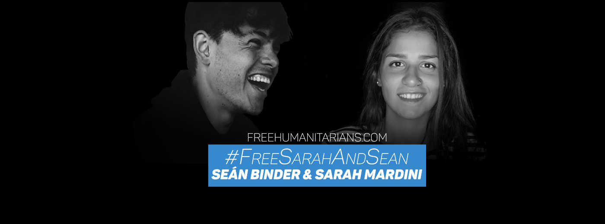

#### IRAQ

The first six months of 2018 was the first time since 2014 that the number of returnees in Iraq outnumbered the total of people still being displaced\. Almost two million Iraqis live outside of the camps for displaced people\. As we wrote earlier in a [digest](ays-daily-digest-02-08-18-700-people-died-in-the-med-just-in-the-past-6-weeks-71115406db99) , the aid and funding are slowing down in Iraq despite the continuous big need and the now [majority of people](http://www.reach-initiative.org/iraq-majority-choose-to-remain-displaced-even-though-returns-reach-record-high) living outside of camps for displaced people have no intention to return home\.
#### LIBYA
### Deepening worries for people stuck in Libya

■■■■■■■■■■■■■■ 
> **[Sally Hayden](https://twitter.com/sallyhayd) @ Twitter Says:** 

> > Summary at the end of Day 4: Since Sunday I've been talking to migrants pushed back to Libya by EU policy. Heavy fighting broke out, they were abandoned w/o food or water, a bomb went off nearby, they were shot at, eventually moved, fighting got closer again. Their thoughts now: https://t.co/BGPODPNeQQ 

> **Tweeted at [2018-08-29 21:10:40](https://twitter.com/sallyhayd/status/1034911233751896064).** 

■■■■■■■■■■■■■■ 

UN Secretary\-General “condemned the escalation of violence in and around the capital of Libya, in particular, the indiscriminate bombing of armed groups, which kill and injure civilians, including children,” thus making the conditions for those fleeing violence via Libya even more grave\. [MSF](https://www.msf.org/conflict-tripoli-puts-lives-danger-demonstrating-libya-not-place-safety) reports that clashes in Tripoli put the lives of refugees in grave danger, as many remain trapped and arbitrarily held in closed detention centres throughout the city, while the [Global Detention Project](https://www.globaldetentionproject.org/immigration-detention-in-libya-a-human-rights-crisis) describes immigration detention in Libya as a “Human Rights Crisis”\.

■■■■■■■■■■■■■■ 
> **[Andrea Palladino](https://twitter.com/andreapalladino) @ Twitter Says:** 

> > L’accanimento nel smentire le torture in #Libia è ridicolo. E ora è di nuovo l’Onu a confermare l’orrore dei centri di detenzione ufficiali per #migranti. E c’è di più: situazione aggravata da blocco partenze e intercettazioni in mare https://t.co/6zWm5ZKDRJ 

> **Tweeted at [2018-08-31 18:15:04](https://twitter.com/andreapalladino/status/1035591820313616384).** 

■■■■■■■■■■■■■■ 

#### TUNISIA

Despite its location, Tunisia is not yet a country of transit\. Regardless of that, Tunisian nationals are the single biggest nationality to reach Italy via the sea\. [18\.9 percent](https://data2.unhcr.org/en/situations/mediterranean/location/5205) of arrivals, a total of 3321 people, were Tunisian nationals\.
The number of people leaving Tunisian shores for Italy has not been this high since 2011\. Read more on the situation in Tunisia in our [Wednesday Feature](ays-daily-digest-29-08-18-tunisia-badly-prepared-for-a-potentially-increasing-influx-of-refugees-7cdba2c8a117) story\.
#### MOROCCO

Police abuse and violence continue in order to track down people on the move and indiscriminately [return them](https://www.facebook.com/AmdhNador/photos/a.1693125780899690/2177850562427207/?type=3&theater) to their country of origin, [Association Marocaine des Droits Humains — Section Nador](https://www.facebook.com/AmdhNador/?hc_ref=ARTTYrf23p3ukf4xB6DCbmIkXckCwxu8TR8o3iTylTMo6_iVOptKMwkNqMHrXx03khA&fref=nf&__xts__%5B0%5D=68.ARCdm-locdbN8WTgsR-UxFHFz34L5B3i1KPlHn-1biqrbPRc9CQY4i_FsjcAdeyt7r7pS8rB42cox0jRILbtqtLD8ebTIm6BM6wc6mqR3CSjYheHWbV3n2KkWirh4AuQpop4hQ0YfnFnDZaECYI_D0MMdv--E4-I2A3GLSRvpeijTMTyNi7-_A&__tn__=kC-R) report:

> Humiliation and violations against migrants in Morocco reach unbearable levels\. Yesterday the arrested and repressed migrants from tangier were attacked in this way on buses\.
 

> In addition to violence yesterday and handcuffs, this is another way of the Moroccan authorities to humiliate the African citizen and to violate these most basic rights \(entitled to behaviour respecting his dignity and freedom\) \.
 

> All of this happens every day in front of a silence from the embassies of African countries in Morocco\! 

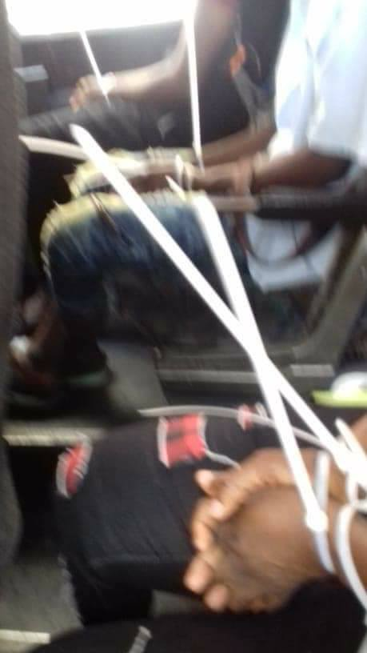

](assets/18710e3a1865/1*c5ZHxhAR5hh0cxYSKFrBVw.jpeg)

Photos published by: [Association Marocaine des Droits Humains — Section Nador](https://www.facebook.com/AmdhNador/?hc_ref=ARTTYrf23p3ukf4xB6DCbmIkXckCwxu8TR8o3iTylTMo6_iVOptKMwkNqMHrXx03khA&fref=nf&__xts__%5B0%5D=68.ARCdm-locdbN8WTgsR-UxFHFz34L5B3i1KPlHn-1biqrbPRc9CQY4i_FsjcAdeyt7r7pS8rB42cox0jRILbtqtLD8ebTIm6BM6wc6mqR3CSjYheHWbV3n2KkWirh4AuQpop4hQ0YfnFnDZaECYI_D0MMdv--E4-I2A3GLSRvpeijTMTyNi7-_A&__tn__=kC-R)

 volunteers have documented abusive arrests and displacement of migrants in Morocco \(Photo: [AMDH — Section Nador](https://www.facebook.com/AmdhNador/?__xts__%5B0%5D=68.ARB0VC00jzBkam6oVPHBAWH2ZPGYgjhF5MN7DOHj2uYG0w6mxvHXMGwed8geIjWFwJoNbpkmqypp385h-UOhMAOa-oK2IVZ0_PY92bpEYMa0--PvtmesfFdxzRBcnCSIB7o70G_y4eev_Bv_DeVo4mpbXn893V6L--Fp5p__d35qwdzblrcuXOPiY6RYIsYN0NMjEPEibtvTrGqKNx1a&hc_ref=ARQOPp8gGDggQM911POmpOwVcHaMo2cGsnLebjkqFCnMsuNg3eHMJx-se9MS_j__P6E&fref=nf&hc_location=group) \)](assets/18710e3a1865/1*AP5uZoJ97HSIfJ1fZOkM2Q.jpeg)

[Association Marocaine des Droits Humains — Section Nador](https://www.facebook.com/AmdhNador/?__xts__%5B0%5D=68.ARB0VC00jzBkam6oVPHBAWH2ZPGYgjhF5MN7DOHj2uYG0w6mxvHXMGwed8geIjWFwJoNbpkmqypp385h-UOhMAOa-oK2IVZ0_PY92bpEYMa0--PvtmesfFdxzRBcnCSIB7o70G_y4eev_Bv_DeVo4mpbXn893V6L--Fp5p__d35qwdzblrcuXOPiY6RYIsYN0NMjEPEibtvTrGqKNx1a&hc_ref=ARQOPp8gGDggQM911POmpOwVcHaMo2cGsnLebjkqFCnMsuNg3eHMJx-se9MS_j__P6E&fref=nf&hc_location=group) volunteers have documented abusive arrests and displacement of migrants in Morocco \(Photo: [AMDH — Section Nador](https://www.facebook.com/AmdhNador/?__xts__%5B0%5D=68.ARB0VC00jzBkam6oVPHBAWH2ZPGYgjhF5MN7DOHj2uYG0w6mxvHXMGwed8geIjWFwJoNbpkmqypp385h-UOhMAOa-oK2IVZ0_PY92bpEYMa0--PvtmesfFdxzRBcnCSIB7o70G_y4eev_Bv_DeVo4mpbXn893V6L--Fp5p__d35qwdzblrcuXOPiY6RYIsYN0NMjEPEibtvTrGqKNx1a&hc_ref=ARQOPp8gGDggQM911POmpOwVcHaMo2cGsnLebjkqFCnMsuNg3eHMJx-se9MS_j__P6E&fref=nf&hc_location=group) \)
#### CYPRUS

Since appeals against asylum decisions take approximately two years to be decided, the International Protection Administrative Court \(IPAC\) has been set up with the task to examine appeals against asylum claim rejections, in order to speed up the process\.
#### GREECE
### Islands

[Aegean Boat Report](https://www.facebook.com/AegeanBoatReport/?hc_ref=ARQw02ssnc3iiYxW1z2BJrmMrZaWf_vKnVhe2r_N-C2-FsRQ4BPkkqwiTxv3vuThxas&fref=nf&__xts__%5B0%5D=68.ARBEKKMhutH0fB234o6GnZK1Vq3prIBT_YngxTkuk89MnflpR_iXQCoAlmZK19c3kxnEvjoOv11PJuXeNoSA7hMFHpm-cP-KOot-jsoISblOme1h4dOBbs2ff4OPJxu07VUH7NUWdHFkPvOOJ8IZhbSrx4w2R_KjwNYgnMh70SsbrR4Qy1iV&__tn__=kC-R) team documented the arrival of a boat with 130 on board to Rhodes earlier this Sunday, while 52 people reportedly arrived in Mytilíni, Lesvos\. [Volunteers at Rhodes](https://www.facebook.com/groups/OasisRhodes/?fb_dtsg_ag=AdwhfX-EBde6x8rlo4yoLNRLDGVXa7OM-9W2EOZMI1RwUw%3AAdxD6Q-UsKoCmJfeldVLtntwF4grJrvZwJVKlrl6UWoBnA) need help with supplies\. Get in touch with them if you can help\.

Find [Watch The Med — Alarmphone](https://www.facebook.com/watchthemed.alarmphone/?hc_ref=ARQFl9oTvlpp-FiCaM2I4jJf-Mjr4Cz-Naf8Otf37iM9VM24NqQWIC5nl4sc29rFWzA&fref=nf) team’s weekly overview [here](https://www.facebook.com/watchthemed.alarmphone/posts/2210798442527720?hc_location=ufi) \.
The overcrowding on the islands increases\. This causes health\-care systems to break down\. [BBC wrote that even children](https://www.bbc.com/news/world-europe-45271194) are attempting suicide nowadays\. [DocMobile updated,](https://www.facebook.com/docmobile.org/posts/2157344761004863?hc_location=ufi) saying that they have to turn down patients on a daily basis\.

> 92% of women say they have experienced health issues since arriving on Lesvos, while 78% of minors say they never feel safe in the camp\. 

### Lesvos

Adding to already high tensions in the unlivable and inhumane Moria Camp, the police continue tactics of coersion and targeting of community leaders, [Legal Centre Lesbos](https://www.facebook.com/LesvosLegal/?hc_ref=ARSqyHQuXThD1u2vXfZXth7LB3QJLWVZAh-ozxbsEQ35biyW__Nx1xa8RsbmceX9Hrg&fref=nf&__xts__%5B0%5D=68.ARDGcP4MmbdUUOG4HPscAZKBgg-IkupsMWDj6qxmED2L1QS2W07GyOynEVZavk-FGxxk9d_x_vn8pVhiCpIEzpHLBOIFqY8ur8m7ApXbH7TONo_FDfP_SphZqxGsIL6DnDKeSqrWO81RhetyF73jiTRGmhg6WEee6-EukyqfWBhwctpNZzyt6A&__tn__=kC-R) team reports\.

> Rather than look to the root causes of these tensions, following clashes and fights in Moria, police are demanding from leaders in Moria Camp that they turn over to authorities individuals for criminal prosecution\. Community leaders have been held by police during recent fights, throughout the night, and threatened that they will themselves face criminal prosecution if they refuse to give over names to the police\. — _Read news on the latest developments in the Moria story [here](http://www.legalcentrelesbos.org/2018/09/02/police-coerce-community-leaders-to-turn-over-individuals-responsible-for-violence-in-moria-camp/) \._ 

Over 4 months after the criminal court ordered their release, today, finally, one of the 35 men who was violently arrested in a police raid of Moria camp in July 2017 was released\. 6 of 35 are still detained in inhumane conditions in Moria prison\.

[Attika Human Support](https://www.facebook.com/AttikaHumanSupport) needs donations with winter approaching, including sleeping bags, blankets, food, baby care items and clothing\. The full and detailed list can be found [here](https://www.facebook.com/Refugee4Refugees/photos/a.317155631961452/758259421184402/?type=3) \. The Attika warehouse distributes donations to other organisations on Lesvos\. You can also support the warehouse financially directly [here](https://www.attikahumansupport.org/donate) \.
### Athens

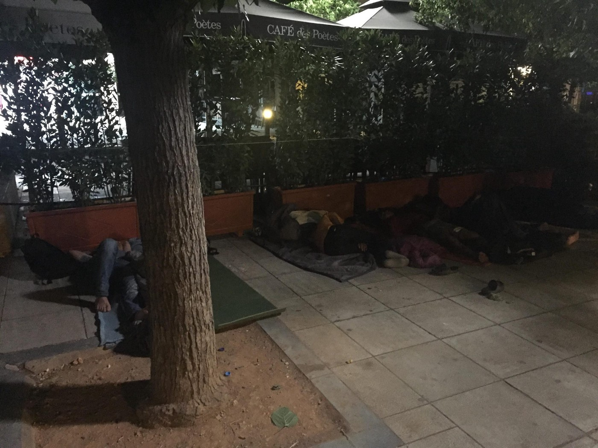

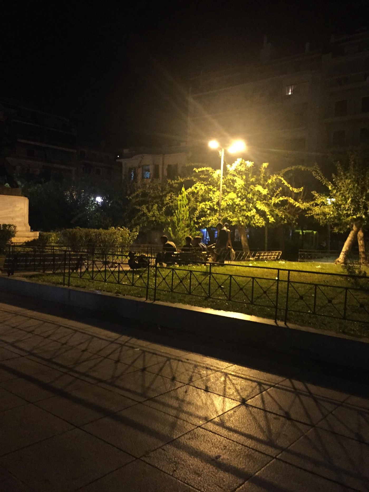

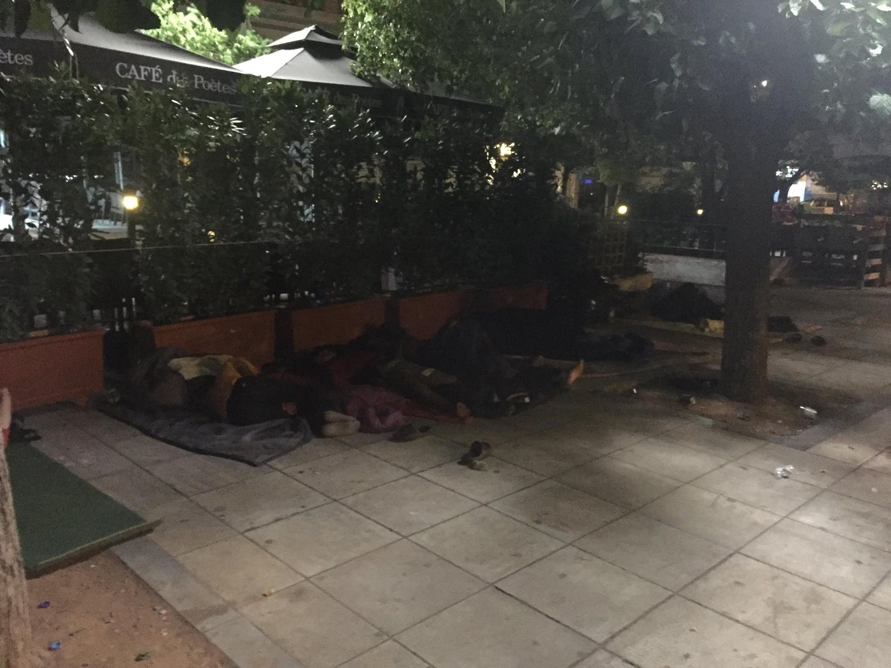

Athens is again full of people who are forced to stay outside due to the lack of accommodation \(Victoria Square/Photos by: Amin Rustaqi\)

Hundreds of refugees, locals and international activists protested on Saturday in front of the Greek parliament in Athens, against European border regime / fortress Europe and thousands of dead people in the sea\.

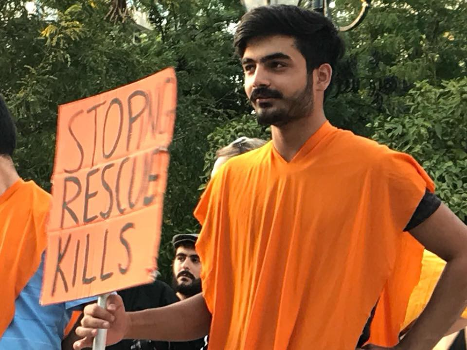

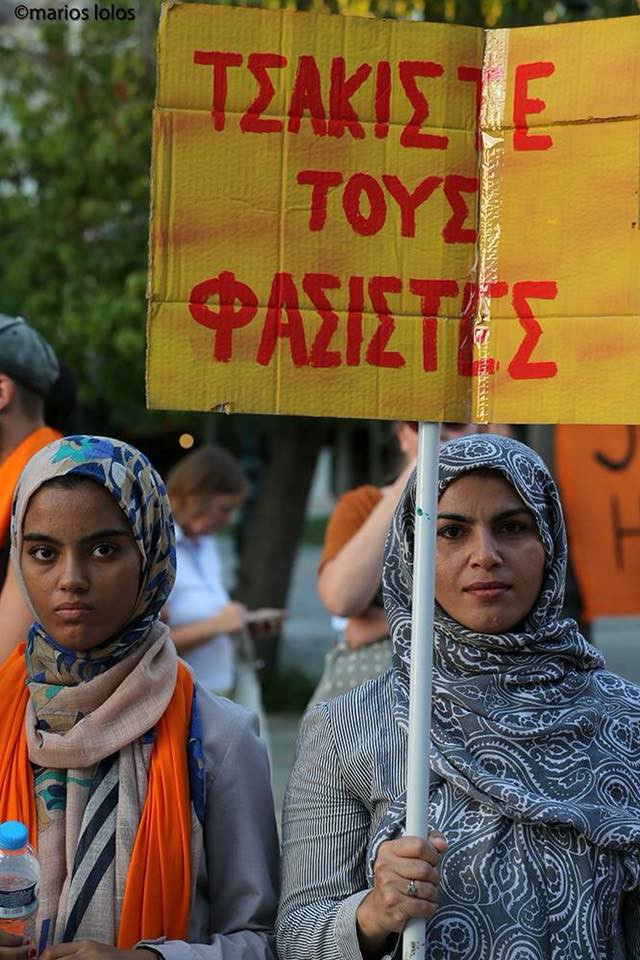

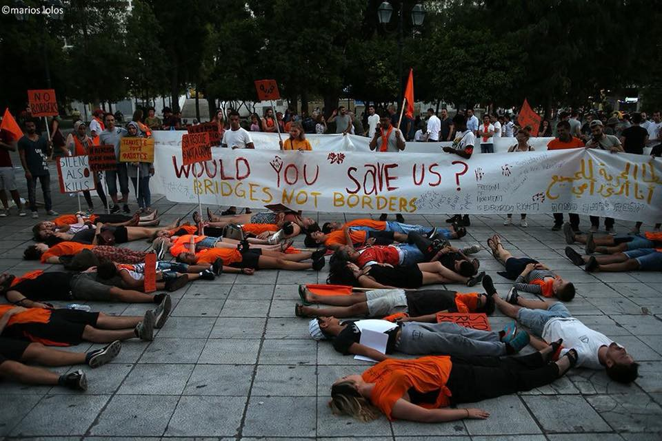

Photos via Nasim Lomani

_Tired of waiting, a group of refugees occupied the offices of CRS on July 27th demanding cash cards worth 150 euros, the only source of income for many in Greece —_ Read the [**AYS SPECIAL from Athens**](ays-special-from-athens-we-were-forced-to-go-illegally-a002cf09990f) **: _We were forced to go illegally_**
### Pushbacks

More and more people are entering Greece through the land border with Turkey\. At the same time, the reports about illegal push\-backs and violence are becoming more and more common\.

A [report about expulsions in the Evros region](https://www.gcr.gr/media/k2/attachments/ReportZ08032018.pdf) released earlier this year found that, as well as minors, elderly and pregnant women had been rejected and expelled back to Turkey by Greek officials\. This is in breach with EU laws, such as Article 4 of the Protocol 4 \(Art 4\.4\) to the European Convention on Human Rights\.Reportedly, the authorities don’t acknowledge that the collective and unlawful push\-backs are happening\.
For more information, read the full article [here\.](http://www.infomigrants.net/en/post/11579/greek-authorities-accused-of-illegal-pushbacks-and-violence-against-migrants)

If you or someone you know have been pushed back, get in touch with Mobile Info Team\.
### Volunteering

[Lifting Hands International](https://www.facebook.com/liftinghandsinternational/?__xts__%5B0%5D=68.ARB0VC00jzBkam6oVPHBAWH2ZPGYgjhF5MN7DOHj2uYG0w6mxvHXMGwed8geIjWFwJoNbpkmqypp385h-UOhMAOa-oK2IVZ0_PY92bpEYMa0--PvtmesfFdxzRBcnCSIB7o70G_y4eev_Bv_DeVo4mpbXn893V6L--Fp5p__d35qwdzblrcuXOPiY6RYIsYN0NMjEPEibtvTrGqKNx1a&fref=mentions) is looking for a manager to run kids’ activities for the residents of a camp in Serres, Northern Greece\.

**Mazí Housing Project is looking for a house manager\.** 
A group of volunteers from grassroots organisations working with displaced people in Athens, are looking for a hard\-working, dedicated, patient and passionate person from the refugee community to be the house manager for the flat\. They will regularly visit the flat, create programming for the residents, and give emotional and practical support\. They will work with an external coordinator and a support group of volunteers\. Find more info [here](https://www.facebook.com/notes/maz%C3%AD-housing-project/apply-to-be-the-house-manager-in-maz%C3%AD-housing-project/543727516083702/) \.
#### BULGARIA

A report by the Foundation for Access to Rights, notes that the length of immigration detention has increased from an average of 15 to 20 days in 2016 to 52 to 59 days last year\.

The interviews reveal evidence of terrible living conditions, including bed bugs, lack of access to toilets at night and no special provisions for minors and infants\.
#### BOSNIA AND HERZEGOVINA

Bosnian police stopped about 50 migrants from Afghanistan, Iran and Pakistan trying to cross from Serbia in a cargo train overnight on Friday as authorities step up patrols on the border\. The cargo train carrying coal was [reportedly](https://www.reuters.com/article/us-europe-migrants-bosnia/bosnian-police-intercept-50-migrants-on-cargo-train-idUSKCN1LH3FW) stopped near the Bosnian border town of Zvornik on the banks of the River Drina\. All of them, according to the reports, were pushed back to Serbia\.

BiH reached a peak of 10,100 people presently in transit in the country\. Out of this number, 33% of the arrivals are from Pakistan, 15% from Syria, and 12% from Iran\. Of these, many try to move on to Croatia and Slovenia\.

The violence reportedly continues on the border between BiH and Croatia, the forefront “defenders” of the European iron curtain\. The [NNK team](https://www.facebook.com/NoNameKitchenBelgrade/posts/585068641891424?__xts__%5B0%5D=68.ARC0sOGEeT8-IadFzNLnbCoZoR1WcGDEezDp7HIKmbrS1A10nF7eig4MDZF-kTOxpIhTpTaehvaO-xqPGckkeRFBqV15nbjl9REi_BsjrdclTZDH7t9Hdi3Wtf8AEmBVonEISf3dFdXyBwcY1vOgSMdA7JCVxiMVC1Nw-83Zrh6iSwcFNnXIShitDPg&__tn__=-R) recorded a case of a minor and a disabled person who were beaten up\. For more on the documented cases of violence, see our [Monday Digest text on Croatia](ays-daily-digest-27-8-2018-fascist-in-chemnitz-confronted-by-strong-antifascist-groups-73c73e38f26c) \.

See our [earlier digest](ays-daily-digest-30-8-2018-reception-centre-in-messina-sicily-denounced-for-irregularities-40ea8fd8ff03) for a list of donations needed in Velika Kladuša\.
#### HUNGARY

[With new tax liability and legal situations](https://www.ceu.edu/article/2018-08-28/ceu-suspends-education-programs-registered-refugees-and-asylum-seekers) changing in Hungary because of Prime Minister Orban’s extreme right wing stance on refugees, Central European University has been forced to stop their education programs for registered refugees and asylum seekers\.
#### AUSTRIA

[Austria](https://www.dw.com/en/austria-to-ban-asylum-seekers-from-taking-up-apprenticeships/a-45249042) will start to ban asylum seekers who have not yet received asylum from apprenticeships\. The draft resolution on Monday has the potential to affect some 8,600 asylum seekers in the country under 25\.

#### SWITZERLAND
### Solidarity march in Zürich

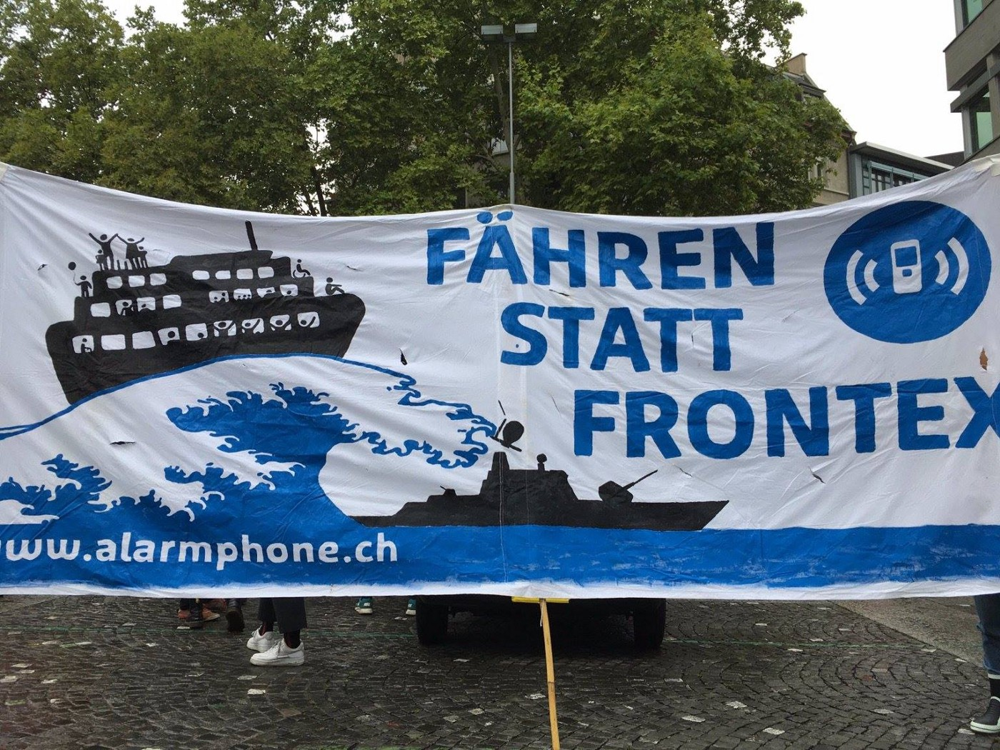

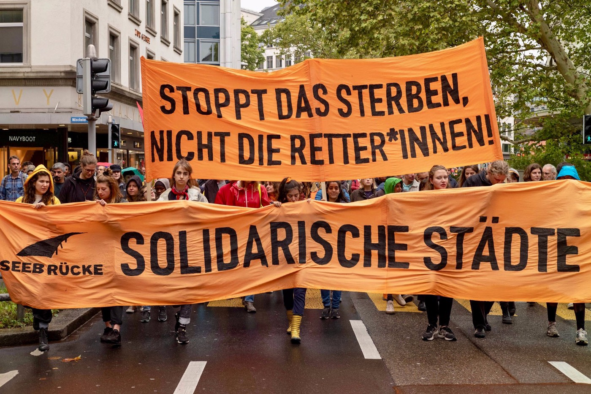

](assets/18710e3a1865/1*RpmG-gKmfSspcgdT8khpLQ.jpeg)

Photos from: [Seebrücke Demo Zürich](https://www.facebook.com/events/160604018089418/?acontext=%7B%22ref%22%3A%22106%22%2C%22action_history%22%3A%22null%22%7D)

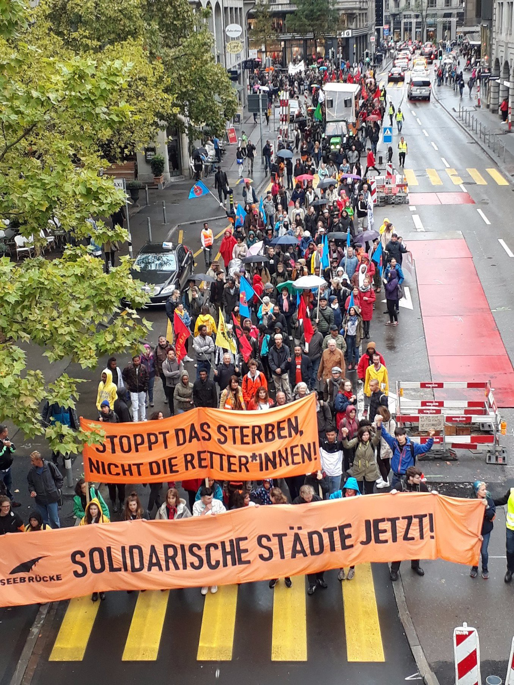

#### SEA

67,122 people arrived to Europe so far in 2018, while 1,549 remain missing or dead, according to the IOM\. On the other hand, the [UNHCR statistics](https://data2.unhcr.org/en/situations/mediterranean,) report that sea arrivals in the Mediterranean reached the number of 72,409 in 2018, while the number of fatalities according to their report is 1,540\.

There are reportedly no NGO search and rescue missions currently in the deadliest waters off the coast of Libya is the Aquarius is not currently operating in the Central Mediterranean, reports [Alarmphone](https://www.facebook.com/watchthemed.alarmphone/photos/a.1526182797655958/2207768552830709/?type=3&theater&ifg=1) \.

■■■■■■■■■■■■■■ 
> **[Sea-Watch](https://twitter.com/seawatchcrew) @ Twitter Says:** 

> > A message from the ships to all our friends on the continent. Keep up the pressure, take to the streets, organize actions in your city, and let us end the barbarism in the #Mediterranean Sea! Check out the next @[_Seebruecke_](https://twitter.com/_Seebruecke_) demonstrations: [facebook.com/pg/SeebrueckeS…](https://www.facebook.com/pg/SeebrueckeSchafftsichereHaefen/events/) #Seebruecke https://t.co/YXsj0d9PJ2 

> **Tweeted at [2018-08-29 14:01:56](https://twitter.com/seawatchcrew/status/1034803341518426112).** 

■■■■■■■■■■■■■■ 

#### ITALY
### Decreased number of arrivals

The main reason for the acute decline in the number of arrivals to Italy is due to the imprisonment of people in Libya with the support and protection of the EU, thus just 66% of the arrivals have crossed from Libya, increasing the departures from Tunisia \(20%\) and Turkey \(9%\) \.
Italy and the EU however continue to broker deals with various Libyan
forces and to support the Libyan coastguard in its efforts to bring refugees back to the country\.

![Tents and gazebos needed\! — “It’s almost two months we’ve been standing in the rain and the sun\. The situation is not always simple but we remain here, convinced that we must fight to the end to see our project achieved\.
During these 60 days we have encountered so many beautiful acts of solidarity but also individual citizens who have supported us materially and morally\. We still need you right now\. For that, we ask you to help us, bringing gazebo and tents\.” — Photo: [Rifugiati sudanesi di Scorticabove](https://www.facebook.com/scorticabove/?tn-str=k%2AF&hc_location=group_dialog)](assets/18710e3a1865/1*HWQcpmfBZp8ySETeEM1ZmA.jpeg)

Tents and gazebos needed\! — “It’s almost two months we’ve been standing in the rain and the sun\. The situation is not always simple but we remain here, convinced that we must fight to the end to see our project achieved\.
During these 60 days we have encountered so many beautiful acts of solidarity but also individual citizens who have supported us materially and morally\. We still need you right now\. For that, we ask you to help us, bringing gazebo and tents\.” — Photo: [Rifugiati sudanesi di Scorticabove](https://www.facebook.com/scorticabove/?tn-str=k%2AF&hc_location=group_dialog)
### **Severe signs of trauma after disembarking from Diciotti**

[The day after](ays-daily-digest-27-8-2018-fascist-in-chemnitz-confronted-by-strong-antifascist-groups-73c73e38f26c) they disembarked, great focus was on the criminal investigation against minister Salvini, having been charged with kidnapping, illegal arrest and abuse of office after accusing him of confining more than 100 migrants on the coastguard rescue ship for ten days\. Later updates on the charges state:

> _“kidnapping for the purpose of coercion” for the attempt of pressuring the EU preventing the people’s disembarkation and “omission of official records” for having ignored the request of a safe port by the Italian Coast Guard\. That makes 5 charges, together with kidnapping, illegal detention of the people on board and abuse of office\._ 

One hundred people staying in the hotspot of Messina \(Sicily region\) got transferred to the Mondo Migliore center in Rocca di Papa \(Lazio region\) where they will stay for some days before being relocated to several dioceses\. See our Thursday [feature story](ays-daily-digest-30-8-2018-reception-centre-in-messina-sicily-denounced-for-irregularities-40ea8fd8ff03) about the reception facility on Sicily and the lack of political will to ‘go an extra mile’ for those in need of refuge\. Rocca di Papa reportedly had fascist protests occurring outside of the facility, as [Melting Pot Europa](https://www.facebook.com/meltingpoteuropa/posts/2054276641270719?__xts__[0]=68.ARAVwiRx39LzC5aeIwye0QcJ5S_2KlM6YF1epHav1tAicuTy9QYmuzzsaHZhQHewusK4YYotffn7OZaCyFD7ca8MIiLgbleMlI3hjKkuiKAQm3oIdrmu0cmxQWm85W_RkWqzdm0&__tn__=-R) reported [earlier this week](ays-daily-digest-28-08-18-30-volunteers-in-greece-accused-of-conspiring-in-human-trafficking-5c0f19998b03) \.

Although Albania said they would accept 20 of the Eritrean refugees from the Diciotti ship for Italy as a symbolic reminder of the welcome they had received by the Italians, however since the country is a non\-EU state, thus not taking part in the asylum system, the people could not be sent there\.

Please, take 7 minutes to read **[AYS Special from Ventimiglia](ays-special-a-midsummer-night-in-ventimiglia-d5b618d694ba) : _An atypical update from the border inside of the European Union_**

#### FRANCE
### Supporting the Women’s Centre

Earlier this week, [The Women’s Centre’s warehouse](https://www.facebook.com/groups/1086525351391860/permalink/2028255150552204/?__xts__[0]=68.ARAZF8rYShrQ6oVnvqCUDLUSLV6tWmfoUZBk2RTlQ3qk1cyDgp0rP0pKGZAHgDxxeOT6S4nJlpDDP0eviod3X_AZYlrEpWzEEVDEjRnymVl-VjlEp-KI3Pq3MxpaJOhbic6D2yjj49byM8aL_WBXfKjJAXTqZXIwJRWvxDFpuirlK-Fe5aSulw&__tn__=K-R) in Dunkirk burnt down\.

There have been two evictions in three days in the nearby camp\.

The volunteers are devastated due to the incidents and following work\-load\.
### Dunkirk

[Mobile Refugee Support](https://www.facebook.com/MobileRefugeeSupport/?hc_ref=ARTNUIBuIPrlaCCaWePr6HCAyl2TxYwdTLt_YhbJwt8Lw_DYbD8T67MVqiKrmxQlCQ4&fref=nf&__xts__%5B0%5D=68.ARCdqskwNbq8nYMVTTFI7KH941SlouTFrfSjP2FxvpsV_gw0pQyMhxX4MyhbzYgNWjY6WjGqYtbXjqakCuSM4Zx8d4_u9e_r9clHfoZKbrewNRxhlLN1-BYIyPpqwSJjeLBuHWyRMzQaEkGewf3o0QPsodxWL80jMZViY1WOgVqPCgLSbCzn&__tn__=kC-R) team reports that, with over 250 tents of varying sizes, the camp is now covering a large area of woodland, sandwiched between a motorway and a railway\.

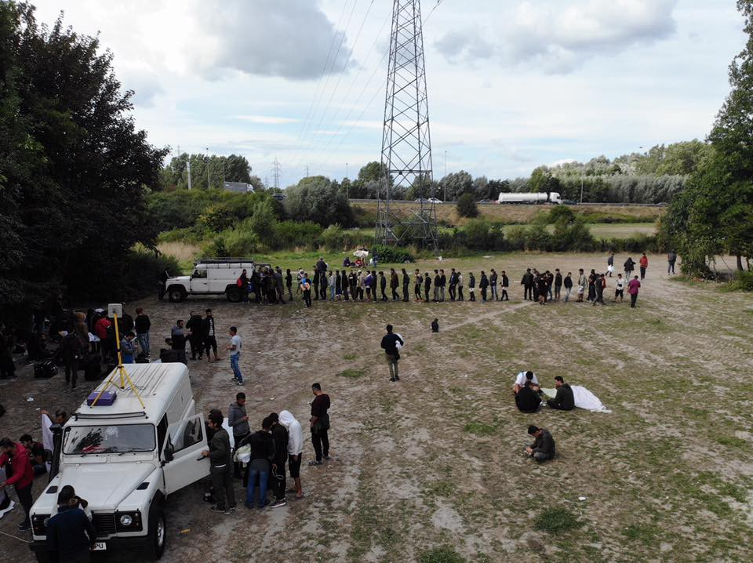

](assets/18710e3a1865/1*U9XPi8-CngBz5zs0bEvoxA.jpeg)

Photos: [Mobile Refugee Support](https://www.facebook.com/MobileRefugeeSupport/?__xts__%5B0%5D=68.ARCdqskwNbq8nYMVTTFI7KH941SlouTFrfSjP2FxvpsV_gw0pQyMhxX4MyhbzYgNWjY6WjGqYtbXjqakCuSM4Zx8d4_u9e_r9clHfoZKbrewNRxhlLN1-BYIyPpqwSJjeLBuHWyRMzQaEkGewf3o0QPsodxWL80jMZViY1WOgVqPCgLSbCzn&__tn__=k%2AF&tn-str=k%2AF)

The tragic burning of the inter\-association warehouse in Grande\-Synthe last week has left several of our partner organisations, [SALAM Nord/Pas\-de\-Calais](https://www.facebook.com/salamnordpasdecalais/?fref=mentions&__xts__%5B0%5D=68.ARCdqskwNbq8nYMVTTFI7KH941SlouTFrfSjP2FxvpsV_gw0pQyMhxX4MyhbzYgNWjY6WjGqYtbXjqakCuSM4Zx8d4_u9e_r9clHfoZKbrewNRxhlLN1-BYIyPpqwSJjeLBuHWyRMzQaEkGewf3o0QPsodxWL80jMZViY1WOgVqPCgLSbCzn&__tn__=K-R) , [Refugee Women’s Centre](https://www.facebook.com/refugeewomenscentre/?fref=mentions&__xts__%5B0%5D=68.ARCdqskwNbq8nYMVTTFI7KH941SlouTFrfSjP2FxvpsV_gw0pQyMhxX4MyhbzYgNWjY6WjGqYtbXjqakCuSM4Zx8d4_u9e_r9clHfoZKbrewNRxhlLN1-BYIyPpqwSJjeLBuHWyRMzQaEkGewf3o0QPsodxWL80jMZViY1WOgVqPCgLSbCzn&__tn__=K-R) and [DROP solidarité](https://www.facebook.com/solidarite.drop/?fref=mentions&__xts__%5B0%5D=68.ARCdqskwNbq8nYMVTTFI7KH941SlouTFrfSjP2FxvpsV_gw0pQyMhxX4MyhbzYgNWjY6WjGqYtbXjqakCuSM4Zx8d4_u9e_r9clHfoZKbrewNRxhlLN1-BYIyPpqwSJjeLBuHWyRMzQaEkGewf3o0QPsodxWL80jMZViY1WOgVqPCgLSbCzn&__tn__=K-R) without a base and destroyed huge amounts of needed donations\.
#### BELGIUM

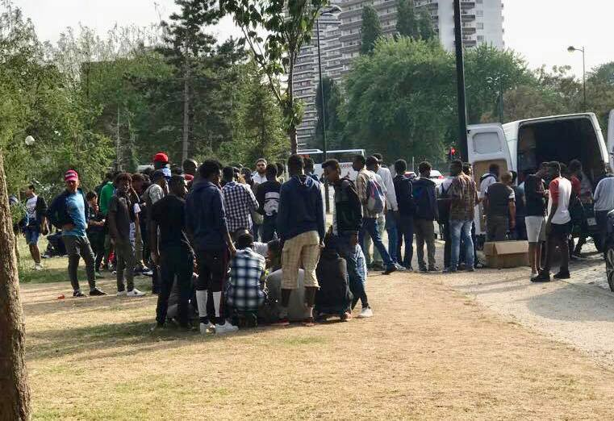

](assets/18710e3a1865/1*foIzNnlAF74H06MJkw7WCg.jpeg)

Photos: [Care4Calais](https://www.facebook.com/care4calais/?tn-str=k%2AF&hc_location=group_dialog)
#### SPAIN

The Spanish government has set up 17 temporary large army tents as camps to accommodate the people who arrived during the latest surge of boat arrivals to Andalusia, with 80 military units from the Emergencies Military Unit \(UME\) \.
27,600 people reached Spain so far this year “representing an increase of 130% compared to the same period in 2017\.”
### Mass expulsion of 166 Sub\-Saharan Africans

Spain has enforced a policy granting asylum to migrants who reach Spanish soil by sea or through land borders around Ceuta and Melilla\. However, that has now [changed:](https://www.voanews.com/a/spain-orders-mass-deportation-of-african-migrants/4551044.html)

> Within days of the Ceuta border assault, Spanish police rounded up 166 migrants from a shelter in Ceuta and drove them back across the border to Morocco, invoking a special extradition agreement negotiated between the two governments 25 years ago and which had rarely been implemented before\. 

Police arrested 10 more people on Wednesday and authorities accused them of leading the recent attacks against the Guardia Civil\. “Officials said the group’s ringleader is of Togolese origin and had experience in his country’s armed forces, including some paramilitary training”\.

■■■■■■■■■■■■■■ 
> **[Pablo Socorro Arencibia](https://twitter.com/pablosoc) @ Twitter Says:** 

> > Una patera con 30 jóvenes saharauis, entre ellos menores, se encuentra desaparecida entre Cabo Bojador y #Canarias. Son activistas perseguidos que no pueden pedir asilo. Mientras #Marruecos gestione la migración no hay futuro para los #DDHH #Saharalibre  [cadenaser.com/emisora/2018/0…](http://cadenaser.com/emisora/2018/08/31/ser_las_palmas/1535706623_859917.html) 

> **Tweeted at [2018-09-01 15:13:02](https://twitter.com/pablosoc/status/1035908397013626882).** 

■■■■■■■■■■■■■■ 

#### GERMANY

Nearly 6,000 people participated in a far\-right demonstration since [Monday in Chemnitz](https://www.bbc.co.uk/news/amp/world-europe-45330168) \. Following the incidents, [the suspicions of links between German police and the right\-wing Pro Chemnitz protesters has intensified](https://www.theguardian.com/world/2018/aug/29/arrest-warrant-leak-fuels-suspicions-of-far-right-links-with-german-police) \. Although a great deal of right wing supporters from all around Germany arrived to join the protest, a much larger anti\-fascist group has gathered to oppose the extreme right\.

A [series](https://www.thetimes.co.uk/edition/world/gas-chambers-never-existed-say-afd-group-at-concentration-camp-f0kt5rjfk) of [articles](https://www.thetimes.co.uk/edition/world/germany-s-inexorable-drift-to-the-right-after-angela-merkel-s-migration-mistake-vkqhtdt0l) in the [_Times_](https://www.thetimes.co.uk/edition/world/fear-and-loathing-in-neo-nazi-chemnitz-cvzmw52fx) examine the events in and surrounding the recent violence in Chemnitz\. It says the atmosphere has become very hostile since the death of Daniel Hillig last Saturday\.

A nationwide “United against Racism” protest will also take place in [Hamburg](https://www.facebook.com/events/2006637416077800/) on September 29, with buses coming from more than 20 cities\.
#### SWEDEN
### No more ‘quota refugees’?

During 2017 the number of quota refugees accepted [dropped significantly](https://www.migrationsverket.se/.../Sveriges..) worldwide since the US made fewer places available\. Due to closed borders and stricter asylum politics in Europe, Sweden has seen a lower number of asylum requests, so the country had raised the number of so called vulnerable individuals they agreed to take in through the UN’s scheme, from 3400 to 5000\. Sweden is now the country to have resettled the third largest number after Canada and the US, but as we reported earlier, the Sweden Democrats announced on Monday that they want to stop accepting quota refugees from the UN\. We will report about any further moves following this announcement\.
#### DENMARK

[Refugees](https://politiken.dk/indland/article6676743.ece) who have been granted temporary protection \(mainly Syrian and Eritreans\) will be offered 1000 Kronos \(133 Euros\) a month for signing an agreement that they won’t apply for family reunification with their kids or closest family to Denmark\.
#### UK

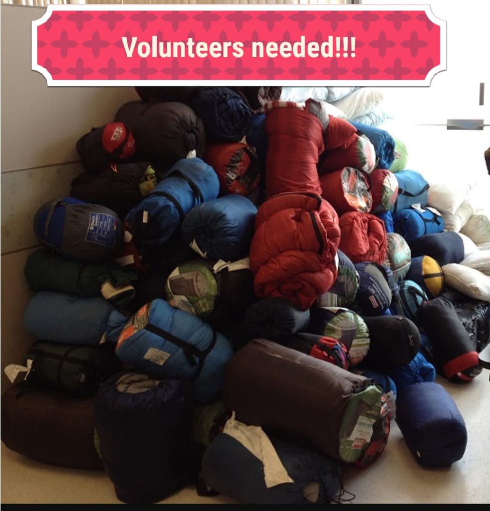

[Yorkshire Aid](https://www.facebook.com/YorkshireAid/?hc_ref=ARROUPdEH5iEv7wCKwE8Q-t4ps1KIj_D4P0vQzaE76Jg89Jb3hEnxecbYJqhehcG0oo&fref=nf&hc_location=group) salvaged hundreds of sleeping bags from the Leeds music festival during the weekend and, as they were damp due to rain and not all that clean, they need help in getting them washed before they can go to Calais\.

**Slung low are open Tuesdays and Thursdays 12 till 2 pm** 
Address is: 67 Bath Road Holbeck LS11 9UA

> Plus it will help out the lovely folks at [Slung Low](https://www.facebook.com/SlunglowTheatre/?hc_location=group_dialog) who need us to move them on asap and the folks in Calais who desperately need them\. 

**We strive to echo correct news from the ground through collaboration and fairness\.**

**Every effort has been made to credit organizations and individuals with regard to the supply of information, video, and photo material \(in cases where the source wanted to be accredited\) \. Please notify us regarding corrections\.**

**If there’s anything you want to share or comment, contact us through Facebook or write to: areyousyrious@gmail\.com**

_Converted [Medium Post](https://medium.com/are-you-syrious/ays-weekend-digest-1-2-8-18-new-arrivals-changing-issues-and-more-need-for-help-18710e3a1865) by [ZMediumToMarkdown](https://github.com/ZhgChgLi/ZMediumToMarkdown)._
