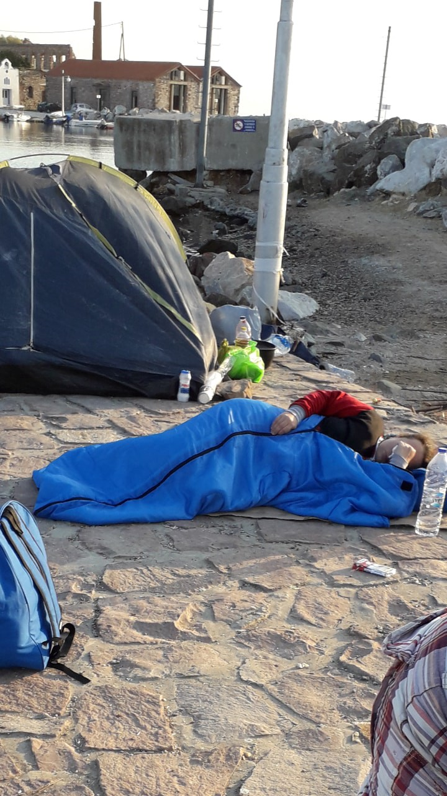
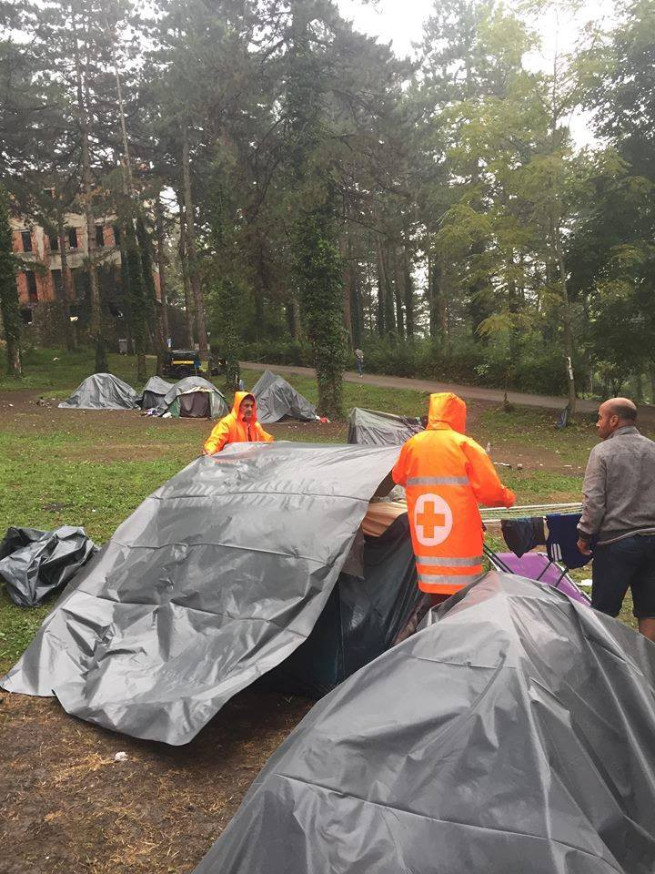
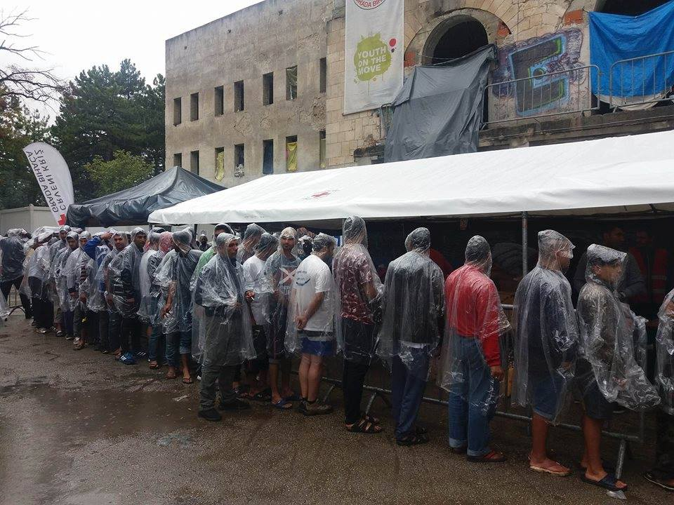
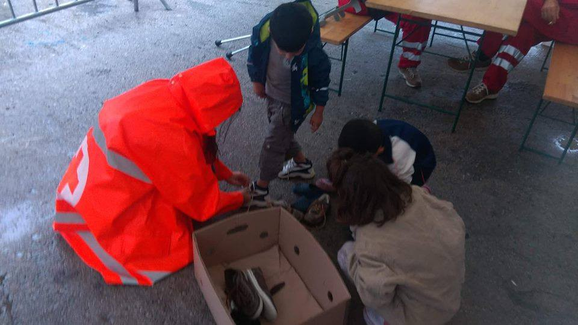

### AYS DAILY DIGEST 3/9/2018: Closed borders took 1\.600 lives this year

_Europe is not a safe haven // About 2,500 people pushed back from Croatia this year // State of emergency in Tripoli // 8,359 people in Moria // Almost 20,000 marched in Berlin and Hamburg, demanding that Germany take in more people stranded at sea_

“Thousands of people remain trapped in the Balkans suffering temperatures of more than 40 degrees in times of storms\.
They sleep outdoors with no resources, including hundreds of families and unaccompanied minors\.” By Gabriel Tizon
#### Feature

**A total of 1\.600 human beings who were looking for safety and refuge have died on their way to Europe so far this year\.** In the Central Mediterranean, one person died or went missing for every 18 people who crossed to Europe\.

This is the shameful image of the European Union in 2018, accompanied with reports of border violence committed by the EU border police, desperate life in the hot spots and refugee camps, police violence in the makeshift camps, negligence, criminalization of humanitarians…

The numbers are part of the latest UNHCR report [Desperate Journeys](http://www.unhcr.org/desperatejourneys) , which shows that, in comparison to last year, fewer people managed to enter the EU, but the number of deaths is rising\.

Unlike in previous years, in 2018 many more people tried to enter the EU using land routes\. This was accompanied by violence from the police and illigal push\-backs\. These reports are coming from the Turkey\-Greece border, as well as from the borders between Bosnia and Croatia and Croatia and Slovenia\. Violent push\-backs are accompanied by the refusal of the local authorities in all these countries to respect the right to access the asylum system, guaranteed by domestic and international laws and regulations\. Push\-backs have also been recorded in Albania, Bosnia and Herzegovina, Macedonia, Hungary, Montenegro, Romania, Serbia and Slovenia, Spain, Italy, France…

> “UNHCR and partners in Serbia and Bosnia and Herzegovina received reports of some 2,500 refugees and migrants allegedly pushed back from Croatia with over 1,500 of them reporting denial of access to asylum procedures \(including over 100 children\), and over 700 people reporting allegations of violence and theft\.“ 

At the same time, Hungarian authorities reported preventing over 1,100 people from crossing the border and intercepting and returning across the fence over 1,900 people\. Over 150 people have reported alleged physical violence by Hungarian border authorities during forced removals\. Similarly, over 140 people allegedly pushed back from Romania since the start of the year reported the use of violence by Romanian officials\.

Several hundred reports of push\-backs to Serbia and Montenegro have been received\. At least 65 of those who were forcibly moved to Serbia from neighbouring countries since the start of the year have reported never having previously been in Serbia\.
#### Libya

**A state of emergency has been declared in Tripoli** after a rocket hit the refugee camp of Tawergha\-n killing one person, while five women were wounded\.

Yet, the international community wants us to believe this country is safe and insists that people can be sent back\.
#### Turkey

**On Monday morning, 33 people were arrested on land in Kusadasi** , according to the sources [Aegean Boat Report](https://www.facebook.com/AegeanBoatReport/) rely on\. Their destination was Samos\. Additionally, one boat heading toward Kos was stopped outside Huseyin, Bodrum and seven people were arrested\. Plus, one boat was stopped outside Fokaia\. The boat, with 58 people on board, was heading towards Lesvos\.

[Moms2Moms](https://www.facebook.com/moms2momsistanbul/) \(Istanbul\) is seeking a French and English speaking project intern to join their team supporting African mothers in Istanbul\.

Follow [the link](https://safeplaceinternational.org/careers-volunteering-an…/) to apply\.
#### Sea

**Hundreds of people were rescued today at the sea** , mainly due to the efforts of different NGOs and volunteers on rescue ships\.

■■■■■■■■■■■■■■ 
> **[Helena Maleno Garzón](https://twitter.com/HelenaMaleno) @ Twitter Says:** 

> > Día intenso en la #FronteraSur:

Son 120 personas rescatadas en el Estrecho y 517 en Alborán. En la misma zona, seguimos apoyando a los servicios públicos de rescate para encontrar a las 93 que faltan. https://t.co/PmD47ibqkk 

> **Tweeted at [2018-09-03 19:00:01](https://twitter.com/helenamaleno/status/1036690294425767936).** 

■■■■■■■■■■■■■■ 

■■■■■■■■■■■■■■ 
> **[SALVAMENTO MARÍTIMO](https://twitter.com/salvamentogob) @ Twitter Says:** 

> > Hoy 20h, Estrecho: 192 rescatados de 7 pateras por Arcturus, Arenal, Gadir, Luz de Mar que los lleva a Algeciras. Alborán: Caliope 5 pateras con 243 personas a Motril, Hamal 60 a Málaga, Polimnia 20 a Almería, Spica 53 y va a por otra. Alnitak embarca a 58 llegados a isla Alborán https://t.co/qclsxin2TH 

> **Tweeted at [2018-09-03 18:02:28](https://twitter.com/salvamentogob/status/1036675809329799168).** 

■■■■■■■■■■■■■■ 

#### Greece

In Moria, Lesvos, the number of people has reached 8,359, although the centre’s capacity is 3,100\.

[Philippa Kempson](https://www.facebook.com/philippa.kempson.1?fb_dtsg_ag=AdzSjWWR97C0J0ctBmTAf514GYy37iWtnUTPX9PwxtxPgw%3AAdyzcdFQWmt7Zf1lIF5q3IS9O5M03hs7wqRoJketbqnLCQ) , activist and volunteer on the island, reports that families are leaving Moria to sleep on the streets because there they feel safer\.

> “What hell have we created in Europe for people fleeing war?
 

> We should be ashamed\! \! \! \!” 

[Legal Center Lesvos](http://www.legalcentrelesbos.org/2018/09/02/police-coerce-community-leaders-to-turn-over-individuals-responsible-for-violence-in-moria-camp/) warns that rather than look at the root causes of tensions in Moria, police are demanding from leaders in the Camp _“that they turn over to authorities individuals for criminal prosecution”_ \.

_“Community leaders have been held by police during recent fights, throughout the night, and threatened that they will themselves face criminal prosecution if they refuse to give over names to the police\. This is not the first time the police have targeted community leaders\.”_

[I AM YOU](https://www.facebook.com/groups/AthensVolunteersInformation/permalink/1491209711011321/) are looking for an Operations Coordinator role\.
#### Bosnia

The school year has started even in this small Balkan country where currently hundreds of children are stranded with their families or alone, hoping to reach a place where they will be safe, but hardly even one child has enroled in school\.

Children are living in improvised camps in several cities, they are registered, but those responsible, as well as the big NGOs, have not put enough effort into making this happen\. Under the law, all children have the right to access to education in Bosnia\.

Bihac, improvised camp\. Photos by Red Cross Bihac\.
#### Sweden

](assets/169275feda20/1*dkT6go-SEqkMbhU492XBCw.jpeg)

“When so many people blindly follow the right\-extremism we have to step up and show them the right path\. Thank you all for joining and turning your back on this racist bullshit\. All people are equal and that’s not some political question that can be discussed, it’s a fact\. Love always wins, we need to prove that in this election ❤” By [Erik Gerhardsson](https://www.facebook.com/erik.gerhardsson.7?fb_dtsg_ag=AdzSjWWR97C0J0ctBmTAf514GYy37iWtnUTPX9PwxtxPgw%3AAdyzcdFQWmt7Zf1lIF5q3IS9O5M03hs7wqRoJketbqnLCQ)

“On Sunday, the party leader from the far right\-extremist “Swedish Democrats“ held a speech in my university city\. This party is close to becoming the biggest party and people are terrified, while their supporters are becoming more and more fanatical\. A big crowd gathered and supported the party today, but some students, citizens and I, went there and turned our backs to the stage to show our resistance\. It was a peaceful act and no harm was done in any direction\. My statement to the Japanese media that was present was this: I am here for the equal worth of all people, no matter who you are or where you are from, we are all equal\. This equality is threatened by this party\. The party leader himself might sound harmless and somewhat reasonable but everyone has to look at the bigger picture\. This party consists of people that openly support Nazism and expresses racist opinions and say that people are worth more or less depending on their colour, ethnicity or religion etc\. That is unacceptable\.” [Erik Gerhardsson](https://www.facebook.com/erik.gerhardsson.7?fb_dtsg_ag=AdzSjWWR97C0J0ctBmTAf514GYy37iWtnUTPX9PwxtxPgw%3AAdyzcdFQWmt7Zf1lIF5q3IS9O5M03hs7wqRoJketbqnLCQ)
#### France

The situation [at the Dunkirk camp](https://www.facebook.com/MobileRefugeeSupport/posts/837110176494595?__xts__%5B0%5D=68.ARCO_j64p8fzBtb127586ZN9iqc_CjZ59ht_NjBvXcxPjUlPOMzUmFnn-g7ELyeZ7D4JTHoYXPbruIHxFPfXFCRyhTYHOn2DZ4jlgUJMDSc0UgDEsS6_Y0fX4Fl6xKGFxi9oeOiKJVdrFcTddO6v-pWWyU8DbtQwF7hddiEgjKTBPwqyOSjWEf9uYKzRaFrKwuZjb5xUWnbiCnUgdP568GP1FaA8IwKiGBFMC_8&__tn__=-R) has been stable over this past week with over 250 tents covering a large area of woodland, sandwiched between a motorway and a railway\.

](assets/169275feda20/1*lxf839vc_wEox4v3pM25cQ.jpeg)

By [Mobile Refugee Support](http://www.mobilerefugeesupport.org)
#### Germany

Almost 20,000 people have marched through Berlin and Hamburg, demanding that Germany take in more people stranded at sea\. Sunday’s marches were organized in response to the violent anti\-migrant protests in Chemnitz\.

**We strive to echo correct news from the ground through collaboration and fairness\.**

**Every effort has been made to credit organizations and individuals with regard to the supply of information, video, and photo material \(in cases where the source wanted to be accredited\) \. Please notify us regarding corrections\.**

**If there’s anything you want to share or comment, contact us through Facebook or write to: areyousyrious@gmail\.com**

_Converted [Medium Post](https://medium.com/are-you-syrious/ays-daily-digest-3-9-2018-closed-borders-took-1-600-lives-this-year-169275feda20) by [ZMediumToMarkdown](https://github.com/ZhgChgLi/ZMediumToMarkdown)._
