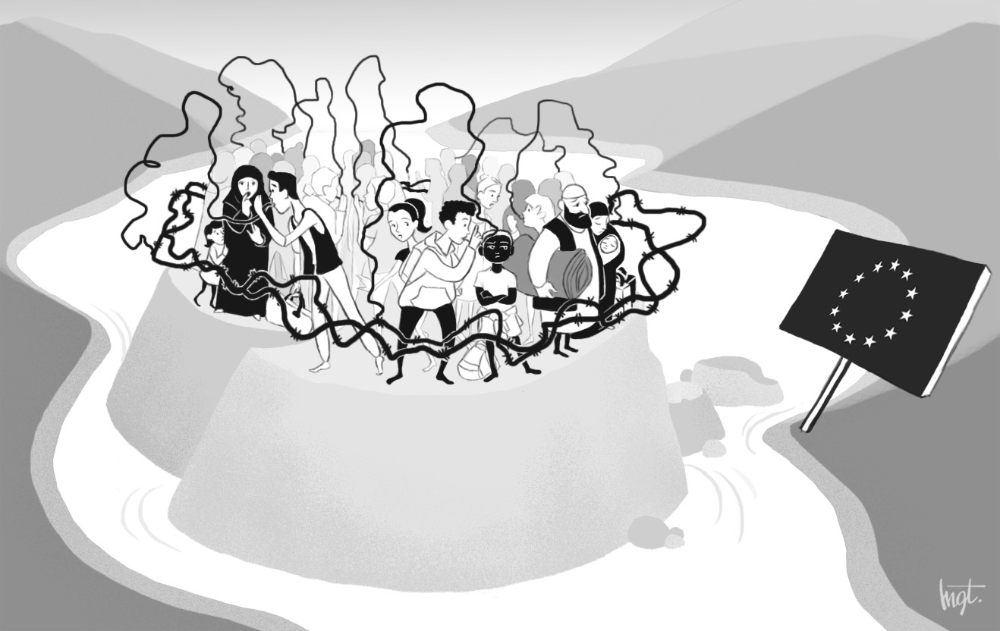
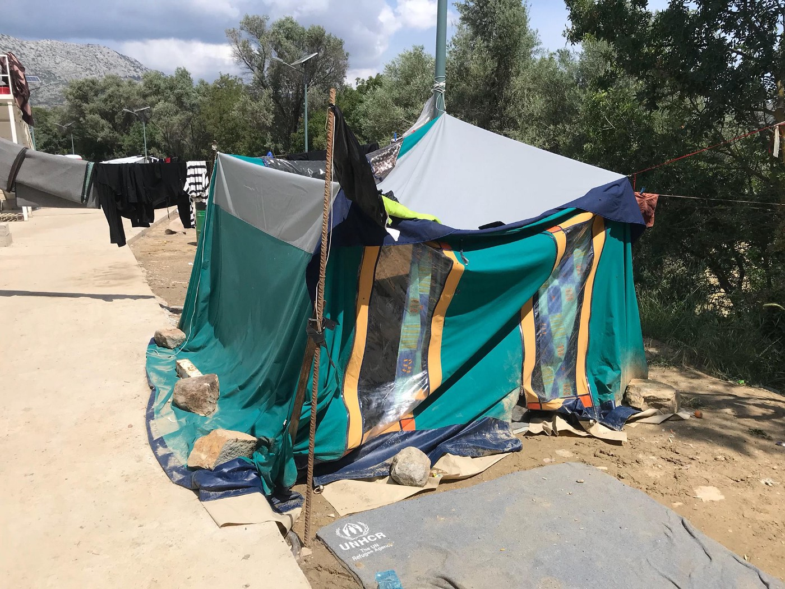

### AYS SPECIAL from Chios: Dangerous rumors in the refugee camp of Vial

_Dangerous rumors are spreading in refugee camps like Vial due to, among other things, the lack of legal information and the length of the procedures\. In order to avoid far\-reaching consequences on the asylum procedures of the applicants, it is imperative that these falsehoods are identified, denied and explained to asylum seekers\. Hanna Umecka and Kenya Pigneret from the [Refugee Law Clinics Abroad \(RLCA\)](https://refugeelawclinicsabroad.org/) on Chios help to debunk some of these rumors_

Drawing from **Margot Van Kerckhove**

In March 2016, the European Union concluded a deal with Turkey, better known as ‘the [EU\-Turkey Statement](http://europa.eu/rapid/press-release_MEMO-16-963_fr.htm) ’\. According to this agreement, all new “irregular migrants” crossing from Turkey to the Greek islands were to be returned to Turkey\. This is based on the concept that Turkey is a “safe third country”, i\.e\. a country where asylum seekers can apply for asylum and enjoy safe lives\.

Chios, a Greek island situated 16 km/10 miles from Cesme, Turkey, is the major gateway for asylum seekers to the European Union due to its geographical position\. For this reason, Chios is one of the islands where a Reception and Identification Center was built when the European Union developed the so\-called “ [hotspot approach](https://ec.europa.eu/home-affairs/sites/homeaffairs/files/what-we-do/policies/european-agenda-migration/background-information/docs/2_hotspots_en.pdf) ”\.

[As denounced by many NGO](open-letter-to-the-european-commission-from-chios-40fb64bde0bf) s, the living conditions in the Reception and Identification Center of Chios, Vial, are [particularly challenging](https://refugeelawclinicabroad.files.wordpress.com/2018/03/statement-vial_general_jan-18_english.pdf) : lack of accommodation, lack of medical care, lack of legal information, inadequate provision of food, delay of asylum procedures, etc\.

Due to the lack of information available in the camp of Vial, the primary source of information for asylum seekers is via word of mouth from their family members, friends and other asylum seekers\. This lack of information, combined with the prolonged period of time that people are trapped in the camp, generates the perfect environment for spreading rumors\.

Some of the rumors are absurd, such as those alleging that some NGOs sell travel documents\. This rumor seems more ridiculous than really dangerous for the asylum seeker\. Unfortunately, other rumors are dangerous because they can have a negative impact on the asylum seeking procedure\. Two particularly worrisome pieces of hearsay spread in Vial must be denied\.

**Rumor one: do not talk about your psychological health**

Some asylum seekers in Vial were told by others that they should not talk about their psychological health during their interviews both because it is not culturally acceptable, and also because if they do so, their procedure will be delayed\. This is not only completely false but can also have far\-reaching consequences for the asylum application\.

> It is important to mention that a large number of people in Vial suffer from mental illness and can therefore potentially be affected by this rumor\. Indeed, the majority of asylum seekers are fleeing distressing situations, leaving them psychologically vulnerable\. Moreover, and as largely denounced by several NGO reports, the camp of Vial is overcrowded and the living conditions are extremely poor\. Inevitably, this also gives rise to severe psychological health problems\. 

In order to understand how false this rumor is, a brief recap of procedures on Chios is needed\. In Chios, [the so\-called “fast\-track” procedure or border procedure applies\.](http://asylo.gov.gr/wp-content/uploads/2017/03/Asylum-procedure-in-the-context-of-the-EU-Turkey-statement.pdf) Under this procedure, the type of interviews an asylum seeker will undergo, depends on his/her nationality :
- Newly arrived Syrian asylum seekers, as well as those from other countries with a _high_ European recognition rate \( _e\.g_ \. Yemeni, Iraqi, Palestinian, Iranian, Sudanese, Eritrean, etc\. \) firstly undergo an admissibility assessment\. Hence, before analyzing if the person meets the conditions of refugee \( _i\.e\._ eligibility interview\), the first step of his or her procedure is to determine whether or not his or her asylum application is admissible in Greece \( _i\.e\._ admissibility interview\) \. In practice, this is used mainly to establish whether an individual can be sent back to Turkey to apply for asylum there\. Indeed, as explained above, since 20 March 2016, \(the date the [EU\-Turkey Statement](http://europa.eu/rapid/press-release_MEMO-16-963_fr.htm) entered into force\), the EU presumes that Turkey is a “safe third country” where asylum seekers can apply for asylum\. Hence, during their admissibility interviews, Syrian asylum seekers and asylum seekers from other countries with a high European recognition rate — in practice the overwhelming majority of asylum seekers arriving in Chios — have to refute this assumption by explaining why Turkey is not safe for them\. If, despite their explanations, Turkey is considered safe for them, their asylum application in Greece is declared inadmissible and they can be returned to Turkey\.
- Asylum seekers from countries with a _low_ European recognition rate \( _i\.e\._ Moroccan, Algerian, etc\. \) are not required to pass an admissibility interview but proceed directly to the eligibility interview\.

By way of derogation, vulnerable individuals of all categories \(Syrian, low recognition and high recognition\) are excluded from the aforementioned border procedure\. Accordingly, they are referred to the normal procedure and are transferred to the mainland, even though in practice the transfer from Chios to the mainland is not effectively taking place for the moment due to unknown practical reasons\. Moreover, people recognised as vulnerable may enjoy other special procedural guarantees\. For vulnerable people from Syria and from other countries with a high European recognition rate, being as such excluded from the border procedure also means being exempted from the admissibility assessment\. Hence, they are not assessed on whether Turkey is a safe country for them\.

Vial\. Photo by the independent volunteer in Chios

> As enshrined in the Greek law \( [Article 14\(8\) of the Greek Law 4375/2016](http://www.refworld.org/pdfid/573ad4cb4.pdf) \), different categories of persons are considered vulnerable, _e\.g\._ unaccompanied minors, persons who have a disability or are suffering from incurable or serious illness, the elderly, women who are pregnant or who have recently given birth, single parents with minor children, victims of torture, rape or other serious forms of psychological, physical or sexual violence or exploitation and persons with a post\-traumatic disorder \[PTSD\] \. 

Some vulnerable persons, such as disabled people or pregnant women, are easily detectable and often identified at an early stage of the procedure by the Greek authorities\. However, other forms of vulnerability are less immediately evident like victims of torture, rape or other serious forms of psychological, physical or sexual violence or exploitation and persons suffering from a post\-traumatic disorder are more difficult to detect if the persons do not speak about their psychological health\. Therefore, these individuals must mention their psychological health problems in order to be classified as vulnerable persons\. This is especially true given the lack of resources for the vulnerability screening \(lack of personnel, lack of time, etc\. \) \. Examinations often do not go deep enough such that many vulnerable people are never detected as such\.

Consequently, persons believing they should not mention their psychological health incur the risk of not being detected and registered as a vulnerable person\. As a result, they incur the risk of not being referred to the normal procedure, not being transferred to the mainland and not enjoying the special guarantees for vulnerable persons\. For the nationalities concerned, this also means that individuals may risk being sent back to Turkey\.

This is what we can call, to say the least, a dangerous rumor\.

**Rumor two: Throwing away documents is a good idea**

Some asylum seekers in Vial had been told by others that in order to leave Greece and illegally cross into northern European countries and apply for asylum there, it is beneficial to throw away all their identification documents\. By doing so, people believe that their identity will not be known and they will therefore not be returned to Greece\.

It is not true that throwing away documents prevents individuals from being sent back to Greece\. In truth, the country responsible for processing an asylum application is determined by a European instrument, the Dublin III Regulation\. According to this Regulation, a hierarchy of criteria is applied to establish the country responsible for processing an asylum application \( _i\.e\._ the next criterion is applicable only if the one before is not\) \. Although it is not the first criterion in the hierarchy, in practice the country responsible for processing an asylum application is often the country where the person irregularly crossed the border into the European Union\. If no other criterion in the hierarchy applies, _e\.g\._ the person does not have close family members in another EU country, Greece will be responsible for his asylum application\.

In order to determine the country in which a person entered the European Union, a fingerprinting system is in effect\. Fingerprints are mandatorily taken upon arrival and stored in a European database — the Eurodac\. Theoretically, other evidence can be used to determine the country a person came from, but this is barely used in practice: the system is almost exclusively based on the fingerprints\.

Hence, if an asylum seeker travels to another European country and applies for asylum there, the Eurodac database will be checked in order to determine where the person first entered the European Union\. If it is not the country in which the person is present, a so\-called “Dublin procedure”, aiming to establish which country is responsible for processing the asylum application, will be triggered\. The first question will be to determine whether any other criteria higher in the hierarchy than the country where the person irregularly crossed the border are applicable\. If not, as it is most often the case, and provided that the deadlines for taking charge of the request and the transfer are respected, the person will simply be sent back to the country where he or she crossed the border, _i\.e_ \. the country where they have been fingerprinted \( _e\.g\._ in the case of a Syrian entering the EU via Greece and then travelling further on to France — if no other criterion in the hierarchy applies and provided that the deadlines are respected, Greece will still be responsible for his asylum application\) \.

In that respect, fingerprints are leading\. This means that if an asylum seeker was fingerprinted e\.g\. in Greece and Greece is responsible under the Dublin III Regulation, this person will be returned to Greece even in the absence of identification documents

In reality, throwing away identification documents can even be dangerous as it might have severe consequences for an applicant\. One example is that an asylum seeker won’t be able to prove his / her identity and nationality which is necessary to be granted international protection\.

Indeed, according to the European Union regulation, [a person can be detained in order to determine his or her identity or nationality](http://www.refworld.org/pdfid/573ad4cb4.pdf) \(Article 46 of the Greek Law 4375/2016 and Article 26 of the EU Directive 2013/32 and 8–11 of the EU Directive 2013/33\) \. Throwing away identification documents can expose a person to detention until his or her identity is determined\.

Furthermore, a person who cannot prove his or her identity, as a result of, for example, throwing away his/her identification documents, might be examined [under an accelerated procedure](http://www.refworld.org/pdfid/573ad4cb4.pdf) \(Article 51 \(7\) c of the Greek Law 4375/2016\) \. Unlike what the name “accelerated procedure” suggests, the accelerated procedure is not a faster procedure in the interests of the applicant \(which is _prioritized procedure_ \) \. The accelerated procedure is a less protective procedure, usually implying shorter deadlines for appeal and fewer appeal judges, which in practice simply allows the authorities to get rid of an applicant faster\.

Hence, in both the cases described, throwing away documents does not make a situation any better, but rather the opposite\. This rumor does not hinder the asylum procedure from being examined by another European country than Greece, but also puts the person in a disadvantaged position and even potentially in danger\.

**Conclusion**

Dangerous rumors are spread in refugee camps like Vial due to, among other things, the lack of legal information and the length of the procedures\. In order to avoid far\-reaching consequences on the asylum procedures of the applicants, it is imperative that these falsehoods are identified, denied and explained to asylum seekers\. In the field, it is difficult for counsellors to identify these rumors, which unfortunately are by nature only secretly whispered words from one ear to another\.

As legal counsellors in Vial, we provided legal advice to asylum seekers and prepared people for asylum interviews\. One of the ways to avoid the spreading of rumors is to continue the provision of quality legal information and legal assistance on Chios\. Legal counsellors on the island do their best but there are not enough legal counsellors to handle the number of individuals there\. Let’s then hope that rumors can be deconstructed as quickly as they are built\.

_\(Text by **Hanna Umecka** and **Kenya Pigneret\. —** LL\.M\. students in [International Migration and Refugee Law](https://masters.vu.nl/en/programmes/international-migration-refugee-law/index.aspx) at the Vrije Universiteit Amsterdam\. We completed our master internship within the German non\-profit organization [Refugee Law Clinics Abroad \(RLCA\)](https://refugeelawclinicsabroad.org/) on Chios, Greece\. RLCA provides legal information to asylum seekers, runs cases of family reunifications under the Dublin III Regulation and provides individual preparation for all kinds of asylum interviews\. \)_

**We strive to echo correct news from the ground through collaboration and fairness\.**

**Every effort has been made to credit organizations and individuals with regard to the supply of information, video, and photo material \(in cases where the source wanted to be accredited\) \. Please notify us regarding corrections\.**

**If there’s anything you want to share or comment, contact us through Facebook or write to: areyousyrious@gmail\.com**

_Converted [Medium Post](https://medium.com/are-you-syrious/ays-special-from-chios-dangerous-rumors-in-the-refugee-camp-of-vial-1809674cbd68) by [ZMediumToMarkdown](https://github.com/ZhgChgLi/ZMediumToMarkdown)._
