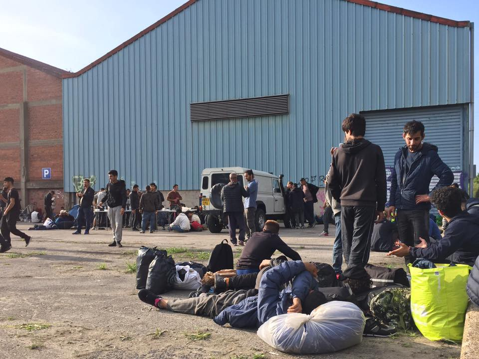
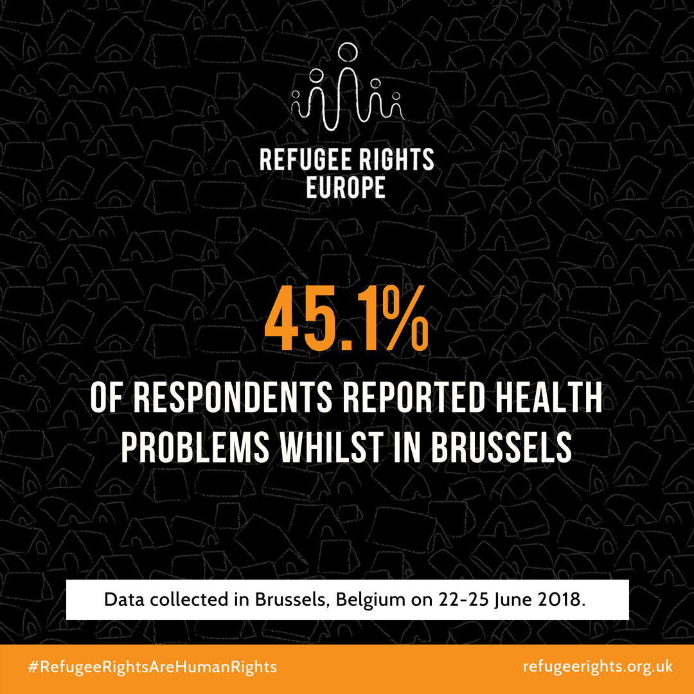

### AYS Daily Digest 06/09/2018: Another eviction in Dunkirk area

_Police have removed any signs of the presence of the 500 people in the Grande\-Synthe area in the north of France / Refugees in Italy face new, tough discriminating decisions of the government / Difficult times ahead for the people stuck in Bosnia and Herzegovina — help needed / Report on Brussels / MSF’s open letter to the EU heads on Libya / And more news…_

](assets/1e352d5459d7/1*Fk_pLSW_Sl26v-rwGMKZSg.jpeg)

Photo: [Calais Action](https://www.facebook.com/calaisaction/?tn-str=k%2AF&hc_location=group_dialog)
### FEATURE

This Thursday, French authorities evicted the entirety of the Dunkirk ‘Jungle\.’
Over 400 people including nearly 100 children and around 60 families were forced onto buses heading to accommodation centres, many of the local groups and media have reported\.

](assets/1e352d5459d7/1*jskIPOZBaXpXBUh6Drmpiw.jpeg)

Photos: [Mobile Refugee Support](https://www.facebook.com/MobileRefugeeSupport/?tn-str=k%2AF)

Reportedly, it was the three shots heard fired at refugees early Thursday morning by a fleeing alleged smuggler that prompted the near 300 policemen to once again clear the area of any people staying there\.

Mobile Refugee Support team reported throughout the day:

> “As the demolition of the camp continues even now, hundreds have been left displaced without tents or even blankets\. Over 100 of these were denied the option to be taken to a centre\. Instead they were pushed away and left to wander the streets\. Over the last few hours we have located over 200 people in small groups of 5–10, sat in car parks or outside abandoned buildings\. Thanks to quick and efficient work from organisations on the ground, we have located a temporary spot where food and charging facilities can be provided\.”

■■■■■■■■■■■■■■ 
> **[Rudaw English](https://twitter.com/RudawEnglish) @ Twitter Says:** 

> > French authorities evicted 500 migrants from a camp near Dunkirk on Thursday. 95 percent are believed to be Kurds from Iraq. 
(📷AFP) https://t.co/qE4acMJeYQ 

> **Tweeted at [2018-09-06 10:24:30](https://twitter.com/rudawenglish/status/1037647723212800000).** 

■■■■■■■■■■■■■■ 

[Calais Action](https://www.facebook.com/calaisaction/?tn-str=k%2AF&hc_location=group_dialog) adds:

> We’re devastated to report a full clearance of the Dunkirk camp is underway\. 

> Coaches have been removing people, around 700 so far\. 

> People will return, so please don’t stop supporting MRS and the other organisations there\. 

We will report on the development of these events in the coming days\.
### GREECE
#### Arrivals

Two boats have arrived on **Samos** early morning on Thursday, carrying 30 and 60 people on board\. In total, 90 people have been documented arriving\.

Frontex picked up a boat arriving outside Νisides Tokmakia, **Lesvos** east, early morning on Thursday with 52 people on board\.

A boat was in distress outside **Kos** north, boat drifting, engine failing\. Port police Kos was informed and during the night the boat was found with 14 people on board: four children and 10 adults, according to [Aegean Boat Report](https://www.facebook.com/AegeanBoatReport/?hc_ref=ARSjSjuMJ3Q1_vxL2jKEIFX4shsU5enCUeXVWJ2zcJ1F3nZEw1bU6ga75TIHv70nAgg&fref=nf) \.
#### Fundraising for food distribution on Chios

[High Wycombe Helping Others](https://www.facebook.com/HighWycombeHelpingOthers/?hc_ref=ART39WbaPWjPztlp5tO4hfsQ1FLOSErdl26oPdQtdTiZ72Fw_dAhyVZxiiX_3-d2aCI&fref=nf&hc_location=group) is launching a fundraising appeal for food for Chios:

> We are nearly ready to ship the container but want to include pallets of food requested by [Chios People’s Kitchen](https://www.facebook.com/chiospeopleskitchen/?fref=mentions&hc_location=group) \. 

> This group cooks daily for hundreds of refugees they also make up packs of dry staple foods for families\. There are items that are easier and cheaper to get in UK\. 

> [https://mydonate\.bt\.com/events/foodforchios/474724](https://mydonate.bt.com/events/foodforchios/474724) 

> We will also be buying other items in Chios to support the local economy\. 

> Sorry its a very short time to raise the money but we really do need help as very short on fund\. It we can raise at least £1500 we can approach suppliers for deals on pallets of food and tea\. 

> Any one wanting to donate items or place orders online to be sent to Big Yellow please message us\. 

### BULGARIA

A new [report](https://idcoalition.org/) on the detention of asylum seekers upon entry in Bulgaria finds that despite a decrease in the number of asylum seekers entering the country, they’re still routinely detained and often for longer periods of time — an average of 52\-59 days\. Detention is unnecessary, harmful, and interferes with human rights\.
### BOSNIA AND HERZEGOVINA

The city of Bihać’s Red Cross has issued a call to all citizens to donate, depending on their circumstances, men’s \(well preserved or new\) wardrobe, suitable for the upcoming weather conditions:
- Long and short sleeves T\-shirts
- Trousers \(size 30, 32, 34, 26\)
- Jackets and hoodies \(size S, M, L, XL\)
- Shoes \(size 40, 41, 42, 43, 44, 45 and 46\)
- Socks and underwear

It is intended for the refugee and migrant people currently staying at the temporary reception centre in Borići\. They also need tents, sleeping bags, blankets and pillows\.

These items can be delivered to the RC facilities, every day from 9am until 3pm\.

 \)](assets/1e352d5459d7/1*NW63UNDGQttEt4SBn29UcQ.jpeg)

Bihać \(Photo: [Crveni križ grada Bihaća](https://www.facebook.com/CrveniKrizBihac/?tn-str=k%2AF) \)

The same items are needed in Velika Kladuša and Sarajevo\.

For more information, please contact Souls of Sarajevo, SOS team Kladuša, and NNK\.
### CROATIA
#### Accommodation

At the moment, the state is covering the rent for 144 flats/houses for those who were given asylum in Croatia\. In 18 cases of people who have received positive decisions, authorities are still waiting to find appropriate accommodation, according to an official source\.

On the other hand, we were recently told that there are about 40 people who are waiting for accommodation, all while staying at the reception centre Porin in the meantime\. Apart from the country’s capital, people are staying in Sisak, Varaždin, Zadar, and Slavonski Brod\. They can turn down \(mostly because they had been waiting for too long and were employed in the meantime and their children enrolled to school in Zagreb\) the accommodation given to them outside the city of Zagreb, but they then lose the right to rent coverage\.

According to this source, all the families staying in Zadar and in Slavonski Brod, without notifying the authorities, have in the meantime left the country\. People with asylum in Croatia who leave the country are usually not deported back to the country because they have the freedom of movement within the EU, but they can’t legalize their stay in their new \(chosen\) country of residence as a result\.
### ITALY
#### Scratching the surface of ‘caporalato’

On September 3rd, the Minister of Labour met with institutions, representatives of unions, and employers’ associations to implement an intervention plan to erase the plague of “caporalato” \(the illegal employment of agricultural workers for very little pay\) and the elimination of “illegal” settlements in the province of Foggia \(Puglia\) \. [What came out of it](http://campagneinlotta.org/repressione-sgomberi-e-sicurezza-a-senso-unico-ricette-quattro-stagioni-per-i-distretti-agro-industriali-lantidoto-e-sempre-e-soltanto-la-lotta/#.W5FSDXQ3JkU.facebook) were measures, already proven useless, that further play against field workers\.

This meeting comes after the tragic death last month of 16 workers in the province of Foggia\. In 48 hours, 16 people died in two different car accidents while coming back from fields where they were exploited for less than three euros/hour\. Institutions replied to the tragedy by randomly arresting and checking on “black bosses,” randomly chosen on the basis of propaganda and racial motivations\.

Even though there are Africans who turn out to be “caporali,” their presence is still far inferior if compared to the presence of Italian caporali, but of course the black man is an easy target\. After these random arrests, the governor of the region pushed for the closure and clearance of every occupied building and makeshift camp that was hosting migrant field workers\. The evacuation of the old factory in San Ferdinando \(Reggio Calabria, Calabria\) is totally in line with these politics\. Imminent is also the evacuation of camps in the area of San Severo \(Foggia\) \.

> Clearances and evacuations seem to be the strategies adopted to get rid of the problem of the agricultural mafia, not recognizing that the effect is the actual opposite\. 

Workers, according to the new “plan” by the government, would be employed by work agencies, from where the actual employer would contact the seasonal workers\. This system is clearly favouring the caporal and spending millions of public money in favour of the cooperatives that would manage these work agencies\. Municipalities where the fields are located will also benefit from funding to build roads and CCTV systems\.

No word was so far given on the introduction of regular working contracts for these people \(because they would guarantee then the right of the worker to access insurance and salary benefits as well as the right to access housing and transport to the location of work\) \.
#### Protest against the arrest of the Tunisian fishermen

Following the news of the six Tunisian fishermen arrested and accused of smuggling people to Italy, reported in [yesterday’s digest](ays-daily-digest-5-9-2018-the-dunkirk-jungle-is-about-to-be-cleared-ae50c46035e6) , 200 people demonstrated at the Italian embassy in Tunis demanding the release of the six fishermen from Zarzis who rescued people they found on a boat in distress\.

](assets/1e352d5459d7/1*JLaZ6UvYsCKA-9M7xgpK4g.jpeg)

Photo: [Alarm Phone‏](https://twitter.com/alarm_phone)
#### Salvini proposes shocking decree

Italian minister Salvini is proposing a decree on immigration that would cancel the humanitarian protection from the system, maintaining only asylum and subsidiary protection as options, basically cutting drastically the possibilities to obtain a permit and some sort of recognition before the law\. This would create, thus, even more “irregular” migrants\. Read more in the text [here](http://www.adnkronos.com/fatti/politica/2018/09/06/migranti-ecco-decreto-salvini_MjVF4DgCuaItXKroK4ZjoL.html?refresh_ce) \.
### BELGIUM
#### Ahead of the report on Brussels…

[Refugee Rights Europe](https://www.facebook.com/RefugeeRightsEurope/?tn-str=k%2AF&hc_location=group_dialog) will soon be releasing a report on the human rights situation for refugees and displaced people in Brussels, Belgium\. It reveals a situation in which the large majority of displaced people are currently sleeping on the streets of Brussels in squalid and unsafe conditions, leading to a number of serious health concerns amongst the displaced population\.

They found that:
- 45\.1% reported that they had experienced a health problem since arriving in Belgium\.
- 37\.3% of those with a health problem reported that it was caused by the unhealthy living environment on the streets of Brussels\.
- Alarmingly, 29\.4% described their health issues as a mental health concern as opposed to a physical ailment\.
- A whole 58% of those who had experienced a health problem told researchers that they had been unable to access medical care in Belgium\.

### LIBYA

> What migrants and refugees are living in Libya should shock the collective conscience of Europe’s citizens and elected leaders\. 

> Blinded by the single\-minded goal of keeping people outside of Europe, European funding is helping to stop the boats from departing Libyan waters, but this policy is also feeding a criminal system of abuse\. 

> The detention of migrants and refugees in Libya is rotten to the core\. It must be named for what it is: a thriving enterprise of kidnapping, torture and extortion\. And European governments have chosen to contain people in this situation\. People cannot be sent back to Libya, nor should they be contained there\. 

> MSF has assisted people in Libyan detention centres in Tripoli for over a year, and has witnessed first\-hand the scheme of arbitrary detention, extortion, physical abuse and deprivation of basic services that men, women and children suffer in these centres\. 

This is an excerpt from a [letter](https://www.msf.org/libya-open-letter-european-governments-are-feeding-business-suffering) of the International President of the Médecins Sans Frontières, addressed to the European government leaders\.

> We cannot say that we did not know that this was happening\. The predation on misery and the horrific suffering of those trapped must end now\. 

> In their efforts to stem the flow, is allowing people to be pushed into rape, torture and slavery via criminal pay offs a price European governments are willing to pay? 

**We strive to echo correct news from the ground through collaboration and fairness\.**

**Every effort has been made to credit organizations and individuals with regard to the supply of information, video, and photo material \(in cases where the source wanted to be accredited\) \. Please notify us regarding corrections\.**

**If there’s anything you want to share or comment, contact us through Facebook or write to: areyousyrious@gmail\.com**

_Converted [Medium Post](https://medium.com/are-you-syrious/ays-daily-digest-6-9-18-another-eviction-in-dunkirk-area-1e352d5459d7) by [ZMediumToMarkdown](https://github.com/ZhgChgLi/ZMediumToMarkdown)._
