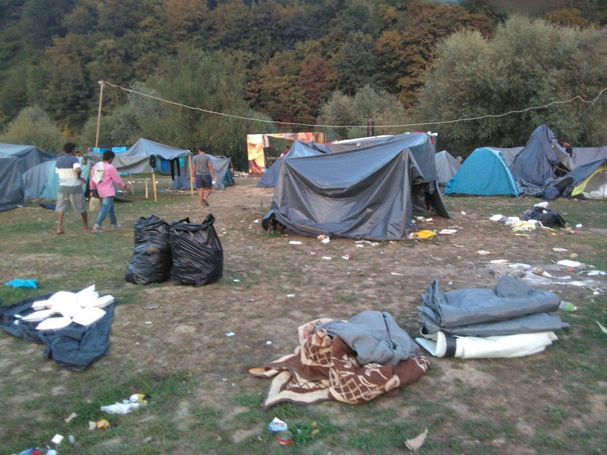
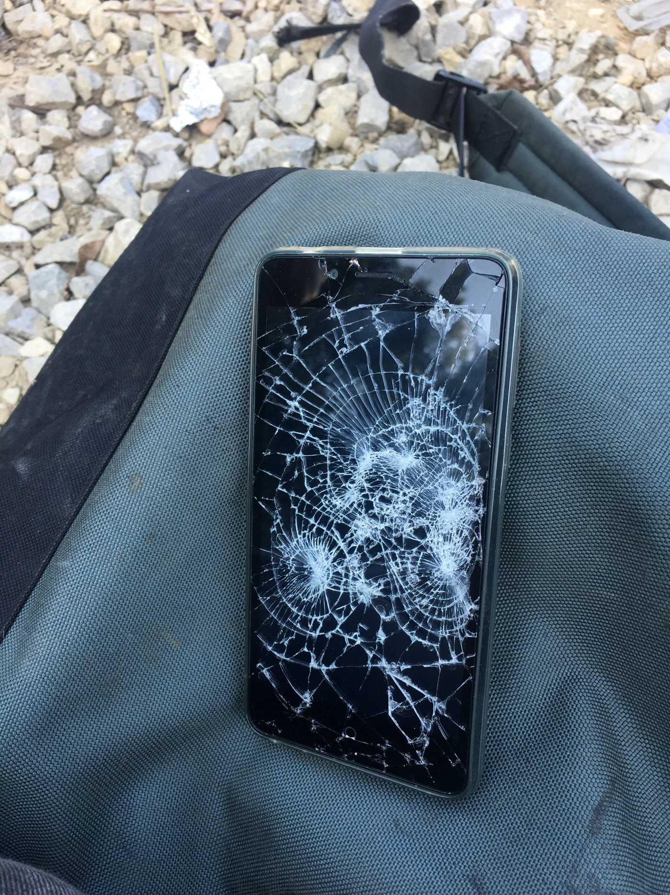
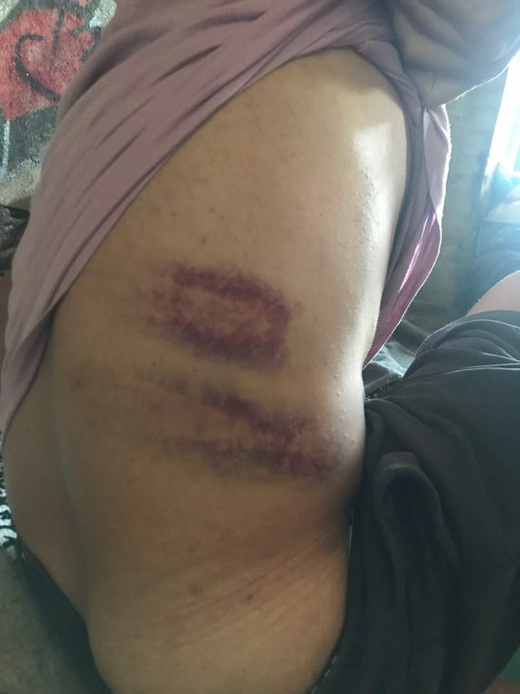
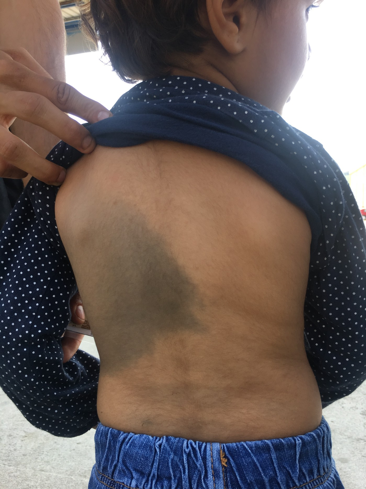
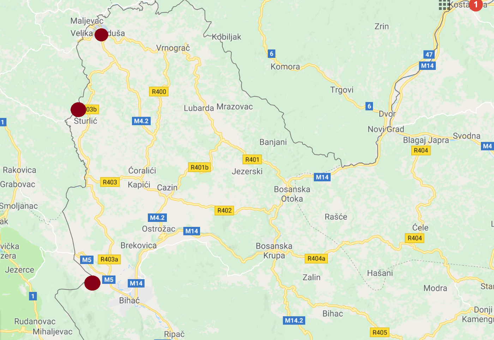

**Illegal push\-backs and border violence from the EU external borders to Bosnia**

_Report from the border between Bosnia and Herzegovina and Croatia by the No Name Kitchen_

Make\-shift camp in Velika Kladuša\. By NNK\.

The northern Bosnian border, particularly the area around the town Velika Kladuša, became the hot spot for displaced people who have been trying to escape poverty and violence and reach protection in the European Union \(EU\) through the so\-called Balkan Route\. Around 600 people are trapped in this town beyond the EU border and temporarily stay in the precarious conditions of the informal camps comprised of plastic sheet shelters\.

There is no legal and safe transit forward for these people\. Abandonment by the EU authorities, those who come to this border town are forced to try the “games”, the colloquial name used to describe attempt at crossing the border; walking through unmarked terrains, surviving without food and water for days, coping with harsh weather, cooperating with smugglers and negotiating live mine fields\. People are often exposed to the violence and humiliation by the Croatian and Slovenian border authorities while trying to cross the border and exercise their right to claim asylum in the EU states\.

**MONITORING THE BORDER VIOLENCE**

No Name Kitchen has been based in Velika Kladuša for the last three months\. Besides engaging with daily provision of non\-food items and showers in the makeshift camp, our organisation together with the Balkan Info Van have been monitoring the illegal and violent push\-backs\. Our teams have been conducting interviews with some of the group members who have been violently expelled back to the Bosnian territory and transcribing these into individual reports for legal, lobbying and monitoring purposes\.

**BORDER VIOLENCE AUGUST**

During August, we have reported 260 cases of people who have been illegally pushed back from the EU inner land \(Croatia and Slovenia\) to Bosnia\. However, we believe that there are many others who have been violently pushed back and who remain undetected by our organisations\.

Those facing illegal push\-backs share that they have been subjected to violence and humiliation at the hands of Croatian and Slovenian border authorities\. The border authorities have been using physical attacks by batons and electric cattle rods, intimidation and verbal threats, gun shooting, strip\-searching and sexually harassment, stealing their possessions, destroying their phones and legal documents, detaining them in closed cells and cars with lack of oxygen, denying them access to asylum procedures, and deporting them back to Bosnia\.

We have observed several patterns of the structural violence and oppression against the people who have attempted to cross the EU borderlands\.

Firstly, the victims of the physical attacks by the border authorities have been mainly people who have clearly expressed their wish to claim asylum in Croatia or Slovenia\. Simply by asking, people are deemed to be provoking or somehow aggravating the police officers\. Groups described how they were told to “shut up”, and where individuals have tried to articulate their asylum requests verbally, they have been targeted disproportionately\. Simply by speaking up, asylum seekers can now be put at further risk of extrajudicial violence\. It seems now that groups are forced to comply by remaining silent, meanwhile the relevant authorities refuse to comply with international law on asylum\.

Further, we have noticed a close cooperation between the Slovenian and Croatian police forces\. The Slovenian police often hand the people over to the Croatian border forces dressed in black, whom people called “commando”; a unit in charge of the violent push\-backs to Bosnia\. These violent deportations take place mainly in unmarked locations, particularly forests and mountain areas, close to Velika Kladuša, Šturlić, and Bihać \(BiH\) \(viz\. map below\) \.

Several victims also reported to us that they have seen Croatian and Slovenian officers paying the local population bribes in exchange for acting informants in order to relay the initial detection of people passing through the interior and border areas\.

Within the detected and reported cases by our organisations, we have identified 43 children and minors, and 13 women\. Women and children have been either directly physically attacked by the border authorities or suffered injuries during the violent deportations\.

For example, a 3\-years\-old girl from Iran received an injury to her back\. As the police assaulted her father who was holding her in his arms, he felt down heavily, resulting in severe trauma to the child’s torso \(viz\. photo below\) \. Other children who have escaped from the deportations without injures were made to observe their family members and friends being humiliated and attacked in front of their eyes\.

The majority of people are scared to openly talk about their experience of the border violence as they believe that once they would be publicly visible, they could be exposed to higher violence during their next attempts at border crossing\. For this reason, many people are reluctant to take cases to court, feeling that the legal proceedings may put them and their families in more danger\. Only one woman who has been physically attacked by the Croatian police has expressed her wish to approach a lawyer and make an official complaint about the border brutality to the Croatian Ombudsman\. The organisation Are You Serious has legally supported her case, but the majority of the perpetrators will avoid any prosecution\.

**RELIANCE ON SMUGGLING NETWORKS**

With the increasing border violence, we have also observed a higher reliance of people on smuggling networks, particularly families with small children\. For example, a mother of a two year old girl told us that walking in the forest with a baby is difficult and risky as they can be detected and attacked by the police\. For this reason, she and her family paid a smuggler 3000 euros to be transported by a car from Bosnia to Italy\. However, the smuggler did not picked them up from the arranged point and they have been deported back to Bosnia several times\. Other families told of similar experiences, but they continue to pay smugglers thousands of euros as they believe they have no other option of safe transit to Europe\.

**RESPONSE BY THE AUTHORITIES**

While we have witnessed the large number of testimonies that significantly prove the continued existence of \(and marked rise in\) border violence, the Croatian ministry denies allegations of police brutality\. The ministry has [stated to media](http://ba.n1info.com/a280377/English/NEWS/Croatian-ministry-denies-allegations-of-police-brutality.html) that the Croatian police is acting in accordance with national laws, as well as [international standards](http://www.unhcr.org/protect/PROTECTION/3b66c2aa10.pdf) \.

**_Red marks signifying the places where majority of the violent push\-backs took place\._**

This denial of the border violence and ignorance by the EU authorities has resulted in no legal punishment of the perpetrators and persistence of the push\-backs\. The inaction of member states can only be understood as condoning the violence of the EUs external borders, making all of Europe complicit\.

We wish to remind them that the violent push\-backs are against international asylum law and human rights\. Based on the so called _non\-refoulement_ principle, EU states are obliged to access the case of asylum seekers regardless of whether they are granted the status of a refugee and thereby international protection, and not to return her or him to a state where he or she faces a threat to life or liberty\.

Furthermore, according to the EU Directive on Asylum Procedures \(2005/85/EC\) those recognized as ‘irregular’ migrants are entitled to information about asylum, translation assistance, the ability to present their case to a competent authority, notification of the outcome, and the right to appeal a negative decision\. These principles were all ignored by the Croatian and Slovenian border police in the cases we recorded and continue to be neglected on the daily basis\.

As authorities persist in making this perilous land route harder, the cost will not only be counted in statistics and reports, it will be counted in lives\.

**_\(By Karolina Augustova, No Name Kitchen\. More reports on the border violence and detailed August report at [NNK web](http://nonamekitchen.org/wp-content/uploads/2018/09/Push-backs-and-violence-report-August.pdf) \)_**

**We strive to echo correct news from the ground through collaboration and fairness\.**

**Every effort has been made to credit organizations and individuals with regard to the supply of information, video, and photo material \(in cases where the source wanted to be accredited\) \. Please notify us regarding corrections\.**

**If there’s anything you want to share or comment, contact us through Facebook or write to: areyousyrious@gmail\.com**

_Converted [Medium Post](https://medium.com/are-you-syrious/illegal-push-backs-and-border-violence-from-the-eu-external-borders-to-bosnia-5f2ef2b941f) by [ZMediumToMarkdown](https://github.com/ZhgChgLi/ZMediumToMarkdown)._
