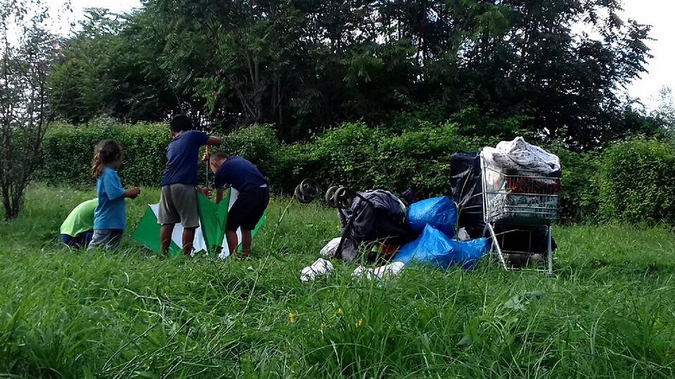
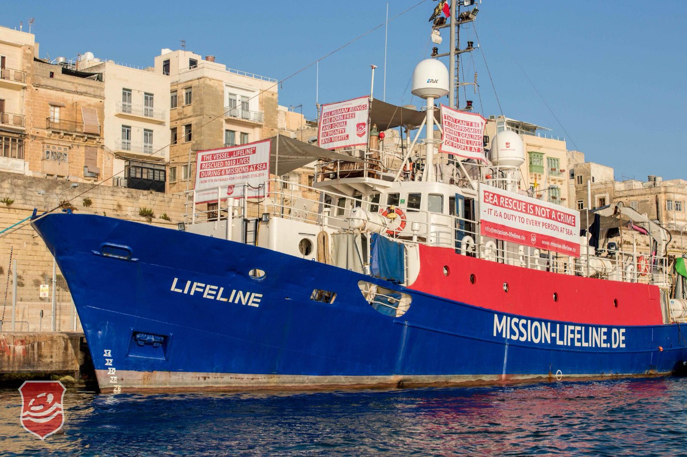
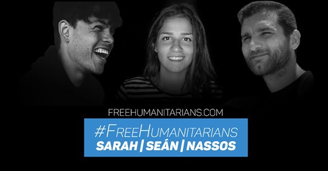
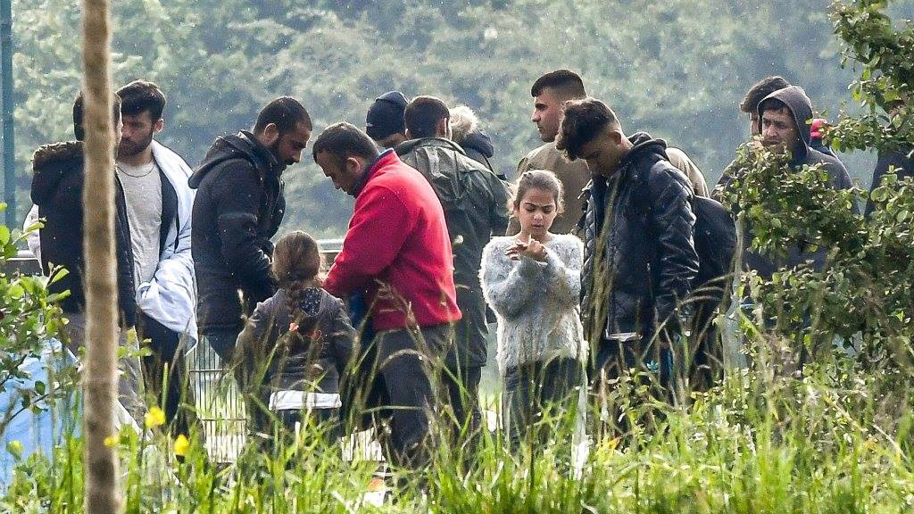
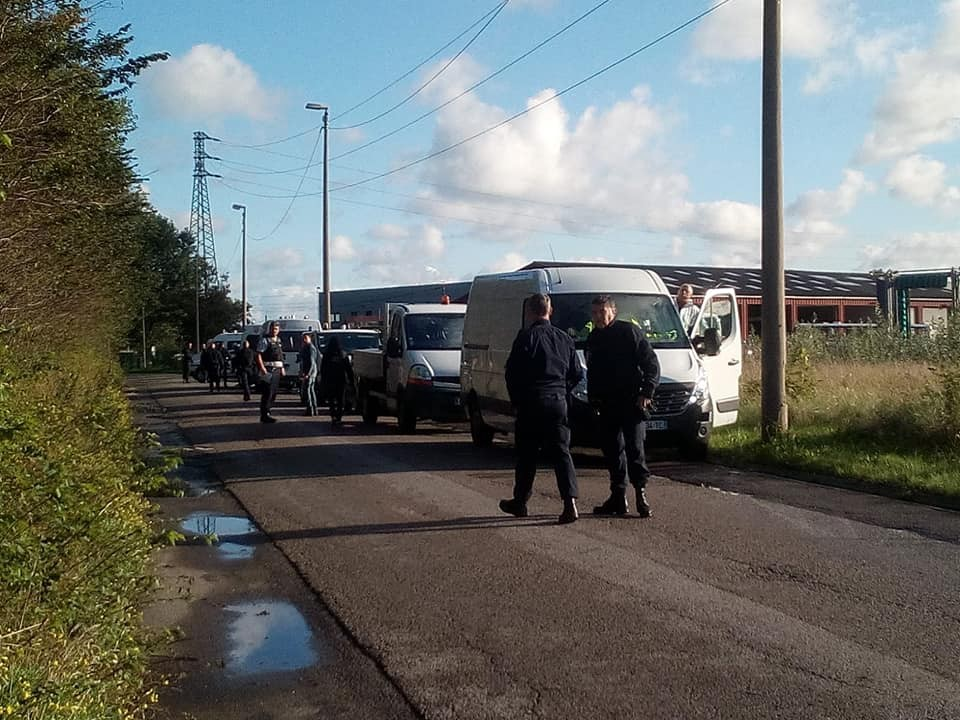

### AYS DAILY DIGEST 07/09/2018: Detainees from the ship Diciotti again persecuted

_Evictions in Rome // Controlling narratives and building borders in the world and in the mind // Greek government deftly leverages right wing groups to its own advantage // Refugee minor beaten with bat in Greece // Refugees desperate to register in embattled Tripoli // Hundreds rescued off of Spain // The fallout of Dunkirk Jungle eviction // Deportation action needed in Netherlands // Long update on the upcoming election in Sweden and how this will affect refugees and migrants there // More…_

Children waiting during the operation against Baobab Experience \. Melting Pot Europa
### FEATURE: Police in Rome hunt down people who were aboard the Diciotti\.

Baobab Experience and Doctors Without Borders, and others reported on the sudden and inhumane police raid on the Baobab Experience space by Italian police\.

Live video was posted of the raid, which can be seen below\.

The space was occupied by more than 200 people\- around 270\- both Italians and immigrants without a place to go\. According to witnesses, the evacuation/raid came at around 7am\. Many individuals were taken into police custody and released later, carrying a paper citing violation of the illegal occupation of a building\.

Photo credit: Melting Pot Europa

The space had received an evacuation notice, but that notice was to be carried out on September 15th, not today\. Read more, in Italian, [here](https://www.facebook.com/meltingpoteuropa/posts/2066448193386897?hc_location=ufi) \.

Notes from Baobab Experience in Italian can be found in the tweets below\.

■■■■■■■■■■■■■■ 
> **[Baobab Experience](https://twitter.com/BaobabExp) @ Twitter Says:** 

> > +++OPERAZIONE DI POLIZIA AL NOSTRO PRESIDIO:CERCANO I MIGRANTI DELLA #DICIOTTI+++
Sì: donne, uomini e bambini eritrei che erano su quella nave sono passati al nostro campo.
Qui comunicato su quanto successo stamattina e sulle persone che abbiamo supportato
[facebook.com/BaobabExperien…](https://www.facebook.com/BaobabExperience/photos/a.855775474499206/1829868380423239/?type=3&permPage=1) https://t.co/4emirBMef0 

> **Tweeted at [2018-09-07 09:23:03](https://twitter.com/baobabexp/status/1037994645215739909).** 

■■■■■■■■■■■■■■ 

Doctors without Borders also confirmed that several of their Eritrean clients awaiting treatment at their medical facility in Baobab Experience were taken into custody\. Not only did this violate their right to medical care, it also violated doctor\-patient confidentiality, [as MSF/DWB Italy notes](https://twitter.com/MSF_ITALIA/status/1038023907893239808) \!

Later police confirmed the hunch of many — that they were seeking specifically those people who had finally been allowed to disembark from the Diciotti\.

Fortunately, there is some good news for the continually hounded victims of the unlawful Diciotti detention, in that the prosecutor of Palermo should shortly begin the preliminary investigation as to whether or not Salvini, the minister responsible for their detention, can be found guilty of aggravated kidnapping for this act\. Although this is a sliver of good news, it is with sickened hearts that we see this judicial action seems to bring no day\-to\-day relief to his victims who continue to be harassed and persecuted\.

We ask governments — which rights are inviolable and which are not? Why is it considered fair and just to raid a centre and give the justification as condemning people for violating property rights or failing to register when a system is not providing them with appropriate and expedient channels to register? The criminalization of human existence needs to stop\.

In that vein, the Bolzano section of “Forum for Changing the Order of Things” is holding a peaceful march on September 16th near the border\. Read below for details\.

_“We walk together along the path number 1 going up to the border line with Austria\. At that point, in correspondence of the plateau, we will stop for a moment of sharing in which we will read significant passages for the meaning of the walk\._

_Continue to the Sattelmoser biotope, to the Sattelbergalm, until you get off at Gries am Brenner\. From Gries am Brenner you take the train to return to the Brenner\._

_The duration of the route is about 4 hours, uphill height difference of 550 meters, downhill 110m\._

_The walk is of low difficulty, so that everyone can participate\._

_This is not a manifestation or a garrison, but a symbolic and peaceful gesture to launch a message of the opening of the borders so that these places will return to being safe passage territories\._

_In this regard, we invite all South Tyrolean, Austrian and German companies active in the area to join this walk\. We believe, in a delicate moment like this, that the union and the collaboration of all towards a common goal, towards a world without walls, for a Europe that welcomes, open and support “is fundamental”\.”_

_The Forum asks to give your notice of participation by the 8th of September to the email: percambiarelordinedellecosebz@gmail\.com_

Read more, [here](https://pclodc.blogspot.com/) \.

The absolute hypocrisy of the “rule of law” must be confronted without end\. In an utterly unsurprising turn of absurdity, the European Commission announced its grand plan to stand up to anti\-Migration populism by doing the populists’ job for them\. [Dimitris Avramopoulos is set to announce](https://www.politico.eu/article/europe-migration-commission-hits-back-at-populists/) several new “packages” next Wednesday which include, to no one’s surprise, increased border control and monitoring\.

Of course populists will continue to claim the move is insufficient, and therefore as we can see, this is little more than shifting the window of “rational debate” further to the right as anti\-migration sentiments are normalized\. It is impossible to placate the voracious inhumanity of those who present their racism and Islamophobia in mere “concern for the host country” or even more repulsive, as concern for the migrants themselves — using arguments about insufficient integration support as an excuse to send people “back where they came from\.”

Speaking of, the normalization of apathy about support for refugees can be clearly seen through the thinly\-veiled propaganda coming from the upcoming reality TV show to be broadcast in Poland this fall\. As [Info Migrants reports](http://www.infomigrants.net/en/post/11712/polish-tv-show-on-refugees-draws-controversy) , a reality show, titled “Go back to Where You Came From”, features six Polish citizens traversing the route from Poland, over the Balkan route, to Iraqi Kurdistan and is designed to “raise awareness” of the “realities” of migration\. In addition to coming under criticism from refugee support groups for being little more than “poverty porn,” the extent to which programming like this minimizes and decontextualizes the oppression faced by those escaping persecution, providing the public with an easily\-digestible frame of reference through which they will analyze the ongoing agony of those people, displaced a myriad of times\.

The TV program is “defended” through the premise of the participants — three of whom are pro migration and three of whom are against, with the unstated expectation that these differing opinions will produce “dialogue” and that the experiences of the contestants will “make real” the realities faced by those on the road, yet it remains unclear and disturbing what messages will be really conveyed\.

Even if the show seems to encourage empathy towards displaced people, under the guise of encouraging people to action, it is anticipated this will only innoculate people towards meaningful action, leaving them to be content with consuming the artificial reality in place of actually confronting the truth\. After all, consuming media is educating oneself, right? How many people could we expect to be mobilized to action after seeing the antics and constructed drama of a reality show? If the daily reports of violence, intimidation and exploitation of humans cannot move people, what can a reality show designed primarily to entertain and get views really effect?

Nevertheless, it is because of this that we must continue to move and take action as it is clear large media corporations and their enablers are forming the narrative\.
### LIBYA

More and more reports of the entirely failed system in Libya continue to surface\. In spite of enjoying several deals with the EU in terms of intercepting and receiving people pushed back from the sea to reception centres, the Libyan system remains defunct in registering refugees and asylum seekers, leaving them open to exploitation\.

According to Sally Hayden, who is in regular contact with many people in detention in Libya, people are desperate to be registered with UNHCR\. Those who are trapped in Tripoli \(which is currently an ongoing conflict zone\) are considering dangerous journeys through militia\-held territory to make it to the registration site\.

■■■■■■■■■■■■■■ 
> **[Sally Hayden](https://twitter.com/sallyhayd) @ Twitter Says:** 

> > UNHCR has now posted on FB saying they're registering in one location in Tripoli. Refugees I'm speaking to considering breaking out of detention centres &amp; braving militias across the city to make it there to register. Not sure why they weren't registered before fighting started https://t.co/701Eclawb2 

> **Tweeted at [2018-09-07 18:05:07](https://twitter.com/sallyhayd/status/1038126028986740736).** 

■■■■■■■■■■■■■■ 

Those who are unregistered and are moved to other locations face disappearing into the well\-documented criminal slavery rings that the Libya has become infamous for\.

Tripoli itself is filled with infighting and ongoing battles, yet Libya remains a “safe country” to return refugees to? Doctors without Borders is speaking out as they have been forced to close many of their operations in Tripoli due to the embittered fighting\.

■■■■■■■■■■■■■■ 
> **[MSF Sea](https://twitter.com/MSF_Sea) @ Twitter Says:** 

> > #MSF has been forced to suspend regular medical activities &amp; reduce the size of its team. At present MSF is only able to provide limited assistance in #Tripoli’s detention centres, namely emergency medical referrals &amp; ad-hoc distributions of food, water &amp; hygiene kits. 

> **Tweeted at [2018-09-07 10:43:54](https://twitter.com/msf_sea/status/1038014994942705664).** 

■■■■■■■■■■■■■■ 

As such, MSF is also calling on the SAFE evacuation of refugees and migrants from detention centres in Tripoli\. The reprehensible collaboration with the exploitative and unstable system needs to end\! How can the EU maintain any moral credibility with “allies” like these?
### SEA

Update from the Aquarius\!

■■■■■■■■■■■■■■ 
> **[SOS MEDITERRANEE](https://twitter.com/SOSMedIntl) @ Twitter Says:** 

> > [VIDEO] From the #Aquarius in #Marseille, Sophie Beau, co-founder of @[SOSMedIntl](https://twitter.com/SOSMedIntl), gives an update on the current situation in the Central #Mediterranean and renews our call on EU leaders for an urgent coordinated search and rescue response in the Mediterranean. https://t.co/NXj9VT2BJM 

> **Tweeted at [2018-09-07 14:00:29](https://twitter.com/sosmedintl/status/1038064467425288195).** 

■■■■■■■■■■■■■■ 

Additionally around 276 people have been rescued [from the Malboran Sea](https://twitter.com/salvamentogob/status/1038126963741876225) and at least 51 people from the straight near Spain\. Red cross and other organizations are involved in the [support of the 276](https://twitter.com/CREMalaga/status/1038135651500257288) \.

Additionally, the Lifeline has now been detained in Malta for two months\! The ship is now attracting the attention of passing tourists and has transformed itself into a standing “advertisement” of the inhumanity of criminalization of sea rescue\.

Photo Credit: Mission\-Lifeline\.DE

In addition to the Lifeline, the Moonbird, an air reconnaissance craft, has been detained since May 25th, according to [SeaWatch](https://twitter.com/SeaWatchItaly/status/1038083238886076421) \.
### GREECE

In Greece, it appears that right\-wing groups continue to operate under the neglectful and irresponsible eye of the Greek government\. In a statement released on Elaliberta\.Gr, people highlight that right wing groups have been scattered around Lesvos — capitalizing on the frustration of the populace and the ambivalence of the government to take any meaningful action against their violence\. The government administered centres continue to be squalid and poorly run, adding to frustrations of people trapped there\. This bleak picture is leveraged by far right groups in order to broaden their base of support, while the government benefits from this resentment as their rage is taken out on political opposition\. Allowing fascist thugs to persecute refugees and their supporters while the government officials come in as a “voice of reason and stability” while effectively doing nothing is deplorable\. Read the full statement, in Greek, [here](https://www.elaliberta.gr/%CE%B1%CE%BD%CE%B1%CE%BA%CE%BF%CE%B9%CE%BD%CF%8E%CF%83%CE%B5%CE%B9%CF%82/4637-%CE%B1%CE%BD%CF%84%CE%B1%CF%81%CF%83%CF%85%CE%B1-%CE%BB%CE%AD%CF%83%CE%B2%CE%BF%CF%85-%CE%B1%CF%80%CE%BF%CE%B8%CF%81%CE%B1%CF%83%CF%8D%CE%BD%CE%BF%CE%BD%CF%84%CE%B1%CE%B9-%CE%BF%CE%B9-%CF%86%CE%B1%CF%83%CE%B9%CF%83%CF%84%CE%B9%CE%BA%CE%AD%CF%82-%CF%83%CF%85%CE%BC%CE%BC%CE%BF%CF%81%CE%AF%CE%B5%CF%82-%CE%BC%CE%B5%CE%B3%CE%AC%CE%BB%CE%B5%CF%82-%CE%BF%CE%B9-%CE%B5%CF%85%CE%B8%CF%8D%CE%BD%CE%B5%CF%82-%CE%BA%CF%85%CE%B2%CE%AD%CF%81%CE%BD%CE%B7%CF%83%CE%B7%CF%82-%CE%BA%CE%B1%CE%B9-%CE%B1%CE%BE%CE%B9%CF%89%CE%BC-%CE%B1%CE%BD%CF%84%CE%B9%CF%80%CE%BF%CE%BB%CE%AF%CF%84%CE%B5%CF%85%CF%83%CE%B7%CF%82) \.

Similarly, please do not forget about Sarah, Sean and Nassos who remain in custody after being arrested for saving lives\!

Photo courtesy of ERCI

We Are a Welcoming Europe is promoting a petition in solidarity with those arrested, as can be seen below\.

■■■■■■■■■■■■■■ 
> **[We are a welcoming Europe](https://twitter.com/WelcomingEurope) @ Twitter Says:** 

> > The arrest of Sarah and Seán #FreeSarahAndSean is only the latest case of criminalising help of #volunteers for helping #migrants &amp; #refugees. Help end criminalisation and sign the #WelcomingEurope petition!   
➡️[weareawelcomingeurope.eu](https://weareawelcomingeurope.eu/) https://t.co/T7n6knrBc4 

> **Tweeted at [2018-09-07 15:00:20](https://twitter.com/welcomingeurope/status/1038079525790408705).** 

■■■■■■■■■■■■■■ 

> According to Aegean Boat Report, two boats with 92 people onboard landed to Lesvos, and according to SMH, 8 people from Iraq landed on the island of Inouses\. 

#### Mainland

Victoria Social Centre is out of food bags until next month\. Please contact [SOSrefugiados](https://twitter.com/sosrefugiados/status/1038010601132498944) on Twitter to help them restock\! September is just starting\!

Additionally, a horrific racist attack has occurred against children in Oreokastro\! Outside of the ARSIS solidarity hostel, according to local media:

_“As ARSIS mentions, the two boys fell in an ambush of eight or ten people, who approached them with covered faces, asking “where are you from?”\. As soon as the children responded, declaring their country of origin, this group, with clear and stated racist motives, attacked the children, striking one of them \(the second managed to move away from the point\) to the head and body with bats\. The child was injured in several places and was taken directly to a hospital, while the police were summoned and the lawsuits for the incident began\.”_

We hope that justice will be served against these hateful people\! This kind of action is becoming ever more normalized, tragically\. Read more, in Greek, [here](https://tvxs.gr/news/ellada/ratsistiki-epithesi-me-ropala-se-prosfygopoyla-sto-oraiokastro) \.
### FRANCE

As we previously reported, the jungle camp Grande Synthe in Dunkirk was evicted with great brutality by police\. Local support organizations are overwhelmed\.

Refugee Women’s Centre posted a chilling account on the horrific day that unfolded\.

_“Yesterday at 7:15, we watched as police van after police van piled into and surrounded the camp, home to roughly 800\+ refugees\. We then watched as an army of policemen sprawled into the jungle, with large weapons and clipboards\. Human Rights Observations have become a part of morning routines during the summer, but we were quickly told to leave\._

_Pictures and messages started flooding in from the camp\. Families messaging to say they had no time to collect their things and had nothing\. They told us they were scared and they did not know where they were going\. They reported men being pushed and kicked by police\._

_At 2:30pm we drive around to find men scattered everywhere, with no place to go\. [Mobile Refugee Support](https://www.facebook.com/MobileRefugeeSupport/?fref=mentions&hc_location=group) set up phone charging in a nearby car park\. After 1 hour and a constant flow of humans who had nothing but the clothes on their backs, we are up to 200 people\. They tell us of how all families and some men were taken on buses to accommodation, and the rest of us \(hundreds\) had everything destroyed and told to leave\. “Are we not humans? Do us men not have human rights?” one man said\._

_We scout around the area to find a place suitable for [Refugee Community Kitchen](https://www.facebook.com/refugeeCkitchen/?fref=mentions&hc_location=group) to do a food distribution and settle on an abandoned warehouse near a busy road\. People set down to eat and charge their phones, and we dart around collecting human rights violation reports and offer what little support we can\. They had gone all day without food or water\. There are cars driving past beeping and shouting abuse\. It’s nearly 7pm and we are up to 300 people\.”_

Read more [here](https://www.facebook.com/refugeewomenscentre/posts/508869429538692) \.

Around 800 refugees were cleared from the jungle camp\. Both Calais Action Brighton and L’Auberge des Migrants post urgent need for items for all people\.

Collection for Calais Action Brighton will occur Friday the 14th at “Mighty Seed Cafe”\. Urgent items needed are listed below:

_ITEMS CURRENTLY NEEDED:_
- _Women’s pants \(new \) — S/M/L_ 
_— Women’s thin socks \(new \)_ 
_— Children’s pants/boxers \(new, all ages\)_ 
_— Children’s socks \(new,all ages\)_ 
_— Children’s shoes \( all ages\)_ 
_— Teen’s and men’s shoes \( especially small sizes \)_ 
_— Tents \(2–8 person\)_ 
_— Tarpaulin_ 
_— Sleeping bags_ 
_— large blankets_ 
_— Medium and large backpacks_ 
_— Adult diapers size S, M and L_ 
_— Nappies \(all sizes — especially size 5 and 6\)_ 
_— Baby wipes_ 
_— Baby Milk №2 & №3_ 
_— Shampoo_ 
_— Sanitary towels_ 
_— Women’s deodorant_

_For more information, go [here](https://www.facebook.com/CalaisActionBrighton/posts/1395162103919701) \._

L’Auberge des Migrants is in need of tents, tarupaulins, food, and duvets\. They note that people are being prevented from resettling by police\!

Photo Credit: L’Auberge des Migrants

Please donate here in order to help\. Go here:

_— by the website, [www\.laubergedesmigrants\.fr](http://www.laubergedesmigrants.fr/)_ 
_— by hello association [www\.helloasso\.com/associations/l\-auberge\-des\-migrants/formulaires/2](http://www.helloasso.com/associations/l-auberge-des-migrants/formulaires/2)_

Additionally, police carried out yet another eviction in Calais early yesterday morning\.

Photo Credit: Alex Soare
### The NETHERLANDS

URGENT ANTI\-DEPORTATION ACTION NEEDED\!

Stand Up for Afghans and other activists report the following from the Netherlands:

Two days ago an Afghan family consisting of a mother with three sons was arrested at the Family Location Emmen\. They are detained in Kamp Zeist for two days now to be deported to Afghanistan on Wednesday 12 September\.
 The last message received was that they were still waiting for their Kinderpardon procedures, but that the DT & V \(Repatriation and Departure Service\) said they could wait for this in Afghanistan\.
 The family has been living in the Netherlands for 7 years and has already lived in various AZCs and family locations\. Until recently they lived in Goes, but moved to Emmen with the closure of the family location\.
 The family has asked that this information could be shared hoping that the deportation will be stopped\. The children speak Dutch, but do not speak any of the languages ​​spoken in Afghanistan\.

For more information and for how to get involved, go [here](https://www.facebook.com/DontSendAfghansBack/?fref=mentions&hc_location=group) \!
### SWEDEN

On Sunday the 9th, there will be elections in Sweden, as AYS have previously mentioned\. The opinion polls published every other day in the papers and other media show that the past weeks have been even, and the outcome on Sunday is uncertain\.

Traditionally in the Swedish political landscape there has been two major parties, the Social Democratic Party and Moderaterna \(conservative/liberal\) \. That is not the case anymore, since smaller parties are growing and the right wing party the Sweden Democrats has grown significantly\. Important to note, is that a lot of people who previously used to vote for the two main parties have now gone over to the Sweden Democrats\. Many claim to be non\-racists, but valuing the Swedish society and welfare for which they fear is at risk\. All of this is, of course, in line with the right wing winds blowing through Europe — playing on people’s fears and feelings rather than reality\. It’s pure populism\.

In the Sunday\-election, there is a lot at stake\. Migration is one of the main questions for a lot of parties\. In an opinion poll from the daily paper Dagens Nyheter, they clarified how the different parties stands in three main questions: more generous legislation regards residence permits, more \(or less\) strict rules for being able to take part in the welfare system and financial assistance, and finally permanent residence permits as praxis\.

The investigation shows, without pointing out all the details about which parties say what, that the political landscape is divided\. It is no longer a left \(social democratic/left\) versus right \(conservative/liberal\) issue\.

With that said, to form a government after the election will not be an easy task, according to everybody involved in the election as well as several experts\. No other party will currently cooperate with the Sweden Democrats \(SD\) \. Given the fact that Moderaterna’s politics are dangerously similar when it comes to migration \(something often denounced by the party itself\) and that SD has around 20% in some of the opinion polls, it could be the case that with a government with a PM from Moderaterna \(Ulf Kristersson\), SD sooner or later would gain more impact than they have today\. This is not officially stated, but worth noting\.

Nevertheless, the most left wing party in the Parliament for now, Vänsterpartiet, are likely to have their best election in over a decade, reaching almost 12% in some opinion polls\. Vänsterpartiet has, despite the fact that they are a small party, influenced several decisions the past four years since the last election\. Many times in a more humanitarian way, particularly regarding migration and other decisions\.

Regardless, the election on Sunday is important as well as uncertain, and can affect how Sweden will treat refugees and migrants inside and outside of the country\. In the last couple of opinion measures, it has been looking more likely that the PM will be social democratic after the election\. But that is not at all certain\. How the government will be formed is not certain either, since it will be fractured and probably include many small parties in order to avoid a minority government\.

Translated and summarized from [here](https://www.dn.se/nyheter/politik/sa-tycker-partierna-om-asylinvandringen/) \.

**We strive to echo correct news from the ground through collaboration and fairness\.**

**Every effort has been made to credit organizations and individuals with regard to the supply of information, video, and photo material \(in cases where the source wanted to be accredited\) \. Please notify us regarding corrections\.**

**If there’s anything you want to share or comment, contact us through Facebook or write to: areyousyrious@gmail\.com**

_Converted [Medium Post](https://medium.com/are-you-syrious/ays-daily-digest-07-09-2018-detainees-from-the-ship-diciotti-again-persecuted-324281bb96fe) by [ZMediumToMarkdown](https://github.com/ZhgChgLi/ZMediumToMarkdown)._
