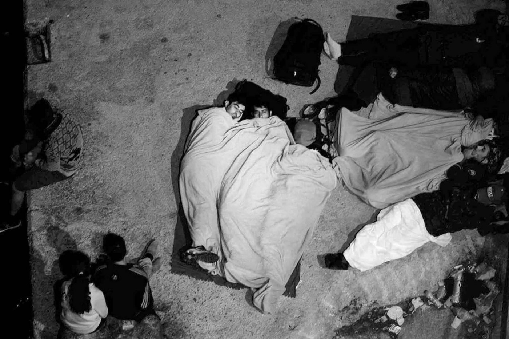
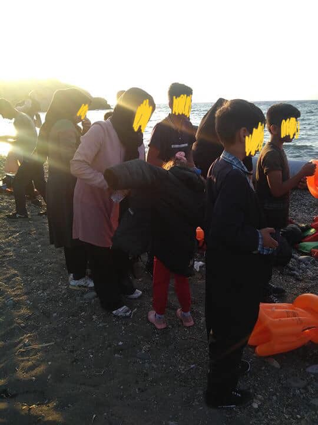
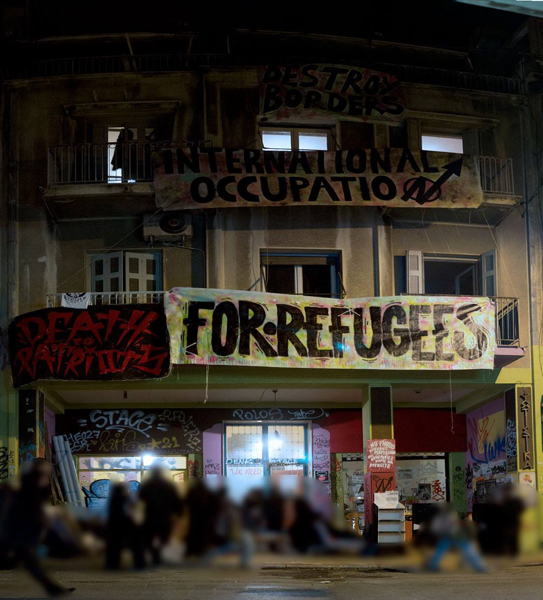
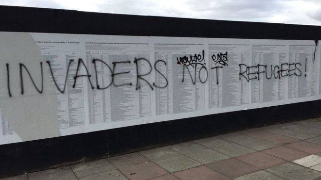

### AYS Weekend Digest 08–09/09/18: UNHCR Finally States the Obvious — Libya is not safe for refugees\!

_Sea Rescues//New Arrivals in Greece//Classes in Athens//Fire on Samos//Czech Vigilantes Boast Police Connections//Spanish investigation re\-opened//Memorial Vandalized in UK//And more…_

People on the move sleeping in the Balkans\. Photo Credit: Gabriel Tizon\.
### Feature

This week, the UNHCR finally called upon the EU to end its practice of returning refugees to Libya\.

There are currently 55,088 registered refugees and asylum\-seekers in the State of Libya, according to newly released figures from the UNHCR\. So far this year, 20,129 people have arrived in Italy from Libya\. While the UNHCR claims to have aided in the release of 1,527 people from the notorious Libyan detention camps, they also continued to cooperate with EU and Italian policies that fund the very groups preying on refugees\. The UNHCR has assisted with the return of refugees to Libya on many occassions\.

As Italian and EU authorities have pursued policies of funding Libyan forces, including the so called Libyan “Coast Guard,” the UNHCR has largely remained silent\. According to the UNHCR’s own report, as of September 6th this year, the Libyan Coast Guard has intercepted and forcibly returned 13,493 people\. During this time, 99 bodies were found in Libyan waters, and a 608 more died at sea\. While the UNHCR called on EU officials to end returns to Libya, they did not address the issue of cooperation with the Libyan Coast Guard\.

In their reports, the UNHCR typically describes people intercepted by the LCG as “rescued”\. It’s worth remembering that the word “rescued” is never appropriate to describe a situation where people are being forcibly taken back to a place where their lives are in danger\.

The UNHCR declared just this week that Libya is not a safe country for returning refugees\. The fact that it even took so long for this declaration is ridiculous, given wide\-spread knowledge of kidnapping and enslavement networks in the country\. UNHCR commisions have authored mutliple reports on the abuse and kidnapping of refugees in Libya, so it’s hard to understand how they could feign ignorance before\.

■■■■■■■■■■■■■■ 
> **[ECRE](https://twitter.com/ecre) @ Twitter Says:** 

> > UNHCR declares Libya unsafe for returns, amid increased violence in the capital
-Via #ECREWeekly [bit.ly/2Nr1YKx](http://bit.ly/2Nr1YKx) https://t.co/KuefqijVtU 

> **Tweeted at [2018-09-08 12:00:00](https://twitter.com/ecre/status/1038396533933256705).** 

■■■■■■■■■■■■■■ 

### Morocco

According to the [Association for Human Rights in Morocco](https://www.facebook.com/AmdhNador/?tn-str=k*F) \(AMDH\), the body of a woman [was found on a beach](https://www.facebook.com/AmdhNador/photos/a.1693125780899690/2183110341901229/?type=3&theater) approximately 60 km from Nador \(a common point of depature for people trying to reach Spain\) \. This is the sixth body that has been found this week\.

At the same time, the human rights group is disputing online rumors that the corpses of 30 refugees were thrown off a ship on the coast of Morocco\. There is no evidence to support the story of bodies being abandoned\.

AMDH also reported on [a series of violent raids](https://www.facebook.com/AmdhNador/posts/2182333381978925) on refugee encampments along the Moroccan coast this week\. Police violence towards refugees has been a longstanding issue in the country, as AMDH has documented\. According to the group, “During the entire campaign to track migrants in Northern Morocco, the auxiliary forces were on the front line in the thousands of registered abusive arrests\. It is they who attack the camps of migrants in the forest and arrest migrants, they are the ones who are kicking the doors of migrant houses and entering illegally inside beat people up and trash everything\.”
### Turkey

**Turkey will not take in any more Syrian refugees** , announced Erdogan on Friday during a meeting with Russian and Iranian officials\. It is unclear how this statement will effect policy, or if it is just another effort to put pressure on EU leaders\.
### Sea

[172 people](https://twitter.com/salvamentogob/status/1038747617851858944) were rescued off 4 boats today by the Spanish SMH rescue group\.
### Greece
#### Islands
#### New Arrivals

210 people arrived on Lesvos today in 6 boats today\. Many of them were children\. The total number of people who arrived on Lesvos this weekend is 341 as of writing\.

People arriving on Lesvos, 09/09/18\.

On Samos, two boats arrived on Saturday, the first carrying 51 people and second 34\. On boat arrives on Kos Saturday morning, carrying 7 people\.
#### Overcrowding on Samos, Volunteers Desperately Needed

The refugee camp on Samos is growing more and more overcrowded each day\. With few transfers being made to the mainland, and many new arrivals in recent weeks, there are now an estimated 3,500 people crammed into the island camp \(which is designed for a maximum of 700\) \. There are an estimated 1,000 people sleeping in the woods outside the camp, and over 100 unaccompanied minors living in the camp\.

For the first time on the island, there are now unaccompanied girls placed in the camp\. They have been given a tent with no lock or extra protection\. How can the UNHCR oversee this kind of treatment? How can the UNHCR call itself a defender of refugees when it abandons children like this?

There was a fire on the island yesterday, and fortunately no one has been reported injured\. However, with most of the camp not being hooked up to electricity, and most people relying on make\-shift wiring, the risk is huge\.

Volunteers on Samos desperately need assistance to continue their projects in and outside the camp\. There are currently only two volunteer groups on Samos, Samos Volunteers, which does adult education, laundry, and provides aid for people in the camp, and Still I Rise, which is a children’s education center\. For reference, the island of Lesvos, while holding approximately 3 times as many refugees, has over 50 volunteer groups\. Follow the link to find out more or volunteer with [Samos Volunteers](https://www.facebook.com/samosvolunteers/?fb_dtsg_ag=AdzP1T3jr_qz4AamtiPZixqpc5JCWUeLbVT6hhk-7Gq7_Q%3AAdxWNVEKWAq0ojG126N2HreB3nom5uTbzItTyzyvXB713g) and [Still I Rise](https://www.facebook.com/stilliriseNGO/?fb_dtsg_ag=AdzP1T3jr_qz4AamtiPZixqpc5JCWUeLbVT6hhk-7Gq7_Q%3AAdxWNVEKWAq0ojG126N2HreB3nom5uTbzItTyzyvXB713g) \.

Four members of the Greece based rescue organization ERCI remain in detention on the island of Lesvos\. Police on the island have accused the group of “corruption” and “money laundering,” claiming that the group “profited off the refugee crisis” through their fundraising efforts\. What is missing from these accusations is any piece of evidence\. While ERCI certainly has fund raised for their life\-saving operations in Greece, authorities have not submitted anything to indicate that these funds were misused\. Based on the accusations and lack of evidence in this case, it seems likely that these charges are merely another attempt to bully volunteers into silence and inaction\. Our answer to these efforts has and will always be a unified NO\! AYS stands in solidarity with ERCI, and against the criminalization of volunteers and refugees in Europe\.

The Attika Human Support group on Lesvos is looking for funds and material donations to support their work, you can find out more [here](https://www.attikahumansupport.org/donate) \.

A [Drop in the Ocean](https://www.facebook.com/drapenihavet/videos/308022029948208/) , working on Lesvos, is looking for volunteers\. Sign up on our website \( [www\.drapenihavet\.no/locations](http://www.drapenihavet.no/locations) \) or email us at frivillig@drapenihavet\.no
#### Mainland
#### “They kidnapped us, burned our papers and turned us back”

Refugees are being [illegally detained](http://www.efsyn.gr/arthro/mas-apigagan-mas-ekapsan-ta-hartia-kai-mas-gyrisan-piso) by Greek police along the Greek\-Turkish border in the Evros region, according to a new report by the Hellenic Council for Refugees\. People interviewed described being held in tiny holding cells, where they had their possessions stolen and burned\. Refugees who were detained were then forced back into Turkey, without being able to file for asylum as they are legally entitled\. From Turkey it is widely known that some people are then illegally deported back into Syria\.

There are free English classes being offered at Kondrigktonos 61 at 5 pm, near Victoria Square in Athens\. There will also be free meals offered every Monday, Thursday, and Saturday at the same location\.

“The Themistokleous 58 squat in Exarchia is a refugee run project organised around the principle of direct democracy\. Anyone is welcome to volunteer or teach a skill\. Just turn up and ask for Samir\!”
### Spain
#### Investigation into deaths of 14 refugees re\-opened

For the second time, an investigation into the deaths of 14 people who tried to cross into the Spanish enclave of Ceuta has been re\-opened by a Spanish court\. The incident occured when a group of 400 people tried to swim around border fences on the coast of Ceuta\. Spanish border police began firing rubber bullets and tear gas at the people, killing 14 of them and injuring many more\. The judge in this most recent ruling announced that in the prior decision, the court did not have “the slightest interest” in listening to the testimony of refugee victims\. For the first time in this case the testimony of the survivors will be heard\.
### Croatia

Italian lawmaker Elly Schlein continued her push this week to investigate violence on the Croatian\-Bosnian border, and how EU funding is being used there\. In the past few days, and additional 21 EU parliamentarians have signed onto her official question to the EU commission\.
### Czech Republic / Slovakia
#### Right\-Wing Vigilantes Connected to the Police

Following the attacks of violent anti\-refugee mobs in Germany in the past weeks, there have been alarming reports of a rise of right\-wing vigilante groups in the Czech Republic and Slovakia\.

The Czech internal security services have raised concerns about a group calling itself the national home guard, which encourages violence against migrants and currently boasts over 9,000 members in the country\. According to reports from Czech security forces, the group has links to many politicians and local police forces\.
### France

Life remains difficult for refugees in the French capital\. As AYS has reported in the past month, it is common practice for authorities to steal the sleeping bags and possessions of those on the street\. Independent volunteer Lola Siran provided a [brief update](https://twitter.com/salvamentogob/status/1038747617851858944) today on a group of refugees sleeping off of a highway in Paris:

> Dozens and dozens of people sleeping — or trying to — between live, loud music and busy highway\. 

> People living there told me they were exhausted as they’re only managing to sleep two or three hours every night, the music being live until 2/3am and the police coming to wake them up around 6\. 

> The tents we gave out 10 days ago have been confiscated by the police this week, leaving people sleeping on the bare floor\. 

> Today two men asked me how they could go back to their country of origin — where they’d almost certainly be sent to prison & tortured or killed — and said they’d rather die at home than survive in these conditions\. 

### UK
#### Refugee Memorial Vandalized

Photo Credit: Shafique Azam

In Liverpool, a memorial that commemorates 34,361 Refugees who died trying to reach Europe since 1993 has been vandalized\. An unknown coward spray painted the words “Invaders Not Refugees” on the list of the dead\.

**We strive to echo correct news from the ground through collaboration and fairness\.**

**Every effort has been made to credit organizations and individuals with regard to the supply of information, video, and photo material \(in cases where the source wanted to be accredited\) \. Please notify us regarding corrections\.**

**If there’s anything you want to share or comment, contact us through Facebook or write to: areyousyrious@gmail\.com**

_Converted [Medium Post](https://medium.com/are-you-syrious/ays-weekend-digest-08-09-09-18-unhcr-finally-states-the-obvious-libya-is-not-safe-for-refugees-ba86caea16e1) by [ZMediumToMarkdown](https://github.com/ZhgChgLi/ZMediumToMarkdown)._
