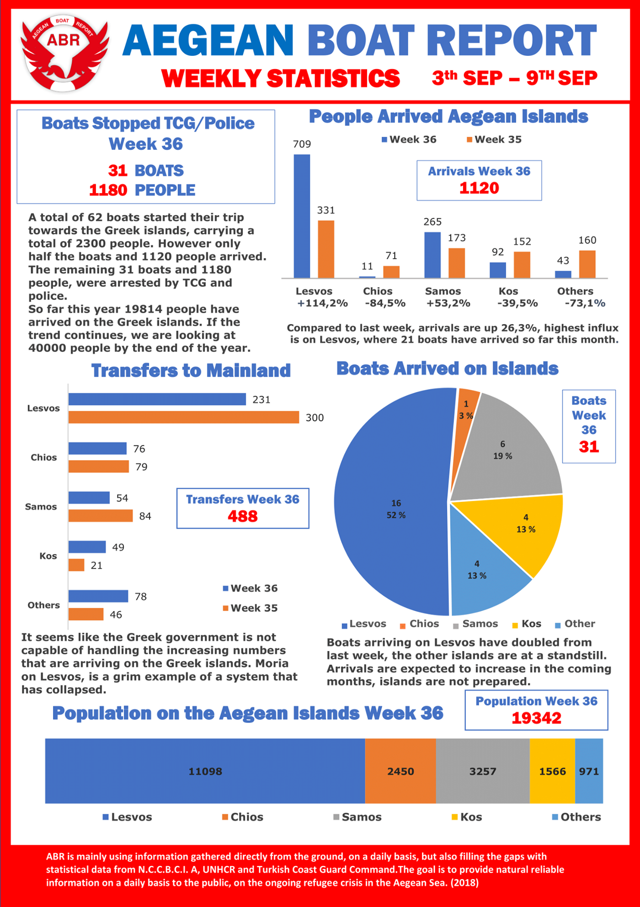
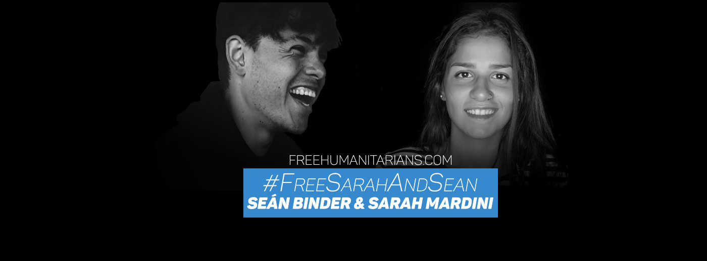

### AYS DAILY DIGEST 10/9/2018: The end of Moria?

_Where will all the people from Moria go? // What will happen with camps in Chios and Samos? // ‘Cruel and unlawful treatment of people on the move stranded in Morocco // Call to stop deportations from Lesvos, Denmark, The Netherlands // UNHCR claims Kabul cannot be considered as a safe place for people to be sent back// More about elections in Sweden, the situation in Slovenia, Turkey, Morocco…_

](assets/4c58607d53e5/1*WZ3K9JlI3_s665u1eTIYDw.jpeg)

“Why does overcrowding in Moria make people feel unsafe? Because they have to queue for hours to get food, often getting pushed or harassed while waiting\. Sometimes the portions do not suffice and they go hungry\. Some end up cooking outdoors, under unsafe conditions\.” By Martha Roussou [@smarta12345](http://twitter.com/smarta12345)
### Feature

“ **The Regional Authority of the Northern Aegean has given the Ministry of Migration Policy 30 days to clean up the overcrowded Moria hot spot for migrants and refugees on the island of Lesvos, or face closure** ,” the Greek [media are reporting](http://www.ekathimerini.com/232471/article/ekathimerini/news/moria-migrant-camp-faces-closure-over-living-conditions) \.

This announcement was issued after the health inspection visited the hot spot on Lesvos, and concluded that the place is not suitable for living\. Moreover, they consider Moria to be “dangerous for public health and the environment”\.

The health inspectorate concluded that there is “an uncontrolled wastewater spill at the entrance to the camp, which flows into an adjacent stream or even onto the road”\. Additionally, in another section of the camp, “toilet waste pipes are broken, resulting in a strong stench and creating a danger to public health”\.

This report came the week after the BBC reportage which describes Moria as “ [The worst refugee camp on earth](https://www.youtube.com/watch?v=8v-OHi3iGQI.) ”\.

Previously, on several occasions, Médecins Sans Frontières \(MSF\) warned about the “ [mental health emergency](https://www.msf.org/greece-eu-border-policies-fuel-mental-health-crisis-asylum-seekers) ” on the Greek islands, saying that this year the situation has deteriorated even further\. Last winter, at least six people died in Moria because of the terrible living conditions\.

Since 2015, AYS has published a n [umber of reports](https://medium.com/search?q=Lesvos) warning about the alarming situation on Lesvos, including the special “F [or some people Lesvos is all they will ever know of Europe”](ays-special-for-some-people-lesvos-is-all-they-will-ever-know-of-europe-186c96f8ffd1) , which warned about the effects of life in Moria on people\.

If the Ministry does not find a way to fix all the problems, north Aegean Regional Governor Christiana Kalogirou warned, the hot spot will have to close\.

So far, nobody has mentioned what will happen with the people who are living in Moria if the camp is closed\. Especially, having in mind that once again, available accommodation on the mainland is scarce\. Part of the answer can be found in the announcement from the Ministry of Migration\. They said that by the end of September, efforts will be made to reduce the number of people on the islands from over 17\.000 to below 10,000\. The existing accommodation is designed to hold a maximum of 7,000\.

The media are also [reporting](http://www.ekathimerini.com/.../plans-to-move-more...) that the Ministry is planning to create an additional 5,500 places on the mainland, including about 2,000 for people from Moria\.

However, it is well known that even on the mainland, the capacities are limited\. At the moment, about 45,000 people are on the mainland, while it is estimated that over 63,000 people on the move are in Greece in total\. Over the last couple of months the Greek government has reopened many of the camps, and in order to accommodate all the people, they will have to open more places\. However, as in 2015 and 2016, the camps are not equipped and made in a way to make people feel safe and to have a dignified life there\.

A second option, and most probably the only for many, is to leave Greece and continue along the Balkan route towards the EU\. However, the winter will make this journey extremely difficult and put many people in danger of their lives, only to find closed EU borders\.

The decision to decongest the islands could also mean that more people will be deported back\. [Legal Center Lesbos](http://www.legalcentrelesbos.org/2018/09/07/detention-monitoring-aegean-and-legal-centre-lesbos-publish-joint-report/) in their last report points out that at least 2,224 people have been deported to Turkey since the implementation of the EU\-Turkey deal on 20th of March 2016\.

“The EU\-Turkey Deal has transformed the Greek Islands with the European hotspot camps into open\-air prisons\. In these desperate conditions, a rising number of people agree to “voluntary return” back to their home country\. After signing the return agreement with the International Organization for Migration \(IOM\), the individuals are normally arrested and brought in handcuffs to a pre\-removal centre where they have to wait for up to several months to be deported\. Between June 2016 and April 2018 more than 10,000 persons have been returned from Greece to their place of origin \(regardless of the safety of the country\), through the voluntary return programme funded by the EU and Greece”\.

It remains to be seen if the Greek government will do something to improve conditions in Moria, or if the place will be closed\.
### Morroco

**Amnesty International has issued a statement saying that the authorities treatment of thousands of sub\-Saharan migrants and refugees is ‘’cruel and unlawful’’\.**

This [statement](https://www.amnesty.org/en/latest/news/2018/09/morocco-relentless-crackdown-on-thousands-of-sub-saharan-migrants-and-refugees-is-unlawful/) came after over one month of police raids and arrests in the provinces of Tangiers, Nadot and Tetuan which AI describes as a “shocking crackdown on migrants and refugees”\.

An estimated 5,000 people have been swept up in the raids since July, piled on to buses and abandoned in remote areas close to the Algerian border or in the south of the country, according to the Moroccan Association for Human Rights \(AMDH\) \.
### Libya

The UN issued a [statement](https://news.un.org/en/story/2018/09/1018801) saying that “reliable sources and refugees have reported criminals using vests and other items with logos similar to that of UNHCR, at disembarkation points and smuggling hubs”\.

The UNHCR, which observes the situation in Libyan detention centres, claims that their staff do not engage in the transfer of refugees from disembarkation points to detention centres\.
### **Turkey**

On Monday, the [UNHCR stopped registration](https://www.asylumineurope.org/news/08-09-2018/turkey-unhcr-ends-registration-non-syrian-asylum-seekers) activities for applicants for international protection as part of the transition of refugee status determination responsibility to the Turkish Directorate General for Migration Management \(DGMM\) \.

The UNHCR was responsible for the registration of people from countries other than Syria\. A total of 199,718 asylum seekers were registered with UNHCR from January to July 2018\.

Applications for international protection will now be directly registered with the government, as is the case for Syrian refugees\.
### Greece

A boat landed on Lesvos carrying 20 people, including seven children\.

In [a joint letter](https://weareawelcomingeurope.eu/en/) , the European civil society organizations call on the Greek authorities to release Sarah Mardini and Seán Binder while their trial is pending\.

_“European civil society actors have continuously opposed the intimidation and punishment of volunteers and non\-governmental organisations\. State practices that criminalise EU citizens for their solidarity with migrants and refugees are intolerable and risk our fundamental European values of justice and human rights\. The charges against Sarah and Seán occur in a broader context of a pan\-European trend towards criminalising solidarity\. As part of the \#WelcomingEurope European Citizens’ Initiative, hundreds of civil society organisations and thousands of European citizens are fighting back against these restrictive policies that have created a hostile environment for people who help refugees and migrants\. Through this official EU tool, 1 million signatures from European citizens have the power to get the European Commission to comply with our joint\-demand: end the criminalisation of solidarity acts across Europe\.”_

If you are citizens of the EU, you can sign the letter\.

[Hestia Hellas’s SEED](http://site.coord@hestiahellas.org) \(Sustainable Entrepreneurship for Empowerment and Development\) Business Course is back\!

This is a 12\-week long course for both refugees and Greeks to learn how to run their own business in Athens\. The course covers business plans, marketing strategy, social media, procurement, taxes and licenses in Greece, and more\!

SEED will be taught in English, with Arabic, Farsi, French, and Greek interpretation provided if needed\.

BABY YOGA TRAINING

AMURTEL is hosting Birthlight Trust for a baby yoga training for refugee and migrant women\.

The course is certified and normally has a cost of 300 euros but it will be offered to all the participants — which is a great opportunity\!

You can get more information by contacting: 2111848436 or [andreia\.gr@amurtel\.org](mailto:andreia.gr@amurtel.org) 
[https://www\.birthlight\.com/](https://www.birthlight.com/)

OINOFYTA COMMUNITY CENTRE NEEDS VOLUNTEERS

They are urgently in need of volunteers for their Community Center, starting IMMEDIATELY\! \!

If you are interested, please email [DYPLisa@gmail\.com](mailto:DYPLisa@gmail.com) with a copy of your CV and the dates you are available\.’
### Slovenia

**In July 2018, two Slovenian non\-governmental organisations released reports, based on almost 100 interviews with refugees in Bosnia and Herzegovina, describing the systematic practice of push\-backs in Slovenia\.** This has been followed up by various national and international newspapers, and Slovenian Human Rights Ombudsman and UNHCR also decided to look into the matter\. Yet instead of investigating these practices which are illegal under international law, the outgoing Slovenian Minister of the Interior, Vesna Györkös Žnidar, [has accused an NGO](http://www.rtvslo.si/slovenija/nevladniki-prebeznikom-pomagajo-sele-ko-pridejo-na-slovensko-ozemlje/465452) working with asylum seekers of questionable pressure on the police and even of assistance in crossing the border\. These efforts to discredit and even criminalize the activities of an organization working with asylum seekers are a dangerous move in the Slovenian political arena, aligning with the growing EU practice of criminalization of civil society and of their struggle for justice and solidarity\. The organization has immediately [responded](http://pic.si/sporocilo-za-javnost/) to the accusations, emphasizing their mandate and the legal framework of their activities\. Most of the media have, unfortunately, failed to critically report on these events\. By focusing solely on the minister’s accusations and completely avoiding the question of illegal push\-backs which took place under the outgoing minister, the media played a role in further discrediting the organization among the public\.
### The Netherlands

**On Wednesday, a mother and her three children — Mohamad, Mehdi and Sadjad — who have lived in the Netherlands for 9 years, are due to be deported from Amsterdam to Afghanistan\.**

[Activists are calling](https://www.facebook.com/…/a.20407109692…/2040710619283412/…) on everybody to contact KLM to stop the deportation\. The flight is at 14\.25 from Amsterdam Schiphol, flight KL 427\.

This deportation comes several days after the UNHCR issued Eligibility Guidelines for assessing the international protection needs of Afghan asylum seekers, indicating the heightened security risks in Kabul, and concluding that it cannot be considered as a safe alternative any longer\.
### Belgium

An interesting initiative in Belgium called RWAN\. Its mission is to help refugee and immigrant women get a professional opportunity\.

[RWAN initiative](http://www.youtube.com/watch?v=oeka1m_ZZNo)
### Sweden

**In the Sunday election, the two major blocks — Social Democrats and Moderaterna \(conservative/liberal\) — got 40,6 and 40,4 per cent of the votes each\.**

Additionally, the Sweden Democrats got 17,6 per cent, and are the third biggest party in Sweden after Moderaterna got 23,3 per cent\. The Social Democrats got 28,4 per cent alone\. The votes from abroad as well as some votes that came in advance are still to be counted, so the outcome is not 100 per cent certain yet\.

According to several sources, it can take weeks before a new government can take form\. It is not clear whether or not the new PM and government will be a Moderat \(Ulf Kristiansson\) or a Social Democrat \(Stefan Löven\) \. Theories and scenarios about what will happen next are fluctuating in the media, as the Sweden Democrats say that they will not approve any government that refuses to give them any influence\. Given the fact that they are so big, this causes problems\.

Regardless, the political landscape will be changed, as the former “bloc politics” won’t work out anymore\. It is not precluded, but rather more likely, that the new government will work across the previous agreements and divisions\. The time\-frame for suggesting a budget has been prolonged, due to the results after the election\.

How big an influence the Sweden Democrats will get, and if Moderaterna could decide to form a government with SD, is not yet clear\. But if they do so, the government will not need to take the Social Democrats and its allies as seriously since they will have a majority\. It is, though, highly unlikely that Centerpartiet \(centre/liberal\) would agree to that, as they have been working hard on a less strict migration policy over the past years\.

In a think piece published on Saturday, written by the freelance journalist Tommy Svensson, he wrote that the Swedish election is important in a European context\. Right\-wing parties are growing, and with the potential help of the bourgeois parties, the right\-wing party in Sweden could gain more impact than it had in the previous term\. With EP elections coming up in six months, the politics and pitch in Sweden could affect the situation not only within its own borders but also in the greater European perspective where right\-wingers have become more and more accepted, country by country\. Often in the name of democracy and freedom of speech\.
### Denmark

**According to the Danish Minister of Immigration and Integration, Inger Støjberg, the Danish deportation centres Sjælsmark and Kærshovedgård, inaugurated in 2015 and 2016 respectively, are set up to ‘make life intolerable’ for those rejected asylum\-seekers who cannot immediately be detained or deported, thereby pressuring them into leaving Denmark ‘voluntarily’\.**

As part of the motivation enhancement measures introduced into the Danish Aliens Act in 1997, the centres are part of the government’s recent efforts to boost deportation rates, by confining asylum seekers in geographically isolated ‘open’ institutions with low living standards and minimum welfare provisions\. Residents are not detained in a strictly legal sense, but their duty to reside and regularly register in the centres make them resemble de facto confinement\. The motivation enhancement measures have pushed rejected asylum seekers into illegality, while others remain stuck and de facto confined in deportation centres for a potentially indefinite time period\.

Consequently, these legal measures have not fulfilled their official function\. Both Amnesty International and the Danish Helsinki Committee have warned that conditions in deportation centres are ‘worse than prisons’\. Lawyers and human rights experts have pointed out that practices concerning rejected asylum seekers risk undermining the judicial system in Denmark\. Residents confirm that the low standards of the centres will not make them go back to their countries of origin: some of them for fear of returning, while others are not accepted back by their country of citizenship and/or are de facto stateless\. Instead, residents report that the deportation centres are “killing them slowly”\.

‘ _Stop Killing Us Slowly_ ’ is the title of the report by the Freedom of Movements Research Collective, an initiative to address the need for systematized research\-based information regarding deportation centres\. It is the first systematic investigation of the setup of the deportation centres and their observable effects\. The report has been prepared at the request of, amongst others, Danish journalists who have identified a need for empirical research detailing and explaining the problems surrounding rejected asylum seekers and people who become ‘legally stranded’ in the Danish deportation centres\.

The report gives an overview of the setup of the deportation centres and offers an interpretation regarding the discrepancy between their intended and real effects\. It concludes:
1. The deportation centres in particular, and the motivation enhancement measures, in general, do not fulfil their declared function of increasing ‘voluntary’ returns, nor do they address the issue of migrants who are legally stranded for lengthy periods of time with very circumscribed rights\.

2\. The legal frameworks regulating detention or prisons in Denmark \(i\.e\. time limits, access to legal advice, rights guarantees\) do not apply to deportation centres\. Deportation centres, therefore, are comparable to indefinite detention\.

3\. The deportation centres result in the drastic deterioration of the mental and physical health of the men, women, and children accommodated there\.
The political framework, the juridical setup and the daily rules and practices in deportation centres contribute to the criminalization of migrants and refugees\.

4\. By running these practices in a legal grey zone, the Danish government circumvents — and overtly breaches — human rights regulations, at the same time locking residents into a situation with very limited possibilities to contest these conditions and claim their human rights\.

5\. While failing to achieve their stated goals, the motivation enhancement measures and the deportation centres do achieve making peoples’ lives intolerable: they break people’s spirits and minds and force them to live a life in illegality, outside of the justice\- and rights system\.

6\. The findings of the report mirror conclusions from European research on the so\-called ‘deportation gap’, which shows that repressive policies are counter\-productive, harmful for those targeted, financially costly, and contribute to the opening up of ‘legal grey zones’ where human rights no longer apply\.

**We strive to echo correct news from the ground through collaboration and fairness\.**

**Every effort has been made to credit organizations and individuals with regard to the supply of information, video, and photo material \(in cases where the source wanted to be accredited\) \. Please notify us regarding corrections\.**

**If there’s anything you want to share or comment, contact us through Facebook or write to: areyousyrious@gmail\.com**

_Converted [Medium Post](https://medium.com/are-you-syrious/ays-daily-digest-10-9-2018-the-end-of-moria-4c58607d53e5) by [ZMediumToMarkdown](https://github.com/ZhgChgLi/ZMediumToMarkdown)._
