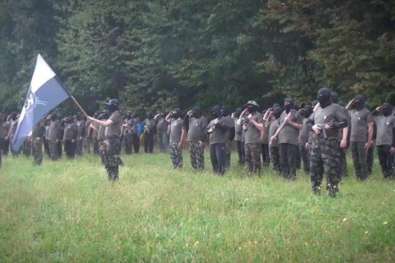

### AYS DAILY DIGEST 11/09/18: Human rights violations across Europe, strongly worded statements, and little tangible action

_UN High Commissioner speaks out against human rights abuses in Italy // Death at sea, with no more witnesses // Protests in Malta as Sea Watch 3 enters its 3rd month of involuntary confinement to port // “Tomorrow, tomorrow” // Majority of migrants now entering Europe through Spain // Far right militias in Slovenia // Returning to Calais for Ethiopian New Year // Demonstrations against rescue boat ban in Amsterdam and beyond //_
### **Feature**

The newly appointed UN high commissioner for human rights , Michele Bachelet, announced that she has dispatched investigators to Italy in the wake of shocking reports of crimes targeting migrants, which come amidst a climate of state\-sanctioned and inflammatory xenophobic rhetoric\. T [he Guardian](https://www.theguardian.com/world/2018/sep/10/un-human-rights-chief-sends-team-to-italy-after-alarming-anti-migrant-violence) reports that 14 shootings, 56 assaults, and two murders motivated by anti\-immigrant sentiment have been recorded in Italy in the three\-month period since the far\-right interior minister Matteo Salvini came to power\. In her inaugural [speech](https://www.youtube.com/watch?v=TjgnpU5AuwQ) before the Human Rights Council, the former Chilean president also rebuked Italy for its decision to close its ports to rescue boats carrying asylum seekers, with deadly consequences\.

Salvini, unsurprisingly, rejected Bachelet’s condemnation, retorting: “They \(the UN\) should first focus on other members where fundamental human rights are being violated every day\.”
### The interior minister is right about one thing: human rights violations and abuses targeting migrants occur every day, in every European country\. In France, where police steal children’s shoes and pour water on their blankets to keep them from being able to sleep\. **In Hungary, where asylum seekers whose claims are deemed ‘inadmissible’ are denied food\.** At [Greece’s](ays-special-violent-robberies-and-deportations-of-refugees-in-greeces-evros-region-2056ba6195b0) northern border with Turkey, where people have been robbed, beaten, raped, and humiliated by police as they attempt to enter the country\. I **n Bosnia, Greece, Slovenia, Poland, Croatia, and beyond, where violent and illegal pushbacks are the norm\.**

These abuses are not met with total silence, as evidenced by Bachelet’s speech\. Yesterday, too, UN Human Rights Special Rapporteurs issued another “strongly\-worded statement” concerning the treatment of asylum seekers in Hungary\. The statement can be read in full [here](https://www.ohchr.org/EN/NewsEvents/Pages/DisplayNews.aspx?NewsID=22765) \. But Bachelet’s promise to send investigators was vague, and the Rapporteurs’ statement is just more of the same\.

“The voice of the office of the high commissioner is powerful in its authority, legitimacy, and objectivity,” said Bachelet in her speech\. But the asylum seekers, both those already present in Europe and those at its borders, deserve more than a voice — more than just righteous statements and verbal condemnations of the abuses they face\. It’s clear that both Europe’s leaders and those tasked with enforcing its policies at its borders can dismiss the rebukes they receive from international human rights watchdogs, however “strongly worded” those rebukes may be\. As Salvini has proven, it’s easy enough to brush off blame, or, better yet, to assign it elsewhere\. After all, no one’s hands are clean\.
### Morocco

■■■■■■■■■■■■■■ 
> **[Helena Maleno Garzón](https://twitter.com/HelenaMaleno) @ Twitter Says:** 

> > Los cadáveres de dos mujeres y una niña ahogadas en el Mar de Alboran llegaron ayer a  la morgue del hospital de Nador. Con inmenso dolor seguimos sumando víctimas de las políticas de control fronterizo.
#DEP
Foto: AMDH Nador https://t.co/02wQbPdxgO 

> **Tweeted at [2018-09-11 10:18:59](https://twitter.com/helenamaleno/status/1039458274704285696).** 

■■■■■■■■■■■■■■ 

The bodies of two women and one girl who drowned in the Alboran sea arrived at the hospital morgue in Nador on the northeastern coast of Morocco, more victims of border control policy, writes Helena Maleno Garzón\. The bodies of three men were also recovered, according to the [Moroccan Association for Human Rights in Nado](https://www.facebook.com/AmdhNador/?hc_ref=ARTWi4HC0j_GJegy90kDeHE0ruWOiebAyjO8U3eyfItew7QjSV_XV576lo33BnLHStI&fref=nf&__xts__[0]=68.ARBCq_JMQtitcMool0Lf9ZyBpUl1tKsYgVtTVwclOp6IL_N8tZ6Aki3ROIvCHp4mJdruo1rsxbu-rondyAO5Qg0w3XnxVsjPSFkJ_pDNJY44ied3iRTAc_qBEwVVfOYWKRECG3Uo1eMLiEZ8vUO53cmk6S52Ajire4rOgykOekhig-iCkC80Ww&__tn__=kC-R) r \(AMDH\) \.
### Sea

MSF reports that at least 100 people died in a double shipwreck on September 1st, including over 20 children\. Among the survivors are a number of people with extensive chemical burns sustained during the wreck\. After this singularly traumatizing event, those aboard find themselves back in the very place they risked their lives to flee\. MSF treated “sick and traumatized” patients in Khoms, some of whom had already been recognized by the UNHCR in Libya\. Met with no change to their situation after several months, they decided to take to the sea\.

As SOS Mediterranée noted on Twitter, Italy’s recent ban on rescue boats docking at its ports means that there are few remaining independent observers on the sea to bear witness to these tragedies, or attempt to prevent them\.

■■■■■■■■■■■■■■ 
> **[SOS MEDITERRANEE](https://twitter.com/SOSMedIntl) @ Twitter Says:** 

> > 🔴Horrific news reported by #MSF staff in Libya: 100+ people would have died in a shipwreck off #Libya on the 1st of Sept. No NGO ships at the moment in the central #Mediterranean = less rescue means &amp; no testimonies, while people continue fleeing from the Libyan hell by the sea. 

> **Tweeted at [2018-09-11 13:40:31](https://twitter.com/sosmedintl/status/1039508992387497985).** 

■■■■■■■■■■■■■■ 

### Malta

**“This is a conscious attempt to hinder the rescue of people in distress on the Central Mediterranean\.”** The German NGO Seawatch published a [letter](https://sea-watch.org/en/mr-muscat-show-responsibility-and-release-our-ship/) to the Maltese prime minister, Joseph Muscat, denouncing his government’s detention of the organization’s ship, Sea Watch 3\. For 70 days now, the ship has not been allowed to leave port, despite passing every safety inspection it has undergone\.

> For every preventable death that occurs at sea, your government has direct responsibility, which it shall acknowledge and rectify…Sea\-Watch publicly demands for the immediate release of its vessel and asks you to allow the Port authority to grant permission to the Sea\-Watch 3 to leave the port of Valletta to restore its operations\. Your political pressure and power plays cost lives of some of the most vulnerable people in the world today\. 

Lifeline posted a brief [video](https://www.facebook.com/seenotrettung/videos/552459685185175/?fref=gs&dti=1652972374920129&hc_location=group&fb_dtsg_ag=AdwL734KypW2K5s6l-AKh1ifvVEI2pRADnZf0frJKjm7aA%3AAdxRzai4Zp6AuRBP8c7naiCMiFgNHiWxK6RfSZgdjgNNyw) of the protests on the group’s facebook page\. In the video, protestors walk slowly and deliberately through the streets of Valletta, Malta’s capital city, some with their hands painted red and raised in shackles\. Images of Muscat, Angela Merkel, and Mateo Salvini cover their faces, a symbolic judgment of EU leaders’ complicity in the deaths of countless asylum seekers in the Mediterranean and beyond\.

 \. Photo by Nick Jaussi\.](assets/ece45c902745/1*2-Zy91s66czCBY8yUPuR5A.jpeg)

A protestor holds a mask of Italian Interior Minister Mateo Salvini in Valletta, Malta\. Credit: [Lifeline](https://www.facebook.com/seenotrettung/photos/a.113123962427485/451448551928356/?type=3&theater&ifg=1) \. Photo by Nick Jaussi\.

■■■■■■■■■■■■■■ 
> **[MISSION LIFELINE](https://twitter.com/SEENOTRETTUNG) @ Twitter Says:** 

> > Wir bringen jetzt Salvini, Kurz, Muscat, Orban, Merkel und Seehofer zum Gericht. Die Verhandlung beginnt in ca. 30 Minuten https://t.co/HUVASiX6Tp 

> **Tweeted at [2018-09-11 08:34:32](https://twitter.com/seenotrettung/status/1039431989760278528).** 

■■■■■■■■■■■■■■ 

They [tweeted](https://twitter.com/SEENOTRETTUNG/status/1039431989760278528) : “We are bringing Salvini, Kurz, Muscat, Orban, Merkel, and Seehofer to court\. The trial starts in about 30 minutes\.”
### Greece

**Islands:**

[Aegean Boat Report](https://www.facebook.com/AegeanBoatReport/posts/444592542730522?hc_location=ufi) : Two boats landed on the shores of Lesvos this morning, carrying over 100 people\.

The Greek government released its latest u [pdate](https://www.facebook.com/AegeanBoatReport/photos/a.285312485325196/444589002730876/?type=3&hc_location=ufi) on the situation on the islands, making it clear just how drastically over capacity each and every hotspot is\. Notably, Samos is _six times over capacity\._

](assets/ece45c902745/1*3bDR58ld4gqbr2QD7-hOVg.jpeg)

Seriously overcrowded hotspots: the island camp’s numbers vs\. their capacity\. Source: [Refugee Support Aegean](https://twitter.com/rspaegean)

Volunteer Jacob Warn [reflects](https://www.crossingstrings.co.uk/single-post/2018/09/09/Treatment-of-the-Refugee-Community-Chios-Summer-2018) on his return to Chios and the Vial hotspot there\. He writes eloquently about the way that staff exacerbate the sense of uncertainty and endless limbo that residents of Vial find themselves in:

> A source of great anger to me has been two conversations with staff: one from the former **Norwegian Refugee Council** and one who operates logistics at **First Reception** , responsible for managing Vial Camp\. Both told me in comic and amused terms how their ‘only Arabic’ was _bukhra_ \.’Bukhra, bukhra, bukhra’, they laughed as they explain that this was the most essential word needed to deal with refugees\. ‘Bukhra’ means tomorrow, and its use — related to me as if a joke — by staff responsible for the health and dignity of refugees is indicative of the general treatment of refugees by staff\. 

> There is indifference, apathy and a startling lack of empathy shown by staff and authorities\. Refugees and asylum\-seekers — those most worthy of our kindness, empathy, respect and time — are instead treated homogeneously, casually, and manipulated by use of unclear language and delaying tactics\. 

**Mainland:**

New [information](https://www.facebook.com/mobileinfoteam/photos/a.1800063030222418/2275504682678248/?type=3) about family reunification transfers from Mobile Info Team, as flights resume after the August break\. MIT has ordered and posted the list of asylum seekers who will be informed about their family reunification transfer on their [website](https://www.mobileinfoteam.org/list-dublin-transfer) \. Important: if your phone number has changed, you need to contact the asylum service with your updated contact information so that they will be able to reach you\.

A new [report](https://data2.unhcr.org/en/documents/details/65485) on returns from Greece to Turkey within the mandate of the EU\-Turkey deal reveals that the preponderance of people returned to Turkey are Pakistani nationals, 39 percent of the total\. This is unsurprising considering that Pakistani people are generally treated as “economic migrants” rather than people deserving of asylum\. In Greece, there are a number of structural barriers in place preventing Pakistanis from exercising their right to request asylum, and they are rejected at much higher rates than other nations once they do finally succeed at putting forth a claim\.

**Help needed:**

Mobile Info Team in Thessaloniki is [looking](https://www.facebook.com/groups/infopointfornortherngreecevolunteers/permalink/726051184407844/?hc_location=ufi) for volunteers with experience in legal and asylum counseling to join its team for a minimum of 3 months\. Send your CV and a short motivation letter to contact@mobileinfoteam\.org\.

Irida Women’s center is [looking](https://www.facebook.com/IridaWomensCentre/posts/756410718028025?hc_location=ufi) for a female English teacher to join the center, ideally for at least 3 months\. Email info@intervolvegr\.com for more information\.

[Support](https://www.facebook.com/ourhousegr/posts/2139429319642236?hc_location=ufi) needed at Oinofyta Camp in Northern Greece\. AYS [reported](ays-special-oinofyta-camp-the-overwhelming-sense-of-nothingness-c37d4037a65) on the camp’s hasty reopening and its utter lack of services earlier this year\.
### Spain

The majority of migrants arriving on European shores are now coming through Spain, IOM finds\. Over 71,000 have now arrived by sea this year; at least 1,565 more perished in the Mediterranean in the attempt\.
### Italy

New [data](https://data2.unhcr.org/en/documents/details/65481) from the UNHCR about arrivals to Italy this week\.
### Slovenia

A paramilitary unit of fascists who aim to “protect the border” from migrants\. Credit: Katja Lihtenvalner

A judge ruled to release a fascist militant who had been imprisoned for forming a paramilitary border control unit armed with axes and Kalashnikov rifles\. The images are both chilling and ridiculous: what exactly are these people so afraid of that they need machine guns and combat gear to face it?
### Serbia

The Spanish organization has been working with a children’s squat in the forests of Subotica\. For the past two weeks they have been installing showers and providing potable water\. They are looking for donations in order to be able to keep providing food during the weeks to come; they hope to be able to organize a movie afternoon with popcorn sometime next week\.

 \.](assets/ece45c902745/1*Y7dfCj4AJVpmF-CCrd9Xtg.jpeg)

Credit: [Escuela con Alma](https://www.facebook.com/escuelaconalma/posts/1821432667946330) \.
### FRANCE

**People are already coming back to the Dunkirk Jungle\.** The camp was evicted less than a week ago, and already the French government’s chosen strategy of eviction has proven, once again, to be astonishingly shortsighted\. In response, the mayor of Grande\-Synthe has written to the French prime minister demanding that a large number of accommodation centers be opened in the region before winter — or else he threatens to reopen La Linière, the official camp in the Dunkirk region, which was destroyed by fire in 2017\. He [said](https://www.francebleu.fr/infos/politique/pour-les-migrants-le-maire-de-grande-synthe-demande-des-lieux-de-repit-a-l-etat-sinon-il-rouvrira-la-1535991815) that reopening the camp would be “one solution — certainly not the one I recommend\. **To create a camp is not a solution — but we had to respond to a humanitarian crisis\.** But given the time that has passed since the problem began, I believe that this can no longer be seen as a crisis — rather, it should be a substantive policy, implemented by the state\.”

Injera for Ethiopian \+ Eritrean new year\. Credit: Faces before Numbers\.

[Testimony](https://www.facebook.com/FacesBeforeNumbers/posts/522409374897056?hc_location=ufi) from a former Calais volunteer who returned to celebrate the Ethiopian and Eritrean new year with her friends there:

> Despite today being a celebration day, many of the guys said that they felt more stress today than the others as it just reminded them of the family they’re missing and how difficult their living conditions currently are\. 

> Amongst the usual police violence stories — people beaten as soon as no one else is around, phones smashed, people being thrown in the nettles, tents being confiscated or slashed — a young man said that Calais was even worse than Libya\. He explained that ‘in Libya we know there’s no president and no democracy\. There is no law\. But France has a president and it’s a democracy\. So how are we treated like this? I never imagined Europe this way\.’ 

> Hoping next year these guys will be able to celebrate the new year in a safe and warm place, surrounded by friends and family\. 

### Belgium

Another migrant was killed in a collision with a motor vehicle with attempting to cross the E\-40 highway toward France: another senseless, avoidable tragedy\.
### The Netherlands

There will be a demonstration in Amsterdam this coming Saturday, September 15 in conjunction with ones held throughout the EU to protest the criminalization of rescue boats, which has lead to more deaths in the Mediterranean this year even though fewer people are attempting the crossing\.

**We strive to echo correct news from the ground through collaboration and fairness\.**

**Every effort has been made to credit organizations and individuals with regard to the supply of information, video, and photo material \(in cases where the source wanted to be accredited\) \. Please notify us regarding corrections\.**

**If there’s anything you want to share or comment, contact us through Facebook or write to: areyousyrious@gmail\.com\.**

_Converted [Medium Post](https://areyousyrious.medium.com/ays-daily-digest-11-09-18-human-rights-violations-across-europe-strongly-worded-statements-and-ece45c902745) by [ZMediumToMarkdown](https://github.com/ZhgChgLi/ZMediumToMarkdown)._
