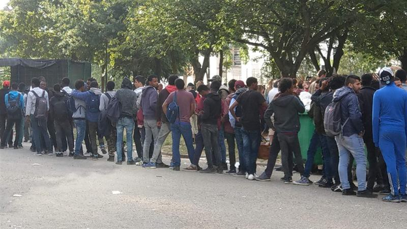

### AYS DAILY DIGEST 13/9/2018: Dire living conditions for migrants in Brussels\. Constant fear and abuse\.

_The situation of the IDP in Syria increasingly worrying in the past six months//Frontex to receive 11\.3 billion euros over six years//The food situation in Chios is alarming//Donations and volunteers needed in Greece and Bosnia//Statement of Baobab Experience: solidarity will not be stopped//Draft of return agreement to be signed between Seehofer and Salvini//Worrying message received by AYS on random and un\-notified deportation threats from Lebach, Germany//Increased risk of homelessness among unaccompanied minors in Sweden_

Credit: Samer Mustafa

**FEATURE**

Refugee Rights Europe has been documenting the situation of people on the move in Brussels and has recently published a comprehensive report about their research, in which 118 people took part, 95\.8% of them boys and men, mainly between the ages of 18 and 25\. Unaccompanied minors as young as 15 were also present\. The majority of the people interviewed were from Sudan, Eritrea and Egypt, with minorities from Afghanistan, Ethiopia, and Syria\.

Among the people who were interviewed, 91\.6% reported to be on their own, while only 2\.5% were with their families\.

The most alarming data regards the amount of time spent in displacement in Europe: **24\.6% had already spent more than two years in Europe,** followed by a 61\.8% who had spent a year or more seeking refugee in different EU countries, mainly France and Italy\.

“ _\[…\] respondents explained that they had left other European countries due to either a fear of rejection or upon actual asylum rejection; or otherwise due to the difficult circumstances in which they found themselves on arrival or during the waiting period for asylum_ ”\.

The report was released after an increasing implementation, by the Belgian authorities, of raids and arrests against migrants \(at the same time as [Mawda’s death](https://www.politico.eu/article/girl-2-may-have-been-shot-dead-by-belgian-police/) \) and of a strict asylum regulation, with the introduction of pre\-registration systems and “campaigns to dissuade applicants from remaining in the country”\. A situation which explains well why 82\.5% of the people interviewed don’t feel safe at all in Belgium, also due to inadequate living conditions in Maximilian Park, where “ _non\-governmental organisations \(NGOs\) and some individuals are filling the void that is being left by the Government, working tirelessly to support people in displacement in the city\. For example, Médecins du Monde and Médecins Sans Frontières \(MSF\) offer health checks, clothing, counseling and legal advice\. A network of local citizens has also been providing shelter to displaced people during the winter_ ”\.

Those interviewed fear not only deportation and rejection, but also verbal and physical abuse: “ _Where I sleep, people throw garbage at me from the building and say racist things”\._ 58\.6% have also witnessed another asylum seeker’s death while in Brussel, mainly due to road accidents\.

44\.7% have experienced police violence \(kicking and beating\), while 19\.6% have experienced being tear gassed\. Cases of injection of sedatives and people ripping off their clothes and belongings have also been reported\.

“ _The situation for unaccompanied minors and women in displacement in Brussels is particularly alarming, where they face an increased risk of exploitation and trafficking\. A number of minors interviewed were living on the streets, unable to obtain access to information about their rights, and they reported several incidences of police violence\. Despite the small number of women and girls taking part in the study, respondents recounted harrowing experiences at the hands of authorities and on the streets_ ”\.

Read the full report [here](http://refugeerights.org.uk/wp-content/uploads/2018/09/RRE_LeftInBetween.pdf) for more information on assistance provided and issues encountered by the people on the move in Brussels\.

**SYRIA**

A recent report published by the UN Commission of Inquiry states that internal displacement has reached an unprecedented level just in the past six months of the conflict\. In fact, due to recent clashes and fights over one million Syrians \(6\.5 million are IDP countrywide\) were forced out of their homes and live now in conditions well below what is considered humane\. The areas that were mostly hit are Aleppo, northern Homs, Damascus, Rif Damascus and Dara’a, with increasing risk in the area around Idlib, if negotiations fail\.

“ _Most battles were marked by war crimes including launching indiscriminate attacks, deliberately attacking protected objects, using prohibited weapons, pillaging and/or forced displacement, including by armed groups\. In other instances, parties to the conflict failed to take all feasible precautions to protect civilians, as required by international humanitarian law_ ”\.

The hardships of living as an Internally Displaced Person include lack of food, water, medical services and sanitation facilities, as well as a lack of adequate accommodation or overcrowded shelters\.

The Commission also adds that displacement is not only caused by the clashes but also by the “evacuation agreements” reached between the Government forces and their opponents\.

Read more [here](https://www.ohchr.org/EN/HRBodies/HRC/Pages/NewsDetail.aspx?NewsID=23541&LangID=E) \.

**SEA**

[377 people were rescued](https://twitter.com/salvamentogob/status/1040290095176314881?s=21) today by Salvamento Marítimo\.

Testimonies of sufferings\.

■■■■■■■■■■■■■■ 
> **[MSF Sea](https://twitter.com/MSF_Sea) @ Twitter Says:** 

> > The toxic mix of salt water &amp; spilled fuel in rubber &amp; wooden boats causes these nasty &amp; very painful chemicals burns on survivors.  Women &amp; children are particularly vulnerable to being burned as they are often packed in the bottom of the boat for their perceived safety. https://t.co/Cs3v9SrWga 

> **Tweeted at [2018-09-13 06:32:28](https://twitter.com/msf_sea/status/1040126047361146880).** 

■■■■■■■■■■■■■■ 

**EU**

As published in [yesterday’s digest](https://medium.com/are-you-syrious/ays-daily-digest-12-09-18-a-reinforced-eu-agency-for-asylum-60784a87cbfd,) , a reinforced EU Agency for Asylum has been presented and supported by the European Commission\. This includes [major financial support to Frontex](http://www.ekathimerini.com/232591/article/ekathimerini/news/eu-to-boost-frontex-agency-with-more-funds-and-staff) , which will receive 11\.3 billion euros between 2021 and 2027, with an increased in the number of staff, reaching 10,000 by 2020\. Frontex will, in addition to their tasks, also have the authority to intercept people who cross borders “irregularly”, acting under the authority of the state where they will be operating\.

**GREECE**

[Farsi/Dari updates on Dublin III regulation\.](https://www.facebook.com/notes/welcome-to-greece-info/صفحه-اطلاعات-دوبلین-3-بازگشت-ها-به-یونان/1129501620548043/?fref=gs&dti=1652972374920129&hc_location=group)

_Arrivals_

An [additional 65 people have been intercepted and rescued](http://www.ekathimerini.com/232583/article/ekathimerini/news/sixty-five-migrants-rescued-off-southwestern-greece) by the GCG, in joint work with Frontex, and transported to Pylos, in the Peloponnese region\.

_Lesvos_

Conditions in Moria are extremely horrifying, to the point where [19 NGOs have launched an alarm to Greek authorities](http://www.ekathimerini.com/232577/article/ekathimerini/news/ngos-sound-alarm-over-island-migrant-centers) , saying that “despite the announcements by the Minister of Immigration Policy about new accommodation centers on the mainland and the decongestion of the islands, more than 17,000 people are packed in desperate conditions in centers with a capacity of 6,000”\.

The statement urges national and European leaders to act quickly\.

■■■■■■■■■■■■■■ 
> **[RSA](https://twitter.com/rspaegean) @ Twitter Says:** 

> > The hell of Moria: severely disabled 14 year old boy from Afghanistan has been living in the overcrowded camp with his family since end of May despite his recognised vulnerability #atoxicdeal #refugeesgr #childrenrights https://t.co/4xEZi4Jxxx 

> **Tweeted at [2018-09-13 16:42:10](https://twitter.com/rspaegean/status/1040279480365928448).** 

■■■■■■■■■■■■■■ 

_Chios_

Vial’s residents are supplied daily with [awful food](https://www.facebook.com/JacobWarn/posts/10155658296256190?hc_location=ufi) by authorities\. AYS collaborators active on the field report that this kind of food has regularly made people sick and is very often thrown out uneaten\. Cases of food poisoning have been reported and last year 43 people ended up in the hospital\.

Officially no cooking is allowed inside the camp, but volunteers distribute dry food packs, allowing people to do their own cooking; it’s really the only way that they have of eating halfway decent food\.

A [refugee kitchen](https://www.facebook.com/chiospeopleskitchen/?fb_dtsg_ag=AdyhKtVM1XhshYNHMEs3VBi84ZLcqSGdMFkrK7r_OZ5MmQ%3AAdwpGrCEcD2ABVask_QXnWupC1As24o20rfsKZFD7VYyyQ&hc_location=ufi) that has been operational since December 2015 \(one of the oldest continuously operating refugee kitchen in Greece\) provides warm food to the Metadrasi shelter for unaccompanied minors, the women’s shelter, and the refugee school — and in addition makes regular distributions of dry food to residents of Vial and apartments\.

_Samos_

Volunteers are needed on the island, please [get in touch](https://www.facebook.com/samosvolunteers/?fb_dtsg_ag=AdzYvbu3DBul6h9z8DdqHnMRkWKcNIYIUr7REwjRWuQ4Ig%3AAdzAuyx5xKfixQxTbX-AoPTtQ52ZajZn-RDZdb60iPilhA) with them if you can\!

**BOSNIA**

In Sarajevo, at the moment, there are several hundreds people sleeping on the streets, many of them vulnerable\. Almost daily, more people are coming\. Help and donations are needed, including socks, clothes, and shoes, mostly for men, and blankets or sleeping bags\. If you can help, please [contact Souls of Sarajevo](https://www.facebook.com/soulsofsarajevo/posts/1387438684692673) \.

**SLOVENIA**

Slovenia will set up [20 kilometers of new wire fence along the River Kupa](https://dnevnik.hr/vijesti/svijet/slovenija-ce-postaviti-novu-zicu-uz-kupu---528526.html) in the next few weeks, on the part of the border to Croatia where over the past few months we have witnessed increased people’s movement and where 176 kilometers of wire barriers have already been set up\.

**ITALY**

_Como_

Following yesterday’s news on [evictions in Como](https://medium.com/are-you-syrious/ays-daily-digest-12-09-18-a-reinforced-eu-agency-for-asylum-60784a87cbfd,) , other information is coming in about where the people evicted were moved\. [Around 40 migrants have been moved to a hub](https://comosenzafrontiere.wordpress.com/2018/09/13/evacuazione-campo-governativo-la-storia-si-ripete-sempre-peggio/#more-3526) \(the former CIE — Pre\-deportation centre\) in Bologna\. The building is under the threat of closure, however, or, even worse, being converted into an expulsion centre\. While activists are trying to gather as much information as possible on the future of those evicted, we are wondering whether this move is just another pointless iteration of expulsion, a clear violation of their basic rights\.

Activists of Baobab have been accused and openly judged when they accompanied 48 migrants, all already identified by the authorities, to the Red Cross camp in Ventimiglia\. The 48 people were all Eritreans who had reached Italian shores onboard the ICG vessel, Diciotti, the infamous one\. The 48 Eritreans asked deliberately to be taken to Ventimiglia, because they don’t want to be stuck in Italy, which is just a transit country for them as it is for the majority of those who land on the country’s shores and are increasingly becoming victims of xenophobic and fascist attacks\.

Values like solidarity and humanity can never be criminalised and whenever authorities try to prevent such spontaneous acts of brotherhood, there will always be people who resist\. People on the move are not criminals, they are victims\.

Read Baobab’s statement [here](https://www.facebook.com/BaobabExperience/photos/a.855775474499206/1835560263187384/?type=3&theater) \.

_Rosarno \(Reggio Calabria, Calabria\)_

Donation of bikes needed for those who live in the makeshift camp\. Bikes are the only means of transport people can rely on to go to work\.

**FRANCE**

Some [updates from Dunkirk](https://www.facebook.com/refugeewomenscentre/?hc_ref=ARR3n7RSeQ-yz5xkJCH2MS3TCKWu8lbup3FxpXqs1NETXghwuBoVoEjN6O4cIvmtvZw&fref=nf&hc_location=group) , where 600 people are still sleeping rough after eviction, including 18 families\.

“ _There is no access to water or basic sanitation, except when provided by aid workers\. Earlier this week, pepper spray and tasers were used against the community\. Four men also had their shoes confiscated by police\. The abuse of power is haunting\. Horror stories from the eviction have also been pouring in\. Reports of men being numbered on the backs of their neck and their hands are being zip tied_ ”\.

**AUSTRIA**

**GERMANY**

[DW reports](https://www.dw.com/en/germany-ready-to-sign-migrant-return-deal-with-italy/a-45477852) that German Interior Minister, Seehofer, announced a bilateral agreement with Italy has been reached and is ready to be signed in the upcoming days\. The agreement regards the return of migrants “to their entry point in Europe”, ensuring a “zero net effect” on Italy\.

Even though details are still to be made public, presumably the agreement will pivot around the accord that for every 100 migrants being returned to Italy, 100 people in Italy will be redistributed to other EU countries, basically producing no effect on the number of migrants present in Italy, even though we could discuss how effective this would be\.

“ _Other issues, such as the role Austria should play and how asylum seekers should be transported from Germany to Italy, have been left open, according to reports_ ”\.

Both Seehofer and Salvini will be present at an EU meeting in Vienna on Friday, so more details on the draft will be presented\.

AYS collaborators, in touch with Syrian refugees in Lebach, Saarland state, have received worrying messages from them:

“ _The police are invading on daily bases to deport people … a woman I know was alone with her baby while her husband was out at friends’\. The police carried her literally and took her to the airport with her four yr old, she was crying and screaming that she didn’t want to leave without her husband, but they still didn’t care\. In the morning, the husband was surprised with what people told him, he rushed to the Ausländerbehörde — Foreigners Office\- begging them to bring her back or take him directly\. They brought her back and asked them to pack and be ready to leave at any minute\. Of course this was a month ago, they scared them and the kids too and they are also living in fear, not knowing when they will come back for them\. Of course the police come after 3 am\. Those here who have relatives or friends are hiding till their lawyers give them any piece of news\. The rest are living in fear \. \. men are spending the night out to avoid being in their rooms when the police come_ ”\.

People have been told it can take up to two years of wait to receive asylum, after which they could be deported\. People are petrified and hugely frustrated\.

[Recent news report](https://www.sr.de/sr/home/nachrichten/politik_wirtschaft/lebach_aufnahmestelle_strengere_restriktionen_fluechtlingsrat_kritik100.html) that the Saarland Refugee Council has sharply criticized the conditions for migrants at the state reception centre in Lebach\. The restrictions have increased significantly in recent months\. The camp in Lebach is apparently already on the way to a so\-called “anchor centre”\.

The critique of the Saarland Refugee Council is that only recognized asylum seekers are sent to live in the municipalities\. “ _Only those who are recognized can get out\. The rest must endure this sickening situation\. The situation is even worse for those who already live in the municipality but are obligated to leave the country\. They have to move back to the refugee camp in Lebach to be under the control of the deportation authorities”_ , said board member Maria Dussing\-Schuberth\.

In the high phase of immigration in 2015, the treatment of migrants was different\. “We assume this change is directly linked to the establishment of the anchor centre in Lebach,” said Dussing\-Schuberth\.

The Refugee Council criticizes that integration of migrants has become more difficult\. “The Ministry of the Interior wants to prevent by all means the integration of those with only temporary suspensions of deportation”, explained Gertrud Selzer from the Saarland Refugee Council\.

**SWEDEN**

[Unaccompanied minors are becoming homeless while they wait for decisions](http://www.dagensarena.se/innehall/ensamkommande-blir-hemlosa-vantan-pa-beslut/) \. As a cause of the high school act, and other insufficient legislations, young people are left out of the system\. Volunteer organizations have noticed that young people find themselves in a legal limbo\.

Many of those waiting for decisions following their applications to stay in Sweden based on the high school act have no right to accommodation provided by the Migration Agency\. Therefore, homelessness increases among the group\. More than 8400 people have applied for a residence permit based on high school studies\. Of those 5000 have been rejected in all instances\. They are the ones to lose the right to housing\. Following the changes in the high school act, some people are considered to be “permission\-seeking” \(tillståndssökande\) \. This means that they have applied for the right to seek asylum again, due to studies\. For now, it is not clear what rules apply for them\. Municipalities can help if they consider their help needed, but they are not obligated to do so\.

In Kristinehamn, the municipality has chosen to provide accommodation for “permission\-seeking” individuals, which means that 25 young people still have a place to stay\.

The high school act and how to interpret it will be dealt with by the EU court, but this may take up to a year from now\. The Migration Court \(Migrationsöverdomstolen\) will reach a decision on how to interpret the law by the end of September\.

**We strive to echo correct news from the ground through collaboration and fairness\.**

**Every effort has been made to credit organizations and individuals with regard to the supply of information, video, and photo material \(in cases where the source wanted to be accredited\) \. Please notify us regarding corrections\.**

**If there’s anything you want to share or comment, contact us through Facebook or write to: areyousyrious@gmail\.com\.**

_Converted [Medium Post](https://medium.com/are-you-syrious/ays-daily-digest-13-9-2018-dire-living-conditions-for-migrants-in-brussels-f8a254f336db) by [ZMediumToMarkdown](https://github.com/ZhgChgLi/ZMediumToMarkdown)._
