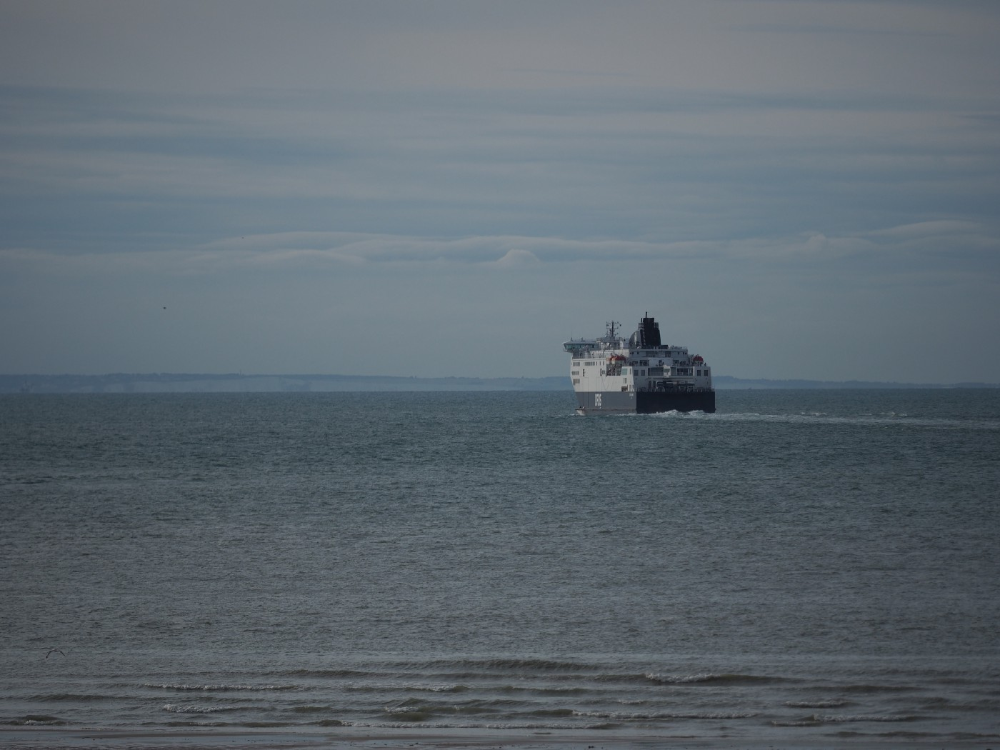

### AYS Special from Northern France: Odyssee of evictions
#### More people keep coming to Calais and Dunkirk again, while the police is trying to prevent new jungles\.

Tents at a makeshift camp in mid August in Calais\.

The weather is getting rougher these days\. After a hot and dry summer the temperatures in Calais and Dunkirk are falling, rains and winds are increasing\. By the end of August, around 1300 people — 500 in Calais and 800 in Dunkirk — were assumed to sleep rough\.

Since the evictions of the big jungles in both harbor cities in 2016, not much has changed\. There are not as many people present any more, but the number is rising again\. Most of them still dream of making it to the UK\. And as here and there reports of succesful attempts are popping up and smugglers say there are still ways, hope is still alive\.

A ferry heading towards Dover\. The coastline can be seen in the background\.
#### Last option: England

Amond people in Calais is Mohammed \(name changed\) \. He came to Calais after being in Germany for more than one and a half year and being denied legal status\.

“I have to go to England,” he says\.

He sees the UK as a last chance to build a life in Europe — he had to leave his home country because he was persecuted, he says\. But he does not want to reveal any details in public, as he still has a glimpse of hope of getting legal status in England\. Hence he fears any statement which could give hints as to his identity could be adverse for him\. But he has been in Calais for more than seven months\.

Why he does not ask for asylum in France? “There are 18 months for Dublin and here is no space,” he says, afraid of deportation back to Germany and then to his country of origin\. So, for now, the streets of Calais are his only opportunity\. But there is another problem: police evictions\. “They take the tents\. You have no chance,” he says\.

Helena Kelly knows stories like Mohammed’s\. She is volunteering with Refugee Info Bus\. The team monitors the situation on the ground and human rights violations, but also provides legal information and offers mobile phone charging, free Wifi and other activities\. A day center on wheels, they call their bus\.

“Every day there are clearances,” she says\. Sometimes a spot gets cleared more than once a week\. This leads to a desperate situation for the homeless people\. “There is no fixed camp, they are never safe,” Kelly explains\. The evictions were quite violent, with abuse of human rights and violence against the people as well as volunteers\. This circle of evictions and mistreatment also makes it difficult for humanitarians\. “It is frustrating to distribute things that will be confiscated and destroyed two days later\.”

#### Major eviction and fire in Dunkirk

One major eviction was conducted at the beginning of September, when the police cleared the occupied land in Dunkirk after a court decision\. Katie Richards from the Refugee Women’s Center \(RWC\) took care of and was in contact with many of the people evicted\. While most of the families were transferred at the start, only some men were given this opportunity, with degrading practices, Richards says: “They tied their hands and numbered the people\!” While most of the men were just left on the street and told to leave the area, many came back later — the RWC reported about hours of driving in circles, until the police just drove them to an area nearby\.

But even for the ones in the centers, the situation remained difficult, Richards explains\. Even though they got vouchers, the people did not have access to food\. In another case, a pregnant woman was not allowed to enter a train to go to hospital\. “The police were trying to prevent people from going back to the camp,” she says, assuming this is why the incident happened\.

However, it seems that the eviction missed its goal\. “The Refugee Community Kitchen is distributing meals to 600 people,” Katie Richards recalls the current situation in Dunkirk\. The police is not letting people enter the old jungle\. When a group tried it this week, tear gas and tasers were used, according to Richards\. “There was quite a lot of police violence\. Four men even had their shoes taken,” she reports\. Meanwhile, most of the people have moved to a car lot, where the former warehouse of RWC and other organisations is located\. “But this is no solution,” Richards says\. The sub\-prefecture had suggested distributing at a natural reserve nearby, but the local community and the mayor did not want this to happen\.

The RCK provides more than 1000 meals a day\.

What makes it even harder for the RWC and other local teams to respond to the current situation is that the above mentioned warehouse burned down a week before the eviction, with all the supplies stored there\.

“The night before the fire, there was a break\-in,” Richards reveals, assuming it was arson\. Witnesses said they saw people walking in the area when the fire happened\. And usually there are security patrols, as the warehouse is located at a shopping mall\. Now the RWC has to coordinate its activities from the L’Auberge warehouse in Calais, which is home to various NGO’s and already stored items for the center before\.

“But the other groups, many locals, had to stop distributing NFI’s to men,” as Katie Richards knows\. Hence, the women’s center is now calling for funds to replace the items and keep the distributions going\. Additionally, the team is looking for a new warehouse\. “We are working with the city hall to find a new space,” Richards says, hoping to have a solution by November\.

While the situation in the old jungle of Dunkirk was not good before, Richards says now it is “really bad”\. No running water, no showers, no toilets\. Even tents cannot be distributed at the moment, not even to the approximately ten families who are on site again\. “We do not have enough,” Richards says\. When they are meeting the people, they keep asking for blankets and other basic needs — which cannot be met at all at the moment\.

In Calais as well as in Dunkirk the situation seems to have become more tense — on all sides\. Volunteers struggling with the harsh environment\. The police becoming rougher\. The people being more and more pushed to the edge\. Volunteers may distribute food, drinks and some NFI’s, Mohammed says\. But he has started losing hope\. “There is no humanity,” he says\. While Mohammed was sitting on a rock and explaining the situation, one of his companions climbed up the power pole\. This time, the others convinced him to come down before something bad happened\. But autumn and winter are about to come, making the already inhumane living conditions in the streets of Northern France even more difficult\.

**_\(Written and photos taken by Niklas Golitschek, AYS volunteer\)_**

**We strive to echo correct news from the ground through collaboration and fairness\.**

**Every effort has been made to credit organizations and individuals with regard to the supply of information, video, and photo material \(in cases where the source wanted to be accredited\) \. Please notify us regarding corrections\.**

**If there’s anything you want to share or comment, contact us through Facebook or write to: areyousyrious@gmail\.com**

_Converted [Medium Post](https://medium.com/are-you-syrious/ays-special-from-northern-france-odyssee-of-evictions-9915de526389) by [ZMediumToMarkdown](https://github.com/ZhgChgLi/ZMediumToMarkdown)._
