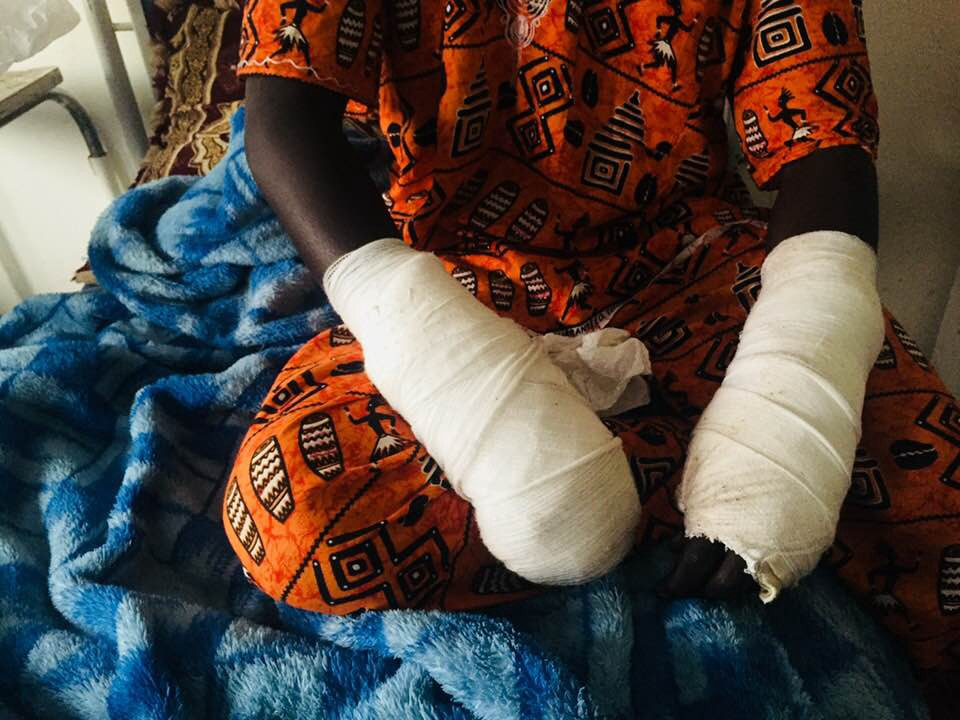
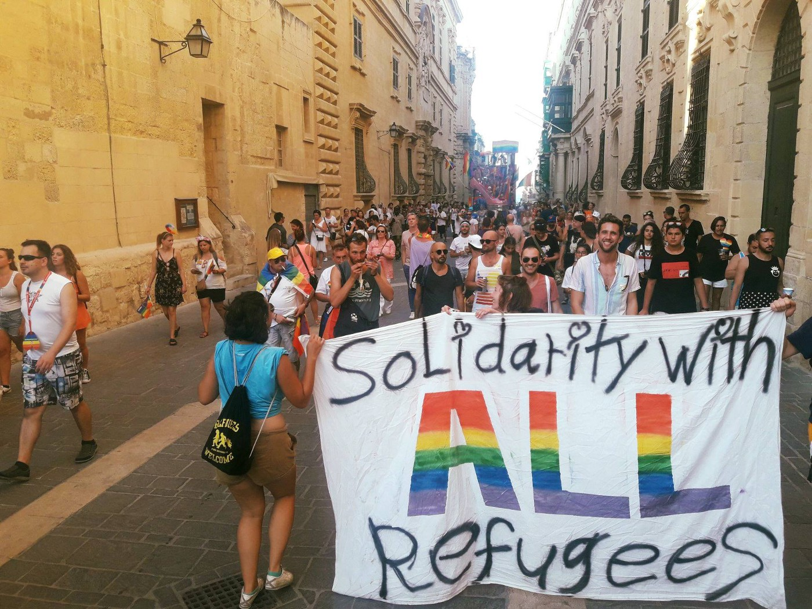
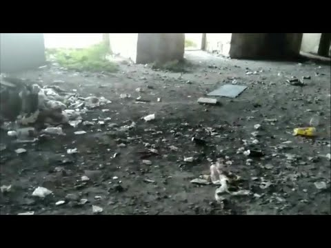
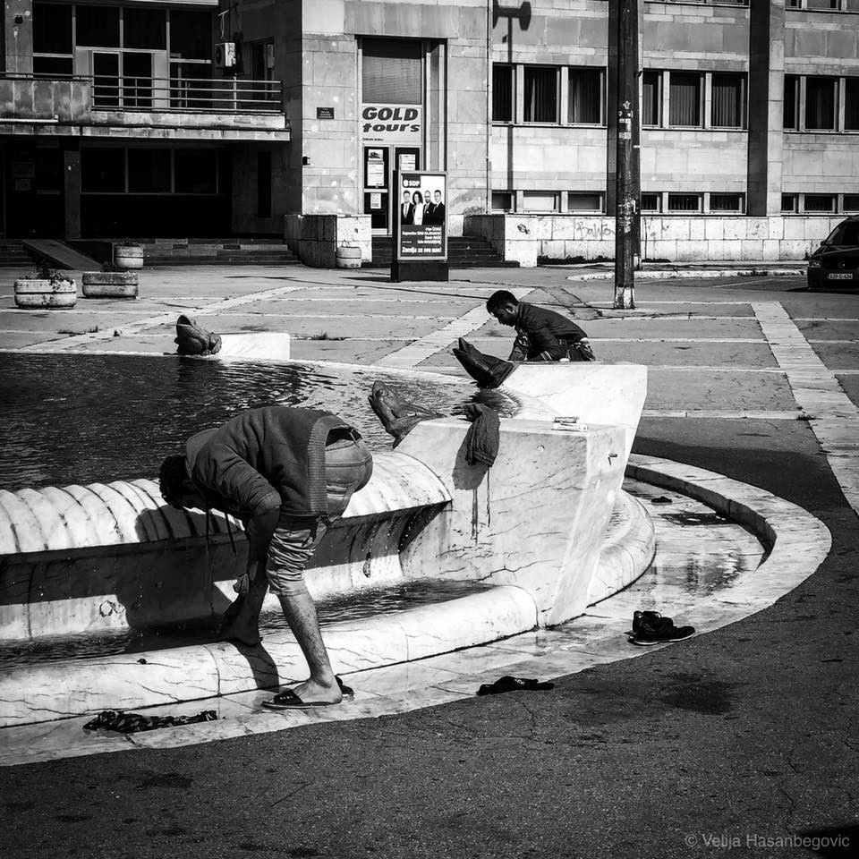
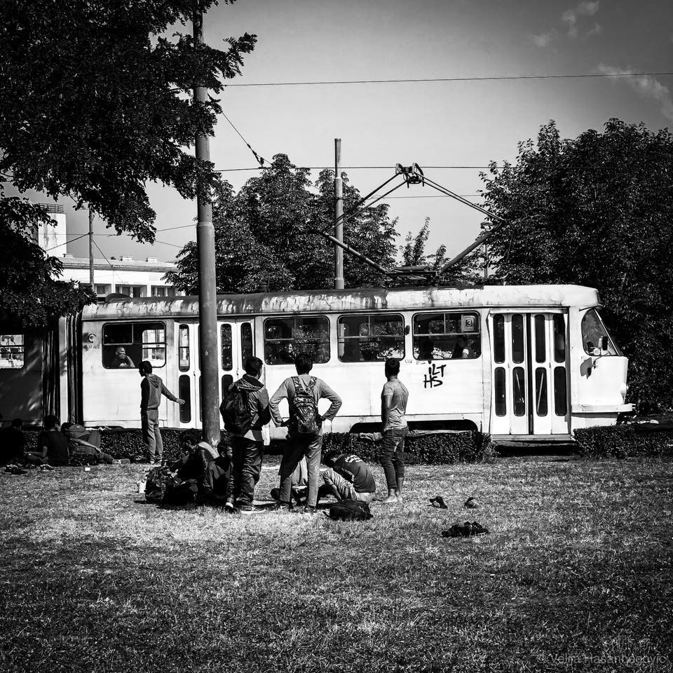
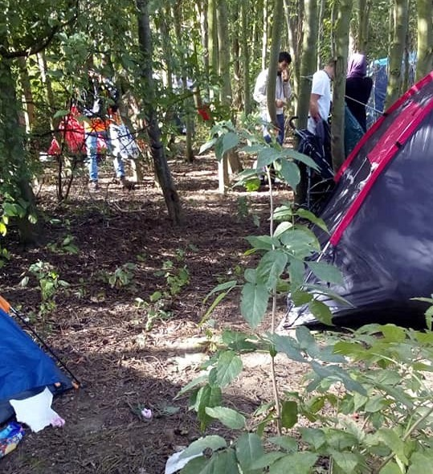

### AYS Weekend Digest 15\-16/09/18: Rome refuses to rescue 100 people

_Also measles epidemic happening in Libya / Solidarity for LGBTQ\+ refugees / Almost 400 people arriving on Greek islands on Sunday / Racist remarks from Czech Prime Minister / Xenophobic attacks in Germany / Brussels possibly to expand detention to 3 months / and much more…_

 \.](assets/8ea9ea4102bf/1*nKVQ6QmhW9X4GhIXnXoW4g.jpeg)

Hundreds of people sleeping rough in Sarajevo due to the lack of accoodation\. Photo by [Velija Hasanbegović](https://www.facebook.com/velija.hasanbegovic?fb_dtsg_ag=Adzzml4ONF3X49Q97cb9X330FFmVjkSgJLoe8eEGw2tMxA%3AAdxueWoKyv5i3FgtSO5ZYENShiyjB-dbK6HJ3HxB0d1s-Q) \.
### Feature

Pilotes [Volontaires](https://www.facebook.com/pilotesvolontaires/photos/a.196634897620529/278089286141756/?type=3&theater) reported early Sunday morning that there was a distress signal coming from a rubber boat off the coast of Tripoli with 100 people urgently needing help\. They informed MRRC Rome who immediately transferred them to the Libyan authorities\. [Hours later](https://twitter.com/PVolontaires/status/1041400757784924161) they received word that the Libyan Coast Guard picked them up and inevitably brought them back into detention\.

As one sea rescue [NGO](https://twitter.com/jugendrettet/status/1041357759474794497) reacts:

■■■■■■■■■■■■■■ 
> **[Jugend RETTET - IUVENTA](https://twitter.com/jugendrettet) @ Twitter Says:** 

> > It is heartbreaking and infuriating to know that our ships could be at the spot right now to save human lives - if only European politics would not block our efforts. When will we finally be allowed to do our work again - as international law demands!? #right2rescue 

> **Tweeted at [2018-09-16 16:06:52](https://twitter.com/jugendrettet/status/1041357759474794497).** 

■■■■■■■■■■■■■■ 

This [“let them drown policy”](https://twitter.com/alarm_phone/status/1041328735092400128) is alive and well\.
### Morocco

[The dead body of a refugee woman](https://www.facebook.com/AmdhNador/photos/a.1693125780899690/2186113928267537/?type=3&theater) was found on Friday on Arekmane beach in Nador\. The body was found in a very degraded state and was taken to a hospital where they are planning an autopsy\. Tragic deaths on shores before reaching Europe are becoming all too common\.

[Migrants in the Tangier hospital](https://www.facebook.com/AmdhNador/photos/a.1693125780899690/2186236444921952/?type=3&theater) are suffering as they do not have adequate medicine, food, or clothing, warns local NGOs\. Sub\-Saharan people stuck in Morocco are suffering and solidarity is needed now more than ever\.

](assets/8ea9ea4102bf/1*HL8f7WSEEZxZ9rC8xD08kA.jpeg)

Photo by [Zineb Issayh](https://www.facebook.com/zineb.issayh/posts/497222560793320?__xts__[0]=68.ARA1WqnjztkkCPQKXby6uuHvITqyBaTqJCPDgTf4xgJ96XCRbvrnkVOxG3SK9__5WnSSAxcXu0B8zuQRDinO7Y_Gb4HqlldNt-Ce-VvFFRccA3VcbAewyXBerCXxbvc2kYyNtp5YCg_LxcTk6EstV8RUssYfBB5V-7f4b45u7rN3hJ9nKblM&__tn__=-R)
### Libya

 of a detention center for migrants in Libya on Saturday\. One unaccompanied boy was ONLY 12 years old\.](assets/8ea9ea4102bf/1*krTfiqq7Ryya6-UNPA4jyA.jpeg)

A blurred photo by [UNICEF](https://twitter.com/ARAGhandour/status/1041030025578012672) of a detention center for migrants in Libya on Saturday\. One unaccompanied boy was ONLY 12 years old\.

There is a [measles epidemic](https://twitter.com/ARAGhandour/status/1040739975552229377) spreading in Libya and most of the 500 reported cases have been children\. UNICEF Libya is urging for the speedy arrival of vaccines to prevent any further outbreak\.
### Sea

[The Aquarius](https://twitter.com/SOSMedIntl/status/1041017069364490240) rescue ship reported on Saturday that they are heading back to international waters after a short technical stop in the port of Marseilles\. It will take them 3 days to reach the search and rescue zone of the central Mediterranean\.

**Salvamento Maritimo** reported these rescues in the Alboran sea on Saturday:

— [The ship María Zambrano](https://twitter.com/salvamentogob/status/1040927993189867520) rescued 46 people and Guardamar polyhymnia rescued 60 people in water early in the morning\.

— [By 19h](https://twitter.com/salvamentogob/status/1041011156427657216) on Saturday 339 persons were rescued from 7 small boats

— [The ship](https://twitter.com/salvamentogob/status/1041016350041407488) Maria Zambrano rescued 93 rescued and the ship Guardamar Polyhymnia rescued 161 people

[Mission Lifeline](https://twitter.com/SEENOTRETTUNG/status/1040970541476339712) says that “explosive information on the Lifeline case \(will be\) available on Monday here on Twitter\.” AYS will continue to follow up on this very important case that threatens to criminalize sea rescue missions\.

[Ministers](http://www.euronews.com/2018/09/15/can-asylum-seekers-really-be-screened-at-sea-euronews-answers) from Austria and Italy are proposing that migrants should be screened on their rescue ships in order to determine if they “deserve” protection\. MSF statement on the matter:

> “This proposal is yet another attempt to divert attention from the actual issue, namely the inability of Europe and the Austrian EU Presidency to find a sustainable solution to the humanitarian crisis in the Central Mediterranean and Libya” 

### Malta

A good reminder from [Sea\-Watch](https://www.facebook.com/seawatchprojekt/posts/2118610771690326?__xts__[0]=68.ARBajVclL333aMjK7MiyenTIYuo33Z89Wwln74W25V3m89CAFvfaE0k_xZtg0WtFje8bpKa_SJ01G-vIDNsFd08QGp_G_w-GALOxzfi4wqHfDg3Bv4SKMNCwxCkPMKA9k-SZSDPuDDzrzaAkK4oPJBlPnbL855yv32AVP16ZsVDpnV86e7wZLQ&__tn__=-R) :

Malta’s pride can’t be complete without pride for LGBTQ\+ refugees\! Photo by Sea Watch
### Spain

More health care for refugees and migrants: The Spanish Congress of Deputies has approved a legal decree that expands access to health to undocumented migrants\.

From the first day that a person resides in Spain, she or he will get access to the healthcare system irrespective of whether or not this person has registered with a municipality\. Social security cards, which can only be obtained with receipt of a labour contract, will also no longer be a prerequisite for access to health care\. This will also assist Spanish citizens that do not contribute to Social Security due to not being in employment\.

Undocumented migrants will be required to pay 40% of the cost of medicines that are prescribed to them\. They will also not be able to access health care in a region different to that in which they were issued their health card — which is also the case for citizens — nor they will be able to use it outside of the country, [ECRE reports\.](https://www.ecre.org/spain-undocumented-immigrants-regain-the-right-to-health/)
### Greece
#### Islands

8 boats with almost 400 people have landed on Sunday morning to Greek islands, [Aegean Boat Report](https://www.facebook.com/AegeanBoatReport/?hc_ref=ARSRIP0rNtw-bzAaPB5gHr6YSuy94gM-ZAHn5xLqPJacSZXlwg3R6KOuBxlVPDopAz0&fref=nf) team reports\. 184 of the 324 people who just arrived to Greece are reportedly minors\. Follow the detailed reports on the new arrivals on the group’s page\.

The situation on Lesvos continues to be difficult for everyone\. Responding to the insufficient distribution of blankets by the big organisations, [Attika Human Support](https://www.facebook.com/AttikaHumanSupport/?hc_ref=ARTJXvq1erKFWogEMfLpw4_GE-mMcPGpxTDE2lVtD6JbsD483gzuP-ZZohjgoOUrRGc&fref=nf) supplied Stage 2, North of Lesvos\.

](assets/8ea9ea4102bf/1*AqK9kMdAzL_zHV7OgyQfOg.jpeg)

Photo taken in front of Moria, Lesvos — Photo source: [Ricco Pat](https://www.facebook.com/profile.php?id=100006016097004&tn-str=%2AF&hc_location=group_dialog)

[Refugee Rescue / ‘Mo Chara’](https://www.facebook.com/RefugeeRescueUK/?hc_ref=ARRx3Q_aIGiHbcsUET_pog7U74bKEAFKPHlrRHkyEIzKx7CICgqjK8Km95J6yxA_8R0&fref=nf) team is looking for more people to join them on Lesvos:

> As the number of new arrivals keeps increasing, we need a boost to our Land Crew over the coming months\. If you are over 18 and can commit to volunteering with us for longer than two weeks, please get it touch at [_www\.refugeerescue\.co\.uk/land\-crew/_](http://www.refugeerescue.co.uk/land-crew/) 

The Chios Buddy Network is a new page that can help refugees seek out connections and job opportunities\. Check it out [here\.](https://www.facebook.com/groups/778648452282341/?__xts__[0]=68.ARAtg05oMGTbZdjGTXWf2U-IVaSezd83UEt2aWuakh1KZ36A9izYz0-QrUQUH2VKIaNKz4GmncqIEnBn631yyBcjyz6cC2ivACXpT7a6gfpLh69iw8lQ8oPp928xyU067HIsjzD9UAfcJZ3okqYNIbvzwue-2Ro6VDFKZP3lY0KjaibAMusqag&__tn__=HH-R)
#### Mainland

An effort has been made to help a 9\-year old girl who has been stranded for several months in an unofficial refugee camp about an hour outside Athens with her parents and 4\-year old brother\. She is severely disabled and in urgent need of surgery: she has spina bifida, paraplegia, hydrocephaly and scoliosis \(curvature of the spine\. \) \. Considering the growing expenses and the need for help, a group of volunteers have set up a campaign for contributions to help little B\. Find the [link to campaign here\.](https://www.gofundme.com/not-many-boxes-left-to-tick?member=770168)

[Boxwise](https://www.facebook.com/boxwise.co/) are looking for a lead developer that can dedicate some time in the coming months\. They are based in Berlin, but the job is remote so you can work from anywhere\.

> We believe that refugees deserve fair and dignified treatment\. While working as volunteers in Greece, we built software that helps distributing clothes and food to thousands of refugees\. It gives comfort and dignity to people in a vulnerable situation\. 

In case you can not dedicate so much time to their project, but you still want to contribute? Get in touch with them, there is a lot you can do\!

Attika Human Support has already started preparing for their winter plan\. Why do small grassroots organizations have to worry about this while the authorities are not addressing the imminent season change? Please help them in any way you can and find out more [here\.](https://www.facebook.com/AttikaHumanSupport/posts/697838527238472?hc_location=ufi)

People on the cash card waiting list in Athens need to reach out to CRS as soon as possible since they are trying to get people off the wait\-list but cannot reach a lot of phone numbers\. Please look [here](https://www.facebook.com/groups/AthensVolunteersInformation/permalink/1500271970105095/) for more details\.

[A truck](https://www.apnews.com/6841776bf2e647049215b5804219557b) carrying 41 people on Sunday near the Greek/Turkish border crashed, injuring 3 people\. The 31 passengers were from Palestine, Iraq, Syria, and Afghanistan and all paid to be taken over the border\. Read more in this digest’s “General” section below on how land migration has increased this year, making the land border between Greece and Turkey more dangerous\.
### Italy

A small group of Afghan minors aged 13, 15 and 16 sleep in the area near the station full of rubbish and rats\.They arrived after a long desperate and difficult journey\. — [L’ ALTRA VOCE](https://www.facebook.com/L-ALTRA-VOCE-1245970425495921/?hc_ref=ARR9X_flsQWlRwyn8gm5DdUZMpClX3rR4lXtVdksoTt8KCmhaMkOVhDQK60YpCw_PFA&fref=nf&hc_location=group)

Homeless children refugees are becoming a norm all around Europe and it is disgraceful\.
### Serbia

A new August 2018 [snapshot from the UNHCR](https://data2.unhcr.org/en/documents/details/65735) shows that there were 2,458 new arrivals to Serbia in August, an increase from July when 1,989 arrived\. Arrivals of unaccompanied and separated children also increased from 156 in July to 468 in August\.

In July, seven people were granted asylum in Serbia\.

Pushbacks from Hungary \(95\), Croatia \(674\), Romania \(71\), and Bosnia \(252\) all increased from July to August, as well\.
### Bosnia and Herzegovina

In Sarajevo, several hundred people are sleeping rough in the streets\. Many are around the train station, including unaccompanied minors, and vulnerable people\. Food and help is provided by locals and groups of international volunteers\. More and more people who are forced to live in such degrading conditions are reporting violence and mistreatment by the police in Bosnia, including police in Sarajevo\.

At the same time, more people are arriving every day, mostly from the direction of Serbia, passing through cities of Zvornik and Tuzla\. In both cities, they receive help from the local population who are still showing a lot of solidarity\.

Volunteers in Sarajevo are supported by the local charity [Pomozi\.ba](http://pomozi.ba) \. In order to provide basic needs for all the people in Sarajevo, volunteers need help\. Please donate through the link above \(purpose: help to refugees\) if you can\.

Photo by Velija Hasanbegovic

[The first “winterize” containers](https://www.facebook.com/photo.php?fbid=10155708381837747&set=a.10150926384372747&type=3&theater) have been set up in a new camp near Sarajevo in Hadžići\. The camp will be under IOM and the state Ministry of Security\. So far, there are 11 fully installed containers to accommodate around 140 people\. The IOM said that more will be arriving in order to accommodate up to [400 people](https://www.klix.ba/vijesti/bih/u-hadzicima-postavljeno-11-kontejnera-za-smjestaj-migranata/180915073#4) \. However, many more people are in Sarajevo at the moment needing accommodation\.

At the same time, the IOM and the EU decided to support the building of camps in Bosnia, which is costly and — as proven many times — do not provide dignified accommodation for the people that need it\. Having in mind that the number of people present in Bosnia is not that big \(less than 10\.000\), less money would be spend if apartments are provided than on a new camp that will be traumatizing for everybody\. There is no such thing as a good refugee camp\.
### Czech Republic

In a press conference on Saturday, [the Czech Prime Minister Andrej Babis](http://ba.n1info.com/a285100/Svijet/Svijet/Necemo-primiti-nijednog-izbjeglicu-Ni-ratnu-sirocad-Ne.html) said that the country won’t be receiving any refugees, including Syrian war orphans\.

> “Why should we receive them? We have an orphanage that we need to prepare for life here in our country,” said Babys\. 

He wants to send a clear signal to the EU against “illegal” migration but doesn’t seem to recognize that it’s a human right to seek refuge\.
### France

> “Heartbreaking day in Dunkirk so far\. Hundreds of men, women and families stuck in yet another forest area…what a world we’re living in\. Evictions of refugees do not work without a proper solution\.” 

— VZWGent4Humanity refugee support\.

This week we published a [special from Calais and Dunkrik](ays-special-from-northern-france-odyssee-of-evictions-9915de526389) “Odyssee of evictions”\. _“Since the evictions of the big jungles in both harbor cities in 2016, not much has changed\. There are not as many people present any more, but the number is rising again\. Most of them still dream of making it to the UK\. And as here and there reports of succesful attempts are popping up and smugglers say there are still ways, hope is still alive\.”_
### The Netherlands

The Department of Geography, Planning and Environment invites refugees in the country to study at the Radboud University for classes and research opportunities\. Find out more [here](https://www.ru.nl/gpe/study-programmes/courses-open-refugees/) \.
### Germany

[This week,](http://www.infomigrants.net/en/post/11970/do-the-dublin-rules-need-a-boost?ref=tw) Germany has made deals with both Italy and Portugal aimed at speeding up returns of asylum seekers\. This followed earlier agreements made with Greece and Spain\. Across the EU, there is growing pressure to make deportations more efficient\.

Italian Interior Minister Matteo Salvini denied on Friday having reached a deal with Germany to take back migrants who had already applied for asylum in Italy, saying he wanted more concessions from Berlin\. German Interior Minister Horst Seehofer [told](https://www.reuters.com/article/us-europe-migrants-germany-italy/italy-hesitates-over-refugee-deal-with-germany-seeks-concessions-idUSKCN1LU25W) the German parliament on Thursday that he expected to sign the Italian deal shortly, but Salvini cautioned that he wasn’t ready to put his name to the accord\.

Xenophobic attacks have increased in Germany in recent months and tension has been aggravated by recent manifestations of the far right\. [Europa Press Internacional](https://www.facebook.com/EPinternacional/?fref=gc&dti=1652972374920129&hc_location=ufi) reports that in Hasselfelde, in the state of Saxony\-Anhalt, two men attacked a group of young Afghans near a sports facility on Saturday night\. A 17\-year\-old teenager was mildy injured\. German [police are investigating](http://www.europapress.es/internacional/noticia-policia-alemana-investiga-dos-ataques-contra-refugiados-20180916170210.html) the two recent attacks on refugees\.
### Denmark

During the summer, there have been more imprisonments, and there are now at least eight people from Kærshovedgård imprisoned in Ellebæk\. [Close Kærshovedgård Deportation Camp](https://www.facebook.com/CLOSEKGH/?hc_ref=ARQJOFz74IBWVQDoJW5s5gIlGb5JheSFhseuVP35vx5nVd8VqHPd6RRJxO5tb7yXUFc&fref=nf&hc_location=group) group continue protests against the state’s brutal use of imprisonment as a tactic to pressure people to leave the country\.

Last week a new report on the conditions in Danish deportation camps was published\. Amada, who resides in Sjælsmark, has among others, contributed to the report:

> »We see here, how people gradually become insane\. They isolate, become paranoid, start talking to themselves\. They start using drugs, some begin to harm themselves or others\. They die inside\. They are killing us slowly, men the state doesn’t understand its own role in this\.« 

### General

While the perilous and deadly Mediterranean sea migration route is well known, new figures from IOM show that more than one in five people arriving irregularly in Europe do so by land\. The most frequently\-used route is from Turkey to Greece where authorities reported a total of 12,166 land arrivals since the beginning of 2018\.

> The 17,966 land arrivals to Europe between January and end early September 2018 represent an almost six times increase compared to the 2,464 reported in the same period last year, according to [IOM data\.](https://www.iom.int/news/over-one-fifth-irregular-migrants-europe-coming-land-new-iom-report) 

The project [Missing at the Borders](https://l.facebook.com/l.php?u=https%3A%2F%2Fmissingattheborders.org%2Fen%2F&h=AT1K6GanpF-vEc3f7gkqmREDV-PTmHpYzprSSSvb7VYwKOZDacFIDtqf278CyZ4TgOTGk3d538Z3G2Ongic48xx2D2CkiWhnYY46ODFZqG1PWpL4AmUtCupASZze-wZ3qP4qwDFKxGrmtydrGwn0uT0P2xn6YT6aYiNb2ABQR2EH6x11r8O4EoqzHVB0ZTvqxAtZXKmRM52ypQcCqS_sPyFF8SklWhiibopkrCN6DapnWUQ4ZNOrW8tkp-4sNNTLfiF1cWDtLupCs6n13Gn2xtvQqDg0_jsB0o9gibEbl3laTdiYdf5b9fL4HGNOZ3lNJGCyKxP11xxnPduRX5CnVAq_5Y2B73Pfye4av5dV6l3WjoVrWNNyDF6_q3avWxy0-fnhBgAScnv5Ssr5I1bjTCZRgWQtFpU) was launched this weekend, dedicated to the families of migrants deceased, missing or victims of enforced disappearances\. “People not numbers” is the fundamental principle guiding the project\.

](assets/8ea9ea4102bf/1*3qIMNTG7_pNaVeTnzJ9pfQ.jpeg)

Across Europe, the lack of information available to refugees and displaced people is striking\. — via [Refugee Rights Europe](https://www.facebook.com/RefugeeRightsEurope/?tn-str=k%2AF)

[Brussels](http://www.europapress.es/internacional/noticia-bruselas-propone-periodo-minimo-detencion-meses-inmigrantes-derecho-asilo-riesgo-fuga-20180913141502.html) has proposed a minimum detention period of 3 months for immigrants with no right to asylum and risk of escape\. This will “justify” their internment and they will establish a common criteria for determining people who are at risk\. This would have a greater impact for people in Spain, given that the maximum detention in the country is currently 60 days\.

THIS WEEK IN DIGESTS:

During the week we followed the info about the possibility to [close down Moria](ays-daily-digest-10-9-2018-the-end-of-moria-4c58607d53e5) , Lesvos\. “ **The Regional Authority of the Northern Aegean has given the Ministry of Migration Policy 30 days to clean up the overcrowded Moria hot spot for migrants and refugees on the island of Lesvos, or face closure** ,” the Greek [media report](http://www.ekathimerini.com/232471/article/ekathimerini/news/moria-migrant-camp-faces-closure-over-living-conditions) ed on Monday\. In Digests, we look into the possible solutions for the people who have been stranded in this place for too long, as well as the plans for decongestion of other islands, which are also overcrowded\.

Also this week, we [featured the story](ays-daily-digest-11-09-18-human-rights-violations-across-europe-strongly-worded-statements-and-d0a9b401270d) about a warning coming from the newly appointed UN High Commissioner for Human Rights , Michele Bachelet\. She announced that she has dispatched investigators to Italy in the wake of shocking reports of crimes targeting migrants, which come amidst a climate of state\-sanctioned and inflammatory xenophobic rhetoric\.

**“** _The interior minister is right about one thing: human rights violations and abuses targeting migrants occur every day, in every European country\. In France, where police steal children’s shoes and pour water on their blankets to keep them from being able to sleep\. In Hungary, where asylum seekers whose claims are deemed ‘inadmissible’ are denied food\. At [Greece’s](ays-special-violent-robberies-and-deportations-of-refugees-in-greeces-evros-region-2056ba6195b0) northern border with Turkey, where people have been robbed, beaten, raped, and humiliated by police as they attempt to enter the country\. In Bosnia, Greece, Slovenia, Poland, Croatia, and beyond, where violent and illegal pushbacks are the norm\.”_

Friends from [Refugee Info Bus](https://www.facebook.com/RefugeeInfoBus/?ref=br_rs) shared with us stories about [violent push\-backs at Evros](ays-special-violent-robberies-and-deportations-of-refugees-in-greeces-evros-region-2056ba6195b0) on the land border between Greece and Turkey\. Over the past six weeks they have been in contact with eight groups who, at separate times, have experienced extreme violence at the hands of officials working inside Greece’s Evros region — these have included various military and civilian personnel including police, the army but also international military representatives, from Germany and elsewhere in Europe, as part of the EU’s Frontex operation\.

And again, we have a special from Bosnia where Anna Domanska writes about “ [the game](ays-special-from-bosnia-the-game-5a56eb2e9a6e) ”\.

**We strive to echo correct news from the ground through collaboration and fairness\.**

**Every effort has been made to credit organizations and individuals with regard to the supply of information, video, and photo material \(in cases where the source wanted to be accredited\) \. Please notify us regarding corrections\.**

**If there’s anything you want to share or comment, contact us through Facebook or write to: areyousyrious@gmail\.com**

_Converted [Medium Post](https://medium.com/are-you-syrious/ays-weekend-edition-digest-16-09-18-rome-refuses-to-rescue-100-people-libyan-coast-guard-brings-8ea9ea4102bf) by [ZMediumToMarkdown](https://github.com/ZhgChgLi/ZMediumToMarkdown)._
