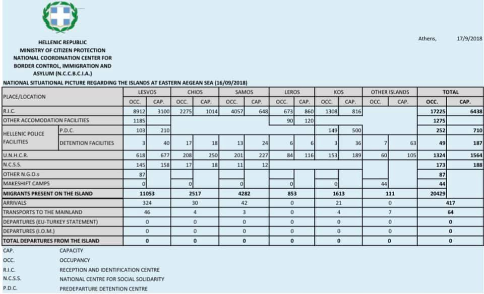
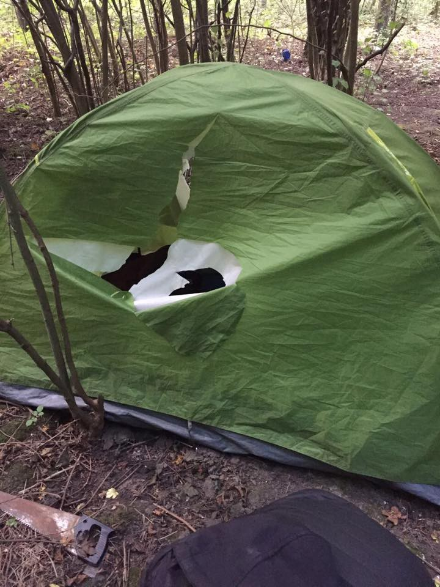
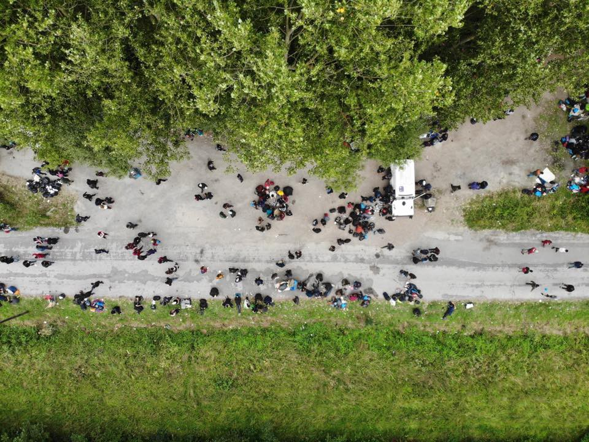
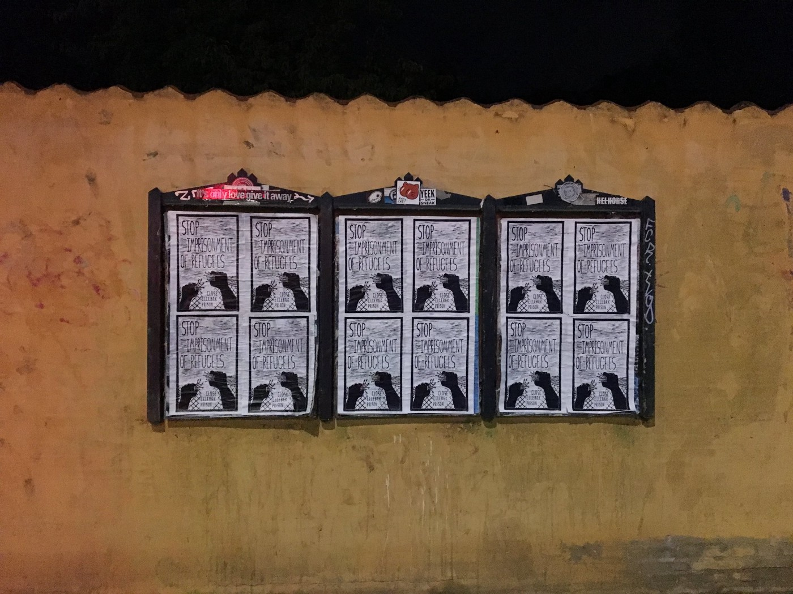
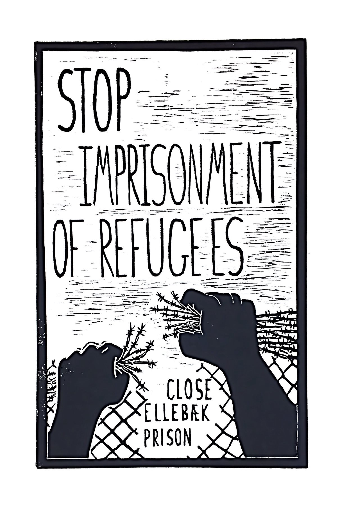

### AYS Daily Digest 17/9/18: Emergency evacuation desperately needed for people in Moria
#### Severe health issues mounting up in Moria, Lesvos — urgent evacuation indispensable / Collective suicide attempt in Austrian detention facility / EU about to send out a 10,000\-person border force to stop people from coming / New asylum\-related legislation in France / US Administration has chosen to further cut the number of refugees who will be admitted to the U\.S\. / more info and updates

 \( _Broken Childhoods_ — Photo by: [Gabriel Tizon](https://www.facebook.com/gabrieltizonfotografo/?tn-str=k%2AF) \)](assets/c7c7a93bcada/1*x7tEAZTO9UKWG4klSFq4vg.jpeg)

7 [7% of children who migrate through the Mediterranean suffer abuses\.](http://www.europapress.es/epsocial/infancia/noticia-77-ninos-emigran-mediterraneo-sufre-abusos-puerta-trasera-europa-20180415112536.html) \( _Broken Childhoods_ — Photo by: [Gabriel Tizon](https://www.facebook.com/gabrieltizonfotografo/?tn-str=k%2AF) \)
#### FEATURE — The alarming severity of the situation in Moria

The number of asylum\-seekers on Lesvos has increased to 11,053 people as 10 boats carrying a total of 615 people of various nationalities arrived at the island over the weekend\.

This increase in the number of arrivals at Lesvos, in combination with the disproportionately low departure rate to the mainland, is further exacerbating the extraordinarily difficult conditions and is contributing to the growing mental health burden of the people there\.

MSF is witnessing an unprecedented health and mental health emergency amongst the men, women and children kept in Moria\. The whole environment is unsafe and unsanitary, and as a result they see many cases of recurrent diarrhea and skin infections in children of all ages\.

> In their island prison on Lesbos, they are forced to live in a context that promotes frequent violence in all its forms — including sexual and gender\-based violence that affects children and adults\. 

In an open letter from an MSF clinical psychiatrist titled [Moria is in a state of emergency](https://www.msf.org/moria-state-emergency) , he speaks of the serious conditions the people there are struggling with and the futility of all efforts to help until the system changes:

> I see my colleagues on the ground becoming exhausted with the burden of the number and severity of these cases, as well as trying to plug the gaps in the system\. This is compounded by the fact that every day we see the asylum system breaking, the living conditions rapidly deteriorating, and the failure of the government, EU and the UNHCR to respond to this crisis\. That we have a limited ability to substantially change the situation adds to our stress\. Meanwhile, there is an ever\-increasing influx of new and more severe psychiatric cases, and I don’t believe this is likely to change soon\. Indeed, the psychiatric needs of the population will not change as long as the containment policy remains in place\. 

■■■■■■■■■■■■■■ 
> **[MSF Sea](https://twitter.com/MSF_Sea) @ Twitter Says:** 

> > #MSF teams in #Lesvos are seeing increasing cases of suicide attempts, self-harm and violence in #Moria camp. The situation is untenable, we call for the emergency evacuation of all vulnerable people to #Greek mainland and other #EU countries. 

> **Tweeted at [2018-09-17 15:28:36](https://twitter.com/msf_sea/status/1041710517864280064).** 

■■■■■■■■■■■■■■ 

The organizations present on Lesvos [demand immediate action](https://l.facebook.com/l.php?u=http%3A%2F%2Fwww.legalcentrelesbos.org%2F2018%2F09%2F17%2Flegal-centre-lesvos-joins-19-organizations-in-calling-for-urgent-action-to-address-shameful-reception-conditions-on-greek-islands%2F&h=AT3cKOgr1TC-6UatEX-GXCPEBA5xwDvzHHmkjfgLNJ01gRmX4JGKrLVZWWK-Hy14OsKyjUi81tAZrbX59ARk3ZLXiRiAQIO1nc308rDx_k5hx1oc6vD2bg04XaOZAeR1uGdN-nvoW44I4s_I0LAbPu9UMO910xkcZizHDd1TKDxdVJoUW318JtowKsIcNJUv-2tzr6GJ_x_rkwnlDe_myCLOBmlsYZKKzSVjtm6TDgbkzJ9FcYTzEWQBb9kXla6QOm3SVbLwPLDOPOGhKz_uYntm0CSgY_HjiIkSGBls6f16KJWr8q2ZuEUn9XtzEK6mz-b3HFi_sP8Gw99Fj6b-CaMcmvE13D1XiEeiPHsix80dVc5DrHiNMtHIcfNydK5NjsixYXRwcmoiHqvOWqWEpLi28Dy0MsY) from the EU and Greece to address the shameful reception conditions on the Greek islands\. Ahead of this week’s Dimitris Avramopoulos’ visit to Athens, some sources from the EC [told the media](https://www.neweurope.eu/article/eu-source-says-3000-migrants-to-be-moved-to-greek-mainland-from-crowded-island-camp/) that “more than 3,000 migrants whose geographic restrictions have been lifted are expected to leave the islands for the mainland”\.
#### SEA

■■■■■■■■■■■■■■ 
> **[Sea-Watch](https://twitter.com/seawatchcrew) @ Twitter Says:** 

> > ⭕️ UPDATE: The rubberboat, spotted yesterday by @[PVolontaires](https://twitter.com/PVolontaires) #Colibri, was eventually, after >9 hours at sea, intercepted and forcibly returned to #Libya. Once again #Italy & #EU have condoned the deaths of over 80 people and finally abandoned them to inhumane detention. https://t.co/PLhtDQnF70 

> **Tweeted at [2018-09-17 13:27:23](https://twitter.com/seawatchcrew/status/1041680014671011840).** 

■■■■■■■■■■■■■■ 

■■■■■■■■■■■■■■ 
> **[Open Arms ENG](https://twitter.com/openarms_found) @ Twitter Says:** 

> > 3 years ago we went to Lesbos for the first time. That's where it all started. 3 years later, 60.000 people abandoned in #Med are alive. 
Because at sea either a life is saved or a death is silenced.
Without your help nothing would have been possible. 
Thanks. #savinglives https://t.co/39lTRmmmtW 

> **Tweeted at [2018-09-17 11:03:39](https://twitter.com/openarms_found/status/1041643843710582784).** 

■■■■■■■■■■■■■■ 

■■■■■■■■■■■■■■ 
> **[SOS MEDITERRANEE](https://twitter.com/SOSMedIntl) @ Twitter Says:** 

> > UPDATE Due to good weather conditions and recent reports of departures, the #Aquarius is increasing speed to make herself available as soon as possible for any boats in distress in the international waters off the coast of #Libya.

#onboardAquarius 
#TogetherForRescue https://t.co/VHh18GT92E 

> **Tweeted at [2018-09-17 07:09:01](https://twitter.com/sosmedintl/status/1041584794897985536).** 

■■■■■■■■■■■■■■ 

#### ITALY

After nearly two months, the Italian media [reported](http://m.ilpiccolo.gelocal.it/trieste/cronaca/2018/09/16/news/quindici-arrivi-di-richiedenti-asilo-in-24-ore-1.17256375) 15 new arrivals of asylum seekers within 24 hours to Gorizia\.

 is organizing a solidarity protest](assets/c7c7a93bcada/1*_qxCZi1pLd83bkhKdaq1qw.jpeg)

[Chez Jesus — Rifugio Autogestito](https://www.facebook.com/Chez-Jesus-Rifugio-Autogestito-362786637540072/?tn-str=k%2AF) is organizing a solidarity protest
#### SPAIN

The NGO Caminando Fronteras has [denounced](https://www.eldiario.es/desalambre/naufragio-Mar-Alboran-Caminando-Fronteras_0_815418680.html) the death of a woman who was traveling aboard a boat rescued this Sunday by Maritime Rescue with 56 people\.

■■■■■■■■■■■■■■ 
> **[Caminando Fronteras](https://twitter.com/walkingborders) @ Twitter Says:** 

> > Ayer fue un día difícil en la #FronteraSur:

🔸En el Estrecho alertamos de una patera de 12 personas (cuyo rescate se desconoce si lo hizo Marruecos) y otra de 8 personas (desaparecidas desde el sábado) https://t.co/o6qKq6ClCJ 

> **Tweeted at [2018-09-17 07:44:22](https://twitter.com/walkingborders/status/1041593689485783040).** 

■■■■■■■■■■■■■■ 

#### GREECE
### Samos

In their [Report № 4 “Access to Justice”](https://rlc-deutschland.de/worrisome-developments-at-europes-outer-borders-report-nr-4-zugangzumrecht/) the RLC Berlin compiled a text to depict and document issues the people deal with during their asylum request appeals and life on the island\.

On Samos there is only a handful of migration lawyers, who are already overworked, filing appeals for many of the 3,800 refugees currently on the island\. No other independent organization has been continuously offering individual legal counseling on Samos\. While Greek authorities make a short presentation on the asylum procedure, refugees recount that for questions they are referred to an info booth in the camp — no more than a container with a window through which questions can be asked\. Due to the long queues, privacy concerns and doubts about the independence of these legal information facilities, they are inadequate in every way imaginable\. Hence, most refugees have been going into interviews without the opportunity to adequately prepare themselves for the proceedings\.
Finally, living conditions in the hopelessly overcrowded camp — designed for about 700 people — are such that adequate preparation appears challenging in any case\.
Reportedly, there are expected to be over 500 transfers from Samos in the next few days\. This is partly to prepare for a massive anticipated influx of people from Idlib\.
### Athens

■■■■■■■■■■■■■■ 
> **[City Plaza Squat](https://twitter.com/sol2refugees) @ Twitter Says:** 

> > 2 fascist attacks in 2 days! 
15/09 a Geek  and 16/09 a Migrant victims of fascist attacks in Athens!

All in the days of anniversary of Paulos Fyassas murder by fascist! 

No Passaran fascism https://t.co/ZTT2W7MZAx 

> **Tweeted at [2018-09-17 21:34:46](https://twitter.com/sol2refugees/status/1041802668564471809).** 

■■■■■■■■■■■■■■ 

### Volunteering

[Irida ίριδα إريدا](https://www.facebook.com/IridaWomensCentre/?hc_ref=ARSQ0Z7PRt6YdKKkySlBO2_tJMfPN4iTUKuPG-g2fLkL8j9-HU1AKgtJfTOKlDD-S0Y&fref=nf) is urgently seeking female English and Greek teachers to begin immediately\. The minimum requirement is three hours per week\. “We strongly prefer a long term commitment: three months would be ideal\.”
Contact them at: info@intervolvegr\.com
#### BULGARIA

[The Refugee Project/ Проект Бежанци](https://www.facebook.com/refugeeproject/?fref=mentions&__xts__%5B0%5D=68.ARA1sIn8QtxxiyCj1yKlL1lxj-Au2RGk1FOu2AjJhYNpKVgQWMiDA1FjFZs0D7Uiw_o8bXR9Pkj4j2H9fDIKKBB5wYCbcmHbo6DQKF9WaPdQ_tR1rUr-ibx5Q9TFmQEkG0A2fygsa2Bax9b_v_2JtWO2UC7gc28tE4KPugKQQQnWSFopgy-SnQ&__tn__=K-R) is looking for volunteers\!
Bulgaria is one of the countries in the EU where not many organizations have decided to set up their teams and continue work, in so far they had been present in the area at all, given the amount of violence some have seen there and imminent threats some of the organizations previously told us about\. That is why every chance to help and work with the refugees in that country is a valuable starting point to turn things around and change the overall perception\.
#### AUSTRIA
### A collective suicide attempt in the face of deportation

The [media have reported](https://www.dw.com/en/austria-six-men-attempt-suicide-in-face-of-deportation/a-45503042?utm_source=Refugees+Deeply+News+Digest&utm_campaign=386634598b-EMAIL_CAMPAIGN_2018_09_17_10_03&utm_medium=email&utm_term=0_b1bdf60a15-386634598b-117931625) that six men who were scheduled to be deported from Austria were brought to local hospitals in critical condition late on Friday after apparently setting fire to their cells in a Vienna detention center\. According to local media, a suicide note signed by the entire group was found by investigators\.
#### FRANCE
### Changes in the Asylum Law

ECRE reports about the new legislation in France that amends several articles of the French Code of Entry and the Stay of Foreigners and the Right to Asylum \(Ceseda\), and although not immediately, it will take effect on a number of aspects of the asylum procedure\.
- The previous right to protection from removal for one full day will no longer be available to persons refused entry at land borders, putting them at risk of immediate removal\. This change has significant consequences as official figures have shown that the majority of asylum claims made at the border are rejected during the border procedure\.
- The deadline by which a person can appeal a Dublin transfer decision has been restored from seven to 15 days\.
- The national reception system will set out a distribution mechanism across regions, allocating the share of asylum seekers to be accommodated by each region\. If a region exceeds its designated capacity, persons can be removed to a different region, with rights to material reception conditions dependent on their compliance\. Permission for a person to temporarily leave their assigned region will have to be granted by OFII\.
- People seeking asylum will now be entitled to formal access to the labour market after six months, as opposed to the previous waiting period of nine months, and access to the rights attached to international protection status will be immediate after being granted protection and no longer dependent upon civil registration with OFPRA\.
- Beneficiaries of subsidiary protection will now be entitled to a multi\-year residence permit of up to four years, after which they will be eligible for a 10\-year residency card, rather than only being granted one\-year residence permits as prior to the reform\.
- There have also been changes made to family reunification policies, meaning that unaccompanied children who are beneficiaries of international protection may be joined by their parents\.

### Dunkirk

The [Mobile Refugee Support](https://www.facebook.com/MobileRefugeeSupport/?hc_ref=ARQCOB4Vt71KoUtS2jsrW0fVNJGpMBf2iaz6I_eKx_cO4gRjo-40ztPQQINNEhlU56A&fref=nf&__xts__%5B0%5D=68.ARBBlNELuOnpgHI2POpqJRZX7mRsxFaBxS3xaouK0kPTd3ZQ00b8cakbPmVmtdKCKhSX3siyNOPlN642BELHHLKbA32t1qU6R2FwYodlMdWiyO8ZQrCgUqwB2C1h91ED5AZ_CL1QHKGeW7k6jmuVOZeOnUztjOCQNjvn2LPt-NcekpSoJtcd&__tn__=kC-R) team reported from the area:

> Following meetings with the Sous\-Prefecture and Mayor, there has been a reduced police presence in the Dunkirk area\. This has meant normal services have once again resumed at an “agreed” location\.
 

> Grande\-Synthe City Hall has fortunately installed a water point, easing the pressure on the [Refugee Community Kitchen](https://www.facebook.com/refugeeCkitchen/?fref=mentions&__xts__%5B0%5D=68.ARBBlNELuOnpgHI2POpqJRZX7mRsxFaBxS3xaouK0kPTd3ZQ00b8cakbPmVmtdKCKhSX3siyNOPlN642BELHHLKbA32t1qU6R2FwYodlMdWiyO8ZQrCgUqwB2C1h91ED5AZ_CL1QHKGeW7k6jmuVOZeOnUztjOCQNjvn2LPt-NcekpSoJtcd&__tn__=K-R) , who already bear the responsibility of so much\. Large distributions of essential NFI \(non\-food items\) by [Help Refugees](https://www.facebook.com/HelpRefugeesUK/?fref=mentions&__xts__%5B0%5D=68.ARBBlNELuOnpgHI2POpqJRZX7mRsxFaBxS3xaouK0kPTd3ZQ00b8cakbPmVmtdKCKhSX3siyNOPlN642BELHHLKbA32t1qU6R2FwYodlMdWiyO8ZQrCgUqwB2C1h91ED5AZ_CL1QHKGeW7k6jmuVOZeOnUztjOCQNjvn2LPt-NcekpSoJtcd&__tn__=K-R) and [Care4Calais](https://www.facebook.com/care4calais/?fref=mentions&__xts__%5B0%5D=68.ARBBlNELuOnpgHI2POpqJRZX7mRsxFaBxS3xaouK0kPTd3ZQ00b8cakbPmVmtdKCKhSX3siyNOPlN642BELHHLKbA32t1qU6R2FwYodlMdWiyO8ZQrCgUqwB2C1h91ED5AZ_CL1QHKGeW7k6jmuVOZeOnUztjOCQNjvn2LPt-NcekpSoJtcd&__tn__=K-R) have been gratefully received\. [Refugee Info Bus](https://www.facebook.com/RefugeeInfoBus/?fref=mentions&__xts__%5B0%5D=68.ARBBlNELuOnpgHI2POpqJRZX7mRsxFaBxS3xaouK0kPTd3ZQ00b8cakbPmVmtdKCKhSX3siyNOPlN642BELHHLKbA32t1qU6R2FwYodlMdWiyO8ZQrCgUqwB2C1h91ED5AZ_CL1QHKGeW7k6jmuVOZeOnUztjOCQNjvn2LPt-NcekpSoJtcd&__tn__=K-R) has been on\-site regularly with additional charging facilities and their usual services\. The [Refugee Women’s Centre](https://www.facebook.com/refugeewomenscentre/?fref=mentions&__xts__%5B0%5D=68.ARBBlNELuOnpgHI2POpqJRZX7mRsxFaBxS3xaouK0kPTd3ZQ00b8cakbPmVmtdKCKhSX3siyNOPlN642BELHHLKbA32t1qU6R2FwYodlMdWiyO8ZQrCgUqwB2C1h91ED5AZ_CL1QHKGeW7k6jmuVOZeOnUztjOCQNjvn2LPt-NcekpSoJtcd&__tn__=K-R) has been ever\-present as always supporting the rapidly growing number of families who are returning each day\. 

> Despite this slight regained stability, many essential items are desperately needed\. 

](assets/c7c7a93bcada/1*QRWyPF4wWYDuTX3QG2LEnA.jpeg)

Photos: [Mobile Refugee Support](https://www.facebook.com/MobileRefugeeSupport/?hc_ref=ARQCOB4Vt71KoUtS2jsrW0fVNJGpMBf2iaz6I_eKx_cO4gRjo-40ztPQQINNEhlU56A&fref=nf&__xts__%5B0%5D=68.ARBBlNELuOnpgHI2POpqJRZX7mRsxFaBxS3xaouK0kPTd3ZQ00b8cakbPmVmtdKCKhSX3siyNOPlN642BELHHLKbA32t1qU6R2FwYodlMdWiyO8ZQrCgUqwB2C1h91ED5AZ_CL1QHKGeW7k6jmuVOZeOnUztjOCQNjvn2LPt-NcekpSoJtcd&__tn__=kC-R)

[Help Refugees UK / L’Auberge Des Migrants](https://www.charityjob.co.uk/recruiter/help-refugees-uk-l-auberge-des-migrants/33648) is looking for a Communications Intern\. More info [here](https://www.charityjob.co.uk/volunteer-jobs/help-refugees-uk-l-auberge-des-migrants/communications-intern/590602?tsId=1&rankId=2) \.
#### GERMANY

On Sunday, thousands of [people demonstrated in](https://www1.wdr.de/nachrichten/rheinland/demo-koeln-asyl-und-fluechtlingspolitik-100.amp) the city of Cologne for a more human asylum system\. 
\(…\) According to the organizers, 7000 people attended the initial protest which took place next to the Cologne Cathedral\. 
\(…\) Around 12,000 people participated in a protest concert later that day\.
#### DENMARK

“Be part of showing resistance by downloading the file and printing your own A3 posters” — [Close Kærshovedgård Deportation Camp](https://www.facebook.com/CLOSEKGH/?__xts__%5B0%5D=68.ARCFVckSiAGDoihioL3QL6d5aYpOFUU69eHOe_A9Vfhag4329JpH3vPMji0E97UZX2RUy5HVqfmD4KFinKfkXFfjXMT0pphZL8Xv4_vvgF6AANb6iLefOpRP19-4Cequ2Y5wHjKt0Xx3iz-5Ibi7a5F1D2uObqa70Fb46VJ1Z2Nkl2KPJKDDXw&__tn__=k%2AF&tn-str=k%2AF)

#### UK

[Asylum Matters](https://www.facebook.com/AsylumMatters/?fref=mentions&__xts__%5B0%5D=68.ARCEibF__Pe3wO9M5HYMpIYwu0ISUC2y4R5A4MSVegZSMS8Mn1KtGXKQKfE2dZ6bKjXDnUxrn-sKZkIC1d9fX1LI0ITWN6SUN_7B7faeXhwF3wIIgE8ExRKjppGZwjMMkrFR8m2nmrM0TWsSy7g0O6vgP6UXbS4GnMT8Zjf5KYYP0AWi0XRcsQ&__tn__=K-R) is calling on the government to give greater responsibility to local authorities in the provision of asylum accommodation\. The campaign is also calling on the Home Office to end the policy of bed\-sharing in asylum accommodation\. Read more about their campaign and key asks [here](https://l.facebook.com/l.php?u=https%3A%2F%2Fcityofsanctuary.org%2Fwp-content%2Fuploads%2F2018%2F09%2FBriefing-for-MPs-on-Asylum-Accommodation-Contracts.pdf&h=AT2I2xRZ0F-xbl1jDGCxXfOCTVv2NKymQ3xttOukOfOls3evXkpqaTn9rLg6U8tyIUq27qCKH92YrGW4aOLwN2btXV2Tg-8Q9BTsEC-AD2bO2-Cznj6FAty_ovp419p9-r9_D_cdQCfabRJCUBcWPSfTP1xJLhqnRgA-ZOqAOaUifg8r7pQl8vpB5roMwNsdpSIa8BCWdYpRMJXXDkL99R8tnSw-ovvpMVCBonZ2VUcc2TsW80YF8AXwqFdgMlMZG4HDxpxpOCOu9hYa1B2HedQjL_GD03AFG-eMNTPJuie65IbdJ-L47ctcDIiOzbCNXkh8yAWH5W-e66hMqxQ3AUR6LBi0wVr7mLgPklxn67KM3NGvS7VmoEv6EbB8vnn8-ONOiGIKHLwnTznwtRD1eCagewHNVd0) \.
#### EU
### Strengthening the Fortress

The German chancellor and Austrian PM agreed Sunday to back the creation of a 10,000\-person EU border force and cooperate with African states to stem migration flows\. “There can be no open borders within Europe without the proper protection of external EU borders,” Kurz [said\.](https://euobserver.com/tickers/142862) Morocco, which stopped 65,000 people from coming to the EU last year, is to get €236 m in EU aid to stop others\.
#### US
### The ‘most powerful country’ cutting the help to the most vulnerable people of our time

The US administration has chosen to further cut the number of refugees who will be admitted to the U\.S\., undermining a powerful tool to help the most vulnerable populations, aid the most unstable regions, and advance U\.S\. security and strategic interests, [IRC has stated](https://www.rescue.org/press-release/us-administration-announces-intention-cut-refugee-cap-again-humanitarian-needs-grow?edme=true) \.
They have officially announced the intention to lower annual refugee admissions to 30,000 in FY2019, a 33 percent drop from 2018’s record\-low ceiling of 45,000\.

> In so doing, the United States is not only abdicating humanitarian leadership and responsibility\-sharing in response to the worst global displacement and refugee crisis since World War II, but compromising critical strategic interests and reneging on commitments to allies and vulnerable populations, including religious minorities and those whose lives are in danger because they assisted U\.S\. troops and U\.S\. missions overseas\. 

**We strive to echo correct news from the ground through collaboration and fairness\.**

**Every effort has been made to credit organizations and individuals with regard to the supply of information, video, and photo material \(in cases where the source wanted to be accredited\) \. Please notify us regarding corrections\.**

**If there’s anything you want to share or comment, contact us through Facebook or write to: areyousyrious@gmail\.com**

_Converted [Medium Post](https://medium.com/are-you-syrious/ays-daily-digest-17-9-18-emergency-evacuation-desperately-needed-for-people-in-moria-c7c7a93bcada) by [ZMediumToMarkdown](https://github.com/ZhgChgLi/ZMediumToMarkdown)._
