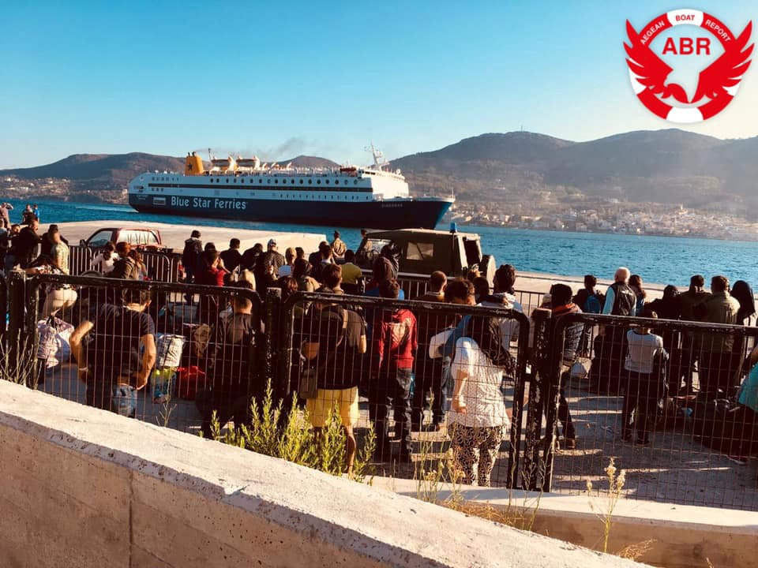
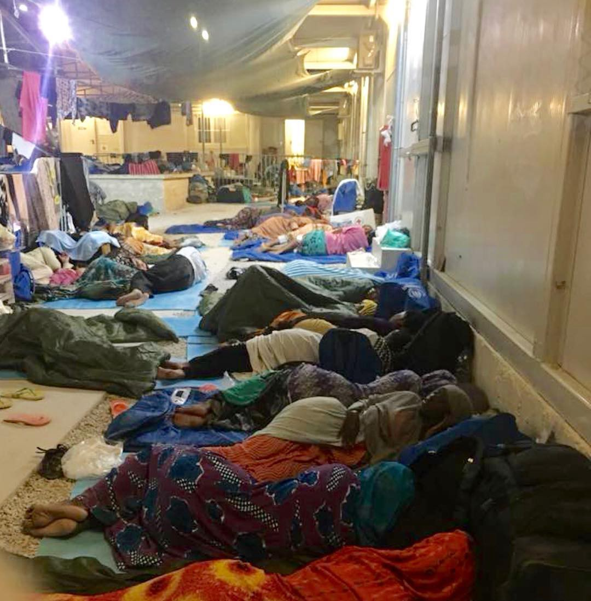
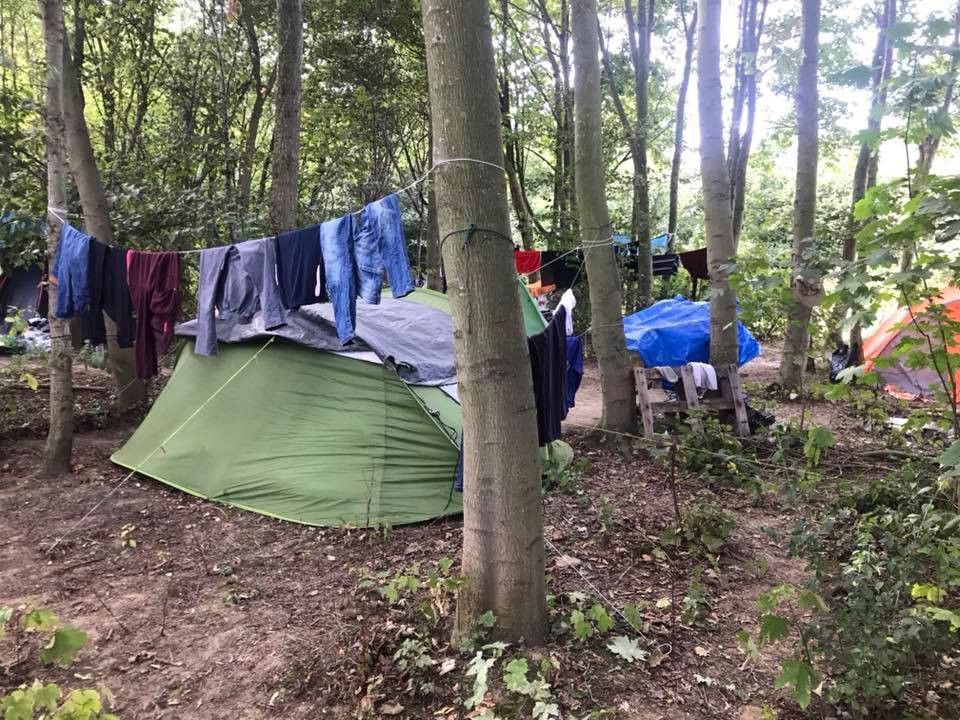
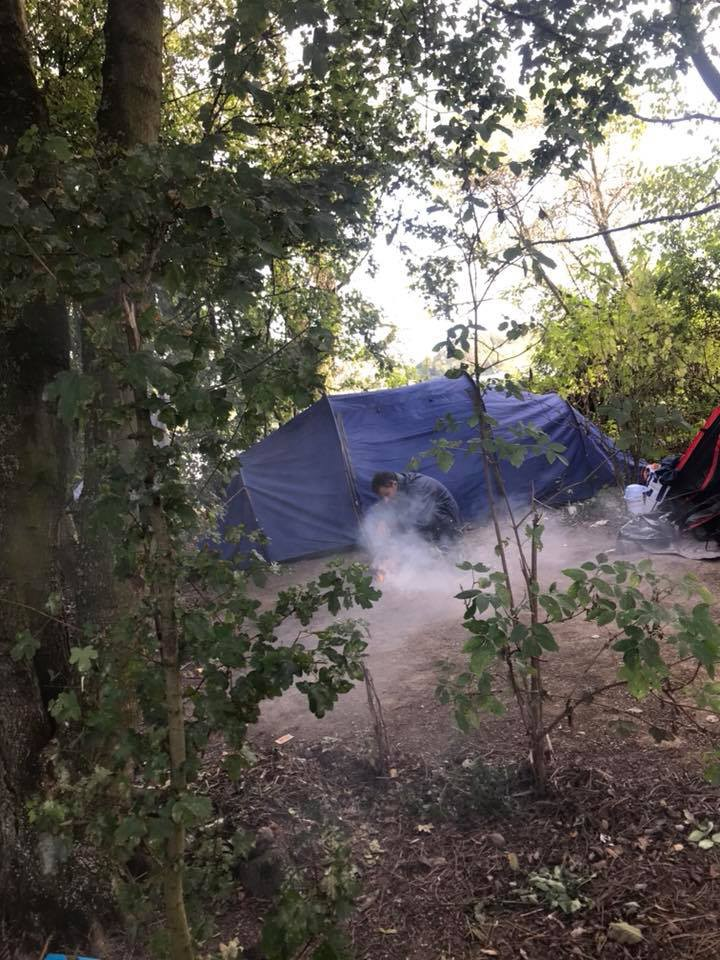

### AYS Daily Digest 19/09/2018: At Salzburg Summit, EU leaders once more push border externalization
#### Human rights violations continue in Morocco // Transfers to the mainland — and then what? // Aid Brigade needs help in Bosnia // Arrivals to Spain and Greece outstrip Italy // The passengers of the Aquarius 3 months later // Winter is coming in Calais

Transfers from Samos to the mainland\. Source: Aegean Boat Report\.

When it comes to stopping refugees in their tracks, EU council leader Donald Tusk thinks that everybody should be a bit more like Egypt\.

At the informal Salzburg summit where EU leaders have gathered to discuss migration this week, Tusk exhorted EU members to stop the “blame game” \(an implicit nod to Italian Interior Minister Matteo Salvini’s claims that Italy is picking up other countries’ slack when it comes to arriving refugees\) and start working together and with foreign nations to [“solve the problem of illegal migrant flows\.”](https://af.reuters.com/article/worldNews/idAFKCN1LZ29S)
#### In other words: a stronger external border\. Even better if that border effectively lies outside the bounds of Continental Europe\. In a repeated tactic of “border externalization,” the EU has struck deals with Turkey, Libya, and other countries that lie on its outskirts in order to ensure that the “problem” remains elsewhere\.

As Tusk noted, Egypt has performed admirably on this count, with only around 30 people coming from its shores to Italy and Greece at last count this year **—** even in the absence of financial incentives from the EU to sweeten the pot\. “This is a partner which is taking its responsibility seriously, a partner we can work with in the context of migration even more,” Tusk said\. Egypt, of course, is in control of an authoritarian leader who restricts free speech and targets his critics — a country with few economic prospects for its own citizens and fewer still for the over [100,000](https://euobserver.com/migration/142878) Syrian refugees who live in overcrowded slums there\.

Tusk went so far as to laud Egypt for its crackdown on smugglers, noting that “Egyptian authorities have made the fight against smuggling and trafficking their priority\. As a result there have been no irregular departures from Egypt to Europe this year\.” The refugee crisis isn’t a crisis as long as it’s not happening on Europe’s shores, or so the thinking goes\.

Interestingly, a Pew Research Center [study](http://www.pewresearch.org/fact-tank/2018/09/19/a-majority-of-europeans-favor-taking-in-refugees-but-most-disapprove-of-eus-handling-of-the-issue/) that was released yesterday, while the Salzburg summit was in full swing, showed that most Europeans are in favor of accepting refugees — what they’re not on board with is the way the EU has handled the entire affair\. The majority of people in every surveyed country had an negative opinion of the EU’s overall response to the phenomenon of increased numbers of asylum seekers; 71% of Spaniards, 78% of Italians, and a whopping 92% of Greeks surveyed disapproved\. These statistics suggest, as Gabriela Baczynska and Francois Murphy [write](https://af.reuters.com/article/worldNews/idAFKCN1LZ29S) , that the oft\-referred to “migration crisis” is as much of a political crisis for the EU as it is anything\. Unfortunately, it is too often individual refugees’ lives and futures that hang in the balance\.
#### Morocco
#### Meanwhile, in Morocco, the human toll of the very border externalization that the EU has encouraged — and paid for — can be seen nearly every day\.

In [Tangier](https://www.facebook.com/watchthemed.alarmphone/photos/a.1526182797655958/2221344938139737/?type=3&__tn__=-R&hc_location=ufi) , an Alarm Phone member was brutally beaten by Moroccan armed forces and taken by force to the southern border along with a number of other migrants\. On the Achakar beach, a group of migrants were aggressively [rounded up](https://twitter.com/alzoubeidi/status/1042532634046488576) by machine\-gun toting police\. And, perhaps most disturbingly, around 50 migrants were [visited](https://www.facebook.com/AmdhNador/photos/a.1693125780899690/2188451314700465/?type=3&theater) by representatives of their home countries in jail — in order to take photocopies of their documents and encourage them not to attempt the crossing to Europe\. According to the Association Marocaine des Droits Humaines, the migrants in question remain incarcerated\.

■■■■■■■■■■■■■■ 
> **[Ali Zoubeidi](https://twitter.com/DrAZoubeidi) @ Twitter Says:** 

> > Intervention musclée des #forces auxiliaires contre des #migrants  à la plage d’achakar à #Tanger . 
#migration #maroc #espagne https://t.co/9pvsmptiai 

> **Tweeted at [2018-09-19 21:55:23](https://twitter.com/alzoubeidi/status/1042532634046488576).** 

■■■■■■■■■■■■■■ 

#### Turkey

HarekAct [reports](http://harekact.bordermonitoring.eu/2018/09/19/deportation-monitoring-aegean-and-legal-centre-lesbos-publish-joint-report/) that Deportation Monitoring Aegean and the Legal Center Lesbos have published a joint report that details abuses on the islands and discriminatory deportation procedures and calls on the EU to halt deportations to Turkey, among other demands:

> We demand the European Union and the Greek State to: 

> **• Provide transparency and information about deportations** 

> **• Stop deportations to Turkey — It is not a safe country** 

> **• Stop inhumane “voluntary” return practices** 

> **• Stop the EU\-Turkey Deal and allow migrants to leave the Greek Islands** 

> **• Stop the detention of migrants** 

#### Sea

Colibri and Aquarius are the only two civilian rescue operations left in the Mediterranean\. Pilotes Voluntaires are asking for donations to fund continued missions\. Find out more information about the organization [here](https://www.facebook.com/pilotesvolontaires/) \.

IOM has released a report on protection of migrants at sea, which can be downloaded in pdf form here:

#### Greece

Refugees sleep on the floor inside an overcrowded warehouse in Moria Camp on Lesvos\. Credit: Katelyn Ray\.

After a recommendation was issued that conditions in Moria must be significantly improved within the next 30 days or the camp would be closed down entirely, transfers to the Greek mainland have once more begun **\.** According to some sources, some 3000 people will be allowed to leave Lesvos in the coming days and weeks\. This morning alone, 290 people were transferred from Samos, the site of the most drastically overcrowded hotspot, according to IOM\.

In theory, this seems like a positive development, but the reality is that people are being sent to camps all over Greece without plans for their arrival or announcement given in advance to organizations in the camps\. One of the places where people are being brought is Skaramagas, near Athens\. Around 300 people have arrived in the past week, including many families\. Volunteers in the camp told AYS that people who are arriving from Lesvos, especially children and young men, are visibly in distress\. Some volunteers say that the way they behave toward both volunteers and camp residents is noticeably tense, even violent\. There are no psychologists or trained support staff on hand to deal with the trauma that these people suffered on Lesvos\.

The biggest issue is that people coming from Lesvos have no information about what they have to do once they arrive\. Some of them have received interview dates, but don’t know where to go at the appointed hour\. Likewise, there is no one in Skaramagas to provide legal advice or help deal with this sort of issue\.

According to the info AYS has received, people should look carefully on their “white card” or _khartia,_ which should indicate which Asylum Service is in charge of their case\. We were also told that it’s possible that some might have to return to Lesvos for their interviews\. If they don’t do so, their cases will be automatically closed with the possibility to re\-open them within nine months \(though the Greek Asylum Service states that if their cases were closed due to their actions, there is no possibility to re\-open\) \.

Nevertheless, people who are transferred to Skaramagas are not arriving at the place where they will finally find peace — far from it\. It is a big camp, with about 2,500 people, living mainly in caravans\. Skaramagas is reasonably close to Athens, but with limited public transport available\. What’s more, the security in the camp was removed for couple of months and the place became dangerous, with many people staying inside who are not even registered as residents\. Volunteers and NGOs working inside are saying that it is a regular occurrence for them to be evacuated from the camp or make the decision not to come in on certain days\. Also, so far each family has had his own caravan, for the most part, but with new arrivals, some people have been forced to share their caravan with another family, which tends to create tension and lead to greater discord in the camp\.

Drop in the Ocean is one of the groups inside, and they are doing their best to help families and children\. They informed AYS that since last week when people from Moria started coming, the increase in number of babies and small children in the camp is visually apparent\. It is unclear if more will be transferred to this camp, which has a maximum capacity of 3,000\.

And, of course, there is the larger absurdity of speeding up transfers when arrivals to the islands persist, and asylum seekers lack freedom of movement throughout Greece\. As Refugee Support Aegean [noted](https://twitter.com/rspaegean/status/1042303690995064832) on Twitter, “The transfer of of more refugees in the mainland from overcrowded islands is going to be another temporary patch to this crisis situation as long as Greece and the EU persist with applying the geographical limitation policy\.”

Séan Binder, one of three solidarity workers who stands accused of participating in human trafficking for his work with Emergency Response Centre International on Lesvos, will be kept in prison for at least 40 more days in prison after his appeal for temporary release was [denied](http://www.thejournal.ie/cork-activist-accused-of-helping-migrants-into-greece-illegally-detained-for-at-least-another-40-days-4209343-Sep2018/) \. Binder faces a maximum sentence of 20 years in prison\.

The Hope Project on Lesvos needs donations for their warehouse\! Find out more information [here](https://www.facebook.com/HopeProjectKempsons/photos/a.1659118077702651/2172398469707940/?type=3&__tn__=-R&hc_location=ufi) \.
#### Italy

Arrivals to Spain and Greece are both outpacing those to Italy, InfoMigrants [reports](http://www.infomigrants.net/en/post/12057/spain-has-most-migrant-arrivals-in-europe-greece-surpasses-italy) , perhaps in part due to Italy’s controversial ban on the disembarkation of rescue ships\. Today, member of Open Arms, Sea Watch, and MSF visited the Italian Chamber of Deputies in order to protest the criminalization of humanitarian rescue boats\.

■■■■■■■■■■■■■■ 
> **[Open Arms ENG](https://twitter.com/openarms_found) @ Twitter Says:** 

> > "There are no eyes anymore to witness the human rights violations". Today @[openarms_fund](https://twitter.com/openarms_fund) @[seawatchcrew](https://twitter.com/seawatchcrew) @[MSF](https://twitter.com/MSF)  at the Italian Chamber of Deputies, to denounce the criminalization of solidarity and aid in the Mediterranean Sea. https://t.co/CjFtRO5FjR 

> **Tweeted at [2018-09-19 14:37:21](https://twitter.com/openarms_found/status/1042422398455300097).** 

■■■■■■■■■■■■■■ 

#### Spain

InfoMigrants also [reports](http://www.infomigrants.net/en/post/12091/no-asylum-request-from-people-rescued-by-aquarius-has-been-decided-on-yet) that none of the people aboard the Aquarius’ infamously prolonged rescue excursion — 608 of whom formally requested asylum after finally being allowed to leave the ship in June — has yet to receive a response to their asylum request\. This delay is not unsurprising, given the extremely high rate of arrivals to Spain so far this year, but it does underscore the impossibility, even absurdity, of evaluating asylum requests while the applicants are still onboard their rescue ships, as Salvini and his Austrian counterpart, Herbert Kickl, have [suggested](https://www.dw.com/en/austria-italy-propose-processing-refugees-on-ships/a-45496615) \.

Reporter Anelise Borges interviewed Reward, the last person to disembark the Aquarius in June, who’s now living in Bilbao, Spain, as he waits for the ruling that will decide his fate\. “This is the beginning, the first step” on the way to achieving his ultimate dream of becoming a pilot, he tells her, but “it could take a really really long time\. It might happen, but I don’t know\.” Meanwhile, he is plagued by memories of his friend, who died while in prison in Libya\.

#### France

Makeshift campgrounds in the forests surrounding Calais\. Credit: Calais Refugee Aid\.

The organization Calais Refugee Aid steels itself for winter, [noting](https://www.facebook.com/CalaisRefugeeAid/posts/1879693598762830?hc_location=ufi) that there are still people, including children, arriving in the region regularly, and no one has adequate supplies for the wind, rain, and frigid nights that lie ahead in the coming months\. They also report that there are more and more refugees in need of medical attention in the area\.

A man attempts to light a small campfire in the woods of Calais\. Credit: Calais Refugee Aid\.

Since their “roots” initiative began earlier this year, the Refugee Women’s Centre has distributed at least 80 power banks and a number of solar torches to refugees in the Grand Synthe area, for whom the ability to charge their phones — both tools for navigation and survival, and links to distant family members — is as elusive as it is essential\. They are now looking for monetary donations in order to purchase more power banks, as well as old laptop batteries\. Find out more information [here](https://www.facebook.com/refugeewomenscentre/posts/514041239021511?hc_location=ufi) \.

With so many requests from humanitarian organizations for much\-needed funds and long\-term volunteers, it can be difficult to know how to help out if you’re not on the ground and don’t have the funds to donate cash\. Here, Care4Calais provides a brief list of steps that anyone can take to help refugees and asylum seekers:

#### Belgium

Volunteers needed to serve food daily at Serve the City Brussels — drop them a line at haren@servethecity\.be or find out more information [here](https://www.facebook.com/stcbrussels/posts/1864144377012211) \.

**We strive to echo correct news from the ground through collaboration and fairness\.**

**Every effort has been made to credit organizations and individuals with regard to the supply of information, video, and photo material \(in cases where the source wanted to be accredited\) \. Please notify us regarding corrections\.**

**If there’s anything you want to share or comment, contact us through Facebook or write to: areyousyrious@gmail\.com**

_Converted [Medium Post](https://medium.com/are-you-syrious/ays-daily-digest-19-09-2018-at-salzburg-summit-eu-leaders-once-more-push-border-externalization-78410a342d4e) by [ZMediumToMarkdown](https://github.com/ZhgChgLi/ZMediumToMarkdown)._
