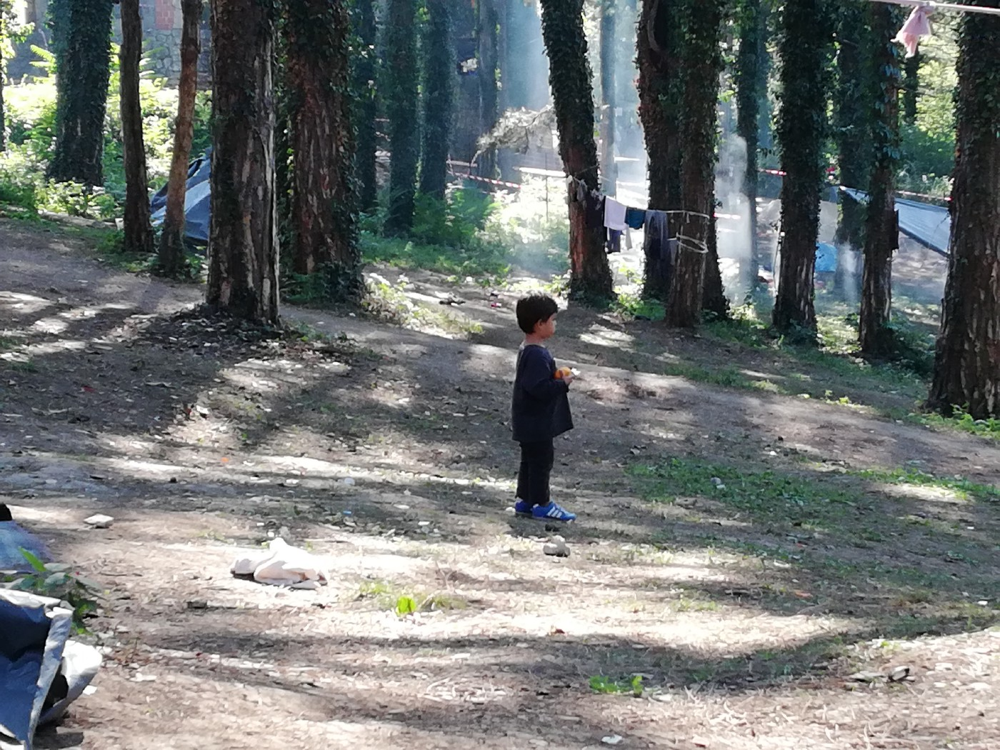
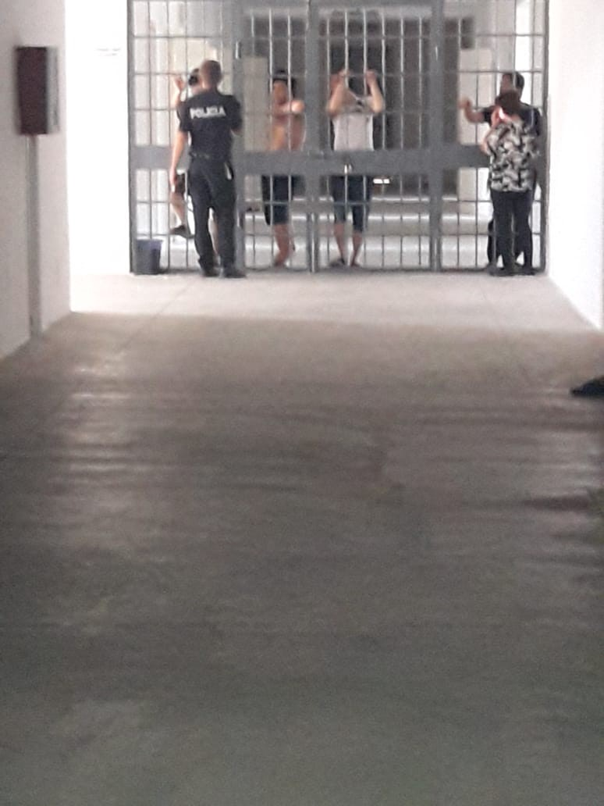
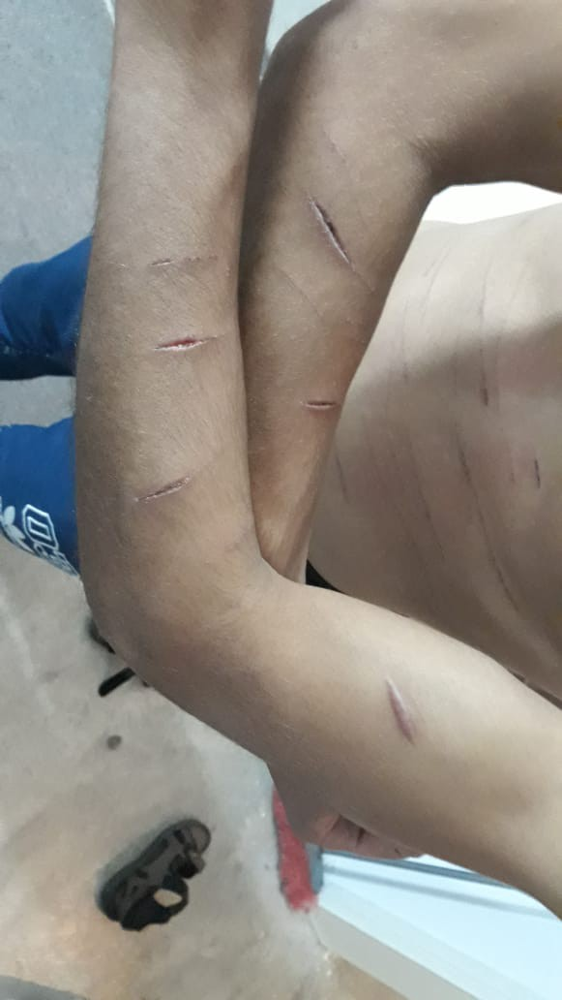
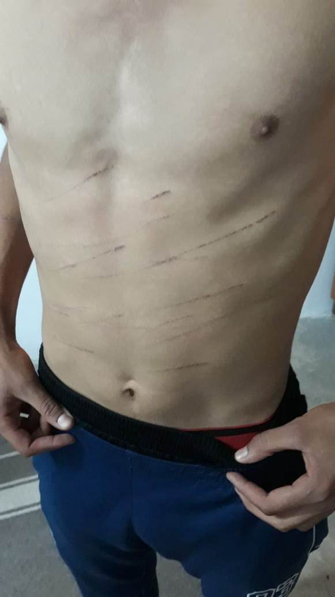
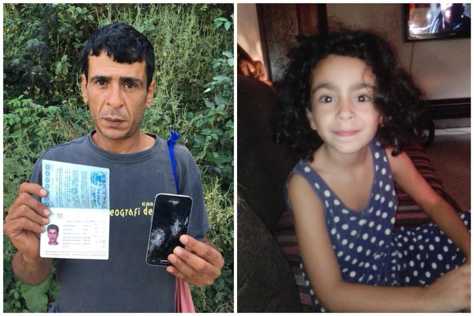
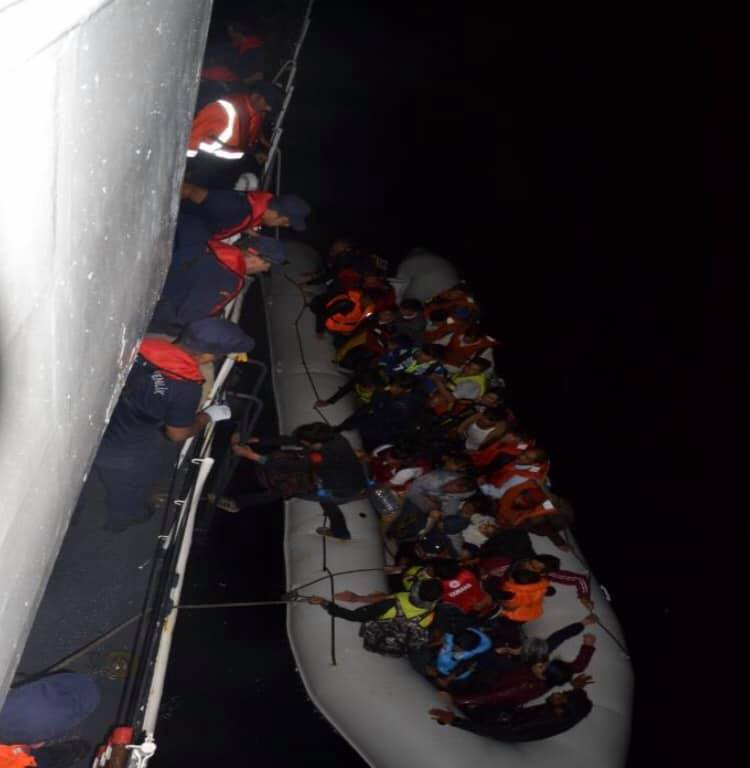
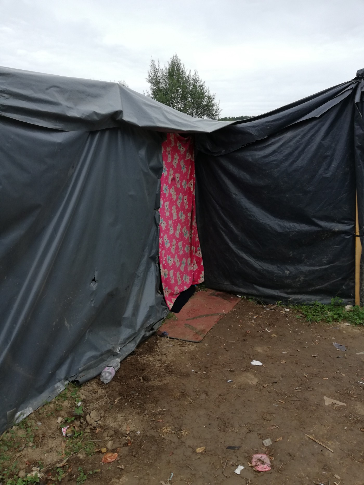
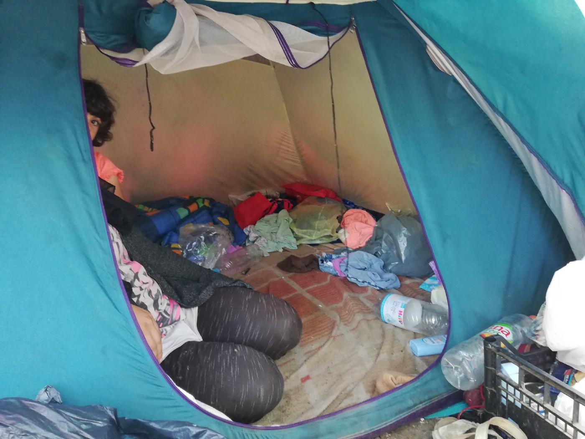
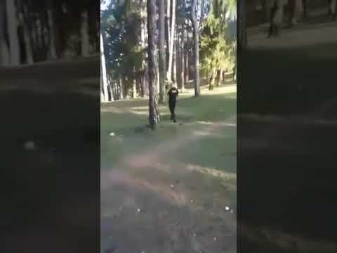

### AYS NEWSLETTER: Weekend Digest 22\-23/9/2018 Asylum seekers in Albania held in prison\-like facilities

_And: Asylum seekers from Syria tried to commit suicide in Albanian closed center // Transfer of people from islands to the mainlands continues in Greece // Violence against people on the move in Bosnia // The right to family life applies to everyone, including refugees and migrants, the Council of Europe warns // Help is needed in Greece, Bosnia, France, Italy…_

Bihac, make shift camp Borici\. Photo AYS\.
### Feature

At the end of the last week, an activist from Albania reached out to AYS saying that **32 people are held in an immigration center, a closed facility near Kakavije, the border crossing with Greece** \. Later on, one person who is inside the center also got in touch with AYS to tell us about the cruel conditions and treatment of the people in this place\.

The information given is that eight people from Syria, two from Palestine, five from Algeria and 17 from Pakistan, are held in the center\. The Syrian man who contacted AYS told us that he, as well as many others, have asked for asylum, but they have\. been put in this center with no freedom of movement, limited possibility to contact anybody or to receive visits\.

For several hours a day they have access to their phones and WiFi\. Apparently, Syrians in the center stay for less time than the others, about 14 days, and after that they are pushed back to Greece\. Others stay between 3 and 6 months\.

“I am ready to do anything to get out of here,” D\. told us in a short conversation\. He has been held in this place for 10 days, and was promised that this week he and other Syrians will be sent back to Greece\.

Since his arrival, he has not seen any representatives from the UNHCR or IOM; or any NGO which deals with refugees\. He did not get any information about the procedures or his rights in Albania\.

Due to very harsh conditions, last week people in the center organized a sit\-in protest, but the guards punished them and four of them were put in solitary confinement for two days\. Due to very bad conditions and cruel treatment, some people in the center are self harming themselves, or have tried to kill themselves\.

“We cannot do anything\. Just wake up, eat and sleep,” D\. told AYS\. “We do not get enough food, and what we get is good just to keep us alive\. I tried to commit suicide here but I did not care about anyone and my friend also beat himself with the knife but also, nobody did not care\.”

AYS tried to double check this information, but very little is available about the situation for people on the move in this country\. The activist who contacted us visited the center confirming that visits are not allowed, saying that visitors can come close to the gate and see the person they came to visit for a short period of time\. It is allowed for visitors to bring basics to people inside, but forbidden to bring Albanian SIM cards\.

Albania is hardly the first choice for people on the move\. Even more, many people from Albania, one of the poorest countries in Europe, are among those on the move\.

This year, since the new Balkans route emerged, Albania received significant numbers of people, with most of them were on their way towards EU countries\. In Tirana, the capital city, there is one asylum reception center\. According to the official figures, from January to May this year, over 2,300 people were registered as asylum seekers\.

This summer the media have reported about the possibility of Albania creating centers to stop people on their way towards the EU, however the current government have denied this\.

AYS reached out to local NGOs and we hope to receive more information about the situation in Albania soon\.
### General

**Since September 15, a Syrian is looking for little Allsa, his 5\-year old daughter** who was separated from him while he was illegally pushed back from Croatia to Bosnia\. Please, if you can help or have any information, share it with us or the nearest police\.

According to his testimony, Allsa’s mother has passed away, and the two of them ran off from the war in hope they will find safety in the EU\. They entered the Republic of Croatia some 12 days ago, along with another refugee family from Iraq\. After two days of walking they were exhausted and hungry\. Alssa was waiting with the other family while her father was getting food and water from a local store\.

Police men stopped him, put him in their vehicle, and drove back to Bosnia and Herzegovina, ignoring his pleas to go back and find little Allsa\. Moreover, he claims that they took his money and destroyed his cell phone, as they have previously done to numerous refugees\. This phone, now destroyed, was his only way of reaching the other family Allsa was with\. He has reported everything to the Bosnian police who has promised to contact Croatian authorities, but the little girl’s destiny remains unclear\. If anyone has any kind of information about her whereabouts or status, please contact us\.

What is especially alarming is that Alssa is the second child in only a few days to be separated from their family during the intervention of Croatian police\.

This comes at the same time as the Council of Europe, the Migration Committee, [calls on all member states](http://assembly.coe.int/nw/xml/News/News-View-EN.asp?newsid=7202&lang=2) to “develop common guidelines” to implement the right to family reunification\.

“The right to family life applies to everyone, including refugees and migrants,” the Committee stressed in their public statement\.

“Families must not be torn apart and they should not be prevented from reuniting after an often dangerous departure from their country of origin\.”

According to the draft resolution adopted by the Committee, those fleeing persecution or war have the right to international protection and their separated family members as well; States should therefore ensure consistency in granting refugee status to the members of the same family\.

Stressing that family reunification is often hindered by the fact that the whereabouts of family members are unknown, the committee also recommended that national authorities register all migrants upon arrival, and share such data with other member states, in particular through the EU Schengen Information System\.

Finally, the committee proposed that the Committee of Ministers develop guidelines for the application of the right to family reunification of refugees and migrants as well as mutual legal assistance and administrative co\-operation between member states and with third countries\.
#### Lebanon

A boat with 39 Syrian refugees aboard sank off the coast of Lebanon as it sailed for Cyprus on Saturday\. Most of the people were rescued by the Lebanese army, but a five\-year\-old boy drowned, security sources said\.

This is the first time in almost a year that people tried to get to Europe by boat from Lebanon\.

By Aegean Boat Report\.
#### Morocco

[Amdh Nador](https://www.facebook.com/…/a.16931257808…/2189926987886231/…) was alerted that **at the central police station in Tangier there are currently nearly 200 sub\-Saharan migrants illegally arrested** at different times\.

The police station in Tangier has become a place of detention where migrants are held for very long periods out of judicial control\.
#### Turkey

On Saturday morning, a boat with [60 people was stopped](https://www.facebook.com/AegeanBoatReport/videos/866513903472330/) by the Turkish Coast Guards outside Cesme on its way to Chios, Greece\.

The Aegean Boat Report marked that, while the arrivals on the Greek islands have been relatively low this weekend, Turkish Coast Guards continue stopping boats\. This week only, 18 boats have been stopped with 603 people\.
#### Sea

SOS Mediterranee will hold a press conference on Monday in Paris to talk about the latest decision by Italian authorities to take “immediate action” against the Aquarius\.

The announcement came on Saturday, 22 September, after the announcement by the Panama Maritime Authority \(PMA\) that it has been forced to revoke the registration of the search and rescue ship Aquarius, under blatant economic and political pressure from the Italian government\.

In their joint [press statement](https://sosmediterranee.de/press/die-aquarius-rettet-elf-menschen-und-bleibt-als-einzig-verbleibendes-rettungsschiff-auf-der-toed-lichsten-fluchtroute-im-mittelmeer-im-einsatzgebiet/) , the SOS MEDITERRANEE and Médecins Sans Frontières \(MSF\) demand that European governments allow the Aquarius to continue its mission, by affirming to the Panamanian authorities that threats made by the Italian government are unfounded, or by immediately issuing a new flag under which the vessel can sail\.

“SOS MEDITERRANEE and MSF strongly denounce the actions as further proof of the extent to which the Italian government is willing to go to, knowing that the only consequence is that people will continue to die at sea and that no witnesses will be present to count the dead\.”

Since the beginning of the year, more than 1,250 people have drowned while attempting to cross the Central Mediterranean\.

After being stripped of its Gibraltar registration, the Aquarius has now lost its Panama flag, too\. The only charity vessel left in the search and rescue zone in international waters off the coast of Libya is now officially no longer able to operate\.
#### Greece

**This weekend 13 boats arrived to Greece, carrying 404 people** \. According to the Aegean Boat Report\. Over the weekend, two boats arrived on Samos, one with 44 people and the second with 47 people\. Also, two boats arrived on Lesvos, one with 56 people and the other with 26 people\.

 , Milvos, Lesvos\.](assets/1db808aa759d/1*eVMYIphjabU6Xy3bYA_vZw.jpeg)

By [Anglika Song](https://www.facebook.com/photo.php?fbid=10161051100760615&set=p.10161051100760615&type=3&theater) , Milvos, Lesvos\.

According to the UNHCR data, so far this year a total of 19,459 people arrived in Greece by sea\. The majority are from Syria, Iraq and Afghanistan\. More than half are women and children\. Lesvos has received more than half of all new arrivals\.

Only in August, 3,197 people arrived by boat\.

The number of refugee and migrant children who arrived on the Greek Islands between January and August has risen by 32 percent compared to the same time\-period last year\.

**The Greek government continues with the decongestion of the islands\.** Last week several hundreds people were transferred, and the process continued during the weekend\. People are sent to different camps in the mainlands, including Filippiada at Ipiros, or Skaramangas near Athens\. However, as we already wrote, many will have to come back to Lesvos for the asylum interview, which is complicated and not entirely clear so far\.

The plan is that a total of 2,000 people will be transported by the end of week, including 500 on Monday\. Apparently, 80 more will be transferred on Tuesday, 400 more on Wednesday, 600 more on Thursday and Friday and 1000 more during the first 10 days of October

Approximately 80 percent of the 20,500 people are now on the Greek Islands, including [more than 5,000 children](https://www.unicef.org/.../refugee-and-migrant-children...) , all placed in unsanitary, overfilled centers\. According to Greek law, refugees and migrants should spend a maximum of 25 days at these centers to complete arrival procedures\.

On Friday, [Greek newspaper ‘Fileleftheros’](https://int.ert.gr/prosecutor-releases-fileleftheros.../) published a story of the alleged miss\-handling of the EU money that was meant to be used to improve the conditions on hotspots\. The following day **three journalists from this publication, including the editor, were arrested, and on Sunday released at the orders of a public prosecutor\.** The arrest came after the Defence Minister Panos Kammenos, who is mention in the article as a person responsible for mishandling donations, filed a libel suit against them\.

**Positions onboard the [Mare Liberum](https://www.facebook.com/watchthemed.alarmphone/posts/2224262001181364?__xts__%5B0%5D=68.ARC-QxCBDU_Jb-u5W1LJ0PSSZTmq-Y_vrK4wZd9T5T_3MNMQw_hrp8tnRP1WyreXw_mqA_Am8q05OUcws6_oPvnTzvhIgR1Z1GpDAErhRwzH32wV5dKjJVBhEzPq-xkFYUXnuqwxr1lQHghPXre_2EDkhgOMyrd-W-0hHiDopxk-GCPiMJzXSA&__tn__=-R) ship operating off the coast of Lesvos need to be covered in the near future:**

· Mission Coordinator: in charge of the coordination of our work on the field, good managing skills required, ideally knowledge on the situation for refugees on the Greek island and at sea, ideally past working experience on boats

· Field Media Coordinator: in charge of our \(social\) \-media work and contact to journalists, ideally with a photo and/or journalistic background and experience in social media work

· RIB driver: VHF license and driving license required, ideally past working experience in SAR

· Engineer: responsible for the operation and maintenance of the main engine, the RIB engine, auxiliary engines, pumps, electrical systems, ship engineering experience required

If you are willing to help and join getting in touch at crewing@mare\-liberum\.org with information on yourself in English\.

[**Attika warehouse**](https://www.facebook.com/AttikaHumanSupport/posts/702417836780541?__xts__%5B0%5D=68.ARAWc972wQXjbCPmNo8O_e2kz_Ay11dBvWsWU_ZdycviiDHOUkIH4o2zeEBbSh9uP3zP7AQkWcgbOYPceAGA-sDI9MngTM0A4ryzE5Ate_aBgkm0SsgkKv4cJlOl93n8PgZwDBWsGZUUnu6YnIGPMSWppFf82DRuULMYuj7VbxVnqx9b4WU8&__tn__=-R) **needs to keep its doors open\.** It is the only warehouse in Lesvos which collaborates with everybody\.

**Greece introduces new residence permits for EU and non\-EU nationals living in the country** \. [Adhesive labels](http://www.keeptalkinggreece.com/2017/03/09/greece-introduces-new-residence-permits-for-eu-and-non-eu-nationals/#.W6Xo18GJmqk.facebook) in passports and all other kinds of paperwork relating to foreign nationals living in Greece are to be scrapped and replaced by a new, electronic residence permit that will also double up as an identity card\.

The card will also show whether the holder has the right to work in Greece\.

Any foreigners living in Greece who already have residence permits will not have to update to the new format until their current documentation expires\.

**Our friend [Rando Wagner](https://www.facebook.com/rando.wagner?hc_ref=ART1K9pCp3FD7IRj4PLullm5SbaQiJXtv5JCaKZpZX0M1LRXMiMy6b8kC-L23zFf6Aw&fref=nf) needs help** **for grocery shopping in Athens,** all distributed to refugees\.

_“DHAKA MARKET in Omonia offers great prices and stocks most staple foods, including fruit/veg/rice/ bread/eggs/ oil etc as well as Halal meet\. Mention to [Sohail Sorkar](https://www.facebook.com/sohail.sorkar.5?fref=mentions) — the owner — that you are supporting refugees and he will look after you\.”_

[**FoodKIND**](https://www.facebook.com/job_opening/903390839852980/?source=attached_post_homepage_stream) **is a non\-profit organization that provides food with compassion** to refugees and displaced people in crisis\. As well as running a community kitchen in Oinofyta Camp \(about 60km north of Athens\), foodKIND will also be playing games, sports and activities with the children\. We are looking for volunteers interested in joining us\.

Housing is available, a small contribution is requested for the housing and transportation costs\.

Anyone interested please email action@foodKIND\.org for more information
#### Italy

[**Press release**](https://www.facebook.com/watchthemed.alarmphone/posts/2223825671224997?__xts__%5B0%5D=68.ARDE8ssGm0GRJOepXXWIIDOokrXTQZ4HC4DyCZv83cmRyQmIkZCGhUhDqMRd7Et85cu4IyyNZjyFq7v0S2PFkgtCaq4qFOedDpppqAuGRXNae7yf1CxQAIYExp-GgTekzRUbhxgF3Vy-KgcWxwmZu7m90iwrzeVu0f3iB8wg2rS84nyuPNizeg&__tn__=-R) **from Borderline Europe: “Solidarity is not a crime\!**

Six Tunisian fishermen, Chamseddine Bourassine, with his crew Lofti Lahiba, Farhat Tarhouni, Salem Belhiba, Bechir Edhiba and Ammar Zemzi, from Zarzis have been released from prison\. They were arrested at the end of August 2018 on charges of trafficking in Sicily\. Since then they have been in custody\. They had rescued 14 people out of distress at sea\.

They are allowed to leave the prison in Agrigento \(Sicily\) and return home\.

It is not yet clear when the trial against the six fishermen will begin before the court in Agrigento\.
#### Bosnia

**The situation in Bosnia continues to be miserable for people on the move** who are in this country\. In Kladusa and Bihac, more than 1,500 are sleeping rough in the make shift camps\. More people are in Sarajevo, Tuzla, Mostar…

Shelter in make shift camp in Velika Kladusa\. Photo by AYS\.

On Monday, the temperature in this area of the country will be around 9C, with rain\.

In Bihac, police is harassing people in the streets not allowing them to be seen publicly after 8PM or during the weekend\. The explanation given to an AYS volunteer in Bihac is that they do not have papers\. However, every attempt to obtain papers, even registration, in this area is prevented by the Office for the Foreigner, part of the Ministry for Security, which is in charge for asylum seekers\. AYS volunteer spend a day in Boric, a make shift camp in Bihac, where IOM, UNHCR, Red Cross, DRC are present\. What we found is very upsetting\.

Among people who are sleeping rough in this small pine forest there are many women and children\. Women have told us they do not feel safe during the day, and the night is scary and long\. They have no possibility to use toilets in the night, at all\. They sleep in tents mostly, sometimes more than 10 people in one small tent\.

Tent where 10 people are living in Borici camp, Bihac\. Photo AYS\.

Additionally, police in Bihac, but also in Sarajevo, are harassing people, and sometimes using force\. Even during the food distribution in Bihac, in the front of the IOM, Red Cross and UNHCR personnel\.

People in this forest told us that officers from the Office for Foreigners often come in the morning and kick people who are laying on the ground or kick their tents\. Last week, one police woman used a gun to hit one elderly man, a father of two, after he asked her not to kick their tent since one of the children inside is sick\. She responded with insults and violence\. The video of the assault was posted online, but the same police woman is still in the camp making everybody feel uncomfortable\.

**This type of violence is becoming an every day occurrence in Sarajevo, too** where people are forced to sleep outside due to lack of accommodation\.

At the same time, the media continues using hate speech when reporting about people on the move in Bosnia, and police harassment continues\. During the night from Sunday to Monday, a [big raid was conducted](https://www.klix.ba/vijesti/bih/policija-u-sarajevu-kod-migranata-pronasla-vecu-kolicinu-naoruzanja/180923103) in Sarajevo and two people were arrested\. Allegedly, the police found a big amount of ammunition, guns and pistols with them\. Details are still not clear\. One Syrian and one Algerian are in police custody\.

If you can help, please do so\.

[SOS Team Kladuša](https://www.facebook.com/SOSTeamKladusa/?fref=mentions)

[No Name Kitchen](https://www.facebook.com/NoNameKitchenBelgrade/?fref=mentions)

[Pomozi\.ba](https://www.facebook.com/pomozi.ba/?fref=mentions)
#### Poland

Last week the Supreme Administrative Court ruled that the actions of the Polish Border Guard, denying asylum\-seekers access to Polish territory and contact with their lawyers, were in breach of the law\.

](assets/1db808aa759d/1*rwxOUMDY0XkUh11sUcR1zA.jpeg)

Attorneys trying to contact their clients through the window of the railway station\. [\#adwokacinagranicy](https://twitter.com/hashtag/adwokacinagranicy?src=hash)
#### France

**Winter will soon be upon us, and winter in Northern France is tough\.** If the many refugees sleeping rough are to survive we need your help; please start collecting now\.

Top priorities are:

\- coats
\- waterproof walking boots
\- gloves, hats and scarves
\- sleeping bags and tarps
\- bivvy bags and back packs

[For drop off points please see here](http://care4calais.org/get…/collect-donate/the-drop-off-map/) \.

[For the full winter needs list see here](http://care4calais.org/…/…/2018/09/Priority-Items-110918.pdf) \.

**We strive to echo correct news from the ground through collaboration and fairness\.**

**Every effort has been made to credit organizations and individuals with regard to the supply of information, video, and photo material \(in cases where the source wanted to be accredited\) \. Please notify us regarding corrections\.**

**If there’s anything you want to share or comment, contact us through Facebook or write to: areyousyrious@gmail\.com**

_Converted [Medium Post](https://medium.com/are-you-syrious/ays-newsletter-weekend-digest-22-23-9-2018-asylum-seekers-in-albania-held-in-prison-like-1db808aa759d) by [ZMediumToMarkdown](https://github.com/ZhgChgLi/ZMediumToMarkdown)._
