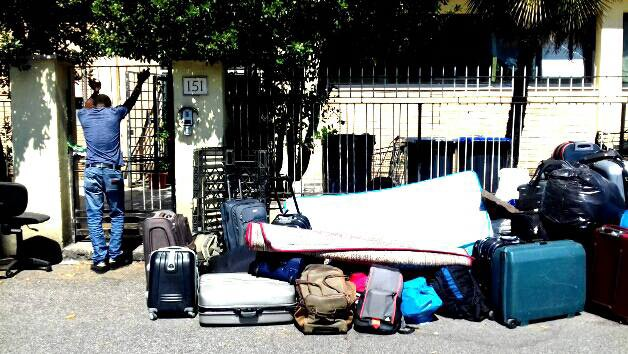
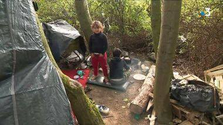

### AYS DAILY DIGEST 25/09/18: STATEMENT ON A UNJUST VERDICT AGAINST AYS VOLUNTEER

Moroccan NGOs statement on pushbacks **//** EU anti\-fraud watchdog investigating Greek misuse of refugee funds // Colibri patrols the Mediterranean alone // Greek police strip asylum seekers naked in pushback to Turkey // Sudanese refugees’ statement after months of protest in Italy // Solidarity worker convicted for a tweet in Calais // Over 1000 asylum seekers back in Grande\-Synthe region // Sweden upholds “high school act” //

Madina, whose death at the hands of border guards last November has lead to an ongoing battle between AYS and the Croatian Government\.
### Feature — AYS statement on politically motivated, unjust guilty verdict for our volunteer

This past March, AYS volunteer Dragan Umičević approached a police control near the Croatian border to alert police to a family of asylum seekers huddled in a field near Strošinci, already on Croatian soil\. A few days later, he was shocked to find himself facing charges of aiding and abetting the asylum seekers’ “illegal crossing” of the Croatian border— despite the fact that he had never laid eyes on the family before and hadn’t even communicated with them directly beforehand\.

Acts of solidarity towards refugees and asylum seekers are routinely criminalized across Europe, often using laws meant to stop human trafficking — recent high\-profile cases include a [French farmer](https://www.france24.com/en/20170104-france-farmer-herrou-trial-migrants-smuggling-roya-valley-italy) accused of feeding and giving people lifts in the Roya Valley, and [two young volunteers](https://www.theguardian.com/world/2018/sep/06/arrest-of-syrian-hero-swimmer-lesbos-refugees-sara-mardini) on Lesvos\. An act as innocent as giving someone a ride in the back of your truck so that they don’t have to walk along a busy and dangerous motorway can be prosecuted, And, of course, there is Hungary’s infamous [“Stop Soros” law](https://www.theguardian.com/world/2018/jun/20/hungary-passes-anti-immigrant-stop-soros-laws) , which would punish any group or individual who helps an asylum seeker in any way with a prison sentence\. Criminalizing solidarity is a clever tactic that works to sap aid organizations’ energy and resources, while publicly distracting from the real scandal: the endemic, state\-sponsored human rights abuses experienced by asylum seekers\.

The case against Dragan is an especially flagrant example of this strategy, given that Dragan had not met or communicated directly with the refugees he is accused of helping smuggle across the border until _after_ they were picked up by police — and the government provided absolutely no evidence to support their charge that he did so\. They claim he used light signals to navigate them over the border — but at that time they were already in Croatia, and Dragan was standing with three police officers at the police checkpoint\. Now, a day before the verdict on Dragan’s case is officially published by the court, the Croatian media is parroting a [story](https://m.vecernji.hr/vijesti/aktivist-kaznjen-sa-60-tisuca-kuna-zbog-pomaganja-izbjeglicama-u-ilegalnom-ulasku-u-hrvatsku-1272181) that was likely leaked by the government itself\. Please read AYS’s statement on the matter below\.
#### State revenge for the little Madina case — ays volunteer convicted, perpetrators walk free

> It is not at all common to issue comments on a pending verdict, especially if judicial reasoning is yet to be given, and the verdict has yet to be published on the notice board of the court in charge\. However, given that the information on the pending verdict in the case of our volunteer Dragan Umičević has been leaked to the media through unknown channels, we find it pertinent to clarify several allegations and put them in context\. 

> We believe that the public is well acquainted with the case of little Madina, a six\-year\-old girl who was killed during an illegal expulsion from Croatia on the night of 21st November 2017\. Unknown perpetrators in the Croatian police were reported to the State’s Attorney Office of the Republic of Croatia following Madina’s death\. Later investigation found the potentially incriminating thermographic camera recording of the controversial incident mysteriously missing\. No\-one took responsibility for the loss of the little girl’s life — not those who had ordered Madina and her family to follow the freezing tracks back into Serbia, nor those who had ordered the illegitimate expulsion or whose support had been implicit\. 

> Not four months later, the night of 20th March 2018, little Madina’s family contacted AYS through Facebook\. The night was unusually cold for that time of the year and a storm raged outside\. Madina’s elder sister told us that there were a total of 11 children and juveniles freezing in a field near the Strošinci village, and that they were frightened another tragedy would strike\. Despite it all, they wanted to apply for asylum in Croatia\. By submitting their geolocation, they confirmed to us that they were in Croatian territory\. The volunteers on duty did the only thing legally and humanly possible — they contacted the police to inform them of an unregistered family of refugees in the territory of the Republic of Croatia claiming to seek asylum\. 

> Given the extremely harsh weather conditions, as well as the fact that it was a family that had previously experienced an unimaginable tragedy in similar circumstances, we asked our volunteer Dragan \(who lives closest to the location where all of this was occuring\) to go out in the field and find the nearest police patrol, in order to stress the fact that according to our info, there was a family with many small children in a field near Strošinci who wanted to seek international protection\. 

> He did just that — he went to the police posting near the border and handed over all the information we had\. He was never in direct contact with Madina’s family\. He saw them for the very first time later that night, when the police took them to a nearby police station\. This is why we were very unpleasantly surprised when the MOI subsequently made an indictment against him, claiming that Dragan “assisted in \[Madina’s family’s\] illegal crossing of the border\.” This grotesque accusation can only be interpreted as a tool of political pressure on AYS, who were the first organisation to bring to light the information on the death of little Madina, and has continuously been speaking out on the issue of the illegal treatment of refugees on the borders of Croatia, enacted by the Croatian police, which is also the context in which our government is being talked about in the European Parliament lately\. 

> It’s curious that the indictment against our volunteer comes in a time when we started speaking out about the violence happening on our borders\. Additionally, it’s interesting that in the indictment motion, the MOI, among other things, asked for “the prohibition of work in Croatia for the legal entity\.” Taking into consideration the fact that Dragan is not a legal entity, this could only mean the prohibition of work for AYS\. It is also interesting to note that the pending verdict, which the court hasn’t published on it’s official bulletin board yet \(meaning it’s not publicly available\) has been published by a state\-owned news agency\. 

> And has been published at the exact time when AYS warned of another child, the five\-year\-old Allsa, who fell victim to the illegal practices of the Croatian police\. 

> The only, very unpleasant, conclusion that we can reach is that it was the Ministry of Interior itself who released this information to the public, in order to draw attention away from its own illegal acts, while discrediting human rights defenders in the public eye\. Our volunteer is of course not guilty of the charges filed against him, and we will not stop until we’ve exhausted all legal instances to prove this\. Sharing this post will help the truth in reaching a wider circle of people, and it would mean the world to us\. A big thank you to everyone for all your support\. The fight continues\! 

> \#supportAYS \#supportDragan 

### Morocco

“Freedom of movement is a sacred principle\.” In anticipation of the UN summit on Migration, which will be held in Marrakesh in December, 19 NGOs gathered in Rabat have signed a statement denouncing the recent violent pushbacks of Subsaharan African people and all “violence committed by the Moroccan authorities in a complete disregard of migrants’ dignity, their rights, and even their life\.” The full text can be read below \(in French only\) \.

Meanwhile:

Yet [another](https://www.facebook.com/watchthemed.alarmphone/posts/2225642367709994?hc_location=ufi) Alarm Phone member was violently deported today, according to Watch the Med — Alarmphone\.

One woman is dead and four people injured after the Royal Moroccan Navy opened fire on a boat of migrants that was allegedly refusing to respond to their signals\. [Ali Zoubedi](https://twitter.com/alzoubeidi/status/1044730284917305345) reports that the the woman was only 20 and had been studying law in Martil\.

The bodies of two migrants were found on the beach in Marina Smir\.
### Turkey

Pro\-Erdogan newspaper Gunes has posted a video that appears to show a number of young men, mostly Pakistanis, reeling after having been stripped naked and violently pushed back across the border between Greece and Turkey\. According to one man who spoke Turkish, Greek police arrested the group of men four days earlier, held them in prison for days with limited access to food, then took them back to the border, forced them to strip, robbed and beat them, and drove them back into the Evros — despite pleas that some of the men didn’t know how to swim\. In the video, some men are wearing only briefs; others have covered themselves with sackcloth\. The video was shared on [Facebook](https://www.facebook.com/687993924641223/videos/740056816335347/) and shared and referenced a number of times by the Turkish news organization Milliyet\.

[Vicdansızlar! Yarı çıplak Türkiye'ye gönderdiler](http://www.youtube.com/watch?v=YgqTqBNFO2E)
### Sea

After France refused to let rescue ship Aquarius dock in Marseille, Malta also declined to let the Aquarius into its port, but [agreed](https://www.euronews.com/2018/09/25/france-blocks-aquarius-migrant-ship-from-docking) to transfer the 58 asylum seekers on board onto land\. Malta and France will share responsibility for the passengers’ asylum claims with Portugal and Spain\. The Aquarius will be allowed to dock in Marseille once the passengers have been transferred\. It is unclear whether the ship will be allowed to resume its humanitarian mission anytime soon\.

■■■■■■■■■■■■■■ 
> **[SOS MEDITERRANEE](https://twitter.com/SOSMedIntl) @ Twitter Says:** 

> > 🔴BREAKING The #Aquarius welcomes the announcement of #Malta &amp; #France of a coordinated #European response : the 58 survivors on board should soon be transferred from the #Aquarius to a place of safety after days at sea. The #Aquarius will then pursue its journey to #Marseille https://t.co/p2tbBISDgO 

> **Tweeted at [2018-09-25 16:37:04](https://twitter.com/sosmedintl/status/1044626851451351040).** 

■■■■■■■■■■■■■■ 

With the Aquarius permanently docked, the rescue plane Colibri is now the last humanitarian rescue operation left in the Mediterranean\. This afternoon, Pilotes Volontaires tweeted out an image of around 100 people crammed onto a small rubber dinghy, nearly all waving to catch the pilots’ attention\. They claim that both military and commercial ships ignored Colibri when they put out a mayday alert\.

■■■■■■■■■■■■■■ 
> **[Pilotes Volontaires](https://twitter.com/PVolontaires) @ Twitter Says:** 

> > Yesterday #Colibri spotted a rubber boat with app. 100 people. We informed #MRCCRome, as the #LibyanCoastGuard is usually unresponsive. One commercial vessel and one military ship copied our mayday relay, but did nothing. Two cargo ships ignored our alert. [facebook.com/pilotesvolonta…](http://www.facebook.com/pilotesvolontaires/) https://t.co/YhcRT8V9Cy 

> **Tweeted at [2018-09-25 05:30:13](https://twitter.com/pvolontaires/status/1044459035280506880).** 

■■■■■■■■■■■■■■ 

■■■■■■■■■■■■■■ 
> **[Migrant Rescue Watch](https://twitter.com/rgowans) @ Twitter Says:** 

> > 🔴#SAR Op 24.09.18 Libyan Coast Guard PB "Talil" jointly w. OSV "Tiger" rescued 116 men &amp; women 40 nm N off Zuwara. All #migrants safely disembarked in Zawiya #Migrantcrisis #TogetherForRescue #Frontex #SOSMEDITERRANE #Refugees #Seenotrettung #refugiados #seawatch #flüchtlinge https://t.co/0EI2kETPFB 

> **Tweeted at [2018-09-25 15:50:31](https://twitter.com/rgowans/status/1044615136621801472).** 

■■■■■■■■■■■■■■ 

### Greece

Five boats with around 180 people landed on the Greek islands today, according to [Aegean Boat Report\.](https://www.facebook.com/AegeanBoatReport/posts/450931758763267)

The Ministry of Migration has been hit with two massive fines totalling 100,000 euros because of its reluctance to improve sewage and sanitation systems on the Greek islands’ two largest hotspots: Chios’s Vial Camp and Moria on Lesvos, Ekathimerini [reports](http://www.ekathimerini.com/232869/article/ekathimerini/news/migration-ministry-slapped-with-100000-euros-in-fines-over-camps) \.

In the wake of the bombshell Fileleftheros piece alleging widespread misuse of funds earmarked by the EU for refugees in Greece, the EU anti\-fraud commission \(OLAF\) is investigating, Politico [reports](https://www.politico.eu/article/eu-watchdog-probes-possible-misuse-of-refugee-funds-in-greece/) \.

Once more, winter is coming and there is no concrete adaptation plan in place on Lesvos\. Supplies and donations needed — find out more [here](https://www.facebook.com/thekempsons/posts/2132448690336366?hc_location=ufi) \.
### Italy

Source: Melting Pot Europa\.

Melting Pot Europa published a statement from the Sudanese Refugees of Scorticabove, whose page can be found [here](https://www.facebook.com/scorticabove/?fref=tag) \. The group has been protesting on the street since the eviction of their residence three months ago\.

> Let us not flinch from what we have conquered\.
 

> Let us move forward, aware that many are citizens and solidarity networks around us; aware that our battle concerns all this city and indeed all our country\.
 

> Yes, because this country is ours too and we want to change it together\. 

The statement can be read in full below \(note: In Italian\) \.

### Serbia

Volunteers urgently needed in Subotica for Escuela con Alma’s shower project\. For contact information, click [here](https://www.facebook.com/groups/1236769899744449/permalink/1877148345706598/) \.
### Bulgaria

If you struggle to heat your home or pay your bills, the [Foundation for Access to Rights](https://www.facebook.com/farbg.eu/posts/2215791588655372) may be able to help\. Learn whether you’re eligible to apply for social assistance [here](https://www.refugee.info/bulgaria/social-benefits-in-bulgaria/social-assistance-in-bulgaria?language=en) — and, if so, which organizations can help you complete the necessary paperwork\.

If you are a refugee or asylum seeker in need of legal aid, please send an email to office@farbg\.eu or message the organization’s Facebook page\.
### France

Criminalization of solidarity meets repression of free speech\. Amnesty International [reports](https://www.amnesty.org/en/latest/news/2018/09/france-criminal-conviction-for-a-tweet-will-have-chilling-effect-on-migrant-rights-defenders/) that a French solidarity worker named Loan Torondel has been convicted for tweeting a photo that depicts police standing over a refugee on his sleeping bag this past January\. The caption — which implied that the police were about to steal the man’s sleeping bag for the second time — provoked the defamation charge on which Torondel was convicted\.

The head of Amnesty International in France, Nicholas Krameyer, responded to Torondel’s conviction: “This outrageous decision sets a dangerous precedent for anybody attempting to document the disproportionate use of force employed by the police in Calais and throughout the country\.” Specifically with regards to the charge of defamation, he said, “Criminal defamation laws that inhibit legitimate criticism of public officials are contrary to the right to freedom of expression\. The authorities must stop harassing human rights defenders through the courts\.”

The Refugee Info Bus, which has worked with Loan, put out a [statement](https://www.facebook.com/RefugeeInfoBus/posts/2251583331743749?hc_location=ufi) :

> Our good friend Loan, a former long\-term volunteer with l’Auberge des Migrants, who brought the Info Bus back to Calais in 2017, was convicted today of defamation against the police for a tweet he posted in January 2018\. This sets an extremely dangerous precedent for the work of volunteers and refugee rights activists, and for the treatment of refugees themselves, in France\. 

■■■■■■■■■■■■■■ 
> **[María Serrano Martin](https://twitter.com/marsemavi) @ Twitter Says:** 

> > Unbelievable. Human rights defender @[LoanTorondel](https://twitter.com/LoanTorondel) convicted for defamation just for tweeting &amp; reporting abuses against refugees and migrants in #Calais. Loan did nothing wrong. This sentence will have a chilling effect on migrant rights defenders in the area #SolidariteAvecLoan https://t.co/IQKbO1qc66 

> **Tweeted at [2018-09-25 07:52:09](https://twitter.com/marsemavi/status/1044494752627019776).** 

■■■■■■■■■■■■■■ 

Two children amidst a makeshift camp in the woods of Grande\-Synthe\. Source: L’Auberge des Migrants\.

Meanwhile, in the Grande\-Synthe region, winter is coming and the situation is getting worse\. L’Auberge des Migrants [reports](https://www.facebook.com/AubergeMigrants/photos/a.10152514841565339/10156349950315339/?type=3&theater) that over 1000 people turned up for their food distribution this afternoon\. The organization noted that since the police evacuated roughly 500 people less than a month ago, over twice that many have returned to the area\. In a Facebook post, they questioned the media’s total lack of interest in the ongoing humanitarian crisis in the region, writing, “The survival of a thousand people depends entirely on associations whose resources are low, because of the total ignorance in which the public is kept\!”
### Germany

As one of the countries with the highest rates of refugees eligible to bring family members under the EU’s family reunification mechanism, Germany continues to do everything it can to make the process more difficult for people\. After a two\-year time out on family reunification transfers for people with subsidiary protection \(a lower protection status than full refugee status\), an August 1 law, widely criticized by human rights organizations and activists, put a [monthly cap](https://www.dw.com/en/family-reunification-for-refugees-resumes-in-germany/a-44903743) on the amount of family reunification transfers for people with subsidiary protection\. Now, PRO ASYL [reports](https://www.proasyl.de/en/) that rights organizations’ fears about the implications of these quotas were well\-founded\. In August 2018, only 853 cases were examined, significantly less than the limit of 1000; only 42 visas were granted\. With 34,000 reunification requests already lodged after the new law was announced, it could take years and years for people who have been separated from their family members to see them again\.

](assets/b91baab377ba/1*ZNKE3GgZfwIZZeRNdlStvQ.jpeg)

By Omar Perez\. Source: [Art Against Borders\.](https://www.facebook.com/artagainstproject/photos/a.639651369417634/1874149665967792/?type=3&theater)
### Sweden

In two separate judgments today, the Migration Supreme Court upheld Sweden’s ‘high\-school\-act,’ which grants 17–25\-year\-old asylum seekers permission to stay in Sweden while they complete their high school education\. Courts now have the green light to implement the law, which has been halted due to difficulties regarding how to judge by it; during the summer, three different courts choose different ways to approach it\. It is also an ongoing case in the European Court of Justice after the Gothenburg migration court referred it there in order to understand how to interpret it \(that decision will not be available until next year\) \.

“It’s not a good law and it’s difficult to interpret, but it is not and has not been breaking the constitution,” said Thomas Rolén, chamber\-law president of the Migration Supreme Court, according to the Swedish daily [Dagens Nyheter](https://www.dn.se/nyheter/sverige/gront-ljus-for-gymnasielag/) \.

This development means that several thousands of young asylum seekers who are either already enrolled or planning to enroll in high school have a new chance to stay in Sweden\. Complications arise because some of these young people are also “permission seeking” — as in, applying for another chance to have their asylum case tried\. AYS has previously mentioned that this has led to homelessness in some cases, as municipalities are not required to provide those over 18 with accommodation while they are waiting for their case to be decided\.

**We strive to echo correct news from the ground through collaboration and fairness\.**

**Every effort has been made to credit organizations and individuals with regard to the supply of information, video, and photo material \(in cases where the source wanted to be accredited\) \. Please notify us regarding corrections\.**

**If there’s anything you want to share or comment, contact us through Facebook or write to: areyousyrious@gmail\.com**

_Converted [Medium Post](https://areyousyrious.medium.com/ays-daily-digest-25-09-18-statement-on-a-unjust-verdict-against-ays-volunteer-b91baab377ba) by [ZMediumToMarkdown](https://github.com/ZhgChgLi/ZMediumToMarkdown)._
