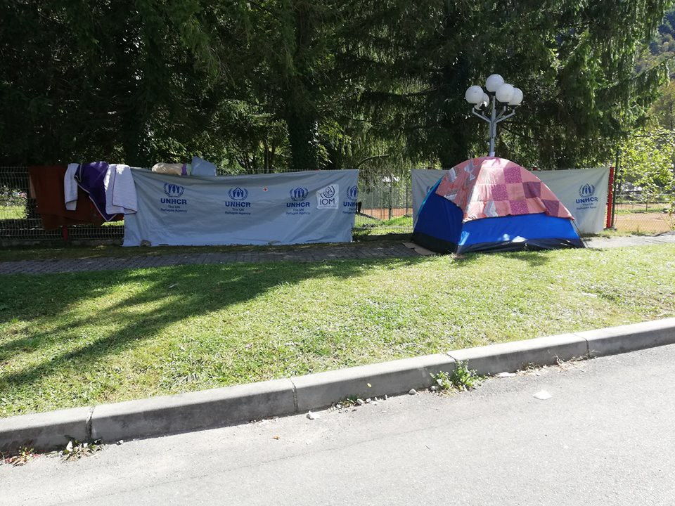
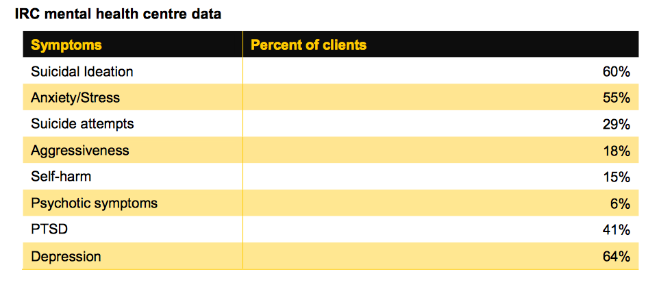

### AYS DAILY DIGEST 26/09/2018: Unaccompanied 18 year\-old boy forced to sleep rough in Bosnia and prevented from entering a reception centre, after being separated from his only companions

_Video witnessing inhumane violence at Tangier detention centre//192,000 people are in need of protection in Libya, as clashes intensify every day//Storm is approaching Lesvos//IRC released a report on mental health conditions inside Moria//Worrying news on the living conditions just outside the detention centre in Lesvos//Field workers organise and occupy building in Italy//Donations needed in Dunkirk//ECTHR held court case against Spain for illegal push\-backs procedure//More news from Germany, the UK…_

Credit: AYS
#### **FEATURE**

For 17 days, an 18 year\-old boy from Iraq has been sleeping in a small tent in the front of the gates of Hotel Sedra, near Bihać, Bosnia\. The hotel was turned into a temporary centre for refugees, families and vulnerable cases several weeks ago\. The boy was traveling for two years with one family\. They stayed together all the way from Iraq\. However, in Bosnia they were separated because he is officially not a member of the family he is traveling with\. Even though he is very vulnerable, IOM, which runs the camp, will not allow him in\. In addition to IOM, the DRC \(Danish Refugee Council\), UNHCR and Save the Children operate at the centre and are aware of the case, as well as of the fact that the boy does not have food and has not yet received clothes, shoes or any assistance\. He has been separated from the family against his will and is now unaccompanied and left on his own\. He does not want to be alone and fears getting lost\. It is about 2°C outside now in Bosnia, so sleeping rough in a tent is definitely a challenge\. When AYS visited him in the evening, the gates were closed and the guards were inside, patrolling the entrance\. Some members of the family he came with visited him and brought him some food they’d saved from dinner\.

This news reached AYS, just after few days a video was published concerning the agents of the Office for Foreigners disturbing and harassing refugees sleeping in tents\. As reported in a previous digest this week, “ _one police woman used a gun to hit an elderly man, a father of two, after he asked her not to kick their tent since one of the children inside is sick\. She responded with insults and violence\. The video of the assault was posted online, but the same police woman is still at the camp making everybody feel uncomfortable_ ”\.

Moreover, a curfew at 8 PM for those living in the reception centre has been established\.

Here you can find [video testimonies of the harassment](https://www.youtube.com/watch?v=bCrCELQ_6BE&feature=player_embedded&has_verified=1) \.

We wonder for how long international NGOs will turn a blind eye to these abuses and violence\.
#### **MOROCCO**

The [young woman shot dead](https://www.facebook.com/AmdhNador/posts/2191721901040073?hc_location=ufi) yesterday by the Moroccan authorities was 22\-year\-old law student Hayat\. Her mother is now the only one taking care of the family with her job at a factory\.

[Horrific video testimonies](https://www.facebook.com/AmdhNador/videos/337749693638668/?hc_location=ufi) of another victim at the Tangier detention centre, where around 200 people have been illegally detained for more than a week\. The victim, taken to the hospital, reported serious injuries to the neck\. **PLEASE, BE AWARE OF THE GRAPHIC CONTENT** \.

Here is another [video testimony](https://www.facebook.com/AmdhNador/posts/2191830747695855?hc_location=ufi) of living conditions at the detention centre\.
#### **LIBYA**

[The LCG has rescued 116 migrants](https://www.libyaobserver.ly/inbrief/libyan-coast-guard-rescues-116-migrants-coast-zuwara-west-tripoli) , including 12 women and one child, off shore of Tripoli on Wednesday\. The people rescued were mainly of Bangladesh and African nationality\.

On the other hand, close to 192,000 people are in need of international protection, according to the UNHCR Deputy High Commissioner in Libya\. The evacuation program, in collaboration with the Niger government, is taking a long time to be implemented, while the risk of clashes becomes greater every day and the living conditions of those in the detention centre in Tripoli are worrying, as people “can’t sleep because of the sounds of missiles and gunfire nearby” and are forced to drink toilet water\.

■■■■■■■■■■■■■■ 
> **[Sally Hayden](https://twitter.com/sallyhayd) @ Twitter Says:** 

> > I asked UNHCR Deputy High Commissioner Kelly Clements (@[KellyTClements](https://twitter.com/KellyTClements)) about the situation for refugees trapped in detention centres in Libya. She said they're trying to evacuate but access is hard &amp; UNHCR has already evacuated most of their own staff. #tripoli #unga https://t.co/Lh5yadQgQ9 

> **Tweeted at [2018-09-26 21:33:06](https://twitter.com/sallyhayd/status/1045063738154463233).** 

■■■■■■■■■■■■■■ 

#### **SEA**

A [call in solidarity with Aquarius](https://www.facebook.com/pilotesvolontaires/posts/281206279163390) , who is now awaiting a safe transfer for 58 passengers in international waters off Malta\.

■■■■■■■■■■■■■■ 
> **[MSF Sea](https://twitter.com/MSF_Sea) @ Twitter Says:** 

> > Among those the #Aquarius rescued over the past week are 7 families and 18 #children. #Parents have told us that they feared for their children’s lives as shelling, gunfire, and daily violence engulfed them in #Tripoli. #Libya is not a place of safety. https://t.co/BdF2sL73Sh 

> **Tweeted at [2018-09-26 17:15:16](https://twitter.com/msf_sea/status/1044998854112874497).** 

■■■■■■■■■■■■■■ 

#### **CYPRUS**

On Tuesday, two [boats](http://www.ekathimerini.com/232975/article/ekathimerini/news/more-refugees-arrive-in-cyprus-across-the-divide) carrying respectively 18 and 14 Syrian refugees reached the shore of Cyprus\.
#### **GREECE**

_Mainland_

Documents needed for [family reunification](https://www.facebook.com/mobileinfoteam/posts/2280123872216329:0?hc_location=ufi) \.

Zaatar is organising interesting activities, among which there is a fishing training in Arabic, which will take up to five hours per week and will be followed by a two\-week internship\. Find more information [here](https://www.facebook.com/zaatarngo/posts/1977002568986743:0?hc_location=ufi) \.

Amazing activities for women in Athens and Chios are being provided by Action for Women, who provide a safe space and a welcoming environment for women and girls\. Please [support their work](https://www.facebook.com/actionforwomenCH/posts/1450327918445026?hc_location=ufi) as they provide language and yoga classes, as well as legal/psychological assistance\.

_Chios_

_Lesvos_

Attika Human Support [estimates](https://www.facebook.com/AttikaHumanSupport/posts/704518866570438) that 5% of the tents were destroyed by the strong wind, while another 30% were seriously damaged and had to be repaired with rope and wood\.

These strong winds are not only damaging material, but also creating respiratory problems and health issues caused by the garbage flying around the camp\.

Please, support the work of the small NGOs operating on the ground as it fundamental\. The authorities, as usual, didn’t expect the winter would come\. \.

■■■■■■■■■■■■■■ 
> **[RSA](https://twitter.com/rspaegean) @ Twitter Says:** 

> > Refugees living without electricity and limited access to running water and who are trying to survive these harsh living conditions while sleeping in summer tents in olive grove in Moria are“housed” according to a stamp on their registration documents. These people are "housed"? https://t.co/QGILw0AmV3 

> **Tweeted at [2018-09-26 17:36:42](https://twitter.com/rspaegean/status/1045004246897315841).** 

■■■■■■■■■■■■■■ 

■■■■■■■■■■■■■■ 
> **[RSA](https://twitter.com/rspaegean) @ Twitter Says:** 

> > “Today we found a snake in our tent. We don’t dare going back in, so me and my kids stay out tonight. There is no difference between outside and inside the tents”, says an afghan mother who arrived in Moria two weeks ago #stopthetoxicdeal #opentheislands https://t.co/iSz4OK9MNv 

> **Tweeted at [2018-09-26 09:35:52](https://twitter.com/rspaegean/status/1044883242543919105).** 

■■■■■■■■■■■■■■ 

Not to mention that, even though thousands of people will be moved to the mainland, the IRC and other NGOs on the ground warned of a [spreading mental health emergency](http://www.ekathimerini.com/232971/article/ekathimerini/news/irc-warns-of-mental-health-crisis-on-lesvos-as-greece-moves-asylum-seekers) , with 30% of the residents at Moria having attempted suicide and 60% having contemplated the possibility\.

Credit: IRC

Three major factors negatively impact the well\-being and mental health status of asylum seekers in Moria: lack of protection, lack of support and lack of any certainty about their future\.

The living conditions are not helping as the camp is overcrowded with one shower per 84 people and one toilet per 72 people\.

“ _The sewage system is so overwhelmed that raw sewage has been known to reach the mattresses where children sleep, and flows untreated into open drains and sewers_ ” IRC said\.

Read the full report [here](https://www.rescue.org/sites/default/files/document/3153/unprotectedunsupporteduncertain.pdf) \.

■■■■■■■■■■■■■■ 
> **[RSA](https://twitter.com/rspaegean) @ Twitter Says:** 

> > Disabled and sick persons in Moria hotspot have to carry themselves uphill and downhill to their tents and queue for hours #stopthetoxicdeal #opentheislands https://t.co/LsbAAOirJT 

> **Tweeted at [2018-09-26 09:24:10](https://twitter.com/rspaegean/status/1044880298717196288).** 

■■■■■■■■■■■■■■ 

**ALERT\!**

#### **ITALY**

Comitato Antirazzista Saluzzese keeps reporting about the working [conditions of field workers](https://www.meltingpot.org/Saluzzo-occupazione-in-via-Lattanzi-i-braccianti-chiedono.html?var_mode=calcul#.W6x1mbFh1p9) in the area of Saluzzo \(Cuneo, Piemonte\) \. Three hundred people organised themselves and occupied an abandoned building on Via Lattanzi in order to protest the insufficient responses of the authorities and the national reception system\.

During the past months, workers have officially requested meetings with local authorities to establish a plan to allow them to work and live in dignified conditions, but their requests have gone unheard\.

In the same area, the official reception shelter is the former Filippi barracks , where 400 people are actually hosted during the working season, but what about those who remained outside the system?

Not only do **people live under foul conditions but they are also exploited even with regular working contracts in hand\!** Missing working days on pay checks, lower hourly wages, black market \(illegal work\), no insurance or medical assistance\. \.

The answer is self\-organisation and occupation and authorities, as usual, prefer to pretend nothing is happening, sweeping the dirt under the carpet\.

Meanwhile, [racist attacks continue](https://www.thelocal.it/20180926/three-students-investigated-on-suspicion-of-committing-racist-crimes) \.

In the area of Frosinone \(Lazio\), three students have been accused of violent attacks on migrants\. During an eight\-month investigation, authorities discovered threats, assaults, attacks with stones, to name a few\.

Weapons such as knives, baseball bats, rifles and supremacist propaganda material were found at the students’ house\.

“ _The potential charges include incitement to commit crimes for reasons of racial, ethnic, and religious discrimination, threats, stalking, personal injury, and damage\._ ”
#### **GERMANY**

#### **FRANCE**

_Paris_

_Dunkirk_

Despite clearance and abuses by the authorities happening on a regular basis, [new arrivals are coming to Dunkirk every day](https://www.facebook.com/MobileRefugeeSupport/posts/848105772061702?hc_location=ufi) , including many families\. The number of people on the move presently on the ground is now estimated at around 1,000 people, who are forced to hide and seek shelter in the forest surrounding the area\. These people need total assistance, from food, medicines, clothes, tents etc\. as many of their belongings were lost or stolen during the journey\.

Sleeping bags, winter shoes and jackets are essential, giving the proximity of the cold season, together with phones and power banks to allow them to communicate with families and friends\.

[Donations of food and other items are highly needed\!](https://www.facebook.com/CalaisRefugeeAid/posts/1889133621152161?hc_location=ufi)

_Ouistreham \(Caen\)_

#### **SPAIN**

Today the Grand Chamber of the European Court of Human Rights \(ECtHR\) was presented with a case regarding the illegal push\-backs happening at the Spanish\-Moroccan border\. The case was filed against Spain by N\.D\. and N\.T\., respectively from Mali and Ivory Coast, who tried to cross the border in Melilla in August 2014 to seek refuge in the country, but were faced with a push\-back, de facto violating not only their human rights, but also the European Convention on Human Rights \(which applies to the external borders of the EU, too\) and other international conventions\.

N\.D\. and N\. T\. were pushed back without any legal assistance whatsoever and represent just one case of the approximately 1,000 cases of illegal push\-backs recorded in 2014 alone\. Official figures are not available as Spanish authorities do not keep track of the expulsions, which have been happening along the border since 2005\.

“ _My rights were violated by Spain\. There need to be measures to stop such harm from being done to other people\. I still cannot accept that humans can treat humans like this\. What I would like to see from this Court is that there is justice — even for those who are poor, vulnerable and do not have a voice_ ”\.

Find more information [here](https://www.ecchr.eu/nc/en/press-release/grand-chamber-of-the-ecthr-hears-case-on-spains-longstanding-push-back-practice-at-the-border-with-morocco/) \.
#### **UK**

**We strive to echo correct news from the ground through collaboration and fairness\.**

**Every effort has been made to credit organizations and individuals with regard to the supply of information, video, and photo material \(in cases where the source wanted to be accredited\) \. Please notify us regarding corrections\.**

**If there’s anything you want to share or comment, contact us through Facebook or write to: areyousyrious@gmail\.com**

_Converted [Medium Post](https://medium.com/are-you-syrious/ays-daily-digest-26-09-2018-unaccompanied-18-year-old-boy-forced-to-sleep-rough-in-bosnia-and-c5be03ff21c3) by [ZMediumToMarkdown](https://github.com/ZhgChgLi/ZMediumToMarkdown)._
