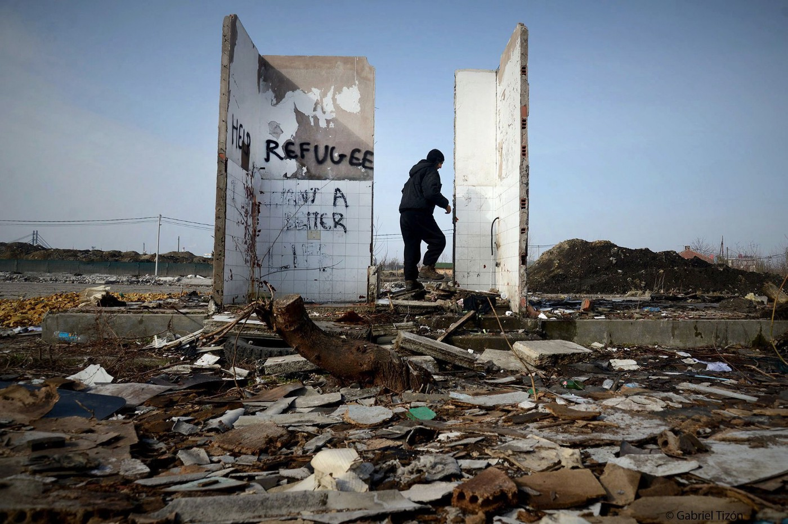
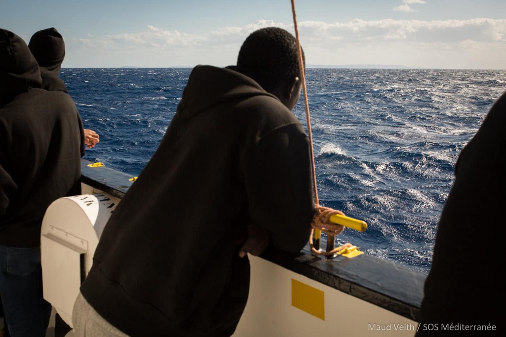
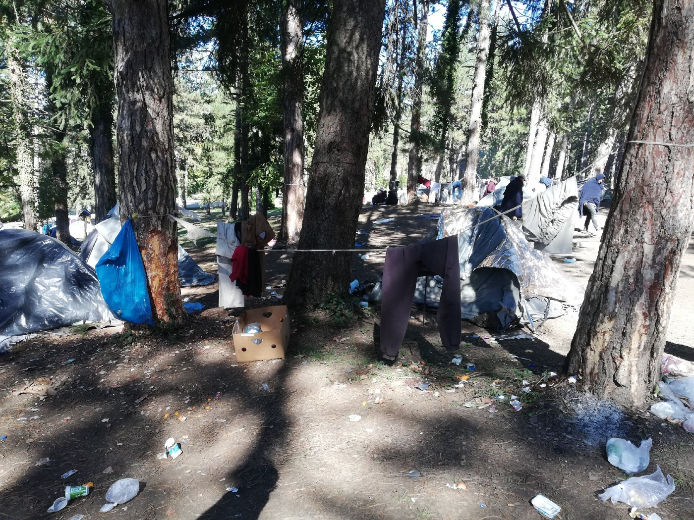
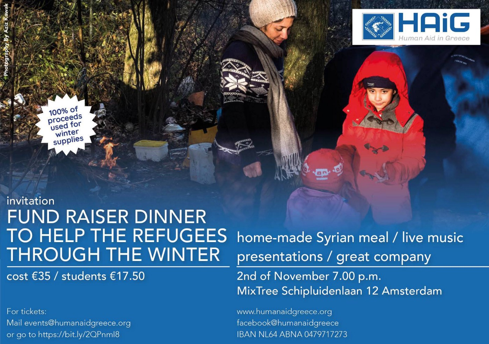

### AYS DAILY DIGEST 27/9/2018: With the winter approaching, help is need all over Europe

_80,602 people entered Europe by sea in 2018 while 1,730 died at sea whle trying // Over 11\.900 people entered Bosnia this year // Police in Bihac is harassing refugees and locals who are helping // Two trials for war crimes in Syria ended in Germany // Help is needed all over Europe_

By Gabriel Tizon
#### Morocco

[Association Marocaine des Droits Humains — Section Nador](https://www.facebook.com/1493677674177836/posts/2192038197675110/) concluded that **less than two weeks after the transfer of money from the EU, the Moroccan repressive machine began operating** \.

_“There have been deaths \(three so far not to mention the missing\) thousands of illegal arrests and refoulement, injuries, violence, forced evictions, detention centres outside the law…\. etc\.”_

In July, the EU allocated 55 million Euro for Morocco and Tunisia to fight “illegal migrations”\.
#### Sea

The [Aquarius](https://www.facebook.com/1620638098209175/posts/2277846182488360/) ship is stuck off Malta, unable to disembark due to bad weather, which is not expected to improve in the next few days\.

According to [some sources](https://twitter.com/rose_catb/status/1045220364438171648) , after Panama revoked permission to the Aquarius to use their flag, Ireland and Switzerland are considering giving their flag to the ship so that it can continue its mission of saving lives\.

■■■■■■■■■■■■■■ 
> **[SOS MEDITERRANEE ITA](https://twitter.com/SOSMedItalia) @ Twitter Says:** 

> > «@[SOSMedItalia](https://twitter.com/SOSMedItalia) chiede alla società civile europea di sostenere la nave #Aquarius, divenuta simbolo di umanità, affinché possa proseguire la propria missione in mare» [goo.gl/eQFisu](http://goo.gl/eQFisu) 

#WorldMaritimeDay https://t.co/K8hGsDtiqi 

> **Tweeted at [2018-09-27 12:41:40](https://twitter.com/sosmeditalia/status/1045292386858020864).** 

■■■■■■■■■■■■■■ 

[**Lifeline**](https://www.facebook.com/111682292571652/posts/457303534676191/) **is asking for donations\.**

According to the [IOM](https://www.iom.int/news/mediterranean-migrant-arrivals-reach-80602-2018-deaths-reach-1730) , **80,602 people entered Europe by sea in 2018 through 23 September** , with 35,653 entering Spain, the leading destination this year\.

At the same time, **1,730 died in the sea on their way to Europe** \. The most recent registered death is of one woman off the coast of Bodrum, Turkey, while attempting to reach Kos, Greece\.
#### Europe

**According to [UNHCR figures](http://www.unhcr.org/excom/excomrep/5baba3864/69th-session-executive-committee-regional-update-europe.html) , in the first seven months of 2018, a total of 74 deaths were recorded along land routes in Europe\.**

Between January and July 2018, 38 European countries received some **306,900 new asylum applications** , representing a 23 per cent decrease compared to the same period in 2017\.

Of these, 98 per cent were lodged in European Union member states, primarily in Germany \(81,200\), France \(51,300\), Italy \(31,400\) and Greece \(29,300\) \. Most of the people who applied for asylum are from Syria, Iraq and Afghanistan\.
#### **Greece**

WEATHER WARNING:

**A big storm system is taking course to Greece\! \(Athens/Peloponnese and further\) High potential of extremely strong winds and heavy rains in the next few days\. Please take care and stay safe\! \! \!**

**It is estimated that 400 out of over 2,000 children living in Moria Camp go to some kind of non\-formal or formal education, leaving at least 1,600 kids without any opportunity\.**

Among the children in Moria, there are many newborn babies\.

 \.](assets/17644056aa16/1*qZS0qT53C_hFxWVJepd20Q.jpeg)

Two days old baby sleeping in the forest above Moria\. Photo by [Because We Care](https://www.facebook.com/391316364400310/posts/861932340672041/) \.
#### Western Balkans

This year, by the end of August, **over 11,900 arrivals were registered in Bosnia, which is 30 times greater than the 380 during the whole of 2017\.**

The number of asylum\-seekers in the Balkans has also increased with over 5,600 people between January and July 2018, 45 times greater than the 126 during the same period in 2017\.

However, most of the people who are in Bosnia now do not have decent accommodation, or indeed any accommodation at all\. In Bihac, north Bosnia, close to the border with Croatia, there is still the biggest concentration of people\. Some are staying in houses in the city or nearby villages, some in a semi\-official camp in Djacki dom, and most of the people are out in the open\. Even though there are no exact numbers, according to some estimates at least 20 percent of those in Bihac are minors, most of them traveling without any adult\. So far, neither the state nor any of the international agencies present there are providing enough support for these children, and they remain exposed to all types of violence, and potentially even to becoming victims of human trafficking\.

Bihac, make\-shift camp Borici\. Photo by AYS\.

At the same time, the police in Bihac is creating a very tense situation\. They do not permit people on the move to walk around the city center in the evening or during the weekend\. They stop and ID them very often, but they are also trying to prevent locals from giving any kind of help, while acting unprofessionally and rudely\.
#### France

Update from Dunkirk by [Char Lotte](https://www.facebook.com/untitledraggacore?fref=gs&hc_ref=ARQaJuPPO1RRv47AYihU1PV00UNW-TKv7d5G3KTaAhh1iI5wCOHOA7fWWjvSYfZjVlM&dti=898611210218490&hc_location=group)

_“The number of displaced people has risen over 1000\. People are arriving daily and most of them have nothing but the clothes on their back\. The police is relentless so they are forced to hide and scatter in the woodlands\.”_

[Mobile Refugee Support](https://www.facebook.com/MobileRefugeeSupport/?ref=gs&__tn__=%2CdKH-R-R&eid=ARBpqzBGPZCpIQ2qKum9TQl5pGxF1zf9RcSWAjhHCbLdUJvnwJSXMEZsdRab7iof5_cQyiLS2I-fI2md&fref=gs&dti=898611210218490&hc_location=group) is struggling to provide [essential items](http://www.mobilerefugeesupport.org/material-donations) \.

Help if you can

_“People usually arrive with little more than the clothes they are wearing\. Many have had items stolen or confiscated during their journey here\. Many others lost them when crossing seas soon after leaving their home, often when boats sank or capsized\.”_

[www\.mobilerefugeesupport\.org/monetary\-donations](http://www.mobilerefugeesupport.org/monetary-donations)

[www\.mobilerefugeesupport\.org/material\-donations](http://www.mobilerefugeesupport.org/material-donations)
#### Belgium

The [Care4Calais](https://www.facebook.com/care4calais/?__tn__=%2CdkCH-R-R&eid=ARADfWpl00Mbr1Uc7IlnS63SPHpPd7XS-DNfhLtRr5kRL6dJoSFfUK6qy0gIjFZG1FgxAmiSWXEjSDTc&hc_ref=ARQ2PNgJeAYsyFMSLutmgKBbCmtF26SdZ1jKgS8O37S9LKyz_E27oXC8ZvcQJgZMjFA&fref=nf) team went to Brussels, Maximilian Park, with their mobile barber shop\.

_“The mobile barber shop is an amazing sight\. A crowd will gather to watch as the barbers take great care to give their refugee “customers” a good cut\. Those who are waiting chat, hold mirrors and scissors for the barbers and brush trimmed hair off the client’s shoulders\. The discussion is social, friendly, encouraging\. Just like a barber shop in a city\. Nobody minds waiting their turn\.”_

**At the moment, about 400 people reside in the park, mainly Eritrean and Sudanese\.**
#### The Netherlands

[Human Aid in Greece](https://www.facebook.com/humanaidgreece/?__tn__=%2CdkCH-R-R&eid=ARAo1wlHxUOuf8u0UMQ2lAyfkFSHCnVkV3nFUre0bYdKknPb1xZctYlr6b0mRVPjmmUopAA8FTbTFaO4&hc_ref=ARR2KUFwqVnCQRk41nwgD3qKPuKniQdj1bjaD5dZzchk-JG27C1DThY1a7qZ6_bSRcM&fref=nf&hc_location=group)

“Winter is steadily approaching and there seems to be, once again, no government plan for the thousands of refugees sleeping outside, in summer tents for the lucky ones, and under a couple of blankets stretched between trees for the others\.

“We are raising money to help them and you can make a huge impact: FOR THE PRICE OF YOUR TICKET WE CAN PROVIDE A FAMILY OF 4 WITH A TENT AND WARM SLEEPING BAGS\.

Please join us for an evening of good food, live music and great company\. All money raised will go toward helping homeless refugees throughout Europe to survive the winter\.”

November 2nd, 7\.00 pm\. MixTree, Schipluidenlaan 12, Amsterdam

Please book your ticket by sending a mail to events@humanaidgreece\.org or transferring the price of your tickets to NL64 ABNA 0479717273, with the comment “X tickets for November 2nd”\.
#### Germany

[ECADA — European Citizens Against Deportation to Afghanistan](https://www.facebook.com/ecada2017/?__tn__=%2CdkCH-R-R&eid=ARAGozlIHwQ0dwnHI_rLefoIPuXOdXQdZxF8Td3UvyWKngAZKnqQNryyfMLjCUxXWjfl0XWeEIKUxAvv&hc_ref=ARQFhNB99OKApGZmUcmWTdsq8dJ0MxNEyzrNSN0Nmi8uIPkcH652476_TebKdPX8L-M&fref=nf&hc_location=group) are reporting that an Afghan was taken into deportation arrest in Bavaria on Thursday\. He was arrested at school\. ECADA team believes that a flight is scheduled for next week\.

There are RUMOURS that the 17th charter from Germany may take off next week\.

Germany normally deports on the first Tuesday of a month, which would be October 2nd\.

If you believe you might be in danger of deportation, please seek legal advice immediately\.

This is NOT a confirmed date yet\!

**Two trials for war crimes in Syria have been completed recently in Germany\.**

On Monday, a member of a Western\-backed Syrian armed opposition group was sentenced to life imprisonment for “war crimes” committed in Aleppo during the siege\.

The convict, identified as Ibrahim A\., 43, was found guilty of “torture and killing persons protected under international humanitarian law” as well as “murder, extortionist kidnapping and the commission of war crimes under the International Criminal Code\.”

He was leader of a 150\-member armed group known as Ghoraba as\-Sham which operated under the Free Syrian Army \(FSA\) umbrella group, according to court documents\.

Over the course of Syria’s nearly eight\-year war, Western nations have aided and trained members of the FSA, who have been considered “moderate opposition” amid a rebel landscape that has become increasingly dominated by extremists such as ISIS and al Qaeda, CNN reports\.

Additionally, this week the Higher Regional [Court of Frankfurt sentenced](https://trialinternational.org/latest-post/abdelkarim-el-b/) a German citizen and former ISIS member, identified as Abdelkarim E\.B\., 32, to 10 years in prison\. He was found guilty of “criminal aid to a war crime against persons” and “membership in a terrorist organization in a foreign country\.”

He was born in Frankfurt and joined ISIS when he traveled to Syria in 2013\. He was arrested in Turkey in 2014, released in 2015 and imidiatyely went to Germany, where he was arrested again\.

**We strive to echo correct news from the ground through collaboration and fairness\.**

**Every effort has been made to credit organizations and individuals with regard to the supply of information, video, and photo material \(in cases where the source wanted to be accredited\) \. Please notify us regarding corrections\.**

**If there’s anything you want to share or comment, contact us through Facebook or write to: areyousyrious@gmail\.com**

_Converted [Medium Post](https://medium.com/are-you-syrious/ays-daily-digest-27-9-2018-with-the-winter-approaching-help-is-need-all-over-europe-17644056aa16) by [ZMediumToMarkdown](https://github.com/ZhgChgLi/ZMediumToMarkdown)._
