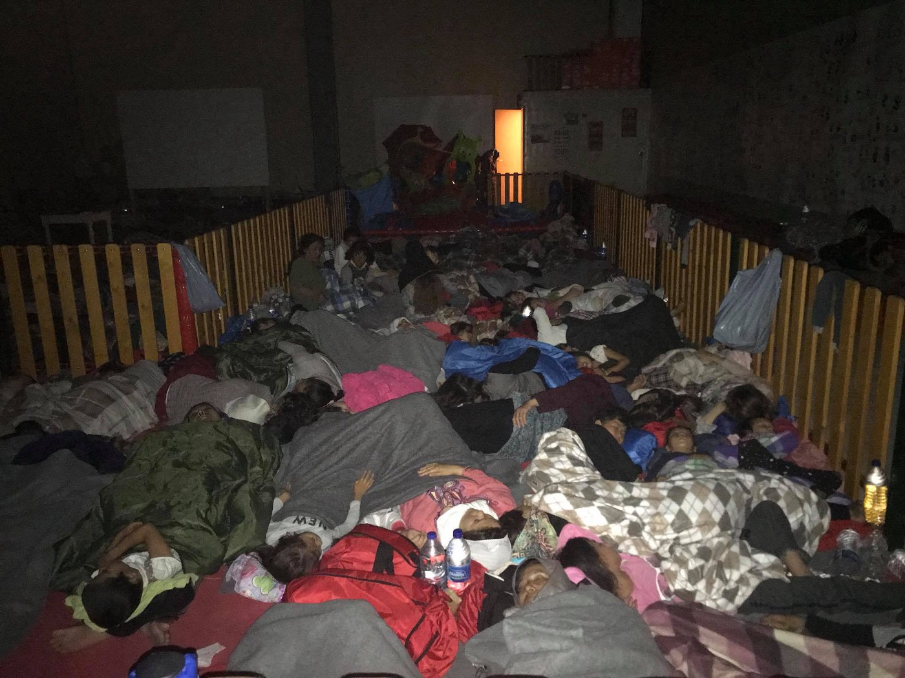
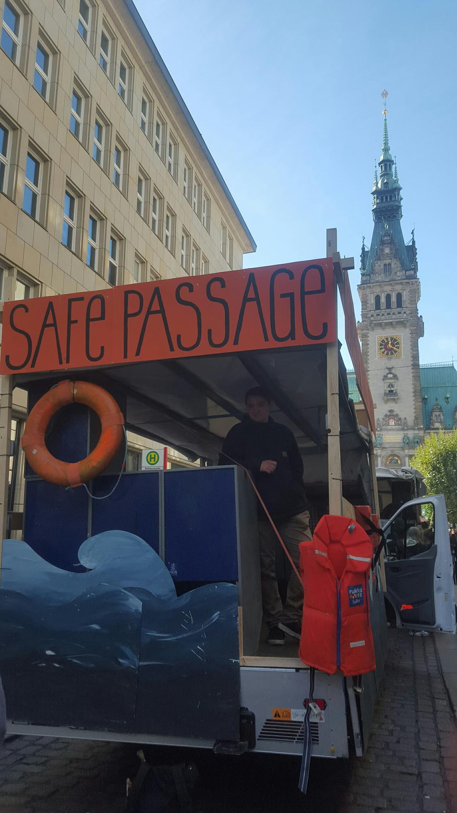

### AYS WEEKEND DIGEST 29–30/09/18: Fighting the poison of “saving people\.”

_Protests in Germany // Needs in France // Devastating conditions in Greece — refugees forced to pay for heating // Ten more people die along the route\.// 342 saved in Spanish waters //_

](assets/730124eabc77/1*Yy24sH2J1DZH5y2WGSjkCQ.jpeg)

Football scarf with the Bosnian word for “Unity” at a match attended\. Credit: [Ramo Bunić](https://twitter.com/ramobunic/status/1046090679515041793)

This whole week, AYS volunteers have been able to collect immense amounts of information about the situation in Velika Kladusa, and particularly Bihac\. As detailed in the report, the situation in Bihac is particularly dire and harsh for refugees, with the amount of state repression making independent support virtually impossible at the moment\. Locals are forbidden from helping and the few official outlets of support are greatly insufficient, which has resulted in an 18 year old boy from Iraq being forbidden from entering the small reception centre there with his adopted family\. As they are not birth family, he is considered independent, and only families are given priority\. He, however, has been traveling with them for two years\. He is now stuck outside in the cold\. We shudder to think of what comments in a tabloid story would say about this boy, probably impugning him with the sin of “being in a fake family to get ahead\.”

This phenomenon of “travel groups” is always a contentious topic, with accusations being leveled against people of their “strategy” and “unfair” playing of the system\. This belies the natural state of discourse and attitudes towards migrants and refugees\- they are inherently hostile and always trying to “game” their way through\. Rather than recognizing any sort of humanity in the faces or thought process of people enduring horrific circumstances, the broader media presents them as ultimately, agentless masses, whether they are insidious threats or hapless victims\.

The latter is often considered the ‘better’ of the two portrayals, however it is, upon a second glance, actually just a slightly different flavour of the former\. The best way to tease out someone’s real attitude towards those they “help” is to reject their help\. This was exemplified in a bizarre social media sensation that occurred over the weekend wherein former American Hollywood star Lindsay Lohan filmed [herself attempting to “help” a Syrian family in Moscow](https://www.bbc.com/news/entertainment-arts-45691616) \. Over the course of the video, when it becomes clear that the family does not wish to take her up on her offer \(which she makes in a rather threatening and confusing way\), she begins to accuse them of human trafficking and even tries to coax the children of the family away from their parents\.

The mother of the family, protecting her children, strikes Lohan who continues her tirade about how these people are bringing shame to their culture\. The situation was bizarre, but although weird antics are nothing new for pop culture icons, Lohan’s attitude of “if you don’t accept my help, then you are suspect/ungrateful/undeserving” pervades the discourse around support of any kind\. Indeed, in and around the mockery of Lohan’s erratic behavior \(which is not the target of this critique, but rather her attitude\), comes the cry _but she was trying to do something good\. How dare they refuse her help\! If they REALLY needed it…they would see her intentions…\._

Now this is a problem\. This insidious monster pops up from time to time and it must be fought\. It is there when people say that refugees and migrants must settle for low quality items\. It is there when assistance to a person is made contingent upon them accepting a particular religious or political worldview\.

This is a deeply dangerous and discriminatory view to have\. It puts the focus on the “helper” and more particularly the power they will attain through the acceptance of their help\.

Speaking from a personal note, the author of this comment has realized over time that truly, the most support that can be offered in most of these circumstances, and the most crucial is always just humanity and solidarity\. Material goods will always run short, and pragmatic needs will appear, and it is important to prioritize them\. But at the end of the day, focusing on food items, non food items, even entertaining programming is all in vain if it is not under the directive of simply affirming the humanity of the people around us\.

This is where we see the most success with grassroots support that is providing aid to local people in need as well as newcomers, like those who manage soup kitchens in Sarajevo\. Over 15,000 local people of Sarajevo depend on these soup kitchens\! \(Read more [here](ays-daily-digest-28-9-2018-syrians-are-the-biggest-groups-among-new-arrivals-in-europe-303946541780) \. \) A particularly good example of grassroots solidarity can be found in the efforts of the people of Tuzla\. In a Facebook group used by members of the community in Tuzla, people update each other on where newcomers are sleeping and what is needed\. Every day people jump in to provide support whether it’s in the form of jackets, shoes, or other means\. This is viewed not as some grand gesture of support, but the natural outworking of understanding that there are people around — real human people\! — who are having a rough go of it\.

Sometimes all that can be done is to share a cup of coffee and try to keep one’s mind from a dark place for a bit\. But in the author’s experience, this is what sticks\. I have never met up with someone who I had met earlier on the route, on the other end of their destination, say “you know what I remember, that load of shoes\.” No\. shoes are good\. Shoes are needed\. But what’s imperative is recognizing our friendships\. Now this definition of solidarity does not mean we delude ourselves that simply because we are all human that we all share the same experience\. Solidarity, sadly, cannot transcend privilege in many ways\. For as close as I got to friends I met along the route, I could still cross a border, and they could not\. However, this discrepancy, rather than making us turn away, should ignite our anger to the system that does sort us into different groups\. The anger of protecting and standing up for our friends, an anger that comes from genuine unity can sometimes be the only factor that can push all of us through impossible times\. Again as the evidence mounts of the extent to which all turn a blind eye to the inhumane enforcement of border security, we have to dig deep within ourselves and be willing to make difficult choices\. \(Comment: Kelsey Montzka\)

_Video from Rigardu in Bosnia\. Received from a man they met\. The boy is unconscious after interception by Croatian police\._
### Morocco

Horrifying video of persecution and camp clearing of refugees and migrants in Morocco\.

#### TURKEY

A boat capsized off of Turkey with 5 people onboard dying\. Five more people died in an accident in the Evros river in Greece — eleven people were onboard the craft trying to cross, and four were rescued\. Two people remain missing \(Thank you, [NoBorders](https://twitter.com/Refugees_Gr) for this information\! \) \.
#### Greece

Horrific conditions in Moria camp are only worsened through the rain\. Heavy [cold rains are a feature of fall weather](ays-daily-digest-28-9-2018-syrians-are-the-biggest-groups-among-new-arrivals-in-europe-303946541780) and Salam Aldeen has documented the horrifying misery in which thousands are trapped\. Most international officials are aware of the situations, yet there are only minor efforts\. In the photo below, people are packed into a children’s play centre to stay out of the rain\. This was part of the government plan to “protect” people from the storm nicknamed “Zorbas” that moved across Greece this weekend\.

Photo credit, Salam Aldeen\.

In other disturbing news, now refugees will have to pay for the privilege of survival in their prison\.

■■■■■■■■■■■■■■ 
> **[RSA](https://twitter.com/rspaegean) @ Twitter Says:** 

> > Refugees have to pay to survive in Moria: 3-4 euros for a wood pallet to put under the tent as rain protection, 15-25 euro to connect to electricity…tents, pots, food, winter clothes, medicines…
#stopthetoxicdeal #opentheislands 

> **Tweeted at [2018-09-28 15:28:09](https://twitter.com/rspaegean/status/1045696673488474113).** 

■■■■■■■■■■■■■■ 

Conditions also remain horrific in Vial, Chios, with toilets being removed and individuals residing outside the camp \(around 1000\) in makeshift huts\. Furthermore, according to [Aegean boat report](http://Aegean Boat Report) , 42 people arrived to Chios on the 29th\. 15 people also arrived to Samos\. Furthermore on the mainland, clashes between groups in the camp in Malakasa have left [at least one person](https://greece.greekreporter.com/2018/09/29/at-least-one-dead-in-bloody-clashes-at-greek-migrant-camp/) dead\. It remains unclear the full understanding of the situation, but it is hoped that it will not escalate as what happened in Moria earlier in the year\.

■■■■■■■■■■■■■■ 
> **[Dwatch News Europe](https://twitter.com/dwatchnews_eur) @ Twitter Says:** 

> > According to information, after the loss of toilets in bial, some were made. 
Also around 1000 people live outside the official "camp", most not even in tents, but in makeshift huts that they themselves #chios #refugeesGr made 

> **Tweeted at [2018-09-30 02:30:35](https://twitter.com/dwatchnews_eur/status/1046225767250767872).** 

■■■■■■■■■■■■■■ 

[Starfish Foundation — Help for refugees on Lesvos](https://www.facebook.com/starfishfoundation.org/?__tn__=%2CdkCH-R-R&eid=ARAMbjx5uSrUjD4UDkYjkxbmJ6TjWvsQ2RrqempkLZWzMrwdQR7ZrC8aUCf9Hhc1mWsNCx21_QNaOSWS&hc_ref=ARQJHvNqGobGZM65iST_oH4Mdjyt6rtoomlgPVu5wrkKyz6uHwTc2NAus2H2kxvdFpM&fref=nf) and [One Happy Family — Community Center, Lesvos](https://www.facebook.com/OHFLesvos/?__tn__=%2CdkCH-R-R&eid=ARA2NQe0kDC-uGjBSSYxOrjuU4uMJA46YMaid1Jzn2Uht3JLyt0pOIbtMadq2FFbeDyR-MMBMgqCmgQc&hc_ref=ARSLlElortYu7oeFVaelwyecSpNHYHCJS8CYHHdrLPjdqLf3WvUYZ9MQlLCSjhv2lEM&fref=nf&hc_location=group) both have posted calls for volunteers\! If you can offer help and support, please contact them and see what volunteer needs they have\! Notara also posted a needs list which can be accessed [here](https://www.facebook.com/645186555621294/posts/1252771588196118/) \.

342 people alone were rescued in Spanish waters this weekend\! The continued political shuffling around Search and Rescue operations is wreaking havoc\! Please consider [signing this petition](https://you.wemove.eu/campaigns/sauvons-l-aquarius-et-le-sauvetage-en-mer) to protect the Aquarius which has been stripped of its flag and is not allowed to sail\.
### Germany

40,000 people took to the streets of Hamburg for the We’ll Come United on Saturday the 29th\! Both Alarmphone and [Solidarity at Sea](https://www.facebook.com/solidarityatsea/posts/248219885893576?__xts__%5B0%5D=68.ARBDbwjCUTTA-xmTjImu4curmJTCITlZulYUEb19BUmypzTBsGPA7kGH6aRTHxCpVfVU7REhboEI0Dae3bCSJinGoGHpk64K9-ECDRq6qlmw2JgBjhrBHSOjMfcHCxy8yW0dQqlE73ouxrMeEVSzYyMgSLzmHHo7HMQtZZRzqpMJkWbNLSGS&__tn__=H-R) participated in the march which was organized to protest against racist border policies and injustice against refugees, and to rally support for refugees and migrants\. Were you at the march, how was it? Let us know\! \!

Photo credit: Watch the Med — Alarm Phone
### France

The situation in hotspots around France continue to be awful with at least 1300 people living around Dunkirk, and there is a great need for volunteers there\. [Paris Refugee Ground Support](https://www.facebook.com/PRGS.team/?__tn__=%2CdkCH-R-R&eid=ARCKI_suXckw7kxt4WGK1GNTlQjSJ_-kfdeqdeTRDi9kEHVHwFb3u3UjHNzEuJM0LCnkv7FoZ9vFk8Z2&hc_ref=ARR6C4pyWbda0iwhRbH2lNT2VDwZZRJN4_EylyPKONcKNTGOEoI1bTT9RpBNZPYCN8s&fref=nf) requests volunteers \(Minimum stay of one week\) and monetary donations\. [FAST \(First Aid Support Team\)](https://www.facebook.com/groups/FASTCalais/permalink/2207212202891951/) has had to halt operations due to a lack of volunteers, so please contact them for more information\. [Care4Calais](https://www.facebook.com/care4calais/?__tn__=%2CdkCH-R-R&eid=ARCR7NjUN8Ki3J3i9hCIZokD4ENc-hGm3MQUlRmbE8Q2ejENhJX9OC1feApJvJX4O3Ui4xaSaOM5OpxY&hc_ref=ARQYQ9__8SJ4ZsHFw80nAsnpB5kI8xRaN76bo0q2sWYyaFpg7Z8pENFnVBhfmHIHVjU) needs donations for cheap mobile phones as the police keep smashing refugees’ phones\. We also covered a wide variety of support projects in [this digest](ays-daily-digest-27-9-2018-with-the-winter-approaching-help-is-need-all-over-europe-1e3465c06441) \.

**We strive to echo correct news from the ground through collaboration and fairness\.**

**Every effort has been made to credit organizations and individuals with regard to the supply of information, video, and photo material \(in cases where the source wanted to be accredited\) \. Please notify us regarding corrections\.**

**If there’s anything you want to share or comment, contact us through Facebook or write to: areyousyrious@gmail\.com**

_Converted [Medium Post](https://medium.com/are-you-syrious/ays-weekend-digest-28-29-09-18-fighting-the-poison-of-saving-people-730124eabc77) by [ZMediumToMarkdown](https://github.com/ZhgChgLi/ZMediumToMarkdown)._
