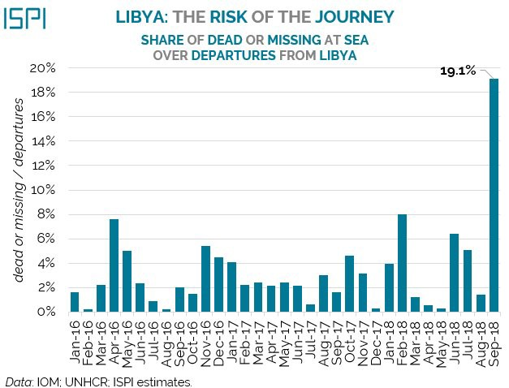
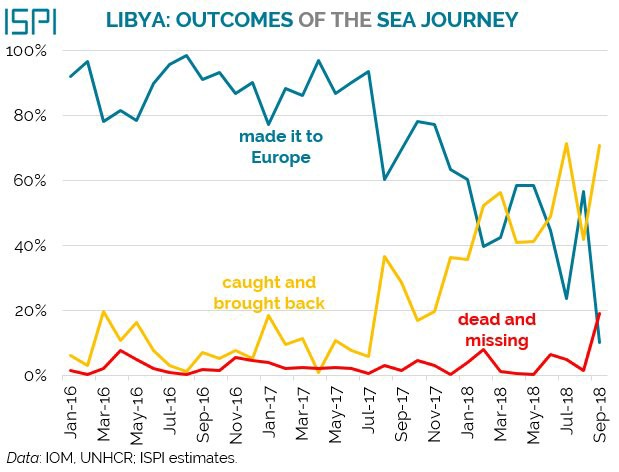
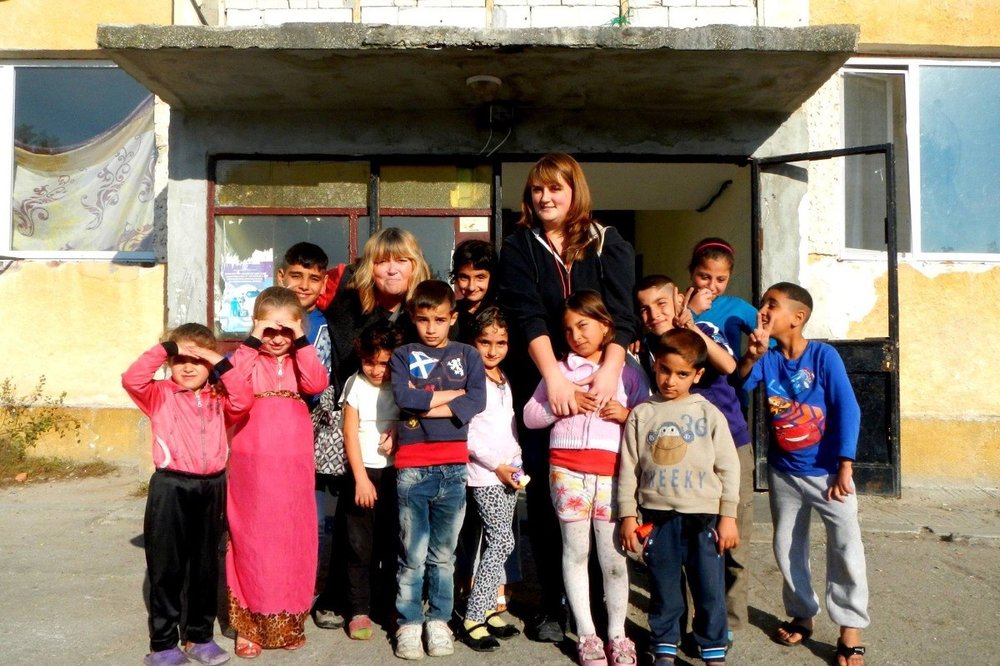
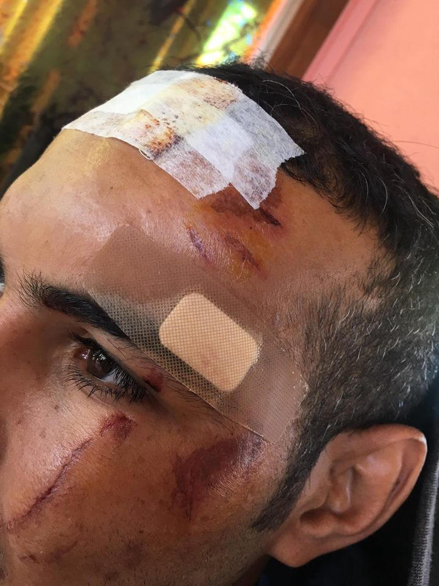
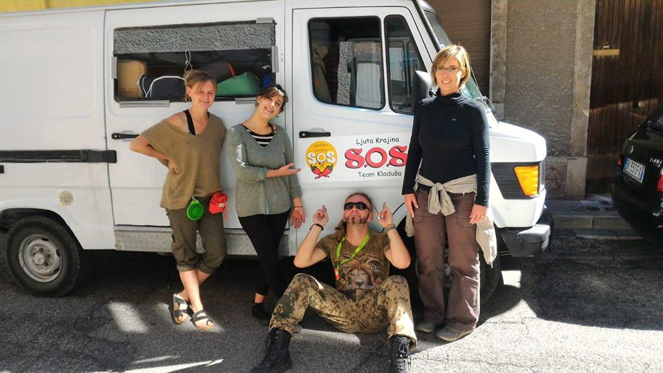
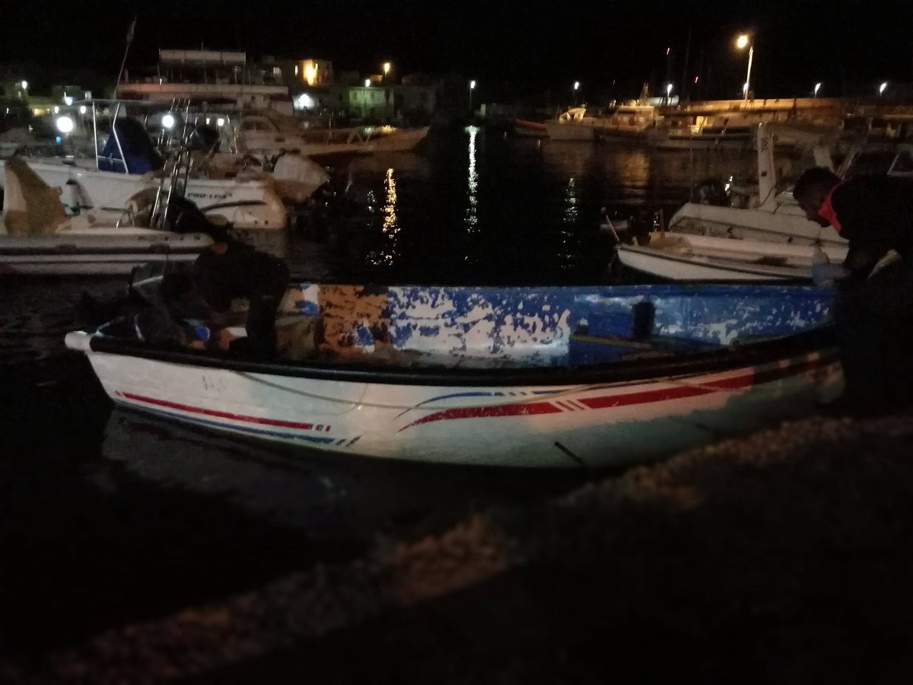
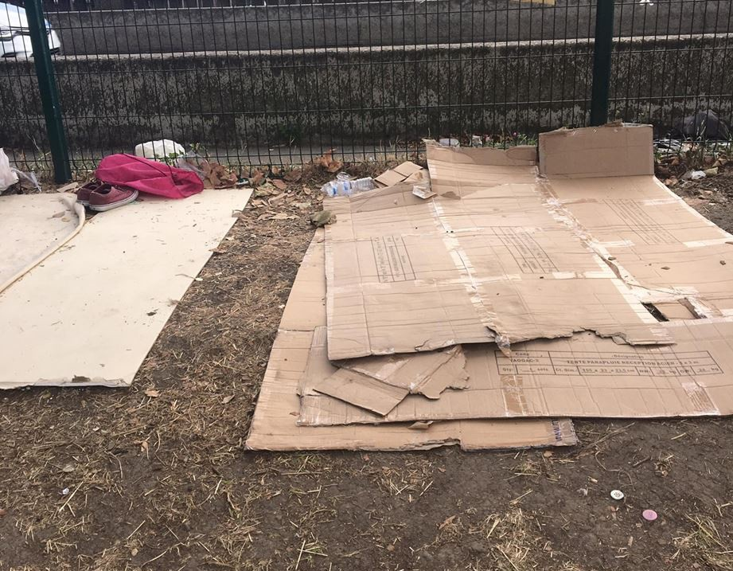

### AYS digest 1/10/2018: Death toll in Mediterranean reaches a historic high
#### Temperatures at Croatian border drop to 2 degrees Celsius / Confusion over the “anti\-immigration tax” in Hungary / Authorities continuously taking blaknets and tents from people in Paris / Groups in Bosnia, Bulgaria and France are asking for donations

](assets/e71170e3f7ac/1*nAzOAf_TmpCLx6crbm34EQ.jpeg)

Credits: [MSF](https://twitter.com/MSF_Sea/status/1045264444488634368)
### Feature
#### With no rescue ships, no one can hear their screams

Following the immense pressure against rescue missions in the Mediterranean, refugees are once again forced to risk their lives by sailing all the way to the Italian coast, often in small, inadequate vessels\. Apart from the tragedies that we know of, aid workers and volunteers fear that many unreported shipwrecks are happening at sea with no one to support the victims\. Even the official numbers are higher than ever before\.

According to the DW, Human rights groups have accused Italy of reaching a new low when it comes to its approach to refugees and migrants after allegedly putting pressure on Panama to revoke the flag it granted the Aquarius migrant rescue ship to operate in the Mediterranean\.

Since taking power in June, Interior Minister Matteo Salvini, who heads the far\-right League party, has refused to allow charity rescue ships to dock in Italy, a policy that has broad popular support after the arrival of almost 650,000 people from North Africa since 2014\. Though arrivals are down 80 percent from last year, Salvini’s hard line on immigration has helped more than double support for his party since the March national election\.

This September, refugees departing from Libya died or went missing at the highest rate ever recorded as the direct result of this policy\. According to the IOM statistics, only one in 10 made it to Europe, while seven in 10 were caught and brought back and one in five died or went missing\.

In the past four months, at least 861 people lost their lives after departing from Libya\. If we include people departing from Tunisia, 970 persons died or went missing at sea, with no one to hear their screams\.

A full spreadsheet with all known crossings from Libya, but also drownings and returns in the past two years, can be found [here](https://docs.google.com/spreadsheets/d/1ncHxOHIx4ptt4YFXgGi9TIbwd53HaR3oFbrfBm67ak4/edit#gid=0) \.

At the same time, [Sea Watch](https://www.facebook.com/seawatchprojekt/photos/a.1579563625595046/2125911257626944/?type=3&theater&ifg=1) points out that there are 800 life jackets on board the Sea Watch 3, which is still not allowed to leave the port of Valletta\. As the weather conditions are getting rougher, it is to be feared that even more people will end up in distress in the coming weeks\. Only today, [ProActiva](https://www.facebook.com/proactivaservice/videos/331309187620065/) published a video in which they passed a typhoon\.
### Sea

Last week, Constantin, a doctor at Jugend Rettet’s Iuventa and other NGO rescue ships, spoke in the EU parliament\.

Meanwhile, the Spanish Coast Guard has rescued almost 700 people in distress, [FAZ](http://www.faz.net/aktuell/politik/ausland/spaniens-kuestenwache-rettet-fast-700-bootsfluechtlinge-15815939.html) reports\. Today they counted almost 450 rescued people\.

■■■■■■■■■■■■■■ 
> **[SALVAMENTO MARÍTIMO](https://twitter.com/salvamentogob) @ Twitter Says:** 

> > Pateras hoy hasta las 20.30h//Alborán: 310 rescatados de 11 pateras por @[guardiacivil](https://twitter.com/guardiacivil) /Hamal (61+5), a Motril, Calíope (58+58+32), Spica (10+13+20+16+20), ambas a Málaga, Alcor (17) a Melilla //Estrecho: 148 de 6 pateras por Gadir, Arcturus, a Algeciras a bordo del María Zambrano https://t.co/oU8EteUkjX 

> **Tweeted at [2018-10-01 18:31:58](https://twitter.com/salvamentogob/status/1046830095640481794).** 

■■■■■■■■■■■■■■ 

Good news also arrived from [Malta](http://www.faz.net/aktuell/politik/ausland/spaniens-kuestenwache-rettet-fast-700-bootsfluechtlinge-15815939.html) : The Aquarius was allowed to hand over 58 rescued people to a Maltese ship, which transferred them to the island\. They will be relocated to four European countries\. The bad news is, that the Aquarius is still unflagged and therefore has to head to a French port now and see how it will be able to continue its rescue mission\.
### Greece

There have been rumours recently that supporters of IS/Daesh have infiltrated and established a system of criminality and violence at the Moria camp on Lesvos, DW reports\. A media team has investigated the reports and talked to victims of this group and their report can be found [here](https://www.dw.com/en/terror-at-the-moria-refugee-camp/av-45685604) in English\.

In order to continue the operations of its medical clinic, the One Happy Family center on Lesvos is asking for donations\.

Volunteers published footage from Vial camp on Chios showing the dire conditions there at the moment\. Around 500 people are said to still live in camping tents, inappropriate for the harsher conditions coming with autumn and winter\. They “were left defenseless against the rains that came this weekend — i\.e\. wet, cold, with nowhere to go and no hot shower in which to warm up”, Nina McKee reports\. To get at least tarps and pallets to better protect the people from the rain, they are asking for donations: [https://www\.gofundme\.com/vc9tw2\-resources\-for\-vial\-refugee\-camp](https://www.gofundme.com/vc9tw2-resources-for-vial-refugee-camp) \.

Marking the international day for older persons, [I Am You](https://www.facebook.com/iamyourescue/photos/a.1012648618776866/2268476646527384/?type=3&theater&ifg=1) reminds us that 0\.6% of camp Ritsona’s population are over 60 years old\. “Three major problems facing most refugees, in particular older refugees, are social disintegration, abandon to their own devices, and chronic dependency\.” For the same camp Lighthouse highlights that only 65 of the around 200 children are able to attend classes in local schools\. “Most of the schools close to Ritsona are full, and as such, many children have to wait while places are found for them,” the team writes\. Another problem is that the children often do not know enough Greek to follow the lessons\. And: “Many children who attend school return to Ritsona early\. There are many reasons for this, but the effect is that they are receiving less schooling than they deserve\.” In order to provide the children with support and assistance, Lighthouse asks for donations: [https://www\.globalgiving\.org/projects/back\-to\-school\-help\-refugee\-children\-in\-greece/](https://www.globalgiving.org/projects/back-to-school-help-refugee-children-in-greece/)

The team of Refugee\.Info has published a [Q&A article](https://www.refugee.info/greece/marriage-in-greece/getting-married-in-greece/?language=en) about how to get married in Greece\. They explain which documents and legal steps are needed\.

RefuComm published the new Skype schedule:

### Bulgaria
#### Harmanli Refugee Camp Play School is asking for support

Harmanli refugee camp is a hideous place in Bulgaria, where many have lost their physical and mental health over the past years\. It is located in the south east of Bulgaria, 20 minutes from the Turkish border and currently hosts only 250 people\. Typically, over a quarter of the refugees in Harmanli camp are children and they can spend anywhere from a few days to more than 2 years living in the camp\. Many of these children had either never been to school or had been out of school for years before arriving in Bulgaria\.

Harmanli Refugee Camp Play School was set up in November 2014 by two volunteers from England\. Gil Clasby is a qualified nursery nurse and Sadie Clasby is a qualified primary school teacher; both have qualifications and years of experience in playwork\. Their aim has been to set up and run a centre for play\-based learning and therapeutic play in which refugee children can relax, have fun and thrive\. They are now asking for donations to continue their work, so click on [their fundraiser](https://www.gofundme.com/harmanlirefugeecampplayschool3) to find out more\.
### Serbia
#### Sharp rise of Iranians in Belgrade: legal entry into Serbia, illegal and often violent road to the European Union

Miskalište was one of the first spots to offer support to refugees in the summer of 2015, when the Balkan route was still open and most governments had no idea what to do with newly arriving refugees from the Middle East and other war\-torn areas\. They still offer support to refugees, but in a different space and under very different political and social circumstances\. In spite of a decrease of interest by the Serbian media in refugee and migrant topics, the world’s leading independent journal The Guardian frequently reports on the situation on the “former” Balkan route\. Their reporter visited Miksalište last week and [investigated](https://www.theguardian.com/world/2018/sep/28/iran-refugees-europe-eu-serbia-belgrade-asylum-seekers) why Serbia has had a sharp rise in the number of Iranians seeking asylum, as young people flee from the destroyed economy and narrow\-mindedness of traditional Iranian society\.

> Last year, Serbia became the first country in mainland Europe to offer Iranians visa\-free travel\. Hostels and apartments are full to the roof thanks to Iranian tourists\. In Knez Mihailova, Belgrade’s pedestrian zone, Farsi is frequently heard\. However, many Iranians are not taking their return flights\. Planes arrive full and leave empty\. They are driven to the west partly because of economic hardship, exacerbated by [Donald Trump’s new sanctions](https://www.theguardian.com/us-news/2018/aug/22/us-ready-to-drive-iranian-oil-exports-to-zero-says-us-national-security-adviser) that have sent Iran’s currency, the rial, into a tailspin\. Soroush Rahmani, 24, arrived in Serbia four months ago\. He was using a 72\-hour leave period from his refugee camp to sleep rough in the capital, gearing up for his overnight “game” — to try to enter the EU\. Tonight would be his ninth attempt\. “Iran was like hell,” he says\. “I prefer to sleep in cardboard here rather than live in Iran\.” Hungary’s tough border security means Rahmani will attempt to enter the EU through Croatia\. Many refugees first cross into Bosnia and Herzegovina, as the longer border gives them a better chance\. Bosnian media [reported recently](http://ba.n1info.com/a283505/English/NEWS/Iranians-tourists-in-Serbia-end-up-as-migrants-in-Bosnia.html) that the number of Iranians seeking asylum in the country this year \(up until September\) stood at 1,647 compared to 16 Iranians in the whole of last year, wrote Saeed Kamali Dehghan for The Guardian\. 

Violent push\-backs from both Hungary and Croatia remain a burning topic in the region, with refugees being illegally and often violently returned to Serbia, Bosnia and Montenegro by European police officers\.

Aftermath of the encounter with Croatian police near Bosnian border\. Photo: NNK
### Bosnia
#### Temperature drops to 2 degrees Celsius in a makeshift border camp, volunteers collecting money for winter tyres

In Velika Kladuša the temperature drops to 2 degrees at night\. The displaced people don’t want to stay in these conditions in a makeshift camp and try to reach Europe, but they are pushed back and beaten, even more than before, by the Croatian police, says the No Name Kitchen crew\. SOS team Kladuša is also providing valuable support in the area\. They have got a new van, but the van needs winter tyres\. Their old car will also need winter tyres, so they’re asking for donations for this purpose\. If you can help, [contact them on Facebook](https://www.facebook.com/SOSTeamKladusa/?__tn__=kC-R&eid=ARDFbySCpsFMdGwafdSi2BNRHfjzJuXUVTLJq9hB7Iz-Acmg494sZROKYL1NUNXcul2okfYOaYmq4Dka&hc_ref=ARRZB-rxeFOARBVyo6_lPUmvfM-EObiHcfTnKvYAGxdPcpR7SPnhtoXaYdvI0QUhtkM&fref=nf&__xts__[0]=68.ARCVatscJyoMTVYFW_biuP5skVgTquo2OjGHlvCwfQVrqoR6YS_J73gvRBMJlS-laToDoozhc3MKQOo6UCSIjBsv_OCAX5YH_lFSK9OiBhnzP9N3E0trHcgbHUY5GqV2eqV_9kxEgy05_4f1Us_DlhatquPsRjcMEORdtg525Bpi36jLDIMtUw) \.

New volunteer van in Velika Kladuša was \(unfortunately\) named DjiDji\. :\) Photo: SOS team Kladuša

In Sarajevo, the UNHCR is making progress in building the camp at Hadzici\. Apparently, it will be opened soon\.

■■■■■■■■■■■■■■ 
> **[Peter Van der Auweraert](https://twitter.com/PeterAuweraert) @ Twitter Says:** 

> > The work of @[UNmigration](https://twitter.com/UNmigration) to provide #migrants with safe and humane accommodation and hence reduce pressure on local population is progressing. Location in Hadzici #Sarajevo is almost ready for opening https://t.co/MglhDhCDeu 

> **Tweeted at [2018-09-29 16:15:55](https://twitter.com/peterauweraert/status/1046071081944141825).** 

■■■■■■■■■■■■■■ 

### Hungary
#### Confusion over the implementation of the new “anti\-immigration” tax that targets organisations working with refugees

The Hungarian government has stepped up its anti\-immigration measures with a new tax on aid groups it says support migration\. In response to measures imposed by the Hungarian government that attempt to crack down on civil society individuals or organisations that purportedly “promote illegal migration”, the Hungarian Helsinki Committee \(HHC\) and the Open Society Foundation \(OSF\) have both announced that they are filing cases against the Hungarian government at the European Court of Human Rights\.

Open Society’s ECHR application addresses amendments to Hungary’s criminal code that took effect on 1 July 2018, which make it a criminal offense for an individual or an organization to offer support — including legal advice, or support asylum or residence applications — to migrants or refugees entering Hungary\. It also challenges a new 25% tax on funding for activities and organizations that “promote or positively portray migration\.”

Today, Migration Aid Asylum Seeker Foundation has published a statement on their website, describing the confusing situation related to the implementation of the new law\. We are copying it fully:

> Two weeks ago, government media and government politicians said that “Soros organizations” refuse to pay special immigration taxes\. Apart from the fact that Migration Aid Asylum Seeker Foundation has never been in Soros’s mercy, let’s say that the foundation has acted legally so far\. We did not pay taxes not because we did not want to, but because there was supposed to be a declaration for September 26 to August 31, 15 September\. In this one week, however, the Foundation ceased its usual activities, we announced that we were temporarily suspending the collection of donations, so that the foundation could not become the subject of the tax\. As the law entrusted the National Tax and Customs Administration \(NAV\) with the collection of taxes, we turned to the office on the day after the law entered into force\. We asked NAV for an official decision on the fact that, according to the Office, the Foundation is the subject of the tax, and if so, for which activities\. In addition, we also asked questions about how tax returns and payments are made\. 

> NAV e\-412728 filed our request but did not respond in any way within the 30\-day deadline\. Not only did we not get a substantive response, but we did not even know if we should wait with more patience\. On September 28, we inquired at the Office as e\-paper, whether there are any grounds for not informing taxpayers about their tax issues\. We have not received any answers yet\. As we learned, not only did we do so, the NAV did not respond to press inquiries either\. We have been interviewed in other organizations as well, we did not receive any feedback from anyone that would have paid taxes or the NAV would have contacted them\. 

> A question is raised\. Did Fidesz only create this law to launch a campaign against refugee organizations? Do they just make pseudo\-laws for news? It seems that NAV does not want to collect the special tax on immigration, nor does it even consult with the people concerned\. 

### Italy
#### Families risk their lives to reach Lampedusa

Last night, at least two small boats with a total of 30 people on board landed on Lampedusa\. They sailed from Zarzis\. One boat had a family with three children on board\. The other, which was only 6 meters long, carried 20 people on board\. There was even a child with no parents\. According to local volunteers, the people were transferred to the Contrada Imbriacola\. They have been checked by a doctor and everyone seems to be ok so far\.

Small 6\-meter vessel carried 20 people from Zarzis, Tunisia to Lampedusa, Italy\.
### France
#### Stuck in a loop: officials take away tents and blankets, volunteers struggle to distribute more as winter approaches

Winter is slowly but surely coming back to Paris and temperatures can already drop to below 10 degrees at night — that’s cold when you have just a blanket, but freezing when you have absolutely nothing\.

[Faces before numbers](https://www.facebook.com/FacesBeforeNumbers/?__tn__=%2CdkCH-R-R&eid=ARAFZ_7aZzIUx3TpzE6Uo4w249291HHD6Ll-jclUStL1-5WMnpTzBt_G-74dnYI0ABPz_nvgKtkeTDQ6&hc_ref=ARS_M9iQuSCG-ek6QkXBSBk2hMocPtZUJdbK0XvRqxMsea_p2ZBIwQC5lbclIgb2-DM&fref=nf&hc_location=group) have published a FB post describing the current situation, which seems to be a vicious circle where authorities take away basic necessities, volunteers struggle to provide more, and no one is held accountable for the inhumane conditions in which refugees are forced to live:

> In this area around 70 people sleep, stuck between a busy highway and a loud bar\. The vast majority of these people are from East Africa and have fled their home to seek peace, safety, and respect of basic human rights\. Until last week, most of the men & women sleeping there had blankets — or at least one for a group of 3/4 people — and some even managed to find mattresses or things where they could lie down instead of sleeping on the hard ground\. But last Wednesday, the French authorities brutally decided to clear that space and took every single blanket, mattress, sleeping bag & anything they could find lying on the floor — i\.e\. people’s personal belongings\.Of course, these authorities were enthusiastic enough to confiscate everything & put it in the garbage but that enthusiasm stopped before offering any kind of solution/option/alternative to the people sleeping there — some of which have claimed asylum in France — leaving dozens of minors, women, and men with nothing\. We were able to give blankets again to them thanks to the amazing [Paris Refugee Ground Support](https://www.facebook.com/PRGS.team/?__tn__=%2CdKH-R-R&eid=ARBy1N7pc5683wU56U03dSlradTdrK6mJ3IDugJavt5n4jx7Ht-tM0ZQS9XFkRKeapiZwX5mxvfx1HeI&fref=mentions&hc_location=group) team\. These kinds of clearance is what’s preventing tent distributions, as they would be confiscated straight away and the people sleeping there understand & agree it would be a huge waste that no one can afford with the winter so close\. 

Left with nothing in freezing temperatures — and no one is held accountable\. Photo: Faces Before Numbers
#### Locker room in Paris needs donations

The coordinator of Locker Room, a place in Paris \(st\. Bernard de la chapelle\. 12, st\. Bruno 75018 Paris / angle st\. Luc\) where refugees can get basic necessities, has published a new call for donations\.

They especially lack hygiene products: toothpaste, toothbrushes, deodorant, razors, shaving cream, shampoo, shower gel, tissues, body cream, Dexeryl cream, nail clippers and toilet water\.

For Children: diapers and milk\. For Women: pants, long skirts, underwear \(new\) \. For Men: Pants \(jeans\) Size 38 to 44, shoes \(Baskettes\) from 40 to 45, belts, socks, boxers, hats, shirts and t\-shirts size s, jackets season , sweatpants, backpacks, sleeping bags\.

Need Volunteers: Wednesday from 15 am to 18 pm to sort and receive donations\. Saturday and Sunday from 9 am to 14 pm for the distribution of clothes and to receive donations\. Note on the list by SMS at 06 03 02 83 72\.
### Germany

Many football clubs in Germany struggle with getting player passes for refugees, Spiegel reports\. As soon as one team plays in the fourth tier or higher, the whole club is obligated to follow the FIFA rules for player transfers when registering foreign players — even children\. The rule originally was implemented to prevent big clubs from approaching to children with money\. Due to the difficult restrictions, for example getting the permission of the former club — which can be in Syria or anywhere else — to the birth certificate or the working permit of the parents, this procedure can take more than one year\.

Around 200 people today protested in Bremen against the deportation of an Afghan\. He was about to be deported from Bavaria, but as there was no space for deportation detention, he was temporarily transferred to Bremen\. According to the Refugee Council of Bremen, the deportation has been stopped\. The Interior Ministry of Bremen did not confirm this information, [Buten un Binnen reports](https://www.butenunbinnen.de/nachrichten/politik/demo-gegen-abschiebung-afghane-bremen100.html) \.

**We strive to echo correct news from the ground through collaboration and fairness\.**

**Every effort has been made to credit organizations and individuals with regard to the supply of information, video, and photo material \(in cases where the source wanted to be accredited\) \. Please notify us regarding corrections\.**

**If there’s anything you want to share or comment, contact us through Facebook or write to: areyousyrious@gmail\.com**

_Converted [Medium Post](https://medium.com/are-you-syrious/ays-digest-1-10-2018-death-toll-in-mediterranean-reaches-a-historic-high-e71170e3f7ac) by [ZMediumToMarkdown](https://github.com/ZhgChgLi/ZMediumToMarkdown)._
