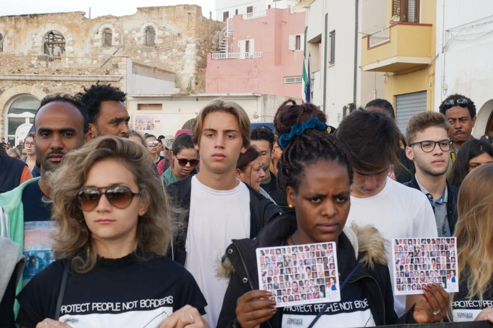
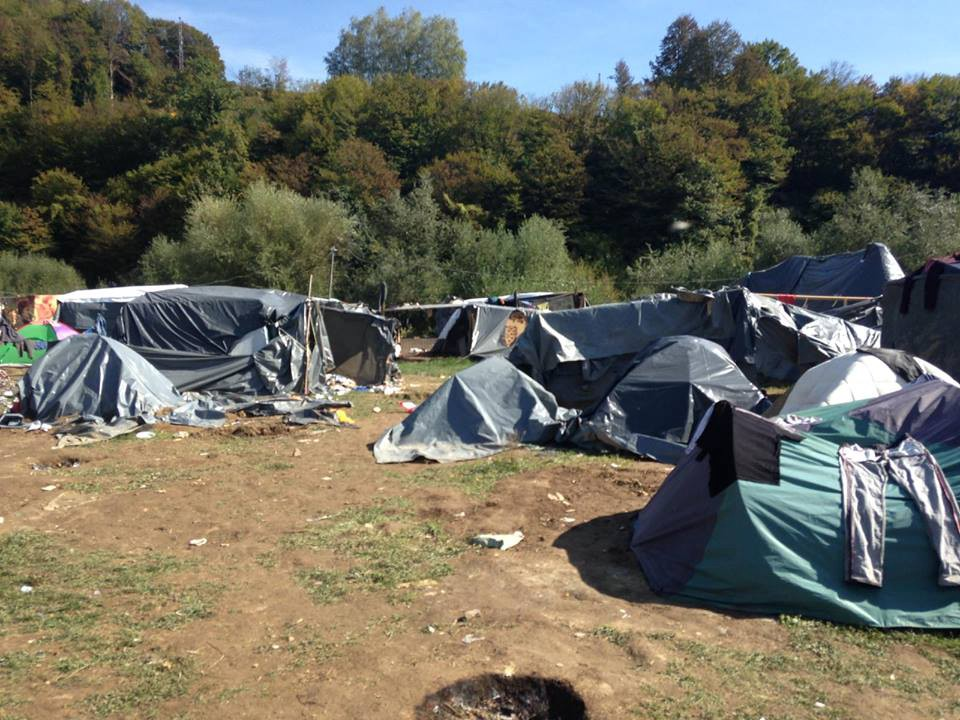
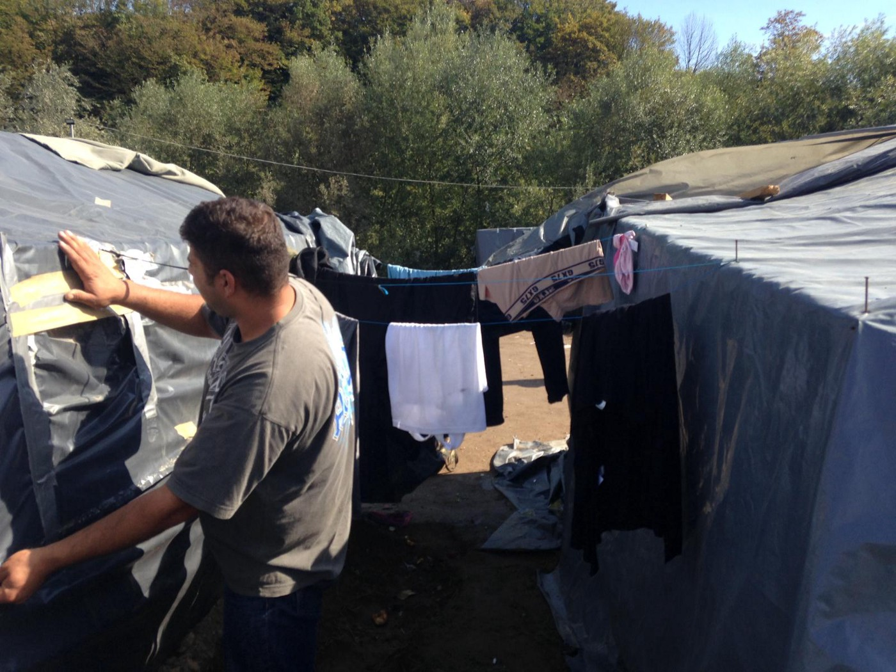

### AYS DAILY DIGEST 03/10/2018: Victory for Dubs amendment in UK court of appeals

_Death in Morocco // More humiliation from Greek Border Police at Evros // Remembering the 366 who lost their lives off Lampedusa in 2013 // Long lines with little result in Moria // Evictions continue in Via di Scorticabove // In Bosnia, no shelter from the storm // 366 deportations from Germany to Afghanistan this year_

 \.](assets/2bcc3a37ab/1*nb7teGnHHLGDcg-I8asKlQ.jpeg)

Children running in Moria Camp on Lesvos\. Source: [RSA](https://twitter.com/rspaegean/status/1046815898328338435) \.
### Feature: From Court of Appeals, a victory for Dubs — but what now?

Lord Alf Dubs understands what it means to be a child refugee intimately\. He was only six years old when he left Nazi\-occupied Prague for the UK, one of thousands of Jewish children brought to Britain under the _Kindertransport_ rescue effort\.

In November 1938, five days after _Kristallnacht,_ an international group of advocates met with Prime Minister Neville Chamberlain and proposed that unaccompanied Jewish children be temporarily allowed to come to the UK\. In 2016, almost 80 years later, Lord Dubs presented a very similar scheme to Parliament\. Cognizant of a new refugee crisis, specifically the large number of unaccompanied minors living in the Calais Jungle only 40 kilometers from British soil, his goal was to bring 3,000 refugee children to safety in the UK\.

Back in 1938, the British Cabinet debated _Kindertransport_ the day after it was presented, and voted on the scheme soon after\. The first Jewish children arrived in Harwich less than three weeks later\. Over the nine\-month period that followed, nearly 10,000 young people from across Europe were brought to the UK, hosted by British families, taught in British schools, and integrated into British society\. It was an extraordinarily effective program that gave countless children with the misfortune of growing up in a war zone a second chance at living a full life\.

Dubs has not been the resounding success that _Kindertransport_ was — far from it\. The two\-plus years since the initial proposal have been, by turns, hopeful, surprising, frustrating, devastating; mostly, they have passed achingly slowly\. The sheer number of vicissitudes involved in this case would seem almost comical if not for the fact that children’s futures hang in the balance\.

To begin with, Lord Dubs’ initial proposal was shuffled around between the two houses of Parliament: first rejected, then accepted\. When the Jungle was evicted in early November 2016, many of its unaccompanied minor residents were told that they would be sent to the UK under Dubs\. For most, this never happened\. Only 200 children were transferred during and shortly after the evictions\.

In February 2017, three months after evictions, the UK government announced the scheme would end and capped the number of children who would be transferred under Dubs at 350 — around [1/10th](https://www.bbc.com/news/uk-politics-38919873) of the initial proposal\. Faced with public resistance, Member of Parliament quickly did an about\-face and reopened the debate — but then, in March, voted to end Dubs once and for all\.

Since late 2016, the British organization Help Refugees, which was started in response to the situation in Calais, has brought a [court case](https://helprefugees.org/dubs/fact-sheet/) against the government\. It alleges, essentially, that the UK government was wrong to close the Dubs scheme, that it has generally failed to either carry out or renege on Dubs efficiently and straightforwardly, and that it failed refugee children by not providing them a reason for rejecting their Dubs applications\.

Help Refugees previously succeeded in getting the government to raise its cap from 350 to 480 children\. **Today, the UK court of appeals upheld Help Refugees’ challenge to the UK government, ruling that the government acted unlawfully in not providing reasons to those children refused entry to the UK under Dubs\.** This latest ruling is a huge vindication for Help Refugees and a victory for both child refugees and all those who have spoken out about or advocated on their behalf\. Lord Dubs said in response: “For two years, we have fought tooth and nail for the rights of these vulnerable children\. Today, I’m relieved to say that it was worth it\.”

However, it remains uncertain what precisely will come of this ruling\. Help Refugees’ next goal is to reopen Dubs entirely , but nearly half of the 480 slots allotted to child refugees under this iteration remain [unfilled](https://act.helprefugees.org/help-refugees/dubs-now2018/dubs-now/) \. Thousands of unaccompanied minors are still living in France, Greece, Italy, and beyond\. Some of those children are back in Calais, trying desperately to get to the UK by any means necessary\. Some of them have died trying\.

When it was first announced in February 2017 that the Home Office was backing out of its commitment to bring child refugees to the UK , it seemed intolerable that the children left behind after the Jungle’s evictions — already in a state of extreme precarity and vulnerability — had been left hanging for so long\. It has been sixteen months since then\. The way that this entire case has been handled by the UK government remains a travesty\. Each passing day is another one that every child waiting for a definitive ruling on Dubs will never get back\.
### Morocco

Another refugee from Sub\-Saharan Africa is dead after a police chase in which 36 other refugees were arrested, AMDH Nador [reports](https://www.facebook.com/AmdhNador/photos/a.1693125780899690/2194494564096140/?type=3&__xts__%5B0%5D=68.ARDGF-vqxtZDXEgoLyOqqcL9tx-H1sXvN_08t9sq83Hb7FaowdNOtOcZS3AP71_NOdietOBdqNfy-5gLuru8t1Bt-bxGoGvKm7o3RrXSfndOOHlAtydW3b205HfWUJ0Y3Xp66OulEZIUH-QxUb3cYY3FMTjbwrY8V8PaSeF27OO7aQcTiaMBug&__tn__=-R) \(note — content warning for disturbing images\) \. Police claim that the man fell to his death while running from the authorities\.

AMDH calls for “all light to be shed on this death, which came during a manhunt by the authorities” and demands “an end to this campaign of arrests and push backs as illegal as they are deadly\.”
### Turkey

During a routine patrol close to the Greek border in Bosnaköy, a team from the Edirne gendarme corps came upon a group of eight Pakistani refugees who claim to have been stripped naked, robbed, beaten and pushed back by Greek police\. They were given clothes and a medical examination and turned over to the Edirne migration authorities\.

Stealing refugees’ clothes before violently pushing them back across the border is fast becoming a central strategy of the Greek border police — we reported on another such incident in our digest [last week](ays-daily-digest-25-09-18-statement-on-a-unjust-verdict-against-ays-volunteer-b91baab377ba) \.

### Sea

](assets/2bcc3a37ab/1*-TRfoxBk4AThbgrPj3Va4Q.jpeg)

In Lampedusa, people marched in commemoration of the 2013 Lampedusa shipwrecks\. Source: [Comitato Tre Ottobre](https://www.facebook.com/comitato.ottobre/photos/pcb.1094341074055388/1094340944055401/?type=3&theater)

Today is the 5th anniversary of the shipwreck that cost 366 asylum seekers their lives off the Italian island of Lampedusa, a tragedy that drew many people’s attention to the phenomenon now commonly referred to as the refugee crisis\.

In Lampedusa, demonstrators carried signs bearing portraits of each of the identified dead — a reminder that each of the 366 people who died that day had a name, a story, a family, and a reason for leaving their home\.

Source: Comitato Tre Ottobre

In memoriam of the shipwreck, a group of NGOs published an [open letter](https://www.hrw.org/news/2018/10/03/save-aquarius-save-lives) urging European leaders to allow the Aquarius to continue its life\-saving operations in the Mediterranean\. “Five years to the day after the Lampedusa tragedy in which at least 368 people died, rescue operations in the Mediterranean Sea are more vital than ever,” they wrote\. “It is alarming that the last rescue ship in the Central Mediterranean may be forced to stop operating\. We call on European leaders to ensure the Aquarius can continue to save lives at sea\.”

Sign SOS Mediterranée and MSF’s joint petition calling for Aquarius’s reinstatement onto the open sea [here](https://you.wemove.eu/campaigns/save-the-aquarius-and-rescue-at-sea) \. Nearly 130,000 people have already signed; add your voice\.

](assets/2bcc3a37ab/1*7KEuMqFIPnOr2W2l5W_t9g.jpeg)

Remembering the 366 people who died off of Lampedusa 5 years ago today\. Photo credit: Isabella Serro for [Pilotes Volontaires\.](https://www.facebook.com/pilotesvolontaires/photos/a.196634897620529/283266072290744/?type=3&theater)
### Greece

**Islands:**

[According](https://www.facebook.com/AegeanBoatReport/posts/454186235104486?hc_location=ufi) to the Aegean Boat Report, no fewer than eight boats with 318 passengers have arrived on the Greek islands in the past 24 hours\. Two landed on Lesvos and at least six landed on Samos\.

](assets/2bcc3a37ab/1*3evHdP2eTYVpwL02_eWZWQ.jpeg)

Volunteers picking up litter near the Samos harbor\. Source: [Samos Volunteers\.](https://www.facebook.com/samosvolunteers/photos/pcb.1090436804467812/1090433397801486/?type=3&theater)

■■■■■■■■■■■■■■ 
> **[RSA](https://twitter.com/rspaegean) @ Twitter Says:** 

> > Refugees line up for food at Moria hotspot
#endthetoxicdeal #opentheislands https://t.co/Y70cd6B1T2 

> **Tweeted at [2018-10-03 09:59:17](https://twitter.com/rspaegean/status/1047425851481104384).** 

■■■■■■■■■■■■■■ 

Interminable lines for food in the drastically overcrowded Moria camp\. One woman [told](https://twitter.com/rspaegean/status/1047108373152452609) RSA, “I queue from 4–7:30, from 11–14 and 16–19 in the food line\. My husband is injured and cannot queue\.” It’s no different for non\-food items:

■■■■■■■■■■■■■■ 
> **[RSA](https://twitter.com/rspaegean) @ Twitter Says:** 

> > “I arrived without my medication”, says a single mother from Afghanistan. “I have Asthma. The worst thing is the smell everywhere. I cannot breath. I queued for hours to get a Asthma spray. Now my son lost our police documents in the food line. Its like hell here” #Moriatoday 

> **Tweeted at [2018-10-02 12:46:56](https://twitter.com/rspaegean/status/1047105652852776961).** 

■■■■■■■■■■■■■■ 

“Refugees in Moria complain that they have to queue for everything,” RSA [reports](https://twitter.com/rspaegean/status/1047104131767459846) \. “The vulnerable often cannot endure the stress and physical exhaustion \[and\] prefer to stay without food\.”

**Volunteers needed\!**

Movement on the Ground is on the hunt for volunteers who can commit to at least two weeks to teach at their CampUS project on Lesvos\. For details, click [here](https://www.facebook.com/movementontheground/posts/1208653215977655?hc_location=ufi) \.
### Italy

At Via di Scorticabove, the eviction of a makeshift street encampment of Sudanese refugees, which has existed since an initial eviction from their housing in July, continues\. Today, the police are bringing bulldozers in\.

We’ve been following the evictions for several days and will continue to post as more news emerges\.

Luca Traini was sentenced to 12 years in prison for his racist shooting spree in Macerata, [reports](https://www.internazionale.it/bloc-notes/2018/10/03/luca-traini-condanna-macerata) the _Internazionale\._ This past February, the failed Northern League candidate shot and wounded six African immigrants before being apprehended by police\.

Baobab Experience expresses solidarity with the mayor of Riace:

> After the arrest of the mayor of Riace, and on the day of the anniversary of the Lampedusa massacre, posters appeared in the city of Rome to affirm the need to remain human… Tonight, we must, like every year, light 368 candles to symbolically remember the victims of the shipwreck off Lampedusa in 2013\. Today is a day of memory and welcome\. But we can’t lock ourselves in a ritual silence — we want to shout with all the rage within us the number of people who have lost their lives on this journey of hope: 17, 900 dead at sea from 2013 to today\. The Mediterranean is the largest common grave that history has ever witnessed\. How many candles should we light, looking for a dignity that is not there?…A million would not be enough\. 

> We are appalled by the words of European leaders on those tragic deaths: how empty and hypocritical they were…New borders, countless lies, unethical choices have been made in the years since: from funding for Libyan prisons to NGO codes of conduct for NGO, and finally, the arrest of Mayor Lucano yesterday morning and today’s bulldozers in Via\. From Italy to France, a million bulldozers will not be enough to shovel the dead from your consciences\.
 

> Solidarity is not a crime, no more deaths at sea and the borders\. 

](assets/2bcc3a37ab/1*APNnTtqITRQPjbs9FopWSg.jpeg)

Stay Human\. Source: [Baobab Experience](https://www.facebook.com/BaobabExperience/photos/pcb.1859500427460034/1859496350793775/?type=3&theater)
### Bosnia

■■■■■■■■■■■■■■ 
> **[Thomas Jezequel](https://twitter.com/TomJezequel) @ Twitter Says:** 

> > We at @EASO visited this empty military site in August and saw that it had a very high potential. So great to see it take shape less than 2 months later ! #BIH #reception 

> **Tweeted at [2018-10-01 07:49:11](https://twitter.com/tomjezequel/status/1046668333129650176).** 

■■■■■■■■■■■■■■ 

An EASO officer has posted optimistically about a new reception site for asylum seekers in Bosnia, which another official has said is “almost ready for opening\.” However, the site remains unopened, despite various promises from IOM — and winter is fast approaching\.

In the absence of official housing, asylum seekers in Bosnia are forced to create makeshift shelters like the ones pictured below in Velika Kladusa\. Strong winds flatten these tents nearly every day\.

Tents battered by the wind at Velika Kladusa\.

If you can, help the folks at Velika Kladusa to continue feeding and sheltering people in the absence of the state — and the inefficiency of international organizations\. More [here](https://www.facebook.com/donate/536567570126136/) \.

Trying to fix the makeshift shelters at Velika Kladusa during a moment of sunny weather\.
### Poland

If you happen to be in Krakow towards the end of the month, don’t miss this event series exploring the experience and challenges of being a refugee\. Journalists, activists, researchers, and refugees and asylum seekers will share their stories and experiences and discuss the refugee crisis\. According to Anna Anna Wilczyńska, a founder of islamistablog\.pl, “The event is not only about initiating a discussion — we need action, especially in Kraków\.”

More information at the link below:

### France

**Calais \+ Grande\-Synthe:**

As of last count, there are at least 1,300 people in Grande\-Synthe, more than double the number that independent organizations working on the ground in the region are equipped to feed\. The Refugee Women’s Centre [reports](https://www.facebook.com/refugeewomenscentre/posts/519649878460647?hc_location=ufi) an average of 10–15 new families arriving each day\.

The Refugee Community Kitchen continues to produce thousands of meals daily\. Consider [donating](https://mydonate.bt.com/donation/v4/chooseAmount.html?charity=147727&currentMonth=9) a pallet of food to help them in their mission\.

**Paris:**

](assets/2bcc3a37ab/1*a_N3Kb14VrNA43UJ2zCfDg.jpeg)

“Paris 2018\. Closest thing to a shower for dozens of people sleeping rough, including women and minors\.” Source: [Faces before Numbers](https://www.facebook.com/FacesBeforeNumbers/photos/a.370049416799720/532098593928134/?type=3&theater&ifg=1)
### Germany

Another round of deportations to Afghanistan — this time from Munich, where 17 men were forced to board a flight to Kabul this morning\. German news outlet ZDF [reports](https://www.zdf.de/nachrichten/heute/von-muenchen-nach-afghanistan-abschiebeflug-in-kabul-gelandet-100.html) that this makes 366 deportations from Germany to Afghanistan already this year\. Despite rulings from [some](https://www.dutchnews.nl/news/2018/03/despite-worrying-security-situation-afghanistan-is-safe-for-refugees-court-rules/) European countries that Afghanistan is safe for returns, the country [ranks](http://visionofhumanity.org/indexes/global-peace-index/) nearly dead last on the Global Peace Index — second only to Syria\.

**We strive to echo correct news from the ground through collaboration and fairness\.**

**Every effort has been made to credit organizations and individuals with regard to the supply of information, video, and photo material \(in cases where the source wanted to be accredited\) \. Please notify us regarding corrections\.**

**If there’s anything you want to share or comment, contact us through Facebook or write to: areyousyrious@gmail\.com**

_Converted [Medium Post](https://medium.com/are-you-syrious/ays-daily-digest-03-10-2018-victory-for-dubs-amendment-in-uk-court-of-appeals-2bcc3a37ab) by [ZMediumToMarkdown](https://github.com/ZhgChgLi/ZMediumToMarkdown)._
