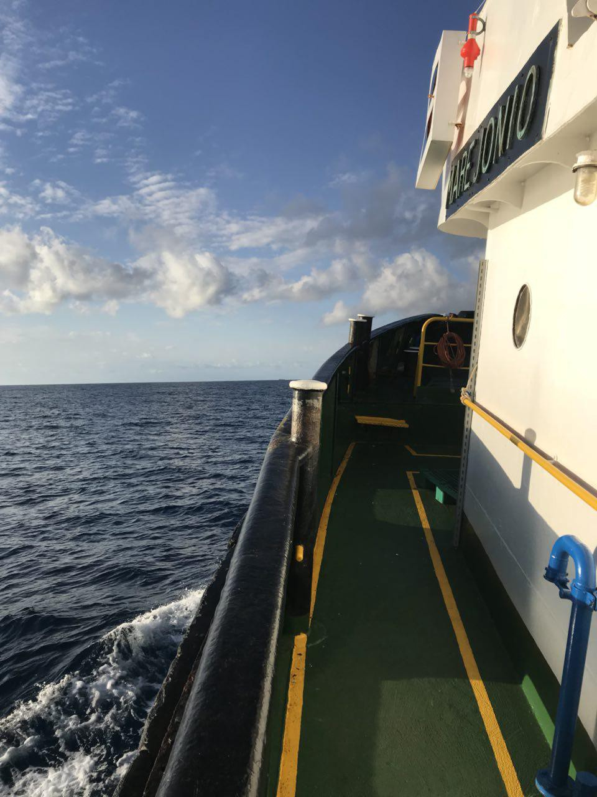

### AYS Daily Digest 04/10/18: Greek director of refugee camps is fired for advocating for refugees

_New rescue ship with Italian flag begins operations / Refugees in Greece denied transportation to their own asylum interviews / Suspects sought in murder of Syrian refugee / New arrivals in Greece / And more news…_

 : Arrived in [\#Marseille](https://www.facebook.com/hashtag/marseille?source=feed_text) on stopover\. We call on European governments to allow us to continue our rescue mission by assigning a flag to [\#Aquarius](https://www.facebook.com/hashtag/aquarius?source=feed_text) , determined to resume the sea as soon as possible\.” Photo credit: [SOS Méditerranée](https://www.facebook.com/sosmedfrance/photos/a.1656056084667376/2281942535412058/?type=3&theater)](assets/962c84fe5c2/1*3SfZkoPIc1K69DS-Q2ROIA.jpeg)

“Update on [\#Aquarius](https://www.facebook.com/hashtag/aquarius?source=feed_text) : Arrived in [\#Marseille](https://www.facebook.com/hashtag/marseille?source=feed_text) on stopover\. We call on European governments to allow us to continue our rescue mission by assigning a flag to [\#Aquarius](https://www.facebook.com/hashtag/aquarius?source=feed_text) , determined to resume the sea as soon as possible\.” Photo credit: [SOS Méditerranée](https://www.facebook.com/sosmedfrance/photos/a.1656056084667376/2281942535412058/?type=3&theater)
#### FEATURE: Andreas Iliopoulos fired

The Greek director of refugee camps within the country, Andreas Iliopoulos, was fired on Thursday last week after calling for an investigation into how EU funds were being spent in the camps\. Iliopoulos stated the obvious — EU funds are being hugely misappropriated\. Money is being stolen and misdirected, and the majority of it is not going to support refugees\. In the statement that led to his firing, Iliopoulous said that the situation in Greek camps right now is “chaos” and that there is very little oversight into how the funds destined for the camps are being managed\. Iliopoulos pointed out that there was widespread mismanagement of funds by Greek authorities, the defense ministry, and international NGOs\.

One of the many examples Iliopoulus gave of mismanaged funds was the over one million Euros spent in the Moria camp on Lesvos to set up a waste management system\. Even with this huge sum spent, there is still no system for collecting trash in the camp\. A close look at the refugee camps across Greece would yield many such stories from each location — huge amounts of money funnel in, but life remains as bad as ever for refugees\. Greece has received over 800 million Euros since 2015 \( [by a conservative estimate](https://www.newsdeeply.com/refugees/background/full-breakdown-of-what-money-went-where-in-greece-2015-2016) \) in outside funding to support refugees, most of this coming from the European Commission\.

Greek minister Dimitris Vitsas claimed that Iliopoulos was fired for “not sufficiently serving his duties” and making statements that were “untrue\.” On the contrary, based on all the available evidence, it seems that Mr\. Iliopoulos was fired for telling the truth and attempting to do his job\.
### SEA

For the first time since the beginning of the recent refugee crisis, a non\-military, Italian\-flagged rescue ship has left to operate in the central Mediterranean\. With this new ship, the volunteers and humanitarians behind the project are challenging Salvini’s policy of turning away rescue ships\. Since Salvini in his decree promised only to turn away rescue ships without Italian flags, it may in turn be harder for the extremist government to prevent the ship from disembarking\.

The deck of the Mare Jonio\. Photo credit: Sea\-Watch

This August, however, Salvini prevented 177 refugees from leaving an Italian Coast Guard ship\. Will the government try the same approach with this NGO ship? Whatever the official response, humanitarians and activists across Italy are sending a clear message that they will not back down to Salvini’s bullying with this new ship\.

From the Sea\-Watch rescue team:

> “Despite the three months ongoing arbitrary detention of our Sea\-Watch 3 in Malta and despite the politically motivated flag\-withdrawal of Aquarius: There is a new lifeboat en route to the search & rescue zone\! 

> The MARE JONIO, which was bought, crewed and prepared by our Italian friends at [\#Mediterranea](https://www.facebook.com/hashtag/mediterranea?source=feed_text) over the last months, flies the Italian flag — not only by necessity, but also as a sign, that the Italian and European civil society has not yet given up its values of humanism and solidarity\. Sea\-Watch is honored and happy to provide broad organizational, financial, and technical support, along with a rescue boat, to the project\.” 

### GREECE

Because of the rising numbers of people fleeing to the Greek islands, many hundreds of people have been transferred from the island detention camps to the Greek mainland, hundreds of miles away\. Many of these people, however, still have upcoming asylum interviews on the islands they first arrived on\. Missing these interviews usually results in a rejected asylum claim, yet the authorities are providing no means of transportation\. The UNHCR has so far [confirmed these reports](https://www.facebook.com/refucomm/posts/712863675732104) , but is failing to act\.

A video has been circulating on social media of a brutal fight in the Malaska refugee camp in eastern Attica\. A 31\-year\-old Syrian man was killed in the fight and eight of his companions were badly injured\. Greek police are still searching for suspects involved\. Although, based on past evidence, the police may be satisfied with the arrest any random group of refugees\.
#### New arrivals

219 people fleeing war arrived on the Greek islands today\. In all of the breakdowns that are currently available, **the majority of people in each of the boats were children\.** \(The figures that follow are from [Aegean Boat Report](https://www.facebook.com/AegeanBoatReport/posts/454586145064495?hc_location=ufi) \)

A boat landed on Lesvos this afternoon carrying 22 people \(10 children, seven women, and five men\) \.

One boat arrived on Chios early this morning, carrying 50 people \(20 children, 14 women, and 16 men\) \.

A second boat arrived on Chios carrying 35 people \(17 children, five women, and 13 men\) \.

A third boat landed in Kalo Limani, Lesvos around 07:00, carrying 20 people \(13 children, four women, and three men\) \.

A fourth boat was picked up outside Lesvos and arrived in the port of Mytilíni at 08:30\. HRT was on scene\. 38 people were aboard \(no breakdown available\. \)

A fifth boat arrived on Samos this morning, carrying 54 people \(no breakdown available\) \.
#### Medical needs on Samos \(from the [Med’EqualiTeam](https://www.facebook.com/MedEqualiTeam/?__tn__=%2CdkCH-R-R&eid=ARBJPE7ljUD5igiNxa_nuvXP7S0aLpN18BK_A4Tt3YkkUa9NUNqmBM_tj0s8Mp9yLWsNqf-fVqVpWIsC&hc_ref=ARR-3gOHAd_NccJ5zveCs70Fj9zH3CF7XfcCDLCCf_sr-VGglmudkr92opHkGuOmRqk&fref=nf) \)

> “A sore throat, blocked nose, feeling weak and coughing\. These are the complaints we have been hearing a lot the past week\. There is a fever going around in the camp\. The weather is getting colder, it has been raining and the mood is very sad and down\. Many people are still sleeping in summer tents\. Two nights ago the weather was so bad that a part of the camp was flooded\. 

> The amount of patients is growing and we are running out of medicines quicker than ever\. Weather problems are very hard to solve but we can treat the flu\. The problem is that we need money to buy medicines such as: vitamins, asthma spray, paracetamol, antibiotics, etc\. We do not have enough of these and they are very much needed\.” \( [Link to the funding page](https://www.gofundme.com/med-equaliteam) \) 

The Med’Equaliteam is one of only three volunteer groups on the island, along with Samos Volunteers and a school that recently started, Still I Rise\.

Samos Volunteers has a steep volunteer shortage right now, and is faced with cutting or shortening vital services and programs\. The group is especially looking for people who can make a longer commitment and for those with teaching experience\. Find out more [here](https://samosvolunteers.org) \.
#### Petition against refugee education on Chios

Over 1,500 people have signed onto a petition on Chios to protest the attempt to integrate refugees into local schools, which has been happening on a small scale in five school on the island\.

A video on staying safe in Greece, intended for refugee children, has been published by Refucomm\. You can access it [here](https://www.facebook.com/refucomm/videos/546761132427335/) and it is available in Arabic, Urdu, and Farsi\) \.
### NETHERLANDS

There will be a protest in Utrecht on Saturday at 15:00 to protest the deportation of Afghani refugees\. Find more details [here](https://www.facebook.com/events/315447395699251/) \.
### ITALY

The Italian president signed far\-right minister Matteo Salvini’s decree on migration, which will give Italian authorities more ability to turn away rescue ships and refugees from the country\.

There will be a demonstration in Pordenone on Saturday to show solidarity with refugees\. Find more information [here](https://www.facebook.com/retesolidalepn/posts/2185385341742280?__xts__[0]=68.ARAWEwHOohMEcMkgS4k9fvFw4P-FJhEa15aH2zhFqxxfs5-SeVzHSsjM0_eNxQJfXOWbtmS6HWYcxTPzFif9UkiUrLr76QH5kRjG6vju8u7qYkPqHnhU5PTI0awXAzEZwFfDrE3WcAmcDOzkkXJ6_KUpprOnbrEoAqrbk0Zk1qFpTZZhROs-2g&__tn__=-R) \.
### SWEDEN

For the first time, a politician from extremist right wing party Sweden Democrats will take the lead in a municipality council\. Following the election three weeks, there is still no government in sight, as the major political parties continue to block each other from forming coalition governments\.

**We strive to echo correct news from the ground through collaboration and fairness\.**

**Every effort has been made to credit organizations and individuals with regard to the supply of information, video, and photo material \(in cases where the source wanted to be accredited\) \. Please notify us regarding corrections\.**

**If there’s anything you want to share or comment, contact us through Facebook or write to: areyousyrious@gmail\.com**

_Converted [Medium Post](https://medium.com/are-you-syrious/ays-daily-digest-04-10-18-greek-director-of-refugee-camps-is-fired-for-advocating-for-refugees-962c84fe5c2) by [ZMediumToMarkdown](https://github.com/ZhgChgLi/ZMediumToMarkdown)._
