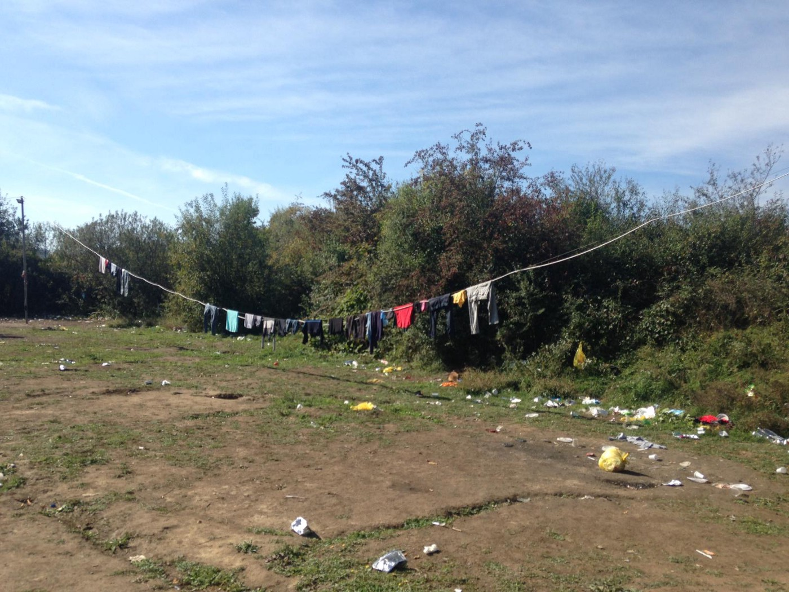
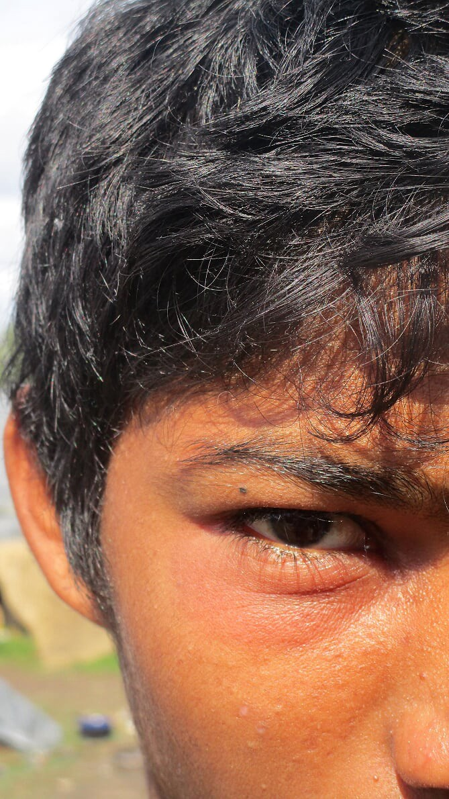
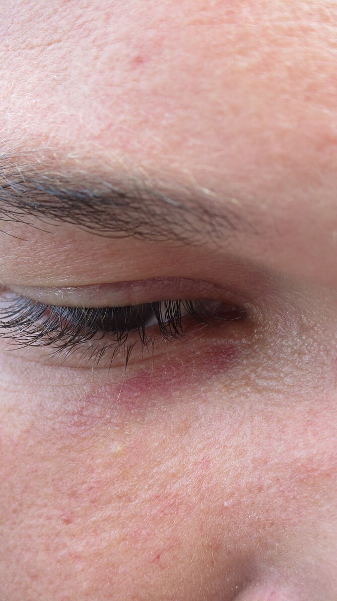
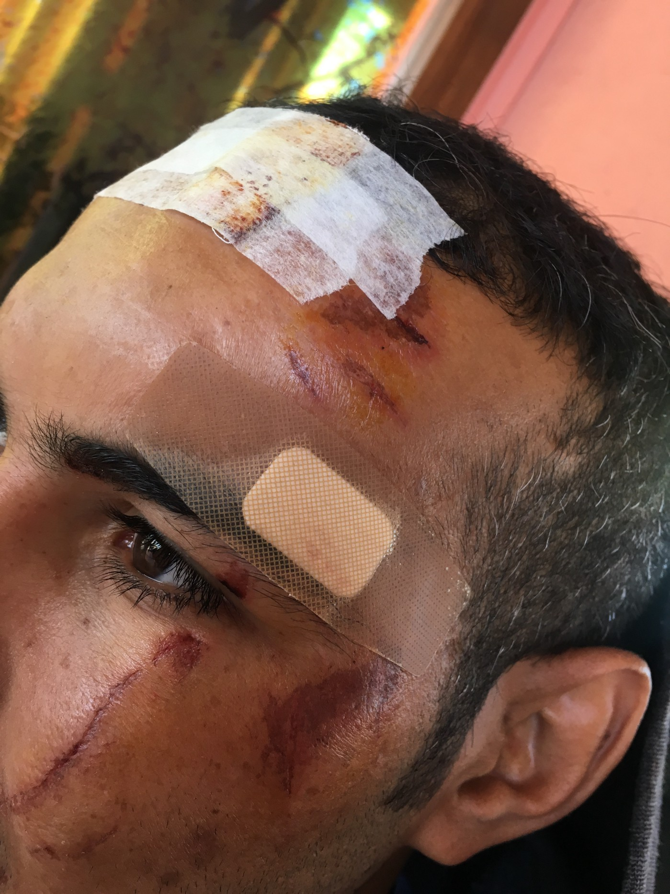
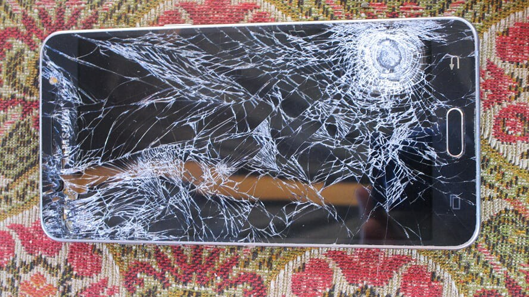

### **AYS SPECIAL: EU BORDER VIOLENCE \(Update from Bosnian\-Croatian border for September\)**

_The authors of this article, two solidarity workers in the Balkans, want to tell the relatively untold story of the violence being perpetrated against refugees on the fringes of Europe\. Their research shared here reveals the depth of abuse being carried out by member states at the behest of Brussels and suggests that we reconsider our perception of dangerous actors\. What is more dangerous? Refugees fleeing conflict, or a continentally militarised border?_

Camp in Velika Kladusa

As winter draws nearer, the human cost of so\-called “irregular migration” can be seen in western Bosnia\.

For those risking everything to find safe sanctuary in Europe, this corner of the Balkans has fast developed into a prime example of what refugees call ‘the game’\. This dark terminology refers to the illegal border crossings attempted daily into the EU\. Its players are made up of refugees from a variety of countries \(North Africa and the Middle East, to South Asia\) \. They gather at this border under a common cause: to find safety\.
#### **The Last Town**

To understand the ground offensive being waged on the people travelling the Balkan route you have to look at Velika Kladuša\. The town sits on the most north westerly point of the Bosnian border with Croatia, and by this feature marks the start of the eastern frontier of the EU\. Geographically, Velika Kladuša is the final departure point for those making the perilous foot crossing through Croatia and Slovenia towards Italy and Austria\.

The town has been a stop off point since February this year when refugees first began transiting the area in greater numbers\. But, where before this was the last resting point on the road to Europe, Velika Kladuša soon became a bottleneck for refugees who are continually being pushed back from EU territory, denied their rights to access asylum procedure and summarily beaten by border police\. It is not hard to see the fallout from this concerted policy of illegal pushbacks being implemented by Brussel’s militarised border agency, Frontex\.

Walking around the small Bosnian town, one can immediately notice the hallmarks of violent deportation\. Black eyes; sprained ankles; pepper spray burns; footlong bruises from baton strikes; cuts made with knives and wounds inflicted with the stamp of a boot\. You only have to look in the eyes of these people once to know that this is not the first time they have been brutalised by the Croatian police\.

Spending time on the ground, volunteers from [No Name Kitchen](https://www.facebook.com/NoNameKitchenBelgrade/) & [SOS Kladuša](https://www.facebook.com/SOSTeamKladusa/) \(with Balkan Info Van\) are witnessing the physical and psychological cost of the pushbacks, whereby migrants who are caught in the interior and frontier zones of Croatia and Slovenia are conveyed systematically back to rural border spots and beaten to within an inch of their lives\.

#### **Making the Case**

The volunteer groups present work together to record and monitor the border violence perpetrated by the European Union\. Up until now the archive of cases represents only a portion of the victims who feel able to share their trauma, but even so, they present a harrowing reality that \(for so long\) has been shielded from the public eye by the whitewashing agenda of the EU\.

Creating a counterpoint to this multilateral system of deportation is the primary aim of our monitoring presence\. Together with other grassroots organisations, lobbying groups and media platforms we have developed a standardised framework for recording and relaying the crimes being perpetrated against refugees by EU border officials\.

Our methodology places the highest value on confidentiality and a sensitive portrayal of each individuals case\. Sharing best practice from a number of different monitoring agencies has allowed us to build a comprehensive system of interviewing that can be applied in various field settings\. We believe that the victims should have the autonomy to share their experiences and our aim is to respect that narrative, giving respondents the opportunity to tell their part within this story of borders \(a simple objective so often neglected in the media coverage of contestation sites such as national frontiers\) \.

> As volunteers and activists, we do not wish to speak for victims\. Instead we aim to propel their voices and stories to the widest possible audience and build the case for an adherence to international law and safe sanctuary for all refugees\. 

#### **Outside the law: Trends in Extrajudicial Violence**

In September, our teams covered 25 different incidents, accounting for 212 victims, 205 were men and 7 were women\. Of these, 32 were minors\. Among the incidents listed in the report, it is possible to identify consistent patterns of structural violence\. Cross referenced with the body of cases collected during August it is easy to see the types of violence being employed, the methods of confinement and the strategies aimed to prevent access to asylum\.

As before, the pushbacks continue to occur in only a handful of semi\-rural border locations, away from habitation in order to minimise the risk of witnesses\. Looking at the times in which the most violent cases occur it is also clear that the Croatian police use the cover of night, delivering people to the border with Bosnia more frequently between the hours of 10pm and 6am\. In the dark, the officers waiting to brutalise the migrants can’t be seen, making it easier for the perpetrators to retain anonymity \(alternatively, during the day time it is common for them to use face masks\) \.

Extreme violence is a consistent aspect of the pushbacks\. It is the physical attacks and injuries sustained that separate these deportations out as particularly important\. Not only are people denied safe sanctuary, but the Croatian police are actively engaged in the production of a racialised border\. Everyday a line is drawn in the sand around Velika Kladuša\. It is a line implicitly sanctioned by the European Union, via its presence through Frontex officials\.

As one migrant told us after his assault in late August, three Croatian police officers immobilised him and a fourth made over ten lacerations to his calf\. The perpetrators spoke in Croatian, but one threat spoken in English stood out to the victim\.

> **_“This is so you don’t come back”_** 

The level of violence of violence in this border area is clearly being used as a deterrent\. The overriding aim is to separate the white West from those outside it\. In this sense, Velika Kladuša has become a battleground for political geography, as the institutions of Europe channel their funds into clandestine tactics to sure up their external borders\.

Along with the direct physical beatings, the cases from September identify a consistent use of inhumane confinement which can be classified as torture\. Migrants are kept both in cells during their initial detention, but also driven to the borders in ‘combis’, which are effectively mobile isolation rooms with no windows, light or ventilation\.

These vehicles used by the Croatian police are fitted with a lone fan system that can pump hot air into the darkened passenger area\. In almost every case the victims describe the nausea and vomiting brought on by motion sickness\. In one incident, a group who had been suffering in the back of the vehicle for over an hour asked the driver to stop\. Some minutes later, the officer pulled over and emptied a can of pepper spray into the back, burning the skin of two men seated by the door\.

> **_“Combi is like hell”_** 

Unfortunately, the cases bear out too many similarities to list here\. Our team has recorded the way Croatian officers make games out of the beatings \(such as asking people to pick their possessions of the floor and beating them as they kneel\) \. We also note the consistent doctoring of information in regards to minors, where the Croatian and Slovenian police avoid any obligations towards the safety of minors by listing them as adults\.

Alongside this, cases often involve the perpetual theft of money, the breaking of phones \(and thus GPS connections\) and the removal of personal belongings\. While some isolated incidents occur without either theft or beating, it can be summarised that all pushbacks bear the hallmarks of structural violence simply by the basic denial of access to asylum process\.

#### **A** **Parallel System**

We often here ‘the parallel system’ referred to by state media in countries such as Serbia\. The term is an institutional criticism aimed against migrants for their practices of informal settlement and illegal border crossing\. However, it seems that in the current incarnation of the Balkan Route, another ‘parallel system’ is emerging, and it is a system lead by EU states themselves\.

All of the illegal practices listed in the section above make up the parameters of this alternative mode of border control, and it can be identified as a “Parallel System” because it operates next too, but completely outside of national and international law\.

For instance, one might be fooled into thinking that once into Croatia or Slovenia \(EU territory\), a refugee has access to an internationally recognised asylum process\. But the contours of this route are not characterised by due and proper process\. In fact, under the parallel system, member states in south eastern Europe are using informal processes of extra\-judicial violence and deportation to create a buffer zone\. Just as Bulgaria and Hungary were first employed as Europe’s bodyguards, now Croatia and Slovenia have signed the waver in order to utterly undermine the legal principles of the institution they subscribe to\.

This means that alongside the prescribed bodies of the state, a set of extra\-judicial powers and practices are being developed to deny people’s right to asylum\. Some of the most obvious cases of this can be seen in the covert bilateral agreement between Slovenia and Croatia where officers from the former country simply hand over captured migrants \(often on the very road border where “legal” migrants are moving between the two countries\) \. The act, in complete contravention of the Dublin Agreement, is a well\-established means of expelling refugees back to Bosnia, and signifies a high level of organisation between respective border officials\.

Connecting up the border crossing on the Slovenian and Croatian frontier with the hidden sites on the border with Bosnia, one can begin to see a highly developed system of capture, detention, transport and violent expulsion\. Within this parallel sphere of law and order, the Croatian police have also developed multiple tactics to obfuscate and circumvent their obligations towards processing asylum claims\. The quotes below illustrate just some of the responses described by people as they try to articulate their asylum request\.

**_“No asylum, you have stay in Bosnia, you go back to Bosnia\.”_**

**_“You can \(apply for asylum\) in Zagreb, but we’re not in Zagreb\.”_**

**_“No, you go back\.”_**

These are a set of informal protocols that inform the soft barriers to accessing asylum\. Coupled with the militarised response of the Croatian and Slovenian states, equipped with drones, helicopters, dogs, electric batons and guns, one can see how the parallel system effectively makes use of formal resources and informal directives to all but close its external border to anything other than ‘white migration’\.
#### **The Institutional Response**

In September, diverse agents from the state and public sectors recognised the flagrant human right violations by the EU borders and began to react\. In August, we shared our violence reports with various human rights organisations and the state authorities, including the Croatian Ombudswoman for Human Rights, who later in September [started investigation](http://ombudsman.hr/hr/npm-novosti/cln/1393-ispitivanje-prituzbi-na-policijsko-postupanje-prema-migrantima) of these allegations in relevant Croatian police stations\.

Further to this we invited a journalist from the Guardian, the British media platform reaching nine million readers, who subsequently published [an article capturing the violent stories](https://www.theguardian.com/world/2018/aug/15/refugees-crossing-from-bosnia-beaten-and-robbed-by-croatian-police) of people who live in the camp in Velika Kladuša\. [UNHCR also acknowledged](http://www.unhcr.org/desperatejourneys/) the border violence in their last report, stating that they have reported 700 cases of physical attacks and thefts by the Croatian police between January and August 2018\. Although such public recognition and attention to border violence in this area developed some pressure on the Croatian border authorities, resulting in decrease of border violence for a small period, it has not changed the systematic violation of human rights within the EU borderlands\.

Our and others’ reports of human rights violation on the EU borders have also resulted in both an international and local governmental response during September\. Twenty\-two Members of the European Parliament have submitted [a request demanding](http://www.infomigrants.net/en/post/11895/eu-parliament-members-demand-interrogation-of-croatia-s-treatment-of-migrants) interrogation of Croatian’s violent treatment of displaced persons, asking the European Commission to monitor and address the dramatic conditions of people stranded by the Bosnian\-Croatian border to ensure the respect to their fundamental rights\.

This request has not brought any changes so far, but it demonstrates that the violent push\-backs of people have been recognised by the few in Brussels who wish to act\. However, the overall debate in Brussels about the EU external borders remains expressly anti\-migration oriented, ignoring the violence by the border officials, and striving for a more militarised Fortress Europe\. Dimitris Avramopoulos, the European commissioner for migration and home affairs, spoke out in Brussels 13th September, demanding stronger borders and proposing to feed up the EU border Agencies budget up to €11\.3 billion by the year 2027\.

While billions of euros aimed to be spent on confinement of displaced people through the surveillance techniques, border patrolling, and violent push\-backs, their protection and rights through development of policy mechanisms addressing their smoother and safer transit to the EU have been neglected\.

The Croatian Ministry of Interior remained focused on denying all allegations of violence against the displaced people, and their standpoint has been supported by fundamental politicians\. German Chancellor, Angela Merkel, [emphasised](http://www.balkaninsight.com/en/article/croatian-pm-talks-with-german-chancellor-about-future-of-croatia-western-balkan-08-28-2018) that the Croatian’s borders and police procedures are a sing of great progress\.

The Croatian President Kolinda Grabar\-Kitarović, who visited border police stations and border zones in Cetingrad, Bihać, and Maljevac, praised the border authorities for an “excellent and professional job of border protection” that she considered “ [fully in line with the EU legislation standards](https://www.jutarnji.hr/vijesti/hrvatska/predsjednica-u-ponocnom-obilasku-zelene-granice-s-bih-obisla-teren-zbog-prituzbi-gradana-koji-strahuju-za-sigurnost-zbog-ilegalnih-migracija/7797219/) ”\.

While the state authorities visit and communicate on the ground with border patrols to access the border situation, no state representatives have come to the camp in Velika Kladuša or Bihać to talk with those subjected to the border restrictions — displaced persons, to see the real impact of push\-backs on peoples’ lives\. Consequently, mistreatments of displaced people in the Bosnian\-Croatian border zones persist and are fully supported by the Croatian authorities \(including the President\) and other EU authorities who ignore them and refuse to act\.

Every night, more people are being attacked, humiliated, and pushed back to Bosnia and we strive for the recognition of such systematic violence by the authorities and call for their action to protect persons in need of safety in Europe\. This call is particularly urgent before the winter, when the temperatures will a set to reach –20 in Bosnia, and those playing the “games” will be now even more exposed to the risk of death on their clandestine journeys\.

To this we repeat, “irregular migration” is a fantasy of a closed Europe, and not the fault of refugees who simply seek safety from danger in their home countries\. We argue for the introduction of truly open borders and question: is it migrants we should be scared of? Or is it the weaponized EU border system that poses the biggest danger?

**_\(Written by Simon Campbell \(Balkan Info Van\) and Karolina Augustova \(No Name Kitchen\) \)_**

**We strive to echo correct news from the ground through collaboration and fairness\.**

**Every effort has been made to credit organizations and individuals with regard to the supply of information, video, and photo material \(in cases where the source wanted to be accredited\) \. Please notify us regarding corrections\.**

**If there’s anything you want to share or comment, contact us through Facebook or write to: areyousyrious@gmail\.com**

_Converted [Medium Post](https://medium.com/are-you-syrious/ays-special-eu-border-violence-update-from-bosnian-croatian-border-fro-september-3f2a6227d383) by [ZMediumToMarkdown](https://github.com/ZhgChgLi/ZMediumToMarkdown)._
