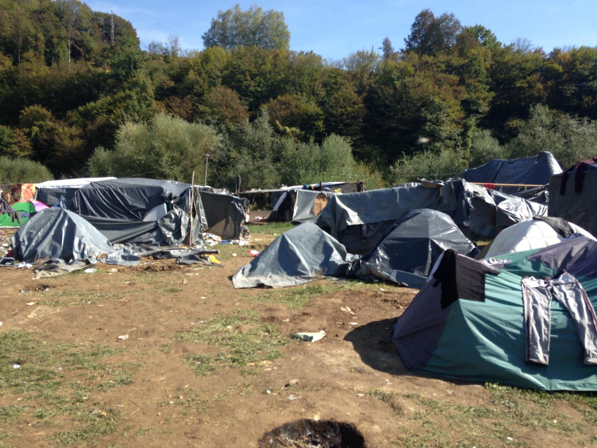
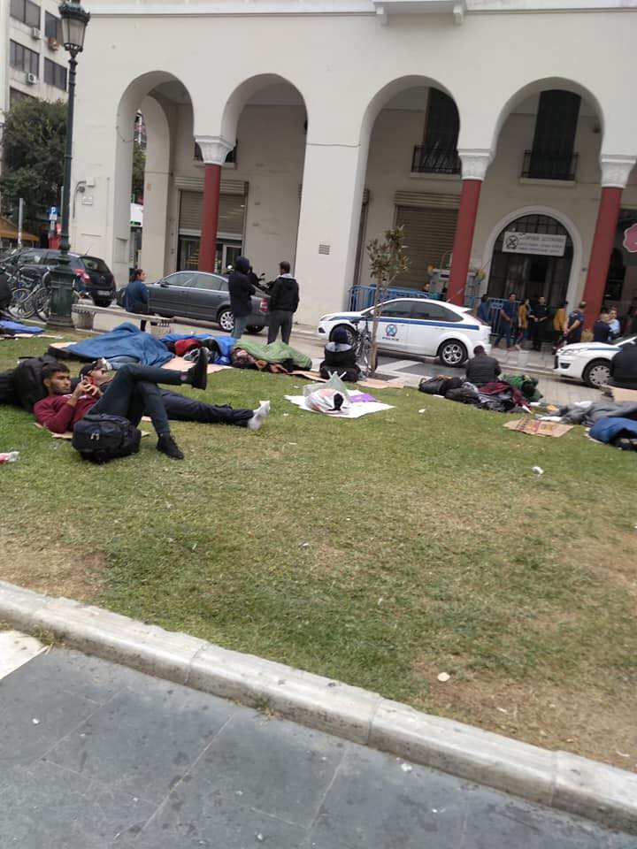

### AYS DAILY DIGEST 05/10/2018: Croatian police deny any wrongdoing or illegal pushbacks…

_Arrivals in Greece // Possible sea pusbhack in Greece // More rescued off of Spain // People in Germany, France, and Greece find no respite form violence// more…_

Velika Kladusa: A camp of dramatizers? According to the police, yes\.
### **FEATURE: Croatia being held to account? Not yet…**

The leading human rights watchdog group Council of Europe issued a strong criticism against the Croatian Government for the facilitation of illegal pushbacks to [Bosnia and Herzegovina as well as to Serbia](http://hr.n1info.com/a337244/English/NEWS/CoE-calls-on-Croatia-to-end-police-violence-against-migrants.html) \.

_I am worried by reports that I have received from expert refugee and migrant organisations that provide consistent and substantiated information about a large number of collective expulsions from Croatia to Serbia and to Bosnia and Herzegovina of irregular migrants, including potential asylum seekers\. Particularly worrisome are allegations of systematic violence used by Croatian law enforcement officials against those persons, including pregnant women and children\. According to UNHCR, Croatia has allegedly collectively expelled 2,500 migrants since the beginning of 2018\. Among them, 1,500 reported having been denied access to asylum procedures, while 700 of those persons reported violence and theft by law enforcement officers during summary expulsions,” Council of Europe Commissioner for Human Rights, Dunja Mijatovic, said in a letter sent to Prime Minister Andrej Plenkovic\._

Organizations and volunteers have been reporting on the systematic violent pushbacks from Croatia to, first, Serbia, and now to both Serbia and Bosnia and Herzegovina for approximately two years now\. With the backing of larger organizations and international entities, it is hoped that this will put pressure on the government\. However, in a statement, the head of the Croatian police, Davor Bozinovic stated that the police had already filed a response on October 3rd 2018, explaining that the police have been and continue to be working within the confines of the law and the expectations of a prospective Schengen member\. If Croatia wishes to join the Schengen Zone, certain measures, it is said, must be taken to “secure the border”\.

It was also stated that “all applications from non\-governmental organizations and other organizations on the alleged use of the means of coercion of police officers against migrants have been verified within the scope, as there are generally insufficient concrete data necessary for criminal investigation\.”

Considering the extent to which the police have focused their investigative intentions on shutting down and demonizing organizations, this statement rings more than a bit hollow\. [They go on to very boldly deny that there are any confirmed cases of violence](https://www.tportal.hr/vijesti/clanak/mup-odbacuje-optuzbe-vijeca-europe-dobili-ste-nas-odgovor-prije-dva-dana-foto-20181005) or theft used against people on the part of police\. Having seen the bruises and smashed phones, what do you think?

However, it is important to contextualize pushbacks and border violence within the broader system\. The Dublin Agreement, to which the EU is held, tacitly incentivizes this use of violence, as countries farther from the borders enjoy both the “protection of” as well as the moral judgement over countries that people reach first\. This is not to provide an excuse for violent actions — indeed a better and more productive protest against the Dublin Agreement would be to take one’s criticisms to those enjoying the benefits of it, rather than taking out grudges on the powerless\. Indeed, this is the heart of the matter and what betrays the “but Germany made us do it” finger pointing as shallow excuses\.
### SEA

Please read the following letter and consider signing the petition\!

_“The Aquarius, chartered by the association SOS MEDITERRANEE, provides assistance to people in distress in the Mediterranean Sea and has rescued nearly 30,000 people since the beginning of its operations in February 2016\. Until this week, it was the only rescue ship which was still operational in the Mediterranean Sea\._

_Without a flag, the Aquarius will be forced to remain at the dock, while at the same time, in the absence of any civilian rescue ship in the central Mediterranean, the death toll continues to grow, in deafening silence\._

_Against this unacceptable situation, SOS MEDITERRANEE calls for a large\-scale citizen mobilisation through a petition to encourage all States in Europe to utilise any and all measures at their disposal, to allow the Aquarius to resume its life\-saving mission by issuing a new flag without undue delay\._

_Could you consider supporting SOS MEDITERRANEE by spreading the petition to your community?_

_The petition is available in 8 languages and the objective is to reach 1 million signatures\.”_

Find the petition [here](https://you.wemove.eu/campaigns/save-the-aquarius-and-rescue-at-sea) \.

Salvamento Maritimo reports the rescue of a total of 67 people between two operations\. One group of 11, and one of 56\.
### GREECE

Coming up\!
On Saturday the 6th, there is an open discussion: “How to resist the Europe of anti\-Migration?”

_Refugees Accommodation and Solidarity Space [\#CityPlaza](https://www.facebook.com/hashtag/cityplaza) , organises an open discussion with two academics, Shahram Khosravi\* and Barak Kalir\*, on the question of migration and how to resist the Europe of anti\-migration_

Click for more information\.

Aegean Boat Report notes that 45 people arrived in Samos; while around 46 people were rescued from a Turkish island by the Turkish Coast Guard\. Additionally, ABR observed another possible pushback from Greek waters\. The Turkish Coast Guard intercepted a boat, but over the radio chatter, the Greek Coast Guard was heard ordering them to leave Greek waters\. Four minors jumped from the boat that was intercepted and swam further into Greek waters, where they were picked up by the Greek Coast Guard\. Read more, [here](https://www.facebook.com/AegeanBoatReport/posts/455230641666712) \.

In the aftermath of the fight that [broke out in Diavata on the mainland](http://www.ekathimerini.com/233320/article/ekathimerini/news/iraqi-migrant-32-injured-in-diavata-brawl) , a man sustained serious injuries from a sharp object\. Last week, another man was killed in a fight near Athens\. The lack of political will to honestly engage and assist populations in centres to live without threat of violence is costing more lives\.

People waiting in Thessaloniki // Photo credit: Georgios Tsitiridis
### BULGARIA

Bordermonitoring\.eu reports that a man has [died of exhaustion](http://bulgaria.bordermonitoring.eu/2018/10/04/man-from-pakistan-died-of-exhaustion-in-bulgarias-border-area/) near the Greek\-Bulgarian border\. The man was from Pakistan, and reportedly had been taken to the hospital for recovery, but it was too late, and he passed away\.
### SPAIN

Spain and Morocco have entered into talks to discuss the repatriation of around 7,000 minors who had arrived to Spain from Morocco\. [According to media,](https://www.thelocal.es/20181005/spain-and-morocco-in-talks-to-repatriate-migrant-minors) “The roughly 10,000 minor migrants in Spain are under the protection of the regions or cities where they arrive, mainly the southern region of Andalusia and the overseas territories of Ceuta and Melilla in northern Africa\.”
### FRANCE

Ten activists from the Identitarian movement attacked the SOS Mediterranee offices in Marseilles, France today\. Fortunately, no one was injured\. Police have made arrests\.

Faces Before Numbers posted an obituary for Semere, a man from Eritrea, who recently was stabbed to death as a result of an altercation on the street\.

Photo Credit: Faces before Numbers

_“ Semere came to Europe to find peace & safety\._ 
_He survived the dictatorship of Eritrea, the Sahara crossing, the mafia in Libya and the Mediterranean Sea\._

_Yet he didn’t survive the supposedly human rights continent that is fortress Europe\._

_Belgium has been a privileged destination for people wanting to make it the UK for a while now\._ 
_It is deadly & it is violent as all parking lots are at the hand of merciless smugglers & people are desperate\.”_

Read the full post on their page\.

[Faces Before Numbers](https://www.facebook.com/FacesBeforeNumbers/?__tn__=%2CdkCH-R-R&eid=ARBUb-PCZjYXOMkcqMGlRr-9ZXtFpp6TKjAIQ8e51v_TidpKhNYoAoC9wd0553ilWUCO0U-PyqpbThvE&hc_ref=ARSWhzp_PvCDk2xkGosw1WYMGq_b9_VNVuEJWACzoX_IHD56AaoHWUxV4A_OgZvp1Ks&fref=nf&hc_location=group)
### GERMANY

A 26\-year\-old Syrian man died in a fire in [a Kleve, a German prison](https://rp-online.de/nrw/panorama/jva-kleve-syrer-nach-brand-gestorben-ermittlungen-gegen-polizisten_aid-33426703) \. In a horrible twist, the man was wrongfully imprisoned for theft as he was confused with a different man sought by police\. Evidence suggests that he committed suicide, but it is not yet confirmed\.
### DENMARK

Denmark and Austria are collaborating on an asylum plan that would, unsurprisingly, funnel more money into strengthening border security and deportation infrastructure, as well as education and asylum infrastructure\. It includes a proposal for a deportation centre located outside of the EU, although the location and timeline of the [centre’s construction remains secret](https://www.thelocal.at/20181005/denmark-and-austria-present-joint-plan-on-asylum) \.

**We strive to echo correct news from the ground through collaboration and fairness\.**

**Every effort has been made to credit organizations and individuals with regard to the supply of information, video, and photo material \(in cases where the source wanted to be accredited\) \. Please notify us regarding corrections\.**

**If there’s anything you want to share or comment, contact us through Facebook or write to: areyousyrious@gmail\.com**

_Converted [Medium Post](https://medium.com/are-you-syrious/ays-daily-digest-05-10-2018-croatian-police-deny-any-wrongdoing-or-illegal-pushbacks-c887ec2c3a2f) by [ZMediumToMarkdown](https://github.com/ZhgChgLi/ZMediumToMarkdown)._
