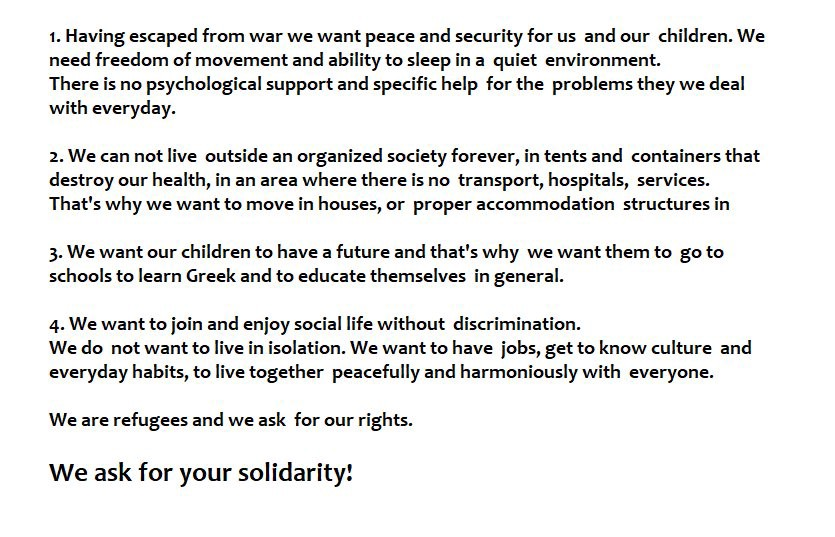

### AYS DAILY DIGEST 08/10/18: Greek Prosecutor opens investigation into misuse of EU funds meant for refugees

_Aquarius needs your help // Arrivals on Greek islands up this week // Now between 1,500 and 1,700 people in Grande\-Synthe Region // Deportations from Austria to Afghanistan…_

 \.](assets/c67e60aaf87f/1*TGL6OTykYoHw9arXG3C6OQ.jpeg)

Born a refugee\. Credit: Gabriel Tizon\. See more of his arresting images [here](https://www.facebook.com/gabrieltizonfotografo/photos/pcb.1923619324350547/1923618357683977/?type=3&theater) \.
### Feature

On Monday, the Greek Supreme Court prosecutor ordered an investigation into allegations of widespread misuse of EU funds earmarked for refugees stuck on the islands — vindicating Fileleftheros, the newspaper who first reported the allegations of misuse, lending credence to a story that Greek Minister of Defense Panos Kammenos initially dismissed as defamation, and surprising exactly no one who has set foot inside a refugee camp in Greece\.

The [announcement](http://www.ekathimerini.com/233394/article/ekathimerini/news/prosecutor-to-probe-alleged-mismanagement-of-eu-funds) of the investigation, which will be led by Marianna Psaroudaki of the financial prosecutors’ union, marks the latest development in a whirlwind story that has already seen three Fileleftheros editors briefly imprisoned, the director of the island hotspots [fired](ays-daily-digest-04-10-18-greek-director-of-refugee-camps-is-fired-for-advocating-for-refugees-ea63c9d5018) , and an EU\-wide fraud probe [opened](https://www.politico.eu/article/eu-watchdog-probes-possible-misuse-of-refugee-funds-in-greece/) \. When these twin investigations inevitably conclude, they will undoubtedly reach the same conclusions that refugees and solidarity workers based in Greece have known on a visceral level all along: there is just no way that the utter neglect on display in Moria, Vial, and elsewhere — children sleeping outside in sub\-zero weather, repeated sanitation crises, m [ass\-prescribed](https://www.buzzfeednews.com/article/marcusengert/refugees-are-not-getting-the-mental-health-help-they-need) tranquilizers, a 30% attempted suicide [rate](https://reliefweb.int/sites/reliefweb.int/files/resources/unprotectedunsupporteduncertain24092018finalen.pdf) — carry with it a price\-tag of [803 million dollars](https://www.newsdeeply.com/refugees/background/full-breakdown-of-what-money-went-where-in-greece-2015-2016) \.

And that’s a conservative guess\. Greece’s opposition leader puts the estimate at over twice that\. “What is happening in Moria is a disgrace for our country,” he [said](https://www.theguardian.com/world/2018/sep/26/lesbos-refugee-camp-at-centre-of-greek-misuse-of-eu-funds-row) last week in a statement\. “Greece has received €1\.6bn in funding and the government has created the worst refugee and migrant camp in the world\.”

“The money existed to transform the camp into a centre that could have resembled the Hilton,” said Fileleftheros editor\-in\-chief Panayiotis Lampsias\. “Instead it is Moria that is the source of national shame\.”
### Sea

The Aquarius still needs your help\. Sign the petition above and demand that the rescue boat be allowed to continue its mission in the Central Mediterranean\.
### Greece

Latest [updates](https://www.facebook.com/AegeanBoatReport/posts/456584711531305) from Aegean Boat Report: One boat with 47 passengers arrived on Samos, while another with 36 aboard was picked up by Bulgarian Frontex and transferred to the port of Mytilini on Lesvos\. No breakdown on the number of men, women, and children aboard either boat is currently available\.

Aegean Boat report also made public statistics on arrivals on the Greek islands during the first week of October\. It appears that arrivals on the islands have seen a considerable uptick: arrivals on Lesvos were up 242\.6 percent this week\. From the chart, we can also see that even as transfers continue, numbering over 1,000 this week alone, there are still over **18,000 refugees trapped on the islands as winter approaches\.**

On Monday, people from Malakasa camp, neat Athens, [went on protest](https://twitter.com/Refugees_Gr/status/1049386271171366912?s=19) at the Ministry of Immigration claiming their right to live in the cities\. Refugees emphasize that the death of a refugee from Syria in Malakasa, after a conflict showed that living conditions are inhuman and their lives may be in danger\.

### France

**Ground Update from the Refugee Women’s Centre:**

The Refugee Women’s Centre is now estimating that there are between 1,500–1,700 people in the Grande\-Synthe area, up from 1,300, at last count\. Most are families coming from Iraqi Kurdistan\.

The Refugee Info Bus is asking for donations to help with the purchase of a new generator\. Without their generator, which recently broke down, they have no way to provide power to the many refugees in the Calais region who may have no other way of charging their phones and connecting with their loved ones\. If you can, please donate [here](https://www.facebook.com/RefugeeInfoBus/posts/2258316904403725) \.
### Belgium

Refugee Party is searching for volunteers to help organize their upcoming event\. Please PM them or post on their Facebook page if you can lend a hand\.

### Austria

A deportation flight from Vienna to Kabul happened sometime Monday afternoon, and there are more deportations to Afghanistan planned for October 9th and 10th, Refugee Protest Camp Vienna [reports](https://www.facebook.com/RefugeeCampVienna/posts/2043264255726157) \.

Police are reportedly on the lookout for people whose names are on the schedule deportation list\.

**If you are an asylum seeker from Afghanistan who has received a second rejection, be extremely careful in the next few days\.** T

he group advises only going outside if it is absolutely necessary, and finding another place to stay besides your official residence, where police will almost certainly come looking for you\.

**We strive to echo correct news from the ground through collaboration and fairness\.**

**Every effort has been made to credit organizations and individuals with regard to the supply of information, video, and photo material \(in cases where the source wanted to be accredited\) \. Please notify us regarding corrections\.**

**If there’s anything you want to share or comment, contact us through Facebook or write to: areyousyrious@gmail\.com**

_Converted [Medium Post](https://medium.com/are-you-syrious/ays-daily-digest-08-10-18-greek-prosecutor-opens-investigation-into-misuse-of-eu-funds-meant-for-c67e60aaf87f) by [ZMediumToMarkdown](https://github.com/ZhgChgLi/ZMediumToMarkdown)._
