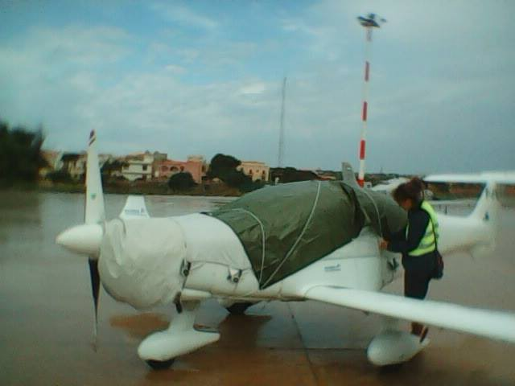
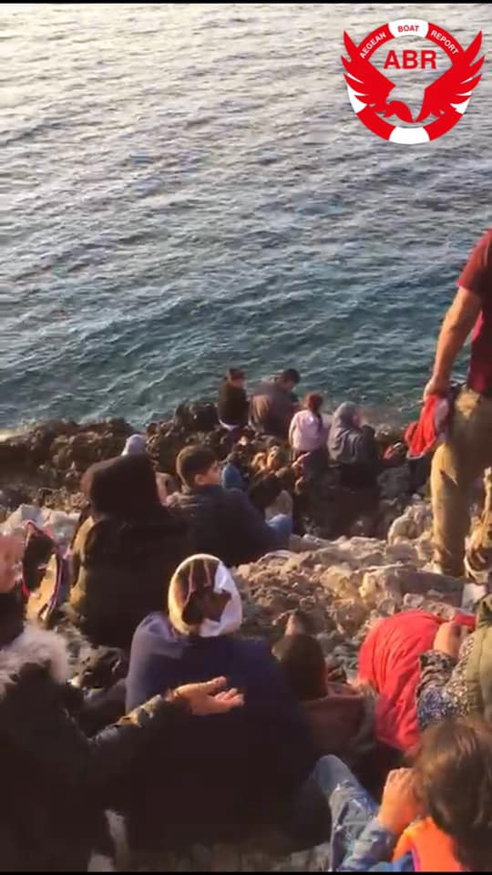
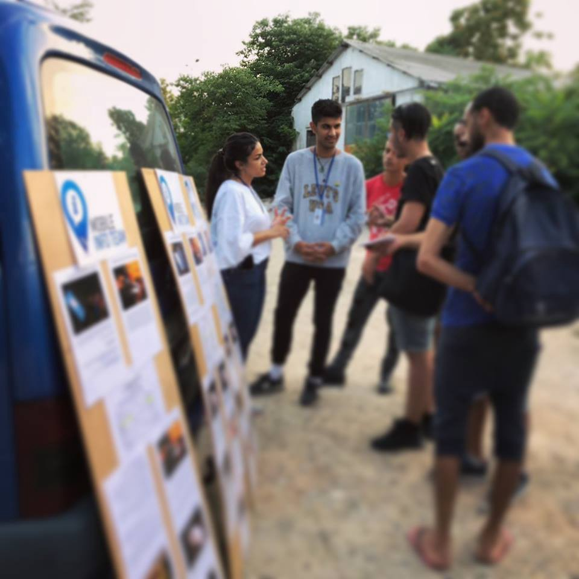
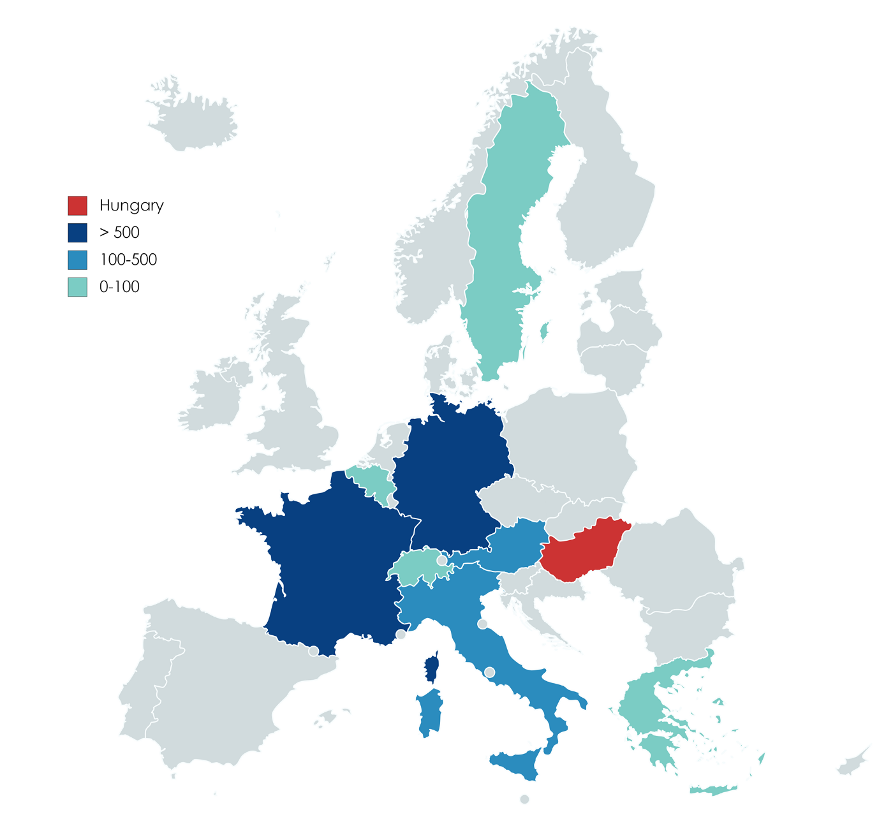

### AYS DAILY DIGEST 11/10/2018: Sea\-Watch aircraft Moonbird resumes operations

_Colibri plane needs donations / Living conditions on Aegean islands remain dire /Legal volunteers needed / Moroccan navy shoots 16\-year\-old boy / And more news…_

Photo Credit: Felix Weiss // sea\-watch\.org
### FEATURE

**Sea Watch’s reconaissance aicraft Moonbird took off from a new operating base on Thursday** to give evidence of Europe’s deadly border policy and to call for rescue where needed\. The aircraft had been prevented from continuing search\-and\-rescue operations by the Maltese government for three months\. **The death rate in the central Mediterranean Sea has never been as high,** as the number of active rescue boats has plummeted\.

### Colibri plane needs donations for repairs

**Pilotes Volontaires is looking for [donations](https://www.pilotes-volontaires.org/fr/donations/formulaire-de-don-1/)** to repair the broken windshield of its Colibri plane\. The cost is estimated at €10,000\. The plane is also active in the search and rescue zone in the central Mediterranean to look for boats in distress\.
### GREECE
#### Living conditions on Aegean islands remain dire

Photo Aegean Boat Report

[**Aegean Boat Report**](https://www.facebook.com/AegeanBoatReport/) **says three boats arrived early on Thursday morning on Samos** , with 33, 28, and 64 people each\.

Refugee Support Aegean has written a [report](http://rsaegean.org/the-hotspots-experiment/) on the hotspots on Greek islands:

> Everything shows that a new model of violent psychological deterrence has been established in Europe for those crossing borders irregularly and arrive in Greece\. This model is based on the practice of geographical limitation and degrading first reception conditions\. 

It describes the condition on each individual hotspot on Chios, Kos, Leros, Lesvos, and Samos:
- **For Chios, it notes the camp’s overcrowding, serious problems with water supply and unsanitary living conditions** \. The report particularly focuses on the failure to provide adequate accomodation for pregnant women or women who have just given birth\.
- **For Lesbos, the report describes inhuman living conditions:** thousands remain in summer tents due to overcrowding, insecurity and violence remain an issue, and there is still a lack of running water and sanitary living conditions\.

 \.](assets/5017bc3aa9f2/0*keZTtHAW31HOUm1Z)

“Happiness for me is to get out of Moria’s camp, and to call my mother and tell her I’m fine” — Ameen, 16, a Syrian refugee, trapped for a year on Lesvos\. Photo by V [alerio Cataldi](http://twitter.com/valerio_cataldi) \.
#### Legal volunteer needed

Photo by Mobile Info Team
- **The Legal Centre Lesbos is looking for lawyers, legally trained professionals and law graduates** willing to assist its legal team in defending the rights of asylum seekers and refugees\. The volunteer post is for a minimum of three months\. More information can be found on their [website](http://www.legalcentrelesbos.org/volunteers/) \.
- The Mobile Info Team is looking for a new volunteer who graduated or studies for a degree in law, international relations, or political science, starting from mid\-November\. Volunteers need to commit for a minimum of thrre months\. You can find more information on their [website](http://www.mobileinfoteam.org) \.

#### Pushbacks to Turkey

[Neo Kosmos](https://neoskosmos.com/en/122470/over-12000-migrants-crossed-into-greece-in-2018-through-evros-border-alone/) reports Migration Minister Dimitris Vitsas presented data in Parliament last week, showing that **the number of migrants entering Greece through the Evros border from Turkey has sky\-rocketed** \. According to the report, 3,300 migrants came to Greece through the Evros border region in 2016, while in 2017 that number climbed to 5,500\.

A Syrian refugee was arrested barely 30km outside Thesaloniki \(400km inside Greek territory\), and even though he asked for asylum three times the Greek police transported him across the border and handed him along with many others over to the Turkish police\.
### HUNGARY
#### Drop in the number of incoming Dublin transfer requests for Hungary

The [European Council on Refugees and Exiles \(ECRE\)](https://www.facebook.com/TheECRE/?tn-str=k%2AF&hc_location=group_dialog) says **Hungary is one of few European countries that noted a drop in the number of incoming Dublin transfer requests** \. It received 1,848 requests, mainly from France and Germany — a significant number despite the fact that various governments have suspended transfers on account of human rights violations in the country\.
### MOROCCO
#### Navy shoots 16\-year\-old boy

**The Moroccan navy has shot a 16\-year\-old boy aboard a migrant boat** on Wednesday morning between Larache and Asilah off Morocco’s northern Atlantic coast\. He was brought to the hospital\. The other 57 people were transferred to the police\.

It is the second time the navy has shot someone aboard a boat \. On September 25, the Moroccan navy killed a 20\-year\-old woman, Hayat Belkacem, who was trying to cross the Mediterranean\.

**This morning, the [Watch the Med Alarm Phone](https://www.facebook.com/watchthemed.alarmphone/) said that eleven lives are in danger, as Spanish and Moroccan authorities refuse to cooperate\.** The people are on a boat heading from Tangier to Spain and the Alarm Phone asked the Spanish Coast Guard to deploy a helicopter and conduct a search and rescue operation\. The Spanish Coast Guard said that they cannot search in Moroccan territorial waters until Morocco asks them to, while Moroccan authorities said that Spain should ask for permission to enter Moroccan territorial waters and Morocco would grant the permission\.

**We strive to echo correct news from the ground through collaboration and fairness\.**

**Every effort has been made to credit organizations and individuals with regard to the supply of information, video, and photo material \(in cases where the source wanted to be accredited\) \. Please notify us regarding corrections\.**

**If there’s anything you want to share or comment, contact us through Facebook or write to: areyousyrious@gmail\.com**

_Converted [Medium Post](https://medium.com/are-you-syrious/ays-daily-digest-11-10-2018-sea-watch-aircraft-moonbird-resumes-operations-5017bc3aa9f2) by [ZMediumToMarkdown](https://github.com/ZhgChgLi/ZMediumToMarkdown)._
