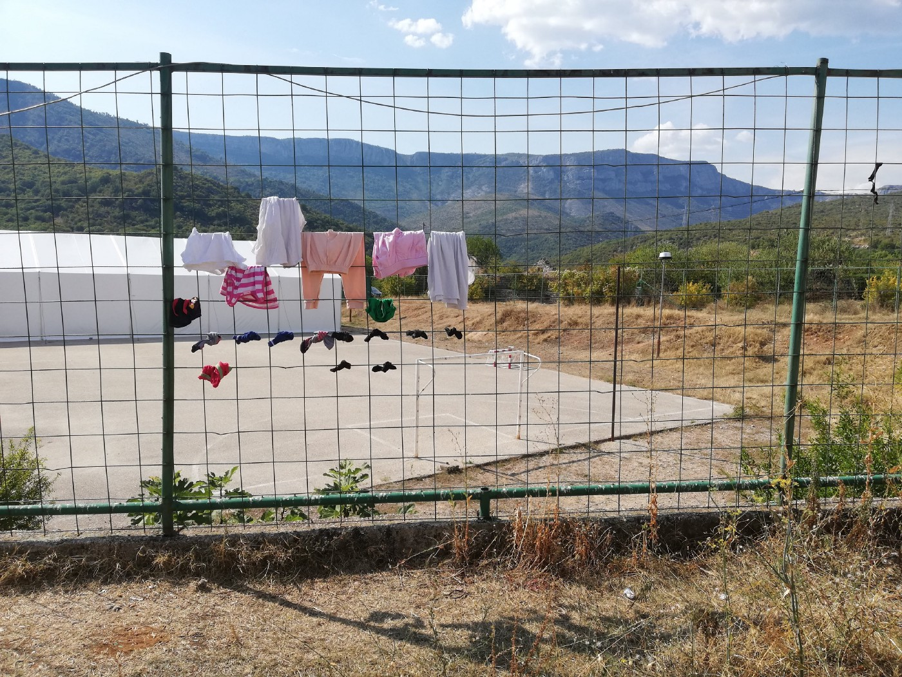
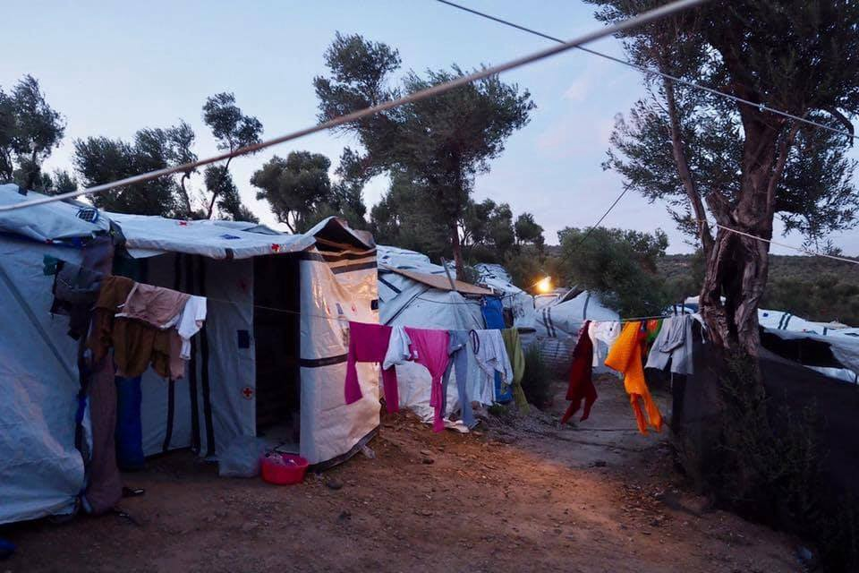
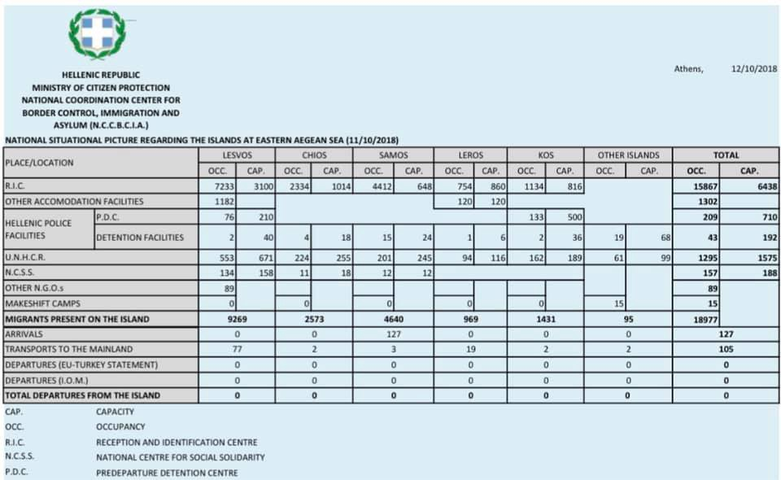
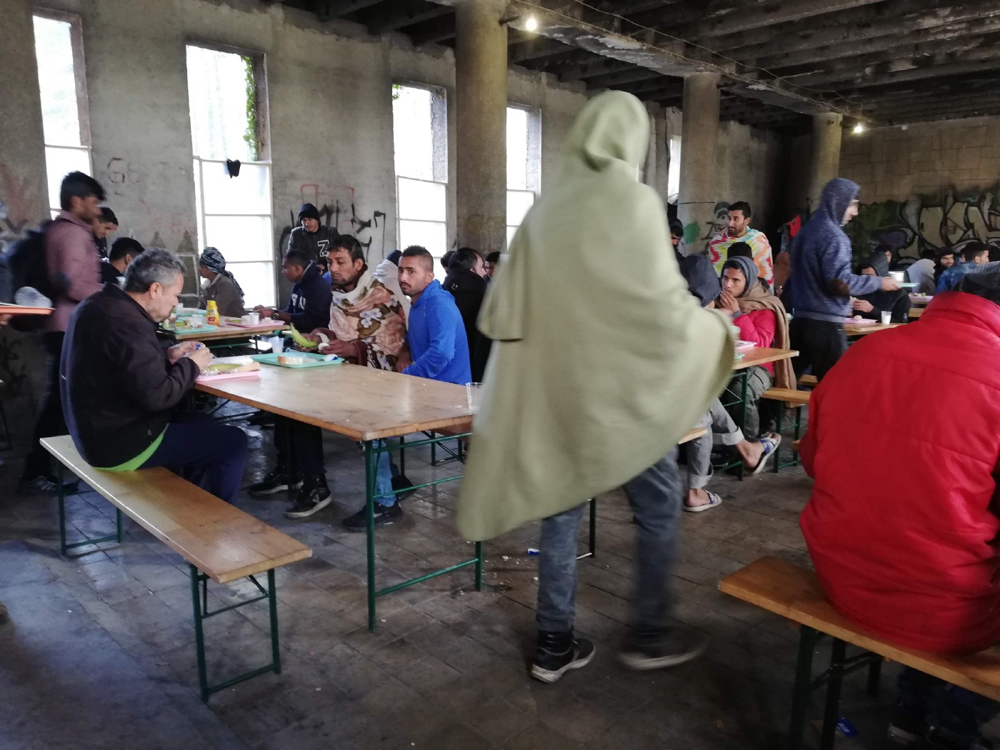
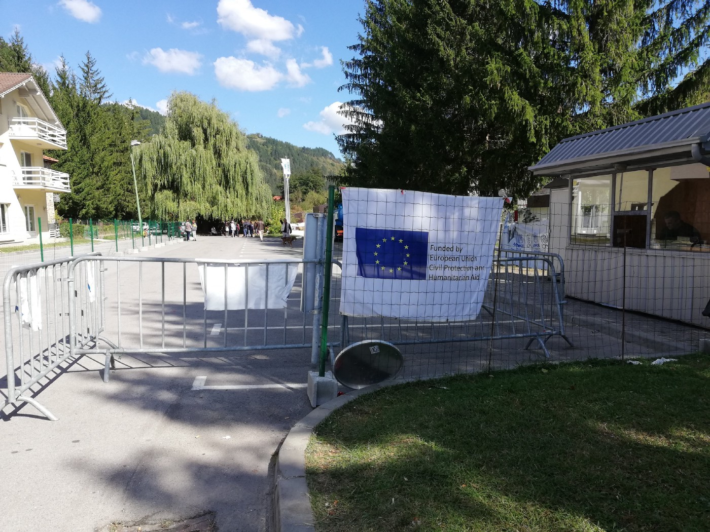
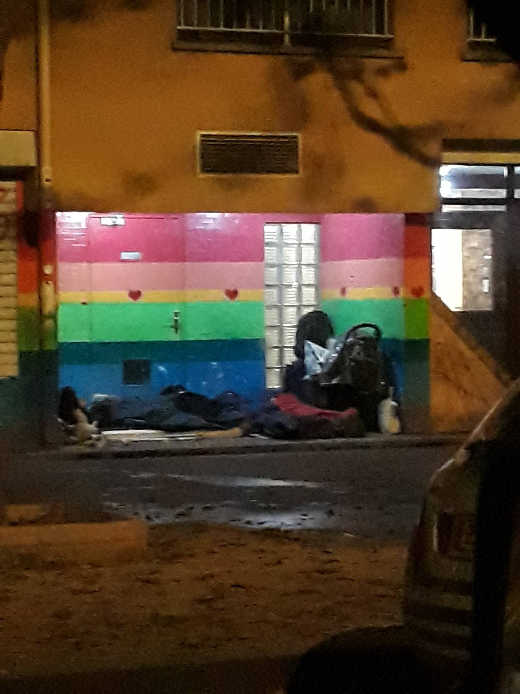

### AYS DAILY DIGEST 12/10/2018: 800 people arrived in October to Samos

_One person died or went missing for every 48 people who came to Europe this year // 16 per cent of individuals who came cross the sea since the beginning of the year are unaccompanied and separated children //Alarming calls for help from Thiva camp in Greece // Help needed for people on the move but also for the local population in Bosnia and France_

Mostar, camp Salakovac\. About 1oo people are living in this camp, and none of them has valid documents despite it is official camp\. Photo AYS
#### Feature

**According to the UNHCR data, the number of people who arrived in the EU this year decreased, while the number of those who attempted but did not make the journey increased\.** In the Central Mediterranean, one person died or went missing for every 48 people who crossed to Europe between January and September 2018\.

Between 1 January and 30 September 2018, **1,737 persons died or went missing while crossing to Europe** , of whom 1,245 lost their lives in the Central Mediterranean\.

Spain, Italy and Greece are still receiving big numbers of people daily\. On Friday, according to the official reports, the Spanish rescue services saved 35 people and found three bodies in their sinking ship\.The rescuers are still looking for 18 other people who were also on board according to their companions\. The boat had left Nador, in northern Morocco, for Spain with a total of 56 people on board, a spokeswoman for sea rescue services told AFP\.

In Italy, between 1 January and 30 September 2018, **20,948 people arrived by sea** \. Most of the people who arrived departed from Tunisia, followed by 29 per cent from Turkey, seven per cent from Libya, six per cent from Greece, and four per cent from Algeria\.

The ten most common countries of origin of refugees and migrants registered at Italian landing points between January and September 2018 are Tunisia, Eritrea, Sudan, Iraq, Pakistan, Nigeria, Côte d’Ivoire, Algeria, Mali, and Guinea\.

**Unaccompanied and separated children \(UASC\) account for 16 per cent of sea arrivals since the beginning of the year\.**

In Greece, the situation on the islands is not getting better despite the fact that a number of people have been — finally — sent to the mainlands\. **Since the beginning of the year, 23,176 people were registered and 18,103 transferred to the mainland\.** Additionally, 254 were deported under the EU\-Turkey deal \(109 Syrians\) \.

Despite the Greek government’s promise to ease the situation on the Aegean islands, as you can already calculate above, the situation has worsened\. Officially, there were 19,328 people present on the Aegean islands as of 30th September — compared to 19,111 at the end of August\.

Photo by Knut Bry

> Lesbos — 7991 people \(3100 official capacity, 8080 by end of August\), 

> Chios — 2423 \(1014; 2122\); 

> Samos — 3845 \(648; 3751\); 

> Leros — 730 \(860; 728\); 

> Kos — 1185 \(816; 1223\), 

> Total — 16,176 \(6438; 15,904\) \. 

Over 7,000 children arrived on the Greek islands between January and August this year\.

Latest official updated from Greek government Island situation 11\.10\.2018\.

One of the islands is Samos, where over 800 arrivals have been registered in October\. The camp is hugely overcrowded, currently holding almost 4,000 people\.

New arrivals on the island are not being given tents or any accommodation, only a sleeping bag\. In some cases, the authorities have been going tent to tent and forcing people to accept a new family in their already full tent saying: “if you do not take these people into your tent, we will take away the tent from you,” AYS sources are reporting\.

In recent weeks, there has not been enough food for everyone in the camp\. Some people are now lining up for breakfast at 4am to ensure they get food\.

While the volunteers are reporting about devastating living conditions for refugees in Greece, the European Commission [published](https://www.tovima.gr/2018/10/12/international/dividing-the-1-69bn-euro-pie-of-emergency-aid-for-refugees-in-greece/) that **so far 1\.69bn euros were dedicated to help** \.

Of that amount, **Greek authorities receive 794mn euros, 506\.67mn euros go to the UNHCR \(UN refugee agency\) 119\.7mn euros to the International Organisation for Migration \(IOM\), 26mn euros to the European Asylum Support Office \(EASO\), and 201 million to various NGOs partnered with the European Commission\.**

In addition, 44\.6mn euros in funding earmarked for international organizations and NGOs remains undisbursed\.

At the same time, at Moria camp, each family gets 1\.5 liters of water per person, per day\. They must get up at 4am in order to ensure that they will receive this water, which is distributed at 8am\.
#### Libya

**This year, the Libyan Coast Guard LCG rescued/intercepted 14,156 people at sea during 108 operations\.**

At the same time, they recovered 99 bodies from the sea\.

Over the last month, there was an increase in the number of registered arrivals to the shores, with 552 people in August, and 1,265 in September and 884 so far in October, according to the data gathered by the UNHCR in the region\.

UNHCR estimates that 5,893 people are detained in Libya, mostly in appalling and inhumane conditions\.
#### Italy

[Document](http://boats4people.org/wp-content/uploads/2017/05/B4P.Guide_.Families_EN-V2.pdf) for families who believe a loved one may have perished crossing the Mediterranean to Italy, and for the individuals or associations assisting them in their search\.
#### Greece

**On Friday, a Greek investigative judge questioned Sarah Mardini and Sean Binder and 28 other activists who have been accused of being complicit in human trafficking, money laundering, and espionage, among other charges\.**

Human Rights organizations, including Human Rights Watch, are claiming that the charges are “unfounded and reflect a worrying trend that seeks to criminalize humanitarian activism on behalf of refugees and migrants in Europe”\.

Mardini, 23, is a Syrian refugee who made her journey by boat from Turkey to Greece in 2015, along with her sister, Yusra\. Binder, 24, is a German national and the son of a Vietnamese refugee\.

Greek authorities have detained them since August 21\. All that for **1\.69bn euros only from the EC funds\.**

**On Friday, several individual posts about the situation in the Camp Thiva were published on FB\.** According to these post, this camp does not have enough facilities, there is nobody to provide NFI, diapers, any activities, no medical teams regularly… Over 900 people are in this camp, including 30 pregnant women\. According to the available information, the camp is run by the IOM\.

> If anybody has more info, or contacts inside, please share info with AYS so we can try to help\. 

The situation in many other camps across Greece is not much better\. Additionally, hundreds of people are forced to sleep out in the open\.
#### Hungary

**Despite all the problems, brave people from the Hungarian Helsinki Committee continue their work\.** They are seeking an intern for their refugee support program\. The intern needs to:

• have a law degree/attends final year of law university

• have a very good level of English \(both written and spoken\), good 
 research, writing, editing and communication skills,

• with basic knowledge on COI search and some experience with ECtHR cases and international jurisprudence,

• is precise and patient\.

Knowledge of Hungarian is not required for this particular position\.

For more info, [see this link](https://www.helsinki.hu/en/refugeeprogramme-intern/)
#### Bosnia

**The situation in Bosnia is not getting any better\.** The IOM, that somehow became in charge for everything related to the refugees and migrants, recently published a call for suppliers of containers in Bihać where several thousands of people have been living out in the open for months now\.

They plan to put containers in one factory that was closed down years ago\. It seems that they are taking a very similar approach to that taken in Greece, suggesting that they have not learnt from past failings\.

Food distro in Đački dom, place where about 1000 people live\. This building has no windows or doors, and the roof has been built only recently\. Phoot AYS\.

Bosnia is not an expensive country, and the money that is being spent on creating ugly camps, could be spent in a much better way, to provide decent accommodation\. Unfortunately, even when they choose hotels in which to place people, strange choices are made\. Hotel Sedra, near Bihać, where about 350 people have been living since August, is one example\.

Entrance to hotel Sedra\. Who is in charge? Photo AYS

From the very first day, it was well known that the hotel was to be destroyed soon, with a maximum of six months left as the owner told the media\. Additionally, the hotel is old and not suitable for living\. There is no drinkable water inside\. People AYS is in touch with who are living in the hotel, are telling us that the place is in a mess, while the IOM and the UNHCR, both present inside, cannot decide who is responsible for what\. Children did not start school this year, despite the law which allows them to\. The government had to do more, but also organizations whose job it is to take care of this group of people\.

At the same time, thousands are forced to stay outside, including many unaccompanied children\. Nobody but locals and groups of volunteers are helping\. This sentence we have repeated in our reports from Bosnia since February\. Due to this type of treatment, and carelessness, tensions among people are rising and the media are reporting on incidents almost daily\.

_Volunteers in the field need help_

[One bridge to Idomeni](https://www.facebook.com/.../a.69414.../1238547906287736/..) is urgently seeking for two volunteers who want to work on the Bosnian\-Croatian border, in the informal refugee camp of Velika Kladuša, Bosnia\. The minimum availability is one month\.

“We strongly prefer volunteers who we already known and with who we have already work with, or new people who have already did similar experiences\. “

[SOS Team Kladuša](https://www.facebook.com/photo.php?fbid=10156809483368179&set=a.10150237843043179&type=3&theater) and local charity [pomozi\.ba](https://www.facebook.com/pomozi.ba/) also need help\.Pomozi\.ba also helps to the local population, and Bosnia is one of the poorest countries in the Europe\. Help if you can\.

[RefugeeInfo](https://www.facebook.com/950581228335358/posts/1963979636995507/) recently published a short guide for Bosnia, and AYS helped them in compiling the basic info\. Please, share with those who need it\.
#### France

[**Paris Refugee Ground Support**](https://www.facebook.com/PRGS.team/?__tn__=%2CdkCH-R-R&eid=ARDwJXTthUaSwkPMGpuUxUvuQlwlYjWYqkc8VaE8EYdSWNWZ5JFRr8iDA5vIHPQlmSRemaQS06ApNQqV&hc_ref=ARQ1tjsIDylo_paW9s_S1KqeLA4d2KBMn1Rm5s4blvlMLBN8ioA0HVCFteDZZyLVq7c&fref=nf) **continues with their night distributions throughout the poorer areas of the city\.**

“ _We mainly find men and boys between the ages of 14 and 60\. We’ve seen this homeless family of a mother with her 4 kids, her baby and her husband in 2 separate places now\. We’ve seen them sleeping under swings and slides in a children’s play park, parents barely sleeping as they are so alert to the sounds of the night\-time capital city\. Tonight it’s rained and where they would have previously slept, now lies puddles\. On this night, we found them huddled under cover in this happy street doorway\.”_
#### Australia

**The UN made an urgent appeal to Australia to repatriate the refugees and asylum seekers who were forcibly transferred to Papua New Guinea and Nauru, where they live in centers in poor sanitary conditions\.**

_“Australia must prevent the tragedy of those who were forcibly transferred from continuing and transfer them immediately to their territory, where they can receive adequate attention and support,”_ said the United Nations Agency for Refugees \(UNHCR\) \.

**Roughly 1,420 people are kept in detention conditions** in the centers located on the island of Manus, in Papua New Guinea, and in Nauru, after the evacuation of some 500 for medical reasons\.

**Twelve people have died so far; cause of death was suicide in half of those cases\.**

Refugees and asylum\-seekers such as those in the Australian detention centers, have escaped conflicts in Afghanistan, Somalia and Syria and situations of extreme persecution, such as the Rohingya crisis in Burma\.

MSF have started [a petition](https://www.change.org/.../i-support-msf-s-call-to...) for the immediate evacuation of all asylum seekers and refugees from Nauru and for an end to the Australian offshore detention policy\.
#### General

**More than 17 million girls have been displaced in the global refugee crisis, [according to the aid group CARE](http://infomi.gr/12i8.T) \.**

A new report ranks the plight of girls in crises\. Many of the stories are horrifying: In Nigeria, it says, girls are wrapped in explosives and used as human bombs\. In Yemen, more than two\-thirds of girls are married before they turn 18\.

**The EU member states are pressing to get Morocco and Tunisia onto a list of so\-called “safe third countries” on to which to offload people seeking asylum\.**

The move appears linked to [stalled plans for setting up centres](https://euobserver.com/migration/142453) in countries rimming the Mediterranean to take in disembarked rescued migrants at sea, the [EU Observer reports\.](https://euobserver.com/foreign/143103)

**Print journal ‘Disrupted’ will focus on ‘Immigration: Migrants, Refugees, and Trafficking’\. They are [seeking for submissions](https://centreforfeministforeignpolicy.org/call-for-articles-and-art/) , particularly articles which:**
- Use feminist analysis to engage with and challenge global power structures
- Deconstruct the tendency toward Western\-dominant foreign policy narratives
- Discuss how feminist foreign policy can push for change beyond how states are currently utilizing it
- Are led by and incorporate marginalised voices to interrupt mainstream foreign policy ideas
- Question assumptions about the objectivity of foreign policy
- Paint the local into a larger global picture
- Focus on contexts other than Europe & the USA

**We strive to echo correct news from the ground through collaboration and fairness\.**

**Every effort has been made to credit organizations and individuals with regard to the supply of information, video, and photo material \(in cases where the source wanted to be accredited\) \. Please notify us regarding corrections\.**

**If there’s anything you want to share or comment, contact us through Facebook or write to: areyousyrious@gmail\.com**

_Converted [Medium Post](https://medium.com/are-you-syrious/ays-daily-digest-12-10-2018-800-people-arrived-in-october-to-samos-6e92c0420819) by [ZMediumToMarkdown](https://github.com/ZhgChgLi/ZMediumToMarkdown)._
