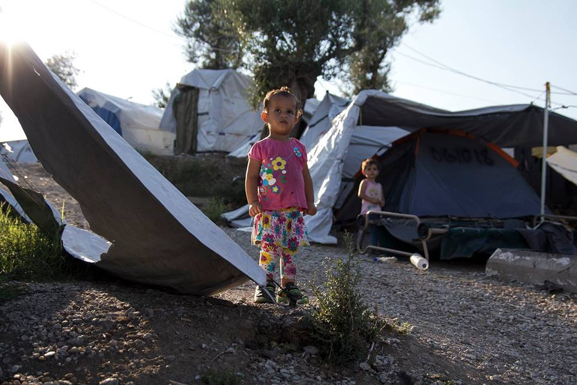
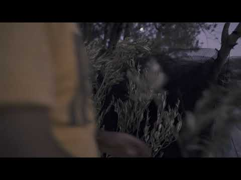
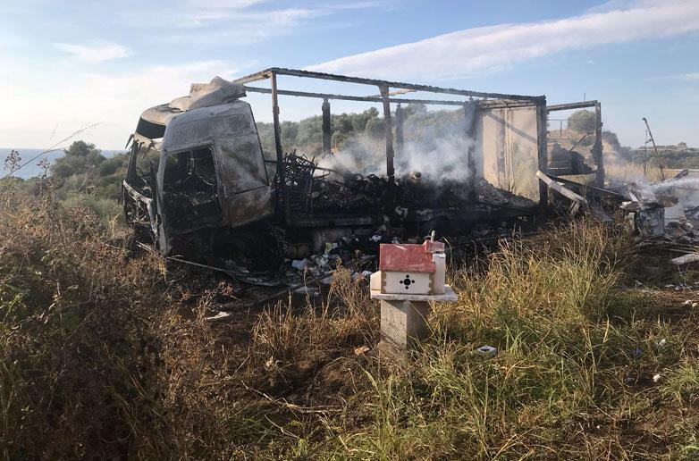
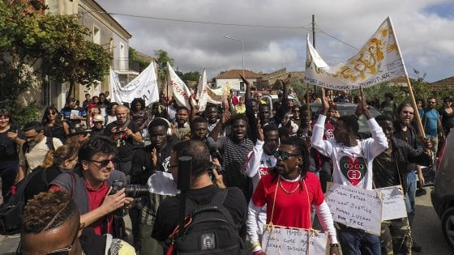
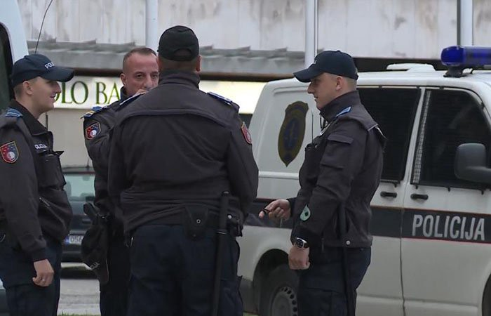
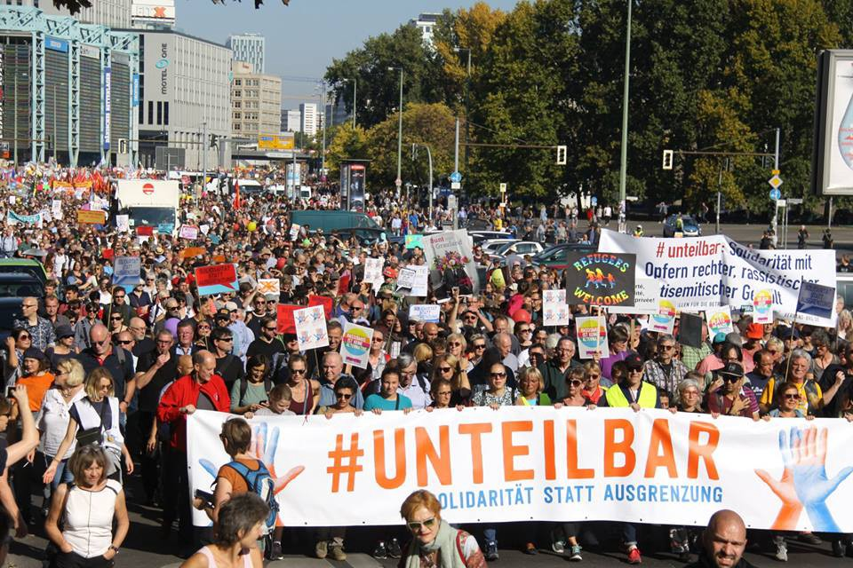

### AYS digest 13–14\.10\.2018: One rape a week in Moria camp
#### Women, men and pre\-school children have been targeted by sexual abusers in Greece // Eleven refugees burnt alive in a car accident near Kavala // Dozens of refugees arrested under vague smuggling charges in Bosnia // Salvini wants to move all refugees from Riace // 900 refugees under the age of 14 gone missing in Germany // 242,000 people march against fascism in Berlin

Children are exposed to hunger, sickness and potential abuse in the camp\. Photo: Through Refugee Eyes
### Feature
### One rape a week reported in Moria, many more remain unreported and often undetected

Moria remains a shocking proof of how much the idea of so called ‘hot spots’ are failing those that need international protection\. Yesterday, Médecins Sans Frontières’ \(MSF\) Greece Medical Coordinator Dr\. Declan Barry told [Newsweek](https://www.newsweek.com/families-greek-refugee-camps-live-fear-children-will-suffer-sexual-abuse-1168146) that since mid\-May, the organization has seen an average of one reported case of sexual assault per week, which adds up to at least 21 cases reported to MSF alone in less than five months\.

Barry said that these cases involved women, men and children at the Moria refugee camp, but nearly half \(at least 10\) have involved boys and girls under the age of 18, with at least two incidents involving five\-year\-old children, Barry said\. Some of the reported incidents of abuse against children involved penetrative rape, while others involved “inappropriate sexualized touching\.”

> “In one particular case, it was a single father and he had just left his tent to get food… And he came back to find his child had been sexually abused\. One case is not acceptable, let alone one a week\. And I’m sure it’s happening a lot more frequently than that\. We need to acknowledge that this is a systemic failure” Barry said\. 

MSF maintains a strong and much needed advocacy offensive in order to raise awareness about the situation in Moria and hopefully evacuate people from the site\. In a video published for the World Mental Health Day, MSF’s psychiatrist Dr\. Alessandro Barberio warned Greek and European authorities about the deteriorating mental state of refugees in Moria camp and asked for the immediate evacuation of all vulnerable people from the camp\.

■■■■■■■■■■■■■■ 
> **[MSF Sea](https://twitter.com/MSF_Sea) @ Twitter Says:** 

> > On #WorldMentalHealthDay MSF Psychiatrist Dr Alessandro Barberio talks about the mental health emergency in #Moria and calls on Greek authorities and the #EU to evacuate all vulnerable people to safe accommodation on the mainland and other EU countries immediately. #Letthemout https://t.co/LFyX3tZlrH 

> **Tweeted at [2018-10-10 17:45:42](https://twitter.com/msf_sea/status/1050079940916510720).** 

■■■■■■■■■■■■■■ 

Volunteers and aid workers have been warning of a rise in depression, self\-harm and suicidal tendencies among residents of Moria, where some 8,500 people are crammed into a space designed for about 3,000\. Around half the population is women and children\. A new video published on Facebook shows refugees queuing for food from 4am, highlighting issues of overpopulation and scarcity of the most basic goods in the notorious camp\.

Earlier this month, MSF teams have reported seeing multiple cases each week of teenagers who have attempted to commit suicide or have self\-harmed\. They are also responding to numerous critical incidents as a result of violence, child self\-harm and the lack of access to urgent medical care, highlighting significant gaps in the protection of children and other vulnerable people\.

This week, we publish a short video by the independent volunteer [Ania Domanska](https://www.facebook.com/ania.do.52) who went to Lesvos\. The video is showing a very touching moment of a father who tries to build a shelter for a family\. In European Union\.

#### Greece
### 11 refugees burnt alive in a car crash near Kavala

The head on collision between a truck and a mini van occurred shortly after 5am on Saturday near the village Sarakina by the town of Kavala\. The driver of the van was allegedly transferring refugees from the Evros border to Thessaloniki\. He had developed high speed in order to avoid the police patrol on the road and lost control of the vehicle\. We have decided not to post videos of the burning car out of respect for the victims and their families\.

This week, [we got the report from Samos](ays-daily-digest-12-10-2018-800-people-arrived-in-october-to-samos-9aaee6d21265) , one of the hot spots in Greece, saying that 800 people arrived there during October\. This is the current situation on the islands:

> Lesvos — 7991 people \(3100 official capacity, 8080 by end of August\); 

> Chios — 2423 \(1014; 2122\); 

> Samos — 3845 \(648; 3751\); 

> Leros — 730 \(860; 728\); 

> Kos — 1185 \(816; 1223\), 

> Total — 16,176 \(6438; 15,904\) \. 

Rape and sexual assaults are not the only brutality happening to people in Greece\. Also this week, [we wrote about the horrifying story](ays-daily-digest-10-10-2018-3-women-found-brutally-murdered-near-river-evros-greece-8b25340d6d64) of three women who were found dead near the Evros river crossing\.

> “The three victims’ nationalities remain undetermined, but they appear to be from North African, Middle Eastern or Asian origins\. Their identities remain unknown\. One of the victims is believed to be under 15 years of age, while the other is between 17 and 21\. The third victim is thought to be between 30–35 years old\. The coroner, Pavlos Pavlidis, reports that the women were killed approximately four days before the bodies were discovered and he has zero doubt the deaths were caused by a criminal act\. DNA tests will be conducted to determine if the women are related\.” 

Help is needed in a [new warehouse](https://m.facebook.com/chiospeopleswarehouse/) in Chios\.
#### Italy
### Salvini wants to move all refugees from Riace

The Ministry of Interior have decided to terminate the SPRAR project in Riace\. According to official sources, all refugees from the town will be transferred to other sites within 60 days\. This decision was announced while the mayor of Riace, Domenico Lucano, was under house arrest\. He is charged with a series of alleged offences regarding the management of loans granted by the interior ministry and the prefect’s office of Reggio Calabria to Riace town council, in order to provide accommodation for refugees and asylum seekers\.

> “Those who make mistakes must pay\. We can’t tolerate irregularities in the use of public funds, even if there is the excuse to spend them on immigrants”, commented Deputy Prime Minister Salvini\. 

_The Riace demonstration in support of Mayor Lucano after his arrest\. Photo: Republica_

The Riace model has been widely recognised as a good example of integration of refugees in Italian society\. The mayor claims no wrongdoing, and many see his house arrest as a warning against providing additional support to refugees in Italy\. The president of Calabria Region Mario Oliverio has publicly asked Deputy Prime Minister Salvini to revise his decisions against the Riace mayor and to recognise his integration efforts\.

See the [AYS story on mayor of Riace](ays-weekend-digest-6-7-10-2018-are-we-strong-enough-to-say-no-pasarán-together-cdde7c955889) we published this week\.
### Municipality bullies a priest helping refugees

According to Sandra Uselli / Refugee Crisis Database, The Extraordinary Hosting Center in Vicofaro, Tuscany, managed by Don Massimo Biancalani was closed by the local prefecture in August 2018 for security related reasons\. The refugees were transferred to the rectory in Ramini within the same city\. He then opened the rectory to host those in need of shelter but the Town Planning Service of the Municipality of Pistoia has ordered the termination of the activity for security, hygiene and health reasons \(Municipal Order no\. 992 of 11 September 2018\) \.

In case of non\-compliance, Don Biancalani will be held solely responsible for any damage to things or people that may occur\. From this moment, around 70 people — including local homeless people — are being hosted within the Santa Maria Maggiore parish\. On October 3rd Don Biancalani informed that he was under investigation for having posted some asylum seekers’ pictures on social media without their consent and announced that he would begin a hunger strike also in protest of the center shutdown\.

Don Biancalani started an integration project into the parish in September 2017, the ‘Pizzeria del Rifugiato’ \(Pizzeria of the Refugee\) hiring twelve refugees as pizza chefs and waiters\.
### Increasing number of refugees in Friuli

There are many refugee emergency returns to Friuli and in particular to Udine\. New refugees are constantly coming, from 20 to 30 a day, about 450 in a month, a new report says\. The numbers have doubled within the last two months\.

People now sleep in the street and in the parks, because they are new and don’t know where to go\. In the Cavarzerani camp \(where an Afghan boy recently killed himself\) there are now 450 men from Syria, Pakistan and Afghanistan\. Volunteers have warned that this is too many for the camp, which is expected to host 320\. The Red Cross has transferred an additional 35 asylum seekers from the Cavarzerani camp to the Friuli camp\.
#### Montenegro
### More than 1000 refugees found shelter in Bona Fide centre in Pljevlja since February

Montenegrian television visited Bona Fide centre in Pljevlja, where more than one thousand people found shelter since February\. People are arriving to Montenegro before they enter Bosnia, from where they go to Croatia and on to other European countries\.

According to the [TV report](http://www.rtcg.me/vijesti/drustvo/217377/vise-od-hiljadu-migranata-proslo-kroz-pljevlja.html) , most of the people arriving to Bona Fide are from Syria, Iraq, Afghanistan, Pakistan, with a recent increase of Yemeni refugees also\. In Bona Fide they can rest, eat and shower, and it seems most of them don’t stay long before they continue their trip towards the EU\.
#### Bosnia
### Dozens arrested under vague smuggling charges

Arrests of refugees have especially increased in the last six weeks\.

Dozens of refugees, but also locals, have been arrested under vague accusations of smuggling others in Bosnia over the past few weeks\. Such arrests have been increasing since December\. AYS volunteers in Sarajevo report that arrests have especially intensified over the last six weeks\. Having in mind a large number of people who’ve been detained under such accusations, and at the same time the lack of an independent body dedicated to monitoring detentions and court hearings, we find it possible that innocent people have also been labeled as smugglers\.

A local court can give up to 30 days detention to keep them in Sarajevo until the court hearing\. The detention can be extended several times until the charges are examined in court\.
#### Germany
### 900 refugees under the age of 14 missing in Germany, Child Welfare Association warns

The number of refugees under the age of 14 who are missing in Germany has increased in recent months, despite a drop in the total number of arrivals, according to the German Child Welfare Association\. The number increased from 895 children in July to 902 in October, the association said, citing figures from the Federal Criminal Police Office\.
### 242,000 people protest against fascism in Berlin

“Refugees welcome” was one of the most common banners in the protest\. Photo: Uniteilbar

Approximately 242,000 people took the streets of Berlin following the motto [\#unteilbar](https://www.facebook.com/hashtag/unteilbar?source=feed_text) \(indivisible\) showing solidarity in the fight against growing fascism in society and government\.

The march was organised by a coalition of 450 NGOs, initiatives, political parties, trade unions and individuals\. 40,000 people were expected to participate, and according to organisers more than 240,000 came\! That’s 8 times more people than the right\-wing AfD party has members across the whole of Germany\.

What makes us especially happy is that the protest included many pro\-refugee messages\.

#### France
### Calare4Calais needs donations of food

As numbers are increasing in northern France, volunteers are being asked more and more for things to eat\. In Dunkirk the families like to cook for themselves when they can\. In Calais there are also small groups who often ask for food to cook with\.

A standard food pack given by Care4Calais charity consists of biscuits/cake, cereal bar, bag of mixed dried fruit and nuts, tin of tuna, sardines or fruit\. If they can cook for themselves refugees also ask for oil, tomatoes, kidney beans, spices and lentils\.

> If we were to take this in one week to all locations we would need a minimum of 1400 of each item\. And you would not believe the amount of tea / coffee / hot chocolate / sugar / milk and biscuits we get through on a distribution for 400 plus people per day\. Please make it possible in the coming months — as winter will be upon us in weeks and it’s getting colder now the hot tea and coffee is so popular, wrote Care4Calais\. 

A needs list is continuously published on [their website](http://www.care4calais.org) , but any of the above mentioned food would make the difference on being able to meet this fundamental need or not\. Feel free to contact them for any further details\.

**We strive to echo correct news from the ground through collaboration and fairness\. Every effort has been made to credit organizations and individuals with regard to the supply of information, video, and photo material \(in cases where the source wanted to be accredited\) \. Please notify us regarding corrections\.**

**If there’s anything you want to share or comment, contact us through Facebook or write to: areyousyrious@gmail\.com**

_Converted [Medium Post](https://medium.com/are-you-syrious/ays-digest-13-14-10-2018-one-rape-a-week-in-moria-camp-909b8024fba7) by [ZMediumToMarkdown](https://github.com/ZhgChgLi/ZMediumToMarkdown)._
