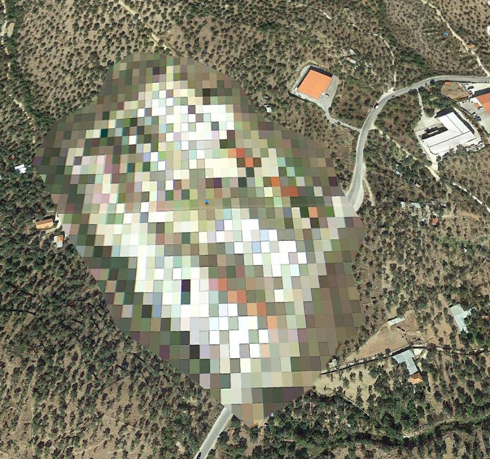

### AYS DAILY DIGEST 18/10/2018: Another EU Council meeting, another failure

_EU Council meeting on migration not taking into consideration urgent issues // EASO and Frontex under spotlight for irregularities in their funding expenditure // Anti\-crime information cell to be tested in the context of EUNAVFOR Med operations // 135 people evacuated from Libya to Niger // Last member of the Moria35 finally free // Protest in Moria this morning // 233 migrants convicted for a sit\-in protest / 360 unaccompanied minors disappeared last year in the Netherlands // And more news…_

Credit: Robert Nielsen\. “According to Google Earth, this is how Moria camp looks from above\. Although this satellite picture is from October 2014, someone must feel ashamed…” \(Information Point for Lesvos Volunteers\)
### **FEATURE**

The EU has political and factual solutions to end the so\-called migration “crisis\.” Why are they not being implemented?

[As reported by EUobserver](https://euobserver.com/opinion/143126) , this year the EU was faced with the lowest incoming numbers of applications so far, 400,000, an incredible decrease compared to the 1\.3 million applications lodged in 2015\.

In these three years, policies have been implemented to stop the flow of people from one country to another, but practical solutions to accommodate the basic needs of migrants seem still out of reach, taking as an example the conditions inside Moria detention centre\.

This sense of crisis remains present and frustrations are increasing, not only among people on the move, but also among locals, who are supporting more and more right wing politics and propaganda machines\.

Shared and agreed solutions are on the table at the policy level: laws on equal reception, fair distribution of asylum seekers, faster asylum procedures\. Agreements are on the table also with regards to reception conditions, resettlement of refugees and of those who are eligible for asylum\.

Far from addressing issues such as the “disembarkation platforms” in northern Africa or any mentions of the expanded mandate to Frontex, the [European Council’s conclusions](https://www.consilium.europa.eu/en/meetings/european-council/2018/10/18/) after today’s meeting are again depressing and show an unwillingness to implement practical solutions to face the migratory “crisis\.”

As reported in the [final statement](https://www.consilium.europa.eu/media/36775/18-euco-final-conclusions-en.pdf,) , European leaders have called for a strengthening of measures to prevent “illegal” migration and bolster internal security, and for tight collaboration with countries of origin and transit, namely northern African countries, as well as announcing a fight against people\-smuggling networks across the territory\.

“ _More should be done to facilitate effective returns\. Existing readmission agreements should be better implemented, in a non discriminatory way towards all Member States, and new agreements and arrangements concluded, while creating and applying the necessary leverage by using all relevant EU policies, instruments and tools, including development, trade and visa\. Additional efforts are needed to fully implement the EU\-Turkey Statement_ ”\.

No mentions of deaths in the Mediterranean\. No mention of tortures suffered by migrants in Libyan detention centres\. No mention of the increasing persecution of solidarity\.

In a joint letter to the Commissioner for Migration, Home Affairs, and Citizenship \(Dimitris Avramopoulos\), Refugee Rights Europe and 18 others civil society organisations denounce the inhumane living conditions of asylum seekers in the EU and the constant human rights violations they are faced with on a daily basis, including the right to health and adequate living conditions, as well as the right to freedom from degrading treatment and access to information and asylum\.

The joint statement presents concrete recommendations as well, such as the “ _omission of the country of first entry/first country of asylum criterion in order to alleviate disproportionate pressure on EU front\-line states_ ” and “ _the end to the use of administrative detention as a means of deterrence or as a side\-effect of an inadequately functioning system of asylum and reception_ ”\.

### EU

EASO and Frontex are under the lens of the [European Court of Auditors](https://www.epsu.org/article/european-court-auditors-finds-irregularities-easo-and-frontex-spending?fbclid=IwAR2kaszPnJu1C1TFQHP80kGl91zCvKDeLAcE6enddIjjh7uxNfWa7sB7AYY) for irregularities in spending their allocated budget and for general malfunction\.

The [recent report on EU agencies’](https://g8fip1kplyr33r3krz5b97d1-wpengine.netdna-ssl.com/wp-content/uploads/2018/10/Full-ECA-400-page-report.pdf) finances found that €7\.7 million out of the €79 million budget for public procurement and that recruitment was non\-compliant with EU financial rules, highlighting an “inadequate internal control system\.”

“ _The extraordinary operational challenge caused by the migration crisis was not mitigated by a solid governance structure_ \.”

Meanwhile, Frontex overestimated its budgetary needs by cancelling specific operations during the past two years\.

“ _The Agency again cancelled a high level of committed appropriations carried over from the previous year for reimbursements of expenditure to countries cooperating in joint operations with 7,7 million euros, i\.e\. 16,5 % \(2016: 5,6 million euros, i\.e\. 17,6 %\) \. This demonstrates that cooperating countries considerably over\-estimated again the expenditure to be reimbursed by the Agency_ ”\.

The EU’s anti\-fraud office is carrying on an investigation into possible irregularities in procedures and management of human resources, aggravated by possible infringements of data protection policies\.

Moreover, the Ombudsman is also investigating EASO for the implementation of fast\-track border procedures and allegations on arbitrary decisions made by the agency’s officers\.

EUNAVFOR Med \(European Union Naval Force Mediterranean\), together with Europol and Frontex personnel, has activated [an anti\-crime information cell](http://notesdeseguretat.blog.gencat.cat/2018/10/15/pilot-project-reinforcing-the-internal-and-external-security-of-the-european-union/?fbclid=IwAR3MTv8GXZRHc8_hbWOVmWyvclc6o9TU-0Jx8gOzftZbxqB6rKv7ynRqF7w) \(for a trial period of six months\) which will improve the exchange of information concerning criminal activities in the Mediterranean and provide a wider, shared platform to European partners to detect criminal networks dealing with people smuggling and trafficking and, through cooperation with Frontex, reinforce the surveillance of European borders\.

On EU Anti\-Trafficking Day, the International Centre for Migration Policy Development has published a [report](https://www.icmpd.org/fileadmin/ICMPD-Website/ICMPD_General/Publications/Stepping_Up_the_Fight_against_Trafficking_for_Labour_Exploitation_Final.pdf) concerning the challenges still faced by social services, practitioners, and policy makers to identify trafficked people and in providing them with adequate assistance, while prosecuting perpetrators\.
### MOROCCO

35 migrants, including five women and one child, were [arrested](https://www.facebook.com/AmdhNador/posts/2202349599977303) in Tazaghine, 65 km west of Nador\.

Conditions for families and babies are harsh, as they are forced to live in the forest, being neglected and attacked by authorities\.

### LIBYA

On Tuesday night, [135 people were safely evacuated](http://www.unhcr.org/news/press/2018/10/5bc8494b4/unhcr-evacuates-vulnerable-refugees-libya-fighting-resumes.html?fbclid=IwAR3_brgZHDBeQfoAuec1MiXECIBYVhTmdmkNzREaZkUbKHy7JoaKlHTYhHo) from Libya to Niger by UNHCR\. Many of the people suffered incredible traumas, being held in detention for months, lacking food and adequate health care, in a escalating, conflictual environment\.

Since December 2017, the number of people who have been resettled from Libya amounts to 1997\.

“ _On the same day, 85 refugees from Syria, Sudan and Eritrea departed on two flights from Tripoli to Timisoara, Romania, with the assistance of IOM, the UN Migration Agency\. They will spend a few weeks at UNHCR’s Emergency Transit Facility before flying onwards to Norway_ ”\.
### GREECE
#### _Arrivals_

A total of [172 people](https://www.facebook.com/AegeanBoatReport/posts/460970737759369?hc_location=ufi) reached Greek islands today\.

_Samos_

[Kurdish and Farsi books are needed](https://www.facebook.com/samosvolunteers/photos/a.567427800102051/1098773196967506/?type=3&theater) \.

_Lesvos_

A protest took place inside Moria this morning\. A large number of women and children were present too\.

Finally some good news regarding the Moria35 trial\. [The last person still under arrest was released\!](https://twitter.com/lesboslegal/status/1052927964437012481?fbclid=IwAR2Bhuw4miIhZqND8s58yAjUpipBkHNgfkWViaml2hVwAPn8Jbv9bjiWFPM) After 15 months of unjust detention, all the members of the group are finally free\. See more information on the trial [here](http://www.legalcentrelesbos.org/2017/07/30/free-the-moria-35/) \.

_Mainland_

■■■■■■■■■■■■■■ 
> **[RSA](https://twitter.com/rspaegean) @ Twitter Says:** 

> > Unaccompanied children #Greece: Table shows limited number of shelter places available that results in hundreds of UAMs staying in camps or being detained in police stations. This is not new - there is persistent failure in protecting this vulnerable group #refugeesgr https://t.co/LkolzZhyB2 

> **Tweeted at [2018-10-18 06:14:04](https://twitter.com/rspaegean/status/1052804990245502976).** 

■■■■■■■■■■■■■■ 

233 refugees, mainly from Iraq and Kurdistan, were [convicted for a sit\-in protest](http://www.topontiki.gr/article/293556/katadiki-expres-se-fylakisi-gia-233-prosfyges-poy-diamartyrithikan-kleinontas-dromo?fbclid=IwAR2w_zBEH46_p8-zwzWHvYuxaYatp1-aUXdcrNXEgdZAHpEPq3iCtTxCl2g) which occurred north of Orestiada\. They will also have to pay for their legal expenses\.

Intervolve is looking for a [shop manager](https://www.facebook.com/northerngreecevolunteers/posts/1952282334861715:0?hc_location=ufi) for their activities in Larissa camp\.
### BOSNIA

As winter is approaching, children and vulnerable people are facing the [struggle to find warmth and safety](https://www.facebook.com/aidbrigade/photos/a.1793996864042628/1912953795480267/?type=3&theater) in Sarajevo, forced to sleep in tents, while awaiting for official camps to open\.
### FRANCE

Help Refugees has published [new information regarding the conditions in Puythouck](https://helprefugees.org/volunteer-blog/some-would-call-this-hell-conditions-for-refugees-in-grande-synthe-are-as-bad-as-ever/?fbclid=IwAR38uE6SjT38vQjRQVOj_GsN8k7t7FK5P7VuzxS9nkB6hunuTCcMMUs1_T4) , between Calais and Dunkirk, where people, including families and children, live among dirt and toxic substances\.

Local authorities estimated that 1,700 people are living in the area\.

On Tuesday, a 23 year old woman passed out, collapsing unexpectedly in the mud, while paramedics present on the scene did not move a finger to help reanimate the her, until the arrival of the police\.

“ _Last night, Wednesday 17 October, during a food distribution, French police fired chemical agents into the nature reserve\. Women flee the approaching gas, covering their faces, repeating actions seen countless times before\. Mothers holding close babies as young as three\-months\-old, ran from tear gas\. Families, with a right to sanctuary, treated like criminals_ ”\.

As [we reported on Tuesday](https://medium.com/are-you-syrious/ays-daily-digest-16-10-2018-winter-is-coming-on-the-bosnian-croatian-border-f1488556b715?fbclid=IwAR0DvjjJH256QaCwepVPzGxGfAzWvqauRU3AZXHZbGyHmxau43aE8r6EIbw) , about 100 people were evicted from a makeshift camp in Clermont\-Ferrand, southern France\.

A protest in solidarity is going to happen this Friday\.

Solidarité migrants Wilson is organising a collection of clothes and goods for winter on Friday the 26th and Saturday the 27th in Paris\. They will need volunteers to sort out donations too\.

### THE NETHERLANDS

[A man lit himself on fire](https://www.nu.nl/binnenland/5520650/man-steekt-zichzelf-in-brand-bij-bed-bad-broodvoorziening-in-groningen.html?fbclid=IwAR0iMoLjmERNingvf0ku0MligrnVxW0NKLG8Lq8TQMiE0jzgAfyq9raV-F0) in a BBB facility in Groningen\. He was given first aid by people on site and taken by the ambulance to the nearest hospital\. The man was a rejected asylum seeker, suffering from psychological conditions; the BBB personal knew about this and had reportedly taken measures \(apparently inadequate\) \. The reasons behind the act are unknown\.

DutchNews reports that [360 unaccompanied minors disappeared](https://www.dutchnews.nl/news/2018/10/360-unaccompanied-child-refugees-vanished-in-nl-last-year/?fbclid=IwAR3HFsop55QGAkmkhbe1cikLjAA4vQROZAYTzm-rwiGxNQri3rNGERzZQwo) from the country in 2017, probably falling victim to human trafficking for labour exploitation or forced slavery and prostitution\. The number of minors lodging asylum applications in the Netherlands last year was around 1,200\.

“ _The government has taken steps to stop refugee children disappearing by introducing smaller care units with better leadership, and introducing more closed homes for youngsters who are felt to be at risk\. Nevertheless, the number of children who vanish from the system has more than doubled between 2015 and 2017_ ”\.

**We strive to echo correct news from the ground through collaboration and fairness\.**

**Every effort has been made to credit organizations and individuals with regard to the supply of information, video, and photo material \(in cases where the source wanted to be accredited\) \. Please notify us regarding corrections\.**

**If there’s anything you want to share or comment, contact us through Facebook or write to: areyousyrious@gmail\.com**

_Converted [Medium Post](https://medium.com/are-you-syrious/ays-daily-digest-18-10-2018-another-eu-council-meeting-another-failure-f9d211912e3) by [ZMediumToMarkdown](https://github.com/ZhgChgLi/ZMediumToMarkdown)._
