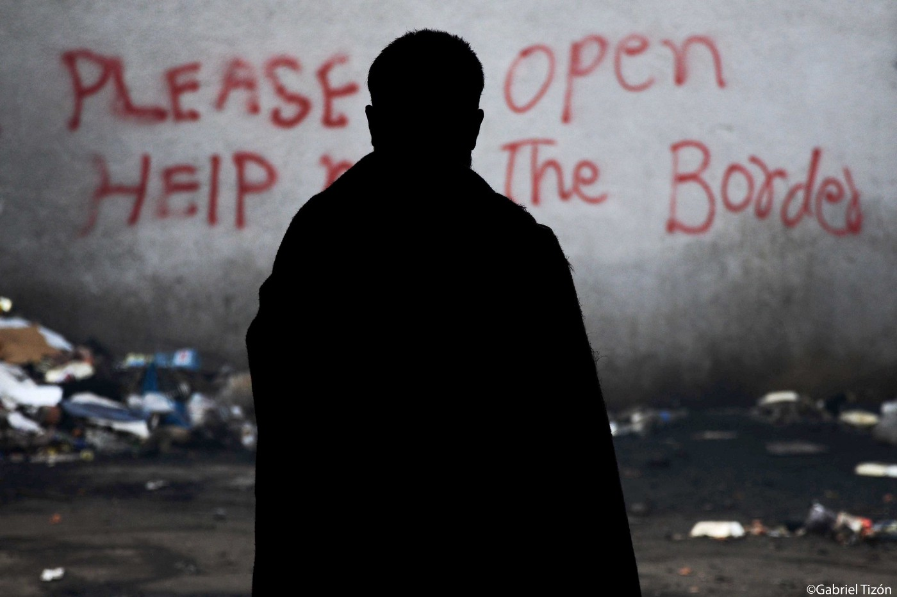
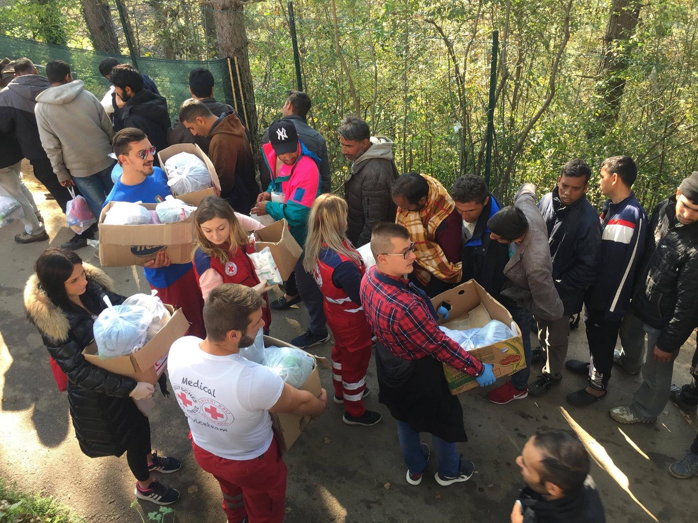
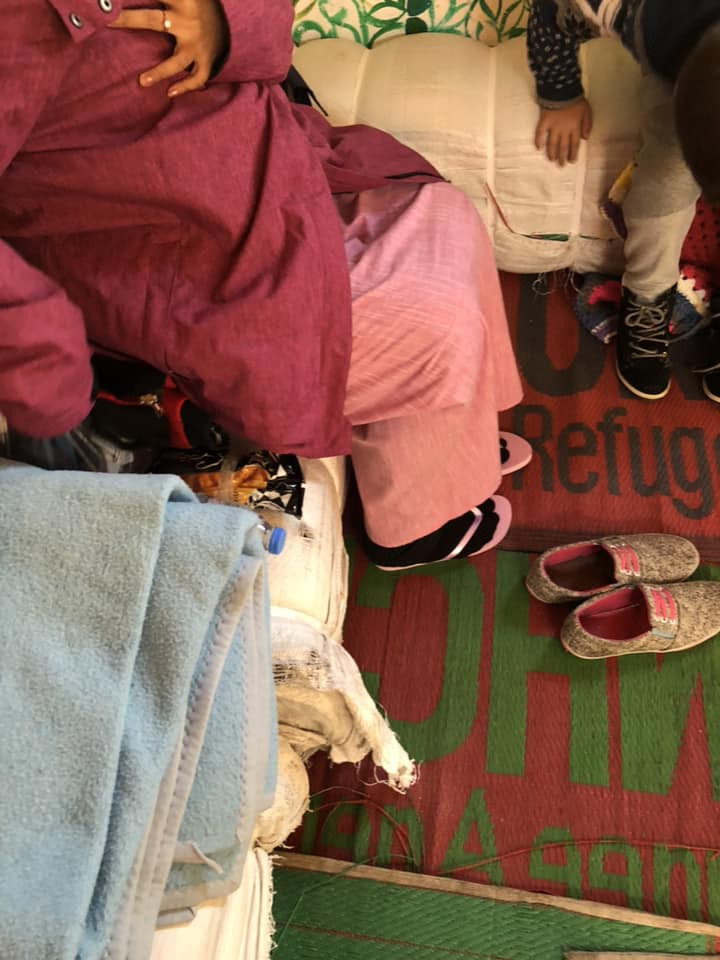
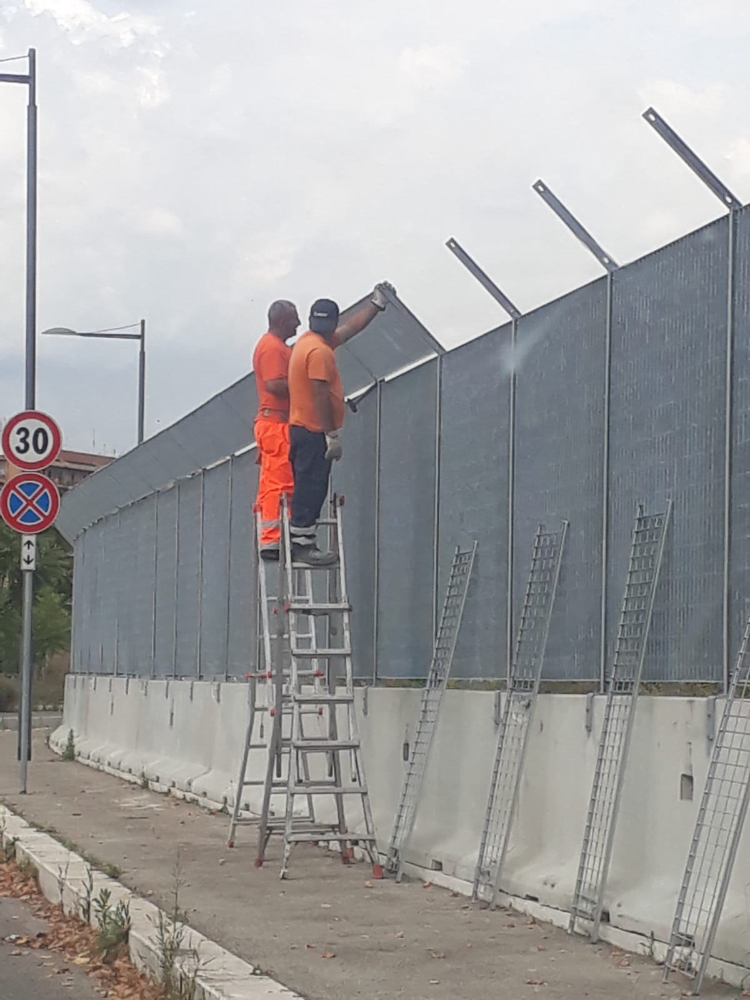

### AYS DAILY DIGEST 19/10/2018: Up to 1000 people enter Bosnia daily

_The EU idea of the “regional disembarkation platforms” is still alive // Conditions in Bosnia are not improving // Police in Moria mistreats people kept inside against their will // Mayor of Rome is building walls inside the city // the City of Heidelberg in Germany want to receive more people //_

By Gabriel Tizon
#### Feature

**So far this year, 91,093 people entered Europe by sea** , the IOM Missing Migrants Project estimates\. At the same time, at least 2,948 people who were running away from war, poverty, effects of climate change, or just trying to find a better life, died or went missing on migratory routes across the globe in 2018\.

For leaders in the European Union these numbers are only the sign that they need more barriers to stop people from coming\. One of the recent schemes coming out of this is the creation of so\-called “regional disembarkation platforms”\.

The plan — which is not currently very clear, at least not to the broader public — is to use the countries where people are entering the EU from \(for example, North African countries\), as places where centers will be built and people stopped from continuing their journeys\.

However, there are some issues the EU has to deal with before starting to realize this idea, and that is the fact that none of the designated countries wants to become the prison for people on the move\. But, this could change easily as we see a game of carrot and stick ensuing, a favourite for Brussels\.

“All north African countries reject this proposal — Tunisia, Algeria, Morocco and Libya, as well,” Libya’s Foreign Minister Mohamed Al\-Taher Siala said in an Austrian newspaper interview on Friday\. “So with which countries does the EU want to agree on these disembarkation platforms?” he asked in comments reported in German\.

So far, Libya is cooperating with the EU and sending people back who reach this country\. They also reached an agreement with Chad, Niger and Sudan to bolster protection of its southern border, or as Siala said, “That’s actually where the European border begins, not the Mediterranean”\.

By the 19 October, the Libyan Coast Guard \(LCG\) rescued/intercepted 14,156 people at sea during [108 operations](https://reliefweb.int/sites/reliefweb.int/files/resources/UNHCR%20Libya%20Flash%20Update%2019%20October%202018.pdf) \.

The second option is the Balkans, including Albania and Bosnia and Herzegovina, but also possibly Serbia\. So far, Albania has rejected this idea, but having in mind that the countries in the region are hoping to join the EU, we can think that the Brussels has a carrot to put on a stick in the front of the regional leaders\.

In the meantime, the number of people arriving at the Balkans is increasing every day\. According to the [statement by the head of the IOM in Bosnia](https://youtu.be/DMGjwjraSeo) , over 18,600 people were registered to enter this year\. Over the last couple of days, this reached up to 1000 people a day\.

The IOM western Balkans team reports that some 2,537 people are registered in Albania, Montenegro and Bosnia and Herzegovina in the first two weeks of October\. Over 74 per cent are registered in Bosnia, the border EU country\. Among those who are coming, more than 64 different nationalities are registered\. Most of the people who entered Bosnia will try to continue toward the EU, but not all of them will make it on this journey and they will have to stay in Bosnia for some time\.

By Red Cross Bihac\. Distribution of the NFI in Borici camp, the place where up to 1000 people reside in unbearable conditions\.

Even though this trend of new arrivals to Bosnia lasts from January on, until today only four decent centers exist, while the IOM keeps promising another one to be open near Sarajevo soon\. This date has been moved several times\. Meanwhile, approximately 600 people are living on the streets and in abandoned buildings in Sarajevo\.

In the cities of Bihac and Velika Kladusa, both situated close to the border, the degrading and humiliating situation continues for the people who are forced to sleep rough\. The IOM claims that they cannot find a place for the centers due to the government refusing to cooperate, while government officials are placing blame on the big INGOs\. And the game goes on\. The same game we’ve seen played out in Greece for years\.

The Bosnian government has mildly rejected the idea of the regional platform, however there are suggestions that the possibility is still hanging in the air\.

If platforms are built it will be done in consultation with the UN High Commissioner for Refugees and the International Organization for Migration, who are, at least in Bosnia, playing a very big role in what is currently going on\.

Unlike the Balkans, that hopes to be part of the EU, some countries in Africa will cooperate for other benefits\. The next step toward the idea of the establishment of the platforms could be the meeting in late February in Egypt, which was announced this week at the EU leaders summit\. The goal is “to forge a new European\-African alliance and fight migrant smuggling\.”

Meanwhile, the fortification of the borders continues\. [Fifteen Hungarian police officers left for Serbia](https://hungarytoday.hu/hungarian-border-police-to-help-in-macedonia-serbia/) and thirty to Macedonia this week to participate in border protection operations\.

The officers will work along the Macedonian\-Greek and the Serbian\-Bulgarian borders\. They will work not only in the direct vicinity of the border but also inland\. Both contingents have been equipped with SUVs, night vision equipment, heat cameras and those travelling to Macedonia also with mobile heat cameras\.

It seems that a humane response is not on the table\.
#### Sea

**So far this year, 433 people drowned in the Western Mediterranean, which is near twice the total for all of 2017\.**
#### Spain

**Spain received 42,494 people who came by sea this year, which is more than in it did throughout all the years 2015, 2016 and 2017 combined\.**

IOM notes that over this year’s first five months, a total of 8,150 men, women and children were rescued in Spanish waters after leaving Africa — an average of 54 per day\.
#### Greece

**Over three days of this week \(15–17 October\), the Hellenic Coast Guard \(HCG\) was involved in at least seven incidents requiring search and rescue operations off the islands of Lesvos, Chios, Samos and Kos\.** In total, 313 people were saved\.

Photo by Chios Eastern Shore Response Team — Info Point

At the same time, more people arrived, close to 100, at islands of Kos, Symi and Rhodes\.

This year, 25,319 people arrived in Greece by sea\. Most of them are held, against their will, in hot spots, including notorious Moria where living conditions do not exist\. Additionally, local police are treating them in a way that should be sanctioned\.

This is the [video](http://www.lesvosnews.net/…/astynomikos-sto-kyt-morias-ai-g…) of a Greek policeman \(appearing at 00\.32 ‘\) at Moria camp yelling “Fuck off, you shit” to an elderly woman refugee while grabbing and throwing the stick that she is relying on to walk\. The action takes place while the woman is waiting for food, the portions of which are not enough\. Other police officers next to him show no reaction\.
On Friday, four boats arrived on the Greek islands, carrying 129 people, Aegean Boat Report registered\. One of these boats arrived at Chios with 20 men, 2 women and 15 children, from Syria, Indonesia and Iraq\.

The Saturday morning started with [new landings](https://www.facebook.com/AegeanBoatReport/) \. Two boats arrived on Lesvos and one on Samos\.

**METEO WARNING FOR GREECE**

> National Meteorological Service has issued a warning of sudden weather deterioration with rainfalls and thunderstorms and snowfalls on the mountains\. 

> According to the EMY weather warning, the main features of the weather deterioration will be rainfalls and thunderstorms locally very strong, possible hale\-falls and very strong winds\. 

> The bad weather front will initially affect Greece’s mainland in the West and the Ionian islands as of Sunday afternoon\. 

#### Italy

**This year, 21,766 arrivals arrived by sea to Italy\.** Many of them will head toward Rome where local authorities started putting up concrete barriers and a network of over 3 meters, Baobab group reports\.

By Baobab

“They’re closing us in a cage, something halfway between a concentration camp and a new border\. They are preventing us from getting in with cars, to easily bring water and meals, to provide health care away from the road, to bring in means of rescue if necessary\. They are doing this without official communications: our only interlocutors are the workers of the contractor\.”

In their post they add that they would like to write it in big letters on this wall of concrete and steel: “security made without protecting the rights of the is not freedom, it is apartheid\.”

The was was being built at the same time when the information about the possible evacuation at the via Tiburtina were published\.

At least 3,500 people are living in in terrible and precarious conditions in this street\. However, the authorities have announced that the street [is now to be evacuated](https://roma.fanpage.it/ghetto-dellex-penicillina-le-associazioni-no-allo-sgombero-mettere-in-sicurezza-chi-ci-abita/) \.

A network of associations — A Buon Diritto, Alterego\-Fabbrica dei diritti, Astra 19 a\.p\.s, Medici per i diritti umani, Women’s International League for Peace and Freedom/Italia, among others — [are requesting adequate housing for the people to be evicted](https://www.meltingpot.org/Roma-No-allo-sgombero-dell-ex-fabbrica-della-penicillina-un.html#.W8SzyXszaUl) \.

On the other site of the country, in Lodi, a decision was made that migrant children cannot have access to subsidies for the school lunch and buses\. The explanation is that each child who want to have this access has [to produce documents from their own countries of origin](http://www.lastampa.it/2018/10/12/italia/a-lodi-mensa-vietata-agli-alunni-stranieri-perch-non-posso-mangiare-con-i-miei-compagni-yR5Papv41p4sabnU9lo5SM/pagina.html) as a proof that they do not have money to afford school lunch and bus for them selves\.

The result is that more than 200 [children are forced to eat in separate rooms, away from their Italian friends](https://www.ilfattoquotidiano.it/2018/10/12/lodi-200-bambini-stranieri-esclusi-dalla-mensa-per-regolamento-del-sindaco-leghista-il-reportage-di-piazzapulita/4688643/) , and to walk the distance separating their houses from school every morning\. Luckily, solidarity wins even in this case\. [Asgi](https://www.asgi.it/discriminazioni/lodi-discriminazione-asserita-insufficienza-certificazione-isee/) groups wrote a note that awoke solidarity and called people for the voluntary [fundraising](https://www.facebook.com/CoordinamentoUgualiDoveri/posts/322318811888062?hc_location=ufi) to help the families of excluded children\. The action to [has already reached 60 thousand euro](https://milano.repubblica.it/cronaca/2018/10/14/news/lodi_bimbi_discriminati_raccolta_fondi-208923512/) \.
#### Serbia

**Treatment of people in Serbia, at least in some camps, has always been problematic\.** According to the head of the Center for the help and the protection of the asylum seekers, Rados Djurovic, officials of the state Office for refugees and migrants prevented one person from Iran from entering the centre in Krnjaca\. It is said that they used force\. The local police that was called in refused to protect the person, stating that it is not their responsibility\.

The man from Iran was sent to the centre after he expressed his intention to seek asylum in this country\. Apparently, officials in Krnjaca camp told him he does not have a right to stay in the centre, and that they do not want people like him inside\.

The man decided to stay in front of the camp and seek the assistance from the Djurovic’s team\.

“The problem is that, in accordance with the law, if a person does not come to the centre where he or she was sent to during the period of the first 72 hours after expressing the intention to seek asylum, he is losing the right to get the status of the asylum seeker,” Djurovic [explained at the press conference](https://beta.rs/vesti/drustvo-migranti/99339-trazioca-azila-iz-irana-na-silu-izbacili-iz-kampa-u-krnjaci) \.

Apparently, the men were instructed, after the intervention, to go to another camp, in Adasevci, which is far away — he was not able to reach it last evening\.
#### The Netherlands

**The blockade in front of the arms company Thales in Hengelo has been going on since 6\.30am on Friday\.** The action is against the role of the company \(formerly known as Holland Signal Devices \(HSA\) \) in the so\-called ‘refugee crisis’\.

](assets/c98082d3bfab/1*xUBNHDZI2boA3I12qTIXRw.jpeg)

Photo by [Stop the War on Migrations\.](https://www.facebook.com/326801787822462/posts/493059311196708/)

The company supplies equipment for border surveillance and control to stop the people who are forced to flee\. Several people have chained themselves to the entrance gates\. Others stand with banners at the gates and distribute flyers\.

At the entrance to Haaksbergerstraat 49, the activists read the long list of refugees who died at the borders due to ‘Fortress Europe’\.

“Thales earns big money thanks to the war and the inhuman European refugee policy\. Today we make it clear that this is unacceptable and that Thales cannot continue this deadly work undisturbed\. With the blockade, these activities of Thales are publicly announced and denounced, this fight will stop them forever\.”
#### Germany

> **With only one vote against, the city council of Heidelberg decided, that the major Eckart Würzner shall send a letter to Chancellor Merkel, that the city wants to host more refugees voluntarily,** [Heidelberg24 reports](https://www.heidelberg24.de/heidelberg/gemeinderat-einstimmig-heidelberg-will-mehr-fluechtlinge-aufnehmen-10342533.amp.html) \. 

> He shall further highlight the need for a safe passage and the necessity for sea rescue as part of a humane asylum policy\. The majors of Freiburg, Düsseldorf, Bonn, Berlin and Düsseldorf demanded this already\. 

> Heidelberg currently hosts 450 people, which were distributed to the city by the state\. Additionally, one state reception/arrival centre is there\. 

At the same time, according to the [last update](http://www.asylumineurope.org/news/03-10-2018/%E2%80%98zero-sum%E2%80%99-game-price-%E2%80%93-dublin-system-first-half-2018) on the Dublin system [released](http://www.asylumineurope.org/sites/default/files/aida_2018halfupdate_dublin.pdf) by the Asylum Information Database, Germany remains the undisputed protagonist in the implementation of the Dublin Regulation\.

In the first semester of this year, Germany sent the most transfer requests by asylum seekers \(30,305 in total\) to other countries, at the same time receiving the most requests from other countries \(12,313\) \.

It is also worth mentioning the increase in asylum seekers that have moved to Greece, which could be explained by the [new European Commission’s indications](https://ec.europa.eu/home-affairs/sites/homeaffairs/files/what-we-do/policies/european-agenda-migration/proposal-implementation-package/docs/20161208/recommendation_on_the_resumption_of_transfers_to_greece_en.pdf) that allow this practice again\.
#### Sweden

**After she was celebrated all over the world for preventing deportation, Elin Ersson could be put on trial\.**

In July, Elin refused to sit down on the flight from Landvetter airport in Gothenburg, ultimately preventing the plane from taking off, which she broadcasted live on her Facebook profile\. The video has been watched 13m times\.

Some people, including an entire football team, joined her protest and an asylum seeker was removed from the plane\.

Nevertheless, on Friday Swedish prosecutors announced that Ersson would be prosecuted at Gothenburg district court “for crimes against the aviation law”\.

Unfortunately, people she protested for were deported this summer\.
#### America

Devastating pictures flooded the media on Friday showing thousands of people heading to the United States\. The convoy was formed in the Honduran city of San Pedro Sula on Saturday: it crossed into Guatemala on Monday, has since reached Mexico and is going toward the US border\.

The first reaction coming from the White House was that the military will be deployed to stop the people from moving toward the US\. Trump has portrayed the caravan as a threat to the United States\.

It would take several weeks for the group to travel to the US border\.

This exodus lasts for several months already but is underreported by the mainstream media\. Many people are trying to reach the US, that also fortified its borders\. In that way, they are risking death or injury\. Recently, two Honduran men fell from a cargo train and died near the municipality of Celaya, in the Mexico’s state of Guanajuato\. Those deaths bring the total number of rail deaths in the region to 35 so far this year\.

**We strive to echo correct news from the ground through collaboration and fairness\.**

**Every effort has been made to credit organizations and individuals with regard to the supply of information, video, and photo material \(in cases where the source wanted to be accredited\) \. Please notify us regarding corrections\.**

**If there’s anything you want to share or comment, contact us through Facebook or write to: areyousyrious@gmail\.com**

_Converted [Medium Post](https://medium.com/are-you-syrious/ays-daily-digest-19-10-2018-up-to-1000-people-enter-bosnia-daily-c98082d3bfab) by [ZMediumToMarkdown](https://github.com/ZhgChgLi/ZMediumToMarkdown)._
