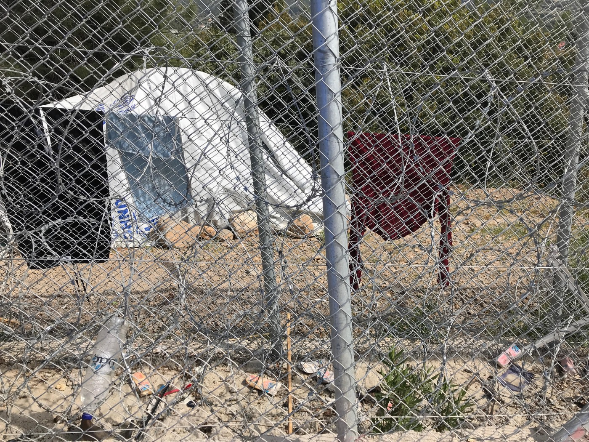
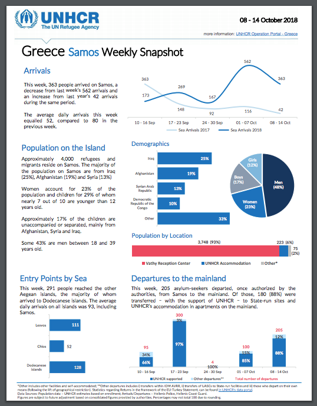
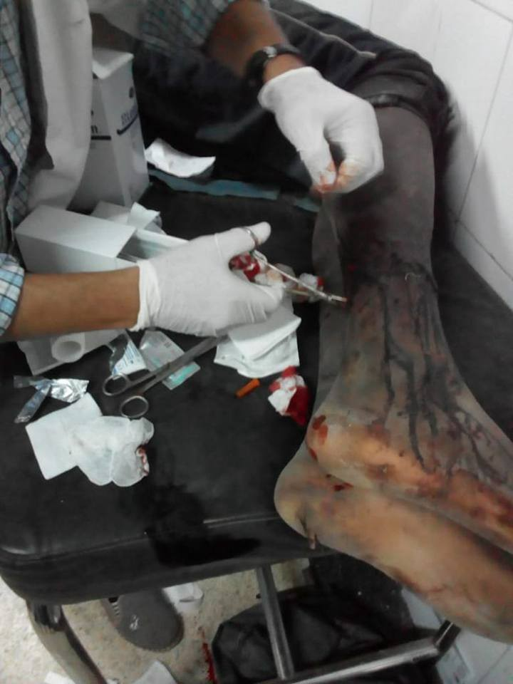
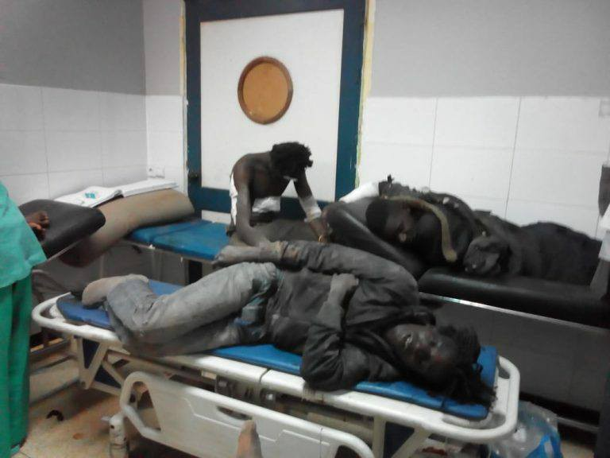

### AYS Weekend Digest 20–21/10/18: Starvation on Samos
#### Refugees are being denied food in the Aegean camps as overcrowding worsens\.

A tent outside of the camp on Samos\. Photo Credit: AYS
### Feature

Many refugees are going hungry on the island of Samos\. There are women and children who have barely eaten for days\. It now takes an average of five hours in line in the camp to get a meal, and even that does not guarantee getting food\. Even after that time, food often runs out and people are sent away\. For those without the means to buy their own food, starvation is becoming a reality\.

The camp is massively overcrowded, and authorities have not made the minimum effort to ease the conditions\. Transfers are happening from the island, but still at a rate that is considerably lower than the number of new arrivals\. Most people who arrive on the island these days are not given a tent — some are not even given a sleeping bag or blanket\. There is no longer any space for people within the confines of the camp, so people are camping on the hill, between trees and wherever they can find space\. Many people have been living in awful conditions on this island for over a year\. As one young refugee living in the camp wrote, _“Samos took my strength from me\. Every day I think and think and I think I turned into a crazy man\. I feel that my life is destroyed\.”_

According to the latest figures made available by the UNHCR, there are currently 3,748 people living in the camp, but some people working on the ground have cast doubt on these numbers, claiming they could be much higher\. Certainly the numbers are higher as of today, with a week of many new arrivals on the island\.

At the moment, there is simply not enough food being sent to feed all of the people in the camp\. Considering the massive resources and funding that the UNHCR has, and the money sent to Greek authorities by the EC, this is beyond outrageous\.

This is not only the case on Samos — similar reports are coming from Lesvos, that people are being denied food after waitng in line for hours\. How can the UNHCR and Greek authorities sit by as families are literally starving?
### Syria
#### Turkish Troops Steal in Afrin

In the area surrounding Afrin the olive season has begun\. For the remaining Kurdish people who have not yet been driven out or killed by Turkish forces, this is not necessarily welcome news\. [Turkish forces are stealing from farmers](http://www.syriahr.com/en/?p=105024&fbclid=IwAR1yum5ha-rgC8NveRIRXdpmwMgA8qiQa13ylKQF1-ON0VezYByBUEAg33Y) in the area, and demanding outrageous taxes of 30% or more, according to the Syrian Observatory for Human Rights \(SOHR\) \. In at least one case, Turkish troops have kidnapped a local farmer and are demanding a ransom for his return\.
#### Syrian Intelligence Forces Carry out Arrests in Ghouta

In East and West Ghouta, Syrian security forces have been carrying out operations over the weekend and taken in dozens of people, according to SOHR\. It is believed that many of these people were kidnapped to be forcibly conscripted into the army\.
### Morocco

According to the Moroccan Association for Human Rights \(AMDH\), 30 people who crossed into Melilla on Friday were denied the chance to apply for asylum and forcibly returned to Morocco on Saturday\. Among the people returned were 4 women and 4 children\.

](assets/f4fac652c0d3/1*rtbhaLe5n-KkJ6Of1I_F1Q.jpeg)

People waiting to be forcibly returned to Morocco\. Photo Credit: [AMDH](https://www.facebook.com/AmdhNador/photos/pcb.2203704493175147/2203704346508495/?type=3&theater&ifg=1)

AMDH reported on Saturday that the body of a sub\-Saharan migrant woman was found by fishermen at Amejaou Beach \(40 km west of Nador\) \. The group stated, “death, arrests, violence, deportations and refoulement are only the consequences of the migration policies agreed between Europe and Morocco\.”

Moroccan authorities are arresting migrants on a mass scale, and often keeping them locked up for as long as a month at a time\. According to those who have spent time in these migrant jails, people are often crowded into small cells, and even denied food for days on end\. [A video](https://www.facebook.com/AmdhNador/videos/vb.1493677674177836/719254971793041/?type=2&theater) was recently released taken from inside one of these jails, showing an extremely overcrowded cell\.
### Sea
#### Alarmphone Call Log

The Alarmphone sea rescue group reported some of the operations they were involved in over the past week:

> 18/10/2018 
 

> \- The shift team was alerted to two groups of people stranded on Chios\. The first group had 40 people, among them 9 children and 12 women\. The other had 25 people onboard\. We learned later on that the 2 groups were brought to the port by FRONTEX\. 

> 19/10/2018
 

> \- A boat with 36 people left Morocco from Bouyefar and arrived in Spain safely\.
 

> \- We were also alerted to a boat near Chios that was rescued by the Greek coastguards\. 

#### The Sea\-Watch 3 is Free\!

From Sea\-Watch:

> After more than three months of unlawful detention the Sea\-Watch 3 received permission to leave the port of Malta this morning and is now on its way to Spain\. There she will be made in good shape again and prepared for upcoming tasks\. Thank you for your support in the last months\! Solidarity is our only weapon\! 

### Melilla / Spain

On Saturday, over 200 people attempted to cross over the heavily fortified fences surrounding the Spanish enclave of Melilla\. [One person died](https://www.facebook.com/Caravana.AF/posts/2251686388396152?hc_location=ufi) during the attempt, according to authorities, of a heart attack\. At least three other people were injured\. According to AMDH, “The number of deaths in the ranks of migrants who have attempted the crossing today can rise, given the severity of the injuries found among the 20 migrants received at Nador hospital\.”

 \. “This is the result of the barriers built between Melilla and Nador
Most of the injuries in the ranks of migrants received today at nador hospital were caused by these sharp steel blades\. Yet the Spanish Prime Minister said he wanted to eliminate these sharp barriers\. While we are waiting for this to happen, migrants suffer: one dead and 20 injured on the Moroccan side, 4 of whom are still in treatment\.”](assets/f4fac652c0d3/1*6fNSuoaC8kxJz-FVfhGZ1w.jpeg)

Photo Credit: [AMDH](https://www.facebook.com/AmdhNador/posts/2204211723124424) \. “This is the result of the barriers built between Melilla and Nador
Most of the injuries in the ranks of migrants received today at nador hospital were caused by these sharp steel blades\. Yet the Spanish Prime Minister said he wanted to eliminate these sharp barriers\. While we are waiting for this to happen, migrants suffer: one dead and 20 injured on the Moroccan side, 4 of whom are still in treatment\.”

Photo Credit: AMDH

Photo Credit: AMDH
### Italy
#### “Serious Problems” in Detention Centers

Four pre\-deportation detention centers were found to have “serious problems” when visited by the national guarantor for prisoner rights\. According to a report released this week, the detention centers were totally barren, without any “communal spaces” or furniture in many cases\. In response to this, the Italian Interior ministry blamed refugees for their own mistreatment, claiming that their efforts to provide acceptable accommodation were “often thwarted by the continuous and violent behaviors of the guests to the detriment of the premises and furnishings, with direct negative consequences on their own living conditions\.”
#### The Italian Court does not bring charges against Salvini for blocking refugees

The Italian Court of Ministers decided not to bring any charges against interior minister Matteo Salvini for his actions between August 15 and 20, when he blocked an Italian coast guard ship from disembarking people who had been rescued\. Now the prosecutor’s office in Catania will take on the second part of the case, which will determine whether any crimes were committed from August 20 to 26, when the ship was docked in Catania but the refugees were held as political hostages on board\.
#### The End of Baobab Camp in Rome?

Volunteers from [No Name Kitchen](https://www.facebook.com/NoNameKitchenBelgrade/?__tn__=%2CdkCH-R-R&eid=ARDaM8gZhORxDOsGdT2Q2Q08FohXVy8kbbtoFimW3eQC1jB45b1uk69_8E_TORb0eJU8FQ4KuMW7ODbv&hc_ref=ARTtjcP2eS89LmOpFrerzKX5GGkF2tJuEeOi6LiiNTbKGRTeg2R4Qv9_vfGUxwFMY2E&fref=nf) have announced that the end of the “Baobab Camp”, located in a park in Rome, seems imminent\. According to [No Name Kitchen](https://www.facebook.com/NoNameKitchenBelgrade/?__tn__=%2CdkCH-R-R&eid=ARDaM8gZhORxDOsGdT2Q2Q08FohXVy8kbbtoFimW3eQC1jB45b1uk69_8E_TORb0eJU8FQ4KuMW7ODbv&hc_ref=ARTtjcP2eS89LmOpFrerzKX5GGkF2tJuEeOi6LiiNTbKGRTeg2R4Qv9_vfGUxwFMY2E&fref=nf) :

> This last month we have continued cooking daily, we have brought 2000 liters of water a day, as well as many other tasks that arise in the day to day of life in the field\. This week has been very hard, because we are living with daily repression by the police, and recrimination of the neighbors of the area in which we fill the water tank, who accuse us of being ‘stealing’ water from the public source\. In addition, the pinnacle of this situation has been the construction of a fence of more than 1 km that surrounds the whole field, giving the feeling of living in a prison in the middle of the city of Rome\. The great Salvini has already made a decision and the hundreds of people living in the field must seek life on the streets of Rome, just when winter comes and the difficulties that entails\. 

> We will continue here and we will continue to do what we know best: try to contribute something good and be with them in these moments of great uncertainty\. 

### Greece
#### Islands
#### New Arrivals \(figures from Aegean Boat Report\)
#### 20\.10

Three boats arrived on Lesvos in the morning, carrying a total of 112 people\.

One boat arrived on Samos, carrying 40 people\.

One boat arrived on Kos, 32 people\.
#### 21\.10

Two boats arrived on Lesvos north early in the morning, the first carrying 9 people and the second 25\.
#### Police Officer suspended after abusing elderly woman in Moria camp

A Greek police officer who was [caught on video](https://www.facebook.com/nobordersnetwork/posts/1965635023504380?hc_location=ufi) shoving and verbally abusing an elderly woman who was waiting for a meal in the Moria camp on Lesvos was suspended over the weekend\. Four of his colleagues who can be seen in the video looking on without trying to stop him were also suspended\.

The woman had been waiting in the food queue in the camp for over three hours, as has become the norm in many of the Aegean camps\. She got near the front of the line, only to find out that food was “finished”, and she would have to go hungry until the next meal\. When she asked for her food, the police officer grabbed her walking stick and threw it away, and began to insult her with digusting vulgarities\. “F\* \*k off\! F\* \*k off\! Sh\*t\-Oldie\! Get off\! Lizard, you lizard\! I’ll stick it in your a\* \*, got it? Sh\*t\-Oldie\!” the officer can be heard yelling in the video\.

The name of the police officer has not yet been released\.

The Iris Center on Chios is looking for volunteers for their ongoing work supporting refugee families\. They are looking for people who can make a minimum commitment of one week\. Contact iriscentervolunteers@gmail\.

Volunteers on Chios are gathering jackets for the winter, you can contact [Jenny Kali](https://www.facebook.com/jenny.kali.1?__tn__=%2Cd*F*F-R&eid=ARCrS6HB-L8RLPdJonk5BUjjhES8fPdCXMWok1SM0GjEqMlwxsszkgbfxBZk0pQACzqsjI9ezPYSrNHQ&tn-str=*F) to donate\.

 \. “A female refugee from Afghanistan’s Kontoúz is cooking with her daughter at the impromptu camp outside the hot spot of Mória\. They have lived in the last 2 months of the summer heat with minimal access to running water, toilet and electric\.”](assets/f4fac652c0d3/1*fFe3fUz05y85WYzNhuOXJQ.jpeg)

Photo Credit: [Giorgos Moutafis](https://www.facebook.com/giorgos.moutafis.5?__tn__=%2CdCH-R-R&eid=ARAhLNUL38da8quwE7RuTMTQgcWUDT5vyaMjcrPcSZ893ltPzn2QwavkfM_4qS0PSBm05jQQseFjMCOz&hc_ref=ARQTpY8sAmf27jC_p4pwDfYEcgQHGN37G6sS-bYraRMJT1kOrLCmhQqEua2fwE7ay4I&fref=nf) \. “A female refugee from Afghanistan’s Kontoúz is cooking with her daughter at the impromptu camp outside the hot spot of Mória\. They have lived in the last 2 months of the summer heat with minimal access to running water, toilet and electric\.”
#### Mainland
#### Thirteen injured in car crash after police chase

Thirteen people were injured in a crash on the old Kavala Thessaloniki highway in Northern Greece on early Sunday afternoon\. At least two of them are currently in a critical condition\. The car crashed when it skidded off the highway while trying to escape from police\. Last week, eleven people were burned alive in a similar accident on almost the same stretch of road\.
#### Corruption in Deportation Services

A [report released this week by Deportation Monitoring Aegean](http://dm-aegean.bordermonitoring.eu/2018/10/20/deportation-as-a-business-model/?fbclid=IwAR0hCel7NRanpAx7C04t_gejG19r3-FxFUJMCT31hkyXEGIkkf-wUSRlK8A) showed a shocking level of corruption in private deportation services contracted by Greek officials\. For some, deportation has become a very profitable business\. Billions of Euros are disappearing into “fast\-track” contracts with almost no oversight\. Among the findings in the report:

— More than 25,000 Euros spent to charter buses;

— Around 12,000 Euros spent for every ferry used\.

City Plaza in Athens needs school supply donations, you can contact them [here](https://www.facebook.com/sol2refugeesen/?__tn__=%2CdkCH-R-R&eid=ARC7VvyTUgzZWyGAAaZakBNiMDSU_nLS7sWNhrHTb3jtTVUW4oECR7lN0aQKGubOdRL6xUVeNOGMtLQF&hc_ref=ARTgHjIm2lblANEPyjnzAkTvYSwmjt6VlrCjeANa9lxnrZUBq0G729ZvABkua91K2o0&fref=nf) \.

The FORGE nonprofit is helping refugees make Skype calls to the Asylum Office to schedule their interviews, a list of their locations around Athens is below\.

CARITAS SOCIAL SPOT
Rene Pio 2, Neos Kosmos, 117 44, Tel: 213 090 9940
\- By appointment
\- All languages

AFGHAN COMMUNITY IN GREECE
Solomou 23, Exarchia, 106 82 , Tel: 210 881 4900
\- By appointment
\- Farsi, Dari & Pashto only

BRIDGES HUMANITARIAN INITIATIVE
Vilara 2, Metaxourgeio, 104 37 , Tel: 210 520 0894
\- Arabic & Sorani only

KLIMAKA
Dekeleon 50, Gazi, 118 54 , Tel: 210 341 7162
\- By appointment
\- All languages

Google Maps location list available here:
[https://goo\.gl/maps/N9M8VUEqNpJ2](https://l.facebook.com/l.php?u=https%3A%2F%2Fgoo.gl%2Fmaps%2FN9M8VUEqNpJ2%3Ffbclid%3DIwAR1niJbTGmiITaqonWvgg8kdpP3VkJSazES5PVRBoUbZcUpFFnFs5wa4xhI&h=AT34-C1BrzgYDlTQcoVRZu3WcdTRM6Ydul0C7ij2QB2vF7vR2UMzuompb2_xl7xeBErSQqARFVcUDRj8yP_jR825OBdOw7bRRpXDyfxE8KKzT5Dpr7PgB7ZkfBZVpJreLNxxC8tyUXQt3PtNX2HjWis7j6nAYA)

DocMobile is looking for medical volunteers:

> We are working all over Greece to help medically support refugees\. With winter approaching we need volunteers from many specialities of Doctors, Nurses, Physiotherapists, Pharmacists and Paramedics to come and give their time and experience\. If you even have 2 weeks to spare get in contact and come and be apart of an amazing team and project\. Contact [here](https://www.facebook.com/docmobile.org/?__tn__=%2CdkCH-R-R&eid=ARC2i4plsG7XRqlCz34XWNxGIlS-loCvGvASD06IpEs4YaGRrsGaqNoKK5nV87XCI3YWmLQMLfxUCYPg&hc_ref=ARRcv3soly841kpK8w8Yd2JadKlllBKafNg6GcC8FluDn0GL-SszIqeAfAJPcP-t7Us) \. 

From Lifting Hands International:

> The average winter temperature in Serres hovers just above freezing, with the humidity and snow making it feel even colder\. The population of Serres camp has more than doubled in the last 4 months, turning the LHI Refugee Center into a winter crisis response center\. We desperately need funds, please consider supporting us [here](https://www.facebook.com/liftinghandsinternational/posts/722940464740380?hc_location=ufi) \. 

### Serbia
#### Visa\-Free travel ended for Iranians

As AYS reported earlier this week, Serbia has abolished visa\-free travel for Iranians to the country, due to the number of people coming from Iran and attempting to claim asylum or cross into the EU\. While Iran may not have the violence of some neighbouring countries, there are many people seeking to flee for political reasons or because of LGBT persecution\.

According to Serbian officials, over 1,100 Iranians have attempted to apply for asylum in the country since the visa\-free travel policy began\.
### Bosnia
#### Protest in Bihac

Over the weekend, several hundred people from Bihac went out on the streets to protest the treatment of refugees in the area\. They were demanding a solution from the government, and also from the INGOs such as the IOM and UNHCR, to provide for the many people in the area\. Citizens are also asking what happened to the 7 million Euros donated to Bosnia to deal with the crisis\. It is not clear who is in charge of this money, the IOM and UNHCR, or state government\.

There are not reliable statistics about the total number of refugees, but it is estimated that several thousand people are in the region of Krajina, mainly in the cities of Bihac and Kladusa\. Due to the slow response from the government and a lack of the organization from the INGOs present in Bosnia, most people are being left to live in the streets\. With the arrival of winter, the situation is getting worse, and tensions are very high\.

In Bihac, there is one improvised camp which does not have minimum living conditions\. Nevertheless, IOM, the local Red Cross, as well as DRC and UNHCR are claiming that this as a place where people are in fact receiving care\. Many citizens of Bihac are demanding that the solution is found as soon as possible\.

Unfortunately, what began as a peaceful protest against the government and those responsible turned into threats and a blockade of the bus and train station, and demands that no more people on the move are allowed in the city\. Some people even called for violence against refugees in Bihac\.

Cars of Hope, which is currently working near the Bosnian\-Croatian border, is working to construct a small container so doctors can treat refugees, and to build container shelters for refugees during the coming winter\. They need support for these projects, donation information [here](https://www.facebook.com/carsofhopewtal/posts/1987829921515906) \.
### France

The Refugee Women’s Center in Dunkirk is looking for short term volunteers to help with sorting their donations\. You can volunteer for as little as a week or weekend\. Contact them [here](https://www.facebook.com/refugeewomenscentre/posts/526811087744526) \.
### General

■■■■■■■■■■■■■■ 
> **[Jan Egeland](https://twitter.com/NRC_Egeland) @ Twitter Says:** 

> > Int'l solidarity sinks to new low: 54% fewer refugees were resettled in safe countries last year than in 2016. At this rate, it will take incredible 18 years to resettle all refugees on lists and in need of protection through resettlement. https://t.co/iZ912bnK4Z 

> **Tweeted at [2018-10-19 09:16:59](https://twitter.com/nrc_egeland/status/1053213412518432769).** 

■■■■■■■■■■■■■■ 

A new translation service has been launched called Sona Translate, and they are looking to hire refugees\. You can apply at jobs@sonatranslate\.com

**We strive to echo correct news from the ground through collaboration and fairness\.**

**Every effort has been made to credit organizations and individuals with regard to the supply of information, video, and photo material \(in cases where the source wanted to be accredited\) \. Please notify us regarding corrections\.**

**If there’s anything you want to share or comment, contact us through Facebook or write to: areyousyrious@gmail\.com**

_Converted [Medium Post](https://medium.com/are-you-syrious/ays-weekend-digest-20-21-10-18-starvation-on-samos-f4fac652c0d3) by [ZMediumToMarkdown](https://github.com/ZhgChgLi/ZMediumToMarkdown)._
