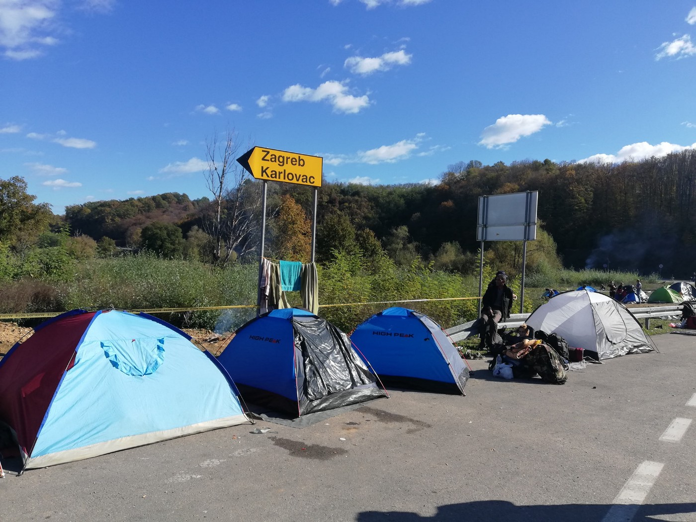

### AYS Daily Digest 24/10/2018: People call for borders to open

_Around 250 people gathered at the border crossing between Bosnia and the EU // People brought from Sarajevo to n_ e _w Ušivak camp//Refugees from Grande\-Synthe brought to gyms and other temporary shelters//French police continue to push back minors to Italy//_

In the front of the fortress Europe\. Photos by AYS
### Feature

**Around 250 people gathered yesterday at the Maljevac border crossing near Velika Kladuša\.** The protest asked for the border to open, but once again it stayed sealed and protected by overly militarized police forces on the side of the EU\.

Around 10 a\.m\., a group of people managed to break the police lines, just to be pushed back\. They tried again, and the police used tear gas to push them back\. Two persons were slightly injured\.

This is the third day and second night that people are at this border crossing which is now closed for traffic\. Some people came here led by rumors that the border would be open\. Others came to demand the opening of the borders\. AYS spoke with groups of Palestinians from Gaza who told us they are getting tired of traveling for such a long time, and they do not see any future\.

“I cannot go back to Gaza, and they do not want to let me go to Europe\. I do not know what else to do\. I do not know how I can continue with my life,” F\. told an AYS volunteer\.

Smugglers are asking 5000 Euros from Kladuša to Zagreb\. Photos by AYS

Like him, many of the people we spoke to were desperate\. In Bosnia, they are left to live in the most precarious life conditions, with no place to sleep, not enough food, only occasional and basic medical help, while the government is avoiding issuing the proper registration for all the people who entered the country, over 19,000 so far\.

_New born babies are not being registered\. Children are not going to school, are not being vaccinated, while unaccompanied minors traveling alone do not have much needed protection\._

The IOM and UNHCR are present, but their engagement is not much help\. Today they did not even come to monitor protests at the border\.

Over 200 people stayed overnight near the border\. When an AYS volunteer asked them why they would stay there if they know that the border was not going to be opening, they simply told us “because there is no difference between sleeping on the ground at the nearby muddy, improvised camp or near the border”\. Indeed there is not\.

Meanwhile, tensions among people abandoned in Bosnia and among the local population who have shown a lot of solidarity so far, have begun rising, and it is hard to predict what the next day will bring\.

### Messy evening in Sarajevo following the opening of the new Ušivak camp

The camp, managed by IOM for around 270 people, is already full, which wasn’t expected in the morning\. Communication between the camp management and police is not functioning as it should\.

About 160 people were sent back from Bihać and taken to Hadžići, and 90 others were picked up at the train station during dinner distribution to be brought to the new camp\.

The events at the train station started in a peaceful way, people hanging around the train station waiting for food were put in vans, but at around 9:20–10 p\.m\., the police became much more hostile towards the refugees and volunteers at the site\. People were more or less forced onto the bus\. Tensions rose and some of the policemen shouted at volunteers who confronted them while they tried to force people onto the bus\.

When the bus that left from the train station arrived at the camp, families were let in, but single men were further transferred to the Delijaš asylum center, which is remote, in the mountains, and has no phone or internet access\.

**This evening’s incidents seem to be caused by a sudden decision to clear the streets of Sarajevo\.** Regardless of the totally unexpected developments during the day and evening, volunteers cooking in the camp estimate that they served 270 meals\.

Regarding the camp earlier during the day, no health screening was in place as a doctor wasn’t on site\. Whatever issues this could bring is yet to be discovered, but it is likely that people have either scabies or body lice\.

Many people were also taken from Bihać, a city at the border with Croatia, to that camp, which is a five\-hour drive away\.

Police also stopped the train from Sarajevo to Bihać, while people who were inside, refugees, were prevented from leaving the train for hours\. In the end they were sent back to Sarajevo\.

Police in Bosnia are now also demanding that taxi drivers ask people for their papers if they look like refugees\. If the taxi drivers refuse, the police threaten that they will be arrested and charged as smugglers\. It is absurd, since by law nobody but the police in Bosnia has the right to request to see anybody’s ID\.

The Ušivak camp when it was still empty\. Containers were brought in from outside of Bosnia, one of the poorest countries in the Europe where people produce montage wooded houses\.
#### Morocco
### Fifty\-five migrants deported from Spain to Morocco, detained in Nador

The Association Marocaine des Droits de l’Homme reports that a summer centre has been transformed into an “illegal detention centre” for the 55 migrants deported from Spain to Morocco\. The 55 were part of a group of 208 people who managed to breach the fence at the border with Menilla\. The NGO further says that representatives of African embassies, including Guinea, Senegal and the Ivory Coast, visited the centre to identify migrants and deport them\. Many people are injured as a result of trying to cross the border\.
#### Greece
### People arrive at Lesvos, Chios and Samos

Photo by Salvamento Maritimo Humanitario\. 20 people from Iraq arrived on Chios with this boat\.

The [Aegean Boat Report](https://www.facebook.com/AegeanBoatReport/) says four boats carrying 159 people arrived in the night from Tuesday to Wednesday\. One boat landed n Lesvos with 46 people, a second with 20 people arrived at Chios and two boats arrived on Samos with a total of 93 people\.

A boat with 16 people arrived at Lesvos on Wednesday night and another with 70 people arrived on Thursday morning\.
#### Italy
### Unaccompanied minors pushed back to Italy

[The Macron\-Salvini duel hardens at the border in the run\-up to the European election](https://fr.reuters.com/article/topNews/idFRKCN1MY1WC-OFRTP) \. Interior Minister Salvini repeated his attack on the French management of migrants at the transalpine border, implying that France is aiming to destabilise his government\. [_Ansa_](http://www.ansa.it/english/news/2018/10/24/france-denies-pushing-migrant-kids-back-into-italy_cbd94568-7aa9-4fe7-aa9b-a9aacb19f428.html) and [_El Pais_](https://elpais.com/internacional/2018/10/21/actualidad/1540131857_376438.html) report Italy is now reinforcing controls in the Alps after alleged illegal incursions from French Gendarmerie to leave African migrants there\. French authorities denied unaccompanied minors are being pushed back into Italy when they cross the border\. However La Republica reports that two minors were again brought back to the border by French police\.
#### Macedonia

[Solidary Wheels](https://www.facebook.com/solidarywheels/?__tn__=%2CdkCH-R-R&eid=ARARSOXaMXtgFaCI5_9FVrq1ybUz6HO6kbbWXDfcyQkSirQ-vQrHPLYj0bF4ixwmGAF7X7gRFvITV-zl&hc_ref=ARR76aU1b9TzmSk8hnG_US_cZMlKR_qJo_x0jiYUHXW2NnGW98v9RIN7J0K5Bc_97KE&hc_location=group) is reporting from Tabanovci camp that at the moment most of the people aren’t staying there longer than one week, but some of them need to take more time due the serious physical injuries they suffered on the way and need to wait to recover\.

“This is the case of Khaled \(fictitious name\), a 27\-year old man from Algeria\. We give you his testimony: “I left my country to go to Turkey to find a job but unfortunately I didn’t succeed\. That’s when I decided to try my luck in Greece\. I walked for 15 days to get there \(…\) \. I spent short time there and when I saw what the situation was like, I decided to follow the route to northern Europe \(…\) On the way to Macedonia we were hurt by a train \(…\) There were four of us\. Three of us were injured, the fourth died \(…\) When I arrived in Skopje they took me to a hospital, where I stayed for ten days \(…\) I had fractures in my left arm, my right leg, and bad contusions on my back \(…\) When I left the hospital the Red Cross Service took me to a camp which is on the border with Serbia, where I have been for more than a month and a half \(…\) I thank God for being alive \(…\) I am waiting to recover and as soon as I am discharged I will ask for voluntary deportation to return to my country with my wife and daughter \(…\) I have no hope in Europe”\.
#### France
### Refugees brought to temporary shelters

The plan was to bring approximately 1,800 people to new shelters with the evacuation of the Grande\-Synthe camp\. In reality, only 1,297 were brought to places to sleep, most of them only temporary, according to [France 3](https://france3-regions.francetvinfo.fr/hauts-de-france/somme/migrants-grande-synthe-maire-moreuil-rassure-ses-administres-1563788.html) — the mayor of the city of Moreuil for example said that the 60 people he would be hosting would be staying in gymnasiums “until the end of the school holidays”\. It remains to be seen what will happen to them after that\.

On the occasion of the two\-year anniversary of the demolition of the Calais ‘Jungle’ camp, Refugee Rights Europe and Help Refugees released a new [report](http://refugeerights.org.uk/wp-content/uploads/2018/10/History-Of-Calais_Refugee-Rights-Europe.pdf) summarising the detrimental human rights situation which has been unfolding in northern France over the past few decades\.

The report highlights many years of human suffering, characterised by precarity, rough\-sleeping, dangerous and unauthorised border\-crossings, and excessive police violence\. It also notes the constant evictions and temporary accommodations, that do not lead to any lasting solution for refugees\.

Our friend Abdul Sabur has an exhibition on in Paris, a city where he has been living after years of living on the refugee route, including in a barracks in Belgrade last winter\. He is a great photographer\. If in Paris, this is a must see\.

#### General
#### Asylum lottery continues for Afghan nationals

The AIDA database managed by ECRE has compiled statistics on the recognition rate of Afghan asylum\-seekers between January and September 2018\.

**We strive to echo correct news from the ground through collaboration and fairness\.**

**Every effort has been made to credit organizations and individuals with regard to the supply of information, video, and photo material \(in cases where the source wanted to be accredited\) \. Please notify us regarding corrections\.**

**If there’s anything you want to share or comment, contact us through Facebook or write to: areyousyrious@gmail\.com**

_Converted [Medium Post](https://medium.com/are-you-syrious/ays-daily-digest-24-10-2018-people-call-for-border-with-croatia-to-open-1f89ada99b67) by [ZMediumToMarkdown](https://github.com/ZhgChgLi/ZMediumToMarkdown)._
