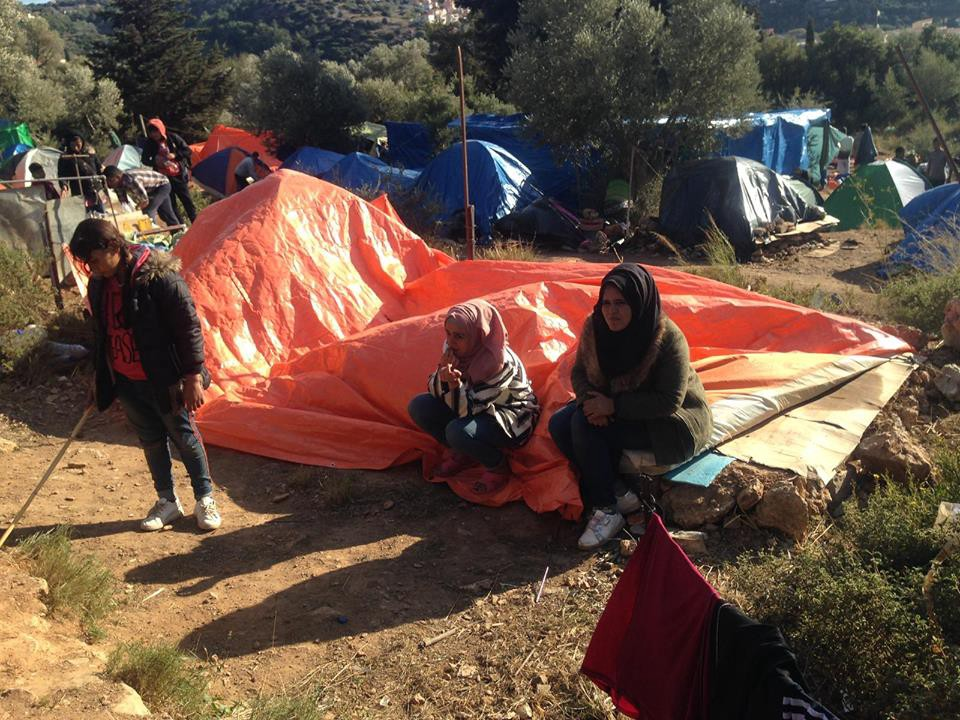
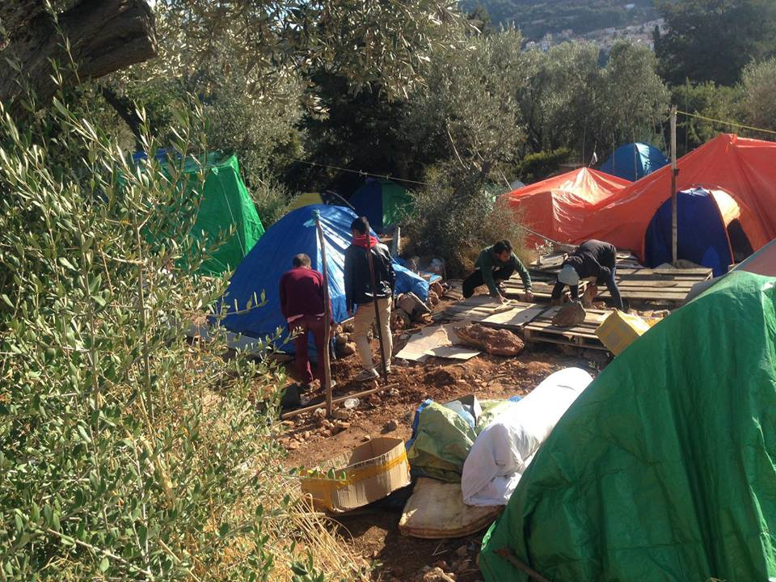
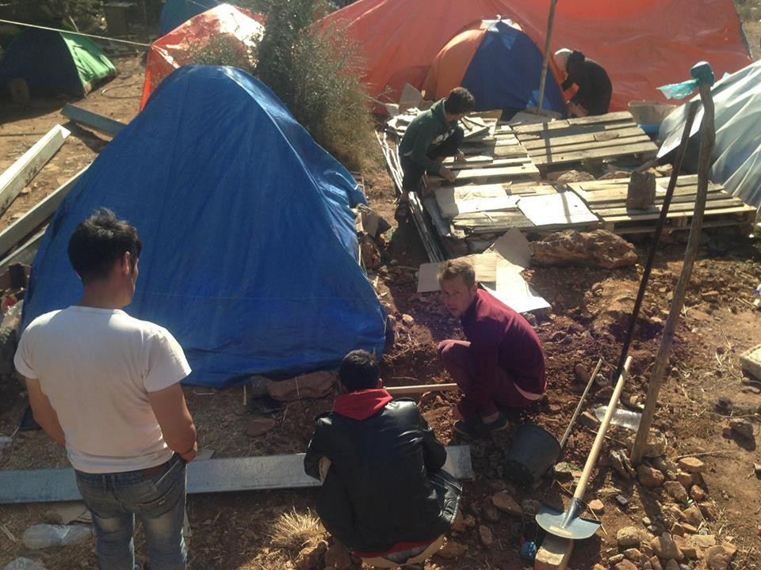
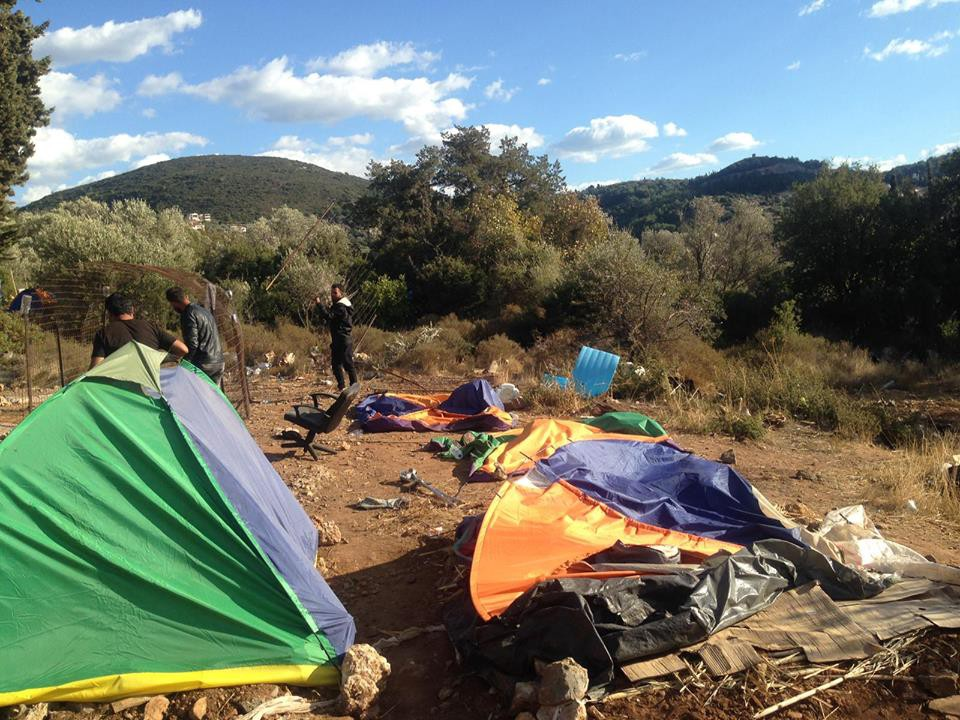
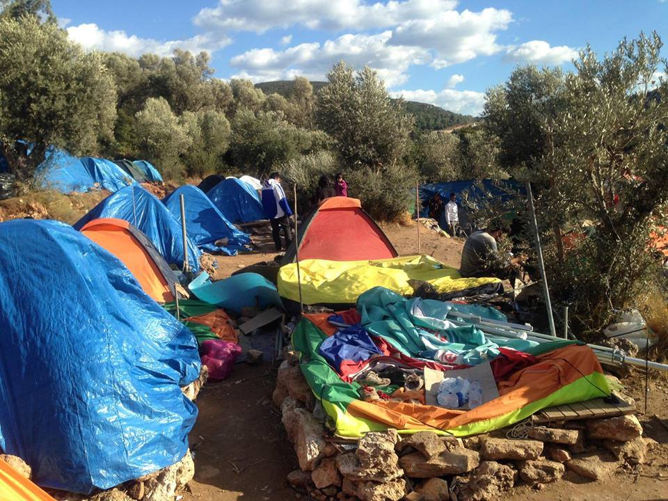

### AYS Daily Digest 25/10/18: Medical racism on Chios

_Turkey deports Syrians // New arrivals on Samos// Conditions worsen on Samos // Boat sinks in Evros region, children feared dead // Suicide in Vercelli // Tunisian fishermen freed // Police raids in Germany // Protest at Danish detention center // And more news…_

25/20/18\. Refugees on Samos after their tents were knocked down by heavy winds\. Photo Credit: AYS
### FEATURE

\(This account of a recent incident was written by a long\-term volunteer in Chios, where refugees outnumber official “capacity” almost threefold, and where medical care is woefully inadequate\. \)

In mid\-September 2018, B, a young African woman in her seventh month of pregnancy complained of stomach pain and felt that her water might have broken\. Upon her request, she was examined by the midwife on duty at Vial Camp, Chios\. An appointment with the gynecologist of the town hospital was arranged for the following week, a full seven days later\.

The following day the discharge continued, and B noticed vaginal bleeding\. The midwife reassured B that the baby was “fine\.” Nevertheless, she was then taken to the hospital, where doctors reiterated that the baby was healthy and had B listen to the heartbeat\.

B was left waiting in the hospital for a long period of time before she was re\-examined\. When she finally was, she describes everything as suddenly moving very fast, with seeming panic setting in among the medical staff\. She was told that she needed to be rushed to surgery, and that the child had been lost\.

Later B woke up in a room that she found herself sharing with another woman and the woman’s healthy newborn\. No one informed her as to what had happened\. When she asked about her child, a nurse brought her a round blue plastic basin containing a tiny body floating in a bath of blood, with the placenta still attached\. B held the dead baby’s hand and noticed an injury to its forehead\.

Two days later, B was discharged from the hospital\. She was given no explanation for this traumatic loss\. When she asked for her medical file, she was firmly told that medical files were not provided to patients in Greece \(“as it is too expensive”\) and that medical records could only be forwarded among medical staff\. When she asked staff what had been done with her baby’s body, all answered that they did not know\. Psychological support was offered to her, starting a month later\.

B was not allowed to have information or closure, nor to properly mourn her loss\. An observant Christian, she would have liked a small religious burial ceremony — but she was not given that opportunity\.

Being a black refugee in Greece often translates into an added layer of difficulty and xenophobia to deal with\. Several refugees of African origin have reported being insulted, being denied access to shops, and in a few instances, being stoned by the local population\. On October 18th, the African community at Vial camp staged a peaceful demonstration to protest the fact that recently arrived refugees of Middle Eastern descent were moved to containers while African refugees waiting longer were left living in tents\.

Many African women report being mistreated in the gynecology ward of the hospital\. One week before B’s miscarriage, another African woman also lost her baby in similarly painful circumstances\. Several women are seen in the gynecology ward for infections caused by unsanitary camp conditions; they are then prescribed a medication that is not available in the camp — and that they cannot afford to purchase in a pharmacy\. All are terrified of giving birth on the island of Chios\.

Post\-script as of today: B and her older child are now housed in an apartment\. B is not doing well emotionally, and a volunteer is in the process of arranging a Skype session with a sympathetic priest in another country\.
### MOROCCO

[59 people](https://twitter.com/alzoubeidi/status/1055213823924289542?s=21&fbclid=IwAR0J0mrCkHQB9TU8EkYA2HscmREcHgDHS1vqXkFW0cPGVYHzzq2hF4RgW3Y) were taken in by the Moroccan Royal Navy off the coast of Nador today\.
### TURKEY
#### Turkey deports refugees to Syria

According to sources on the ground, 25 Syrians were forcibly deported back to Syria from the EU\-funded Oğuzeli detention center yesterday\. According to Turkish authorities, over 250,000 Syrians have “chosen” to return from Turkey\. However, according to many refugees, they were forced to sign “voluntary return” documents when threatened with jail time by police\. The UNHCR has only overseen a small portion of these “voluntary returns” — [approximately 12,000 in total](https://www.theguardian.com/global-development/2018/oct/16/syrian-refugees-deported-from-turkey-back-to-war?fbclid=IwAR3a3V1xPVBVgKP1Mjh5IroAB6ENG8GKGBpRov3RnaR9g60MvAXGRoPPX8c) — and gave over all oversight of the process to Turkish authorities last month\.
#### Greece and Turkey dispute over maritime border

This Tuesday, Turkish officials warned Greece that they would respond aggresively to any attempt to shift the Greek\-Turkish maritime border\. Athens announced earlier this week that it intended to extend its territorial waters 12 miles to the west\.
### GREECE

**Islands**

New arrivals \(figures from Aegean Boat Report\)

> Last night at 23\.30, a boat was picked up outside Eftalou, Lesvos north, by Bulgarian Frontex\. Transported to Skala Sykamineas\.
 

> 16 people 
 

> 8 children 
 

> 2 women 
 

> 6 men 

> Early morning a boat landed in Varia, Lesvos south 04\.30\.
 

> 70 people 
 

> No breakdown available\. 

#### Refugees face hunger and cold on Samos

On the island of Samos, the situation keeps getting worse\. As AYS reported earlier this week, most people who arrive on the island are hardly getting anything from authorities, sometimes not even a sleeping bag\. There is not room left in the cramped hillside camp, and so people are now setting up tents between trees, on the hillside, anywhere they can find\.

Today was a windy day on the island, and many of the cheap tents that refugees bought at a local shop \(since authorities are not providing them\), blew away\. Following this incident, a number of refugees gathered outside of the camp manager’s office to protest\.

After the winds destroyed their tents, people attempted to set up again\. Photos: AYS

Tents destroyed after the winds\.

#### Deportation stopped on Lesvos

[Legal Center Lesvos announced today](http://Deportation Halted: Today, we managed to stop the deportation of a vulnerable individual – after his friends alerted us last minute that he was being prepared for deportation, and through coordination with activists monitoring the deportation. 2 others were also exempt at the last minute. Several others – who had no access to phones, and probably with no lawyer to assist them – were deported to Turkey, where they face certain detention, and likely deportation to their home countries. #closethehotspots #endthetoxicdeal) that it was able to stop the deportation of one man today, with the help of activists\. Several other people, who had no phones, or legal support, were deported back to Turkey\. As AYS and many other groups have been reporting, the practice of deporting people back to their home countries, regardless of how dangerous they are, is becoming more common in Turkey\.
#### Suspected people smugglers arrested on Chios

Greek police on Chios arrested two Turkish citizens this week who attempted to smuggle a 45\-year\-old woman into Greece on one of the luxury yachts that regularly visits the island\. The two accused smugglers were stopped by Greek authorities while they were attempting to leave the port\.

This unusual story of people smuggling underscores a bitter irony about the Aegean islands: while thousands of tourists visit the Greek islands every day, the people who are trying to flee to the EU are denied safe passage\.

**Mainland**

Authorities in the Evros region of Greece are searching for a woman and her two children who went missing after a boat accident\. Police were alerted when an Iraqi refugee reported that his wife and two children, aged 12 and three, fell into the water after the boat they were on capsized\. The man stated that there were about 10 other people on the boat, but it remains unknown if any of them are also missing\.
### BOSNIA

In accordance with the decision made by the police in Bihac area, Una Sana canton, the arrival of more refugees to this part of the country should be stopped in the future\.

Over the last couple of months, over 10,000 people came to this area and the cities of Bihac and Velika Kladusa \(where the greatest number of people are\) do not have the capacity to take in more people\. There are no camps or places to accommodate all of them\. Local authorities are demanding that the state government help them in dealing with the humanitarian crisis, but also to prevent people from coming to this area in order to prevent that situation becomes even worse\. They also asked that the other parts of Bosnia should share the responsibility for the ongoing crisis and take more people in, and that responsible institutions \(such as the IOM and UNHCR\) should speed up the process of accommodating people\.

The new camp was opened on Wednesday near Sarajevo with a capacity of about 400, and it is already full\. Some people who are living in the streets are being taken to the asylum center Delijaš near Sarajevo, where the capacity is 160 and already full\. This camp is far away from the city, and has no internet or phone connection\. In Bihac area, there is one improvised camp run by several international organizations, where even the minimal standard for acceptable living conditions are not being met\. However, this week the IOM started to make arrangements to install containers in the area around the improvised camp without consulting the people in the area\. The protests this week were directed against the IOM too, because of their total lack of colloboration and communication with locals\.

In the meantime, about 150 people are still staying at the Croatian border asking to be let into the EU\. The police today told them that they will have to move soon since the border has now been closed for four days\. They, however, are still staying tonight\.
### ITALY

![Photo Credit: Baobab Experience\. “A few days ago, the Guardia di Finanza \(Italian financial police\) tried to enter the building of Casapound in Rome to evict those living there\. Casapound has been squatting the building in the city center since 2003 with no consequences and the endorsement of authorities through the years, allowing close friends and family members of the militants to live there as well\. When Guardia di Finanza tried to enter the building, the militants told them: “if you enter, there will be a bloodbath”, forcing the militaries to back up\. On the other hand, Baobab is under the threat of eviction for being human\. Their reply here reads: “if you enter, there will be a sea of humanity”\.](assets/8b44be801d30/1*80V8t-SPjyKq4ml0VAJrIA.jpeg)

Photo Credit: Baobab Experience\. “A few days ago, the Guardia di Finanza \(Italian financial police\) tried to enter the building of Casapound in Rome to evict those living there\. Casapound has been squatting the building in the city center since 2003 with no consequences and the endorsement of authorities through the years, allowing close friends and family members of the militants to live there as well\. When Guardia di Finanza tried to enter the building, the militants told them: “if you enter, there will be a bloodbath”, forcing the militaries to back up\. On the other hand, Baobab is under the threat of eviction for being human\. Their reply here reads: “if you enter, there will be a sea of humanity”\.

Tomorrow there will be a general demonstration in Rome against racism, starting at the Piazza of the Republic\. More information is available [here](https://www.facebook.com/events/155785395376127/) \.
#### Nigerian man commits suicide in Vercelli

A 33\-year\-old Nigerian man threw himself under a train in the area of Vercelli \(Piemonte, north\-western part of the country\) when he saw police agents\. He may have been afraid he was going to be asked for a ticket, which he did not have\. He was regularly working as a painter and had a regular humanitarian permit, so it is still unclear why he commited this act\.
Following the death, one high level employee of the National Railways stated that “it is better that someone like him died than another person\.” The statement was published online by a local politician who was standing nearby and overheard him\.
#### Tunisian fishermen freed

The six Tunisian fisherman who were jailed in September this year on charges of “human trafficking,” after they brought a group of people they had rescued off a dinghy to Lampedusa, have been released\. The court found that there was no evidence to support the state’s case against them\.
### SPAIN
#### Rescues in the Alboran Sea

\(From SMH\)

> _Total boats today: 20\. 45h, Alborán: Polimnia rescues 262 people from 5 boats, to Málaga; Spica 3 with 51, @guardiacivil 2 with 33 and Hamal 2 with 69 to Almería and Motril / Estrecho: Arcturus 2 with 10, to Algeciras / Murcia: Mimosa 3 with 44, @aduanassva 1 with 19, Campoamor, 1 with 11, a Cartagena_ 

88 people were transported to Motril today who arrived by sea\. There is no breakdown of the group yet, but among them were many women and children\.

■■■■■■■■■■■■■■ 
> **[asoc.PRODEIN melilla](https://twitter.com/PRODEINORG) @ Twitter Says:** 

> > Ha llegado a Motril la salvamar Hamal. 59 subsaharianos y 29 marroquíes. Mujeres, niñas muy pequeñas.... https://t.co/xCow3eMWHn 

> **Tweeted at [2018-10-25 20:17:28](https://twitter.com/prodeinorg/status/1055553953771986947).** 

■■■■■■■■■■■■■■ 

### GERMANY

A refugee camp in Stephansposching was raided by heavily armed riot police on the afternoon of October 24th, according to a report from [Enough is Enough](http://According to reports from Enough is Enough) \. Among the police were not only Bavarian riot officers but also members of the special forces and support command\. Many of the officers were bearing machine guns and billy clubs\.

The stated reason for their raid was because an Afghani man who had been scheduled for deportation had gone missing\. The police searched all of the rooms of the refugee centre, including the bathrooms\. When they returned for a second search after failing to find the man, a group of people living in the center began to protest\.

The police eventually arrested someone who was acting as a spokesperson for the refugees in the center\. According to eyewitnesses, the man was beaten by 6–8 police officers, who threatened those present not to film them\.
### DENMARK

Refugees living in Center Sjælsmark \(a Danish deportation center\) demonstrated for their human rights outside of the inhumane deportation center\. The protestors released a statement today:

_Today we are demonstrating, because we’re in jail\. And we want to get out of this prison\._ 
_We want our human rights\._ 
_Because they are stripping everything from us here\._ 
_Like the right to freedom, the right to an education\._

_We’re all affected by the situation, mentally and physically\._ 
_Refugees in sjælsmark say we live in Denmark, yet it’s as if we live in Iran or North Korea\._ 
_And they say Denmark a democratic country, and Denmark is part of the EU_ 
_Then why we live in a prison like this, without having commited any crime?_

According to activists, more demonstrations are being planned for the near future\.
### UK

As in most EU countries, asylum seekers are currently barred from legally working in the UK\. According to researchers, due to an inability to work, the average asylum\-seeker in the country lives on just £5\.39 a day\.

Now a coalition of UK organizations are working to lift this ban on working\. You can support their petition here\. [According to the Refugee Women’s Center](https://www.facebook.com/refugeewomenscentre/posts/528814507544184) , one of the groups behind this petition, their joint report shows that allowing asylum seekers to work could benefit the UK economy by £42\.4 million each year\. “Ironically, this is the same amount the UK government pledged earlier this year towards extra security measures around Calais and Dunkirk\.”

**We strive to echo correct news from the ground through collaboration and fairness\.**

**Every effort has been made to credit organizations and individuals with regard to the supply of information, video, and photo material \(in cases where the source wanted to be accredited\) \. Please notify us regarding corrections\.**

**If there’s anything you want to share or comment, contact us through Facebook or write to: areyousyrious@gmail\.com**

_Converted [Medium Post](https://medium.com/are-you-syrious/ays-daily-digest-25-10-18-medical-racism-on-chios-8b44be801d30) by [ZMediumToMarkdown](https://github.com/ZhgChgLi/ZMediumToMarkdown)._
