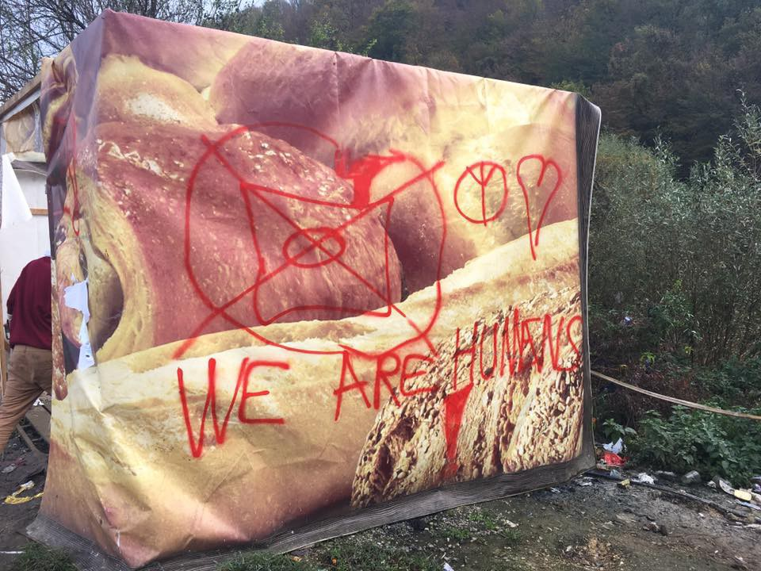
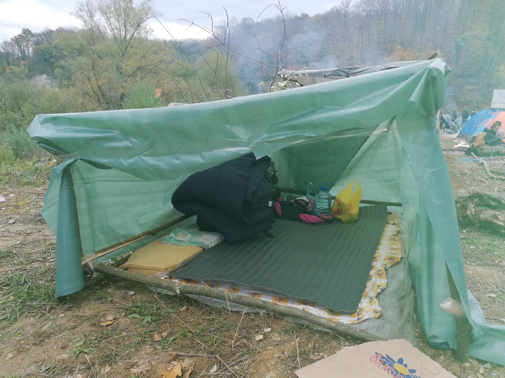
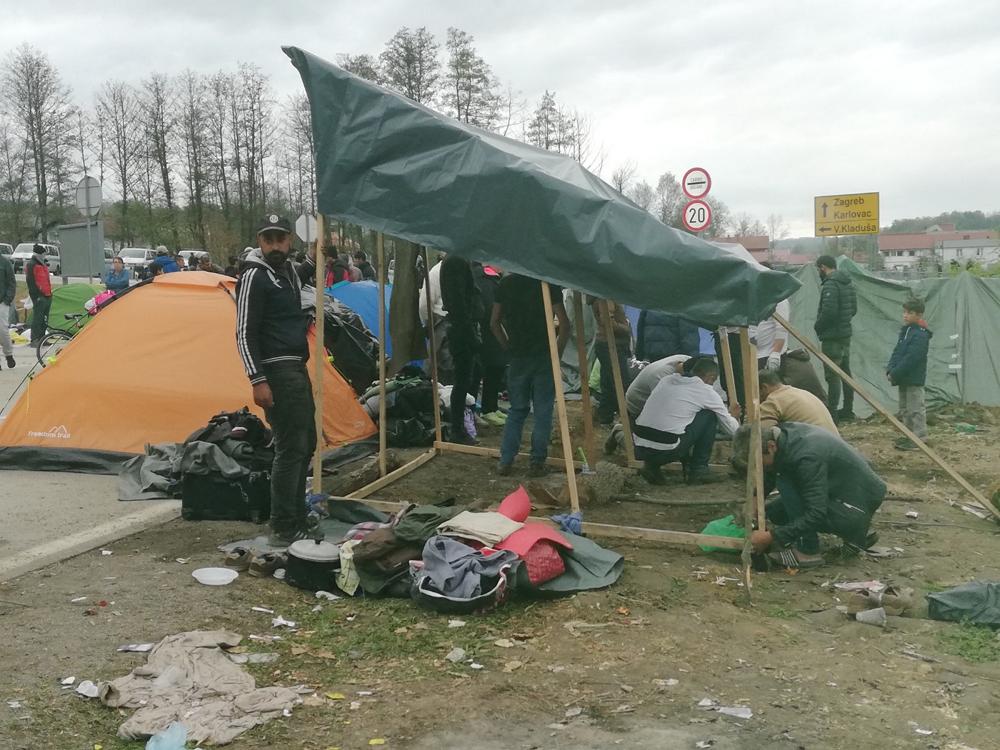
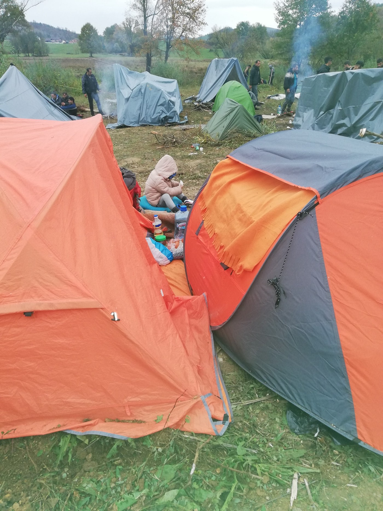

### AYS DAILY DIGEST 26/10/2018: Money over lives: the consistent trend in Europe

_Officials more intent on preserving their reputation \(and funding\) than securing safety for victims in Greece // Updates from Bosnia // EU to spend 160m on “securing” Moroccan route // Over one million non EU citizens were refused entry to or sent out of Europe in 2017 // Opportunities to support people in Italy France, Germany, and Sweden // Finland suspends deportations to Iraq // more…_

Velika Kladusa Photo Credit: UMINO
### FEATURE: Arrivals increased in 2017, but safety and security continues to plummet in Greece\.

_According to Medicins du Monde, the number of people who have arrived in Greece in the first 9 months of 2018 is 17% higher than the same time frame for 2017\. More than half of the arrivals were women and children\. 76% of these were from Syria, Afghanistan, Iraq and the Democratic Republic of Congo\._

■■■■■■■■■■■■■■ 
> **[Stathis Poularakis](https://twitter.com/SPoularakis) @ Twitter Says:** 

> > Check the latest snapshot by @[MdM_Greece](https://twitter.com/MdM_Greece) on the situation on #greekislands and the #health problems faced by #refugeesgr #lesbos #moria  [bit.ly/2RjT53T](https://bit.ly/2RjT53T) https://t.co/loQxky58Mu 

> **Tweeted at [2018-10-26 12:22:38](https://twitter.com/spoularakis/status/1055796847820857344).** 

■■■■■■■■■■■■■■ 

If it’s not evident yet, it appears that all of the tightening of the border restrictions have resulted in little change to people trying to escape dangerous situations\. And yet, the predominant narrative by governments and media doubles down on the idea that the crisis is “over\.”

Although we do not categorize people who clearly have made the decision to undertake a dangerous journey according to “legitimate” and “non\-legitimate” reasons \(i\.e\. “only people from countries where there is active and visible conflict are ‘legitimate’ refugees\)— it’s important to realize that even within this lens, the facts show a different picture from those presented \(that people coming are from “safe\-ish” countries\) \.

And people keep coming — Aegean Boat Report notes 22 arrivals on Thursday…
### MOROCCO

Apparently pleased with its success on collaborating with Libya to find ways to keep people out of Europe, the EU now has agreed to a 160 million euro “emergency funding package” in order to strengthen the Moroccan system of migration prevention\. With the recent horrific news of a Somali man having set himself on fire in a Libyan detention centre, it remains clear that EU officials are more enchanted by the idea of paying off repressive systems than human rights\. Morocco is now the third largest recipient of EU funding for this purpose\.

“Much of that money will go to stepped up border security,” according to Morocco’s chief government spokesman, Mustapha El Khalifi\. He added that “about $50 million will be spent to secure the sea routes to Spain and the extensive desert borders with Algeria and Mauritania”

Read more [here](https://allafrica.com/stories/201810260123.html?utm_campaign=allafrica%3Aeditor&utm_medium=social&utm_source=twitter&utm_content=promote%3Aaans%3Aabkopt&fbclid=IwAR1FxuKZ6oZGxMdiBfjeeuA_p9I5RBjlEwTWv0KAZJX1aLMGN3FZbHJoVUc) \.

Meanwhile, in Morocco, the organization AMDH reports that 140 people were handcuffed and detained in three busses, to be sent back from their attempts to leave\. Furthermore, the bodies of two young Moroccans were found on the beach, also according to AMDH\. We know where this is going… what are we going to do next?
### ITALY

In Udine, l’ultra voce reports that seven people were turned away from abandoned buildings to sleep\. The criminalization of the existence of people is an ongoing and important feature of repression against “inconvenient classes\.”

Kesha Niya continues to need people for its project at Ventimiglia:

“One and a half years ago we came to the French / Italian border to cook for the people in Ventimiglia\. When we arrived, a permaculture gardener offered to allow us to set up our kitchen on his land\.
 As time passed, we realized we wanted to stay in this area, settle and build a Kesha Niya homebase\. For us this meant that the two projects of permaculture and kitchen would continue to grow\.

Therefore, we agreed to leave the farm so that the people living there can concentrate their energies on permaculture\.

We are now searching for our own place that enables us to continue our work in Ventimiglia, providing dinner and breakfast as well as clothes, blankets, and other necessities\.

As the border here becomes ever more troublesome, people are trying to cross the border more north\. There are other groups and collectives, actively supporting and accommodating refugees\. By sending volunteers and donations we try to support them as we can\.”

Help them [here](https://www.facebook.com/KeshaNiyaProject/posts/766881813656688) \.
### GREECE

Refugee Law Clinics Abroad in Chios released a scathing indictment of the prevalence of sexual and gender based violence in camps in Greece:

_“The number of incidents of sexual and gender based violence \(SGBV\) in the EU hotspot Vial is alarming\. UNCHR has stated in February 2018 already that “the Agency is very concerned by reports from asylum seekers and violence in sub\-standard reception centres on the Greek islands” \( [http://www\.unhcr\.org/…/refugee\-women\-children\-face\-heighten…](http://www.unhcr.org/news/briefing/2018/2/5a7d67c4b/refugee-women-children-face-heightened-risk-sexual-violence-amid-tensions.html?fbclid=IwAR22gAY7Wga8oLXBGEo6GOE_ORIN-vsUZWKVGNgcwCREt21k8SFAPMtATmI) \) \. However, until now nothing has changed\. To the contrary\. According to our own experience as legal counsellors in Chios, the number of SGBV incidents has increased\._

_Blurred responsibilities allow each actor to defer responsibility to another one: UNCHR is referring to the legally responsible Greek authorities, Greek authorities correctly refer to the European Commission who bears the political responsibility for the EU hotspots, and the European Commission refers to Greek authorities and UNCHR\. What remains is a refugee camp at the EU external border where sexual harassment is part of every day life, and the most vulnerable groups are at serious risk of the most severe forms of SGBV\._

_We call on the European Commission, the member states deploying their officials through EU agencies to the hotspots, the responsible Greek authorities, and the UNCHR in Greece and on EU level to address this unacceptable situation immediately\.”_

The ability for authorities to pass responsibility due to jurisdiction is a sick and pervasive feature of many Sexual and Gender Based Violence cases from college campuses to UN peacekeepers\. SGBV is atrocious in any situation, but the absolute vulnerability of refugees and migrants helps embolden perpetrators\. We need to see how power dynamics impact the support systems of injustice, bringing experiences from every sphere\.

**_Additionally, RLCA in Chios is looking for interns\!_**

“ This week we opened our office in Athens in cooperation with [International Refugee Assistance Project](https://www.facebook.com/RefugeeAssist/?__tn__=%2CdKH-R-R&eid=ARCoZwOVJpKKrSNHaAUwxJkU9M2hkgbNHYDQ3QzV8NaHfPbZlKSksvrhXvKtt-SaFZI90oQlUtuhWPg_&fref=mentions&hc_location=group) \. 
 This office will focus on family reunification under the Dublin III Regulation as well as working on advocacy and research projects\. 
 As of February 2019 we are looking for interns who will support our team in Athens\. 
 We work exclusively with long\-term interns who will work with us for at least 3 months and complete a legal clerkship \(Rechtsreferendariat\) or internship with us\.

We are looking forward your applications\!”

See the English call [here](https://refugeelawclinicabroad.files.wordpress.com/2018/10/call_athens_eng.pdf?fbclid=IwAR3SyaNPoUN_RriE6QUmreaKzdqOV7VUnFvnnSg6xoQBLV2bwtUiGwJiZI4) \.

See the German call [here](https://refugeelawclinicabroad.files.wordpress.com/2018/10/call_athens_de.pdf?fbclid=IwAR1yEEzVdwrjE4nQmIIT9NWwCm6o4P0N46jxsaLFgxcWqYlBAL7qRBBXTOo) \.

Legal Centre Lesbos was able to assist in preventing the deportation of three people, according to bordermonitoring\.eu\.

The event happened on October 25th, and it was at the absolute last minute — it was another deportation attempt against the same three people which had previously been halted in a similar way on October 4th\. The men had not been given proper access to their legal rights\.

“The renewed attempted deportation is telling\. It confirms the serious lack of transparency, missing controls of deportation lists and the authorities’ focus to carry out returns instead of guaranteeing basic rights to migrants on Lesvos Island\.”

Read more [here](http://dm-aegean.bordermonitoring.eu/2018/10/25/again-three-individuals-removed-from-the-deportation-list/) \.

Shower power is in need of volunteers\! It is an all women team\. Two volunteers are required for each day from November 1st — 4th\. If you have a spare day or two to help out, please contact them at: teamleader@showerpower\.eu\.
### BOSNIA

_MALJEVAC/VELIKA KLADUŠA_

For the fourth night, about 200 people will be sleeping rough near to the border crossing on the Bosnian side\. Bosnian police pushed the people back to the road near the main road, and formed a line to keep them away, but Croatian border police is still refusing to open the border for the traffic\. In the meantime, people have started building shelters and putting up tents on the side of the road\.

Maljevac\. Photo AYS

Nobody is officially bringing them food, but groups of locals and volunteers are present in the field\. Many are sick, everybody is exhausted, some are injured\. Among the people there are many families with small babies and children\.

AYS

People are determined to stay\. Local people are showing a lot of solidarity, coming to bring what is needed or just to show support\. Police presence on both sides of the border is still very visible, but at the same time much less than on the first or second day\.

Additionally Bosnian media is [reporting on how the people](https://www.klix.ba/vijesti/bih/migranti-ocistili-gp-maljevac-koji-ce-uskoro-napustiti/181026050?fbclid=IwAR2vFkv6J1rc-mdpvnlKuqjiAmriVQTPXrc-kvm2aPxLhrUgGxGjOPxQ5kI) there are cleaning up the camp and keeping the atmosphere as dignified as possible\.

In this vein, there will be a peaceful gathering on the 28th of October at 12PM in front of the shop “Robna Kuća” to protest and respond to the closure of the border point\.

**_The border crossing remains closed\!_**

Additionally a response to the false assertion that the borders would open was distributed in and around Velika Kladuša today\.

**_CAMP UPDATES_**

In Usivak camp 360 meals were served for dinner\. The 270 places in containers are full and tents are put up in what was supposed to be a warehouse\. Two families from Iran arrived late and showed up at distribution, they were given tents as no other options are available at such a late hour\. Both families had children under the age of ~10 yrs\. Several young men told volunteers that they had been sent back from Bihac\.

Additionally Fabrika Bira is preparing to receive the first group of 117 people\. The priority is placed on families and unaccompanied minors who will sleep in tents and improvised housing in nearby parks and Djački Dom\. Those relocated to the factory will sleep in rubberized tents and containers and will have access to medical care, blankets, food, hygienic items, and other necessary items\. Red Cross Bihac will be securing three meals a day for people there\.
### CROATIA

A group of people who were stranded in mountainous terrain, among them a pregnant woman, another woman and two children, were rescued by the Croatian mountain rescue team \(HGSS\) with a helicopter\. HGSS was informed about their situation and the group, which consisted of four adults and two children, which was trapped on the mountain dinara\. The two women were hypothermic and one had injured her leg\. They were received to a hospital in Knin where they were treated for their injuries but then taken into police custody\. More [here](https://www.klix.ba/vijesti/regija/migranti-iz-bih-pokusali-uci-u-hrvatsku-preko-dinare-spasavala-ih-gorska-sluzba/181027011?fbclid=IwAR2PLDjb7DDN3vPa6qW0TqjhWs8dvXvg4XvvlgGHDc-xVk7tW_12jjBK0yM) \.
### FRANCE

There is an anti\-racist counter rally happening on the 27th at Sea Avenue and Alfred Thomas square\.

_“ In addition to this shameful situation, there are racist, xenophobic and false words\. The PDF, Extreme\-right group \(which has already been ridiculed in February with a few dozen protesters\) is again trying to occupy the field on ouistreham, calling for a rally on October 27 They believe that migrants only have to “go home”\. as if it was possible… we do not flee his country, we do not leave his family, for pleasure or by strategic calculation\. They are human beings with rights, and it belongs to all and all — at least those who keep a little humanity — to enforce them\._

_That is why we cannot let the extreme right occupy the street quietly\. His ideas are spreading insidiously in Europe and the world, and they will continue to do so if they do not meet any resistance\. On Ouistreham, we cannot leave the free field to a hate speech without reacting\. Above all, we must remind everyone that today in France refugee people are left on the street and pursued\. The fascists call to end the wandering of dozens of people on the streets of ouistreham\. Let’s take them to the word and organize a welcome welcome\!”_

Read the full statement here, and watch for an update on the [protest](https://www.facebook.com/CollectifAideMigrantsOuistreham/posts/2024896554235940) \.
### BELGIUM

Seven investigations have been launched into cases of documented police violence against migrants

“An investigation by Médecins du Monde, published on Tuesday, showed that 1 out of every 4 migrants faces police violence in Belgium, the association said\. The abuses include punches, kicks, beatings with batons, forced and arbitrary strip searches, racketeering, humiliation, being blackmailed into allowing one’s fingerprints to be taken and confiscation of personal objects\.”

About fifty percent of those interviewed had been severely beaten or bitten by police dogs\. Read more [here](http://www.brusselstimes.com/belgium/justice/12927/seven-investigations-launched-in-brussels-into-police-violence-against-migrants?fbclid=IwAR3KbUPLY-7TQpWTW4Nc9JGzwmtQI8RmPZmgJSLwpZG-1PeSoZVIg_j6Qyw) \.
### GERMANY

“On Saturday, Mare Liberum will join artists and friends at Mensch Meier in Berlin to dance in support of human rights\. Revenue from the non\-profit event Defibrillation w/Daniel Nitsch \(The Glitz\), Marion Cobretti will go towards supporting our mission in the Aegean Sea and our our ongoing appeal for safe passage and human rights at the borders of Europe”

### SWEDEN

“The network [\#vistårinteut](https://www.facebook.com/hashtag/vistårinteut?source=feed_text) will organize a fundraiser for AMASO and their work with people being deported back from Europe in Kabul\.

\# vistårinteut has been in contact with Abdul Ghafoor and AMASO for several years regarding the young people deported from Sweden\. We know how important it is that this work can continue, for all young people sent back who lack a network to rely on when they are coming back to Kabul\. The resources are scarce and the work that needs to be done is huge\. We hope to be able to contribute through this collection”

As deportations are ongoing, it is crucial to provide support to those who were not allowed to remain in Sweden, as many of them have no connections in Kabul or face endangerment for their lives\. Follow the link\.

### FINLAND

Finland has suspended deportations or returns to Iraq due to Iraq not accepting returnees and due to the “strain” it puts on the Finnish police force\.

“When the return journey to Iraq comes, it is a total 34–60 hour long trip, because the police will return together with the return to Finland\. Such lengthy shifts require unreasonable strain on the police\. It’s already quite a matter of work safety\. We must have the greatest assurance that when we get there, a person will also be there,” as the national police force explained\.

An English explanation can be found [here](https://yle.fi/uutiset/osasto/news/hbl_finland_suspends_asylum_seeker_deportations_to_iraq/10478450?fbclid=IwAR1mv5a-FOWxc-J4EJoi_i0-xGcAZn9by1CGQyD5cmO-AMmUN0we1pQOoSQ) \.
### UK

In a good move for solidarity, 100 people blocked a road in Bristol on Thursday night to prevent immigration enforcement officials from passing after they took a man into detention in preparation for his imminent deportation\. The standoff lasted through the night until 5AM\.

■■■■■■■■■■■■■■ 
> **[BristolRisingTide](https://twitter.com/BrisRisingTide) @ Twitter Says:** 

> > "Cops go home!" Deportation resistance happening now (11pm) in Easton, Bristol. 50 residents out on the streets blocking a UK Border Agency van from removing a resident. @[EDeportations](https://twitter.com/EDeportations) #Stansted15 https://t.co/4rnHQNHgXc 

> **Tweeted at [2018-10-25 22:12:09](https://twitter.com/brisrisingtide/status/1055582816497532929).** 

■■■■■■■■■■■■■■ 

### EU

> The number of non EU citizens ordered to leave Europe increased in 2017 to 4\.5% \(a total of 516,115\), an increase on the number of those ordered to leave in 2016 \(a total of 493,785\) \. The top three countries sending people out were Germany, France, and the UK\. In terms of people refused entry to the EU, the total was 439,505 in 2017; more than half of these \(203,025\) happened in Spain\. The next highest numbers were recorded in France \(86,320\) and Poland \(38,660\) \. Today in Spanish waters alone, 169 people were rescued\. 

■■■■■■■■■■■■■■ 
> **[SALVAMENTO MARÍTIMO](https://twitter.com/salvamentogob) @ Twitter Says:** 

> > Hoy en El Estrecho hemos rescatado a 15 personas de 2 pateras; en la zona de Murcia: 47 rescatados de 4 pateras y en el Mar de Alborán: 107 rescatados de 3 #pateras. Emergencias coordinadas por los Centros de @[salvamentogob](https://twitter.com/salvamentogob) de Tarifa, Cartagena y Almería. https://t.co/nHenw7uJ3Y 

> **Tweeted at [2018-10-26 12:43:54](https://twitter.com/salvamentogob/status/1055802196749627392).** 

■■■■■■■■■■■■■■ 

### **We strive to echo correct news from the ground through collaboration and fairness\.**

**Every effort has been made to credit organizations and individuals with regard to the supply of information, video, and photo material \(in cases where the source wanted to be accredited\) \. Please notify us regarding corrections\.**

**If there’s anything you want to share or comment, contact us through Facebook or write to: areyousyrious@gmail\.com**

_Converted [Medium Post](https://medium.com/are-you-syrious/ays-daily-digest-26-10-2018-money-over-lives-the-consistent-trend-in-europe-e1990769128b) by [ZMediumToMarkdown](https://github.com/ZhgChgLi/ZMediumToMarkdown)._
