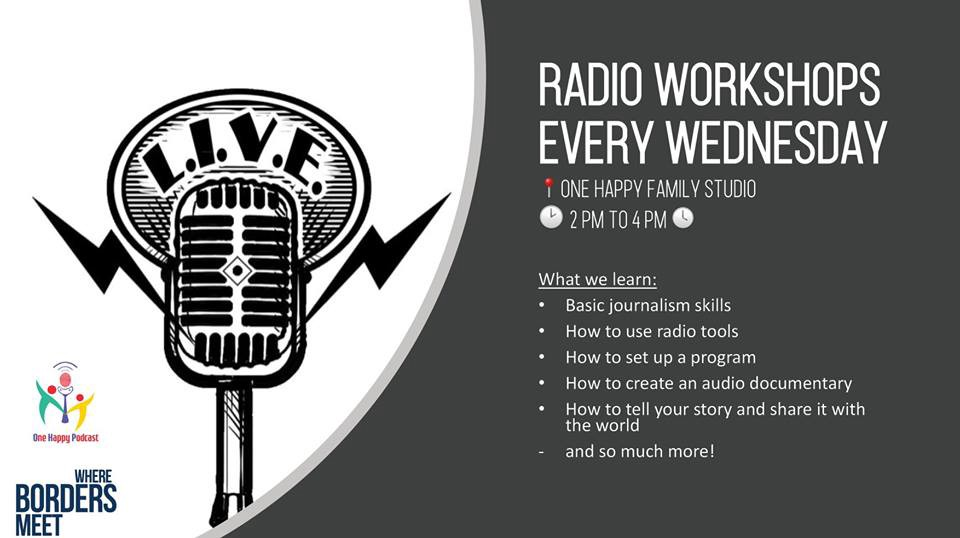
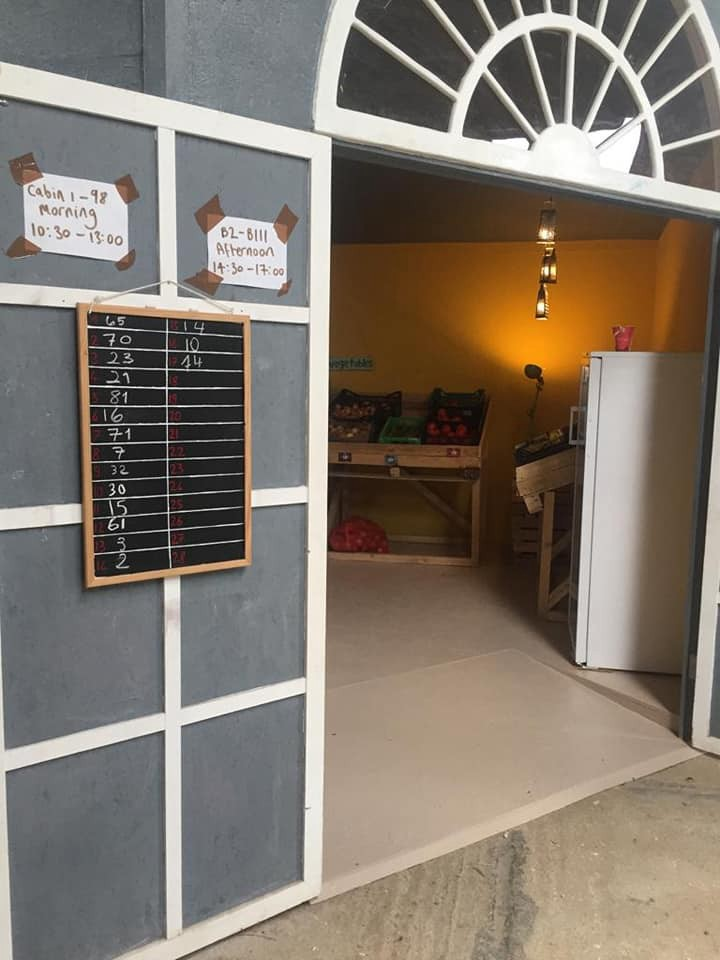
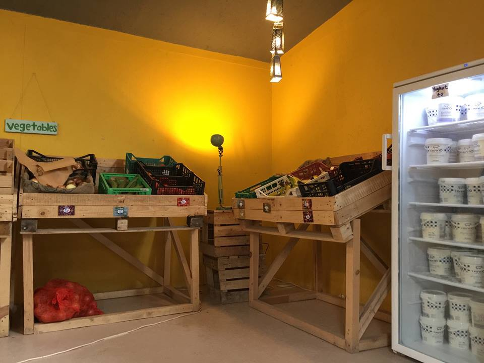
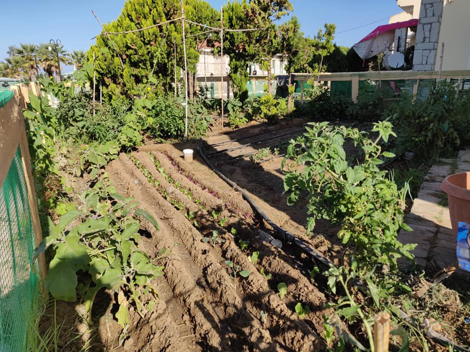
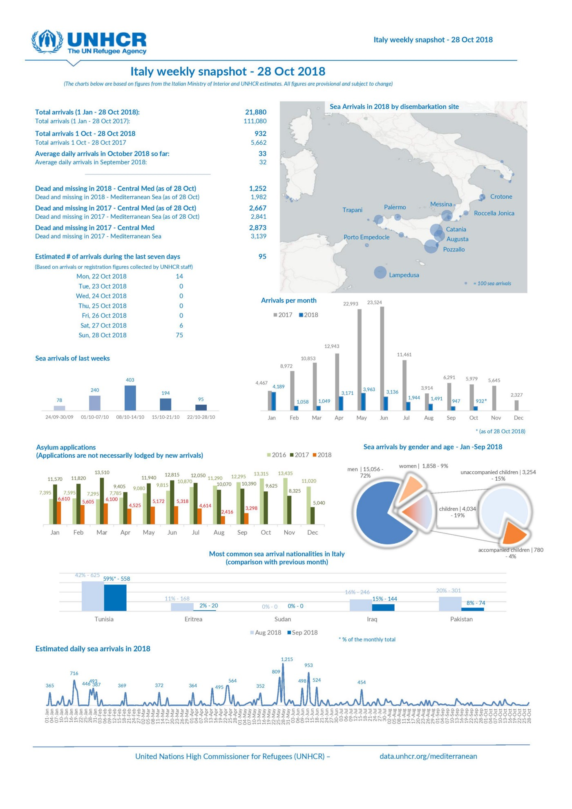

### AYS Daily Digest 29/10/2018: Calais, 2 years after the eviction of the Jungle

More people die at the Lebanese\-Turkish border /// The EU\-Turkey deal is an insult to human life and dignity /// Mental health situation deteriorating in France /// The odyssey of the refugees from Via Scorticabove in Rome continues /// Bosnian/Croatian border still closed /// Migrants attacked in Morocco and in Germany /// Child deported from Denmark

 \)](assets/f686b5f8c2ab/1*gP-vwBzZO0upG2RCdY_FCQ.jpeg)

Moria, Lesvos, refugee camp, October 2018\. Always the same question: how can you do this? Really, how can you? \(Photo by [Marios Lolos](https://twitter.com/lolosmarios) \)
#### FEATURE — Calais, 2 years after the eviction of the Jungle

Utopia56 & Grand Littoral have published a short video summarising the situation in Calais 2 years after the eviction of the Jungle, which took place at the end of October 2016\.

> In Calais, two years after the demolition of the camp, thousands of people found themselves stuck at the border between France and the UK\. 
 

> Today, in 2018, there are more than 500 people living rough in Calais\. Among them, women, children, and unaccompanied minors\. 
 

> Their rights and dignity are constantly denied\. 
 

> The French Government does not provide adequate access to fundamental rights such as food, water, sanitation, shelter and child protection\. Hundreds of people find themselves wandering in a dangerous situation\. They are neglected by the state and face constant police pressure and daily forced evictions\. _\( [Utopia56](https://www.facebook.com/Utopia56-Calais-Grand-Littoral-258099198180444/) \)_ 

Across northern France, there are around 3,000 people sleeping rough in short\-lived makeshift camps, constantly harassed by police, who destroy their tents, take their blankets, break their phones, and are often brutally violent, as reported many times by activists and organisations working on the ground\.

Last Sunday [a Care4Calais volunteer](https://www.facebook.com/Utopia56-Calais-Grand-Littoral-258099198180444/) wrote a report on the situation \( \*names have been changed\):

> On Sunday the sky was huge and blue, and the sun was shining in Calais\. We went to a site near the hospital where around 50 or 60 displaced people sleep out of view of the French police in the overgrowth\. Most people here are Kurdish and Afghani, and I meet some Iraqis and Iranians too\. 

> \[…\] 

> Kadaar\* was a young Afghan man, he’d escaped the violence of Afghanistan and had been living in London for several years\. Not a Londoner myself, I could feel that I was frustrating him by not knowing the names of the areas that he’d lived in, and he only stopped listing places when I finally agreed that I’d heard of Wembley\. Kadaar was incredibly charming, funny, and enthusiastic\. His language was peppered with British idioms\. He’d been in the camp for a few weeks now, after leaving to visit relatives and finding himself no longer able to return to the UK\. 

> He was not alone in this sort of story\. I heard about a Pakistani man who’d spent 12 years in Glasgow working as a butcher, leaving to visit his dying dad and no longer able to re\-enter\. I spoke to Abed\*, who’d lived in the UK for 15 years\. His family are there and he enthusiastically spoke about Manchester, the city he still calls home\. I also spoke to Basir\*, an Iranian who’d arrived in the UK using a fake passport five years ago\. He swapped stories with another volunteer about the best Persian restaurants in London\. 

> The French police turned up while we were there\. They stood across the street, watching us and smoking cigarettes\. I heard stories about how the police here had taken mattresses from the asylum seekers and burned them beofore their eyes\. 

> Moska\*, an Afghan woman roughly my age, 25, told us how she had to dismantle and hide her tent at the break of dawn for fear that the police would take and destroy it\. Moska had never been to the UK before, she wants to go because that’s where her remaining family are, everyone else is dead\. 

> The last part of the day, once all the food and aid were distributed, was spent drinking tea and chatting to the asylum seekers on the meadow\. An impromptu dance circle broke out and sitting on the grass in the warm sun it seemed kind of idyllic, like a family picnic\. Except for the police watching us closely\. I sat with Abed and drank black tea sweetened with honey\. I asked him what he was going to do later, and he said he might do what he does often on clear days like today, and that was go to the beach at night and look across the black sea, and he might just see the sparkling lights of home twinkling in the distance\. 

Temperatures are now dropping fast, Care4Calais is [in need of winter clothes and money](https://www.facebook.com/Utopia56-Calais-Grand-Littoral-258099198180444/) \.
#### **Updates from Dunkirk**

[VZWGent4Humanity Refugee Support](https://www.facebook.com/BelgiumGent4Humanity/posts/2147742438876904?hc_location=ufi) were in Dunkirk this weekend to provide first aid\.

> Yesterday in Dunkirk the rain came down heavily for most of the day and we did what we could for the hundreds of refugees who had either returned after the eviction, or just arrived\. There were no tents to be seen, the police had made sure of that, and many were cold, wet, and desperate\. It was one of those very hard days where we ignored how wet and cold we were because we could dry off and get warm\. They couldn’t\! A young Kurdish family came to us with a little nine\-year\-old girl who had a high fever\. We gave her medication but could do nothing to heal her frightened eyes…\.we met three young boys between the age of fourteen and sixteen\. They were shivering with cold\. Refugees were pleading with some of our guys to give them their gloves, and many were worried they had no sleeping bag or blanket\. We stayed until late in the afternoon when the rain turned even heavier, making it impossible to do anything else but stop\. \[…\] 

> Evictions do not work\! \! We see the results time and time again\. And now we wonder how many more will be sick as the weather deteriorates\. 

> Humanity is lost in France, and has been for far too long\! 

### LEBANON/TURKEY
#### **Six people died at the border**

[Harekat report](http://harekact.bordermonitoring.eu/2018/10/27/refugee-camps-flooded-6-dead-as-heavy-rains-hit-lebanon-turkey/?fbclid=IwAR0_bDFzdGO827HhYmosJv6Q3RsMOsM36YnUuW1CuokFSCu9JatiYz0cdYo#more-3241) that six refugees died over the weekend at the Turkish border town of Hatay while trying to cross into Turkey despite the treacherous weather, and were subsequently swept away by flood water\.

Flooding in Lebanon and Turkey has also affected refugee camps, leaving many people homeless

> _Videos shared by member of the Syrian Negotiations Committee Hadi Albahra, reportedly from refugee camps near the Lebanese border town of Arsal, show the ground completely flooded, with tents and belongings destroyed:_ 

■■■■■■■■■■■■■■ 
> **[Hadi Albahra](https://twitter.com/hadialbahra) @ Twitter Says:** 

> > معاناة مستمرة في ظل اهمال دولي مستمر للاجئين السوريين في #لبنان 
#سورية #اللاجئين #الامم_المتحدة https://t.co/RGxPFMcSDn 

> **Tweeted at [2018-10-26 00:13:24](https://twitter.com/hadialbahra/status/1055613328935010304).** 

■■■■■■■■■■■■■■ 

At the same time, internally displaced Syrians face worsening humanitarian conditions as winter approaches, with many severely lacking basic food and medical supplies\.

_Neighbouring countries have also been accused of neglecting management of camps in an attempt to persuade Syrians to return to their homes, which are once again under the jurisdiction of the regime\. \[…\] However, many have refused the offer due to fear of arrest and torture by the regime upon their return\._

Meanwhile, UNHCR has reported a $ 44 million shortfall in funding and was forced to suspended food rations and aid for 8,000 Syrian families in September\.

We have to ask, which bit of this is working?
### MOROCCO
#### Migrants attcked in Nador

Migrants are attacked in Nador, while authorities do nothing\.

](assets/f686b5f8c2ab/1*6I-engCgB3mwilWjKoVvCQ.jpeg)

Photo by [NADOR](https://www.facebook.com/AmdhNador/?tn-str=k%2AF)

[Association Marocaine des Droits Humains — Section Nador](https://www.facebook.com/AmdhNador/?__tn__=%2CdkCH-R-R&eid=ARC7T5YBBAVf1WCZedXlLlPakJ1IORrRnhz6PG_2dgOzm7NhsZCi9Vcop9lQonO_sVRehw7i7IhAgBi4&hc_ref=ARTgyQPqo1KIegoK_00T1ZUcTyVyoJwxFD9bZJqiUbxNnpILF0czXh7xSYDdxvLrUJw&fref=nf) continue to report on the alarming situation in Morocco, whose detention centres do not seem to allow visitors or the media\.

> _Visiting this Monday morning at the illegal detention centre for sub\-Saharan migrants in Arekmane Nador, AMDH Nador was able to see that this youth centre is still being requisitioned by the authorities to detain migrants arrested prior to refoulement or deportation\. A bus and several cars from the ministry of the interior were stationed in front of the centre\. No one knows what’s going on inside and it still goes on\! \! \! \!_ 

### SEA
#### Updates from the Western Mediterranean

According to [local sources](https://twitter.com/alzoubeidi/status/1057000303608950784?fbclid=IwAR1aYDUJj9XNt8DHuYtehiFSpSkFqLsoIDYy5BDGLrpdenX-MERR2yvK8zw) 397 people have been picked up by the Moroccan Royal Navy — no further information available\.

In an update on the shipwreck which happened on Saturday in the western Mediterranean Sea [Infomigrants report](http://www.infomigrants.net/en/post/12964/baby-dies-in-crossing-off-spanish-coast?ref=tw) that one infant died\. The dinghy was carrying 57 people and most of the remaining people were rescued\. Among the rescued were five small children and several women\. At least one man is known to be missing, one infant required resuscitation and five people have been hospitalised in Almeria\.
#### Sea Rescue Is Not A Crime — The Iuventa Call For Support To Continue Their Fight To Save Lives

 \)](assets/f686b5f8c2ab/1*2WJ1RoyiV6XJaJqsdyMofg.jpeg)

Iuventa \(Photo by [Jugend Rettet](https://www.facebook.com/JugendRettet/photos/a.418621685013737/952825481593352/?type=3&theater) \)

They have now been held by the Italian authorities for 453 days while at least [1,987 people have died](https://missingmigrants.iom.int/) since January in the Mediterranean Sea between North Africa and Southern Europe, the deadliest border in the world\. How many lives could have been spared?

You can support them [here](http://jugendrettet.org/betterplace) \.

> _Together for the right to rescue and the right to life\!_ 

### GREECE
#### **Arrivals**

[Aegean Boat Report](https://www.facebook.com/AegeanBoatReport/posts/466574950532281) inform that six boats arrived on the Greek island on Monday\.

> The first boat landed near the airport, Lesvos south, at 00\.30 with 29 people \(11 children, 12 women, 6 men\) \. 

> The second boat was picked up outside Molivos, Lesvos north, at 02\.00, by Frontex: 36 people \(16 children, 7 women, 13 men\) 

> The third boat arrived south of Katia, Lesvos south, at 02\.10 with 7 people\. 

> The fourth boat landed on Samos east at 07\.00: 69 people 

> The fifth boat was picked up by German Frontex outside Samos east at 07\.30: 51 people\. 

> The sixth boat was reported landed on Kos\. 

According to the [UNHCR’s weekly snapshots](https://data2.unhcr.org/en/documents/download/66544?fbclid=IwAR2PT03eyNLNtW67685AbYen78Otw83ZsbN7QM6O5a3cdeUdmyMaURHcXkc) of the situation on the eastern Islands, 611 people arrived last week \(the week before 1,179 people arrived\), the majority of whom arrived on Samos \(313 people\) \. Over 17,600 asylum seekers are hosted on the islands \(31% from Afghanistan, 21% from Iraq, 15% from Syria\) \. Women account for 21% of the population and children for 30%\. Most of the children are under 12 years old and one in five arrived alone\. A total of 495 people were transferred to the mainland\.
### LESVOS
#### **Fear of infectious diseases in Moria Camp**

Local media [report](http://www.ekathimerini.com/234124/article/ekathimerini/news/moria-police-to-take-blood-tests-over-tuberculosis-fears?fbclid=IwAR3Y3hf2h-s0_8p9cQM0J72FJqOVEdFIcP7n5wdb-saJ6AoSN3E1vVxOPr0) that police agents stationed at the infamous Moria camp will start taking blood tests after one resident was reportedly infected with tuberculosis fever\.
#### **Vulnerable refugees at Pikpa camp**

[Pikpa camp](https://www.facebook.com/pikpalesvos/) is currently hosting 88 vulnerable refugees\. Amongst them chronic patients, pregnant women, new mothers with their newborns as well as other vulnerable refugees who are staying in the camp awaiting their asylum decision\.

They will soon launch a crowdfunding campaign for the medical support of the vulnerable residents\.

> We call all friends of Lesvos Solidarity to support our \#Action4Health and help us provide Pikpa’s residents with: 

> \- common flu medicines 

> \- visits to the eye specialist or dentist 

> \- vaccination of children 

> \- treatment for heart diseases 

> \- prenatal examination 

> \- MRI examinations and more 

#### **Radio workshops at One Happy Family, Lesvos**

One happy family will start offering radio workshops every Wednesday afternoon between 14\.00 and 16\.00\.

### MAINLAND
#### **The implementation of the EU\-Turkey deal is an insult to human life and dignity\.**

The [Campaign for the Access to Asylum](https://asylum-campaign.blogspot.com/) published last week a statement marking their position with regard to the EU\-Turkey deal:

> The dealing with \[…\] problems which refugees face, making them victims and hostages of the preventive policy that EU member states are implementing and of the continuing tendency of banishment of the refugee issue to the fringes of Europe or even outside European borders, cannot have any other approach than: 

> \- The abandonment of the EU\-Turkey Statement and, more importantly, the abandonment of the submission of refugees in conditions of endless detention and lock\-in, that have caused all the problems we have been witnessing over the last few years\. 

> \- The reinstatement of human life and dignity in the center of political planning, in comparison to the current preventive policy and degradation of human value\. 

> \- Strategic planning for the smooth integration of refugees throughout the Greek territory, in a way that promotes coexistence with local communities, instead of making it difficult by the current policy of prevention and ghettoisation in distant camps on the mainland\. \[…\] 

Read the full statement [here](https://greekhelsinki.wordpress.com/2018/10/24/2-51/)
#### **Police agents on the Evros border arrested for people smuggling**

Two police agents stationed at the Evros border and one civilian were arrested on Monday for facilitating entry into the country of undocumented people, local media [report](http://www.ekathimerini.com/234120/article/ekathimerini/news/policemen-detained-over-charges-of-facilitating-irregular-migration?fbclid=IwAR0chCMomaVtry_BnWCBWHEEWmWL1wmw0dFiDxYmkPxWtan_cYMH23L_Vpc) \.
#### **It is now possible to renew residence permits expiring before March 31, 2019**

[Mobile Info Team for refugees in Greece](https://www.facebook.com/mobileinfoteam/) report that beneficiaries of international protection, whose residence permits expire before the [31st of March 2019](http://asylo.gov.gr/en/?p=3944) , can apply now to renew their residence permit\.

**The expiry date is written on the front side of your residence permit, directly under your name\.**

**You have to apply to renew your residence permit at least two months before it expires \(before January 31st, 2019\) \.**

This is because it can take two months until a residence permit renewal is processed\. So, if you apply for a residence permit renewal too late, then your residence permit might expire before it gets renewed\. If you are found with an expired residence permit, this might cause you trouble with the police or other authorities\.

Find more information in English [here](http://www.mobileinfoteam.org/residence-permit) , or read about it in [Farsi](http://www.mobileinfoteam.org/residence-permit-fa) and in [Arabic](http://www.mobileinfoteam.org/residence-permit-ar) \.

Volunteers at [Refugee support Europe](https://www.facebook.com/RefugeeSupportEurope) have renewed the spaces in both the LM Village, by Killini, on the mainland west coast, and in Katsikas camp, in the Ioannina area, northern Greece\.

The freshly renewed freeshop in Katsikas and the garden in LM Village \(photos by Refugee Support Europe\)
#### **Weekly schedule @ Victoria Square Project, Athens**

](assets/f686b5f8c2ab/1*OsFHPOLSyZDus-4fOECp7w.jpeg)

[Victoria Square Project](https://www.facebook.com/VictoriaSquareProject/posts/571656883303095?hc_location=ufi)
#### **Weekly schedule @ Zaatar, Athens**

 — \*Please note that Stretching and Aerobics/Dance classes are for women only](assets/f686b5f8c2ab/1*79T7MutI7wbnr9JbEM-cag.png)

[Orange house, Zaatar](https://www.facebook.com/zaatarngo/) — \*Please note that Stretching and Aerobics/Dance classes are for women only
#### **Support needed and volunteer opportunity**

The Greek Forum for Refugees is looking for community interpreters / cultural mediators\. If you’re interested and have a very good knowledge of the Greek language and a good level of Urdu, Farsi / Dari, Arabic, French, Kurdish or other languages spoken by refugees and asylum seekers, take a look [here](https://refugees.gr/el/%CE%BA%CE%BF%CE%B9%CE%BD%CE%BF%CF%84%CE%B9%CE%BA%CF%8C%CF%82-%CE%B4%CE%B9%CE%B5%CF%81%CE%BC%CE%B7%CE%BD%CE%AD%CE%B1%CF%82-%CF%80%CE%BF%CE%BB%CE%B9%CF%84%CE%B9%CF%83%CE%BC%CE%B9%CE%BA%CF%8C%CF%82/?fbclid=IwAR3n7vYnRkeY1sfsGw2NLFwU-F2nwUWCAyu0ZxtQrriqVHTWe63czth1Kvc) \.
### ITALY
#### **Arrivals**

#### **The struggle of the Sudanese refugees from via Scorticabove, Rome, continues**

 \)](assets/f686b5f8c2ab/1*r_M9CrQVJ54a_lO0Wab3YQ.jpeg)

Where is our International Protection? \(Photo by [Rifugiati di Via Scorticabove](https://www.facebook.com/scorticabove) \)

As we reported in the past months, a group of around one hundred [Sudanese people](https://www.facebook.com/scorticabove/?tn-str=k*F) was evicted from their self\-managed house last July\. After having set up a makeshift camp in front of the building, they were evicted for a second time on 3rd October, as the Roman Council abruptly stopped negotiations started in July\.

Now they are dispersed, living rough wherever they find shelter\.

Fundraising was set up to support them\. There are five days left to reach their goal\.

Help them [here](https://buonacausa.org/cause/rifugiati-sudanesi?fbclid=IwAR1By6n7dVusTK6K0K5BoDWOJn9qB0bjSs_mwJ4PP55NOaAQqKy2ZDUepIQ#.W8g5bB2DCag.facebook) \.
#### “ **Amend the decree to safeguard the right to healthcare”**

A group of humanitarian organisations wrote an [open letter](https://www.asgi.it/asilo-e-protezione-internazionale/immigrazione-decreto-sicurezza-salute/?fbclid=IwAR27Xzb6HhNcpo6iseMmQ2fofpZ_8UdzZ0xvG9Ox-kgAibdAqhWPsz-dv1Y) to the Italian Parliament expressing severe concerns regarding the impact on the right to healthcare of migrants, asylum seekers and refugees of the Immigration and Security decree recently approved by the government\.

As they point out:
- The repeal of the humanitarian residence permit will increase the number of people forced into irregular and informal situations, increasing their health risks\.
- The new decree is highly unclear about the criteria used to approve permits for serious health problems, limits their duration, and stops them for being converted into work or other kinds of permits\.
- The reform of the SPRAR reception system is highly worrying, as it is now accessible only to beneficiaries of international protection and the new “special cases permits”\. As a consequence, asylum seekers are now excluded from this system and will be forced into the CAS \(Extraordinary Reception Centres\) for an even longer time, with serious repercussions on their physical and mental health, especially for vulnerable people\.
- Moreover, the decree increases the time of detention in hotspots and in Centres for Repatriation for people who haven’t committed any crime\. They could be forced to stay in such places for up to six months, and after that their future will still be uncertain\.

> “The safeguard of health is possible only through full access to healthcare, but also through the protection of social conditions, such as housing, income, education, work and living environment\.” 

#### **A total of 81 Syrian refugees to arrive on Wednesday via humanitarian corridors**

On Wednesday 31 October, 81 Syrian refugees will [arrive](https://www.mediterraneanhope.com/2018/10/29/profughi-nuovo-arrivo-dal-libano-con-i-corridoi-umanitari/) in Rome from Lebanon through the humanitarian corridors supported by the Comunità di sant’Egidio and the Italian Protestant Churches\.

Since 2016 around 2,100 people have arrived in Europe through these humanitarian corridors\.
### MACEDONIA
#### Migrant in jail without any evidence against him

[Help the Refugees in Macedonia](https://www.facebook.com/groups/help.mk.refugees/permalink/2206178469456880/) have released a statement about the continued detention of a migrant person known to them, who was arrested in Bosnia for the murder of five people in Macedonia\. There is no evidence against him and no record of these cases in either country\. They call for his release, an apology from the Bosnian Ministry of the Interior and an investigation by human rights groups\.
### BOSNIA AND HERZEGOVINA
#### Update from the Bosnian/Croatian border

The border crossing at Maljevac is closed for the seventh day in a row and according to [other local sources](https://www.facebook.com/GPMaljevac/posts/891486687724373?hc_location=ufi) it will remain closed as long there are ‘migrants’ at the border\. Around 150 people are still there, waiting and hoping\.

At the same time, in Kladusa, in several places, hundreds of people are sleeping out in the open or in abandoned buildings waiting for the right moment to continue their journey\. Police are preventing them from boarding buses and from travelling to or from Bihac or Sarajevo, which is not in accordance with the existing legislation\.

Also in Velika Kladusa independent volunteers have been [documenting](https://www.facebook.com/chiara.lauvergnac/posts/10156201480824092?hc_location=ufi) police violence and dog bites\.

And No Name Kitchen [report](https://www.facebook.com/pg/NoNameKitchenBelgrade/posts/?ref=page_internal) that illegal pushbacks are still happening\. When it comes to laws in Europe these days, it’s best to know what they are, so that you can expect states to do the opposite\.
### FRANCE
#### Updates from Paris

Volunteers on the ground [report](https://www.facebook.com/sarah.fenbydixon.1/posts/1666986893406307) that temperatures are dropping in Paris while hundreds of people on the move are still sleeping on the streets\. Police harassment continues and many people who are undergoing the asylum process are facing near daily police abuse\.

Some people in the city are housed in temporary shelters, including a Red Cross Shelter at the Odeon Metro\. The Manager of this centre has now decided that everyone must vacate the premises on the morning of the 31st\. There has been no alternative accommodation offered\. This week a number of residents of the shelter releases a public statement:

> We’re not going back to the street\! 

> We are 36 refugees and asylum seekers in the Red Cross at the Odeon metro\. We are different nationalities \(Afghan, Sudanese, Malian, Chadian, Eritreans and others\) \. We call for your solidarity on 31 October 2018\. \[…\] We’re just asking for a place to sleep\. We were in danger in our countries\. We need protection and a safe place\. We ask for a lasting solution with rooms and kitchens near a subway station\. Without a written guarantee of this solution, we will not leave the centre\. 

The demonstration will be on Tuesday, October 30th at 18\.00, as well as on Wednesday, the announced day of expulsion, to help them resist at 6 am\.

Address: 6 Rue Mazet, 75006 Paris\. Metro: Odeon\.

More info [here](https://www.facebook.com/parisexil/posts/1810442479005050?hc_location=ufi) \.
#### Mental health concerns for people in detention and on the streets

La Cimade has also [reported](https://www.lacimade.org/situation-explosive-dans-les-centres-de-retention/?fbclid=IwAR3wlYahi12YYuiOeJRxQSfi0nxWxOlDUVbuDpW7KTno9ELF7gd6HfC3et4) on deteriorating mental health among those in detention who are confined for 45 days\. There have been two suicides in the last year and increasing incidents of attempted suicide, self\-harm and hunger strikes, including [a case of one man sewing his own lips closed](https://translate.googleusercontent.com/translate_c?act=url&depth=1&hl=en&ie=UTF8&prev=_t&rurl=translate.google.com&sl=auto&sp=nmt4&tl=en&u=https://france3-regions.francetvinfo.fr/bretagne/ille-et-vilaine/rennes/centre-retention-rennes-retenu-se-coud-levres-1520460.html&xid=17259,15700021,15700124,15700149,15700186,15700190,15700201,15700214,15700230&usg=ALkJrhhyJS_34LtgeiFUfS8UbWkEyzqArA) in August of this year\. They call on the Government to end the abusive practice of detention\.

[Refugee Rights Europe](https://www.facebook.com/RefugeeRightsEurope/posts/1911327279174108?hc_location=ufi) have also produced [a report](http://l.facebook.com/l.php?u=http%3A%2F%2Frefugeerights.org.uk%2Fwp-content%2Fuploads%2F2018%2F08%2FRRE_StillOnTheStreets.pdf%3Ffbclid%3DIwAR24AQhCHJHLZY7dbwmDe213WdIOB80gxAfdF6StKayBgQQBGqN2CjUfDqk&h=AT3lE1QHVL-04YM9mKf28ILCnVtBf-pdbpNrRyFWatqMqpzuBdQaf5DyYZ7jNb6SfpypmG6Cm94-ZeGMBmbOVj0dZ_pDA-HBT3UOaj7bVrLlSdjXFTyXHZ_pIG9u3Zpw4sE5ssvOomcqh64cTx2J5LLpHSI) on the negative impact policies such as this are having on people’s health in Paris\.
#### Hot meal in Paris tonight

[Solidarité migrants Wilson](https://www.facebook.com/permalink.php?story_fbid=1013304038870368&id=598228360377940&hc_location=ufi) are providing a hot meal tonight\.

Tuesday, 30th Oct at 19 h45 at Saint Geneviève Church located at 139 Avenue du President Wilson, 93210, La Plain Saint Denis\.

They welcome people to bring water, fruit juices and fruit and/or participate financially, using this [link](https://www.lepotcommun.fr/pot/tusyjrwc) ; they can also collect donations: [Saida\.Bazzi@Yahoo\.Fr](mailto:Saida.Bazzi@Yahoo.Fr)
#### Solidarity is not a Crime, Support the \#Briancon7\!

The Self\-managed refuge Chez Jesus published an appeal to support the \#Briancon7 on November 8th in front of the Court in Gap\.

> Solidarity is not a crime\! 

> On the 22nd of April more than 400 people walked from Claviere to Briancon, from Italy to France\. A spontaneous demonstration against the borders and their murderous militarisation, against the fascists of Generation Identitaire\. At the end of the march seven people were arrested, charged with “aiding irregular migration in an organised gang”\. They now risk 10 years in prison and 750,000 Euros fine\. 

> We all were on those paths\! 

> Against all borders\! Freedom for everyone\! 

### GERMANY
#### Attack on asylum seekers in Magdeburg

[Local media report](https://www.mdr.de/sachsen-anhalt/magdeburg/magdeburg/gruppe-ueberfaellt-asylbewerber-in-magdeburg-100.html?fbclid=IwAR1fOyf2NGNDgbKbywKmJIY_HL2zTgHp6-Ur3d9fDrFwftxf80192RjozQc) that two asylum seekers were attacked on Sunday evening around 6 pm in Magdeburg\. According to the police, the two men were first subjected to xenophobic insults by a larger group of people\. At a tram stop in the district Sudenburg they were then physically attacked by up to 30 persons, leading to hospital treatment\. They suffered from nasal bone fractures and several facial hematomas\. The men are 18 and 28 years old and originally from Pakistan and Afghanistan\.

The police are looking for witnesses of the attack — 0391/5463292\.
#### Call For Solidarity

Two Gambian refugees will be challenging accusations brought against them by the Bavarian State at the Augsburg local court on November 7th at 1 pm\. Read more info about their case [here](http://cultureofdeportation.org/2018/10/25/donauwoerth-call/?fbclid=IwAR0VSaI6Y5VYzcpjcLoLmxbk9iFbRE9ePyyxm3R8QsNHXJAYZeJI9QancMU) \.

> _We are calling on activists and friends to show their solidarity and come to observe this state legitimation of police violence against refugees\. Stop the politically motivated criminalisation of refugees in Bavaria\!_ 

> Come to court: Amtsgericht Augsburg, Am Alten Einlaß 1 86150 Augsburg 

### UK

Help Refugees and Attika Human Support are working to fill a container in East London with donations for Lesvos by Sunday 18th November\.

> “We’re asking you to group together with your friends, local community or workplace — and organise a mini collection — then bring these donated items to us on Sunday 18th November\. We’ll get these items to Lesvos, where they’re needed most\.” 

> If you would like to coordinate a collection please register: [http://bit\.ly/LesvosContainer\.](http://bit.ly/LesvosContainer.) 

Check their needlist [here](https://www.facebook.com/HelpRefugeesUK/posts/731176950576314?hc_location=ufi) \.
### NORTHERN EUROPE

UNHCR have [published a breakdown](https://data2.unhcr.org/en/documents/download/66034) of arrivals, acceptance rates, and quota commitments etc\. for the northern European states\. Sweden, which has the highest population in the area at 10\.1 million, also granted protection to the highest number of people, 26,775\. Yet the acceptance rate is only 44%\. Estonia, which granted the lowest number of positive responses in protection cases, 95, actually has a higher acceptance rate, 61%, as it is the 2nd smallest country in the region in terms of population\.
### DENMARK
#### Child deported to Thailand

[Local media report](https://www.thelocal.dk/20181029/after-child-deportations-minister-promises-to-look-over-danish-residency-laws?fbclid=IwAR3FH1zFDa8h5OmCQJpCRX5DrZKvaon0DQYgGucMYweMgMWf5ikUWJ42loE) that Integration Minister Inger Støjberg has said she will try to avoid deporting children in the future\. Unfortunately, this decision has come too late for many, including a 13\-year\-old girl named Atcharapan “Mint” Yaungyai who was living with her parents and attending 7th grade \(the correct grade for her age\) until she was deported back to Thailand for failing Immigration Board \(Udlændingenævnet\) requirements over integration\. I repeat, she is 13\.

Denmark’s Integration Law \(Integrationsloven\) took effect in 2016 and requires all children over the age of eight that move to Denmark to be assessed over their potential for integration before being granted residency\. Overall, Denmark’s policies towards both its citizens and potential citizens who come from non\-western backgrounds is increasingly worrying\. Targeting children and dividing families in this way is unacceptable and inhumane\.
### NORWAY
#### Fundraise for Afghan Migrants Advice & Support Org

Activists in Norway are now fundraising for Afghanistan Migrants Advice & Support Org \(AMASO\) to enable them to reach a larger number of returnees when they arrive in Kabul after being deported, especially important for children and young people\.

> _The objectives of AMASO are:_ 

> _a \) The collection of accurate data, impartial and up\-to\-date information on the laws, policies and practices of various states with regard to migration\._ 

> _b \) Advocating effectively on behalf of deportees_ 

> _c \) Providing advice and support to deportees returned from various European countries and Australia_ 

> _Advocacy:_ 

> _a \) Media activities, highlighting the plight of the deportees through different national and international media\._ 

> _b\) Meeting with relevant ministries and departments, as well as NGOs_ 

> _c\) Lectures/discussions/seminars on migration related issues in universities and schools in Kabul_ 

You can see how to donate \(in Norwegian\) [here](https://www.spleis.no/project/54129?fbclid=IwAR2RyziES1l2yYCXglbk5iyaqNiByVbqraaD8TPfhftZlQTB2WCCEaUKHbo) \.

**We strive to echo correct news from the ground through collaboration and fairness\.**

**Every effort has been made to credit organizations and individuals with regard to the supply of information, video, and photo material \(in cases where the source wanted to be accredited\) \. Please notify us regarding corrections\.**

**If there’s anything you want to share or comment, contact us through Facebook or write to: areyousyrious@gmail\.com**

_Converted [Medium Post](https://medium.com/are-you-syrious/ays-daily-digest-29-10-2018-calais-2-year-after-the-eviction-of-the-jungle-f686b5f8c2ab) by [ZMediumToMarkdown](https://github.com/ZhgChgLi/ZMediumToMarkdown)._
