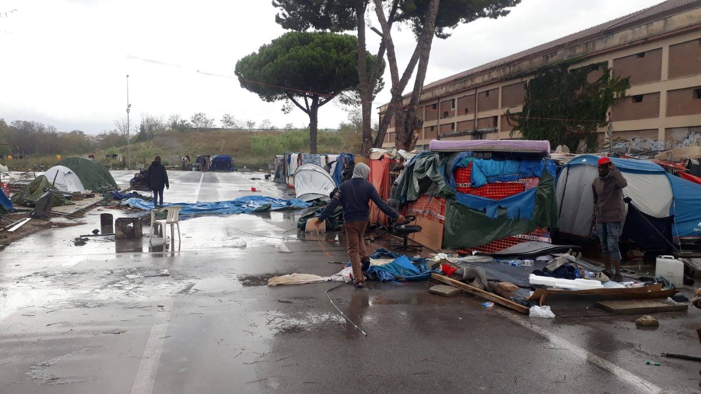
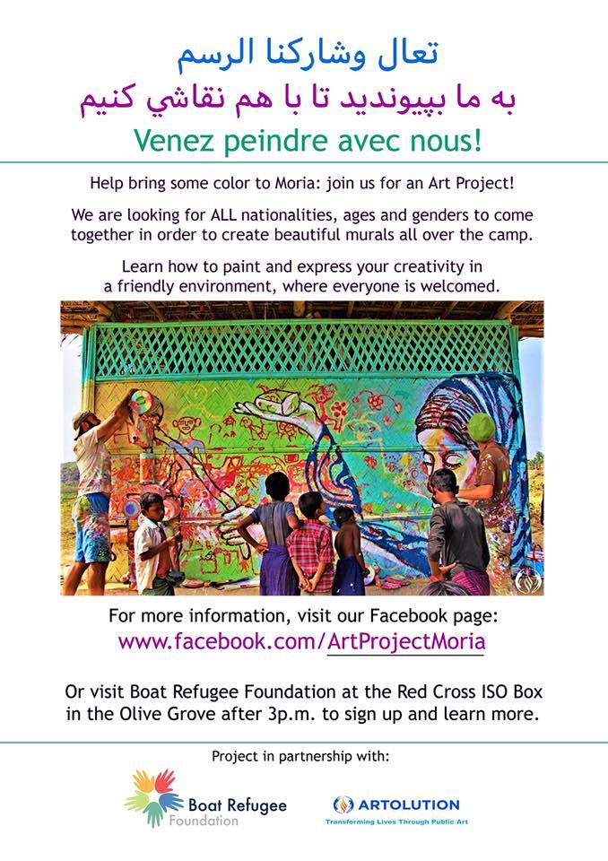
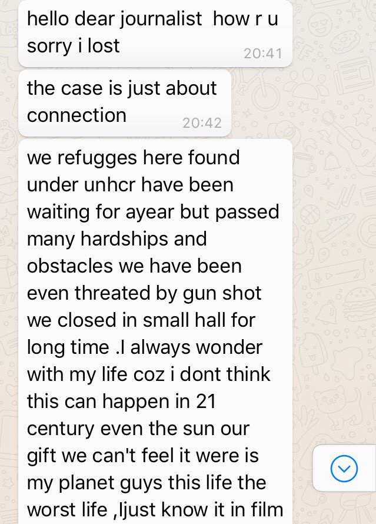
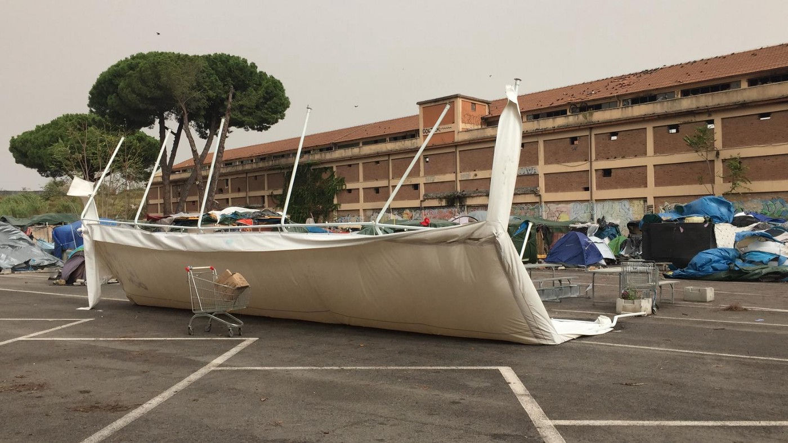
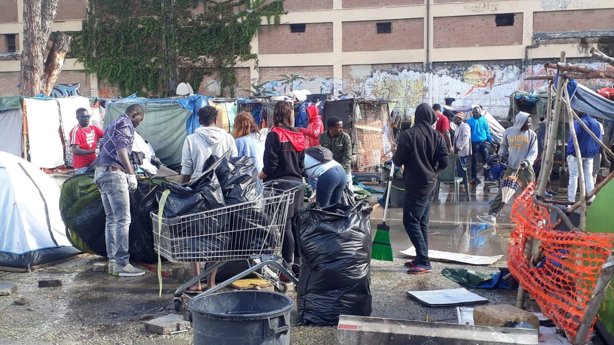
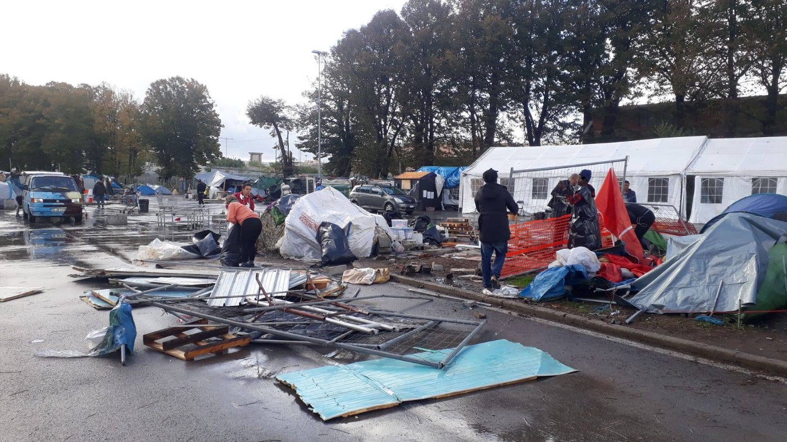
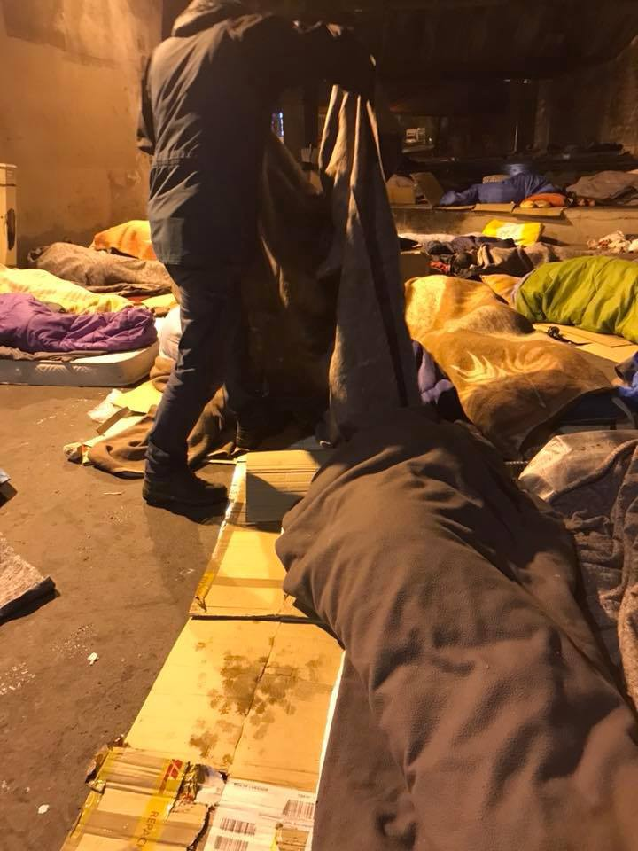
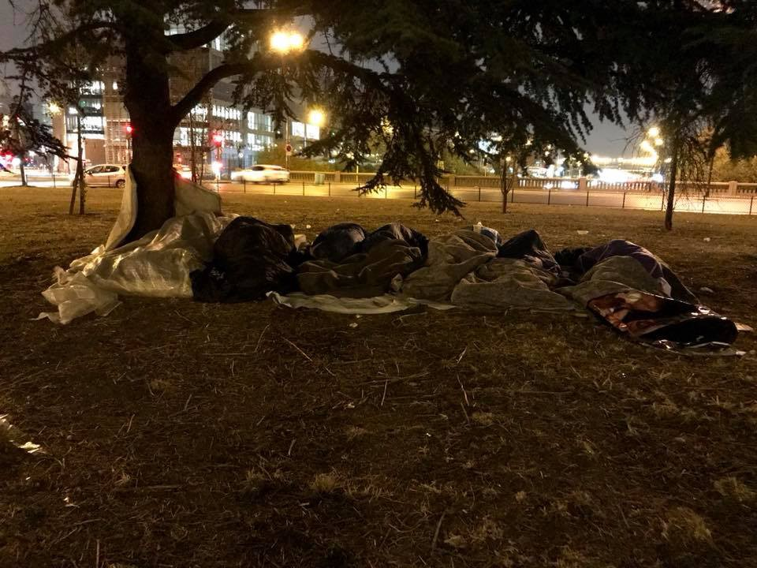
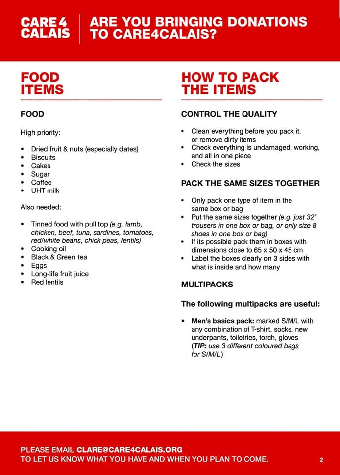

### AYS Daily Digest 30/10/18: Repressive migration policies’ effect on the rights of minors and children
#### People protesting at the border crossing in Bosnia and Herzegovina left the site; refugees in BiH still in need of a solution / As the number of people who lost their lives on the sea this year reaches 1987, SAR teams call for action and appeals rise for a change in approach to cooperation with Libya / Protests in Austria / Help needed in France and Italy / Corridoi umanitari bring another 83 Syrians safely to Italy\! / more news…




Rome, photo: Baobab Experience
#### FEATURE

The INTERSOS team has compiled a report on the state of the protection of unaccompanied foreign minors in Italy and Europe, basing the text on the Statistical Dossier of Immigration\.

The repressive policies adopted by the Italian authorities, by the other European States and by the European Union, have entailed very serious violations of human rights norms, including the UN Convention on the Rights of the Child, the European Convention on the Rights of the Man and the Geneva Convention, as well as international law of the sea\.

**In 2017, these serious violations of children’s rights were brought to the attention of the European Court of Human Rights, which adopted several provisional measures to protect some unaccompanied minors placed by Italian authorities in adult shelters\.**

26% fewer unaccompanied foreign minors were present in Italy than in the same period of the previous year, as was documented on 30 June this year\.

4677unaccompanied minors, mostly Eritreans, Somalis and Afghans, were untraceable, i\.e\. they had moved away from the reception facilities where they had been placed\. A significant proportion of minors who leave the reception centers do so with the hope of reaching Germany, England, Sweden or other European countries, where they have relatives or where they hope to find better prospects for integration\.


> These boys and girls try to cross the borders with France, Switzerland or Austria, alone or relying on traffickers, sometimes risking their own lives: some minors were killed, crushed by a tug or a train, while others have been found semi\-frozen\. 


According to this report, many of these young people find themselves living in makeshift accommodations in border towns and cities, without access to drinking water and sanitation facilities, in conditions of extreme degradation and exposed to serious risks of trafficking, abuse and exploitation\.
Many attempting to irregularly cross internal borders would have the right to be reunited with their relatives, but do not receive adequate information on family reunification procedures, also because the operators of the reception facilities, social services and police stations often do not have the necessary skills\. Even when they do know, faced with the prospect that the procedure may last more than a year, most children decide to reach relatives by their own means\.

In Italy, minors should remain for a very short time in the first reception government centers before being transferred to the SPRAR\. Moreover, the first or second reception facilities managed by the municipalities and the prefectures should be a temporary back\-up solution\. However, the reality is very different\. Please find a detailed analysis [here](https://www.intersos.org/msna-italia-tutela-dei-diritti-dei-minori-politiche-migratorie-repressive/?fbclid=IwAR3Rm_3HiRMASm4QovusXeWNFurT2VAHO1__eY3DVEaKXejuyhNsn3D5UW8) \.

If the Territorial Commissions for the recognition of international protection conform to the recent indications of the Minister of the Interior regarding the need to limit the recognition of humanitarian protection, this will probably result in an increase in the number of boys and girls who will be deprived of permission to stay and therefore marginalized and unable to make a positive path of social inclusion in Italy\.
#### GREECE


■■■■■■■■■■■■■■ 
> **[Refugee Rescue](https://twitter.com/_refugeerescue) @ Twitter Says:** 

> > As of the end of October, 6193 people have entered Greece via the Northern coast of Lesvos.  If they were to all return and stand along the shoreline, there would be someone every 5.2 meters.

#SafePassage
#WithRefugees https://t.co/bXqivS3S9R 

> **Tweeted at [2018-10-30 18:55:07](https://twitter.com/refugeerescueuk/status/1057345170902003712).** 

■■■■■■■■■■■■■■ 

### Islands

A boat with 67 people arrived in Chios carrying 35 children, 18 men and 14 women on board\.

Six boats have arrived on Tuesday on the Greek Aegean Islands, carrying a total of 258 people, [Aegean Boat Report](https://www.facebook.com/AegeanBoatReport/?__tn__=%2CdkCH-R-R&eid=ARBSwXEVBYexlWeuycb1aGWyaM_xSV_p5Ya-AN1qEEqgcDdaBAvJ5RWoEyIypa6zGIa3VpC7lL8wHTX5&hc_ref=ARRDWb7Vp-YezT8wvto-eKa5bEiqs9Mb1wksqtrJN8s0WLoCFuHCDpFwT7a6IpZLMRM&fref=nf) team reports\.
The first boat landed on Korakas, north Lesvos, with 31 people: 12 children, 10 women and 9 men\.
The second boat landed in Kalo Lima, north west Lesvos, with 23 people 
on board: 11 children, 7 women and 5 men\.
The third boat arrived outside Pikpa, south Lesvos, carrying 27 people\.
The fourth boat was picked up off Samos’ east coast , with 60 people\. 
The fifth boat landed on Farmakonisi and transported to Leros, with 50 people\.

10 people was transferred from Mykonos to Leros\.


](assets/67cd110991cc/1*qaXuw2OaLMcpLwC3LeIOOQ.jpeg)

Photo: [**SMH‏**](https://twitter.com/smhumanitario)

[Refugee Law Clinics Abroad in Chios](https://www.facebook.com/rlcabroad/?__tn__=%2CdkCH-R-R&eid=ARAaIM83twtoRis-1z-AMobRrgJLDpsqAntvnv2CW71pisGsRbnsGC19bo5UdUBV1CoxsKSDZy0SFxGi&hc_ref=ARQcAeKo-uj92flmA6STwjXXR2b9KhO3oEYnWQWBoiK3PRq6JpAQ4sUohotCAQrN_XU&fref=nf&hc_location=group) is looking for a Greek lawyer to work with them as the legal coordinator of their Chios project\. Please see the job announcement [here](https://refugeelawclinicabroad.files.wordpress.com/…/rlca_j…) \.

[FEOX rescue team](https://www.facebook.com/FEOX-rescue-team-1584119558539350/?__tn__=%2CdkCH-R-R&eid=ARA8fMMHYROFLkmv2Ddy6W9Ca71U_45nOBXA3tl5VvcKpoIodHdnsr0PNUNkOg2AEBMQqok0Zov2CbQA&hc_ref=ARTxkB92zUMbyDS5NiiwMr9TaKbAHW8C3oQZ0ZJxqhtAFXsW3_ddCd77Eks_cJ_ZPPo&fref=nf) needs clothes for babies up to one year old\. To be delivered/sent: FEOX Savva Sekiari 25 Chios 82100 Greece

**Lesvos — Moria** : In the midst of horrid living conditions, sometimes it is immediate contact, communication and art that help the people keep their mind off the difficulties they face\. [Art Project Moria](https://www.facebook.com/artprojectmoria/) invites people to join their art workshops and drawing activities:





■■■■■■■■■■■■■■ 
> **[ΑΠΕ-ΜΠΕ](https://twitter.com/amna_news) @ Twitter Says:** 

> > Ιρανοί πολιτικοί #πρόσφυγες πραγματοποίησαν σήμερα συγκέντρωση διαμαρτυρίας στην Πλατεία Συντάγματος, στην Αθήνα, ζητώντας να τους δοθεί άσυλο 

📷ΑΠΕ-ΜΠΕ/Παντελής Σαίτας

#RefugeesGr https://t.co/7D3hVZCdVH 

> **Tweeted at [2018-10-30 14:02:52](https://twitter.com/amna_news/status/1057271620300087296).** 

■■■■■■■■■■■■■■ 

### Athens

Iranian political refugees today held a protest at Syntagma Square in Athens, asking for asylum rights\.
#### BOSNIA AND HERZEGOVINA
### Sarajevo

AYS is receiving reports about the confusing situation in Sarajevo\. People who are arriving are being sent to Delijas, an asylum center in the Trnovo suburbs of Sarajevo\. The center is far away, with no internet, phone connection, or transportation to and fro\. It is in the middle of the mountain, in the forest, and the first gas station where people can access internet and buy something is more than 10 km away\. However, some people were taken up there by the police, only to discover that the center is full \(it has a capacity of about 160\) — whereupon the police left them there in the front of the center, forcing them to walk back to Sarajevo alone\. In addition, when they finally reached the city center, the police stopped some people from trying to give them food\. Additionally, according to these statements, police allegedly kicked them several times and one of them even told one of the boys: “Go back to your country\.” In the end, they were left to sleep on the street where they have now been for days, hiding from the police\. This is not an isolated case\. 
Meanwhile, the police continues to racially profile and harass refugees and prevent them from boarding busses going to the north of the country\.

The team distributing meals writes: “Sarajevo was calm tonight and today\. No police presence during evening distribution, the weather is getting colder again — fleece blankets and plastic for underneath was distributed\. Some groups of newly arrived people came\. \(…\) The camp has had trouble with both electricity and water, just as the whole town of Hadžići — due to less rain than usual the levels of water are low\. Tanks with water were transferred there yesterday at least\.”
### Velika Kladuša

Maljevac, the border crossing with Croatia, remained closed for the 8th day since the protest and provisional campsite being installed at the border area, until Tuesday afternoon\. 
In the meantime, local businesspeople met with the regional government to propose to host the camp inside of one of the old factories there, which belongs to a local businessman\.

Bearing in mind the context and difficulties people are experiencing, solely insisting on the opening of the borders in order for refugees to pass freely in the border area between Croatia and Bosnia and Herzegovina will most likely not bring about a satisfying solution\. Instead, we encourage fellow volunteers and activists, along with helping where they can, to put pressure on their local, national and EP representatives, in order to raise the issue of where closed borders policy comes from in the first place\.
#### HUNGARY
### Supreme Court frees Lászlo

The Supreme Court of Hungary has announced this Monday that they have acquitted camerawoman Petra Lázlo from the October 2017 sentence that condemned her to 3 years of probation for disorderly conduct\. She was filmed kicking and trying to trip migrants, specifically one Syrian refugee and his child, while she was on the ground reporting on refugees fleeing from Serbia through Hungary in 2015\.
The Court said she should have been charged with a misdemeanor instead of a criminal offense\. It said the case had to be terminated now since the statute of limitations had expired\.
#### LIBYA
### Urging the EU to change policies and give priority to rescue operations in the Mediterranean

The reduction of rescue interventions carried out in the context of European operations and the obstacles placed on the ships of NGOs involved in rescues have led to an increase in the number of fatalities for people attempting to cross the Mediterranean or returned to Libya by the Libyan Coast Guard\. People are regularly arbitrarily detained in prisons, faced with inhumane conditions \(overcrowding, lack of food, water, medical care etc\. \) and subject to torture, rape and systematic violence\.

DRC has l [aunched an appeal](http://www.infomigrants.net/en/post/12961/eu-libya-cooperation-shipwrecked-values-of-humanity-ngo) to request an urgent change in the European Union’s external cooperation policies on migration in the central Mediterranean, stressing that the cooperation between the EU and Libya has led to a “shipwreck of human values\.”

More evidence and testimonies arrive daily from those who are suffering because of the systems in policies in place\.


> Messages today from a Somali in Tripoli talking about the horrible circle he’s found himself in: escape a detention centre; try to get to sea; get caught by Libyan coastguard; get put in a detention centre; sold by owners to smugglers; made to pay to go to sea; caught again… _— Sally Hayden [reports](https://twitter.com/sallyhayd/status/1057202979097452544) on Twitter about the recent messages and information received on the situation in detention centre in Libya:_ 


> I’ve also been told there are three toilets for roughly 800–1,000 people in Zintan detention centre — one of the reasons the conditions are so poor & people’s health is suffering\.
 

> From this perspective it means the smugglers are making extra by charging the same people multiple times to try & cross the Med\. A very few are still making it, leaving a glimmer of hope — e\.g\. one man from Abu Salim DC recently escaped & made it to Italy\. Detainees were begging to be registered because they want legal paths to safety & a way out of this cycle of abuse & exploitation, but over the past few weeks, as they’ve been told evacuation is incredibly unlikely, they’re again considering other options\. 




Messages Hayden received from Zintan detention centre, where she’s been told,, four people died in a month\.
#### SEA


■■■■■■■■■■■■■■ 
> **[Open Arms ENG](https://twitter.com/openarms_found) @ Twitter Says:** 

> > They accuse us of many crimes, when we only defend the most important right of all: LIFE.
For this reason, @[APDHA](https://twitter.com/APDHA) selected us as finalists for the Human Rights Award 2018.
your support is important: [apdhe.org/proactiva-open…](https://apdhe.org/proactiva-open-arms/) https://t.co/BUyyuiy0Vy 

> **Tweeted at [2018-10-30 10:20:14](https://twitter.com/openarms_found/status/1057215593013825536).** 

■■■■■■■■■■■■■■ 


[Salvamento Marítimo Humanitario](https://www.facebook.com/smhumanitario/?__tn__=%2CdkCH-R-R&eid=ARDS8i4xLi5FuJWp9tuf4ABfxhkTZsDiYtjP5iptOBGeVy9AAv79MyFyIDGxwaWdgMSFXmmPJZ0MQImJ&hc_ref=ARTJIjt9toJq5hBWo-81aIqncP-ZLLBRkn_EIrwHsGvecaVzoOBnMzHa2jhgm8alNuw&fref=nf&hc_location=group) reports that as pathways for the flow of information and the possibility of engaging in sea rescue missions have been cut down, the number of victims at the Mediterranean is increasing and has so far reached **1987 lost lives at sea this year\.**


■■■■■■■■■■■■■■ 
> **[Jugend RETTET - IUVENTA](https://twitter.com/jugendrettet) @ Twitter Says:** 

> > Unsere Crewies brauchen jede Unterstützung - spendet jetzt für Repressionskosten! Seenotrettung ist kein Verbrechen, sondern eine Pflicht! ⁦@[solidarityatsea](https://twitter.com/solidarityatsea)⁩ ⁦@[_Seebruecke_](https://twitter.com/_Seebruecke_)⁩ ⁦@[Unteilbar_](https://twitter.com/Unteilbar_)⁩ #FreeIuventa #HRDWorldSummit  [betterplace.org/de/projects/48…](https://www.betterplace.org/de/projects/48425-rette-mit-spende-fur-rettungseinsatze-auf-dem-mittelmeer/news/178456#ppp-sticky-anchor) 

> **Tweeted at [2018-10-30 06:26:51](https://twitter.com/jugendrettet/status/1057156860845928448).** 

■■■■■■■■■■■■■■ 

#### ITALY
### Rome

[Baobab Experience](https://www.facebook.com/BaobabExperience/?__tn__=%2CdkCH-R-R&eid=ARAt_K3r_ZcOfSHwZAVlrrKNI3RfRRa1il9IRH-CM9aX_zKS8jUQJKqfV5hQ-053FD4xUTK2s_nf0_2l&hc_ref=ARTmncSE8bLKL_rWBRJRi0QYoxj_mvae4yiuH7lg9x7GZU0AQ4CWVMCRLJjtbB9OvB4&fref=nf) team reports that in the aftermath of the bad weather that hit the area, they are trying to make repairs to their infrastructure, which has been badly damaged\.
“Over 60 % of the material that was used host the boys by night need to be thrown away, large part of the common spaces suffered huge damage, big trees fell on the piazzale too and almost miraculously we are here counting damage to things and not people \.”










photos: Baobab Experience


> It is not our habit, those who follow us know, make appeals for donations of goods if not in case of real necessity and today is so, we are in real emergency because there are so many guests who no longer have any shelter to sleep\. 


**They urgently need:** 
**\- tents** 
**\- tarpaulins** 
**\- mattresses** 
**\- gazebo** 
**\- blankets and sleeping bags**
### Investigation opened in the case of USS Trenton

Prosecution in Ragusa opened an investigation into the case of the USS Trenton’s reported rescue delay, thanks to the testimony of the survivors gathered by Fabio Butera who was on board the Sea Watch vessel on June 12, during a shipwreck which caused 76 deaths\. [Italian media](https://palermo.repubblica.it/cronaca/2018/10/30/news/indagine_sulla_nave_trenton-210407389/) reports on the testimonies:
```
"We went to one side and she moved from the other, we tried to cross her and she went away", says one of the young people interviewed. "If he had seen us - says one of the witnesses - nobody would have died".
```
### Eppur si muove

83Syrian refugees will arrive on Wednesday, 31 October and are to be welcomed by the Italian Protestant churches and Comunità di Sant’Egidio\-Community of Sant’Egidio [Mediterranean hope](https://www.facebook.com/Mediterranean-hope-252231521632595/?__tn__=%2CdkCH-R-R&eid=ARCe9FLJwJXtFpWv3bFvZ2rYLFrhWEG3SoccRuLO2khNyMeYz2g1ZUSEsGWheue_otC40G7MlqAnNmBm&hc_ref=ARSLY6zckyxZ1BGcySy8jP5m789NBOsPUc-rkQD2QXZh_8iMCXT6Qqgs3lUkQwPXPlw&fref=nf&hc_location=group) reports\. Thanks to the project Corridoi umanitari, which secures a a safe passage for refugees, 2,100 people have so far been given the chance to arrive to safety — unharmed and without having suffered the dangerous journey and hostile perceptions of the public\.


](assets/67cd110991cc/1*M6pTe9tR-3_Q5FdDNnWtpg.jpeg)

by [Mediterranean hope](https://www.facebook.com/Mediterranean-hope-252231521632595/?__xts__%5B0%5D=68.ARCthlAcVzRkZ0Aa6CJgMsOrpDdQROs2dFelp1yshY_6jeT1fjBBVRNjDS7-CbwOhI4NT2eYjVrcycFmgD3bK9V6ibITMUSifhnNZI65MusPmTvBgXpBtzKK2BH1Jwut2y8kFc1N2ZkjKOUupB147wfec18yl-0fw2o-EoyW0F8X34crM7kFKDuyR16GVrIxO7oHv2Rp2n1ZNPR24MCaWrrJ&__tn__=k%2AF&tn-str=k%2AF)
#### AUSTRIA
### New protests announced


> Thursday is again demonstration\! We are demonstrating against the government, against violence and racism\.
 

> We meet at 18 at the albertinaplatz \(behind the opera\) and then go to the ballhaus square together\. There’s talk and music there\.
 

> We’re together now\! Every Thursday\. Bring all your friends\! — [_Refugee Protest Camp Vienna_](https://www.facebook.com/RefugeeCampVienna/?__tn__=%2CdkCH-R-R&eid=ARBw0FWSI1iUadrY5gqYDCimes6Mh8FUCWU1mnV4f6dzZ4nOHOgbk08jKt-g_FhsN3aqQl24QFNrGC-R&hc_ref=ARQvaR_GOZbVcyRachy0hgSgqf-JSHA49vwEk8Br_g-eyTDoFcyzY-VkM3wO2EtmpDE&fref=nf&hc_location=group) 


#### BELGIUM

[Belgium Kitchen](https://www.facebook.com/BelgiumKitchen/?__tn__=%2CdkCH-R-R&eid=ARC3aqdn18J7a45nqXCZ1eNIS6brGqCRc0VYJYgGFO23cL_XQrXsEIwmZEU80OzuCYmM5cawdbSWqjXl&hc_ref=ARSBIJSYt0maY9jfOnxXP1kYSYm36LwgX-uNVU5XCd3kR9G2ojqMTJmotV7h-MFK05M&fref=nf&hc_location=group) team is collecting items in order to help people at the Maximilian Park stay warm during the upcoming colder days
- Winter coats
- gloves
- scarfs
- hats
- sport socks
- shoes / trainers
- pullovers / sweaters
- blankets
- sleeping bags
- backpacks


In order to keep preparing and serving 600 food portions 5 evenings a week, they need around 35 kg of rice per day, 175 kg for a week, making it at least 700 kg a month, … Along with that, they use vegetables, chicken, meat etc\., whatever they have, to prepare nutritious meals\. If you can, please help them by bringing any of the following: onions, potatoes, eggs, dates, concentrated tomato paste, oil, carrots and peas, beans and lentils — dry or canned, coffee, sugar, plastic spoons, fruit, zucchini, tomatoes, cucumbers, aubergines, peppers, pimento, lemon, ginger, garlic, salt, tuna, milk, juice, small bottles of water; biscuits, cakes and such; shampoos, washing liquid, soap, rubbish bags \(white for storing and big black ones for collecting rubbish\) \.

Where? Weekly, from 10 until 21h at Avenue Van Volxem 2, Forest\.
#### FRANCE
### Calais


![Early winter in Calais: City Hall against homeless people\!
Grey weather, cold, rainy this morning in Calais\. Homeless people who were housed under the entrance hall of the bcmo, Place de Norvège, were expelled\. Why? To set up a fence and prevent us from taking refuge\!
This building, which belonged to the dockers when there were still in Calais, has been empty for a long time, and served a few years ago as a shelter from the cold\.
From now on, the daily distribution of meals in the Place de Norvège by L’auberge and Utopie, for the homeless — exiles but also French homeless, will be done under the rain or snow\.
Another attempt, at the arrival of winter, to try to discourage exiles and those who help them… — [L’Auberge des Migrants](https://www.facebook.com/AubergeMigrants/?tn-str=k%2AF&hc_location=group_dialog)](assets/67cd110991cc/1*4OTwniicEAHR2tVk1yAzSg.jpeg)

Early winter in Calais: City Hall against homeless people\!
Grey weather, cold, rainy this morning in Calais\. Homeless people who were housed under the entrance hall of the bcmo, Place de Norvège, were expelled\. Why? To set up a fence and prevent us from taking refuge\!
This building, which belonged to the dockers when there were still in Calais, has been empty for a long time, and served a few years ago as a shelter from the cold\.
From now on, the daily distribution of meals in the Place de Norvège by L’auberge and Utopie, for the homeless — exiles but also French homeless, will be done under the rain or snow\.
Another attempt, at the arrival of winter, to try to discourage exiles and those who help them… — [L’Auberge des Migrants](https://www.facebook.com/AubergeMigrants/?tn-str=k%2AF&hc_location=group_dialog)
### Paris

“Temperatures fall more and more, it blows an icy wind and rains\. 120 tents of many sleeping bags and blankets as well as hats, gloves and scarves we were able to distribute yesterday to the many refugees living on Paris ‘ streets”, [One Love Switzerland](https://www.facebook.com/1loveswitzerland/?__tn__=%2CdKH-R-R&eid=ARCGMpswszN6_j2eHXP3pJ2l2KL3YFeTkjb4C5Ihjb1L1nLeebs5wpyh7OIyWt6s-RBtfQIbmNWeDLYq&fref=tag) [Paris Refugee Ground Support](https://www.facebook.com/PRGS.team/?__tn__=%2CdKH-R-R&eid=ARAY1PDIJnAXzgn9vqpxDT4PGTSyI88olDLmxu1T0x5ukctWS4X7rgykpk2WH2oKBlS9kvt27MNEco3_&fref=tag) and [Rastplatz](https://www.facebook.com/rastplatz/?__tn__=%2CdkCH-R-R&eid=ARDdmWFrgXJyGgJwUl-pSx0nv9sVCxO81c6FS8gUro-3i3WPRHGTWHUuhEjFsutN_d9LatXRbNcSXcoD&hc_ref=ARRmGCzVDduHINC8facAck18SmDUBrLYZXAJ5oUz-OoSg6BiUTK1UP6ZPkqKyq5y1JI&fref=nf) report from night distributions in Paris\.








](assets/67cd110991cc/1*DrfUmXIbzXGHnsK-tfXfTg.jpeg)

Paris photos: [Rastplatz](https://www.facebook.com/rastplatz/?__tn__=%2CdkCH-R-R&eid=ARDdmWFrgXJyGgJwUl-pSx0nv9sVCxO81c6FS8gUro-3i3WPRHGTWHUuhEjFsutN_d9LatXRbNcSXcoD&hc_ref=ARRmGCzVDduHINC8facAck18SmDUBrLYZXAJ5oUz-OoSg6BiUTK1UP6ZPkqKyq5y1JI&fref=nf)
### Briançon


](assets/67cd110991cc/1*6rczExS4BdtEUD9ZIpRFdg.jpeg)

[Comité de soutien aux 3\+4 de Briançon](https://www.facebook.com/soutien3plus4db/)
#### UK




#### US
### Most dramatic move yet in Trump’s hard\-line immigration campaign

The United States has been systematically closing the door on what has been one of the founding elements of the country — migration\. 
President Trump is now trying to do away with birthright citizenship, falsely claiming that the U\.S\. is the only country with such a right, when there are more than 30 others\. As he said in an [interview](https://www.youtube.com/watch?v=H0d21nQBY8o) on Monday, he plans to sign an executive order that would remove the right to citizenship for babies of non\-citizens and unauthorized immigrants born on U\.S\. soil\.
Sen\. Lindsey Graham later referred to birthright citizenship as a “policy” when in fact it is enshrined in the constitution\.
Find a detailed exchange on the subject [here](https://www.axios.com/trump-birthright-citizenship-executive-order-0cf4285a-16c6-48f2-a933-bd71fd72ea82.html?utm_source=twitter&utm_medium=social&utm_campaign=organic&fbclid=IwAR0ciDiYfAuSynCk9zBkrbx8EXQwBbkhps-fuU1xuUrmSbLshxIX58QMfdM) \.

**We strive to echo correct news from the ground through collaboration and fairness\.**

**Every effort has been made to credit organizations and individuals with regard to the supply of information, video, and photo material \(in cases where the source wanted to be accredited\) \. Please notify us regarding corrections\.**

**If there’s anything you want to share or comment, contact us through Facebook or write to: areyousyrious@gmail\.com**


_Converted [Medium Post](https://medium.com/are-you-syrious/ays-daily-digest-30-10-18-repressive-migration-policies-effect-on-the-rights-of-minors-and-67cd110991cc) by [ZMediumToMarkdown](https://github.com/ZhgChgLi/ZMediumToMarkdown)._
