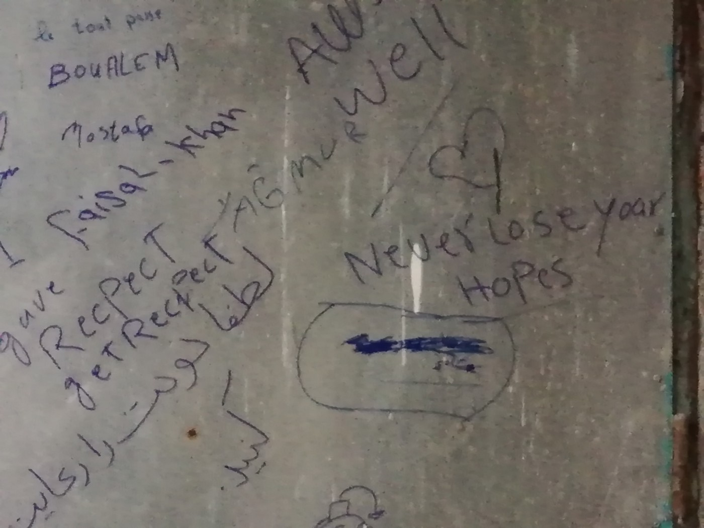

### AYS Daily Digest 01/11/18: Winter is coming: Conditions are only going to worsen on Greek Islands

_October report on Greek islands // Deals between Greece and Germany // New block aids from Croatia // Updates from Serbia and Bosnia // Trials against activists in France // And more news…_
### FEATURE

Winter is on everyone’s mind with the crowded conditions on the Greek islands only getting worse\. [611 people arrived](http://www.ekathimerini.com/234213/article/ekathimerini/news/tensions-mount-in-migrant-camps-on-mainland-too?fbclid=IwAR0kelEJgPpN0ofpK2udGlWeVwBfp5UTKr1ytiLg_Z1rs9Ue2mIKnHOjIbw) on the islands last week while only 495 people were transferred to the mainland\. Alongside growing tensions and a lack of resources in and around the camps, racist attacks against refugees have increased\. Officials on Samos, Chios, and Lesvos have all used extremist language recently\.

One story coming from a refugee on Lesvos this week seems to capture the feeling of helpless refugees on the islands:

> “ [Hello my name Ahmad](https://www.facebook.com/groups/informationpointforlesvosvolunteers/permalink/993457844194996/) \. I have coffee shop in Moria camp\. This week the police come and they tell me I must close my shop\. I am so sad\. They break my shop\. 
 

> I sell coffee so I can live\. We receive only 90 euro a month and all of it go for my medication price\. I feel so helpless\. This shop was my only way of feeling secure now I have nothing\. I sell coffee so I don’t beg or do bad things\. If I can have job I will work all hours but no one hire refugee\.” 

> “Maybe to everyone this looks like it is small story but for us it is big story\. We have nothing really nothing\. We try and try to be positive but it is so hard when everything seems to be against for us\.” 

### TURKEY

[Last week a summit](http://harekact.bordermonitoring.eu/2018/11/01/daily-sabah-on-kartepe-summit-turkey-greece-show-cautious-optimism-in-light-of-summit-on-refugees/?fbclid=IwAR2tJ8hNKl8OuqN5oF8h7_W8vlDNujlKBc5pprHHeHn2pl9SsbSamKMUsF4) on “Migration, Refugees and Humanity” was held in Kartepe, Turkey as a diplomatic opportunity to show how Turkey is handling the refugee crisis\. More cooperation was called for between the Turkish government, Greek government, and EU bodies, and it was agreed that Turkey must consistently re\-evaluate their “successes and failures” in integration policy for refugees\. The summit seemed to be more of a government mouthpiece than a critical assessment of how best to protect human rights\.
### SEA

 **:** “ Nazgul Rahimi from Afghanistan, who was caught as she was trying to cross from Dikili to Greece\.and was turned back to Izmir, holds her baby, who was born inside a coastguard boat\. Open EU borders\!” Photo by Mahmut Serdar Alakuş](assets/83f46dfd36e3/1*z0L1lI2TIOv48fVr51osYg.jpeg)

[**Born at Sea**](https://www.facebook.com/artagainstproject/photos/a.639651369417634/1924532514262840/?type=3&theater) **:** “ Nazgul Rahimi from Afghanistan, who was caught as she was trying to cross from Dikili to Greece\.and was turned back to Izmir, holds her baby, who was born inside a coastguard boat\. Open EU borders\!” Photo by Mahmut Serdar Alakuş
#### Call for donations

Sea\-Watch is in need of donations to keep their ever crucial life\-saving work afloat\! The moral imperative is higher than ever\. Find out more [here](https://www.facebook.com/seawatchprojekt/videos/vb.1578640155687393/245778909436960/?type=2&theater) \.
### GREECE

The Administrative Arrangement between Greece’s migration ministry and Germany’s Interior Ministry has already been implemented across four cases so far\. This means that Germany is fast\-tracking its Dublin returns and denying any legal “safeguards” to the refugees affected\. The document was kept secret for far too long, indicating that the two countries are not interested in transparency and serving the public good\.

](assets/83f46dfd36e3/1*l3JHbTEoCbM4fhRijMQqqQ.png)

Photo by [RSA](http://rsaegean.org/the-administrative-arrangement-between-greece-and-germany/?fbclid=IwAR1xb8fZ0XALlRe4IACNrp3UCvLa_Y69BMBf2791ZFaIPcQWuccjGPEIBvE)
#### New arrivals

New arrivals reported from Aegean Boat Report:

→ [32](https://www.facebook.com/AegeanBoatReport/photos/a.285312485325196/467666510423125/?type=3&theater) people arrived on Lesvos on Wednesday\. No break down issued\.

→ [38](https://www.facebook.com/AegeanBoatReport/posts/468030040386772?hc_location=ufi) additional people arrived on Lesvos on Thursday: 26 children, six women, and six men\.

Highlights from [ABR’s monthly statistics](https://scontent-iad3-1.xx.fbcdn.net/v/t1.0-9/45146222_468074690382307_5837772106238001152_n.jpg?_nc_cat=110&_nc_ht=scontent-iad3-1.xx&oh=69b07cfbc75c658c052e884a28f4c4d0&oe=5C4534AB) from October include 114 boats arriving to the islands in total, with Samos having the most with 43 boats\. 3,222 people were transferred to the mainland in October, yet the total population on the islands remains at 19,601 people\.

**So far in 2018, 24,286 people have arrived to the islands\.**
#### Alarm Phone update

In an update from [Alarm Phone](https://www.facebook.com/watchthemed.alarmphone/photos/a.1526182797655958/2246165792324318/?type=3&theater) of their most recent activity over the last few weeks, they reported: three people dying at sea or in hospitals upon being returned, one shipwreck, and four boats returned to Turkey by the Turkish Coast Guard\.

[On Chios](https://twitter.com/MSF_Sea/status/1058026032874381317?fbclid=IwAR2RVYQL7go_zDbCFMEG3VJNzBe66F_zeU66Vs9wO6KClDA7Dv_Jy-k7Dac) , MSF and MoH are trying their best to vaccinate children and vaccinated over 200 in the last two days\. With conditions worsening, children are more susceptible to disease outbreaks\. MSF is fearing the worst may come without proper vaccinations and with colder weather\.
#### Call for volunteers and donations

Please consider donating or volunteering with this empowering organization as they prepare for the cold, wet winter months to come: [Samos Volunteers](https://www.facebook.com/samosvolunteers/photos/a.567922746719223/1106769256167900/?type=3&theater)
### ITALT

The Mare\-Jonio, the first Italian\-flagged rescue ship to sail in recent years, [today set off](https://www.facebook.com/seawatchprojekt/posts/2137577413126995) for another rescue mission in the central Mediterranean\. The ship is jointly operated by [Mediterranea Saving Humans](https://www.facebook.com/Mediterranearescue/?__tn__=%2CdKH-R-R&eid=ARCtb6McU70SiWChLAxxeewc-yczZA7uz1ppA-dfgEq8pOUXCK01FrtDeCwDlrNRzD4P2Fq44aTJlVzC&fref=mentions&hc_location=group) and Sea\-Watch, and is operating in open defiance of the extremist interior minister, Matteo Salvini, who has attempted to block refugees from disembarking in the country\.
### SERBIA

In an update from [No Name Kitchen in Belgrade](https://www.facebook.com/NoNameKitchenBelgrade/posts/614192328979055) , deportations from Croatia are continuing every day\. The group is preparing to accommodate people with hot water for showers and clothes, especially with the drop of temperatures\. Between 90–100 refugees come to their center per day, where the center can guarantee them one hot meal, bread, and a cup of tea\.

](assets/83f46dfd36e3/1*VkpmO-xKx-l_4vOMKJnoRw.jpeg)

Photo by [No Name Kitchen](https://www.facebook.com/NoNameKitchenBelgrade/photos/pcb.614192328979055/614194892312132/?type=3&theater)
### BOSNIA
#### Update from Velika Kladusa

Many refugees are walking in the area of Velika\-Kladusa, near the Croatian\-Bosnian border, since the police have been preventing people on the move from taking buses\.

Photo Credit: AYS

At the bus station in Kladusa, AYS was told that the police had threatened drivers and others not to sell tickets to migrants\. Such restrictions on the freedom of movement are prohibited by both Bosnian and international law, yet the major NGOs, as well as UNHCR and the IOM have yet to make any statement against these prohibitions\.

In the makeshift camp in Kladusa the situation is getting more difficult\. The rain has turned the ground into mud\. More than 200 people are living here, including many minors who are traveling alone, some women and LGBT refugees, all unprotected\. The IOM and UNHCR, as well as MSF, are aware of this situation, but are doing little to nothing\.

In Bihac many people who are vulnerable are still sleeping outside, waiting to be transferred to one of the recently opened camps\. Refugees in the city were told buses were coming to pick them up three days ago, yet they are still on the street\.

To anyone who is considering volunteering in Bosnia, please be aware that the local population is very active in helping with the situation\. You can find small groups to volunteer with or donate to online, such as [Souls of Sarajevo](https://www.facebook.com/soulsofsarajevo/) \. You can also contact the AYS page if you are interested in volunteering in Bosnia\.
### CROATIA

[The Croatian government](https://m.vecernji.hr/vijesti/hrvatska-stavlja-prepreke-na-jos-13-mjesta-na-granici-1279851?fbclid=IwAR3-v5fS_7jLVCEqkdS9eZ9kYQwl50awdxRNLh4mteXy4yWuNhJdynX3gcU) announced on Wednesday that 13 new locations will receive additional blockage along the border with Bosnia\. The government is trying to prevent “all forms of smuggling\.” These new locations will cover the areas overseen by these four police forces: Sisak\-Moslavina, Dubrovnik\-Neretva, Lika\-Senj, and Zadar\.
### BULGARIA

[28 people](https://www.novinite.com/articles/192903/28+illegal+Migrants+Found+in+Two+Police+Operations+in+Sofia?fbclid=IwAR1eCodAKMHaq7Hwxat1dTmsYgdrleYHD71wbD-slKZJUYEGGd8CMU6nMvQ) were found in police operations in Sofia on Wednesday and taken to closed\-off detention centers\. 15 of them \(14 Afghans and one Pakistani\) were found in one house and the other 13 \(a group of Afghans, Pakistanis, and Iraqis\) were found on a property with the property’s owner, who was also taken in and questioned\.
### FRANCE

On November 11th, the trial against seven activists in Gap, France, is scheduled to begin\. The seven are facing charges for “aiding illegal migration,” due to their involvement in the solidarity march along the French\-Italian border in April of this year\. While a French court determined that those providing humanitarian aid to refugees crossing the border area could not be prosecuted, they determined that those who were found to have assisted or accompanied refugees on border crossings could be\. That finding led to the current charges against the seven activists\.

A solidarity rally is being called for [November 8th at the Gap courthouse](https://enoughisenough14.org/2018/11/01/noborders-gap-france-call-for-mobilization-solidarity-is-not-a-crime/?fbclid=IwAR2TJGrSORoZhkBLQKFWt6dpmn9Qvy3JLzM6H-JaVZ5vGX1uNfcp695lOPo) \. While this case against the activists is getting some attention, it is not activists but refugees who face the brunt of legal charges in this area\. As the organizers of the demonstration wrote, “the main victims of this violence are people in exile who are subject to imprisonment and legal issues related to their residence permits\. Discrimination based on appearance/skin colour, allegations of theft, violent attacks, threats of firearms and intimidation are part of their everyday lives\.”

A solidarity fundraiser for the Gap 7 will be held in Paris on November 3rd and 4th\. Find the details [here](https://www.facebook.com/events/179355346285184/) \.
#### Dunkirk police confiscate a child’s wheelchair

 \. “I met Siya a few months ago, a notable and sweet girl who races over to you in her wheelchair\. Meeting her once means you’re fast friends in her eyes\. I had hoped I wouldn’t see her again in the Dunkirk camp as it’s being continuously cleared, and the situation is more desperate and insecure than ever\. But there she was, yesterday in the drizzle, a big beaming smile throwing her arms out for a hug\. Smiling, she offered me some of her dinner\. But she was no longer able to race towards me for a hug as her wheelchair was nowhere to be seen\. Instead a pushchair is Siya’s mode of support as, according to her family, her wheelchair was ‘cleared’ by authorities\. How does this sweet young girl find time to smile and to offer what little food she has, when her situation is getting worse?”](assets/83f46dfd36e3/1*LqerUPQOCQcazOCw_YGXOQ.jpeg)

Photo Credit: [Care 4 Calais](https://www.facebook.com/care4calais/photos/a.1046164975416459/2162102387156040/?type=3&theater) \. “I met Siya a few months ago, a notable and sweet girl who races over to you in her wheelchair\. Meeting her once means you’re fast friends in her eyes\. I had hoped I wouldn’t see her again in the Dunkirk camp as it’s being continuously cleared, and the situation is more desperate and insecure than ever\. But there she was, yesterday in the drizzle, a big beaming smile throwing her arms out for a hug\. Smiling, she offered me some of her dinner\. But she was no longer able to race towards me for a hug as her wheelchair was nowhere to be seen\. Instead a pushchair is Siya’s mode of support as, according to her family, her wheelchair was ‘cleared’ by authorities\. How does this sweet young girl find time to smile and to offer what little food she has, when her situation is getting worse?”

**We strive to echo correct news from the ground through collaboration and fairness\.**

**Every effort has been made to credit organizations and individuals with regard to the supply of information, video, and photo material \(in cases where the source wanted to be accredited\) \. Please notify us regarding corrections\.**

**If there’s anything you want to share or comment, contact us through Facebook or write to: areyousyrious@gmail\.com**

_Converted [Medium Post](https://medium.com/are-you-syrious/ays-daily-digest-1-11-18-winter-is-coming-conditions-are-only-going-to-get-worse-on-greek-islands-83f46dfd36e3) by [ZMediumToMarkdown](https://github.com/ZhgChgLi/ZMediumToMarkdown)._
