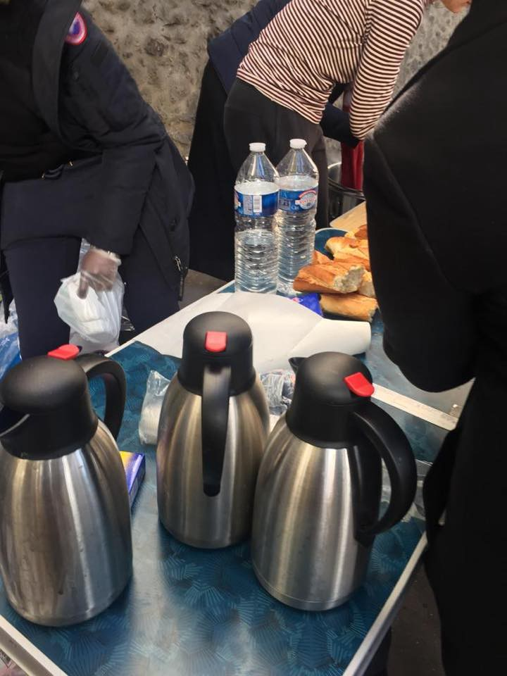
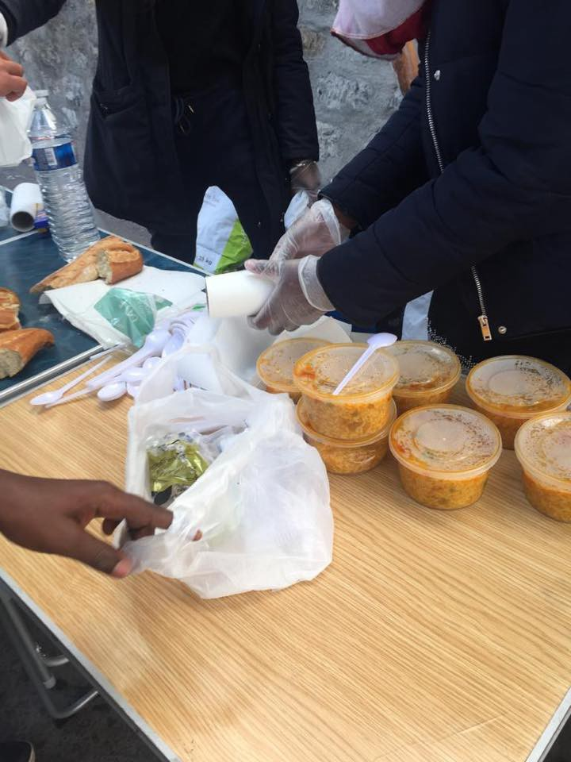

### AYS Daily Digest 05/11/18: Ventimiglia echoes Balkan route issues
#### Overwhelming work of the volunteers in the Ventimiglia area / African embassies in Morocco ignoring their duty to help families of deceased refugees / Worrying conditions for refugees in Greece and Bosnia and Herzegovina ahead of winter / sketchy details of the initial migration compromise deal between Greece and Germany / 19,755 people in need of international protection currently staying on Greek islands / UK: protest announced in front of the detention centre Yarl’s Wood / more news

 , author not stated](assets/67cd0a92b50/1*LtnvKSvDvmsgmR5w_QBemQ.jpeg)

Spanish civil guard preventing crossings from Morocco — Photo source: [Association Marocaine des Droits Humains — Section Nador](https://www.facebook.com/AmdhNador/?tn-str=k%2AF&hc_location=group_dialog) , author not stated
#### FEATURE

Imminent pressure on activists and volunteers in the Ventimiglia area is present through various small, yet important issues\. Along with the formal big organizations who are splitting the humanitarian ‘cake’ in the area, since the start of the crossings and the development of a crisis, many activists and organizations have provided crucial support for the people who found themselves in Ventimiglia\. Now, as the Eufemia centre, the info point in the city that is managed by activists, has not had its contract renewed, it is unclear what the fate of this longstanding initiative will be as it is bound to close\. Another meeting point where the refugees and migrants could actually feel appreciated and welcome, the Bar Hobbit, is also constantly threatened with closure\.

Pushbacks from the French side to Italy in the area of Ventimiglia are a constant thing, volunteers report\. Routes have changed and so has the ratio of the countries of origin of the people arriving, as there are fewer people coming who arrived in Italy by boat and more of those coming from the east\. They mostly originate from Afghanistan, Pakistan, Iran, etc\. and speak of experiences lived throughout the route, having recently passed through Bosnia and Herzegovina, Croatia and Slovenia\. Along with stories and testimonies the volunteers hear from the people, there are more and more [press](https://www.lastampa.it/2018/11/02/italia/caricati-a-forza-nei-furgoni-cos-la-polizia-italiana-riporta-i-migranti-nei-balcani-K775KFcYpdofE4r0eNJTFI/premium.html?fbclid=IwAR2Xt_CkEn6wyMEkC4F9hwNM-D8-2Aee8_9Utccy8Wpd4zBj0FUJ0ThXVpQ) reports about the mistreatment those people have faced along the way\.
The activists on the ground estimate that about a hundred people are staying there\.

They speak of the police who usually patrol in large numbers, collecting the people gathered in the area and taking them to the Red Cross camp, sometimes even if the people have the documents to prove they have been provided other accommodation\. The aim seems to be to get those people off the streets and public spaces\.

According to a statement from a local volunteer, two independent volunteers who have been monitoring and documenting the expulsions at the border area in Ventimiglia had their photo equipment taken away by the police, who also interrogated them\.
#### LEBANON

The practice of the Lebanese government of returning Syrian refugees to Syria has come under strong criticism, with over a dozen returnees having disappeared\.

■■■■■■■■■■■■■■ 
> **[Gerry Simpson](https://twitter.com/GerrySimpsonHRW) @ Twitter Says:** 

> > Lebanese refugees official says at least 20 refugees recently returning to Syria have been killed by pro-government forces, underscoring why Lebanon should reverse policies driving Syrians back home [bit.ly/2P9PfxJ](https://bit.ly/2P9PfxJ) @HRW [bit.ly/2KwjvAg](https://bit.ly/2KwjvAg) https://t.co/oWZiOGCUzm 

> **Tweeted at [2018-11-05 11:18:25](https://twitter.com/gerrysimpsonhrw/status/1059404561943851010).** 

■■■■■■■■■■■■■■ 

#### MOROCCO

[Association Marocaine des Droits Humains — Section Nador](https://www.facebook.com/AmdhNador/?tn-str=k%2AF) reports that the families of missing and deceased refugees encounter a lot of difficulties when trying to find out the whereabouts of their loved ones or when they want to transport the body of a deceased family member back home\. According to the AMDH team, the embassies of the Sub\-Saharan countries involved make no effort in helping with this issue\.

](assets/67cd0a92b50/1*XH22QliTAZGGrtF_QjYc_A.jpeg)

Photo: [Association Marocaine des Droits Humains — Section Nador](https://www.facebook.com/AmdhNador/?tn-str=k%2AF)

> “They do everything to deport living migrants from Morocco back to their country, but when it comes to death, they pretend not to know anything\.” 

 team](assets/67cd0a92b50/1*EufidR6jWSo9VmHFeeLzjA.jpeg)

They warn of many disappearances, including these two girls who went missing in October\. Any information on their whereabouts should be forwarded to the [Association Marocaine des Droits Humains — Section Nador](https://www.facebook.com/AmdhNador/?tn-str=k%2AF) team

A 37\-year\-old Malian citizen was arrested on suspicion of involvement in organizing illegal immigration\. He was suspected of involvement in illegal immigration operations for sub\-Saharan African citizens, including the June 12, 2018 operation, in which 43 of those attempting to cross died and four others were rescued after the sinking of the rubber boat that they were on board of near the Spanish coast\. The National Judicial Police Division has opened a judicial investigation, investigating the links to the smuggling network both inside and outside Morocco, [local reports](https://m.nadorcity.com/%D8%A7%D9%84%D8%B4%D8%B1%D8%B7%D8%A9-%D8%AA%D9%84%D9%82%D9%8A-%D8%A7%D9%84%D9%82%D8%A8%D8%B6-%D8%B9%D9%84%D9%89-%D9%85%D9%88%D8%A7%D8%B7%D9%86-%D9%85%D8%A7%D9%84%D9%8A-%D9%85%D8%AA%D9%88%D8%B1%D8%B7-%D9%81%D9%8A-%D9%88%D9%81%D8%A7%D8%A9-43-%D8%AD%D8%B1%D8%A7%D9%83%D8%A7-%D8%A8%D8%B3%D9%88%D8%A7%D8%AD%D9%84_a69858.html?fbclid=IwAR0F7iRBq1gBS2B-L03kDFeI6TofndHgkc1PPEzusFtb-gPDJeyA5_RFi04) say\.
#### SEARCH AND RESCUE AT SEA

■■■■■■■■■■■■■■ 
> **[Sea-Watch](https://twitter.com/seawatchcrew) @ Twitter Says:** 

> > #MareJonio has left Lampedusa for the SAR area where it continues its mission of monitoring and reporting in the #CentralMed. #ready2rescue https://t.co/cvHtET773f 

> **Tweeted at [2018-11-05 15:16:09](https://twitter.com/seawatchcrew/status/1059464391207383045).** 

■■■■■■■■■■■■■■ 

516people were saved from 11 boats off of Spain on Sunday\.

■■■■■■■■■■■■■■ 
> **[SALVAMENTO MARÍTIMO](https://twitter.com/salvamentogob) @ Twitter Says:** 

> > Balance hoy. Mar de Alborán. 2 pateras. Guardamar Polimnia: 80 personas rescatadas con vida y 13 fallecidos. Trasladados a #Melilla. 
4 personas rescatadas por Salvamar Atria #Ceuta
#CañosdeMeca patera naufragada, @[guardiacivil](https://twitter.com/guardiacivil) recuperó 4 cadáveres y se hizo cargo de 22 hombres 

> **Tweeted at [2018-11-05 19:57:33](https://twitter.com/salvamentogob/status/1059535208607870977).** 

■■■■■■■■■■■■■■ 

#### GREECE
### Islands

According to the latest national statistics of the Ministry of Citizen Protection of Greece, there are: 9,538 people on Lesvos, 2,473 on Chios, 5,288 on Samos, 966 on Leros, 1,376 on Kos and 114 on other Greek Aegean islands, making that **19,755** people in search of international protection currently staying on Greek islands\.
### Dire sanitary conditions

C\.E\.S\.R\.T\. identifies one of the main problems, that of a swamp\-like area with still waters that pose a threat of epidemics and various diseases\. They have decided to place gravel and create a ditch for water\.

](assets/67cd0a92b50/1*twywLzKN8cZlZlDIu8F-ew.jpeg)

Photo source and credits: C\.E\.S\.R\.T\. / [www\.politischios\.gr](http://www.politischios.gr)

During the summer of 2016, similar conditions in the mainland part of Greece, next to the refugee camps that AYS [reported about](ays-19-8-malaria-unofficially-confirmed-in-sindos-frakapor-camp-7a2b45cd64b3) , led to the spreading of malaria\-like symptoms and other health problems widespread among the people in the camps at the time\.

Spending over 2,000 euros, they supplied pallets, which they distributed to immigrants from VIAL\. to be used as floors on which tents would be placed\.
### School issues

As we wrote before, on the Greek islands, the educational situation is particularly dire\. The isolation of the hot spots — combined with a lack of public transportation and [local hostility](http://www.ekathimerini.com/233298/article/ekathimerini/news/chios-parents-oppose-refugee-kids-at-school) to the idea — makes it nearly impossible for refugees to attend school\. Action for Education, the only independent educational organization on Chios and the reason that countless refugee children and young adults have been able to attend school while stuck on the island, is in need of support\. Find out how to give a hand [here](https://www.facebook.com/ActionforEdu/posts/777141519298566) \.

[Lesvos Solidarity — Pikpa](https://www.facebook.com/pikpalesvos/?tn-str=k%2AF) provides vaccinations for children so they can attend Greek school\. “Help us with keeping on providing vaccinations to children in need by supporting our campaign\.” — Their campaign starts on November 27
### Work regulations

[Mobile Info Team for refugees in Greece — الفريق المتنقل لمعلومات اللاجئين](https://www.facebook.com/mobileinfoteam/?__tn__=%2CdkCH-R-R&eid=ARBHDVjeYo4SD97UEUXiSpbHoXXVAnCZIdd4vBWv9Fh3khLBQWdtOzwbMDcmme7nt0PMY1fGySdqLIwm&hc_ref=ART4Q0PN1BNJpADDsI5obo0t1eZvdV2qVhnyYN3_QlKHkQoUGQ35iNA4lqOXkp0foqk&fref=nf) points out that in order to be able to work in another European country, you must obtain a working visa\. Every country has different requirements for this\. So you first need to check if you are able to meet the requirements for a working visa in the country you want to work in\. For example, some countries require that you already have a signed job contract, proof of a accommodation where you will stay, or proof of skills in the country’s language\. If you have higher qualifications, like a university degree, your chances might increase\. When you are sure you meet the criteria and you have all the required documents, you can apply for an appointment with the embassy or consulate of the country you want to work in\. The processing time for a working visa is normally between 6 and 12 weeks after all documents are handed over\. If you are able to get a working permit, it is in most cases valid for one year, with the possibility of renewal\.

](assets/67cd0a92b50/1*O5XiNpTQ_DVs6xJF8KqdWA.jpeg)

Creative reuse fashion workshop’s team needs contribution — [Victoria Square Project](https://www.facebook.com/VictoriaSquareProject/?tn-str=k%2AF)

### Arrangement between Greece and Germany: A tale of “paraDublin activity”

In mid\-August 2018, [Germany, Greece and Spain agreed](https://www.reuters.com/article/us-europe-migrants-germany-greece/germany-reaches-deal-on-sending-back-migrants-to-greece-idUSKBN1L21GV) on the **sketchy details** of the initial **migration compromise deal** that was reached on the sidelines of the EU Summit in Brussels late in June 2018\. Stathis Poularakis, Legal advisor — Advocacy Officer Médecins du Monde in Greece **explained it [here\.](http://www.asylumlawdatabase.eu/en/journal/case-administrative-arrangement-between-greece-and-germany-tale-%E2%80%9Cparadublin-activity%E2%80%9D?fbclid=IwAR2RcUagNyhSVVjP-W2Q2WckhRv4xUzpq1F8KdvWcDGPyOeMMgJDYMo_Alc)**
#### BOSNIA AND HERZEGOVINA

The situation in Sarajevo has not changed much\. As we reported earlier, there are over 450 people living in the camp at Ušivak, which is the camp’s full capacity, and it is difficult to tell the exact numbers as the people reportedly enter in different points and ways\. Some are still in the streets or provisional lodging\. 
Some of the people on the move seem to have found ways to move towards the part of the country bordering with Croatia \(EU\), even with the blockade and all the restrictions in the north that were introduced due to recent protests and the surge of arrivals claimed by the officials\.

 , we are able to distribute warm sweaters and jackets during our daily evening distributions\. Additionally, on shower days, people can exchange their shirt and pants, or give their personal laundry to us\. The amounts of humble thank you’s we’re receiving shows us how appreciated this is\.” — [BASIS Bosnia](https://www.facebook.com/BASIS-Bosnia-1487914718006023/?__tn__=%2CdkCH-R-R&eid=ARDISNGvzO7rFFLcxkc_wb70AekeH8AqBXHoVsLPuYQe0Laeg7XKL_1q59mzTG3DLNoCVDtLj-Ouy3oX&hc_ref=ARQw3DvlgIkOvmTLedFMMEwyMTqPpFr6P419pZrWhmfZz8MqVb4j45azFuGTxe_xaUU&fref=nf&hc_location=group)](assets/67cd0a92b50/1*J_lQHky41u3UPZmXaa4fsw.jpeg)

“People on the move arriving in Bosnia are often badly prepared for the weather conditions they find in the country\. Every day we meet people in the streets in only a t\-shirt and shorts\. As temperatures are dropping more and more, warm clothes are crucial and the needs are increasing\.
Thanks to the never\-ending stock of the local charity [Pomozi\.ba](https://www.facebook.com/pomozi.ba/?__tn__=%2CdKH-R-R&eid=ARBY_a-ZwMsS6-h0p3dTialUaxf790izWZLmN3aZen6U6E5vo23rad-WxI180GzmxLu9M46PYnqvyhnl&fref=mentions&hc_location=group) , we are able to distribute warm sweaters and jackets during our daily evening distributions\. Additionally, on shower days, people can exchange their shirt and pants, or give their personal laundry to us\. The amounts of humble thank you’s we’re receiving shows us how appreciated this is\.” — [BASIS Bosnia](https://www.facebook.com/BASIS-Bosnia-1487914718006023/?__tn__=%2CdkCH-R-R&eid=ARDISNGvzO7rFFLcxkc_wb70AekeH8AqBXHoVsLPuYQe0Laeg7XKL_1q59mzTG3DLNoCVDtLj-Ouy3oX&hc_ref=ARQw3DvlgIkOvmTLedFMMEwyMTqPpFr6P419pZrWhmfZz8MqVb4j45azFuGTxe_xaUU&fref=nf&hc_location=group)

You can read some individual stories and accounts of border violence in the area of Velika Kladuša in a [report](illegal-push-backs-and-border-violence-report-e5741e95f835) that was prepared by volunteers gathered in different activist initiatives active in Kladuša who work directly with people on the ground\.
#### ITALY
### Lampedusa — worst sanitary conditions due to bureaucracy

They call them “the baths of Bartolo”, because after years of struggle Dr\. Pietro Bartolo had managed to get them placed\. Bartolo pleaded with the Prime Minister of the time, Matteo Renzi, and the toilets and bathrooms were soon built, for men, women, and the disabled\. They work perfectly, and are comfortable, the lighting system is active, the ventilation is compliant with the law\. But they have never been opened despite the July 2017 test\. The cooperative of Palermo that manages the center for migrants \(a few kilometers from the pier\) has been assigned the keys, but [reportedly](https://www.avvenire.it/attualita/pagine/migranti-lampedusa-manca-appalto-bagni?fbclid=IwAR21cUUfrMs7D_ffKSRFB8HAFfeFwuBI4-v8NgdzKPq7VWot65WagqLz9kM) , without a contract for maintenance they can not make them available to those who disembark\.

Asylum seekers have been taken out of the SPRAR system and deprived of the right to apply and access a series of entitlements, such as the national health service etc\. These are just a few of the things embodied as decisions in the infamous ‘ [Salvini decree’ we previously wrote about](ays-daily-digest-24-9-2018-the-so-called-salvini-decree-under-debate-as-sources-say-it-could-be-9543946a2671) , which will be the central topic of a meeting intended to discuss, explain and form objectives at the event announced for November 13\.

### Brindisi — African community

In a dormitory on the provincial road to San Vito, an African community was officially voted on and set up to give representation to migrants of eight different nationalities \(Mali, Gambia, Costa Ivory, Ghana, Burkina Faso, Sénégal, Nigeria, Guinea Conakry\) living in Brindisi\.
„We will make a census of guests in possession of a contract and ready to guarantee a monthly rent fee, so as to free useful places inside the dorm, trusting the confidence of the Brindisi who will want rent the houses to our boys,” t [he representative said](http://www.brindisireport.it/cronaca/nasce-la-comunita-africana-va-migliorata-la-gestione-del-dormitorio.html?fbclid=IwAR1y249D1UATIPwqAmLAGUAaPughXGVujled2o7gsyiNbuJGnGKAlkt5nhA) , referring to the current issues with overcrowded accommodation capacity and other issues of concern in Brindisi\.
#### FRANCE
### Paris

](assets/67cd0a92b50/1*wAETcMSMVKIerZZW-Pq-iA.jpeg)

More and more young people come to meals, ask questions and take advantage of this pleasant time when every volunteer is listening and ready to help… the 10 liters of tea were distributed in 20 minutes … as well as boiled eggs, fruits, bread, sweets … — Photos: [SAJE soutien et accompagnement des jeunes en exil](https://www.facebook.com/lesajeparis/?tn-str=k%2AF&hc_location=group_dialog)

Hot meal distribution will be organized for supper on Tuesday, **November 6** , at **19:45h at the l’Église Saint Geneviève** situated at the address:139 avenue du Président Wilson 93210 La Plaine Saint Denis

If you can take part, check here: [https://www\.lepotcommun\.fr/pot/tusyjrwc](https://www.lepotcommun.fr/pot/tusyjrwc?fbclid=IwAR0kzaBZ5vbJIp_kWpdnWl1Ip95MppH6_2R6hMJpX3Lo16sWGHPssVFmOQQ) and/or contact the [Solidarité migrants Wilson](https://www.facebook.com/Solidarit%C3%A9-migrants-Wilson-598228360377940/?__tn__=%2CdkCH-R-R&eid=ARDTFo6mZdRGV9LthXFVpKF6kgSj0rjOGZ3tR9pQm_MTcZ99O_Og2F89gR5ButhplxOVBRXU3tiG3aJ8&hc_ref=ARRrSxtztk5TdQeI4mDKbVAk3eQVxY0SKvbN3_3LKwp-56EeWvhi8tzi_J3sAulG850&fref=nf)

](assets/67cd0a92b50/1*5P3hLd4rtnrFo3gVLYvASg.jpeg)

[Chez Jesus — Rifugio Autogestito](https://www.facebook.com/Chez-Jesus-Rifugio-Autogestito-362786637540072/?tn-str=k%2AF)
#### GERMANY

The entire procedure and treatment of a pregnant woman and her one\-and\-a\-half\-year\-old son, Iranian asylum seekers, is to be examined, the county councillor of Mainz\-Bingen said, after the woman had been taken from a hospital during the night and, along with her husband who was brought from a detention centre, was destined to be flown back to Croatia, on account of having registered there the first time she entered the EU \(Dublin regulation\) \. After she refused to get ready, pack and get on board the plane and the pilot refused to fly them on board his flight, the woman was left alone with the child at a train station, having paid a fine of 100 euro, the [media report](http://m.faz.net/aktuell/rhein-main/kranke-schwangere-soll-abgeschoben-werden-15875583.amp.html?GEPC=s33&__twitter_impression=true&fbclid=IwAR2XrJT2DE1izQE1rp4L---A8yY_XjouDiBbpTMAqghUjpwZHxvmEa1NOnw) \.

The Ministry of Integration stresses the great importance of the ‘special humanitarian situation of the affected family’, said a spokesman on Monday, “especially since the affected pregnant mother is in need of good medical care because of her diabetes\.”
The rejection of the asylum application by the Federal Office for Migration and Refugees was, according to his statements, based on the Dublin rules, and a possible persecution of the family in Iran was therefore not examined\.
#### UK

As is well known, a miserably small number of children have been admitted to the UK and Lord Dubs, along with other refugee and children’s rights organizations, has demanded strong implementation and presented a petition on safe passage\.

■■■■■■■■■■■■■■ 
> **[Choose Love](https://twitter.com/chooselove) @ Twitter Says:** 

> > We've been at Parliament this morning with @[AlfDubs](https://twitter.com/AlfDubs) and @[safepassageuk](https://twitter.com/safepassageuk) to deliver 33,000 signatures calling upon the government to provide 10,000 spaces for child refugees over the next 10 years #chooselove https://t.co/PmmbnA8FLl 

> **Tweeted at [2018-11-05 11:58:03](https://twitter.com/helprefugees/status/1059414536908931073).** 

■■■■■■■■■■■■■■ 

As [we reported several times before](ays-daily-digest-22-02-18-unjust-detentions-in-the-uk-d3dec23ffc04) , detention in the UK is based on dubious decisions and practiced in inhumane conditions in centres such as Yarl’s Wood\. Another demonstration against such practices and the system is taking place on December 1\.

**We strive to echo correct news from the ground through collaboration and fairness\.**

**Every effort has been made to credit organizations and individuals with regard to the supply of information, video, and photo material \(in cases where the source wanted to be accredited\) \. Please notify us regarding corrections\.**

**If there’s anything you want to share or comment, contact us through Facebook or write to: areyousyrious@gmail\.com**

_Converted [Medium Post](https://medium.com/are-you-syrious/ays-daily-digest-05-11-18-ventimiglia-echoes-balkan-route-issues-67cd0a92b50) by [ZMediumToMarkdown](https://github.com/ZhgChgLi/ZMediumToMarkdown)._
