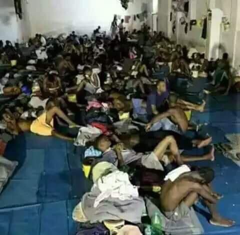
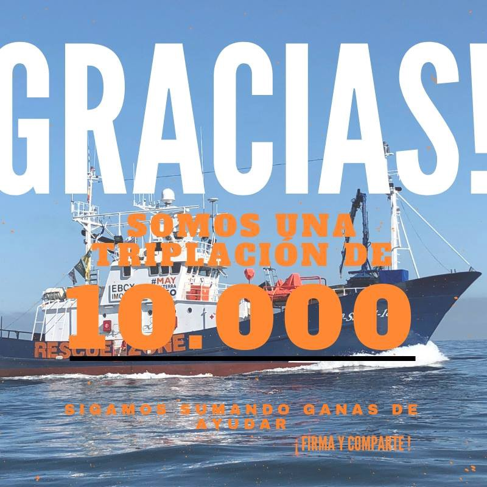
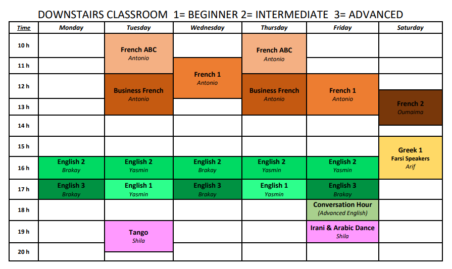
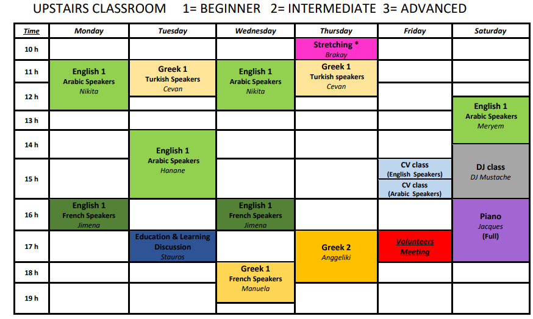
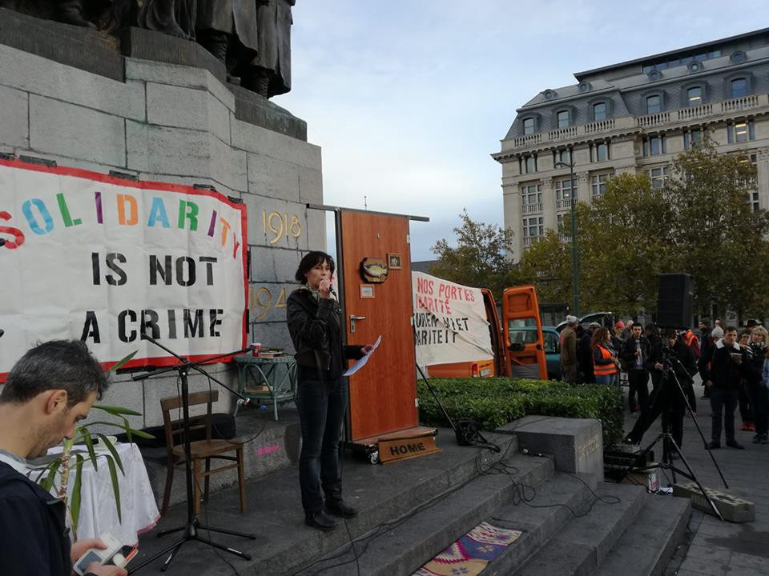
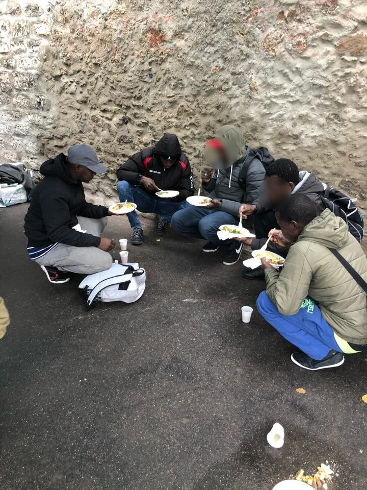
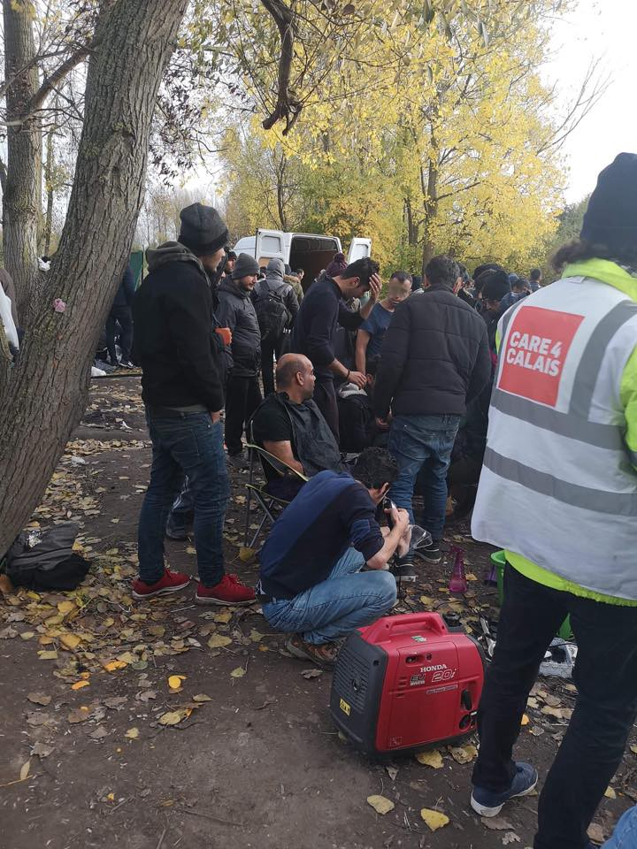

### AYS Dialy Digest 07/11/2018 — Riace: What happens now?

Dire conditions at Al Fuhraji detention centre in Tripoli, Libya /// Distress calls blacked out in the Central Mediterranean /// Baobab Experience faces sudden eviction /// Briancon7 on trial /// Report from prison psychiatric hospital in Athens /// \#Righttohelp demonstrations in Brussels /// Updates from Calais and Dunkirk

 
[\#noborders](https://www.facebook.com/hashtag/noborders)](assets/3fe4327ffaf2/1*xT60zxHE2osSaJuj_NjSIg.jpeg)

Lesvos, Greece November 2018: Photograph of an abandoned building which was turned into an informal settlement for refugees situated right next to Karatepe camp in Lesvos\. Part of a photographic project “Lesvos behind the main scene”\. Photograph by Ellevoros As / [Actually Exıstıng Dystøpıa](https://www.facebook.com/AEDystopia/?__xts__%5B0%5D=68.ARBk-5NNYqq8R3AKtX7ttw0DmBfcwLoUaZWQuPjGMqe7CbSC40O1oDKiPf2ok6OVzecPc25pJ7ROhFXRBQcDMYWXl5ikXkZMZFFNTEGNPLBqMc8zcDCEOYzxavuFiNLfdENzMVFgLAqmUq9TJMO7EbbZKNyXHC8z2e7zRw7CdqhL49WMnHOqEEUovdxqpAa_6W38A1xvhvwhnNEMxYHI5ny6lRI&__tn__=%2CdK%2AF-R&eid=ARB1OScYrobfwKSchJwC5-0vbjcoMxxQ2NVwRm8lsZj_XgW_xFe2yY320FBbuKMJFNKZLbUyUeIGRQAX) 
[\#noborders](https://www.facebook.com/hashtag/noborders)
#### **Feature — Riace: what happens now?**

Since the arrest of the mayor, Mimmo Lucano, many people and organisations in Italy and beyond have shown their solidarity for his unfair incarceration\. Much less has been [said](https://twitter.com/JigginoRuss/status/1060072014206169089) about the future of the people who were hosted in the reception system of the town which has been shut down\.

On 5 November the official statement about the transferal of the asylum seekers hosted in Riace was made by the Interior Ministry\. Seventy\-six people who are currently residing in the town will have to leave their accommodation\. As authorities reiterate: transfers are voluntary and not forced\. This means that people accept being transferred to the SPRAR of Roccabernarda, around 150 km away\. If they refuse, they will find themselves without accommodation and out of the reception system\. Whatever they choose they will have to leave what was their home for the last few months or years\.

Asylum seekers have protested several times in the last weeks, asking for answers about their future and the lack of food and services following the interruption of funds as decided by the ministry\. As a response, the vice mayor of Riace, Giuseppe Gervaso, who is now in charge after the arrest of Lucano, wrote a formal letter to the Interior Minister, asking to speed up the transfers and accusing the asylum seekers of violent protests\.

Mimmo Lucano, \#Briancon7, \#Rescueisnotacrime, \#Righttohelp… \. We must show our solidarity for those Europeans who fight against criminal European policies, but we must never forget the plight of asylum seekers who have less recourse to legal support, safety and services\.

TURKEY
#### **New Films in Turkish from Refucomm**

> Our films show the reality and explain the difficulties facing asylum seekers to Greece, not with an intention to stop them from coming—that will not happen—but with the intention of giving them realistic expectations and the truth\. We’ve seen the disappointment on people’s faces when they arrive, we’ve seen their faces and heard their words when the reality hits home\. When they see where their children will live and residents of the camps tell them what to expect\. It’s one of the issues that drives what we do\. 

These films are available in English, Arabic, Farsi, French, Sorani, and Kurmanji at [www\.refucomm\.org\.](http://www.refucomm.org.)
#### **Volunteers needed in Istanbul**

Asylum Links are looking for a p [roject co\-ordinator](https://v4r.info/task.list.php?ID=663&fbclid=IwAR2hdsniZP96S-k7ZgLMOAByE27OP8rtJSDP1pZvevF2okq__MwFVVFNx_Q) and a [volunteer](https://www.facebook.com/groups/infopointforturkeyvolunteers/permalink/699351350436176/) to join them in Istanbul for some field work\. Asylum Links is an information outreach channel for refugees that provides accessible and reliable information to help refugees consolidate their rights\. They are looking for someone who can be available between the middle of November to the start of January\.

Please be in touch via charlotte\.thornton@asylumlinks\.eu for more information\. Thank you\!

LIBYA
#### **\#GetThemOut \! Emergency in Al Furhaji Sebha detention centre in Tripoli**

From [human right lawyer Giulia Tranchina](https://www.facebook.com/rastajuly/posts/10156232910893621) :

 \)](assets/3fe4327ffaf2/1*SgYB6gkWHfqtsNcIUTm-AA.jpeg)

Asylum seekers in Al Furhaji Sebha detntion centre \(photos by [Giulia Tranchina](https://www.facebook.com/rastajuly/posts/10156232910893621) \)

> URGENT APPEAL\! The emergency at Al Furhaji Sebha detention centre is ongoing\. \#GetThemOut \! \! Over 230 Eritreans including 56 minors are starving and sick\. After MSF and IOM brought some “take away” food, distributed individually, over the last three days, the Libyan police consistently refused to give them any food in the evening and left them with no food at all today, as no organisation visited\. 

> Yesterday the police threatened the detainees to tell IOM that they did not like the “take away” food and to lie to IOM that they would prefer the food to be prepared by the police there and then handed out\. This is obviously meant to allow the police to exercise control, decrease and divert food from the detainees\. The detainees are very brave and told IOM the opposite\. They told IOM about the police threats and what they had been instructed to say\. IOM members then spoke to the police separately and left\. 

> The police were very angry and abused the detainees\. 

> They are in a terrible condition and losing hope\. 

> They are now asking us for as much help and publicity as possible\. 

> Please write to UNHCR Libya, IOM Libya and MSF on messenger, on twitter and by email to ask to please prioritise the evacuation of this vulnerable group of Eritreans in Al Furhaji Sebha detention centre in Tripoli who are at the mercy of abusive Libyan police officers\. 

> Use the hashtag \#GetThemOut \! \! \! Let’s try to help them\! \! 

MOROCCO

[Association Marocaine des Droits Humains — Section Nador](https://www.facebook.com/AmdhNador/?__tn__=%2CdkCH-R-R&eid=ARArElrHu_xugnc0sstTFeYLtXMgSqi02jFC4MiwaF1-AJClGQP4kYpVV2YRgr-nAZwXM82rSbvVB32U&hc_ref=ARQtXoFAc8_bR-j8YndlHQ5Hj49TwxMRO2hYa7GolJiRP1DGOchbXQekQ3mJT27zX1o&fref=nf&hc_location=group) reports that The Nador Detention centre is currently holding nearly 40 sub\-Saharan migrants pending deportation to their countries\.

> All deportations are based on EU funding\. 

> \[…\] 

> Violations against migrants have reached unacceptable limits by Spain and Morocco, which act in this case as non\-Rights States\. 

SEA
#### **Distress calls blacked out in the Central Mediterranean**

According to Italian [media](https://www.avvenire.it/attualita/pagine/in-un-giorno-salpati-600-migranti-40-morti) , during the last few days, distress calls from boats carrying refugees were hidden to commercial and rescue boats by Italian, Libyan and Maltese Coastguards\.

■■■■■■■■■■■■■■ 
> **[Open Arms ENG](https://twitter.com/openarms_found) @ Twitter Says:** 

> > The Maltese Navy rescued 149 people 60 miles from Valletta. They silenced arrivals in Lampedusa and Malta, but people keep fleeing Libyan hell, and they need much more gasoline to leave the Libyan SAR zone now. There are many more risks without witnesses.
https://t.co/Yzo4G6ZKJt 

> **Tweeted at [2018-11-07 09:51:13](https://twitter.com/openarms_found/status/1060107393495982081).** 

■■■■■■■■■■■■■■ 

Both ministers Toninelli and Salvini confirmed that hundreds of asylum seekers were brought back to Libya on Wednesday by the Libyan Coast Guard\.

146 people were rescues by the Maltese navy\.

> This is proof that there is a direct line between maritime authorities of different countries, but operations are hidden from the boats at sea \(such as commercial ships\) which could participate in the rescues and save human life\. 

■■■■■■■■■■■■■■ 
> **[Sara Creta](https://twitter.com/saracreta) @ Twitter Says:** 

> > Yesterday 315 people have been intercepted &amp; brought back to #Libya. 116 arrived in #Zawiyah, now held in al-Nasr center + 199 in #Alkhums. Among them 32 women + 7 children, also a 15-year old from #Somalia with a burn on her leg caused by fuel. [alwasat.ly/news/libya/225…](http://alwasat.ly/news/libya/225708) 

> **Tweeted at [2018-11-07 13:59:18](https://twitter.com/formicasara/status/1060169826637877257).** 

■■■■■■■■■■■■■■ 

This comes during the same days when the death toll of European border policies on the Mediterranean reached 2,000 people in 2018\. While more people are reaching Spain \(48,000\) than Greece \(27,000\) or Italy \(22,000\), the [most lethal route](https://twitter.com/cartadiroma/status/1060154908480102401?fbclid=IwAR3V7V1WE2KRS8dVwDExYzFXqWpqXz2R15KANpluCodvq9f_MitO9c236Qg) is the Central Mediterranean, claiming more than half of the lives lost at sea\.

**Rescues in the Western Mediterranean**

■■■■■■■■■■■■■■ 
> **[SALVAMENTO MARÍTIMO](https://twitter.com/salvamentogob) @ Twitter Says:** 

> > Pateras 20.30h. Estrecho: Luz de Mar rescató 2 pateras con 43 y 42 personas. (Vídeo de uno de estos rescates)
Alborán: SAR Mastelero está trasladando a #Almería a 34 personas de una patera que llegó hasta la isla de Alborrán. https://t.co/I1jxXC1EcC 

> **Tweeted at [2018-11-07 19:51:20](https://twitter.com/salvamentogob/status/1060258417812611073).** 

■■■■■■■■■■■■■■ 

**10,000 Signatures for Maydayterraneo — Proyecto Aita Mari**

The petition to allow a new SAR vessel in the Mediterranean Sea reached 10,000 signatures\.

Sign [here](https://www.change.org/p/dejad-zarpar-nuestro-barco-de-rescate-ni-una-muerte-m%C3%A1s-en-el-mediterr%C3%A1neo?fbclid=IwAR2gdNgIsZljLjXktDHSCR_l-E7cWOgrSAn8yQxhnzf3z_YwifD35pRd3lQ) \.

GREECE
#### **Arrivals**

[Aegean Boat Reaport](https://www.facebook.com/AegeanBoatReport/) report that four boats landed on the Greek islands on Wednesday:

A first boat was picked up by HCG outside Farmakonisi, at 11:50 pm\. It was transported to Leros and carried 26 people\.

A second boat landed north of Kalavarda, Rhodes north west, at 3:50 am\. The number of people not confirmed\.

A third boat is reported to have been picked up outside Cyprus, northwest\. It carried 36 people\.

The fourth boat landed on Saint George Beach, Ikaria east, at 5:10 pm\. It was most likely taken to Samos and carried 10 people\.

GREEK ISLANDS
#### **Food protest in Vial Camp, Cios**

From [Refugee Biriyani & Bananas](https://www.facebook.com/RefugeeBiriyaniAndBananas) :

 \)](assets/3fe4327ffaf2/1*-Ro7SwKhgTUne7R0wl__qg.jpeg)

\(Photo by Refugee [Biriyani and Bananas](https://www.facebook.com/RefugeeBiriyaniAndBananas) \)

> The food provided by the authorities is VILE in Vial camp, Chios\. Here once again the people have thrown away their bland, small, microwave style meals in protest\. 

> The people in camp receive two meals like this for lunch and dinner and in the morning they receive a carton of orange juice and a stale chocolate croissant\. 

> The people always say to me ‘FOOD No GOOD,’ ‘FOOD NO GOOD\!’ And so every aid mission I go on we provide mass food packs for thousands of people to last about a week\. I have spent quite a lot of time with the people at the camp from morning until night so I can personally vouch that what they receive is so poor\. 

> People are given 90 Euros per month to survive on and some people don’t even have cash cards so buying their own food supplies is difficult\. Cooking facilities are also hard although people often light fires and cook outside\. 

> For these reasons alone your donations to buy food supplies are so so so IMPORTANT\! 

Please Donate [Here](https://www.facebook.com/donate/183850645832021/) \.
#### **Case filed against 26 fascists for April attack on refugees on Saphho Square, Mytilene**

According to [The Press Project](https://www.thepressproject.gr/article/135926/Tautopoiisi-kai-dikografia-gia-26-atoma-gia-ti-fasistiki-epithesi-kata-prosfugon-sti-Lesbo#.W-MICU2Zbml.twitter) , a case file was submitted to the Lesvos prosecutor’s office against 26 people for the attack on refugees and their supporters on 22 April 2018 in Mytilene\. It includes charges of dangerous physical damage done and attempted, arson, and illegal possession and use of weapons\.

■■■■■■■■■■■■■■ 
> **[RSA](https://twitter.com/rspaegean) @ Twitter Says:** 

> > Police has submitted a case file to the Lesbos prosecutor asking for 26 individuals to be charged for the racist pogrom against Afghan refugees last April. The question that remains is whether anti-racist legislation will be implemented
[thepressproject.gr/article/135926…](https://www.thepressproject.gr/article/135926/Tautopoiisi-kai-dikografia-gia-26-atoma-gia-ti-fasistiki-epithesi-kata-prosfugon-sti-Lesbo#.W-MICU2Zbml.twitter) 

> **Tweeted at [2018-11-07 15:44:54](https://twitter.com/rspaegean/status/1060196401001496576).** 

■■■■■■■■■■■■■■ 

Last April a group of about 200 people attacked asylum seekers and their supporters who were protesting on Sappho square\. The right\-wingers shouted “burn them alive”, threw flares, stones and other objects\. Approximately 35 people were injured in the attack, including refugees and police officers\.

The fascist gathering that gave way to the attack was launched by the right\-wing group “Patriotic movement of Lesvos”\. Be aware of them\.
#### **Local holiday on Lesvos on Thursday 8th of November**

[Mosaik](https://www.facebook.com/mosaiksupportcenter/photos/a.1030137143766805/1892365127543998/?type=3&theater) and other organisations will be closed on Thursday, 8 November\. It is the celebration of the local Independence day and most of the island will be closed for holiday\.

MAINLAND GREECE
#### **Map of camps and protests in Mainland Greece**

[Refugee Support Aegean](http://rsaegean.org/) has begun the presentation of the poor living conditions, desperation, and fear that pervade refugee camps in mainland Greece through the documentation of protests happening there\.

Currently, according to [UNHCR data](https://data2.unhcr.org/en/documents/download/66038) , 16,458 people live in 26 open temporary reception centres \(camps\) on the mainland\.

These camps were established in 2016 as a temporary solution\. Many camps which had been closed because of the dire conditions are now open again, with little or no improvement\.

They are built far away from urban places and basic support services for refugees\. People living there are mainly vulnerable refugees who have been transferred from the islands’ hotspots, arriving from the land borders, or have been returned from other European countries\.

> It is notable that until now only three of these camps have official legal status while reception conditions and provision of services vary from camp to camp\. 

> \[…\] Refugees living in these camps wait either for the completion of legal procedures that began on the islands \(such as receiving international protection status or family reunification under the Dublin Regulation\), or to be registered after their recent arrival from the land borders\. Several of the residents should have been already in an integration process in the Greek society \(language learning, work, education\), something that happens seldom in reality\. 

■■■■■■■■■■■■■■ 
> **[RSA](https://twitter.com/rspaegean) @ Twitter Says:** 

> > 127 refugees live in the very remote Elefsina camp. They speak about lack of safety especially for women and children; lack of privacy; permanent noise and pollution as the camp is near a petrol refinery #Close_Camps_Open_Homes 
[rsaegean.org/elefsina-camp/](http://rsaegean.org/elefsina-camp/) 

> **Tweeted at [2018-11-07 15:54:50](https://twitter.com/rspaegean/status/1060198902975135745).** 

■■■■■■■■■■■■■■ 

At the moment the map presents information on four camps in Attika \(Elefsina, Eleonas, Malakasa and Skaramangas\) and one camp in Viotia \(Oinofyta\) \. The map is accompanied by a timeline of the protests and the conditions in the camps\.

Go to the map [here](http://rsaegean.org/a-map-of-protests-on-the-refugee-camps/?fbclid=IwAR1Y1DMraWw2T6i0qJ3gVnl7kD_jOIerG4WTlVAVjp-XccXeQNpuZVjH4cU#Viotia) \.
#### **Report from Korydallos Prison Psychiatric Hospital, Athens**

The [Prison Rights Initiative](http://www.tokeli.gr/) visited the Korydallos Prison Psychiatric Hospital, Athens, on the 29 October 2018\. On the day of the visit, 234 people were hospitalized, of which 74 were foreigners of different nationalities\. \[…\] As we saw in our previous visit \(December 2016\), there is no accredited interpreter for foreign prisoners\. Although it is widely known that communication plays a key role in the diagnosis and treatment of mental illness, and medical issues are a sensitive personal matter, the only translator was another prisoner\.

Evidently this situation — and not only this — does not concern those in charge, obviously because this psychiatric hospital is primarily a prison rather than a place for therapy\. Consequently, what is important for the detainees is not the treatment but the punishment, at any cost for the patient\. And this cost translated into three suicides in the last six months\!

Please read the full report [here](http://www.tokeli.gr/2018/11/blog-post.html?fbclid=IwAR2iNkfWE_RGRYyX28zg2Z0921do8M7SFGqsgKcFSW1llAv1OJPTCYIHHII)
#### **Demonstration Today\!**

](assets/3fe4327ffaf2/1*HNlC0OOg8pqJSJnR9anzQg.jpeg)

[Comitè de soutien 3\+4](https://www.relaxepourles3plus4.fr/english/?fbclid=IwAR3PkpQkA5ozXnGN4y2e8NBIPzDGz58YJqT3jwBgSmQfqq0VNIR-q_m4qVY)
#### **Classes timetable @ [Zaatar](https://www.facebook.com/zaatarngo) , Athens**

#### **Djembe Class @ Victoria Square Project, Athens**

Learn how to play the famous African DJEMBE with drum\-master Stefano Attanasio\.

Every Sunday, starting on November 11\.

All classes are open to everyone and no experience is needed\.

Contact [Victoria Square Project](https://www.facebook.com/VictoriaSquareProject/?eid=ARDg1c0ROeeFjAd9SdkTgu5bTRiVO7n1-bInkxZELa82zJoZoQOn792z8J9M1XYqXlBpGcnlceos9cbd) for more info
#### **Winter shoes needed @ Khora Free Shop, Athens**

If you have winter shoes for men in good condition but no longer in use please consider donating them to the [Khora Free Shop](https://www.facebook.com/khorafreeshop/) \.

ITALY
#### **44 people arrived from Libya through humanitarian corridors**

The Italian embassy in Libya [report](https://twitter.com/ItalyinLibya/status/1060208502046707713) s that 44 people left Libya for Italy, with a new humanitarian corridor organized with the Italian Ministry of Interior, UNHCR Libya and IOM Libya\.
#### **Baobab Experience faces imminent eviction**

The [Eviction of Baobab Experience](https://www.facebook.com/BaobabExperience/posts/1907282872681789?__xts__%5B0%5D=68.ARClmIFFbW4eAm5KzKiSMKABi042dkUYCsD9mVyVg9V5-VRtb-SRnY_5JJ0XNBfk4Cb6LrHl4Ff9Jyu0WTn3GlXFGTZ_4FoIzN6MrRmiB11rsVwXqDDbR0tKNGFlIEThwlM8rre1M3Ke874qr6_vMlsUWh5er4IyOZ-cotXlHGEf18wEnsdy4XaKWyBfl_Aqdndw3wmsVVILc2nWUU9tfYY-Omk&__tn__=K-R) is imminent\. Ferrovie dello Stato, the railway company owner of the abandoned car park where Baobab currently “resides” requested the eviction\.

](assets/3fe4327ffaf2/1*FaLRMduCrA1zVw3Sfk9EVA.jpeg)

[Presidio Baobab Experience](https://www.facebook.com/BaobabExperience/posts/1907282872681789?__xts__%5B0%5D=68.ARClmIFFbW4eAm5KzKiSMKABi042dkUYCsD9mVyVg9V5-VRtb-SRnY_5JJ0XNBfk4Cb6LrHl4Ff9Jyu0WTn3GlXFGTZ_4FoIzN6MrRmiB11rsVwXqDDbR0tKNGFlIEThwlM8rre1M3Ke874qr6_vMlsUWh5er4IyOZ-cotXlHGEf18wEnsdy4XaKWyBfl_Aqdndw3wmsVVILc2nWUU9tfYY-Omk&__tn__=K-R)

After Baobab’s denouncements, the Council of Rome offered 120 places at reception centres for the people living at the makeshift camp\.

“These places came out like this, suddenly, when the eviction had already been decided”, states Baobab Experience\.

> We don’t know where the Council was over this last year and a half, when we were told every night there was no space, not for women, not for sick people, not for men\. 

Baobab made enquiries about the 120 places and found several problems already: the council assured that two groups per day were to be transferred and already on the second day they were not there for the second transfer; transfers are to be paid for by the asylum seekers or volunteers, not by the council, some of the centres where people were taken hadn’t been informed\.

> After less than 24 hours the operation plan is turning out differently from what the council presented\. And in the meantime, the police carry on taking photos and inspecting the place and council workers carry on closing the fence around Piazzale Maslax\. At this rate, it will take months to find 120 places\. 

> \[…\] Here, behind Tiburtina Station, as has happened for years, since long before Baobab Experience, men and women will keep coming \(like the pregnant woman who arrived yesterday afternoon\) in need of basic services and information and they will find a street with a heavily guarded construction site and no one to offer information, a hot meal, a shelter from the rain\. 

> In this way the city of Rome keeps denying the right to basic reception\. 

BOSNIA AND HERZEGOVINA
#### Unacceptable conditions in Trnovi Camp, Velika Kladusa

 \)](assets/3fe4327ffaf2/1*KSMFUYWLN8fFijPaVyLz4A.jpeg)

These guys from India wished for homemade food so they made it themselves\. They call this “Indian Pie” \(Photo by [Izbjeglice u Velikoj Kladusi — Refugees in Velika Kladusa](https://www.facebook.com/izbjeglickeprice) \)

Volunteers on the ground [report](https://www.facebook.com/izbjeglickeprice/?__tn__=%2CdkCH-R-R&eid=ARAGcgGw1UPxJLIw526u9izw4pqCQWnJGgMVSOPFEmx0ixNNA-PHoaruX186oyJ9hcrMj_Hyqx3flZky&hc_ref=ARQETEeug13Gd1qxwQk0598u5UehShalEd6DsOodIrUv7T_JPeTafkdkmrppLFMKqSw&fref=nf&hc_location=group) that conditions in the improvised camp of Trnovi in Velika Kladuša are unacceptable\. Local and international organizations deliver meals a few times a day, but the hygienic conditions are very bad\. Many residents also lack much/needed winter clothes and footwear \(or any type of footwear\) \. This camp is in no prepared for winter\.

CROATIA
#### Guerrilla Screening in Zagreb

Activists of Welcome Initiative have organized [a guerrilla screening](http://www.h-alter.org/vijesti/nocna-akcija-u-zagrebu-protiv-nasilja-nad-izbjeglicama?fbclid=IwAR3NThhBFZotj1n98ZybeIyfFgzhVvzygyN_fqdVfLRhdcZD5wgQWdlCa14) of testimonies about the violence on the Croatian borders\. Refugee testimonies about violent push\-backs, theft, sexual abuse and the fatal consequences of Croatia’s closed border policy have been screened in busy areas of Zagreb’s city centre, raising awareness about this important issue among the people of Zagreb and visitors to Croatia’s capital\.
#### Road closure for police controls

Part of the A1 highway near the city of Karlovac was partially closed for several hours today, as police officers checked all passing vehicles for suspicious activity\. [According to journalists on the ground](https://twitter.com/boris_misevic/status/1060140879929925632/photo/1?fbclid=IwAR0W7o-5Tny79xEwFWDz4Ik4j_bAHdyncEkJYPION2gMARDsnIDi8lGvOJU) , a truck was stopped and migrants were found inside\. We still don’t know if their right to ask for asylum was respected, nor if they were pushed back after the arrest of the truck driver\.

Meanwhile, [local media report](http://www.novilist.hr/Vijesti/Hrvatska/U-BiH-jutros-vraceno-46-migranata-zatecenih-u-Lici-Policija-demantirala-da-lutaju-u-tisucama-i-pljackaju-kuce?meta_refresh=true&fbclid=IwAR0apjV40PkImm4jCvcdcbERoVa7u9P4vTtKTjbYTE7U58Lpx4-C5OaH2YI) that Maja Brozicevic, a spokeswoman for the Lika\-Senj police, confirmed on Wednesday morning that a group of 46 people were found yesterday in the Perusic area without valid documents, and returned to BH this morning \(07 November 2018\) \.

**Where exactly is their right to seek asylum?**

She also denied information recently spread on social networks and news portals about thousands of migrants who “roam Lika, looting houses every day and causing fear among the population\.” Thefts have actually dropped from 479 last year to 333\. Only one of these crimes was perpetrated by a non\-Croatian citizen\.

BELGIUM

 \)](assets/3fe4327ffaf2/1*iFX7xUiuTYgm4Rz6JttD4w.jpeg)

\(Photo by [We Are a Welcoming Europe](https://www.facebook.com/WelcomingEurope) \)

Hundreds of people stood in front of the Brussels Courthouse early yesterday morning to support the 11 people on trial for helping migrants\!

 — [Plateforme citoyenne de soutien aux réfugiés Bruxelles](https://www.facebook.com/plateformerefugiesbxl)](assets/3fe4327ffaf2/1*tlmtTuXApnXMUtQG1XSCsA.jpeg)

Photos by [Pierre Verbeeren](https://www.facebook.com/verbeeren?__tn__=CH-R&eid=ARAUynxv_fRNX7L_cx63ucozq3yZaPrB1xK7mYm5Z6D4D9UpCyvtYwkTqXRf2WvrTybjfToK3xuGw3Jk&hc_ref=ARRh133UQjJRX5uMotVRVnw68XZeSdrzsK-ZQ97JyxgVKz-wuz9M2SDIM7wzeIgQRds&fref=nf&__xts__%5B0%5D=68.ARCksNdFjpTuw0AeqagIyw2LL3XOfkgYujFMdIwXjaUIJ8IU6lCxQUZxY8gqHmFqgIa5LpqGo9Q3voM2hZncrg2RVcjYtusfob4TFpGA6iE4CG2V53ugEVOUcZmm9CGRG37_zef9H1tELyVr3hwGbhF21HG6aBhwLPwd5LeIa2S0K4XjngCtA3to48ne98X9f55hYFgt-V4SenPEivCAgAN2) — [Plateforme citoyenne de soutien aux réfugiés Bruxelles](https://www.facebook.com/plateformerefugiesbxl)

To stand for the \#RightToHelp, sign the [petition](https://www.weareawelcomingeurope.eu/en/sign_the_petition/) to ban the criminalisation of solidarity\.

[Local media report](https://www.lesoir.be/188551/article/2018-11-06/pres-de-70-de-migrants-dorment-chaque-soir-aux-abords-de-bruxelles-nord?fbclid=IwAR0o9PVn6Y3hctBs3SNSNg7_Qf-ui2NBHPEtm5ELNbw7u8xY5ThgFDXr88A) that, according to the police, between 300 and 500 people demonstrated on Wednesday morning at 7:45 am in front of the courthouse of Brussels to show their solidarity for migrants and their hosts whose trial began in the morning\.

Twelve people were charged with criminal organization and trafficking in human beings\. Eleven have been referred to the court in Brussels, but one is no longer in the country\.

Nearly 70 migrants sleep outside every night on the outskirts of Brussels North\. The reception centre of the Porte d’Ulysse in Haren is home to 350 people every night\.

> Host families house about 250 people per night and some 70 migrants spend nights in collective accommodation\. For the 70 migrants who sleep near the Gare du Nord we have not found a housing solution at present\. 

How have we arrived at a point when giving someone a warm and safe bed for the night is punished by the state? Solidarity is not a crime\! Forcing vulnerable people to sleep outside without access to food, water and asylum support is\.

FRANCE

Paris
#### Free cultural activities and integration for refugees

The [Oya association — for Afro\-Diaspora art and culture](http://www.asso-oya.com/) — aims to participate in the construction of a more humane, more fulfilling society\.

> Our society is now undergoing profound changes, particularly inequality, injustice, and a lack of empathy that transform our lives and completely upset the world\. In this context, it is urgent to promote diversity, culture, art and education\. There is a need to review the mode of organization by giving citizens more freedom, inclusion, education, culture and responsibility for offering exiles, refugees and forced travelers a place of reception through the practice of collective and free activities\. 

#### Donation needed by SAJE

Photo by SAJE

[SAJE \(soutien et accompagnement des jeunes en exil](https://www.facebook.com/lesajeparis/posts/359337177976474) \) need donations to continue their work feeding young people on the move — rice, canned vegetables, fruit, eggs, cakes and drinks would be much appreciated\.
#### Racial profiling by police in Nantes

[Activists in Nantes report](https://www.facebook.com/Le-CRAN-Comit%C3%A9-de-R%C3%A9quisition-et-dAction-Nantais-2112973775655164/?__tn__=%2CdkCH-R-R&eid=ARDXE2USbVyNwFiQSAMbs9z2sLSWMEhMHwnMxsj3xqvl4fcQHDuhWssM76-0JHYAMSxKlqGx4HNbz78U&hc_ref=ARRUikgEHu7WmoL3speZ5x4LRnc3P6fmn4CgS39faRawSix7Vi_1Dxmh2pHJ-4pNjwo&fref=nf) that plainclothes police officers have been stopping people with dark skin and asking for their documents\. They ask people to be vigilant and to document this type of racist behaviour by the police\.

> …\. this type of control is part of the repressive and humiliating arsenal of the police towards non\-white people and the exiled populations\. 

#### Calais

[Mobile Refugee Support](https://www.mobilerefugeesupport.org/?fbclid=IwAR1NENGkvBtvhaR1hPCWP3zBT6yF-l86Rv3U1nDhtR2GgGJxU5fSorQkjFc) reports that there are around 500 people currently living in the area of northern France where they work\. People are being forced by police harassment to sleep in remote areas, which is particularly worrying as the weather worsens\. Authorities have stated that they intend to open an emergency centre in the coming week, although it is unlikely this will be able to accommodate all the people\.

> No\-one should have to live in these inhumane conditions, please continue to help raise awareness of the situation here\. 

[Refugee Info Bus](https://www.facebook.com/RefugeeInfoBus/posts/2274694849432597?hc_location=ufi) are raising money for a gazebo\. You can support them [here](https://www.facebook.com/donate/317558188829076/2274694849432597/) \.

> InfoBus currently serves over 1000 displaced people across Calais and Dunkirk, with new arrivals every day\. Most live outside — in tents, in forests and under bridges\. Any shelter we can provide is a vital form of respite\. 

#### Dunkirk situation update

Dunkirk \(photo by Care4Calais\)

[Care4Calais report](https://www.facebook.com/care4calais/photos/a.1047087828657507/2171180476248231/?type=3&theater) s that approximately, 200–250 people are still in Dunkirk after the big clearance a couple of weeks ago; they are staying in isolated spots in the woods with no cover or protection from the elements\.

**We strive to echo correct news from the ground through collaboration and fairness\. Every effort has been made to credit organizations and individuals with regard to the supply of information, video, and photo material \(in cases where the source wanted to be accredited\) \. Please notify us regarding corrections\.**

**If there’s anything you want to share or comment, contact us through Facebook or write to: areyousyrious@gmail\.com**

_Converted [Medium Post](https://medium.com/are-you-syrious/ays-dialy-digest-07-11-2018-riace-what-happens-now-3fe4327ffaf2) by [ZMediumToMarkdown](https://github.com/ZhgChgLi/ZMediumToMarkdown)._
